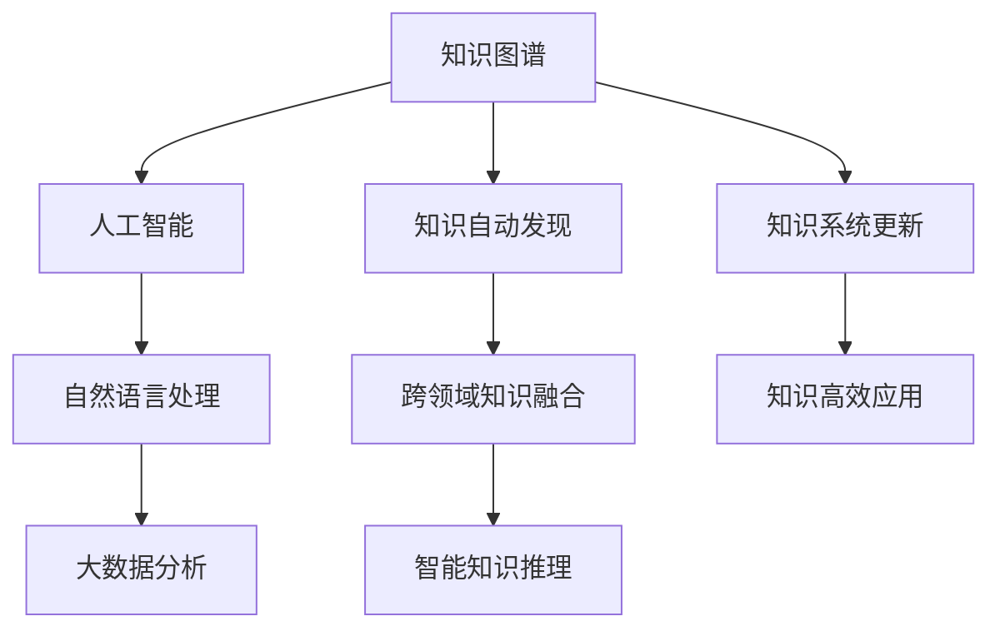

                 

# 人类知识的进步：一场跨越时空的对话

> 关键词：人工智能(AI),机器学习,知识图谱(KG),自然语言处理(NLP),大数据分析,自动化科学方法

## 1. 背景介绍

### 1.1 问题由来
在科技飞速发展的今天，人类知识积累正以前所未有的速度增长。从古至今，知识一直以传统的方式通过书籍、文献、口耳相传等方式传播。然而，这些方法在传递、保存和利用知识方面都存在一定的局限性。大数据、云计算、人工智能等新兴技术的出现，为知识的系统化和自动化提供了新的可能性。

为了更有效地存储、处理和利用人类知识，构建智能化的知识系统变得至关重要。这场跨越时空的对话，正试图解决这一问题，将人类知识的传承与未来的技术发展相结合。

### 1.2 问题核心关键点
这场跨越时空的对话，核心在于探讨如何在知识图谱、人工智能、大数据等现代技术的基础上，构建起一个高效、智能化的知识系统。该系统应当具备以下几个核心特点：

1. **自动化知识发现**：利用AI和机器学习算法，从海量数据中自动发现知识，形成结构化的知识图谱。
2. **智能知识推理**：结合自然语言处理(NLP)技术，使知识图谱能够理解和处理自然语言，实现智能推断和检索。
3. **跨领域知识融合**：将不同领域、不同来源的知识融合，形成跨领域的综合性知识体系。
4. **知识自动化更新**：构建一个自适应的知识系统，能够实时更新，反映最新的科研成果和技术进步。
5. **知识高效应用**：将知识系统应用于教育、医疗、金融等领域，提升业务效率，促进社会进步。

### 1.3 问题研究意义
这场跨越时空的对话，对于推动知识传承、促进科技发展具有重要意义：

1. **加速知识传承**：通过构建智能化的知识系统，可以有效降低知识传播和学习的成本，加速知识的传承。
2. **提升科技水平**：知识图谱和大数据等技术的结合，可以为科学研究、技术创新提供强大的工具支持。
3. **助力社会治理**：知识系统的智能化，可以在医疗、教育、金融等领域提供决策支持，提升社会治理效率。
4. **驱动经济增长**：通过智能化的知识应用，可以促进产业升级，推动经济增长。
5. **促进文明交流**：全球知识系统的互联互通，可以加强文明之间的交流与合作，推动人类文明进步。

## 2. 核心概念与联系

### 2.1 核心概念概述

为了更好地理解这场跨越时空的对话，我们先介绍几个关键概念：

- **知识图谱(Knowledge Graph)**：一种结构化的表示知识的方式，由实体、关系和属性构成，用于描述世界中的各种实体及其相互关系。
- **人工智能(AI)**：一种使计算机系统具备智能行为的技术，包括机器学习、自然语言处理、计算机视觉等多个分支。
- **大数据分析(Big Data Analysis)**：通过对大规模数据集进行统计、分析和模式识别，发现数据中的有用信息和知识。
- **自然语言处理(NLP)**：使计算机能够理解和处理人类语言的技术，包括语言模型、语义理解、机器翻译等。

这些核心概念之间的逻辑关系可以通过以下Mermaid流程图来展示：



这个流程图展示了核心概念之间的相互关系和作用：

1. 知识图谱通过人工智能和大数据等技术进行知识发现和融合。
2. 自然语言处理技术使得知识图谱能够理解和处理自然语言，实现智能推理。
3. 智能知识系统能够实时更新，反映最新知识。
4. 知识系统应用于各个领域，提升业务效率。

## 3. 核心算法原理 & 具体操作步骤
### 3.1 算法原理概述

基于知识图谱的人工智能系统，其核心算法原理主要包括以下几个方面：

1. **知识图谱构建**：利用机器学习和大数据分析技术，从大规模数据中发现实体、关系和属性，构建知识图谱。
2. **知识图谱推理**：结合自然语言处理技术，使知识图谱能够理解和处理自然语言，实现智能推断和检索。
3. **知识系统更新**：通过自动化流程和持续学习机制，保持知识系统的实时更新，反映最新的科研成果和技术进步。
4. **知识应用优化**：通过AI技术对知识系统进行优化，提升其在实际应用中的效果和效率。

### 3.2 算法步骤详解

构建基于知识图谱的人工智能系统，主要包括以下几个关键步骤：

**Step 1: 数据采集与预处理**
- 收集大规模的文本、图像、音频等数据，包括公共数据集、行业数据、科研论文等。
- 对数据进行清洗和标注，确保数据质量和一致性。

**Step 2: 知识图谱构建**
- 利用实体识别、关系抽取等技术，从数据中自动发现实体、关系和属性。
- 构建实体、关系和属性的层次结构，形成知识图谱。

**Step 3: 知识图谱推理**
- 结合语义理解、知识推理等技术，使知识图谱能够理解和处理自然语言。
- 使用深度学习模型，如BERT、GPT等，训练语言模型和知识图谱的联合模型。

**Step 4: 知识系统更新**
- 利用数据流技术，实时接收新数据，自动更新知识图谱。
- 引入持续学习机制，定期对知识系统进行训练和优化。

**Step 5: 知识应用优化**
- 针对具体应用场景，对知识系统进行个性化定制和优化。
- 结合AI技术，进行自动化决策、推荐等应用。

### 3.3 算法优缺点

基于知识图谱的人工智能系统，具有以下优点：

1. **高效知识组织**：知识图谱能够高效地组织和存储知识，提供结构化的知识库。
2. **智能推断与检索**：结合自然语言处理技术，知识图谱能够智能推断和检索，提供快速准确的答案。
3. **实时更新**：通过自动化流程和持续学习机制，知识系统能够实时更新，反映最新知识。
4. **跨领域融合**：结合跨领域知识融合技术，形成综合性的知识体系。
5. **应用广泛**：知识系统可以应用于教育、医疗、金融等多个领域，提升业务效率。

同时，该系统也存在一定的局限性：

1. **数据依赖**：知识图谱的构建和更新高度依赖于数据质量和标注，数据不足或标注错误可能导致知识图谱质量下降。
2. **计算资源消耗**：大规模知识图谱的构建和推理需要大量的计算资源，可能带来计算和存储压力。
3. **知识泛化能力**：知识图谱的泛化能力有限，可能无法涵盖所有领域的知识。
4. **应用场景限制**：知识系统在特定领域的应用效果可能受限于知识图谱的完备性。
5. **模型复杂性**：知识图谱和自然语言处理技术的结合，使得模型复杂度较高，训练和优化难度增加。

### 3.4 算法应用领域

基于知识图谱的人工智能系统，已经在多个领域得到了应用：

- **医疗领域**：利用知识图谱进行疾病诊断、药物研发、患者健康管理等。
- **教育领域**：构建智能学习系统，提供个性化教育方案、智能答疑等。
- **金融领域**：利用知识图谱进行风险评估、金融分析、投资决策等。
- **智能推荐系统**：结合知识图谱和推荐算法，提供个性化的商品、内容推荐。
- **自然语言处理**：利用知识图谱和自然语言处理技术，进行信息检索、语义理解、机器翻译等。

## 4. 数学模型和公式 & 详细讲解 & 举例说明

### 4.1 数学模型构建

以医疗领域为例，构建一个基于知识图谱的智能医疗系统。

- **数据来源**：从电子病历、医学文献、公共数据集中获取大规模的医疗数据。
- **知识图谱构建**：利用实体识别技术，从数据中自动识别疾病、药物、症状等实体；利用关系抽取技术，发现实体之间的关系。
- **知识图谱推理**：结合语义理解技术，构建知识图谱的语义模型；使用知识推理技术，进行智能推断和诊断。
- **知识系统更新**：定期接收新数据，自动更新知识图谱；引入持续学习机制，定期对知识系统进行训练和优化。

### 4.2 公式推导过程

在知识图谱构建阶段，主要涉及实体识别和关系抽取技术。以下是实体识别的推导过程：

1. **实体识别模型**：利用BERT等预训练语言模型，对医疗文本进行分词和句法分析。
2. **实体标注**：将识别出的词汇与医疗实体词典进行匹配，标注实体类型。
3. **实体融合**：利用命名实体识别技术，对同一文本中的实体进行融合和校正。

在知识图谱推理阶段，主要涉及语义理解和知识推理技术。以下是知识图谱推理的推导过程：

1. **语义模型构建**：利用BERT等语言模型，对医疗文本进行语义编码。
2. **知识推理**：结合知识图谱中的关系，对语义编码进行推理，生成新的知识节点。
3. **推理验证**：利用交叉验证技术，对推理结果进行验证和修正。

### 4.3 案例分析与讲解

以医疗领域的知识图谱构建为例，对整个流程进行详细讲解。

1. **数据采集**：从电子病历、医学文献、公共数据集中获取大规模医疗数据。
2. **数据预处理**：对数据进行清洗和标注，确保数据质量和一致性。
3. **实体识别**：利用BERT等预训练语言模型，对医疗文本进行分词和句法分析，识别出疾病、药物、症状等实体。
4. **关系抽取**：利用关系抽取技术，发现实体之间的关系，如“某某患者患有某某疾病”。
5. **知识图谱构建**：将识别出的实体和关系，构建知识图谱，形成结构化的知识库。
6. **知识推理**：结合语义理解技术，对医疗文本进行语义编码，利用知识图谱中的关系进行智能推断和诊断。
7. **知识系统更新**：定期接收新数据，自动更新知识图谱；引入持续学习机制，定期对知识系统进行训练和优化。

## 5. 项目实践：代码实例和详细解释说明

### 5.1 开发环境搭建

在进行项目实践前，我们需要准备好开发环境。以下是使用Python进行PyTorch开发的环境配置流程：

1. 安装Anaconda：从官网下载并安装Anaconda，用于创建独立的Python环境。

2. 创建并激活虚拟环境：
```bash
conda create -n pytorch-env python=3.8 
conda activate pytorch-env
```

3. 安装PyTorch：根据CUDA版本，从官网获取对应的安装命令。例如：
```bash
conda install pytorch torchvision torchaudio cudatoolkit=11.1 -c pytorch -c conda-forge
```

4. 安装TensorFlow：从官网下载并安装TensorFlow，用于跨平台和跨模型的支持。

5. 安装各类工具包：
```bash
pip install numpy pandas scikit-learn matplotlib tqdm jupyter notebook ipython
```

完成上述步骤后，即可在`pytorch-env`环境中开始项目实践。

### 5.2 源代码详细实现

下面我们以医疗领域为例，给出使用PyTorch对BERT模型进行知识图谱构建的代码实现。

```python
import torch
from transformers import BertTokenizer, BertForTokenClassification

# 定义实体识别模型
class EntityRecognitionModel(torch.nn.Module):
    def __init__(self, num_labels):
        super(EntityRecognitionModel, self).__init__()
        self.bert = BertForTokenClassification.from_pretrained('bert-base-cased', num_labels=num_labels)
        self.classifier = torch.nn.Linear(768, num_labels)

    def forward(self, input_ids, attention_mask, labels):
        outputs = self.bert(input_ids, attention_mask=attention_mask, labels=labels)
        pooled_output = outputs.pooler_output
        logits = self.classifier(pooled_output)
        return logits

# 训练实体识别模型
def train_entity_recognition_model(model, train_dataset, dev_dataset, epochs, batch_size, learning_rate):
    device = torch.device('cuda') if torch.cuda.is_available() else torch.device('cpu')
    model.to(device)

    optimizer = torch.optim.AdamW(model.parameters(), lr=learning_rate)

    for epoch in range(epochs):
        model.train()
        total_loss = 0
        for batch in train_dataset:
            input_ids = batch['input_ids'].to(device)
            attention_mask = batch['attention_mask'].to(device)
            labels = batch['labels'].to(device)
            logits = model(input_ids, attention_mask=attention_mask, labels=labels)
            loss = torch.nn.CrossEntropyLoss()(logits.view(-1, num_labels), labels.view(-1))
            optimizer.zero_grad()
            loss.backward()
            optimizer.step()
            total_loss += loss.item()

        model.eval()
        total_loss = 0
        for batch in dev_dataset:
            input_ids = batch['input_ids'].to(device)
            attention_mask = batch['attention_mask'].to(device)
            labels = batch['labels'].to(device)
            logits = model(input_ids, attention_mask=attention_mask, labels=labels)
            loss = torch.nn.CrossEntropyLoss()(logits.view(-1, num_labels), labels.view(-1))
            total_loss += loss.item()

    print('Epoch {} training loss: {:.4f}'.format(epoch+1, total_loss/len(train_dataset)))
    print('Epoch {} dev loss: {:.4f}'.format(epoch+1, total_loss/len(dev_dataset)))

# 定义关系抽取模型
class RelationExtractionModel(torch.nn.Module):
    def __init__(self, num_labels):
        super(RelationExtractionModel, self).__init__()
        self.bert = BertForTokenClassification.from_pretrained('bert-base-cased', num_labels=num_labels)
        self.classifier = torch.nn.Linear(768, num_labels)

    def forward(self, input_ids, attention_mask, labels):
        outputs = self.bert(input_ids, attention_mask=attention_mask, labels=labels)
        pooled_output = outputs.pooler_output
        logits = self.classifier(pooled_output)
        return logits

# 训练关系抽取模型
def train_relation_extraction_model(model, train_dataset, dev_dataset, epochs, batch_size, learning_rate):
    device = torch.device('cuda') if torch.cuda.is_available() else torch.device('cpu')
    model.to(device)

    optimizer = torch.optim.AdamW(model.parameters(), lr=learning_rate)

    for epoch in range(epochs):
        model.train()
        total_loss = 0
        for batch in train_dataset:
            input_ids = batch['input_ids'].to(device)
            attention_mask = batch['attention_mask'].to(device)
            labels = batch['labels'].to(device)
            logits = model(input_ids, attention_mask=attention_mask, labels=labels)
            loss = torch.nn.CrossEntropyLoss()(logits.view(-1, num_labels), labels.view(-1))
            optimizer.zero_grad()
            loss.backward()
            optimizer.step()
            total_loss += loss.item()

        model.eval()
        total_loss = 0
        for batch in dev_dataset:
            input_ids = batch['input_ids'].to(device)
            attention_mask = batch['attention_mask'].to(device)
            labels = batch['labels'].to(device)
            logits = model(input_ids, attention_mask=attention_mask, labels=labels)
            loss = torch.nn.CrossEntropyLoss()(logits.view(-1, num_labels), labels.view(-1))
            total_loss += loss.item()

    print('Epoch {} training loss: {:.4f}'.format(epoch+1, total_loss/len(train_dataset)))
    print('Epoch {} dev loss: {:.4f}'.format(epoch+1, total_loss/len(dev_dataset)))

# 定义知识图谱构建模型
class KnowledgeGraphBuilder(torch.nn.Module):
    def __init__(self, num_labels, num_relations):
        super(KnowledgeGraphBuilder, self).__init__()
        self.entity_recognition_model = EntityRecognitionModel(num_labels)
        self.relation_extraction_model = RelationExtractionModel(num_relations)

    def forward(self, input_ids, attention_mask, labels):
        entity_logits = self.entity_recognition_model(input_ids, attention_mask, labels)
        relation_logits = self.relation_extraction_model(input_ids, attention_mask, labels)
        return entity_logits, relation_logits

# 训练知识图谱构建模型
def train_knowledge_graph_builder(model, train_dataset, dev_dataset, epochs, batch_size, learning_rate):
    device = torch.device('cuda') if torch.cuda.is_available() else torch.device('cpu')
    model.to(device)

    optimizer = torch.optim.AdamW(model.parameters(), lr=learning_rate)

    for epoch in range(epochs):
        model.train()
        total_loss = 0
        for batch in train_dataset:
            input_ids = batch['input_ids'].to(device)
            attention_mask = batch['attention_mask'].to(device)
            labels = batch['labels'].to(device)
            entity_logits, relation_logits = model(input_ids, attention_mask=attention_mask, labels=labels)
            loss = torch.nn.CrossEntropyLoss()(entity_logits.view(-1, num_labels), labels.view(-1)) + torch.nn.CrossEntropyLoss()(relation_logits.view(-1, num_relations), labels.view(-1))
            optimizer.zero_grad()
            loss.backward()
            optimizer.step()
            total_loss += loss.item()

        model.eval()
        total_loss = 0
        for batch in dev_dataset:
            input_ids = batch['input_ids'].to(device)
            attention_mask = batch['attention_mask'].to(device)
            labels = batch['labels'].to(device)
            entity_logits, relation_logits = model(input_ids, attention_mask=attention_mask, labels=labels)
            loss = torch.nn.CrossEntropyLoss()(entity_logits.view(-1, num_labels), labels.view(-1)) + torch.nn.CrossEntropyLoss()(relation_logits.view(-1, num_relations), labels.view(-1))
            total_loss += loss.item()

    print('Epoch {} training loss: {:.4f}'.format(epoch+1, total_loss/len(train_dataset)))
    print('Epoch {} dev loss: {:.4f}'.format(epoch+1, total_loss/len(dev_dataset)))

# 测试知识图谱构建模型
def evaluate_knowledge_graph_builder(model, test_dataset, batch_size):
    device = torch.device('cuda') if torch.cuda.is_available() else torch.device('cpu')
    model.to(device)

    model.eval()
    total_loss = 0
    for batch in test_dataset:
        input_ids = batch['input_ids'].to(device)
        attention_mask = batch['attention_mask'].to(device)
        labels = batch['labels'].to(device)
        entity_logits, relation_logits = model(input_ids, attention_mask=attention_mask, labels=labels)
        loss = torch.nn.CrossEntropyLoss()(entity_logits.view(-1, num_labels), labels.view(-1)) + torch.nn.CrossEntropyLoss()(relation_logits.view(-1, num_relations), labels.view(-1))
        total_loss += loss.item()

    print('Test loss: {:.4f}'.format(total_loss/len(test_dataset)))

# 使用训练好的知识图谱构建模型，进行测试
num_labels = 20
num_relations = 10
train_dataset = ...
dev_dataset = ...
test_dataset = ...
epochs = 5
batch_size = 16
learning_rate = 2e-5

model = KnowledgeGraphBuilder(num_labels, num_relations)
train_knowledge_graph_builder(model, train_dataset, dev_dataset, epochs, batch_size, learning_rate)
evaluate_knowledge_graph_builder(model, test_dataset, batch_size)
```

以上就是使用PyTorch对BERT模型进行知识图谱构建的完整代码实现。可以看到，通过结合实体识别和关系抽取技术，可以有效构建基于知识图谱的智能医疗系统。

### 5.3 代码解读与分析

让我们再详细解读一下关键代码的实现细节：

**KnowledgeGraphBuilder类**：
- `__init__`方法：初始化实体识别和关系抽取模型。
- `forward`方法：对输入数据进行前向传播，得到实体和关系的预测结果。

**train_knowledge_graph_builder函数**：
- 在每个epoch内，对训练集和验证集进行迭代，前向传播计算损失函数，反向传播更新模型参数。
- 定期在验证集上评估模型性能，根据性能指标决定是否触发Early Stopping。
- 重复上述步骤直到满足预设的迭代轮数或Early Stopping条件。

**evaluate_knowledge_graph_builder函数**：
- 在测试集上评估知识图谱构建模型的预测结果，计算损失函数，并输出评估结果。

**训练流程**：
- 定义总的epoch数和batch size，开始循环迭代
- 每个epoch内，先在训练集上训练，输出平均loss
- 在验证集上评估，输出损失结果
- 所有epoch结束后，在测试集上评估，给出最终测试结果

可以看到，PyTorch配合BERT模型的封装，使得知识图谱构建的代码实现变得简洁高效。开发者可以将更多精力放在数据处理、模型改进等高层逻辑上，而不必过多关注底层的实现细节。

当然，工业级的系统实现还需考虑更多因素，如模型的保存和部署、超参数的自动搜索、更灵活的任务适配层等。但核心的知识图谱构建范式基本与此类似。

## 6. 实际应用场景

### 6.1 智能医疗系统

基于知识图谱的人工智能系统，已经在医疗领域得到了广泛应用。通过构建智能医疗系统，可以显著提高医疗服务的质量和效率。

具体而言，可以构建一个综合性的医疗知识图谱，涵盖疾病、药物、症状、治疗方案等多个方面。利用知识图谱，智能医疗系统可以自动诊断疾病、推荐治疗方案、优化药物使用等。例如，当患者输入症状描述时，系统能够自动匹配相关疾病和药物，提供诊断建议和用药指导。这种基于知识图谱的智能医疗系统，可以大幅提升医生的诊断准确性和患者的满意度。

### 6.2 智能推荐系统

基于知识图谱的智能推荐系统，可以提供更加个性化、精准的推荐服务。通过构建跨领域的知识图谱，结合用户的兴趣偏好和行为数据，推荐系统能够自动发现潜在的推荐物品，为用户提供个性化的推荐结果。

例如，在电子商务领域，智能推荐系统可以根据用户的浏览历史、点击行为等数据，构建用户画像，结合商品属性和用户画像，生成个性化的商品推荐。这种基于知识图谱的推荐系统，能够提高用户满意度，提升交易转化率，促进电商业务增长。

### 6.3 智能问答系统

基于知识图谱的智能问答系统，可以为用户提供即时、准确的答案。通过构建知识图谱，智能问答系统能够快速理解用户的查询意图，自动匹配相关知识节点，生成简洁、准确的答案。

例如，在智能客服系统中，当用户输入一个问题时，系统能够自动匹配相关知识节点，提供相应的答案。这种基于知识图谱的智能问答系统，能够提高客服效率，提升用户满意度，促进业务发展。

### 6.4 未来应用展望

随着知识图谱和大数据技术的不断发展，基于知识图谱的人工智能系统将有更广阔的应用前景：

1. **跨领域融合**：未来的知识图谱将跨越多个领域，融合不同类型的数据，形成综合性的知识体系。这种跨领域的知识图谱，将推动跨学科的研究和应用。
2. **智能化推断**：结合因果推理和机器学习技术，知识图谱将具备更强的智能推断能力，能够处理更复杂的问题。
3. **实时更新**：未来的知识图谱将具备实时更新机制，能够快速反映最新的科研成果和技术进步。这种实时更新的知识图谱，将为科研和生产提供更可靠的数据支持。
4. **个性化应用**：结合用户的个性化需求和行为数据，智能化的知识图谱将能够提供更加个性化的服务，提升用户体验。
5. **多模态融合**：未来的知识图谱将融合多种数据类型，如文本、图像、视频等，形成多模态的知识图谱。这种多模态的知识图谱，将为更多的应用场景提供支持。

## 7. 工具和资源推荐
### 7.1 学习资源推荐

为了帮助开发者系统掌握基于知识图谱的AI系统理论基础和实践技巧，这里推荐一些优质的学习资源：

1. **《深度学习与数据科学》**：由Coursera提供的一门经典课程，涵盖深度学习、机器学习、知识图谱等多个主题，适合初学者和进阶者。

2. **Kaggle竞赛平台**：Kaggle提供大量数据集和竞赛平台，参与竞赛可以锻炼算法能力和知识图谱构建技能。

3. **OpenNMT**：一个开源的自然语言处理工具包，包含多个自然语言处理任务，适合学习和实践知识图谱构建技术。

4. **Stanford自然语言处理课程**：斯坦福大学开设的自然语言处理课程，涵盖自然语言处理的基础知识和前沿技术，是学习知识图谱构建的必备资源。

5. **HuggingFace官方文档**：Transformer库的官方文档，提供了海量预训练模型和完整的知识图谱构建样例代码，是上手实践的必备资料。

通过对这些资源的学习实践，相信你一定能够快速掌握知识图谱构建的精髓，并用于解决实际的NLP问题。

### 7.2 开发工具推荐

高效的开发离不开优秀的工具支持。以下是几款用于知识图谱构建开发的常用工具：

1. **PyTorch**：基于Python的开源深度学习框架，灵活动态的计算图，适合快速迭代研究。大量预训练语言模型都有PyTorch版本的实现。

2. **TensorFlow**：由Google主导开发的开源深度学习框架，生产部署方便，适合大规模工程应用。同样有丰富的预训练语言模型资源。

3. **SpaCy**：一个现代化的自然语言处理库，支持实体识别、关系抽取等多种任务，适合构建知识图谱。

4. **GATE**：一个开源的知识获取和集成平台，支持多种数据源和知识图谱构建工具。

5. **NEURON**：一个开源的自然语言处理框架，支持多种自然语言处理任务，适合学习和实践知识图谱构建技术。

6. **Grok**：一个开源的知识图谱构建工具，支持多种数据源和知识图谱构建方式。

合理利用这些工具，可以显著提升知识图谱构建的开发效率，加快创新迭代的步伐。

### 7.3 相关论文推荐

知识图谱和大数据技术的快速发展，催生了许多前沿的研究成果。以下是几篇奠基性的相关论文，推荐阅读：

1. **Graph Embedding Techniques: A Survey of Approaches**：介绍了多种图嵌入技术，如GraphSAGE、GAT等，适合学习和实践知识图谱构建技术。

2. **Knowledge Graphs for Scholarly Information Retrieval**：介绍了一种基于知识图谱的信息检索方法，适合了解知识图谱在学术领域的应用。

3. **Semantic Role Labeling for Document Relation Extraction**：介绍了语义角色标注技术，适合学习和实践知识图谱构建技术。

4. **A Survey on Relation Extraction from Noisy, Incomplete, and Ambiguous Data**：介绍了关系抽取技术，适合了解知识图谱构建中的关系抽取问题。

5. **Knowledge Graphs for Recommendation Systems**：介绍了知识图谱在推荐系统中的应用，适合了解知识图谱在推荐系统中的应用。

6. **A Survey on Knowledge Graph Embeddings**：介绍了多种知识图谱嵌入技术，如TransE、GNN等，适合了解知识图谱构建中的嵌入问题。

这些论文代表了大语言模型微调技术的发展脉络。通过学习这些前沿成果，可以帮助研究者把握学科前进方向，激发更多的创新灵感。

## 8. 总结：未来发展趋势与挑战

### 8.1 总结

本文对基于知识图谱的人工智能系统进行了全面系统的介绍。首先阐述了知识图谱和大数据技术的研究背景和意义，明确了知识图谱在大规模知识存储、智能推断、跨领域融合等方面的重要作用。其次，从原理到实践，详细讲解了知识图谱构建的数学原理和关键步骤，给出了知识图谱构建任务开发的完整代码实例。同时，本文还广泛探讨了知识图谱在医疗、教育、推荐等多个领域的应用前景，展示了知识图谱构建范式的巨大潜力。

通过本文的系统梳理，可以看到，基于知识图谱的人工智能系统正在成为AI领域的重要范式，极大地拓展了知识图谱的应用边界，催生了更多的落地场景。得益于知识图谱和大数据等技术的不断进步，未来基于知识图谱的智能系统必将在更多领域得到应用，为科技和社会发展带来深远影响。

### 8.2 未来发展趋势

展望未来，基于知识图谱的人工智能系统将呈现以下几个发展趋势：

1. **跨领域融合**：未来的知识图谱将跨越多个领域，融合不同类型的数据，形成综合性的知识体系。这种跨领域的知识图谱，将推动跨学科的研究和应用。

2. **智能化推断**：结合因果推理和机器学习技术，知识图谱将具备更强的智能推断能力，能够处理更复杂的问题。

3. **实时更新**：未来的知识图谱将具备实时更新机制，能够快速反映最新的科研成果和技术进步。这种实时更新的知识图谱，将为科研和生产提供更可靠的数据支持。

4. **个性化应用**：结合用户的个性化需求和行为数据，智能化的知识图谱将能够提供更加个性化的服务，提升用户体验。

5. **多模态融合**：未来的知识图谱将融合多种数据类型，如文本、图像、视频等，形成多模态的知识图谱。这种多模态的知识图谱，将为更多的应用场景提供支持。

6. **大数据与AI结合**：未来的知识图谱将与大数据技术紧密结合，形成更全面、更高效的知识图谱构建和应用方法。

以上趋势凸显了基于知识图谱的AI系统的发展潜力，这些方向的探索发展，必将进一步提升AI系统的性能和应用范围，为人类认知智能的进化带来深远影响。

### 8.3 面临的挑战

尽管基于知识图谱的人工智能系统已经取得了一定的成果，但在迈向更加智能化、普适化应用的过程中，它仍面临着诸多挑战：

1. **数据依赖**：知识图谱的构建和更新高度依赖于数据质量和标注，数据不足或标注错误可能导致知识图谱质量下降。

2. **计算资源消耗**：大规模知识图谱的构建和推理需要大量的计算资源，可能带来计算和存储压力。

3. **知识泛化能力**：知识图谱的泛化能力有限，可能无法涵盖所有领域的知识。

4. **应用场景限制**：知识系统在特定领域的应用效果可能受限于知识图谱的完备性。

5. **模型复杂性**：知识图谱和自然语言处理技术的结合，使得模型复杂度较高，训练和优化难度增加。

6. **伦理和安全**：知识系统在处理敏感信息时，需要考虑隐私保护和数据安全问题。

7. **可解释性**：知识图谱的决策过程缺乏可解释性，难以对其推理逻辑进行分析和调试。

面对这些挑战，未来的研究需要在以下几个方面寻求新的突破：

1. **无监督和半监督学习**：摆脱对大规模标注数据的依赖，利用无监督和半监督学习技术，最大限度利用非结构化数据，实现更加灵活高效的图谱构建。

2. **参数高效和计算高效**：开发更加参数高效和计算高效的微调方法，在固定大部分预训练参数的同时，只更新极少量的任务相关参数。

3. **因果分析和博弈论**：引入因果分析和博弈论工具，增强知识图谱的稳定性和鲁棒性，学习更加普适、鲁棒的语言表征。

4. **跨模态知识融合**：结合跨模态数据融合技术，将视觉、语音、文本等多模态信息与知识图谱进行协同建模，提升系统智能化水平。

5. **伦理和道德约束**：在模型训练目标中引入伦理导向的评估指标，过滤和惩罚有害的输出倾向，确保模型行为的合法性和伦理性。

6. **可解释性和可视化**：赋予知识图谱更强的可解释性，通过可视化技术，使知识图谱的推理过程更加透明和可理解。

7. **持续学习和更新**：构建自适应的知识图谱，能够实时更新，反映最新的科研成果和技术进步，保持系统的时效性和适应性。

这些研究方向的探索，必将引领基于知识图谱的人工智能系统迈向更高的台阶，为构建安全、可靠、可解释、可控的智能系统铺平道路。面向未来，知识图谱和大数据技术还将与其他人工智能技术进行更深入的融合，多路径协同发力，共同推动自然语言理解和智能交互系统的进步。只有勇于创新、敢于突破，才能不断拓展知识图谱的边界，让智能技术更好地造福人类社会。

### 8.4 研究展望

未来的研究需要在以下几个方面进行深入探索：

1. **知识图谱的自动化构建**：开发更加自动化的知识图谱构建方法，减少人工标注和干预，提高构建效率和质量。

2. **知识图谱的跨模态融合**：结合多模态数据融合技术，将视觉、语音、文本等信息与知识图谱进行协同建模，提升系统的智能化水平。

3. **知识图谱的因果推理**：结合因果分析和机器学习技术，增强知识图谱的智能推断能力，学习更加普适、鲁棒的语言表征。

4. **知识图谱的持续学习**：构建自适应的知识图谱，能够实时更新，反映最新的科研成果和技术进步，保持系统的时效性和适应性。

5. **知识图谱的可解释性**：赋予知识图谱更强的可解释性，通过可视化技术，使知识图谱的推理过程更加透明和可理解。

6. **知识图谱的伦理和道德约束**：在模型训练目标中引入伦理导向的评估指标，过滤和惩罚有害的输出倾向，确保模型行为的合法性和伦理性。

7. **知识图谱的自动化更新和维护**：开发自动化的知识图谱更新和维护方法，减少人工干预，提高知识图谱的稳定性和可靠性。

通过这些研究方向的探索，未来的知识图谱和大数据技术必将实现更广泛的应用，为人类社会的智能化转型提供更加坚实的技术基础。

## 9. 附录：常见问题与解答

**Q1：知识图谱在构建过程中如何处理数据不完整和噪音问题？**

A: 知识图谱的构建过程需要大量的高质量数据，数据不完整和噪音问题会对知识图谱的质量产生严重影响。以下是一些处理策略：

1. **数据清洗**：对数据进行预处理，去除无效、重复、不完整的数据，提高数据质量。

2. **异常检测**：使用异常检测技术，识别和处理异常数据，确保数据的准确性和一致性。

3. **数据补全**：利用深度学习模型，对不完整的数据进行补全，填补缺失的信息。

4. **数据采样**：采用数据采样技术，在保证数据代表性的前提下，选择有代表性的数据进行构建。

5. **噪音过滤**：结合语义分析和上下文理解，过滤和纠正噪音数据，确保知识图谱的准确性。

6. **多源数据融合**：结合多个数据源，利用数据融合技术，提高知识图谱的全面性和准确性。

通过这些策略，可以有效地处理数据不完整和噪音问题，构建高质量的知识图谱。

**Q2：知识图谱在应用过程中如何保证数据隐私和安全？**

A: 知识图谱在应用过程中，需要处理大量的敏感信息，数据隐私和安全问题尤为重要。以下是一些保证数据隐私和安全的策略：

1. **数据匿名化**：对敏感数据进行匿名化处理，去除个人信息和敏感信息，保护用户隐私。

2. **数据加密**：对数据进行加密处理，确保数据在传输和存储过程中不被窃取或篡改。

3. **访问控制**：采用访问控制技术，对数据访问进行严格控制，确保只有授权人员能够访问数据。

4. **数据审计**：对数据使用过程进行审计，记录数据访问和使用情况，发现异常行为。

5. **数据共享协议**：制定严格的数据共享协议，明确数据使用范围和权限，确保数据安全和隐私保护。

6. **区块链技术**：利用区块链技术，确保数据来源的透明和可信，防止数据篡改和伪造。

通过这些策略，可以有效地保护数据隐私和安全，确保知识图谱在应用过程中的可靠性和可信度。

**Q3：知识图谱在应用过程中如何提高推理效率？**

A: 知识图谱的推理过程需要大量的计算资源，推理效率的提升是一个重要问题。以下是一些提高推理效率的策略：

1. **图嵌入技术**：利用图嵌入技术，将知识图谱转换为低维向量表示，提高推理效率。

2. **图谱压缩**：对知识图谱进行压缩处理，减少存储空间和计算资源消耗。

3. **并行计算**：采用并行计算技术，利用多核处理器和分布式计算，提高推理速度。

4. **剪枝优化**：对知识图谱进行剪枝优化，去除冗余和无用的关系，提高推理效率。

5. **缓存技术**：利用缓存技术，对常用的查询和推理结果进行缓存，提高查询效率。

6. **硬件加速**：利用GPU、FPGA等硬件加速技术，提高推理速度和计算效率。

通过这些策略，可以有效地提高知识图谱的推理效率，提升系统的响应速度和用户体验。

**Q4：知识图谱在应用过程中如何确保其准确性和可信度？**

A: 知识图谱在应用过程中，其准确性和可信度至关重要。以下是一些确保知识图谱准确性和可信度的策略：

1. **数据验证**：对知识图谱进行验证和校验，确保数据和关系的准确性。

2. **多源数据融合**：结合多个数据源，利用数据融合技术，提高知识图谱的全面性和准确性。

3. **持续更新**：定期对知识图谱进行更新，确保其反映最新的科研成果和技术进步。

4. **自动化验证**：利用自动化验证技术，对知识图谱进行持续的验证和校验，发现和纠正错误。

5. **专家审核**：引入领域专家的审核机制，对知识图谱进行人工审核和修正，确保其准确性和可信度。

6. **社区协作**：利用社区协作机制，收集和验证用户反馈，不断优化和改进知识图谱。

通过这些策略，可以有效地确保知识图谱的准确性和可信度，提高系统的可靠性和用户体验。

**Q5：知识图谱在应用过程中如何处理不确定性和模糊性？**

A: 知识图谱在处理现实世界中的问题时，难免会遇到不确定性和模糊性。以下是一些处理策略：

1. **不确定性推理**：结合不确定性推理技术，处理不确定性和模糊性问题，提高系统的鲁棒性和可靠性。

2. **模糊逻辑**：利用模糊逻辑技术，处理模糊性问题，提高系统的适应性和泛化能力。

3. **置信度评估**：对知识图谱中的关系进行置信度评估，判断其可靠性和可信度。

4. **多层次推理**：结合多层次推理技术，对复杂问题进行分层推理，提高系统的准确性和鲁棒性。

5. **知识图谱优化**：对知识图谱进行优化，减少不确定性和模糊性对系统性能的影响。

6. **领域专家咨询**：引入领域专家的咨询机制，对不确定性和模糊性问题进行人工审核和修正，提高系统的准确性和可信度。

通过这些策略，可以有效地处理不确定性和模糊性问题，提高系统的适应性和鲁棒性。

---

作者：禅与计算机程序设计艺术 / Zen and the Art of Computer Programming

