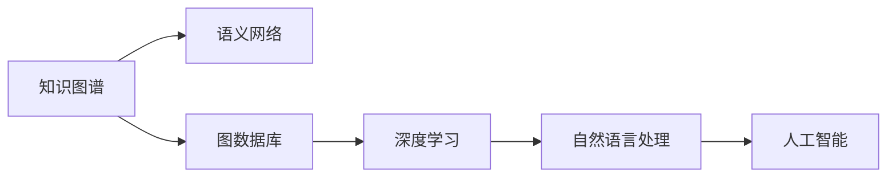

                 

# 人类知识的进步：一部探索历史

> 关键词：知识图谱,语义网络,图数据库,深度学习,自然语言处理,人工智能

## 1. 背景介绍

### 1.1 问题由来

随着信息技术的发展，人类知识积累的速度和规模呈现爆炸式增长。海量的数据和文献给知识的存储、管理、搜索和利用带来了巨大的挑战。传统的数据库和搜索技术已经无法满足现代知识管理的需求，亟需新的解决方案。

知识图谱(Knowledge Graph)技术应运而生。知识图谱是一种结构化的语义知识表示模型，通过将实体、属性和关系进行有机的组织和关联，实现了知识的深度挖掘和智能应用。其核心思想是将复杂多样的知识进行结构化处理，使其成为机器可理解和处理的结构化数据。

知识图谱的应用范围广泛，涵盖了科学、教育、医疗、商业等多个领域。通过知识图谱，可以构建智能问答系统、推荐系统、舆情分析、智能搜索等应用，大幅提升知识的应用价值和效率。

本文将从知识图谱的构建、应用和未来发展趋势等方面，全面系统地探讨人类知识的进步历程。通过深入挖掘知识图谱的原理和实践方法，展示其如何助力人类知识管理能力的提升。

### 1.2 问题核心关键点

知识图谱的核心问题在于如何高效地构建和维护知识网络，使其能够准确、全面地反映现实世界中的各种知识和关系。具体来说，包括以下几个关键问题：

1. **知识提取与融合**：从海量的文本、图像、音频等数据中自动提取结构化知识，并将其融入知识图谱。
2. **知识表示与存储**：将知识以语义化的方式进行表示，并存储在高效的数据结构中，便于查询和推理。
3. **知识推理与查询**：利用推理引擎对知识图谱进行查询和推理，获取逻辑上合理的知识结论。
4. **知识更新与维护**：动态更新和维护知识图谱，使其保持时效性和准确性。
5. **知识应用与评估**：将知识图谱应用于实际场景，评估其对知识管理带来的效益和效率提升。

解决这些问题，需要跨学科的协同努力，包括计算机科学、认知科学、语言学、哲学等多个领域的知识。本文将逐一探讨这些问题的解决方案，并展示其对知识图谱发展的贡献。

## 2. 核心概念与联系

### 2.1 核心概念概述

为了更好地理解知识图谱的原理和应用，本节将介绍几个核心概念：

- **知识图谱**：由节点和边组成的图结构，节点表示实体和属性，边表示实体间的关系。
- **语义网络**：一种基于知识的图结构，用于表示实体和属性间的语义关系。
- **图数据库**：一种基于图结构的数据库系统，用于存储和查询图结构数据。
- **深度学习**：一种基于神经网络的学习范式，通过模拟人类神经系统的机制，实现复杂模式的识别和推理。
- **自然语言处理**：一门研究人类语言和计算机语言相互作用的学科，目标是使计算机能够理解、生成和处理人类语言。
- **人工智能**：一门模拟人类智能的学科，旨在开发能够模拟人类智能的机器系统。

这些概念之间的联系可以通过以下Mermaid流程图来展示：



这个流程图展示了几大核心概念之间的联系：

1. 知识图谱构建在语义网络的基础上，通过深度学习和自然语言处理技术，将知识转化为语义化的图结构。
2. 图数据库提供高效的图结构存储和查询，是知识图谱的底层实现基础。
3. 深度学习和自然语言处理技术为知识图谱的构建和应用提供了强大的数据处理和知识表示能力。
4. 人工智能作为知识图谱的最终应用目标，实现了知识图谱在实际场景中的高效应用。

## 3. 核心算法原理 & 具体操作步骤

### 3.1 算法原理概述

知识图谱的构建过程可以分为两个主要步骤：知识表示和知识推理。知识表示是将知识转化为语义化的图结构；知识推理则是在知识图谱上利用逻辑规则进行查询和推理。

知识表示的原理在于将知识表示为实体、属性和关系，从而形成语义化的图结构。一般而言，实体表示为图中的节点，属性表示为节点的特征，关系表示为节点间的连接。常见的知识表示方法包括RDF、OWL、GraphDB等。

知识推理的原理在于利用图结构中的逻辑关系，通过推理引擎进行查询和推理，获取逻辑上合理的知识结论。常见的推理方法包括基于规则的推理、基于逻辑的推理、基于统计的推理等。

### 3.2 算法步骤详解

知识图谱的构建过程大致包括以下几个关键步骤：

**Step 1: 知识提取**

知识提取是知识图谱构建的第一步，主要从各类数据源中自动提取结构化知识。常用的数据源包括：

- 网页：通过网页爬虫获取网页内容，并利用自然语言处理技术提取实体、属性和关系。
- 数据库：通过ODBC等接口提取数据库中的结构化数据，并进行实体识别和关系抽取。
- 图像：通过计算机视觉技术提取图像中的实体、属性和关系，并进行实体识别和关系抽取。
- 音频：通过语音识别技术提取音频中的实体、属性和关系，并进行实体识别和关系抽取。

**Step 2: 知识融合**

知识融合是将不同来源的知识进行融合，形成一个统一的知识图谱。常见的知识融合方法包括：

- 实体对齐：通过姓名、地址、电话等关键属性，将不同来源的实体进行对齐。
- 关系对齐：通过关系类型、关系强度等特征，将不同来源的关系进行对齐。
- 实体和关系标注：利用众包、标注等方式，对实体和关系进行标注，纠正错误的实体和关系。

**Step 3: 知识表示**

知识表示是将知识以语义化的方式进行表示，并存储在图数据库中。常用的知识表示方法包括：

- RDF：使用资源、属性和关系进行知识表示，支持强大的语义查询和推理。
- OWL：使用类、属性和关系进行知识表示，支持更丰富的语义建模和推理。
- GraphDB：使用图结构进行知识表示，支持高效的存储和查询。

**Step 4: 知识推理**

知识推理是在知识图谱上利用逻辑规则进行查询和推理，获取逻辑上合理的知识结论。常用的知识推理方法包括：

- 基于规则的推理：利用预设的推理规则，进行精确的逻辑推理。
- 基于逻辑的推理：利用逻辑表达式进行推理，支持更灵活的推理方式。
- 基于统计的推理：利用机器学习算法进行推理，支持更高效的推理过程。

### 3.3 算法优缺点

知识图谱技术在知识管理中具有以下优点：

1. **知识结构化**：将复杂多样的知识进行结构化处理，使其成为机器可理解和处理的结构化数据。
2. **知识全面性**：利用语义化的表示方法，全面覆盖现实世界中的各种知识和关系。
3. **知识灵活性**：支持多种数据源的自动提取和融合，适应不同的应用场景。
4. **知识高效性**：利用图数据库的高效存储和查询能力，提高知识管理的效率和性能。

但同时，知识图谱技术也存在一些局限性：

1. **数据质量依赖**：知识图谱的准确性和全面性高度依赖数据源的质量，难以保证数据的全面性和准确性。
2. **模型复杂性**：知识图谱的构建和维护需要复杂的算法和模型，技术难度较高。
3. **推理限制**：基于规则的推理方法存在一定的局限性，难以处理复杂的逻辑推理任务。

### 3.4 算法应用领域

知识图谱技术已经在多个领域得到了广泛的应用，涵盖了科学、教育、医疗、商业等多个领域。

- **科学领域**：通过知识图谱，实现科学知识的组织和管理，加速科学研究和知识发现。
- **教育领域**：利用知识图谱构建智能学习系统，提供个性化推荐和智能辅导。
- **医疗领域**：构建医疗知识图谱，辅助医生诊疗，提升医疗服务的智能化水平。
- **商业领域**：通过知识图谱进行市场分析、客户关系管理、推荐系统等应用，提升商业决策的智能化水平。

此外，知识图谱技术还被创新性地应用于更多场景中，如智能搜索、舆情分析、智能客服等，为各行各业带来了新的技术突破。

## 4. 数学模型和公式 & 详细讲解 & 举例说明

### 4.1 数学模型构建

知识图谱的数学模型主要包括图结构、节点、属性和关系等概念。

- **图结构**：由节点和边组成的图结构，其中节点表示实体和属性，边表示实体间的关系。
- **节点**：表示知识图谱中的实体和属性，节点之间通过关系进行连接。
- **属性**：表示节点的特征，如实体名称、属性值等。
- **关系**：表示节点之间的连接，如"是…的"、"有…"等。

知识图谱的数学表示可以使用图数据库进行存储和查询，常用的图数据库包括Neo4j、ArangoDB等。

### 4.2 公式推导过程

知识图谱的推理过程可以表示为一系列的查询和推理操作。常见的推理操作包括：

- **节点查询**：查询图中的特定节点，如"所有医生的名字"。
- **路径查询**：查询图中的特定路径，如"从疾病到治疗的路径"。
- **逻辑推理**：利用逻辑规则进行推理，如"如果有医生治疗了病人，则医生是病人的主治医生"。

以节点查询为例，其推导过程如下：

假设知识图谱中有如下节点和关系：

```
Alice (人名) -> 职业 -> 医生
Bob (人名) -> 职业 -> 教师
Alice -> 朋友 -> Bob
```

查询"所有医生的名字"的操作可以表示为：

1. 查询Alice节点的"朋友"关系。
2. 在"朋友"关系中查询Bob节点。
3. 将Alice和Bob节点的名称作为查询结果。

查询过程可以使用SPARQL语言进行表达，示例如下：

```SPARQL
SELECT ?name WHERE { 
    ?Alice <朋友> ?Bob . 
    ?Bob <职业> 医生 .
    ?Alice <名字> ?name .
    FILTER (?Alice <职业> 医生) 
}
```

### 4.3 案例分析与讲解

以医疗领域为例，知识图谱的应用可以显著提升医疗服务的智能化水平。构建医疗知识图谱的过程大致包括以下几个步骤：

**Step 1: 知识提取**

利用网页爬虫获取医学文献、医疗网站、临床数据等，通过自然语言处理技术提取实体、属性和关系。常见的实体包括疾病、症状、药物、手术等。

**Step 2: 知识融合**

利用实体对齐和关系对齐等方法，将不同来源的知识进行融合，形成一个统一的医疗知识图谱。例如，利用疾病名称和属性值进行实体对齐，利用症状和治疗方法进行关系对齐。

**Step 3: 知识表示**

使用OWL等语义化表示方法，将医疗知识图谱存储在图数据库中，支持高效的存储和查询。例如，利用OWL类和属性进行实体和关系的表示。

**Step 4: 知识推理**

利用逻辑规则进行推理，获取逻辑上合理的医疗结论。例如，利用SymPy等符号计算工具进行药物相互作用和副作用的推理，利用owlapi等工具进行医疗知识的查询和推理。

## 5. 项目实践：代码实例和详细解释说明

### 5.1 开发环境搭建

在进行知识图谱的开发实践前，我们需要准备好开发环境。以下是使用Python进行知识图谱开发的常见环境配置流程：

1. 安装Anaconda：从官网下载并安装Anaconda，用于创建独立的Python环境。

2. 创建并激活虚拟环境：
```bash
conda create -n graph-env python=3.8 
conda activate graph-env
```

3. 安装必要的库：
```bash
conda install py2neo graph-tool pandas
```

完成上述步骤后，即可在`graph-env`环境中开始知识图谱的开发实践。

### 5.2 源代码详细实现

这里以构建一个简单的医疗知识图谱为例，展示知识图谱的构建过程。

首先，定义知识图谱的节点和关系：

```python
from py2neo import Graph, Node, Relationship

# 创建图数据库连接
graph = Graph("http://localhost:7474/db/data/")

# 定义节点和关系
disease_node = Node("Disease", name="感冒")
symptom_node = Node("Symptom", name="发烧")
medicine_node = Node("Medicine", name="阿司匹林")
treatment_node = Node("Treatment", name="退烧药")
side_effect_node = Node("SideEffect", name="胃痛")

# 定义节点关系
graph.create((disease_node, "症状", symptom_node))
graph.create((symptom_node, "治疗", treatment_node))
graph.create((treatment_node, "药物", medicine_node))
graph.create((medicine_node, "副作用", side_effect_node))

# 查询所有疾病名称
query = "MATCH (d:Disease)-[:症状]->(s:Symptom) RETURN d.name"
result = graph.run(query)
for record in result:
    print(record["d"]["name"])
```

然后，定义知识图谱的推理过程：

```python
from py2neo import cypher

# 查询治疗副作用的药物
query = "MATCH (d:Disease)-[:症状]->(s:Symptom)-[:治疗]->(t:治疗)->(m:药物)<-[:副作用]-(sse:副作用) RETURN m.name"
result = graph.run(query)
for record in result:
    print(record["m"]["name"])
```

运行上述代码，即可构建医疗知识图谱，并利用图数据库进行查询和推理。

### 5.3 代码解读与分析

**节点定义和关系建立**：
- 使用`Node`类定义节点，并设置节点的类型和属性。
- 使用`Relationship`类定义节点之间的关系，并进行关系类型的设置。
- 使用`graph.create()`方法将节点和关系添加到图数据库中。

**查询和推理**：
- 使用`cypher`库进行Cypher查询语言操作，利用`MATCH`、`RETURN`等关键字进行节点和关系的查询。
- 使用`graph.run()`方法执行查询，并返回结果。
- 利用循环遍历结果，输出查询结果。

通过上述代码，可以直观地展示知识图谱的构建和查询过程。知识图谱的应用范围广泛，开发者可以根据具体需求设计不同领域的知识图谱，实现高效的查询和推理。

## 6. 实际应用场景

### 6.1 智能问答系统

智能问答系统是一种基于知识图谱的智能应用，通过自动问答技术，帮助用户快速获取所需信息。利用知识图谱，可以构建高度结构化的知识库，通过自然语言处理技术，实现智能化的问答过程。

以医疗领域的智能问答系统为例，知识图谱可以包含疾病的定义、症状、治疗、药物等信息。用户输入症状后，系统可以自动推荐相应的治疗方案和药物。这种智能问答系统可以显著提升医疗服务的智能化水平，降低医生的工作压力。

### 6.2 个性化推荐系统

个性化推荐系统是一种基于知识图谱的智能推荐技术，通过构建用户兴趣图谱，实现精准的个性化推荐。利用知识图谱，可以挖掘用户的多元兴趣，结合商品的属性和关系，实现更精准的推荐。

以电商领域的个性化推荐系统为例，知识图谱可以包含商品的属性、关系和用户的行为数据。通过分析用户的行为和兴趣，系统可以推荐用户可能感兴趣的商品。这种推荐系统可以显著提升用户的购物体验，增加销售额。

### 6.3 舆情分析

舆情分析是一种基于知识图谱的情感分析技术，通过构建舆情知识图谱，分析用户对某个事件或话题的情感倾向。利用知识图谱，可以整合多渠道的数据，进行全面的舆情分析。

以社交媒体的舆情分析为例，知识图谱可以包含用户、事件、话题等信息。通过分析用户对某个事件的情感倾向，系统可以预测舆情的走向，为政府和企业提供决策支持。这种舆情分析技术可以显著提升社会治理的智能化水平。

### 6.4 未来应用展望

随着知识图谱技术的不断发展，未来将在更多领域得到应用，为各行各业带来变革性影响。

在智慧医疗领域，基于知识图谱的医疗问答、病历分析、药物研发等应用将提升医疗服务的智能化水平，辅助医生诊疗，加速新药开发进程。

在智能教育领域，利用知识图谱构建智能学习系统，提供个性化推荐和智能辅导，因材施教，促进教育公平，提高教学质量。

在智慧城市治理中，利用知识图谱进行城市事件监测、舆情分析、应急指挥等环节，提高城市管理的自动化和智能化水平，构建更安全、高效的未来城市。

此外，在企业生产、社会治理、文娱传媒等众多领域，知识图谱技术也将不断涌现，为经济社会发展注入新的动力。相信随着技术的日益成熟，知识图谱必将在构建人机协同的智能时代中扮演越来越重要的角色。

## 7. 工具和资源推荐

### 7.1 学习资源推荐

为了帮助开发者系统掌握知识图谱的理论基础和实践技巧，这里推荐一些优质的学习资源：

1. 《知识图谱：构建、查询与推理》系列博文：由知识图谱专家撰写，深入浅出地介绍了知识图谱的构建、查询和推理方法。

2. 《面向知识图谱的深度学习》课程：斯坦福大学开设的NLP明星课程，介绍了基于深度学习的知识图谱构建和应用。

3. 《知识图谱设计与实现》书籍：全面介绍了知识图谱的设计和实现方法，涵盖了知识提取、融合、表示和推理等多个方面。

4. 《LinkedData》书籍：介绍了语义Web和知识图谱的基本概念和应用，提供了丰富的实例和案例。

5. 《GraphDatabases》书籍：介绍了图形数据库的基本概念和应用，涵盖了图结构的数据存储和查询。

通过对这些资源的学习实践，相信你一定能够快速掌握知识图谱的精髓，并用于解决实际的NLP问题。

### 7.2 开发工具推荐

高效的开发离不开优秀的工具支持。以下是几款用于知识图谱开发的常用工具：

1. PyTorch：基于Python的开源深度学习框架，灵活动态的计算图，适合快速迭代研究。

2. TensorFlow：由Google主导开发的开源深度学习框架，生产部署方便，适合大规模工程应用。

3. Graph-tool：一个基于Python的图处理库，提供了高效的图算法和数据结构。

4. Neo4j：一个基于Cypher查询语言的图数据库系统，支持高效的图结构存储和查询。

5. Amazon Neptune：AWS提供的图数据库服务，支持大规模的图形处理和查询。

6. Visual Graph：一个可视化图数据库工具，支持图形的交互式分析和查询。

合理利用这些工具，可以显著提升知识图谱的开发效率，加快创新迭代的步伐。

### 7.3 相关论文推荐

知识图谱技术的发展源于学界的持续研究。以下是几篇奠基性的相关论文，推荐阅读：

1. 《The Web of Trust and Knowledge: Design and Evolution of the WWW》：介绍了Web上的信任和知识图谱的基本概念和应用。

2. 《The Knowledge Graph: Semantic Networks of Real-World Entities》：提出知识图谱的概念，并介绍了如何构建知识图谱。

3. 《Fact Machines: Knowledge Graph Machine Learning》：介绍了基于深度学习的知识图谱构建和应用。

4. 《Knowledge Graph Embeddings: A Survey and Meta-Analysis》：全面综述了知识图谱的嵌入表示方法，提供了丰富的实例和案例。

5. 《A Survey on Knowledge Graph Construction and Maintenance》：介绍了知识图谱的构建和维护方法，涵盖了知识提取、融合、表示和推理等多个方面。

这些论文代表了大语言模型微调技术的发展脉络。通过学习这些前沿成果，可以帮助研究者把握学科前进方向，激发更多的创新灵感。

## 8. 总结：未来发展趋势与挑战

### 8.1 总结

本文对知识图谱的构建、应用和未来发展趋势进行了全面系统的介绍。首先阐述了知识图谱在知识管理中的重要性，明确了知识图谱在构建高效知识网络中的核心地位。其次，从原理到实践，详细讲解了知识图谱的构建方法，展示了知识图谱在实际应用中的多种场景。最后，展望了知识图谱技术的未来发展趋势，指出了其在多个领域的应用前景。

通过本文的系统梳理，可以看到，知识图谱技术在知识管理中具有不可替代的作用，能够将复杂多样的知识进行结构化处理，使其成为机器可理解和处理的结构化数据。未来，随着知识图谱技术的不断发展，必将在更多领域得到应用，为人类知识的进步带来新的突破。

### 8.2 未来发展趋势

展望未来，知识图谱技术将呈现以下几个发展趋势：

1. **知识表示自动化**：利用自然语言处理技术，自动从文本数据中提取知识和关系，提高知识图谱的构建效率。
2. **知识推理智能化**：利用深度学习和符号计算技术，实现更智能、更高效的推理过程，支持更复杂的逻辑推理任务。
3. **知识图谱分布式**：利用分布式计算和存储技术，构建大规模的知识图谱，支持更广泛的应用场景。
4. **知识图谱语义化**：利用语义化的表示方法，提高知识图谱的易用性和可理解性，方便用户进行查询和推理。
5. **知识图谱跨模态**：利用跨模态信息融合技术，实现多源数据的整合和协同建模，提升知识图谱的全面性和准确性。

这些趋势凸显了知识图谱技术的广阔前景，将进一步提升知识图谱在各领域的智能化水平和应用效果。

### 8.3 面临的挑战

尽管知识图谱技术已经取得了瞩目成就，但在迈向更加智能化、普适化应用的过程中，它仍面临着诸多挑战：

1. **数据质量问题**：知识图谱的构建高度依赖数据源的质量，难以保证数据的全面性和准确性。
2. **推理复杂性**：基于规则的推理方法存在一定的局限性，难以处理复杂的逻辑推理任务。
3. **模型复杂性**：知识图谱的构建和维护需要复杂的算法和模型，技术难度较高。
4. **实时更新**：知识图谱需要动态更新和维护，才能保持时效性和准确性。

### 8.4 研究展望

面对知识图谱面临的这些挑战，未来的研究需要在以下几个方面寻求新的突破：

1. **自动化知识提取**：利用自然语言处理技术，自动从文本数据中提取知识和关系，提高知识图谱的构建效率。
2. **智能推理方法**：利用深度学习和符号计算技术，实现更智能、更高效的推理过程，支持更复杂的逻辑推理任务。
3. **分布式知识图谱**：利用分布式计算和存储技术，构建大规模的知识图谱，支持更广泛的应用场景。
4. **语义化表示方法**：利用语义化的表示方法，提高知识图谱的易用性和可理解性，方便用户进行查询和推理。
5. **跨模态数据融合**：利用跨模态信息融合技术，实现多源数据的整合和协同建模，提升知识图谱的全面性和准确性。

这些研究方向的探索，必将引领知识图谱技术迈向更高的台阶，为构建人机协同的智能系统铺平道路。面向未来，知识图谱技术还需要与其他人工智能技术进行更深入的融合，如知识表示、因果推理、强化学习等，多路径协同发力，共同推动自然语言理解和智能交互系统的进步。只有勇于创新、敢于突破，才能不断拓展语言模型的边界，让智能技术更好地造福人类社会。

## 9. 附录：常见问题与解答

**Q1：知识图谱如何高效构建？**

A: 知识图谱的构建可以采用自动化的方式，利用自然语言处理技术，从大规模文本数据中自动提取实体、属性和关系。具体步骤如下：

1. 利用分词、命名实体识别等技术，从文本中提取实体。
2. 利用依存句法分析、关系抽取等技术，从实体间的关系中提取属性和关系。
3. 利用实体对齐、关系对齐等技术，将不同来源的知识进行融合。
4. 利用知识图谱工具，将提取的知识进行语义化的表示和存储。

**Q2：知识图谱的推理有哪些方法？**

A: 知识图谱的推理方法主要包括基于规则的推理、基于逻辑的推理和基于统计的推理等。

1. 基于规则的推理：利用预设的推理规则，进行精确的逻辑推理。
2. 基于逻辑的推理：利用逻辑表达式进行推理，支持更灵活的推理方式。
3. 基于统计的推理：利用机器学习算法进行推理，支持更高效的推理过程。

**Q3：知识图谱在医疗领域的应用场景有哪些？**

A: 知识图谱在医疗领域的应用场景广泛，主要包括：

1. 医学知识图谱：构建医学领域的知识图谱，用于医学知识的组织和管理。
2. 医疗问答系统：利用知识图谱构建医疗问答系统，帮助医生快速获取所需信息。
3. 病历分析系统：利用知识图谱进行病历数据的分析和挖掘，辅助医生诊疗。
4. 药物推荐系统：利用知识图谱进行药物的推荐和副作用分析，提高药物治疗的精准度。

**Q4：知识图谱有哪些数据源？**

A: 知识图谱的数据源广泛，主要包括：

1. 网页：利用网页爬虫获取网页内容，并进行实体识别和关系抽取。
2. 数据库：通过ODBC等接口提取数据库中的结构化数据，并进行实体识别和关系抽取。
3. 图像：通过计算机视觉技术提取图像中的实体、属性和关系，并进行实体识别和关系抽取。
4. 音频：通过语音识别技术提取音频中的实体、属性和关系，并进行实体识别和关系抽取。

这些数据源为知识图谱的构建提供了丰富的数据支持，推动了知识图谱技术的发展和应用。

**Q5：知识图谱的应用有哪些？**

A: 知识图谱的应用范围广泛，涵盖了科学、教育、医疗、商业等多个领域。具体包括：

1. 科学领域：通过知识图谱实现科学知识的组织和管理，加速科学研究和知识发现。
2. 教育领域：利用知识图谱构建智能学习系统，提供个性化推荐和智能辅导。
3. 医疗领域：构建医疗知识图谱，辅助医生诊疗，提升医疗服务的智能化水平。
4. 商业领域：通过知识图谱进行市场分析、客户关系管理、推荐系统等应用，提升商业决策的智能化水平。

此外，知识图谱技术还被创新性地应用于更多场景中，如智能搜索、舆情分析、智能客服等，为各行各业带来了新的技术突破。

---
作者：禅与计算机程序设计艺术 / Zen and the Art of Computer Programming

