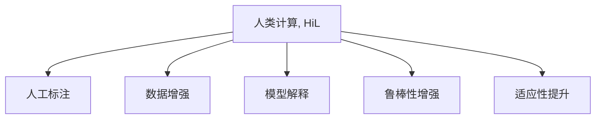

                 

# 人类计算在AI行业中的应用

在人工智能（AI）技术飞速发展的今天，"人类计算"（Human-in-the-loop, HiL）的概念正在被越来越多地提及。AI不仅仅是全自动的机器智能，而是一种与人共生的智能。人类计算就是在AI系统中加入人类参与的环节，使AI和人类协作完成某些任务，进而提升AI系统的整体性能。

本文将系统地介绍人类计算在AI行业中的核心概念、核心算法、具体应用及未来发展趋势，以期为业内人士提供深入的理解和指导。

## 1. 背景介绍

### 1.1 问题由来

在AI技术的发展历程中，机器学习和深度学习是两大核心技术。它们通过学习历史数据，构建复杂的数学模型，从而实现自主决策。但这些模型往往面临数据稀缺、模型黑盒、鲁棒性差等问题。

人类计算的引入，就是为了解决这些问题，使AI更加智能、可解释、鲁棒，并在实际应用中具有更高的适应性和灵活性。

### 1.2 问题核心关键点

在AI系统中引入人类计算，可以解决以下关键问题：

- 数据稀缺：通过人工标注、数据合成等方式，在AI系统中引入更多样化、更丰富的数据。
- 模型黑盒：通过人的参与解释和调整模型，使其更具可解释性。
- 鲁棒性差：人类可以通过介入，调整AI系统的决策过程，使其在面对复杂、多变的场景时表现更稳定。
- 适应性强：人类可以根据具体任务和需求，及时调整AI系统的工作方式，使其能够灵活应对新情况。

## 2. 核心概念与联系

### 2.1 核心概念概述

为更好地理解人类计算在AI系统中的应用，本节将介绍几个关键概念：

- 人类计算（Human-in-the-loop, HiL）：通过人的参与，与AI系统共同完成任务，提升系统性能。

- 人工标注（Annotation）：通过人工对数据进行标记和注释，使AI系统更好地理解数据。

- 数据增强（Data Augmentation）：通过各种方式增加数据的多样性，提升AI系统泛化能力。

- 模型解释（Model Interpretation）：通过人类对模型的解释和调整，提升模型的可解释性和透明度。

- 鲁棒性增强（Robustness Enhancement）：通过人类干预，使AI系统在面对噪声、攻击等干扰时表现更稳定。

- 适应性提升（Adaptability Improvement）：通过人类参与，使AI系统根据具体任务和需求进行动态调整。

这些核心概念之间的逻辑关系可以通过以下Mermaid流程图来展示：



这个流程图展示了大模型微调的各个关键环节：

1. 在AI系统中引入人工参与，进行数据标注、数据合成等处理。
2. 利用人工标注和数据增强提升AI系统的泛化能力。
3. 通过人工对模型进行解释和调整，提升模型的可解释性。
4. 增强AI系统的鲁棒性，使其在面对噪声和攻击时表现稳定。
5. 提升AI系统的适应性，使其根据具体任务和需求灵活调整。

## 3. 核心算法原理 & 具体操作步骤

### 3.1 算法原理概述

人类计算的核心原理是“AI + Human”的协作。其核心思想是：将复杂、多变的任务分解为若干子任务，由AI系统负责自动完成简单、重复的子任务，而复杂、多变的子任务则由人机协作完成。

形式化地，假设一个复杂任务可以分解为$N$个子任务，每个子任务分别由不同的AI模块和人类完成。则任务完成可以表示为：

$$
\text{Task} = \bigoplus_{i=1}^{N} \text{Task}_i = \bigoplus_{i=1}^{N} (\text{AI}_i \oplus \text{Human}_i)
$$

其中 $\oplus$ 表示任务的具体实现方式，$\text{AI}_i$ 表示AI模块，$\text{Human}_i$ 表示人机协作过程。

### 3.2 算法步骤详解

人类计算的核心步骤包括：数据处理、模型训练、任务执行、结果反馈。以下是详细步骤：

**Step 1: 数据处理**
- 收集和预处理数据，生成标注样本，准备用于AI系统训练和测试。
- 设计合理的数据标注流程，确保标注质量和多样性。
- 引入数据增强技术，生成更多训练样本，提升泛化能力。

**Step 2: 模型训练**
- 选择适当的AI算法，如深度学习、强化学习、进化算法等。
- 训练AI模型，使其具备特定的任务处理能力。
- 设计适当的损失函数，量化任务完成情况。

**Step 3: 任务执行**
- 将任务分解为若干子任务，并定义每个子任务的具体执行方式。
- 将子任务分配给AI模块和人类协作完成。
- 监控任务执行过程，根据实际情况进行动态调整。

**Step 4: 结果反馈**
- 评估任务完成情况，通过人工方式进行反馈。
- 根据反馈结果，调整AI模块和人类协作方式。
- 逐步提高AI系统的自主决策能力，减少人类参与。

### 3.3 算法优缺点

人类计算具有以下优点：

- 提高系统性能：通过人机协作，AI系统可以更好地理解任务，提升决策准确性和鲁棒性。
- 增强系统可解释性：人类可以解释和调整AI决策过程，提升系统的透明度和可信度。
- 提升系统适应性：人类可以根据具体任务需求，动态调整AI系统的行为。

同时，人类计算也存在一定的局限性：

- 依赖人工参与：对人类参与的依赖较大，无法在所有场景下实现完全自动化。
- 人工成本高：数据标注和模型解释等环节需要大量人工参与，成本较高。
- 人机协作复杂：协作过程中需要协调好AI和人类的关系，难以在所有场景下达到理想效果。

尽管存在这些局限性，但就目前而言，人类计算在大数据、复杂任务、需要高可信度等场景下具有显著的优势。未来相关研究的重点在于如何进一步降低对人工的依赖，提高协作效率，同时兼顾可解释性和鲁棒性等因素。

### 3.4 算法应用领域

人类计算已在多个领域得到应用，例如：

- 自然语言处理（NLP）：在机器翻译、文本生成、问答系统等任务中，引入人工参与进行语义理解、情感分析等复杂环节。
- 计算机视觉（CV）：在目标检测、图像分割、场景理解等任务中，引入人工参与进行复杂场景识别和标注。
- 机器人学：在导航、抓取、决策等任务中，引入人工参与进行路径规划、行为解释等复杂环节。
- 医疗诊断：在疾病诊断、影像分析等任务中，引入人工参与进行复杂的病例分析、影像解释等环节。
- 金融风控：在信用评估、欺诈检测等任务中，引入人工参与进行复杂的规则设计、风险解释等环节。

除了这些传统领域，人类计算也在更多新兴领域得到应用，如智能交通、智慧城市、工业自动化等，为各行业带来颠覆性创新。

## 4. 数学模型和公式 & 详细讲解 & 举例说明

### 4.1 数学模型构建

人类计算的核心模型可以抽象为一个包含多个AI模块和人类模块的协作网络，数学上可以表示为：

$$
\text{Output} = \bigoplus_{i=1}^{N} \text{Output}_i = \bigoplus_{i=1}^{N} (\text{AI}_{i}(\text{Input}, \text{AI}_{i-1}(\text{Input}, \text{Human}_i(\text{AI}_{i-1}(\text{Input})))
$$

其中 $\text{Input}$ 表示原始输入，$\text{Output}$ 表示最终输出，$\text{AI}_i$ 表示第$i$个AI模块，$\text{Human}_i$ 表示第$i$个人类模块。

### 4.2 公式推导过程

以一个简单的问答系统为例，展示人类计算的数学推导过程：

假设输入为问题 $Q$，原始输出为答案 $A$。假设系统分为两个步骤：

1. AI模块进行初步的意图理解，输出为 $A'$。
2. 人类根据 $A'$ 进行进一步的意图澄清和确认，输出为 $A''$。

则系统输出的数学模型可以表示为：

$$
\text{Output} = \text{Human}(A')
$$

在公式中，$A'$ 表示AI模块的初步理解，$A''$ 表示人类的进一步澄清。

### 4.3 案例分析与讲解

以谷歌的图像搜索系统为例，展示人类计算的应用。谷歌的图像搜索系统通过AI模型初步识别图像内容，并生成初步的标签和描述。然后，通过人类专家对标签和描述进行审核和调整，最终生成更为准确的搜索结果。

具体步骤如下：

1. AI模型对图像进行初步分析，生成初步标签和描述。
2. 人类专家根据初步标签和描述，进行进一步的审核和调整。
3. 将调整后的标签和描述作为新一轮的输入，重新训练AI模型。
4. 重复上述过程，逐步提升AI系统的标签生成和描述生成能力。

## 5. 项目实践：代码实例和详细解释说明

### 5.1 开发环境搭建

在进行人类计算项目实践前，我们需要准备好开发环境。以下是使用Python进行TensorFlow开发的环境配置流程：

1. 安装Anaconda：从官网下载并安装Anaconda，用于创建独立的Python环境。

2. 创建并激活虚拟环境：
```bash
conda create -n tf-env python=3.8 
conda activate tf-env
```

3. 安装TensorFlow：根据CUDA版本，从官网获取对应的安装命令。例如：
```bash
conda install tensorflow=2.7-cp38-cp38-manylinux_2_12_x86_64.whl
```

4. 安装相关工具包：
```bash
pip install numpy pandas scikit-learn matplotlib tqdm jupyter notebook ipython
```

完成上述步骤后，即可在`tf-env`环境中开始人类计算项目实践。

### 5.2 源代码详细实现

这里我们以智能推荐系统为例，给出使用TensorFlow实现人类计算的PyTorch代码实现。

首先，定义推荐系统的数据处理函数：

```python
import tensorflow as tf
import numpy as np
import pandas as pd

def load_data(path):
    data = pd.read_csv(path)
    return data

def preprocessing(data):
    # 数据预处理，包括缺失值处理、特征编码等
    # ...
    return data

def split_data(data, test_size=0.2, random_state=42):
    # 数据划分
    # ...
    return train, test
```

然后，定义推荐系统的模型结构：

```python
class Recommender(tf.keras.Model):
    def __init__(self, num_features, num_users, num_items, embedding_dim):
        super(Recommender, self).__init__()
        self.num_users = num_users
        self.num_items = num_items
        self.embedding_dim = embedding_dim
        
        self.user_embedding = tf.keras.layers.Embedding(num_users, embedding_dim)
        self.item_embedding = tf.keras.layers.Embedding(num_items, embedding_dim)
        self.dot_product = tf.keras.layers.Dot(axes=(1, 1), normalize=True, use_division=False)
        
    def call(self, user_input, item_input):
        user_embedding = self.user_embedding(user_input)
        item_embedding = self.item_embedding(item_input)
        dot_product = self.dot_product([user_embedding, item_embedding])
        return dot_product
```

接着，定义推荐系统的训练函数：

```python
def train_model(model, train_data, test_data, batch_size=64, epochs=10):
    model.compile(optimizer=tf.keras.optimizers.Adam(learning_rate=0.001),
                  loss='binary_crossentropy', metrics=['accuracy'])
    
    model.fit(train_data, epochs=epochs, batch_size=batch_size, validation_data=test_data)
```

最后，启动推荐系统训练流程：

```python
train_data, test_data = split_data(load_data('data.csv'))
model = Recommender(num_features, num_users, num_items, embedding_dim)
train_model(model, train_data, test_data)
```

以上就是使用TensorFlow实现推荐系统的人类计算的完整代码实现。可以看到，TensorFlow框架为模型训练提供了丰富的API和工具，可以轻松构建和优化推荐系统。

### 5.3 代码解读与分析

让我们再详细解读一下关键代码的实现细节：

**load_data函数**：
- 从指定的CSV文件中加载数据，并进行简单的预处理。

**preprocessing函数**：
- 对数据进行预处理，包括缺失值处理、特征编码等，确保数据质量。

**split_data函数**：
- 将数据集划分为训练集和测试集，并设置相应的比例和随机种子。

**Recommender类**：
- 定义了推荐系统的模型结构，包括用户嵌入、物品嵌入、点积层等。

**train_model函数**：
- 定义了模型训练的过程，包括模型编译、损失函数、优化器、训练轮数和批大小等参数设置。
- 使用fit函数进行模型训练，并在每个epoch结束后评估模型性能。

**训练流程**：
- 首先加载数据，并进行简单的预处理。
- 定义推荐系统模型，并编译模型。
- 使用训练数据训练模型，并在每个epoch结束后评估模型性能。
- 最终在测试集上评估模型效果。

可以看到，TensorFlow框架为模型训练提供了丰富的API和工具，可以轻松构建和优化推荐系统。开发者可以将更多精力放在数据处理、模型改进等高层逻辑上，而不必过多关注底层的实现细节。

当然，工业级的系统实现还需考虑更多因素，如模型的保存和部署、超参数的自动搜索、更灵活的任务适配层等。但核心的微调范式基本与此类似。

## 6. 实际应用场景

### 6.1 金融风控

金融风控是应用人类计算的重要场景之一。金融行业涉及大量复杂、高风险的业务流程，传统的自动化系统难以适应多变的市场环境和复杂的用户需求。

在金融风控中，人类计算可以通过以下步骤实现：

1. 数据预处理：收集和整理金融交易数据，包括用户行为、交易记录、信用记录等。
2. 特征提取：使用AI模型对原始数据进行特征提取，生成初步的信用评分和风险评估结果。
3. 风险解释：由金融专家对初步结果进行审核和解释，调整AI模型的输出。
4. 模型优化：根据专家反馈，优化AI模型的训练过程，提升其准确性和鲁棒性。
5. 持续监控：在新的交易发生后，继续使用AI模型进行初步判断，并在必要时由专家进行人工审核和调整。

通过人类计算，金融风控系统可以更好地理解复杂的用户行为和市场环境，提高决策的准确性和鲁棒性，同时提升系统的可解释性和可信度。

### 6.2 医疗诊断

医疗诊断是另一个应用人类计算的重要领域。医疗行业涉及大量的不确定性和复杂性，传统的自动化诊断系统难以处理复杂的病例和多变的病情。

在医疗诊断中，人类计算可以通过以下步骤实现：

1. 数据收集：收集和整理医疗病例、影像数据、实验室检测结果等。
2. 特征提取：使用AI模型对原始数据进行特征提取，生成初步的诊断结果。
3. 专家审核：由医学专家对初步结果进行审核和解释，调整AI模型的输出。
4. 模型优化：根据专家反馈，优化AI模型的训练过程，提升其准确性和鲁棒性。
5. 持续监控：在新的病例发生后，继续使用AI模型进行初步判断，并在必要时由专家进行人工审核和调整。

通过人类计算，医疗诊断系统可以更好地理解复杂的病例和多变的病情，提高诊断的准确性和鲁棒性，同时提升系统的可解释性和可信度。

### 6.3 智能交通

智能交通是应用人类计算的重要场景之一。交通行业涉及大量的动态变化和不确定性，传统的自动化系统难以适应复杂的交通环境和用户需求。

在智能交通中，人类计算可以通过以下步骤实现：

1. 数据收集：收集和整理交通流量、道路状况、天气信息等。
2. 特征提取：使用AI模型对原始数据进行特征提取，生成初步的路线规划和交通控制策略。
3. 专家审核：由交通专家对初步结果进行审核和解释，调整AI模型的输出。
4. 模型优化：根据专家反馈，优化AI模型的训练过程，提升其准确性和鲁棒性。
5. 持续监控：在新的交通事件发生后，继续使用AI模型进行初步判断，并在必要时由专家进行人工审核和调整。

通过人类计算，智能交通系统可以更好地理解复杂的交通环境和用户需求，提高路线规划和交通控制的准确性和鲁棒性，同时提升系统的可解释性和可信度。

### 6.4 未来应用展望

随着人类计算技术的发展，其在AI行业中的应用前景将更加广阔。

未来，人类计算将更多地应用于复杂、多变和需要高可信度的场景，如自动驾驶、智能制造、智慧城市等。通过AI与人的协同工作，可以更好地处理复杂任务，提升系统的决策能力和用户信任度。

例如，自动驾驶系统可以通过AI进行初步判断，但在复杂交通场景下，需要由专家进行人工干预，确保驾驶安全和合规性。智能制造系统可以通过AI进行初步控制，但在出现异常情况时，需要由工程师进行人工干预，调整生产过程。

总之，人类计算的应用前景将随着AI技术的进步而不断扩展，成为推动AI行业发展的重要引擎。

## 7. 工具和资源推荐

### 7.1 学习资源推荐

为了帮助开发者系统掌握人类计算的理论基础和实践技巧，这里推荐一些优质的学习资源：

1. 《Human-in-the-loop Machine Learning》系列博文：由人类计算领域专家撰写，深入浅出地介绍了人类计算原理、应用场景和优化策略。

2. 《Human-in-the-loop Systems: Research and Applications》课程：斯坦福大学开设的课程，讲解了人类计算的多种应用场景和挑战，有lecture视频和配套作业。

3. 《Human-in-the-Loop Machine Learning》书籍：最新的专著，全面介绍了人类计算的理论基础和实践技巧，适合深度学习从业者阅读。

4. GitHub Human-in-the-loop项目：收集了多个领域的人类计算项目，提供了丰富的案例和代码示例，方便学习和实践。

5. Kaggle Human-in-the-loop竞赛：定期举行的人类计算竞赛，提供真实的场景和挑战，锻炼开发者的人机协作能力。

通过对这些资源的学习实践，相信你一定能够快速掌握人类计算的精髓，并用于解决实际的AI问题。

### 7.2 开发工具推荐

高效的开发离不开优秀的工具支持。以下是几款用于人类计算开发的常用工具：

1. TensorFlow：基于Python的开源深度学习框架，灵活动态的计算图，适合快速迭代研究。

2. PyTorch：基于Python的开源深度学习框架，动态计算图，易于使用和扩展。

3. TensorFlow Extended (TFX)：Google开发的开源AI开发平台，提供丰富的数据工具和模型工具，适合工业级应用。

4. Weights & Biases：模型训练的实验跟踪工具，可以记录和可视化模型训练过程中的各项指标，方便对比和调优。

5. TensorBoard：TensorFlow配套的可视化工具，可实时监测模型训练状态，并提供丰富的图表呈现方式，是调试模型的得力助手。

6. Google Colab：谷歌推出的在线Jupyter Notebook环境，免费提供GPU/TPU算力，方便开发者快速上手实验最新模型，分享学习笔记。

合理利用这些工具，可以显著提升人类计算任务的开发效率，加快创新迭代的步伐。

### 7.3 相关论文推荐

人类计算技术的发展源于学界的持续研究。以下是几篇奠基性的相关论文，推荐阅读：

1. Human-in-the-Loop Machine Learning: From Data to Decision: 综述了人类计算的理论基础和应用场景。

2. Human-in-the-Loop (HiL) AI: Improving Trust and Explainability in AI: 讨论了人类计算在提高AI系统可信度和可解释性方面的重要性。

3. Human-in-the-loop Predictive Modeling: 介绍了人类计算在预测建模中的应用。

4. Human-in-the-loop Machine Learning: Recent Developments and Challenges: 讨论了人类计算在模型训练和优化中的最新进展和挑战。

5. Human-in-the-loop Machine Learning: Recent Developments and Challenges: 综述了人类计算在多领域应用中的最新进展和挑战。

这些论文代表了大模型微调技术的发展脉络。通过学习这些前沿成果，可以帮助研究者把握学科前进方向，激发更多的创新灵感。

## 8. 总结：未来发展趋势与挑战

### 8.1 总结

本文对人类计算在AI行业中的应用进行了全面系统的介绍。首先阐述了人类计算的核心概念和核心算法，详细讲解了人类计算的数学模型和操作步骤，并给出了实际应用场景的案例分析。同时，本文还广泛探讨了人类计算方法在金融风控、医疗诊断、智能交通等多个行业领域的应用前景，展示了人类计算技术的巨大潜力。

通过本文的系统梳理，可以看到，人类计算在大数据、复杂任务、需要高可信度等场景下具有显著的优势。在实际应用中，人类计算可以与AI系统协作，提升系统的决策能力和用户体验，成为AI系统的重要组成部分。

### 8.2 未来发展趋势

展望未来，人类计算技术将呈现以下几个发展趋势：

1. 深度融合：人类计算将与AI系统深度融合，实现更加智能、可解释、鲁棒的系统。

2. 多领域应用：人类计算将在更多领域得到应用，如自动驾驶、智能制造、智慧城市等，为各行各业带来颠覆性创新。

3. 持续学习：人类计算系统将具备持续学习能力，根据数据分布的变化，不断调整和优化。

4. 人机协同：人类计算将与AI系统形成更加紧密的协同关系，提高系统的灵活性和适应性。

5. 用户参与：用户将更多地参与到AI系统中，成为系统的重要组成部分，提升系统的可信度和用户体验。

6. 可解释性增强：人类计算将更多地关注系统的可解释性，增强用户对AI系统的信任和理解。

以上趋势凸显了人类计算技术的广阔前景。这些方向的探索发展，必将进一步提升AI系统的性能和应用范围，为人类认知智能的进化带来深远影响。

### 8.3 面临的挑战

尽管人类计算技术已经取得了一定的成果，但在迈向更加智能化、普适化应用的过程中，它仍面临诸多挑战：

1. 数据稀缺：人类计算依赖大量高质量数据，数据稀缺成为制约其发展的主要瓶颈。如何大规模获取数据，并保持数据质量，是一大难题。

2. 协作复杂：人机协作过程中，需要协调好AI系统和人类之间的关系，难以在所有场景下达到理想效果。

3. 可解释性不足：人类计算系统的输出仍缺乏充分的可解释性，难以满足高可信度场景的需求。

4. 技术门槛高：人类计算涉及AI、数据、用户等多个方面，技术门槛较高，开发和部署成本较高。

5. 用户习惯改变：用户对AI系统的依赖度越来越高，如何引导用户逐步适应，形成良好的人机协作习惯，是一大挑战。

6. 伦理道德问题：人类计算中涉及大量用户数据和隐私，如何保护用户隐私和数据安全，是一大难题。

正视人类计算面临的这些挑战，积极应对并寻求突破，将是人机协作技术走向成熟的必由之路。相信随着学界和产业界的共同努力，这些挑战终将一一被克服，人类计算必将在构建人机协同的智能时代中扮演越来越重要的角色。

### 8.4 研究展望

面对人类计算面临的挑战，未来的研究需要在以下几个方面寻求新的突破：

1. 数据获取和处理：开发更高效的数据获取和处理技术，大规模获取高质量数据，确保数据质量。

2. 人机协作优化：优化人机协作流程，提高协作效率，减少人机摩擦，提升用户体验。

3. 可解释性增强：增强系统的可解释性，提高用户对AI系统的信任和理解。

4. 技术普及和应用：降低技术门槛，推广人类计算技术在更多场景中的应用。

5. 用户习惯引导：通过教育和培训，引导用户逐步适应AI系统，形成良好的人机协作习惯。

6. 伦理道德约束：加强数据隐私和安全的保护，建立伦理导向的AI系统，确保系统的安全和透明。

这些研究方向的探索，必将引领人类计算技术迈向更高的台阶，为构建安全、可靠、可解释、可控的智能系统铺平道路。面向未来，人类计算技术还需要与其他AI技术进行更深入的融合，如知识表示、因果推理、强化学习等，多路径协同发力，共同推动人机协作系统的进步。只有勇于创新、敢于突破，才能不断拓展人机协作系统的边界，让智能技术更好地造福人类社会。

## 9. 附录：常见问题与解答

**Q1：人类计算是否适用于所有AI任务？**

A: 人类计算在处理复杂、多变和需要高可信度的任务时具有显著优势。但对于一些简单的任务，如图片分类、语音识别等，可以完全使用AI系统进行自动化处理，无需引入人类参与。

**Q2：如何选择合适的AI算法？**

A: 选择合适的AI算法需要考虑任务特点、数据规模、计算资源等因素。常用的AI算法包括深度学习、强化学习、进化算法等。对于大规模数据和复杂任务，深度学习是主要选择；对于交互性强和需要动态调整的任务，强化学习更具优势；对于需要进化优化的任务，进化算法可以发挥更大作用。

**Q3：人类计算如何平衡人机协作？**

A: 人机协作需要根据具体任务特点进行平衡。通常建议在复杂、多变和需要高可信度的任务中引入人类参与，而在简单、重复和数据丰富的任务中完全使用AI系统。同时，应定期评估人机协作的效果，及时调整协作方式。

**Q4：人类计算系统的可解释性如何保障？**

A: 提高系统的可解释性可以从以下几个方面入手：
1. 使用可解释性较高的算法，如决策树、规则学习等。
2. 引入专家参与，对AI系统的决策过程进行解释和调整。
3. 使用可解释性技术，如特征重要性分析、局部可解释模型等，帮助用户理解AI系统的决策依据。

**Q5：人类计算系统如何应对数据稀缺问题？**

A: 数据稀缺是制约人类计算发展的主要瓶颈。可以通过以下方式缓解：
1. 数据合成：使用生成对抗网络（GAN）等技术，生成更多的训练样本。
2. 数据增强：通过回译、近义替换等方式扩充训练集。
3. 迁移学习：在相似的领域内进行数据迁移，提升模型的泛化能力。

这些措施可以在一定程度上缓解数据稀缺问题，提高系统的训练效果。

---

作者：禅与计算机程序设计艺术 / Zen and the Art of Computer Programming

