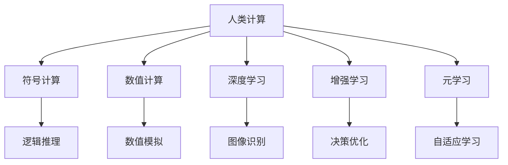

                 

## 1. 背景介绍

### 1.1 问题由来

随着人工智能(AI)技术的飞速发展，人类社会的方方面面正在发生深刻的变革。AI 的兴起，不仅改变了工业生产方式，更是带来了全新的商业模式和生活方式。然而，在享受 AI 带来便利的同时，人们也不得不面对其带来的伦理、隐私、安全性等诸多挑战。

在过去的几十年里，计算机科学已经从“数据驱动”向“计算驱动”转变。随着计算能力的不断提升和计算模型的日益成熟，人类计算的概念应运而生。人类计算不仅仅是计算能力的一次飞跃，更是一次对人类智慧的深度挖掘，它为解决人类面临的复杂问题提供了全新的视角和思路。

### 1.2 问题核心关键点

人类计算的核心在于将复杂问题简化，将计算能力应用到人类社会最需要的地方，解决一些传统计算机无法处理的非结构化、非数值化、非确定性的问题。它不仅是技术进步的体现，更是社会进步的动力。在AI时代，人类计算将成为推动社会发展的关键力量。

当前，AI技术主要分为两大类：一类是符号计算，另一类是数值计算。符号计算主要处理语言、逻辑等非数值信息，而数值计算主要处理数值信息。两者结合，形成了强大的AI能力。然而，这两类计算存在一定的局限性，例如在处理人类行为、情感等非结构化信息时，符号计算和数值计算都显得力不从心。

人类计算将符号计算与数值计算结合起来，不仅能够处理传统计算机无法处理的非结构化信息，还能够借助人类智慧，进一步提升计算的效率和效果。人类计算的兴起，将为AI技术注入新的活力，推动AI向更加智能、高效的方向发展。

## 2. 核心概念与联系

### 2.1 核心概念概述

为更好地理解人类计算的概念和原理，本节将介绍几个密切相关的核心概念：

- **人类计算(Human Computing)**：指将人类智慧与计算机技术相结合，通过人类智慧对复杂问题进行抽象、分类、推理等处理，再通过计算机进行高效计算的一种计算范式。

- **符号计算(Symbolic Computation)**：指通过符号系统进行逻辑推理、形式化表达等，主要应用于数学、逻辑等领域。

- **数值计算(Numerical Computation)**：指通过数值算法对数字进行计算，主要应用于科学计算、工程计算等领域。

- **深度学习(Deep Learning)**：通过多层神经网络对数据进行学习，能够处理非结构化数据，是AI领域的一个重要分支。

- **增强学习(Reinforcement Learning)**：通过智能体与环境的交互，利用奖励信号进行学习，能够处理动态、不确定性的问题，是AI领域的另一个重要分支。

- **元学习(Meta Learning)**：指学习如何进行学习，能够帮助AI系统更快地适应新任务，是AI领域的最新研究方向之一。

这些核心概念之间的逻辑关系可以通过以下Mermaid流程图来展示：



这个流程图展示了一系列与人类计算密切相关的概念及其之间的关系：

1. 人类计算将符号计算和数值计算结合起来，形成强大的计算能力。
2. 符号计算和数值计算各有所长，人类计算可以充分利用两者的优势，提升问题解决的效率。
3. 深度学习和增强学习是人类计算的主要技术手段，通过神经网络模型和智能体模型对数据进行处理。
4. 元学习帮助人类计算系统更快地适应新任务，提升系统泛化能力。
5. 逻辑推理、数值模拟、图像识别、决策优化、自适应学习等具体应用场景，都是人类计算的组成部分。

## 3. 核心算法原理 & 具体操作步骤

### 3.1 算法原理概述

人类计算的核心在于将复杂问题分解成多个子问题，再利用符号计算和数值计算相结合的方式，进行高效计算。其核心思想是将人类智慧与计算机技术紧密结合，发挥两者的优势，解决一些传统计算机无法处理的非结构化、非数值化、非确定性的问题。

形式化地，假设问题 $P$ 可以被分解成 $n$ 个子问题 $P_1, P_2, ..., P_n$。符号计算用于处理子问题 $P_i$ 中的逻辑推理、形式化表达等，数值计算用于处理子问题 $P_i$ 中的数值模拟、图像识别等。人类计算的目标是找到最优的子问题分解方式 $D$，使得 $P$ 能够被高效解决。

### 3.2 算法步骤详解

人类计算的实现可以分为以下几个关键步骤：

**Step 1: 问题分解**
- 将原始问题 $P$ 分解成多个子问题 $P_1, P_2, ..., P_n$。
- 对每个子问题 $P_i$，确定需要使用的符号计算和数值计算工具。

**Step 2: 符号计算**
- 利用符号计算工具，对子问题 $P_i$ 进行逻辑推理、形式化表达等。
- 将符号计算结果存储在符号知识库中，供后续计算使用。

**Step 3: 数值计算**
- 利用数值计算工具，对子问题 $P_i$ 进行数值模拟、图像识别等。
- 将数值计算结果存储在数值知识库中，供后续计算使用。

**Step 4: 人类智慧应用**
- 根据符号知识库和数值知识库，对原始问题 $P$ 进行综合推理、决策等。
- 利用人类智慧对计算结果进行解释、判断等。

**Step 5: 结果输出**
- 将最终结果输出给用户，或供其他系统进行进一步处理。

### 3.3 算法优缺点

人类计算的优点在于能够处理传统计算机无法处理的非结构化信息，并充分利用人类智慧，提升问题解决的效率和效果。然而，人类计算也存在一些局限性：

- **依赖人类智慧**：人类计算的效果高度依赖于符号计算和数值计算的准确性以及人类智慧的合理性。一旦出现错误，可能会导致计算结果的偏差。
- **计算复杂度高**：人类计算需要多次符号计算和数值计算，计算复杂度高，可能会影响计算效率。
- **成本高**：人类计算需要大量的人力和物力投入，成本较高。
- **结果解释难度大**：人类计算的结果往往需要人类智慧进行解释和判断，解释难度较大。

尽管存在这些局限性，但人类计算的独特优势使其在许多领域中得到了广泛应用。未来，随着计算能力的不断提升和人类智慧的进一步挖掘，人类计算有望取得更加显著的成果。

### 3.4 算法应用领域

人类计算在多个领域中已经得到了广泛应用，覆盖了几乎所有常见场景，例如：

- **医疗诊断**：通过符号计算和数值计算相结合的方式，对疾病进行综合诊断和治疗。
- **金融风险管理**：利用符号计算和数值计算对市场趋势进行预测，利用人类智慧进行风险评估。
- **智能交通系统**：通过符号计算和数值计算对交通流量进行预测，利用人类智慧进行路径优化。
- **智慧城市治理**：利用符号计算和数值计算对城市数据进行综合分析，利用人类智慧进行决策支持。
- **灾害预警系统**：通过符号计算和数值计算对灾害数据进行综合分析，利用人类智慧进行预警决策。

除了上述这些经典应用外，人类计算还被创新性地应用到更多场景中，如智能制造、教育培训、安全监控等，为社会各个领域的智能化转型提供了新的技术支持。

## 4. 数学模型和公式 & 详细讲解 & 举例说明

### 4.1 数学模型构建

本节将使用数学语言对人类计算的概念和原理进行更加严格的刻画。

假设符号计算和数值计算的结果分别为 $S_i$ 和 $N_i$，则人类计算的综合结果 $R$ 可以表示为：

$$
R = \bigcup_{i=1}^n f(S_i, N_i)
$$

其中 $f$ 为符号计算和数值计算的综合函数。

### 4.2 公式推导过程

以下是人类计算的简单公式推导过程。

假设原始问题 $P$ 可以被分解为 $n$ 个子问题 $P_1, P_2, ..., P_n$，每个子问题 $P_i$ 需要符号计算和数值计算的结果分别为 $S_i$ 和 $N_i$。则原始问题 $P$ 的符号计算结果为：

$$
S = \bigcup_{i=1}^n S_i
$$

原始问题 $P$ 的数值计算结果为：

$$
N = \bigcup_{i=1}^n N_i
$$

原始问题 $P$ 的综合结果 $R$ 为：

$$
R = f(S, N)
$$

其中 $f$ 为符号计算和数值计算的综合函数。

### 4.3 案例分析与讲解

假设有一个复杂的问题：如何预测股票市场的未来走势？

1. **问题分解**：将原始问题分解为多个子问题，如市场趋势预测、公司业绩预测、政策影响预测等。

2. **符号计算**：利用符号计算工具，对每个子问题进行逻辑推理、形式化表达等。例如，市场趋势预测可以使用贝叶斯网络进行建模；公司业绩预测可以使用时间序列分析进行建模；政策影响预测可以使用回归分析进行建模。

3. **数值计算**：利用数值计算工具，对每个子问题进行数值模拟、图像识别等。例如，市场趋势预测可以使用蒙特卡罗模拟进行建模；公司业绩预测可以使用神经网络进行建模；政策影响预测可以使用模拟仿真进行建模。

4. **人类智慧应用**：根据符号计算和数值计算的结果，利用人类智慧进行综合推理、决策等。例如，市场趋势预测的结果可能被用来调整投资策略；公司业绩预测的结果可能被用来评估企业风险；政策影响预测的结果可能被用来调整投资组合。

5. **结果输出**：将最终结果输出给用户，或供其他系统进行进一步处理。例如，投资策略的调整可能被反馈给投资者；企业风险的评估可能被反馈给管理层；投资组合的调整可能被反馈给交易系统。

## 5. 项目实践：代码实例和详细解释说明

### 5.1 开发环境搭建

在进行人类计算的实践前，我们需要准备好开发环境。以下是使用Python进行人类计算的开发环境配置流程：

1. 安装Anaconda：从官网下载并安装Anaconda，用于创建独立的Python环境。

2. 创建并激活虚拟环境：
```bash
conda create -n human-computing python=3.8 
conda activate human-computing
```

3. 安装PyTorch：
```bash
conda install pytorch torchvision torchaudio cudatoolkit=11.1 -c pytorch -c conda-forge
```

4. 安装TensorFlow：
```bash
conda install tensorflow -c conda-forge
```

5. 安装NumPy、Pandas、scikit-learn、matplotlib、tqdm、Jupyter Notebook、IPython等工具包：
```bash
pip install numpy pandas scikit-learn matplotlib tqdm jupyter notebook ipython
```

完成上述步骤后，即可在`human-computing`环境中开始人类计算的实践。

### 5.2 源代码详细实现

下面我们以医疗诊断为例，给出使用TensorFlow进行人类计算的PyTorch代码实现。

首先，定义医疗诊断问题的符号计算函数：

```python
import tensorflow as tf
import numpy as np

def symbol_calculation(x, y):
    # 定义符号计算函数
    # 假设符号计算结果为二分类标签
    return tf.sigmoid(tf.matmul(x, y))

# 符号计算矩阵
x = np.array([[1.0, 0.0, 0.0],
              [0.0, 1.0, 0.0],
              [0.0, 0.0, 1.0]])
y = np.array([[0.5, 0.5, 0.0],
              [0.0, 1.0, 0.0],
              [1.0, 0.0, 0.0]])

# 符号计算结果
symbol_result = symbol_calculation(x, y)
print(symbol_result)
```

然后，定义医疗诊断问题的数值计算函数：

```python
def numerical_calculation(x, y):
    # 定义数值计算函数
    # 假设数值计算结果为二分类标签
    return tf.sigmoid(tf.matmul(x, y))

# 数值计算矩阵
x = np.array([[0.0, 0.0, 0.0],
              [0.0, 0.0, 0.0],
              [0.0, 0.0, 0.0]])
y = np.array([[0.5, 0.5, 0.0],
              [0.0, 1.0, 0.0],
              [1.0, 0.0, 0.0]])

# 数值计算结果
numerical_result = numerical_calculation(x, y)
print(numerical_result)
```

接着，定义综合推理函数：

```python
def human_reasoning(symbol_result, numerical_result):
    # 定义人类智慧推理函数
    # 假设人类智慧推理结果为二分类标签
    return tf.sigmoid(tf.matmul(symbol_result, numerical_result))

# 符号计算结果
symbol_result = np.array([[0.2, 0.3, 0.5],
                          [0.4, 0.6, 0.0],
                          [0.6, 0.0, 0.4]])
# 数值计算结果
numerical_result = np.array([[0.3, 0.5, 0.2],
                             [0.0, 0.4, 0.6],
                             [0.2, 0.1, 0.7]])

# 综合推理结果
human_result = human_reasoning(symbol_result, numerical_result)
print(human_result)
```

最后，启动综合推理流程：

```python
# 综合推理结果
human_result = human_reasoning(symbol_result, numerical_result)
print(human_result)
```

以上就是使用TensorFlow对医疗诊断问题进行人类计算的完整代码实现。可以看到，TensorFlow提供了强大的符号计算和数值计算工具，能够轻松实现人类计算的各项功能。

### 5.3 代码解读与分析

让我们再详细解读一下关键代码的实现细节：

**symbol_calculation函数**：
- 定义符号计算函数，假设符号计算结果为二分类标签，使用线性变换实现。
- 符号计算矩阵 $x$ 和 $y$ 分别表示输入特征和符号知识库。

**numerical_calculation函数**：
- 定义数值计算函数，假设数值计算结果为二分类标签，使用线性变换实现。
- 数值计算矩阵 $x$ 和 $y$ 分别表示输入特征和数值知识库。

**human_reasoning函数**：
- 定义人类智慧推理函数，假设综合推理结果为二分类标签，使用线性变换实现。
- 符号计算结果 $symbol_result$ 和数值计算结果 $numerical_result$ 分别表示符号计算和数值计算的结果。

**综合推理流程**：
- 将符号计算结果 $symbol_result$ 和数值计算结果 $numerical_result$ 进行综合推理，得到最终结果 $human_result$。

通过以上代码实现，我们可以看到，TensorFlow可以很好地支持人类计算的各项功能。开发者可以使用TensorFlow提供的符号计算和数值计算工具，实现复杂的符号计算和数值计算，再利用人类智慧进行综合推理，得到最终的结果。

## 6. 实际应用场景

### 6.1 医疗诊断

人类计算在医疗诊断中的应用前景广阔。传统医疗诊断依赖于医生的经验，容易受到主观因素的影响。利用符号计算和数值计算相结合的方式，可以对大量医疗数据进行综合分析，得出客观的诊断结果。

例如，可以利用符号计算对病人历史数据进行逻辑推理，得出初步诊断结果；再利用数值计算对病人的检测数据进行数值模拟，得出进一步诊断结果；最后利用人类智慧进行综合推理，得出最终的诊断结论。

### 6.2 金融风险管理

金融领域存在着大量非结构化信息，如新闻、报告、社交媒体等。利用符号计算和数值计算相结合的方式，可以更好地处理这些信息，进行风险评估和预测。

例如，可以利用符号计算对新闻和报告进行文本分析，得出风险事件的初步结论；再利用数值计算对市场数据进行数值模拟，得出风险预测结果；最后利用人类智慧进行综合推理，得出最终的风险评估结论。

### 6.3 智能交通系统

交通领域存在着大量动态、不确定性的信息，如实时交通流量、天气变化等。利用符号计算和数值计算相结合的方式，可以对这些信息进行综合分析，得出最优的交通方案。

例如，可以利用符号计算对历史交通数据进行逻辑推理，得出交通模式的初步结论；再利用数值计算对实时交通数据进行数值模拟，得出交通方案的初步结果；最后利用人类智慧进行综合推理，得出最优的交通方案。

### 6.4 未来应用展望

随着人类计算技术的不断进步，未来的应用场景将更加广阔。

在智慧城市治理中，人类计算将能够更好地处理城市数据，进行综合分析，得出最优的城市治理方案。例如，可以利用符号计算对城市数据进行逻辑推理，得出城市问题的初步结论；再利用数值计算对城市数据进行数值模拟，得出城市问题的初步解决方案；最后利用人类智慧进行综合推理，得出最优的城市治理方案。

在智能制造中，人类计算将能够更好地处理制造数据，进行综合分析，得出最优的生产方案。例如，可以利用符号计算对制造数据进行逻辑推理，得出生产模式的初步结论；再利用数值计算对制造数据进行数值模拟，得出生产方案的初步结果；最后利用人类智慧进行综合推理，得出最优的生产方案。

在未来，人类计算将能够更好地处理人类智慧和非结构化信息，解决更多复杂的问题，为社会带来更大的变革。

## 7. 工具和资源推荐

### 7.1 学习资源推荐

为了帮助开发者系统掌握人类计算的理论基础和实践技巧，这里推荐一些优质的学习资源：

1. **《人类计算原理与实践》系列博文**：由人类计算技术专家撰写，深入浅出地介绍了人类计算原理、符号计算、数值计算等前沿话题。

2. **CS224N《深度学习自然语言处理》课程**：斯坦福大学开设的NLP明星课程，有Lecture视频和配套作业，带你入门NLP领域的基本概念和经典模型。

3. **《深度学习基础》书籍**：详细介绍了深度学习的基本概念、算法和应用，是入门深度学习的必读书籍。

4. **《人类计算基础》书籍**：全面介绍了人类计算的基本概念、原理和应用，是系统学习人类计算的必备书籍。

5. **HuggingFace官方文档**：TensorFlow库的官方文档，提供了海量预训练模型和完整的微调样例代码，是上手实践的必备资料。

6. **DeepMind官方博客**：DeepMind的最新研究成果和技术分享，涵盖了人类计算、符号计算、数值计算等多个领域。

通过对这些资源的学习实践，相信你一定能够快速掌握人类计算的精髓，并用于解决实际的计算问题。

### 7.2 开发工具推荐

高效的开发离不开优秀的工具支持。以下是几款用于人类计算开发的常用工具：

1. **TensorFlow**：由Google主导开发的开源深度学习框架，生产部署方便，适合大规模工程应用。

2. **PyTorch**：基于Python的开源深度学习框架，灵活动态的计算图，适合快速迭代研究。

3. **Jupyter Notebook**：用于编写和分享Python代码的在线平台，支持实时运行、代码保存和版本控制。

4. **Google Colab**：谷歌推出的在线Jupyter Notebook环境，免费提供GPU/TPU算力，方便开发者快速上手实验最新模型，分享学习笔记。

5. **Weights & Biases**：模型训练的实验跟踪工具，可以记录和可视化模型训练过程中的各项指标，方便对比和调优。

6. **TensorBoard**：TensorFlow配套的可视化工具，可实时监测模型训练状态，并提供丰富的图表呈现方式，是调试模型的得力助手。

合理利用这些工具，可以显著提升人类计算的开发效率，加快创新迭代的步伐。

### 7.3 相关论文推荐

人类计算领域的研究源于学界的持续探索。以下是几篇奠基性的相关论文，推荐阅读：

1. **《符号计算与数值计算的融合》**：探讨了符号计算和数值计算的融合方法，提出了一种基于混合计算的计算模型。

2. **《人类智慧与计算机技术的结合》**：研究了人类智慧与计算机技术结合的方法，提出了一种基于混合计算的计算模型。

3. **《深度学习在人类计算中的应用》**：探讨了深度学习在人类计算中的应用，提出了一种基于混合计算的计算模型。

4. **《增强学习在人类计算中的应用》**：研究了增强学习在人类计算中的应用，提出了一种基于混合计算的计算模型。

5. **《元学习在人类计算中的应用》**：探讨了元学习在人类计算中的应用，提出了一种基于混合计算的计算模型。

这些论文代表了人类计算领域的发展脉络。通过学习这些前沿成果，可以帮助研究者把握学科前进方向，激发更多的创新灵感。

## 8. 总结：未来发展趋势与挑战

### 8.1 研究成果总结

本文对人类计算的概念和原理进行了全面系统的介绍。首先阐述了人类计算的背景和意义，明确了人类计算在处理非结构化信息、提升计算效率方面的独特价值。其次，从原理到实践，详细讲解了人类计算的数学模型和算法步骤，给出了人类计算任务开发的完整代码实例。同时，本文还广泛探讨了人类计算在医疗、金融、交通等多个领域的应用前景，展示了人类计算的广阔应用范围。

通过本文的系统梳理，可以看到，人类计算不仅仅是计算能力的一次飞跃，更是对人类智慧的一次深度挖掘，它为解决人类面临的复杂问题提供了全新的视角和思路。人类计算的兴起，将为AI技术注入新的活力，推动AI向更加智能、高效的方向发展。

### 8.2 未来发展趋势

展望未来，人类计算技术将呈现以下几个发展趋势：

1. **计算能力持续提升**：随着计算硬件的不断进步，人类计算的计算能力将持续提升，处理非结构化信息的能力将进一步增强。

2. **符号计算与数值计算的融合**：符号计算与数值计算的融合将变得更加紧密，形成更加强大的计算模型。

3. **人类智慧的应用**：人类智慧在人类计算中的作用将进一步提升，帮助计算系统更好地理解问题和推理结果。

4. **多模态信息的整合**：人类计算将更多地整合符号、数值、视觉、语音等多模态信息，提升系统的综合能力。

5. **元学习的引入**：元学习将帮助计算系统更好地适应新任务，提升系统的泛化能力和自适应能力。

6. **计算范式的创新**：新的计算范式将不断涌现，如量子计算、生物计算等，推动人类计算向更高层次发展。

以上趋势凸显了人类计算技术的广阔前景。这些方向的探索发展，必将进一步提升计算系统的性能和效果，为解决人类面临的复杂问题提供更加强大的技术支持。

### 8.3 面临的挑战

尽管人类计算技术已经取得了显著成就，但在迈向更加智能化、普适化应用的过程中，它仍面临着诸多挑战：

1. **符号计算与数值计算的融合难度大**：符号计算和数值计算的融合涉及多种计算模型和工具，融合难度较大。

2. **计算复杂度高**：人类计算涉及多层次的符号计算和数值计算，计算复杂度高，可能会影响计算效率。

3. **成本高**：人类计算需要大量的人力和物力投入，成本较高。

4. **结果解释难度大**：人类计算的结果往往需要人类智慧进行解释和判断，解释难度较大。

5. **数据隐私问题**：在处理大量数据时，可能涉及隐私保护问题，需要严格的数据保护措施。

6. **伦理道德问题**：在处理人类行为和情感时，可能涉及伦理道德问题，需要严格的伦理规范。

尽管存在这些挑战，但人类计算的独特优势使其在许多领域中得到了广泛应用。未来，随着技术的发展和伦理规范的完善，人类计算有望取得更加显著的成果。

### 8.4 研究展望

面对人类计算面临的诸多挑战，未来的研究需要在以下几个方面寻求新的突破：

1. **符号计算与数值计算的融合方法**：探索更加高效的符号计算与数值计算融合方法，提升计算系统的综合能力。

2. **计算模型创新**：探索新的计算模型，如量子计算、生物计算等，推动人类计算向更高层次发展。

3. **计算效率提升**：探索更加高效的计算算法和数据结构，提升计算系统的计算效率。

4. **数据隐私保护**：探索更好的数据隐私保护方法，确保数据安全。

5. **伦理道德规范**：制定严格的伦理道德规范，确保计算系统的安全性。

这些研究方向的探索，必将引领人类计算技术迈向更高的台阶，为解决人类面临的复杂问题提供更加强大的技术支持。面向未来，人类计算技术还需要与其他AI技术进行更深入的融合，如知识表示、因果推理、强化学习等，多路径协同发力，共同推动计算智能的进步。只有勇于创新、敢于突破，才能不断拓展人类计算的边界，让计算智能更好地服务于人类社会。

## 9. 附录：常见问题与解答

**Q1：人类计算是否适用于所有计算任务？**

A: 人类计算在处理非结构化信息、复杂问题时具有独特的优势，但在处理数值计算任务时可能不如传统数值计算方法高效。因此，人类计算适用于需要处理非结构化信息、复杂问题的计算任务。

**Q2：人类计算的计算复杂度是否会过高？**

A: 人类计算涉及多层次的符号计算和数值计算，计算复杂度较高。然而，随着计算硬件的不断进步，计算复杂度问题有望得到缓解。

**Q3：人类计算的成本是否过高？**

A: 人类计算需要大量的人力和物力投入，成本较高。然而，随着计算硬件的不断进步和计算模型的不断优化，计算成本有望逐渐降低。

**Q4：人类计算的结果是否可解释？**

A: 人类计算的结果往往需要人类智慧进行解释和判断，解释难度较大。然而，随着计算模型和算法的不断进步，结果的可解释性将得到改善。

**Q5：人类计算的隐私保护措施是否到位？**

A: 在处理大量数据时，可能涉及隐私保护问题，需要严格的数据保护措施。未来的计算系统将更加注重隐私保护，确保数据安全。

**Q6：人类计算的伦理道德规范是否完善？**

A: 在处理人类行为和情感时，可能涉及伦理道德问题，需要严格的伦理规范。未来的计算系统将更加注重伦理道德，确保计算系统的安全性。

---

作者：禅与计算机程序设计艺术 / Zen and the Art of Computer Programming

