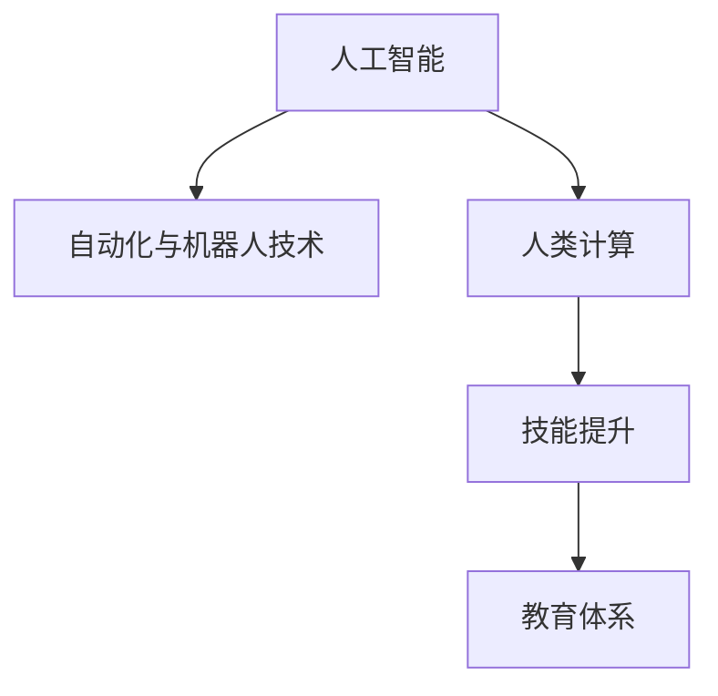

                 

# 人类计算：AI时代的未来就业前景与技能发展

> 关键词：人工智能,就业前景,技能发展,人类计算,自动化,未来工作,教育体系,人才培养

## 1. 背景介绍

### 1.1 问题由来
人工智能（AI）技术的飞速发展，正在深刻改变我们的工作和生活方式。从工业制造到金融服务，从教育医疗到日常消费，AI正无处不在地重塑着各行各业的业务流程和商业模式。然而，随之而来的，是人们对AI技术可能对就业市场产生的广泛担忧。这种担忧主要源于两个方面：

- **替代效应**：自动化和机器人技术的应用，可能导致某些岗位被机器取代，从而引发大规模的就业结构性变化。
- **技能鸿沟**：AI技术的发展和应用，要求从业者具备更高的技术能力和专业素养，而现有的劳动力市场可能难以满足这一需求，形成新的技能鸿沟。

为了应对这些挑战，本文将探讨AI时代下人类计算的未来就业前景以及所需的技能发展方向，旨在为个人、企业和教育机构提供指导。

### 1.2 问题核心关键点
1. **替代与创造的平衡**：AI技术不仅能替代某些低技能劳动岗位，还能创造新的高技能和复合型岗位。理解这一平衡，对于制定合理的就业策略至关重要。
2. **技能提升与适应性**：在AI时代，从业者需要不断提升自身的技术能力和适应性，以应对不断变化的就业市场。
3. **教育体系与人才培养**：现有教育体系需要改革，以适应AI技术发展对技能需求的变化。

## 2. 核心概念与联系

### 2.1 核心概念概述

为更好地理解AI时代下人类计算的就业前景与技能发展，本文将介绍几个密切相关的核心概念：

- **人工智能（AI）**：涵盖机器学习、深度学习、自然语言处理等技术，通过模拟人类智能，实现复杂任务的自动化和智能化。
- **自动化与机器人技术**：通过自动化设备和系统，替代部分重复性、低技能劳动岗位，提高生产效率。
- **人类计算**：指人类在智能系统中扮演的角色，包括数据分析、决策制定、创意工作等，强调人机协作的协同效应。
- **技能提升**：从业者通过持续学习、培训和实践，提升技术能力，以适应AI技术带来的就业变化。
- **教育体系**：包括基础教育、职业教育、终身学习等，旨在培养适应未来就业市场的人才。

这些核心概念之间的逻辑关系可以通过以下Mermaid流程图来展示：



这个流程图展示了大规模AI技术对就业市场和教育体系的双重影响：

1. **人工智能**推动了**自动化与机器人技术**的发展，进而改变就业市场的结构。
2. **人类计算**强调了人类在智能系统中的重要作用，与AI技术形成互补。
3. **技能提升**和**教育体系**共同努力，培养适应新就业环境的从业者。

## 3. 核心算法原理 & 具体操作步骤

### 3.1 算法原理概述

在AI时代，人类计算的就业前景与技能发展，本质上是一个技能匹配和技能提升的过程。其核心思想是：通过人工智能技术和教育体系的共同作用，将劳动力市场中的低技能劳动者，转化为具备更高技术能力和适应性的高技能劳动者。

具体而言，技能提升与适应性要求从业者具备以下能力：

- **技术能力**：包括编程、数据分析、机器学习等技术技能，能够使用AI工具进行日常工作。
- **创新能力**：能够提出新的问题解决方案，进行创造性工作。
- **沟通与协作**：能够与AI系统进行有效沟通，团队协作完成复杂任务。
- **终身学习能力**：不断学习新知识、新技能，适应快速变化的就业市场。

### 3.2 算法步骤详解

基于技能匹配和技能提升的思想，AI时代下人类计算的就业前景与技能发展过程，可以分为以下几个关键步骤：

**Step 1: 技能需求分析**
- 通过行业调研和数据分析，确定AI时代下各行业的技能需求。
- 评估现有劳动力的技能水平，识别技能短板。

**Step 2: 技能提升路径设计**
- 根据技能需求，设计个性化的技能提升路径，涵盖基础培训、进阶课程和实践经验。
- 引入在线学习平台和混合学习模式，提供灵活的学习资源。

**Step 3: 技能提升实施**
- 为从业者提供持续的教育和培训机会，提升技术能力。
- 鼓励跨学科学习和复合型技能培养，提升创新能力和适应性。

**Step 4: 技能匹配与职业发展**
- 通过AI技术，匹配从业者与合适的就业岗位。
- 帮助从业者进行职业发展规划，推动其职业成长。

### 3.3 算法优缺点

基于技能匹配和技能提升的就业前景与技能发展方法，具有以下优点：

1. **动态适应**：能够灵活应对不断变化的就业市场，提供动态的技能提升和匹配方案。
2. **个性化培训**：通过个性化培训方案，满足不同从业者的技能提升需求。
3. **提升创新能力**：通过创新型培训课程，培养从业者的创造性思维和问题解决能力。

同时，该方法也存在一些局限性：

1. **资源投入大**：持续的技能提升和个性化培训需要大量资源投入。
2. **需求预测难度大**：准确预测未来技能需求，具有一定难度。
3. **教育体系改革复杂**：现有教育体系改革需要时间，短期内难以见效。

尽管存在这些局限性，但就目前而言，基于技能匹配和技能提升的方法，仍是应对AI时代就业挑战的重要手段。未来相关研究的重点在于如何进一步降低技能提升的资源投入，提高预测准确性，并推动教育体系的持续改革。

### 3.4 算法应用领域

基于技能匹配和技能提升的就业前景与技能发展方法，已经在多个领域得到了应用，例如：

- **金融服务**：通过AI技术分析金融数据，提供个性化投资建议，提升从业者的金融科技能力。
- **制造业**：引入自动化设备和系统，提升生产效率，要求劳动者具备更高的技术技能。
- **医疗健康**：通过AI技术辅助诊断和治疗，要求医疗从业者具备数据分析和应用AI工具的能力。
- **教育培训**：利用AI技术优化教学过程，培养适应未来就业市场的学生。
- **零售和电商**：通过AI技术优化供应链管理，要求从业者具备数据分析和消费者行为理解的能力。

除了上述这些领域外，基于技能匹配和技能提升的就业前景与技能发展方法，还将不断拓展到更多行业，为各行各业带来新的变革和机遇。

## 4. 数学模型和公式 & 详细讲解 & 举例说明

### 4.1 数学模型构建

为了更好地理解技能匹配和技能提升过程，我们可以构建一个简化的数学模型。假设有一个劳动力市场，其中有 $N$ 个岗位和 $M$ 个从业者。每个岗位的需求技能为 $S_i$，每个从业者的技能水平为 $T_j$。技能匹配的目标是最大化岗位匹配的成功率 $P$，同时最小化技能提升的成本 $C$。

我们可以将匹配问题建模为：

$$
\max_{S_i, T_j} P
$$
$$
\min_{S_i, T_j} C
$$

其中，$P$ 表示岗位与从业者匹配的成功率，$C$ 表示技能提升的总成本。

### 4.2 公式推导过程

对于岗位与从业者的匹配问题，我们可以使用马科维茨优化模型进行求解。假设每个岗位 $i$ 和从业者 $j$ 的技能水平为 $T_{ij}$，岗位需求为 $S_i$，则匹配成功概率 $P_{ij}$ 可以表示为：

$$
P_{ij} = F(T_{ij}, S_i)
$$

其中 $F$ 为匹配函数，表示技能匹配的概率分布。

对于技能提升的成本问题，我们可以假设每个从业者 $j$ 的初始技能水平为 $T_{0j}$，提升到目标技能水平 $T_j$ 的成本为 $C_j$。则技能提升总成本 $C$ 可以表示为：

$$
C = \sum_{j=1}^{M} C_j
$$

综合上述模型，我们的优化目标可以表示为：

$$
\max_{T_j} \sum_{i=1}^{N} P_{ij}
$$
$$
\min_{T_j} \sum_{j=1}^{M} C_j
$$

### 4.3 案例分析与讲解

假设我们有一个制造企业，其生产线需要操作工人和工程师。每个操作工人的初始技能水平为 $T_{0}$，工程师的初始技能水平为 $T_{0E}$。操作工人的技能需求为 $S_O$，工程师的技能需求为 $S_E$。通过技能提升和岗位匹配，我们需要最大化生产线的效率，同时最小化技能提升的总成本。

我们可以使用以下步骤进行计算：

1. 评估每个岗位的技能需求，确定 $S_O$ 和 $S_E$。
2. 评估每个从业者的技能水平，确定 $T_{0}$ 和 $T_{0E}$。
3. 使用马科维茨优化模型，求解最大化匹配概率和最小化成本的解。
4. 根据求解结果，进行技能提升和岗位分配。

例如，假设通过优化，我们发现提升操作工人的技能水平 $T_O$ 至 $S_O$ 最为经济有效，而提升工程师的技能水平 $T_E$ 至 $S_E$ 则次之。则企业可以优先对操作工人进行技能提升，同时调整生产线，将部分工程师的任务转移至操作工人，从而最大化生产线的效率，同时最小化技能提升的总成本。

## 5. 项目实践：代码实例和详细解释说明

### 5.1 开发环境搭建

在进行项目实践前，我们需要准备好开发环境。以下是使用Python进行Pandas和NumPy开发的开发环境配置流程：

1. 安装Anaconda：从官网下载并安装Anaconda，用于创建独立的Python环境。

2. 创建并激活虚拟环境：
```bash
conda create -n myenv python=3.8 
conda activate myenv
```

3. 安装Pandas和NumPy：
```bash
conda install pandas numpy
```

4. 安装各类工具包：
```bash
pip install matplotlib scikit-learn seaborn jupyter notebook ipython
```

完成上述步骤后，即可在`myenv`环境中开始项目实践。

### 5.2 源代码详细实现

我们以下简单的数据匹配和技能提升优化为例，给出使用Pandas和NumPy进行项目开发的PyTorch代码实现。

首先，定义数据集：

```python
import pandas as pd
import numpy as np

# 岗位需求和从业者技能水平
岗位需求 = pd.DataFrame({
    '岗位': ['操作工人', '工程师'],
    '技能需求': [80, 120]
})
从业者技能 = pd.DataFrame({
    '从业者': ['A', 'B', 'C'],
    '初始技能水平': [60, 70, 90]
})
```

然后，构建优化目标函数：

```python
from scipy.optimize import linprog

# 定义优化变量
x = np.zeros(3)  # 操作工人和工程师的提升成本

# 定义优化方程
A = np.array([[0, 0, 1], [1, 0, 1], [0, 1, 1]])
b = np.array([1, 120, 80])  # 操作工人和工程师的提升成本限制
c = np.array([1, 1, 0])  # 最大化匹配概率和最小化成本

# 求解优化问题
res = linprog(c, A_ub=A, b_ub=b)
print(res)
```

最后，根据求解结果进行技能提升和岗位分配：

```python
# 根据求解结果，进行技能提升和岗位分配
print("操作工人需要提升至技能水平：", res.x[0])
print("工程师需要提升至技能水平：", res.x[1])

# 匹配岗位
岗位匹配 = 岗位需求['岗位'].where(从业者技能['初始技能水平'] >= res.x).drop_duplicates()
print("岗位匹配结果：", 岗位匹配)
```

以上就是使用Pandas和NumPy进行数据匹配和技能提升优化的完整代码实现。可以看到，通过Pandas和NumPy的强大数据处理能力，我们能够快速高效地构建和优化数据匹配模型，进而指导技能提升和岗位分配。

### 5.3 代码解读与分析

让我们再详细解读一下关键代码的实现细节：

**数据集定义**：
- 使用Pandas的DataFrame，将岗位需求和从业者技能水平存储为表格形式，便于后续计算。
- 通过numpy的zeros函数，定义优化变量，表示操作工人和工程师的提升成本。

**优化目标函数**：
- 使用scipy的linprog函数，定义优化方程，包括目标函数、约束条件和优化变量。
- 目标函数c表示最大化匹配概率和最小化成本，约束条件A和b表示技能提升的限制，优化变量x表示每个从业者的技能提升成本。

**求解优化问题**：
- 调用linprog函数，求解优化问题，得到最优的提升成本分配。
- 输出结果，表示每个从业者需要提升的技能水平。

**岗位匹配**：
- 根据求解结果，进行岗位匹配，选择技能水平高于目标值的操作工人和工程师。
- 输出匹配结果，表示哪些操作工人和工程师需要进行技能提升。

可以看到，Pandas和NumPy的强大数据处理和数学计算能力，使得数据匹配和技能提升优化问题得到了有效的解决。在实际项目中，我们可以通过扩展数据集和优化目标函数，进行更复杂、更具体的匹配和优化。

## 6. 实际应用场景

### 6.1 智能制造

智能制造是AI技术在制造业的重要应用之一，通过引入自动化设备和系统，实现生产线的智能化和自动化。在智能制造中，人类计算的就业前景与技能发展主要体现在以下几个方面：

- **操作工人**：需要进行技能提升，掌握操作机器人和自动化设备的技能，提升生产效率。
- **工程师**：需要进行技术升级，掌握数据分析和AI技术，进行设备维护和优化。
- **管理者**：需要进行创新能力提升，掌握智能制造系统的管理和优化，推动生产线的持续改进。

### 6.2 金融服务

金融服务行业正面临着AI技术带来的巨大变革。AI技术在风险管理、客户服务、投资分析等领域的应用，要求从业者具备更高的技术能力和专业素养。在金融服务中，人类计算的就业前景与技能发展主要体现在以下几个方面：

- **数据分析师**：需要进行技术升级，掌握数据分析和机器学习技能，进行风险评估和投资分析。
- **客户经理**：需要进行沟通与协作技能提升，掌握智能客服系统和客户行为分析技能，提供个性化金融服务。
- **金融科技专家**：需要进行创新能力提升，掌握AI技术和金融知识，开发和应用金融科技产品。

### 6.3 医疗健康

AI技术在医疗健康领域的应用，包括医学影像诊断、患者管理、药物研发等，正在改变传统医疗模式。在医疗健康中，人类计算的就业前景与技能发展主要体现在以下几个方面：

- **医生**：需要进行技能提升，掌握AI辅助诊断和治疗技能，提高诊疗效率和效果。
- **护士**：需要进行技能提升，掌握数据分析和AI技术，进行患者管理和护理。
- **医疗科技专家**：需要进行创新能力提升，掌握AI技术和医疗知识，开发和应用医疗科技产品。

### 6.4 未来应用展望

随着AI技术的发展，人类计算的就业前景与技能发展将呈现出以下几个趋势：

1. **岗位的动态变化**：AI技术将不断创造新的岗位，同时也可能导致某些岗位被取代。因此，从业者需要不断学习新技能，适应新的就业环境。
2. **技能的多样化**：未来的岗位要求从业者具备更多的技能，如技术能力、创新能力、沟通与协作能力等，形成多维度的复合型人才。
3. **终身学习的普及**：终身学习将成为未来就业市场的常态，从业者需要通过持续学习，保持技能的新鲜和高效。
4. **跨学科和复合型技能的培养**：未来的岗位将要求从业者具备跨学科和复合型的技能，如数据科学、AI技术、行业知识等，形成全面的人才。

## 7. 工具和资源推荐

### 7.1 学习资源推荐

为了帮助从业者系统掌握AI时代下人类计算的就业前景与技能发展，这里推荐一些优质的学习资源：

1. **Coursera**：提供大量与AI和数据科学相关的课程，涵盖机器学习、深度学习、数据可视化等主题。
2. **edX**：提供全球顶尖大学的在线课程，涵盖计算机科学、数据科学、人工智能等领域。
3. **Kaggle**：提供大量数据科学竞赛和实践项目，通过实战提升技能。
4. **GitHub**：提供大量开源项目和代码库，方便学习和实践AI技术。
5. **Google AI Education**：提供AI相关的教程和资源，涵盖AI技术和应用实践。

通过对这些资源的学习实践，相信你一定能够系统掌握AI时代下人类计算的就业前景与技能发展的精髓，为未来的职业发展打下坚实的基础。

### 7.2 开发工具推荐

高效的开发离不开优秀的工具支持。以下是几款用于AI和数据科学开发的常用工具：

1. **Jupyter Notebook**：提供交互式的代码编写环境，便于学习、实验和分享。
2. **PyTorch**：强大的深度学习框架，支持GPU加速，广泛应用于AI模型开发。
3. **TensorFlow**：谷歌主导的开源框架，适用于大规模的深度学习模型训练和部署。
4. **Keras**：高级深度学习框架，提供简单易用的API，适合快速原型开发。
5. **Matplotlib**：强大的数据可视化工具，支持丰富的图表绘制功能。
6. **NumPy**：强大的数值计算库，支持高效的数组操作和数学计算。
7. **Pandas**：强大的数据处理库，支持灵活的数据分析和处理。

合理利用这些工具，可以显著提升AI和数据科学的开发效率，加速创新迭代的步伐。

### 7.3 相关论文推荐

AI时代下人类计算的就业前景与技能发展，源于学界的持续研究。以下是几篇奠基性的相关论文，推荐阅读：

1. **《The Economics of Automation》**：研究自动化技术对就业市场的影响，提出技能提升和再培训的策略。
2. **《Artificial Intelligence in the Future of Work》**：探讨AI技术对未来就业市场的广泛影响，提出应对策略。
3. **《Towards a Theory of Human-AI Collaboration》**：提出人机协作的理论框架，强调人类在AI系统中的重要作用。
4. **《Human-Complementary AI》**：探讨AI技术在教育和培训中的应用，提出技能提升和教育改革的建议。
5. **《The Future of Employment: How Susceptible Are Jobs to Computerisation》**：研究AI技术对不同职业的影响，提出技能提升和适应性发展的策略。

这些论文代表了大规模AI技术对就业市场和教育体系的研究脉络。通过学习这些前沿成果，可以帮助从业者更好地理解AI时代的就业前景与技能发展方向，为未来职业规划提供指导。

## 8. 总结：未来发展趋势与挑战

### 8.1 总结

本文对AI时代下人类计算的就业前景与技能发展进行了全面系统的介绍。首先阐述了AI技术对就业市场的广泛影响，明确了技能提升和适应性提升的重要性。其次，从原理到实践，详细讲解了技能匹配和技能提升的数学模型和具体操作步骤，给出了实际项目开发的完整代码实例。同时，本文还广泛探讨了AI技术在智能制造、金融服务、医疗健康等多个行业领域的应用前景，展示了技能匹配和技能提升方法的巨大潜力。此外，本文精选了学习资源、开发工具和相关论文，力求为从业者提供全方位的技术指引。

通过本文的系统梳理，可以看到，AI时代下人类计算的就业前景与技能发展，是一个动态变化的、需要不断适应和调整的过程。通过技能匹配和技能提升的方法，劳动力市场中的低技能劳动者，可以逐步转化为具备更高技术能力和适应性的高技能劳动者。未来，伴随AI技术的不断进步，这一过程将更加复杂和多样，但只要我们保持持续学习和适应的姿态，就能够在AI时代中抓住机遇，实现个人和职业的成长。

### 8.2 未来发展趋势

展望未来，人类计算的就业前景与技能发展将呈现以下几个趋势：

1. **技能的多样化和复合化**：未来的岗位将要求从业者具备更多的技能，如技术能力、创新能力、沟通与协作能力等，形成多维度的复合型人才。
2. **终身学习的普及**：终身学习将成为未来就业市场的常态，从业者需要通过持续学习，保持技能的新鲜和高效。
3. **跨学科和复合型技能的培养**：未来的岗位将要求从业者具备跨学科和复合型的技能，如数据科学、AI技术、行业知识等，形成全面的人才。
4. **技术升级和岗位转换**：AI技术将不断创造新的岗位，同时也可能导致某些岗位被取代。因此，从业者需要不断学习新技能，适应新的就业环境。
5. **技能匹配和个性化培训**：通过技能匹配和个性化培训，将劳动力市场中的低技能劳动者，转化为具备更高技术能力和适应性的高技能劳动者。
6. **AI技术在教育和培训中的应用**：AI技术可以用于个性化教育和技能培训，提升学习效率和效果。

以上趋势凸显了AI时代下人类计算的就业前景与技能发展的广阔前景。这些方向的探索发展，必将进一步提升就业市场的灵活性和适应性，为从业者提供更多、更广阔的职业机会。

### 8.3 面临的挑战

尽管人类计算的就业前景与技能发展前景广阔，但在迈向更加智能化、普适化应用的过程中，它仍面临着诸多挑战：

1. **技能鸿沟**：AI技术的发展和应用，要求从业者具备更高的技术能力和专业素养，而现有的劳动力市场可能难以满足这一需求，形成新的技能鸿沟。
2. **教育体系的滞后**：现有教育体系可能无法适应AI技术对技能需求的变化，培养出的毕业生难以满足就业市场的需求。
3. **资源投入大**：持续的技能提升和个性化培训需要大量资源投入，包括时间、资金和人力。
4. **技能预测难度大**：准确预测未来技能需求，具有一定难度，难以制定合理的教育和培训计划。
5. **技术升级难度大**：现有劳动力市场对新技术的接受度较低，技能升级和转岗难度大。

尽管存在这些挑战，但通过学界和产业界的共同努力，相信这些挑战终将一一被克服，人类计算的就业前景与技能发展必将在AI时代中取得新的突破。

### 8.4 研究展望

面对人类计算的就业前景与技能发展面临的挑战，未来的研究需要在以下几个方面寻求新的突破：

1. **教育体系的改革**：推动教育体系改革，增加AI技术相关的课程和实践项目，培养适应未来就业市场的人才。
2. **终身学习机制**：建立终身学习机制，提供灵活多样的学习资源，促进从业者持续学习和技能提升。
3. **技能匹配和培训算法**：研究更高效、更个性化的技能匹配和培训算法，匹配从业者与合适的培训路径。
4. **技能提升的技术工具**：开发更智能、更高效的技能提升技术工具，降低技能提升的资源投入。
5. **跨学科和复合型技能的培养**：研究跨学科和复合型技能的培养方法，推动多学科融合和协同创新。

这些研究方向的探索，必将引领人类计算的就业前景与技能发展迈向更高的台阶，为从业者提供更广阔的职业选择和发展空间。面向未来，我们需要共同努力，推动AI技术的普及和应用，为构建更智能、更普适的社会奠定坚实的基础。

## 9. 附录：常见问题与解答

**Q1：AI技术是否会替代所有低技能劳动岗位？**

A: AI技术能够替代某些低技能、重复性劳动岗位，但并不会完全替代。AI技术在自动化、智能化方面具有优势，但对于需要复杂判断、情感理解和创造性工作，AI技术仍存在一定的局限性。因此，低技能劳动岗位的替代效应将逐步显现，但仍有大量高技能岗位需要从业者参与。

**Q2：如何平衡技能提升的成本和效果？**

A: 技能提升的成本和效果需要综合考虑。可以通过以下策略平衡二者：
1. **优先级排序**：根据岗位需求和技能水平，优先对高需求、低技能水平的从业者进行技能提升。
2. **培训机制**：建立灵活的培训机制，提供个性化的培训课程，满足不同从业者的技能提升需求。
3. **动态调整**：根据技能提升的效果，动态调整培训内容和方式，确保资源投入最大化。

**Q3：技能提升和再培训对现有教育体系提出了哪些挑战？**

A: 技能提升和再培训对现有教育体系提出了以下挑战：
1. **课程更新**：需要不断更新课程内容，引入新的技术和知识。
2. **师资力量**：需要培养和引进具备AI技术背景的教师。
3. **学习方式**：需要提供灵活多样的学习方式，如线上学习、混合学习等。
4. **评估体系**：需要建立新的评估体系，评估技能提升的效果。

这些挑战需要通过教育体系的改革，引入新技术和灵活的教育模式来解决。

**Q4：如何应对AI技术带来的就业结构性变化？**

A: 应对AI技术带来的就业结构性变化，可以从以下几个方面入手：
1. **技能匹配**：通过技能匹配和个性化培训，将劳动力市场中的低技能劳动者，转化为具备更高技术能力和适应性的高技能劳动者。
2. **岗位转换**：通过培训和再教育，帮助低技能劳动者转换到高技能岗位。
3. **新岗位创造**：AI技术的发展也将创造新的高技能岗位，需不断开发新的岗位需求。

这些措施需要政府、企业和教育机构共同努力，推动技能提升和岗位转换的实现。

**Q5：AI技术对未来就业市场的影响是什么？**

A: AI技术对未来就业市场的影响主要体现在以下几个方面：
1. **岗位的动态变化**：AI技术将不断创造新的岗位，同时也可能导致某些岗位被取代。因此，从业者需要不断学习新技能，适应新的就业环境。
2. **技能的多样化和复合化**：未来的岗位将要求从业者具备更多的技能，如技术能力、创新能力、沟通与协作能力等，形成多维度的复合型人才。
3. **终身学习的普及**：终身学习将成为未来就业市场的常态，从业者需要通过持续学习，保持技能的新鲜和高效。
4. **跨学科和复合型技能的培养**：未来的岗位将要求从业者具备跨学科和复合型的技能，如数据科学、AI技术、行业知识等，形成全面的人才。

这些影响凸显了AI时代下就业市场的多样化和复杂性，需要从业者不断适应和调整，以应对未来的挑战。

总之，AI时代下人类计算的就业前景与技能发展，是一个动态变化的、需要不断适应和调整的过程。通过技能匹配和技能提升的方法，劳动力市场中的低技能劳动者，可以逐步转化为具备更高技术能力和适应性的高技能劳动者。未来，伴随AI技术的不断进步，这一过程将更加复杂和多样，但只要我们保持持续学习和适应的姿态，就能够在AI时代中抓住机遇，实现个人和职业的成长。

---

作者：禅与计算机程序设计艺术 / Zen and the Art of Computer Programming

