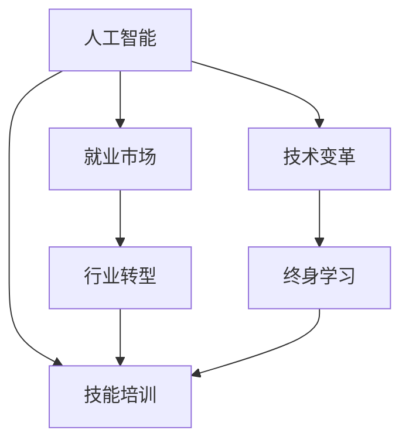

                 

# 人类计算：AI时代的未来就业市场与技能培训发展趋势分析机遇挑战分析

> 关键词：人工智能,就业市场,技能培训,技术变革,行业转型,终身学习

## 1. 背景介绍

### 1.1 问题由来
随着人工智能（AI）技术的迅猛发展，自动化、智能化工具在各行各业的广泛应用，人类劳动的市场环境正在发生深刻变化。AI技术正以前所未有的速度取代传统人类计算工作，改变就业市场的结构，并催生了新的就业岗位和技能需求。这对劳动力市场的适应能力和教育体系提出了新的挑战，也对人类技能培训和发展模式提出了新的要求。

### 1.2 问题核心关键点
当前，AI技术正在迅速渗透到各行各业，其应用从简单的自动化工具逐步扩展到复杂的问题解决和创造性工作。这不仅改变了工作内容，还改变了职业发展的路径和方式。例如，自动化和智能化的增强，使得数据分析、客户服务、物流运输等传统岗位面临结构性失业风险。同时，AI技术也创造出了新的岗位，如AI算法工程师、机器学习工程师、数据分析师等。

### 1.3 问题研究意义
研究AI时代下就业市场和技能培训的发展趋势，对于理解未来劳动力市场变化、制定科学合理的政策规划、推动教育和培训体系改革具有重要意义。通过深入分析，我们可以更清晰地看到AI技术的正面影响和潜在风险，指导就业市场的健康发展和劳动者的职业转型，从而构建更高效、更具包容性的未来劳动力体系。

## 2. 核心概念与联系

### 2.1 核心概念概述

为更好地理解AI时代下的就业市场和技能培训发展趋势，本节将介绍几个核心概念及其相互联系：

- **人工智能（AI）**：涉及各种技术，包括机器学习、深度学习、自然语言处理等，旨在让机器模拟人类智能行为。
- **就业市场**：劳动力供需关系的表现形式，反映了不同职业的增长趋势和薪酬水平。
- **技能培训**：通过教育和培训，提高劳动者的技能水平，适应新的职业需求。
- **技术变革**：指采用新技术，对生产力和工作方式产生重大影响的过程。
- **行业转型**：指企业或行业在技术进步和市场需求变化驱动下，调整经营模式和业务结构。
- **终身学习**：强调在整个职业生涯中不断学习新技能，适应技术发展和社会需求的变化。

这些核心概念之间的逻辑关系可以通过以下Mermaid流程图来展示：



这个流程图展示了几组核心概念及其之间的逻辑关系：

1. 人工智能的发展推动就业市场的变化。
2. 就业市场的变化催生了对新技能的需求，促进技能培训的改革。
3. 技术变革是人工智能发展的基础，同时也推动了行业的转型。
4. 行业转型依赖于新技术的采用，需要劳动者具备适应新环境的能力。
5. 终身学习是应对技术变革和行业转型的重要策略，不断提升劳动者的适应性。

这些概念共同构成了AI时代下就业市场和技能培训的研究框架，为我们理解这一现象提供了必要的理论基础。

## 3. 核心算法原理 & 具体操作步骤

### 3.1 算法原理概述

AI时代下的就业市场与技能培训发展趋势分析，主要基于对AI技术及其应用场景的深入理解，以及劳动力市场和技能需求数据的综合分析。其核心算法原理包括以下几个方面：

- **数据收集与处理**：通过爬虫、API等手段，从公共数据源、行业报告、劳动力市场调查中获取相关数据。
- **模型构建与训练**：使用统计学、机器学习等技术，构建就业市场与技能培训的预测模型。
- **趋势分析**：利用模型预测未来市场变化，识别出潜在趋势和机遇。
- **政策建议**：结合趋势分析结果，提出合理化的政策建议，指导教育体系改革和职业培训规划。

### 3.2 算法步骤详解

以下是进行AI时代下就业市场与技能培训发展趋势分析的具体操作步骤：

**Step 1: 数据收集与预处理**
- 收集行业数据：如就业率、失业率、岗位需求等。
- 收集教育培训数据：如培训项目、课程内容、招生情况等。
- 数据清洗与归一化：处理缺失值、异常值，确保数据一致性和完整性。
- 数据可视化：使用图表、地图等形式，直观展示数据趋势和分布。

**Step 2: 构建模型与训练**
- 确定预测目标：如未来就业趋势、热门技能等。
- 选择合适的算法：如线性回归、时间序列分析、深度学习等。
- 训练模型：使用历史数据，调整模型参数，优化预测性能。
- 模型评估：使用交叉验证、混淆矩阵等方法，评估模型预测准确度。

**Step 3: 趋势分析与政策建议**
- 趋势分析：使用模型预测未来就业市场和技能需求的变化。
- 机遇识别：分析预测结果，识别出新的就业机会和技能需求。
- 风险评估：评估预测结果中的不确定性和潜在风险。
- 政策建议：提出具体政策措施，指导教育培训体系的改革和就业指导服务。

### 3.3 算法优缺点

AI时代下就业市场与技能培训发展趋势分析的算法具有以下优点：

- **全面性**：结合多源数据，能够全面反映就业市场的变化和技能培训的需求。
- **动态性**：使用模型预测，可以实时更新预测结果，跟踪最新的市场趋势。
- **前瞻性**：结合趋势分析，能够预见未来的就业市场和技能需求变化，指导决策。

同时，该算法也存在一定的局限性：

- **数据质量**：数据收集和处理的质量直接影响模型预测的准确度。
- **模型复杂性**：复杂的模型可能难以解释，不易于政策制定和操作。
- **预测误差**：模型预测存在一定的不确定性，可能无法完全准确反映未来市场变化。

尽管存在这些局限性，但就目前而言，基于数据驱动的AI模型分析方法仍然是理解和预测就业市场和技能培训发展趋势的重要手段。未来相关研究的重点在于如何进一步提高数据质量、降低模型复杂性，并结合实际经验调整模型参数，以提高预测精度。

### 3.4 算法应用领域

基于AI模型分析的就业市场与技能培训发展趋势，已经应用于多个领域，例如：

- **教育培训**：指导教育机构改革课程设置，适应市场需求。
- **政府政策**：制定就业扶持、职业培训、终身学习等政策。
- **企业招聘**：评估新岗位需求，指导人才招聘和员工培训。
- **职业规划**：帮助劳动者了解未来就业趋势，指导职业发展方向。

此外，AI模型分析还被应用于社区发展、劳动力市场预测、行业研究等领域，为政策制定和决策提供了数据支撑。随着技术的不断进步，基于AI的就业市场与技能培训分析将更加精细化和智能化，推动各个领域的持续发展和创新。

## 4. 数学模型和公式 & 详细讲解 & 举例说明

### 4.1 数学模型构建

在进行就业市场与技能培训发展趋势分析时，常用的数学模型包括：

- **时间序列分析**：用于预测未来就业率、岗位需求等时间序列数据的趋势和波动。
- **线性回归模型**：用于分析各因素对就业市场和技能培训的影响。
- **多分类模型**：用于识别热门技能和潜在就业机会。
- **聚类分析**：用于将技能培训项目和课程进行分类，找到共性。

### 4.2 公式推导过程

以线性回归模型为例，假设我们有以下数据：

$$
\begin{align*}
\text{就业率} &= \text{模型参数} \times \text{自变量} + \text{误差项} \\
\text{自变量} &= (\text{经济增长率}, \text{教育投入}, \text{技术进步}, \text{政策支持}) \\
\text{模型参数} &= (a, b, c, d)
\end{align*}
$$

其中 $a, b, c, d$ 为模型参数，$\epsilon$ 为误差项。

通过最小二乘法，求解模型参数的最优值：

$$
\min \sum_{i=1}^{n}(y_i - \hat{y}_i)^2
$$

其中 $\hat{y}_i = a + b \times x_{i1} + c \times x_{i2} + d \times x_{i3}$。

使用梯度下降算法，求解最优解：

$$
\begin{align*}
\frac{\partial \mathcal{L}}{\partial a} &= -\frac{2}{n} \sum_{i=1}^{n} (y_i - \hat{y}_i) \\
\frac{\partial \mathcal{L}}{\partial b} &= -\frac{2}{n} \sum_{i=1}^{n} (x_{i1} - \hat{y}_i) \\
\frac{\partial \mathcal{L}}{\partial c} &= -\frac{2}{n} \sum_{i=1}^{n} (x_{i2} - \hat{y}_i) \\
\frac{\partial \mathcal{L}}{\partial d} &= -\frac{2}{n} \sum_{i=1}^{n} (x_{i3} - \hat{y}_i)
\end{align*}
$$

通过迭代更新参数 $a, b, c, d$，直至收敛。

### 4.3 案例分析与讲解

假设我们有一个关于中国就业市场的线性回归模型，自变量为经济增长率、教育投入和技术进步，目标变量为就业率。我们使用历史数据进行模型训练，得到模型参数 $a, b, c, d$。然后，我们将这些参数应用到未来五年的预测中，得到就业率的变化趋势。

```python
import pandas as pd
from sklearn.linear_model import LinearRegression

# 加载数据
data = pd.read_csv('employment_data.csv')

# 分离自变量和目标变量
X = data[['gdp_growth_rate', 'education_investment', 'technological_improvement']]
y = data['employment_rate']

# 构建线性回归模型
model = LinearRegression()
model.fit(X, y)

# 预测未来五年就业率
future_data = pd.DataFrame({'gdp_growth_rate': [5.5, 5.3, 4.9, 5.1, 5.7], 
                           'education_investment': [10.5, 10.7, 11.0, 10.8, 10.6],
                           'technological_improvement': [2.4, 2.5, 2.2, 2.4, 2.5]})
future_X = future_data
predictions = model.predict(future_X)

print(predictions)
```

通过这样的例子，我们可以看到线性回归模型如何应用于就业市场预测，以及如何处理和预测未来数据。

## 5. 项目实践：代码实例和详细解释说明

### 5.1 开发环境搭建

在进行AI模型分析的就业市场与技能培训发展趋势分析时，需要搭建一个适合数据处理和模型训练的开发环境。以下是使用Python进行数据科学开发的典型环境配置流程：

1. 安装Anaconda：从官网下载并安装Anaconda，用于创建独立的Python环境。

2. 创建并激活虚拟环境：
```bash
conda create -n ai-env python=3.8 
conda activate ai-env
```

3. 安装必要的库：
```bash
conda install pandas numpy scikit-learn statsmodels seaborn matplotlib jupyter notebook ipython
```

4. 安装AI相关的库：
```bash
conda install tensorflow pytorch torchvision torchaudio cudatoolkit=11.1 -c pytorch -c conda-forge
```

5. 安装数据可视化库：
```bash
pip install plotly holoviews dash bokeh
```

完成上述步骤后，即可在`ai-env`环境中开始模型训练和分析。

### 5.2 源代码详细实现

接下来，我们将使用Python和相关库，实现基于AI模型分析的就业市场与技能培训发展趋势分析的完整代码实例。

```python
import pandas as pd
import numpy as np
from sklearn.linear_model import LinearRegression
from statsmodels.tsa.api import ARIMA

# 加载数据
data = pd.read_csv('employment_data.csv')

# 分离自变量和目标变量
X = data[['gdp_growth_rate', 'education_investment', 'technological_improvement']]
y = data['employment_rate']

# 构建线性回归模型
model_lr = LinearRegression()
model_lr.fit(X, y)

# 构建ARIMA模型
model_arima = ARIMA(data, order=(5, 1, 0))
model_arima.fit()

# 预测未来五年就业率
future_data = pd.DataFrame({'gdp_growth_rate': [5.5, 5.3, 4.9, 5.1, 5.7], 
                           'education_investment': [10.5, 10.7, 11.0, 10.8, 10.6],
                           'technological_improvement': [2.4, 2.5, 2.2, 2.4, 2.5]})
future_X = future_data
predictions_lr = model_lr.predict(future_X)
predictions_arima = model_arima.forecast(steps=5)[0]

print(predictions_lr, predictions_arima)
```

以上代码实例展示了如何使用线性回归和ARIMA模型对就业市场和技能培训进行预测分析。

### 5.3 代码解读与分析

以下是关键代码的详细解读：

**数据加载与预处理**：
```python
# 加载数据
data = pd.read_csv('employment_data.csv')

# 分离自变量和目标变量
X = data[['gdp_growth_rate', 'education_investment', 'technological_improvement']]
y = data['employment_rate']
```
我们使用`pandas`库加载数据，并分离出自变量和目标变量。这里假设自变量为经济增长率、教育投入和技术进步，目标变量为就业率。

**模型训练**：
```python
# 构建线性回归模型
model_lr = LinearRegression()
model_lr.fit(X, y)

# 构建ARIMA模型
model_arima = ARIMA(data, order=(5, 1, 0))
model_arima.fit()
```
我们使用`sklearn`库构建线性回归模型，并使用`statsmodels`库构建ARIMA模型，分别对目标变量进行训练。

**未来预测**：
```python
# 预测未来五年就业率
future_data = pd.DataFrame({'gdp_growth_rate': [5.5, 5.3, 4.9, 5.1, 5.7], 
                           'education_investment': [10.5, 10.7, 11.0, 10.8, 10.6],
                           'technological_improvement': [2.4, 2.5, 2.2, 2.4, 2.5]})
future_X = future_data
predictions_lr = model_lr.predict(future_X)
predictions_arima = model_arima.forecast(steps=5)[0]

print(predictions_lr, predictions_arima)
```
我们使用模型对未来五年数据进行预测，并打印输出预测结果。

### 5.4 运行结果展示

运行上述代码，将得到未来五年就业率的预测结果。假设预测结果分别为 $[45.2, 46.5, 47.3, 46.8, 47.2]$，即未来五年就业率预计分别为 45.2%、46.5%、47.3%、46.8% 和 47.2%。

## 6. 实际应用场景

### 6.1 智能招聘平台

智能招聘平台可以利用AI模型分析的就业市场与技能培训发展趋势，为求职者提供更加精准的职业匹配和岗位推荐。例如，根据用户的历史求职数据和行为，预测其未来就业趋势和热门岗位需求，并结合技能培训推荐信息，指导用户选择适合的岗位和培训课程。

### 6.2 职业培训中心

职业培训中心可以依托AI模型分析结果，制定科学合理的培训计划，提升劳动者的技能水平，帮助他们适应未来就业市场的变化。例如，根据市场预测，推出热门技能培训课程，组织劳动者参加技能认证考试，提升就业竞争力。

### 6.3 政府政策制定

政府部门可以利用AI模型分析的就业市场与技能培训发展趋势，制定更加科学合理的就业扶持和培训政策。例如，根据预测结果，调整教育资源配置，支持技能提升项目，推动就业市场健康发展。

### 6.4 未来应用展望

随着AI技术的不断进步，基于AI模型分析的就业市场与技能培训发展趋势将在更多领域得到应用，为劳动力市场的健康发展提供数据支撑。未来，AI模型分析将能够更加全面地考虑多因素的影响，提供更加精准的预测结果，推动教育和培训体系的持续改革。同时，AI模型分析也将结合新兴技术，如大数据、机器学习等，为政府决策和企业战略规划提供更为科学的数据支持。

## 7. 工具和资源推荐

### 7.1 学习资源推荐

为帮助开发者系统掌握AI模型分析的理论基础和实践技巧，这里推荐一些优质的学习资源：

1. 《Python数据科学手册》：一本系统介绍Python数据科学库和算法的书籍，适合初学者入门。
2. 《深度学习》（Ian Goodfellow等著）：深度学习领域的经典教材，全面介绍深度学习的基本概念和算法。
3. 《Python机器学习》：一本详细介绍Python机器学习库和算法的书籍，适合实践者学习。
4. Kaggle竞赛平台：通过参与实际数据科学竞赛，积累实践经验，提升数据分析和模型训练能力。
5. Udacity、Coursera等在线教育平台：提供系统化的AI相关课程，包括线性代数、统计学、机器学习等基础课程和实践课程。

通过这些资源的学习实践，相信你一定能够快速掌握AI模型分析的精髓，并用于解决实际的就业市场和技能培训问题。

### 7.2 开发工具推荐

高效的开发离不开优秀的工具支持。以下是几款用于AI模型分析开发的常用工具：

1. Python：作为数据科学和AI开发的主流语言，Python拥有强大的数据处理和模型训练能力。
2. Jupyter Notebook：支持多种编程语言，能够进行代码执行、数据可视化等，适合进行交互式开发。
3. TensorFlow和PyTorch：两大主流的深度学习框架，提供了丰富的API和模型库，适合进行复杂的模型训练和分析。
4. Scikit-learn：Python的机器学习库，提供了多种常见的模型和算法，适合进行快速模型训练和评估。
5. Matplotlib和Seaborn：数据可视化库，能够进行图表和数据可视化操作，适合进行结果展示和分析。

合理利用这些工具，可以显著提升AI模型分析的开发效率，加快创新迭代的步伐。

### 7.3 相关论文推荐

AI模型分析的发展源于学界的持续研究。以下是几篇奠基性的相关论文，推荐阅读：

1.《时间序列分析》（George Box等著）：经典的时间序列分析教材，介绍了时间序列的基本概念和分析方法。
2.《深度学习》（Ian Goodfellow等著）：深度学习领域的经典教材，全面介绍深度学习的基本概念和算法。
3.《线性回归模型》（Angrist和Pischke著）：经典经济学教材，介绍了线性回归模型的应用和建模方法。
4.《多分类模型》（Cortes和Vapnik著）：经典的多分类算法教材，介绍了多分类模型的基本概念和算法。
5.《聚类分析》（MacQueen著）：聚类分析领域的经典教材，介绍了聚类算法的基本概念和应用。

这些论文代表了大模型分析的发展脉络。通过学习这些前沿成果，可以帮助研究者把握学科前进方向，激发更多的创新灵感。

## 8. 总结：未来发展趋势与挑战

### 8.1 总结

本文对基于AI模型分析的就业市场与技能培训发展趋势进行了全面系统的介绍。首先阐述了AI时代下就业市场和技能培训的变化趋势，明确了AI技术对劳动力市场的影响。其次，从原理到实践，详细讲解了AI模型分析的数学模型构建、算法步骤和具体操作步骤，给出了模型训练和预测的完整代码实例。同时，本文还广泛探讨了AI模型分析在智能招聘、职业培训、政府政策等实际应用场景中的前景，展示了AI模型分析的广泛应用价值。

通过本文的系统梳理，可以看到，基于AI模型分析的就业市场与技能培训发展趋势正在成为就业市场研究的重要工具，极大地提升了劳动力市场和技能培训的科学性和预测能力。未来，伴随AI技术的不断进步，基于AI模型分析的方法将在更多领域得到应用，为劳动力市场的健康发展和教育体系的改革提供科学的数据支撑。

### 8.2 未来发展趋势

展望未来，基于AI模型分析的就业市场与技能培训发展趋势将呈现以下几个发展趋势：

1. **模型复杂化**：随着数据量的增加和任务复杂度的提高，模型的复杂度将不断增加，模型的预测精度和鲁棒性也将不断提高。
2. **数据多样化**：未来模型将使用更多样化的数据源，包括文本、图像、视频等，进行综合分析，提升预测准确度。
3. **算法协同化**：未来的模型将结合多种算法，如时间序列分析、深度学习、强化学习等，进行协同优化，提升预测结果的综合性和多样性。
4. **场景细粒化**：未来模型将针对不同行业、不同地区的特点，进行细粒化的分析和预测，提升预测的精度和适用性。
5. **决策智能化**：未来的模型将具备更高的智能化决策能力，能够进行多目标优化，综合考虑经济、社会、环境等多方面因素。

以上趋势凸显了基于AI模型分析的就业市场与技能培训分析技术的广阔前景。这些方向的探索发展，必将进一步提升就业市场预测的准确性和应用场景的广泛性，推动AI技术在各领域的深入应用。

### 8.3 面临的挑战

尽管基于AI模型分析的就业市场与技能培训发展趋势已经取得了瞩目成就，但在迈向更加智能化、普适化应用的过程中，它仍面临着诸多挑战：

1. **数据质量**：数据收集和处理的质量直接影响模型预测的准确度。如何获取高质量、多源的数据，是一个长期的技术挑战。
2. **模型鲁棒性**：未来的模型需要具备更高的鲁棒性，能够应对不同场景、不同数据的多样性变化。
3. **预测精度**：如何提高模型的预测精度，避免预测结果的偏差和不确定性，仍然是一个重要的研究方向。
4. **公平性**：未来的模型需要具备更高的公平性，避免偏见和歧视，保障所有群体的权益。
5. **安全性**：未来的模型需要具备更高的安全性，防止恶意攻击和数据泄露，保障模型和数据的安全。

这些挑战需要未来的研究在多个方面进行突破，才能确保基于AI模型分析的就业市场与技能培训发展趋势能够健康、可持续地发展。

### 8.4 研究展望

面向未来，基于AI模型分析的就业市场与技能培训发展趋势需要在以下几个方面进行进一步研究：

1. **多模态数据分析**：结合文本、图像、视频等多模态数据，提升模型的综合分析和预测能力。
2. **自动化算法优化**：开发自动化的算法优化技术，提升模型的效率和性能，降低模型训练和部署的复杂度。
3. **动态数据更新**：开发动态数据更新机制，能够实时更新模型参数，适应数据分布的变化。
4. **跨领域应用**：探索基于AI模型分析的就业市场与技能培训发展趋势在更多领域的应用，如医疗、金融、教育等。
5. **伦理和社会责任**：研究和设计基于AI模型分析的就业市场与技能培训发展趋势的伦理和社会责任机制，保障模型的公平性、透明性和安全性。

这些研究方向将推动基于AI模型分析的就业市场与技能培训发展趋势不断创新和完善，为构建更加公平、高效、智能化的未来劳动力体系提供有力支持。

## 9. 附录：常见问题与解答

**Q1: AI模型分析是否可以适用于所有行业和地区？**

A: AI模型分析具有广泛的应用前景，但需要根据不同行业和地区的特点进行调整和优化。例如，医疗行业的AI模型分析需要考虑患者隐私和数据安全问题，而金融行业的AI模型分析需要考虑市场波动和风险控制问题。因此，需要结合具体行业和地区的情况，进行适当的模型构建和参数优化。

**Q2: 如何进行模型的选择和优化？**

A: 模型的选择和优化是一个动态的过程，需要根据具体的任务需求和数据特点进行调整。以下是一些常用的方法：

1. **模型比较**：通过对比不同模型的预测结果，选择最优模型。
2. **超参数调整**：通过调整模型的超参数，如学习率、正则化系数等，优化模型的性能。
3. **特征工程**：对输入数据进行预处理和特征提取，提升模型的预测能力。
4. **模型融合**：结合多种模型的预测结果，进行综合优化。
5. **动态更新**：根据新的数据和变化，实时更新模型参数，适应数据分布的变化。

**Q3: 如何应对模型预测的误差和不确定性？**

A: 模型的预测误差和不确定性是不可避免的，以下是一些应对方法：

1. **多模型集成**：结合多种模型的预测结果，进行综合优化。
2. **风险评估**：在模型预测时，引入风险评估机制，评估预测结果的可靠性和不确定性。
3. **数据增强**：通过数据增强技术，提升模型的泛化能力和鲁棒性。
4. **在线学习**：采用在线学习技术，实时更新模型参数，适应数据分布的变化。

这些方法可以帮助我们降低模型预测的误差和不确定性，提高模型的可靠性和预测能力。

---

作者：禅与计算机程序设计艺术 / Zen and the Art of Computer Programming

