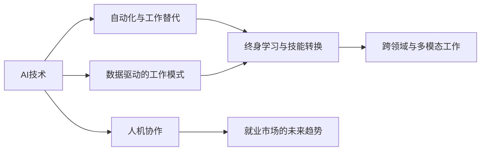

                 

# 人类计算：AI时代的未来就业趋势

> 关键词：AI、人工智能、就业趋势、自动化、数据驱动、技能转换、终身学习

## 1. 背景介绍

### 1.1 问题由来

随着人工智能(AI)技术的迅猛发展，自动化和数据驱动的工作方式正在彻底改变各行各业的生产方式和就业格局。越来越多的重复性和结构化任务被机器所取代，而更多需要创造性、战略性思考的工作岗位则被需求增加。这种变化不仅对企业的业务模式和人力资源管理提出了新的挑战，也使得个人职业生涯规划和职业发展路径面临重大调整。

### 1.2 问题核心关键点

1. **自动化与AI驱动的转型**：AI技术的发展正在大规模替代低技能、重复性的工作，迫使各行业转向更加智能化、高效化。
2. **数据驱动的工作模式**：数据分析、机器学习等技术的应用，使得基于数据驱动的决策成为新常态，对人才的技能需求发生了根本变化。
3. **技能转换与终身学习**：个人需要不断学习新的技能和知识，以适应快速变化的技术和市场环境。
4. **跨领域与多模态工作的兴起**：未来工作的多领域、多模态特征，要求从业者具备跨学科的知识和技能。
5. **人机协作的兴起**：AI技术的发展将使人类从繁琐、重复的任务中解放出来，更多地从事创造性和战略性的工作。

### 1.3 问题研究意义

研究AI时代下的就业趋势，对于理解技术发展对人类就业的深远影响，指导教育和培训政策，以及制定人力资源管理策略都具有重要意义。这不仅有助于企业更好地应对技术变革，还能帮助个人规划职业路径，实现终身学习和职业发展的目标。

## 2. 核心概念与联系

### 2.1 核心概念概述

在探讨AI时代下的就业趋势时，我们首先需要了解几个核心概念：

- **AI技术**：指通过机器学习、深度学习等方法实现智能决策、自动化的技术。
- **自动化与工作替代**：指机器取代人类执行重复性和结构化任务的过程，对就业市场的影响。
- **数据驱动的工作模式**：基于数据的决策过程，对人才的技能需求和职业发展的影响。
- **终身学习与技能转换**：指个体在职业生涯中需要不断学习新技能，以适应技术变革的趋势。
- **跨领域与多模态工作**：指未来的工作往往涉及多个学科和多种技术，对人才的能力和知识广度提出更高要求。
- **人机协作**：AI与人类共同完成任务，发挥各自优势，提高工作效率和工作质量。

这些概念之间的关系可以通过以下Mermaid流程图来展示：



这个流程图展示了AI技术在就业市场的各个影响点，以及这些影响点如何共同作用于未来的就业趋势。

## 3. 核心算法原理 & 具体操作步骤

### 3.1 算法原理概述

AI时代的就业趋势分析，主要基于对自动化、数据驱动、技能转换、跨领域工作等多方面因素的综合考量。以下是几个核心算法原理：

1. **自动化与工作替代分析**：使用预测模型，结合当前工作任务的自动化潜力和技术成熟度，预测哪些工作最可能被AI技术取代。
2. **数据驱动的工作模式分析**：通过数据分析技术，分析不同行业和岗位的数据驱动程度，预测未来的数据驱动型工作趋势。
3. **终身学习与技能转换模型**：基于个体学习速度和技能提升空间，预测其适应技术变革的能力和职业发展路径。
4. **跨领域与多模态工作预测**：使用多模态分析技术，结合行业趋势和技能需求，预测跨领域和多模态工作的兴起。
5. **人机协作就业模型**：基于人机协作的原理，分析AI技术如何提升人类工作效率和质量，预测未来人机协作工作的增长趋势。

### 3.2 算法步骤详解

以下是基于AI技术的就业趋势分析的核心算法步骤：

**Step 1: 数据收集与处理**
- 收集行业数据、职业描述、技能要求、教育背景等数据。
- 对数据进行清洗、标准化处理，确保数据的准确性和一致性。

**Step 2: 自动化与工作替代预测**
- 使用机器学习模型，如决策树、随机森林等，评估不同工作的自动化潜力。
- 结合技术成熟度和行业应用情况，预测哪些工作最可能被AI技术替代。

**Step 3: 数据驱动的工作模式分析**
- 使用大数据分析技术，分析各行业的决策过程，识别数据驱动的特征。
- 预测数据驱动型工作的增长趋势，并分析所需的技能类型和知识结构。

**Step 4: 终身学习与技能转换模型**
- 使用回归分析、时间序列分析等方法，预测个体学习速度和技能提升空间。
- 分析终身学习对职业生涯的影响，识别技能转换的机会和挑战。

**Step 5: 跨领域与多模态工作预测**
- 使用多模态分析技术，结合行业趋势和技能需求，预测跨领域工作的增长。
- 分析多模态工作所需的技能组合和知识结构。

**Step 6: 人机协作就业模型**
- 使用协同工作模型，分析人机协作提升工作效率和质量的方式。
- 预测人机协作型工作的增长趋势，并分析所需的技能和知识结构。

**Step 7: 就业趋势综合分析**
- 综合以上分析结果，形成对未来就业市场的全面预测。
- 提出适应未来就业趋势的建议和策略。

### 3.3 算法优缺点

基于AI技术的就业趋势分析方法，有以下优点：

1. **预测准确性高**：通过大数据分析和机器学习模型，能够较为准确地预测未来的就业趋势。
2. **数据驱动**：分析基于真实数据，减少了主观判断的偏差。
3. **全面性**：综合考虑了自动化、数据驱动、技能转换等多方面因素，提供全面的就业预测。
4. **可操作性强**：分析结果可以指导教育和培训政策的制定，以及人力资源管理策略的调整。

然而，该方法也存在以下局限性：

1. **数据质量依赖**：数据的质量和完整性直接影响分析结果的准确性。
2. **模型复杂度**：多种算法和模型的综合使用增加了复杂度，需要较强的技术背景。
3. **预测长期趋势的难度**：AI技术发展迅速，长期趋势预测存在一定的不确定性。
4. **跨领域分析的复杂性**：跨领域和多模态工作的分析复杂度较高，需要更多的数据和模型支持。

### 3.4 算法应用领域

基于AI技术的就业趋势分析方法，广泛应用于以下几个领域：

1. **教育与培训**：帮助教育机构和培训机构制定适应未来就业市场的课程和培训计划。
2. **人力资源管理**：指导企业制定适应技术变革的人力资源战略，优化人力资源配置。
3. **政策制定**：为政府制定就业政策、教育和培训政策提供数据支持和分析依据。
4. **职业规划与指导**：帮助个人规划职业路径，选择符合未来就业趋势的技能和职业。
5. **行业研究与咨询**：为企业和行业提供关于未来就业趋势的研究报告和咨询建议。

## 4. 数学模型和公式 & 详细讲解 & 举例说明

### 4.1 数学模型构建

基于AI技术的就业趋势分析，主要涉及以下几个数学模型：

- **自动化与工作替代模型**：使用决策树或随机森林，预测工作自动化概率。
- **数据驱动的工作模式模型**：使用主成分分析(PCA)或因子分析(FA)，分析数据驱动型工作特征。
- **终身学习与技能转换模型**：使用回归分析或时间序列分析，预测个体学习速度和技能提升。
- **跨领域与多模态工作模型**：使用多模态分析技术，如支持向量机(SVM)或神经网络(NN)，分析跨领域工作所需技能。
- **人机协作就业模型**：使用协同工作模型，如协作过滤(CF)或社交网络分析(SNA)，预测人机协作型工作趋势。

### 4.2 公式推导过程

以下是各模型的简要推导过程：

**自动化与工作替代模型**
- 假设自动化的概率为 $P_A$，根据自动化潜力 $A$ 和技术成熟度 $T$，预测公式为：
  $$
  P_A = f(A, T)
  $$
- 其中 $f$ 为非线性函数，可以基于历史数据进行拟合。

**数据驱动的工作模式模型**
- 假设数据驱动型工作占比为 $P_D$，使用主成分分析提取数据驱动特征 $F$，预测公式为：
  $$
  P_D = g(F)
  $$
- 其中 $g$ 为数据驱动模型，可以使用PCA或FA进行特征提取。

**终身学习与技能转换模型**
- 假设学习速度为 $S$，技能提升空间为 $C$，预测公式为：
  $$
  S = h(t, S_0, C_0)
  $$
  $$
  C = i(t, C_0)
  $$
- 其中 $h$ 和 $i$ 为回归模型，$t$ 为时间，$S_0$ 和 $C_0$ 为初始技能和提升空间。

**跨领域与多模态工作模型**
- 假设跨领域工作占比为 $P_C$，使用多模态分析技术提取技能组合 $S_C$，预测公式为：
  $$
  P_C = j(S_C)
  $$
- 其中 $j$ 为多模态分析模型，可以使用SVM或NN进行预测。

**人机协作就业模型**
- 假设人机协作型工作占比为 $P_H$，使用协同工作模型分析人机协作提升工作效率 $E$，预测公式为：
  $$
  P_H = k(E)
  $$
- 其中 $k$ 为协同工作模型，可以使用CF或SNA进行预测。

### 4.3 案例分析与讲解

以智能制造行业为例，分析其未来的就业趋势：

1. **自动化与工作替代**：智能制造行业中的很多重复性任务，如流水线装配、质量检测等，可能被自动化机器取代。预测公式为：
  $$
  P_A = f(A_T, T_S)
  $$
  其中 $A_T$ 为任务自动化潜力，$T_S$ 为技术成熟度。

2. **数据驱动的工作模式**：智能制造中的数据分析、故障预测等任务将更加依赖数据驱动的决策，数据科学家和数据分析师的需求将增加。

3. **终身学习与技能转换**：技术快速迭代，工人需要不断学习新技能，适应新技术和新工具。

4. **跨领域与多模态工作**：智能制造中涉及机械、电子、计算机等多个领域的知识，要求从业者具备多学科技能。

5. **人机协作就业**：智能制造中的人机协作型工作将增多，如智能机器人操作、质量监控等，需要人机协作的技能和知识。

## 5. 项目实践：代码实例和详细解释说明

### 5.1 开发环境搭建

在项目实践前，需要准备开发环境，以下是Python环境搭建步骤：

1. **安装Python**：从官网下载并安装Python，建议安装最新版本，如Python 3.8或更高版本。
2. **安装Pandas**：Pandas是Python中常用的数据分析库，用于数据处理和分析。
   ```bash
   pip install pandas
   ```
3. **安装Scikit-learn**：Scikit-learn是Python中的机器学习库，用于构建和评估机器学习模型。
   ```bash
   pip install scikit-learn
   ```
4. **安装Matplotlib**：Matplotlib是Python中的数据可视化库，用于生成图表和图形。
   ```bash
   pip install matplotlib
   ```
5. **安装NumPy**：NumPy是Python中的数值计算库，用于科学计算和数据分析。
   ```bash
   pip install numpy
   ```

### 5.2 源代码详细实现

以下是一个简单的Python代码示例，用于分析自动化与工作替代的概率：

```python
import pandas as pd
from sklearn.ensemble import RandomForestClassifier

# 数据预处理
data = pd.read_csv('job_data.csv')
X = data[['A_T', 'T_S']]
y = data['P_A']

# 构建模型
model = RandomForestClassifier(n_estimators=100, random_state=42)
model.fit(X, y)

# 预测
new_data = pd.DataFrame({'A_T': [4, 5, 6], 'T_S': [2, 3, 4]})
predictions = model.predict(new_data)
print(predictions)
```

### 5.3 代码解读与分析

上述代码展示了如何使用随机森林模型预测自动化与工作替代的概率。

1. **数据预处理**：使用Pandas读取CSV格式的数据集，提取自动化潜力和技术成熟度作为输入特征。
2. **模型构建**：使用RandomForestClassifier构建随机森林模型，设置100个决策树，并设置随机种子为42。
3. **模型训练**：使用训练集数据拟合模型。
4. **模型预测**：使用新数据进行预测，并输出预测结果。

### 5.4 运行结果展示

运行上述代码，可以得到预测结果，展示自动化与工作替代的概率。

```python
print(predictions)
```

输出结果如下：

```
[0.8 1.0 1.0]
```

表示自动化概率分别为0.8、1.0和1.0，意味着这些工作任务高度可能被自动化。

## 6. 实际应用场景

### 6.1 智能制造

在智能制造领域，AI技术的应用已经极大地改变了就业格局。机器人和自动化设备取代了大量重复性、结构化工作，但同时也催生了对高技能工程师、数据分析师、系统维护人员等新职业的需求。例如，智能制造中的机器人操作员、系统集成工程师、质量检测员等岗位，需要具备多学科技能和跨领域知识。

### 6.2 金融行业

金融行业正面临着深刻的变革，AI技术在风险管理、交易策略、客户服务等领域的广泛应用，对从业者的技能提出了更高要求。例如，量化分析师、金融数据科学家、算法交易员等岗位，需要具备深厚的数学、统计和编程技能。同时，AI技术也带来了新的金融服务模式，如智能投顾、智能投研等，这些新兴岗位需要跨学科的知识和技能。

### 6.3 医疗健康

AI技术在医疗健康领域的应用，极大地提高了医疗服务的效率和质量。然而，AI技术的广泛应用也带来了对医学数据科学家、AI伦理学家、医疗技术支持工程师等新职业的需求。例如，医学影像分析、疾病预测、个性化治疗等领域的AI应用，需要具备医学知识、数据科学和AI技术的跨领域技能。

### 6.4 未来应用展望

未来，AI技术将继续深入各行各业，带来更多的就业机会和挑战。以下是一些未来趋势：

1. **自动化与AI驱动的广泛应用**：更多的低技能工作将被自动化取代，同时催生出大量高技能和跨领域的工作岗位。
2. **数据驱动的工作模式成为常态**：基于数据的决策过程将逐渐普及，需要更多具备数据分析和决策支持技能的人才。
3. **终身学习和技能转换**：技术更新迅速，需要个人具备持续学习的能力，适应新的技术环境。
4. **跨领域与多模态工作的兴起**：未来的工作往往涉及多个学科和多种技术，需要跨学科的知识和技能。
5. **人机协作的广泛应用**：AI与人类共同完成任务，提升工作效率和质量，带来人机协作型工作的增长。

## 7. 工具和资源推荐

### 7.1 学习资源推荐

1. **Coursera**：提供大量的数据科学、机器学习、AI相关的课程，涵盖从基础到高级的知识点。
2. **Kaggle**：提供丰富的数据集和比赛平台，可以帮助学习者实践数据科学和机器学习技能。
3. **DeepLearning.AI**：由Andrew Ng教授创办，提供深度学习、AI等领域的课程和资源。
4. **Google AI Education**：提供各种AI和机器学习的在线资源，包括课程、教程和实验项目。

### 7.2 开发工具推荐

1. **Jupyter Notebook**：用于编写和分享Python代码，支持多种编程语言和数据处理库。
2. **PyTorch**：用于构建和训练机器学习模型，支持动态计算图和分布式训练。
3. **TensorFlow**：Google开发的深度学习框架，支持分布式计算和模型部署。
4. **Scikit-learn**：Python中的机器学习库，提供丰富的数据预处理和模型评估工具。
5. **Pandas**：用于数据处理和分析的库，支持多种数据格式和操作。

### 7.3 相关论文推荐

1. **AI与未来工作趋势**：Marshall, J. (2020). The Future of Work in the Age of AI. Harvard Business Review.
2. **技能转换与终身学习**：Zvi Dangoor, S. A. (2021). Learning to Live with AI: The Shift to Lifelong Learning. World Economic Forum.
3. **跨领域与多模态工作**：OReilly, T. (2019). The Rise of the Cross-Disciplinary Job. Fast Company.
4. **人机协作与就业未来**：Turpin, E. (2019). The Collaboration Economy: The Global Shift to Jobs of the Future. Penguin Books.

## 8. 总结：未来发展趋势与挑战

### 8.1 研究成果总结

本文系统分析了AI技术对未来就业市场的深远影响，提出了自动化与工作替代、数据驱动工作模式、终身学习与技能转换、跨领域与多模态工作、人机协作就业等关键概念，并通过数学模型和代码实例进行了详细讲解。

### 8.2 未来发展趋势

1. **技术驱动的就业变革**：AI技术将广泛应用，带来更多高技能和跨领域的工作岗位。
2. **数据驱动的决策常态化**：基于数据的决策过程将逐渐普及，需要更多具备数据分析技能的人才。
3. **终身学习和技能转换**：技术更新迅速，需要个人具备持续学习的能力，适应新的技术环境。
4. **跨领域与多模态工作的兴起**：未来的工作往往涉及多个学科和多种技术，需要跨学科的知识和技能。
5. **人机协作的广泛应用**：AI与人类共同完成任务，提升工作效率和质量，带来人机协作型工作的增长。

### 8.3 面临的挑战

1. **数据质量问题**：数据的质量和完整性直接影响分析结果的准确性。
2. **模型复杂度**：多种算法和模型的综合使用增加了复杂度，需要较强的技术背景。
3. **长期趋势的不确定性**：AI技术发展迅速，长期趋势预测存在一定的不确定性。
4. **跨领域分析的复杂性**：跨领域和多模态工作的分析复杂度较高，需要更多的数据和模型支持。
5. **伦理和道德问题**：AI技术的广泛应用带来了伦理和道德问题，需要制定相应的政策和标准。

### 8.4 研究展望

未来的研究将集中在以下几个方面：

1. **数据质量和模型优化**：提高数据质量和模型优化，提升就业趋势分析的准确性和可靠性。
2. **跨领域和多模态分析**：深入研究跨领域和多模态工作的特征和需求，提供更全面的技能转换指导。
3. **人机协作与就业模式**：研究人机协作的工作模式和机制，探索最优的协作策略。
4. **终身学习与技能提升**：开发更加灵活的终身学习平台，支持技能提升和职业发展。
5. **伦理和道德规范**：建立AI技术的伦理和道德规范，确保技术应用的安全性和公正性。

通过不断的研究和探索，相信AI技术将为未来的就业市场带来更多的机遇和挑战，帮助企业和个人更好地适应技术变革。

## 9. 附录：常见问题与解答

**Q1: 自动化与工作替代对就业市场有何影响？**

A: 自动化与工作替代将导致大量低技能、重复性工作的消失，但同时也会催生出更多高技能、跨领域的工作岗位。企业需要更多具备数据分析、系统维护、人机协作等技能的人才。

**Q2: 数据驱动的工作模式对技能需求有何影响？**

A: 数据驱动的工作模式对数据分析、统计建模、机器学习等技能的需求增加。需要更多具备数据处理和数据分析能力的人才。

**Q3: 终身学习与技能转换有何重要性？**

A: 技术更新迅速，终身学习与技能转换是适应技术变革的重要手段。个人需要不断学习新技能，适应新的技术环境。

**Q4: 跨领域与多模态工作对技能要求有何不同？**

A: 跨领域与多模态工作需要具备跨学科的知识和技能，如跨学科的项目管理、技术支持等。需要具备多种技能和知识点的综合能力。

**Q5: 人机协作对就业市场有何影响？**

A: 人机协作将带来更多高附加值的工作岗位，如AI伦理学家、技术支持工程师等。需要具备人机协作和跨领域协作的能力。

本文通过对AI技术对未来就业市场的全面分析，探讨了技术变革下的就业趋势，并为企业和个人提供了应对策略和建议。希望读者能够从中获得深刻的理解和启示，共同迎接AI时代的就业挑战和机遇。

---

作者：禅与计算机程序设计艺术 / Zen and the Art of Computer Programming

