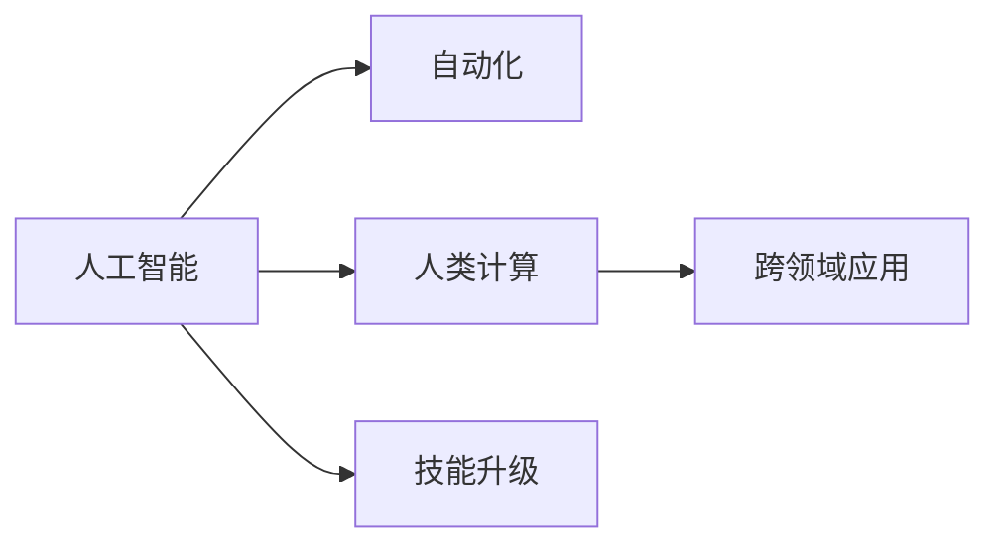

                 

# 人类计算：AI时代的未来就业趋势与技能要求

## 1. 背景介绍

随着人工智能技术的迅猛发展，自动化和智能化逐渐渗透到各行各业，传统的人类计算工作正面临深刻的变革。一方面，机器和算法在处理重复性、规则性任务方面展现出越来越强的能力；另一方面，对于复杂的非结构化数据和需要创造性思维的工作，人类依然占据优势。

当前，AI正处于飞速发展的黄金时期，技术创新和应用场景不断扩展。如何在这个变革时代中生存、发展，成为摆在每个人面前的重大课题。本文将系统地分析AI时代对就业市场的影响，探讨人类计算工作的新趋势与要求，并为从业人员提供实用的建议。

## 2. 核心概念与联系

### 2.1 核心概念概述

为更好地理解AI时代就业市场的变化，本节将介绍几个核心概念：

- **人工智能(AI)**：指通过算法和数据训练模型，使其具备类似于人类智能的行为和能力，包括感知、学习、推理、规划、自然语言处理、视觉识别等。
- **自动化(Automation)**：指使用AI技术，自动执行传统由人类完成的重复性、规则性工作，提高效率和准确性。
- **人类计算(Human Computing)**：指在AI时代，人类与机器并行工作，共同完成复杂的任务。人类计算强调人类的创造性、判断力和决策能力。
- **跨领域应用**：AI技术不仅在IT领域应用广泛，还在医疗、金融、教育、娱乐等行业产生深远影响。
- **技能升级**：为适应AI带来的变化，人类需要不断学习新技能，提升自身竞争力。

### 2.2 核心概念原理和架构的 Mermaid 流程图



这个流程图展示了核心概念之间的逻辑关系：

1. 人工智能提供了自动化和人类计算的基础能力。
2. 自动化技术极大地提升了工作效率和准确性。
3. 人类计算在AI时代仍然发挥重要作用，尤其是在需要创造性思维的领域。
4. 跨领域应用将AI技术广泛渗透到各个行业，推动技术革新。
5. 技能升级是保持竞争力的关键，是适应AI时代变化的重要途径。

## 3. 核心算法原理 & 具体操作步骤

### 3.1 算法原理概述

AI时代对就业市场的影响，主要体现在两个方面：自动化对低技能劳动力的替代效应，以及人工智能对高技能劳动力的需求增加。以下将详细探讨这一问题。

**自动化对低技能劳动力的影响**：
自动化技术主要取代那些重复性、规则性强、技术含量低的工作。例如，工厂流水线上的装配、银行柜员的窗口操作等，都有可能被机器取代。自动化技术通过精确控制、高速处理、低错误率等优势，使得这些工作逐渐失去价值。

**人工智能对高技能劳动力的需求增加**：
AI技术在复杂问题解决、数据分析、创新思维等方面具有独特优势。对于需要创造性思维、复杂判断的岗位，AI的介入反而能提升工作效率和质量。例如，数据分析师、软件工程师、医生、律师等，都需要具备一定的AI知识，以便更好地协同工作。

### 3.2 算法步骤详解

为更好地理解AI对就业市场的影响，我们将采用以下步骤进行详细分析：

**Step 1: 识别自动化对低技能工作的替代效应**
- 分析自动化技术在哪些领域应用最广泛。
- 评估自动化技术对相应岗位的替代可能性。
- 确定低技能劳动力的流失情况。

**Step 2: 分析人工智能对高技能劳动力的需求增加**
- 探索AI技术在哪些领域具有独特优势。
- 评估AI技术对高技能劳动力的需求增加情况。
- 确定技能升级的趋势和要求。

**Step 3: 制定技能升级和转型的策略**
- 分析当前岗位与AI技术融合的可能性。
- 确定必要的技能升级路径。
- 制定教育和培训计划，提升从业者的竞争力。

### 3.3 算法优缺点

AI时代就业市场变化的优缺点如下：

**优点**：
1. 提升生产效率：自动化技术提高了工作效率和质量，减少了人力成本。
2. 创造新岗位：AI技术的发展也将创造新的高技能岗位，如数据分析师、AI工程师、机器人维护等。
3. 提升生活质量：AI技术的应用将带来更多便捷、高效的生活方式。

**缺点**：
1. 失业风险增加：自动化技术将替代大量低技能劳动力，造成就业岗位减少。
2. 技能差距扩大：对于高技能和低技能的劳动者，技能需求的不平衡可能导致收入差距进一步扩大。
3. 适应困难：适应AI技术带来的变化需要时间，部分从业者可能难以快速转型。

### 3.4 算法应用领域

AI技术的应用领域非常广泛，包括但不限于以下几方面：

- **工业自动化**：机器人、自动化流水线、智能制造等。
- **医疗领域**：智能诊断、精准医疗、健康管理等。
- **金融行业**：智能投顾、风险控制、欺诈检测等。
- **零售业**：智能推荐、库存管理、客户服务自动化等。
- **教育行业**：个性化学习、智能评估、在线教育等。

以上领域都将受到AI技术的深刻影响，各行业的从业者都需要适应AI带来的变化，不断学习新技能，提升竞争力。

## 4. 数学模型和公式 & 详细讲解 & 举例说明

### 4.1 数学模型构建

为分析AI技术对就业市场的影响，我们可以构建以下数学模型：

设劳动力市场总需求为 $D$，总供给为 $S$，其中 $D = D_{\text{高}} + D_{\text{低}}$，$S = S_{\text{高}} + S_{\text{低}}$。
设自动化技术对低技能工作的替代比例为 $\alpha$，AI技术对高技能工作的需求增加比例为 $\beta$。则有：

$$
D_{\text{高}} = \beta S_{\text{高}}, \quad D_{\text{低}} = (1-\alpha) S_{\text{低}}
$$

### 4.2 公式推导过程

根据上述模型，我们可以推导出：

$$
D = \beta S_{\text{高}} + (1-\alpha) S_{\text{低}}
$$

假设初始时，高技能和低技能劳动力的需求分别为 $S_{\text{高}}$ 和 $S_{\text{低}}$，则有：

$$
D_{\text{高}} = \beta S_{\text{高}}, \quad D_{\text{低}} = (1-\alpha) S_{\text{低}}
$$

将上式代入总需求公式中，得：

$$
S_{\text{高}} + S_{\text{低}} = \beta S_{\text{高}} + (1-\alpha) S_{\text{低}}
$$

整理后得：

$$
(1-\beta) S_{\text{高}} = (\alpha - 1) S_{\text{低}}
$$

进一步简化得：

$$
\frac{S_{\text{高}}}{S_{\text{低}}} = \frac{\alpha - 1}{1-\beta}
$$

即低技能劳动力的供给与高技能劳动力的供给的比例，取决于自动化对低技能工作的替代比例和AI技术对高技能工作的需求增加比例。

### 4.3 案例分析与讲解

考虑一个简单的例子，假设当前低技能劳动力的需求为 $S_{\text{低}} = 1000$，高技能劳动力的需求为 $S_{\text{高}} = 2000$，自动化对低技能工作的替代比例为 $\alpha = 0.8$，AI技术对高技能工作的需求增加比例为 $\beta = 1.2$。根据上述公式，有：

$$
S_{\text{高}} = 1.2 \times 2000 = 2400, \quad S_{\text{低}} = (1-0.8) \times 1000 = 200
$$

即AI技术的应用将显著增加高技能劳动力的需求，同时大幅减少低技能劳动力的需求。

## 5. 项目实践：代码实例和详细解释说明

### 5.1 开发环境搭建

在进行AI就业趋势分析时，我们需要一个合适的开发环境。以下是使用Python进行数据分析和可视化实践的开发环境配置流程：

1. 安装Anaconda：从官网下载并安装Anaconda，用于创建独立的Python环境。

2. 创建并激活虚拟环境：
```bash
conda create -n python-env python=3.9
conda activate python-env
```

3. 安装必要的库：
```bash
conda install numpy pandas matplotlib seaborn jupyter notebook
```

完成上述步骤后，即可在`python-env`环境中进行数据分析和可视化实践。

### 5.2 源代码详细实现

下面以分析AI技术对就业市场的影响为例，给出使用Python和Seaborn库进行数据可视化的代码实现。

```python
import numpy as np
import pandas as pd
import seaborn as sns
import matplotlib.pyplot as plt

# 设定参数
alpha = 0.8  # 自动化对低技能工作的替代比例
beta = 1.2   # AI技术对高技能工作的需求增加比例
S_high = 2000  # 初始高技能劳动力需求
S_low = 1000   # 初始低技能劳动力需求

# 计算新需求
S_high_new = beta * S_high
S_low_new = (1 - alpha) * S_low

# 创建数据框
data = pd.DataFrame({
    '初始高技能': S_high,
    '初始低技能': S_low,
    '新高技能': S_high_new,
    '新低技能': S_low_new
})

# 绘制柱状图
sns.barplot(x='高技能', y='需求', data=data)
plt.title('AI技术对就业市场的影响')
plt.xlabel('技能类型')
plt.ylabel('需求')
plt.show()
```

### 5.3 代码解读与分析

让我们再详细解读一下关键代码的实现细节：

**数据准备**：
- `alpha`和`beta`表示自动化和AI技术对不同技能类型的影响程度。
- `S_high`和`S_low`表示初始高技能和低技能劳动力的需求。
- 根据上述公式计算新需求。

**数据可视化**：
- 使用Seaborn库创建柱状图，直观展示高技能和低技能劳动力的需求变化。
- `sns.barplot`函数绘制柱状图，`x`轴表示技能类型，`y`轴表示需求。
- 通过`plt.title`, `plt.xlabel`, `plt.ylabel`设置标题和坐标轴标签。
- 使用`plt.show()`展示图表。

**数据分析**：
- 通过简单计算，直观展示了AI技术对就业市场的影响。
- 根据计算结果，可以看出AI技术将显著增加高技能劳动力的需求，同时大幅减少低技能劳动力的需求。

## 6. 实际应用场景

### 6.1 智能制造

在工业自动化领域，AI技术已经被广泛应用于生产线优化、设备维护、质量控制等环节。例如，智能机器人可以自动执行装配、检测等任务，提高生产效率和产品质量。AI技术还能通过数据分析，优化生产计划，降低能耗和成本。

### 6.2 精准医疗

AI技术在医疗领域的应用日益广泛，通过深度学习和大数据分析，提高了疾病的诊断准确率，缩短了诊断时间。例如，AI系统可以通过影像分析，检测出早期癌症、心血管疾病等，为医生提供有力的辅助。AI还能通过自然语言处理技术，分析患者电子病历，提供个性化的治疗方案。

### 6.3 金融风控

在金融行业，AI技术被用于风险控制、欺诈检测、智能投顾等领域。例如，通过机器学习模型，可以实时监控交易异常，及时发现并防范欺诈行为。AI系统还能分析市场数据，预测股票走势，为投资者提供决策支持。

### 6.4 未来应用展望

伴随AI技术的不断进步，未来就业市场将迎来更多变革：

- **新岗位不断涌现**：AI技术的应用将创造更多高技能岗位，如数据分析师、AI工程师、机器人维护等。
- **技能要求提升**：AI技术对高技能劳动力的需求增加，促使从业人员不断学习新技能，提升自身竞争力。
- **跨领域融合**：AI技术将在更多领域发挥作用，推动各行各业智能化升级。

## 7. 工具和资源推荐

### 7.1 学习资源推荐

为帮助从业人员适应AI时代的就业市场变化，这里推荐一些优质的学习资源：

1. **《深度学习》教材**：由Goodfellow、Bengio和Courville所著，系统介绍了深度学习的基础理论和应用。

2. **Coursera《机器学习》课程**：由Andrew Ng主讲的经典课程，涵盖机器学习的基本概念、算法和应用。

3. **Udacity《人工智能纳米学位》**：提供从入门到高级的人工智能课程，涵盖AI的各个方面。

4. **Kaggle**：提供大量数据科学和机器学习竞赛，通过实际项目提升技能。

5. **Google AI的AI课堂**：提供大量AI相关视频和教程，涵盖AI的基础知识、应用案例等。

通过对这些资源的学习实践，相信你一定能够掌握AI技术的基础知识和技能，为未来就业市场做好准备。

### 7.2 开发工具推荐

为提高AI技术的开发效率，以下推荐的开发工具将大有帮助：

1. **Jupyter Notebook**：Python的交互式开发环境，方便代码编写、运行和分享。

2. **PyTorch**：基于Python的深度学习框架，灵活高效，适合研究和原型开发。

3. **TensorFlow**：Google开发的深度学习框架，支持分布式计算，适合大规模工程应用。

4. **Scikit-learn**：Python的机器学习库，提供简单易用的机器学习算法。

5. **Keras**：高层次的深度学习框架，基于TensorFlow和Theano，适合快速原型开发。

合理利用这些工具，可以显著提升AI技术的开发效率，加快创新迭代的步伐。

### 7.3 相关论文推荐

AI技术的发展离不开学界的持续研究。以下是几篇奠基性的相关论文，推荐阅读：

1. **《神经网络的反常与非线性特性》**：Yann LeCun等人的经典论文，提出了反向传播算法，奠定了深度学习的基础。

2. **《深度学习》**：Goodfellow等人的巨著，系统介绍了深度学习的基础理论和应用。

3. **《机器学习：算法、预测和模式识别》**：Tom Mitchell的经典教材，介绍了机器学习的基本理论和算法。

4. **《深度学习入门》**：斋藤康毅的著作，深入浅出地介绍了深度学习的原理和应用。

这些论文代表了大规模深度学习的演进脉络，通过学习这些前沿成果，可以帮助研究者把握学科前进方向，激发更多的创新灵感。

## 8. 总结：未来发展趋势与挑战

### 8.1 总结

本文对AI时代就业市场的变化进行了系统分析，探讨了自动化对低技能劳动力的替代效应，以及AI技术对高技能劳动力的需求增加。从数学模型、数据可视化到实际应用场景，给出了详细的实例和案例分析。通过对这些内容的系统梳理，相信读者对AI时代的就业趋势有了更清晰的认识。

### 8.2 未来发展趋势

展望未来，AI时代就业市场将呈现以下发展趋势：

1. **新岗位不断涌现**：AI技术将创造更多高技能岗位，如数据分析师、AI工程师、机器人维护等。
2. **技能要求提升**：AI技术对高技能劳动力的需求增加，促使从业人员不断学习新技能，提升自身竞争力。
3. **跨领域融合**：AI技术将在更多领域发挥作用，推动各行各业智能化升级。

### 8.3 面临的挑战

尽管AI技术的发展带来了诸多机遇，但也面临不少挑战：

1. **技能鸿沟扩大**：AI技术的发展加剧了技能鸿沟，低技能劳动力可能难以适应新变化，需要更多职业培训和教育支持。
2. **伦理和隐私问题**：AI技术的应用可能带来伦理和隐私问题，如数据泄露、算法偏见等，需要制定相应的法规和规范。
3. **资源和技术门槛**：AI技术的研发和应用需要大量的资源和技术支持，中小企业可能难以承担。
4. **安全性和可靠性**：AI系统的安全性、可靠性问题需要进一步提升，避免因技术漏洞导致的安全事故。

### 8.4 研究展望

未来的研究需要在以下几个方面寻求新的突破：

1. **技能教育与培训**：如何针对不同技能层次的劳动力，设计科学合理的教育和培训计划，缩小技能鸿沟。
2. **伦理和隐私保护**：如何在AI技术应用中，保障数据隐私和用户权益，制定完善的法规和标准。
3. **资源和技术普及**：如何降低AI技术的研发和应用门槛，使更多中小企业能够轻松应用AI技术。
4. **安全性和可靠性提升**：如何提升AI系统的安全性、可靠性，避免因技术漏洞导致的安全事故。

这些研究方向需要多方协同努力，共同推动AI技术的可持续发展，为构建安全、可靠、可解释、可控的智能系统铺平道路。面向未来，AI技术还需要与其他技术进行更深入的融合，如知识表示、因果推理、强化学习等，多路径协同发力，共同推动智能技术的发展。只有勇于创新、敢于突破，才能不断拓展AI技术的边界，让智能技术更好地造福人类社会。

## 9. 附录：常见问题与解答

**Q1：AI技术对就业市场的影响主要体现在哪些方面？**

A: AI技术对就业市场的影响主要体现在两个方面：自动化对低技能劳动力的替代效应，以及AI技术对高技能劳动力的需求增加。自动化技术主要取代那些重复性、规则性强、技术含量低的工作。而AI技术在复杂问题解决、数据分析、创新思维等方面具有独特优势，对高技能劳动力的需求增加。

**Q2：AI技术发展过程中需要重点关注哪些伦理和隐私问题？**

A: AI技术发展过程中需要重点关注的伦理和隐私问题包括：
1. 数据隐私：如何保护用户数据的隐私，防止数据泄露。
2. 算法偏见：如何避免算法在决策过程中引入偏见，保证公平性。
3. 责任归属：在AI系统出现错误或问题时，如何确定责任归属。
4. 透明性：如何提高AI系统的透明度，使其决策过程可解释、可理解。

**Q3：如何提升AI系统的安全性、可靠性？**

A: 提升AI系统的安全性、可靠性需要从以下几个方面入手：
1. 数据质量：确保训练数据的质量，避免数据噪声和偏差。
2. 模型鲁棒性：通过增加正则化、对抗训练等手段，提高模型的鲁棒性和泛化能力。
3. 透明性：提高AI系统的透明性，使其决策过程可解释、可理解。
4. 安全验证：在AI系统部署前进行安全验证，发现潜在的安全漏洞。

这些措施可以有效地提升AI系统的安全性、可靠性，确保其在实际应用中稳定可靠。

通过本文的系统梳理，相信读者对AI时代就业市场的影响有了更清晰的认识，对未来就业趋势有了更深刻的理解。在AI技术的推动下，未来的就业市场将迎来更多机遇与挑战，而只有不断学习新技能，提升自身竞争力，才能在这个变革时代中占据一席之地。

---

作者：禅与计算机程序设计艺术 / Zen and the Art of Computer Programming

