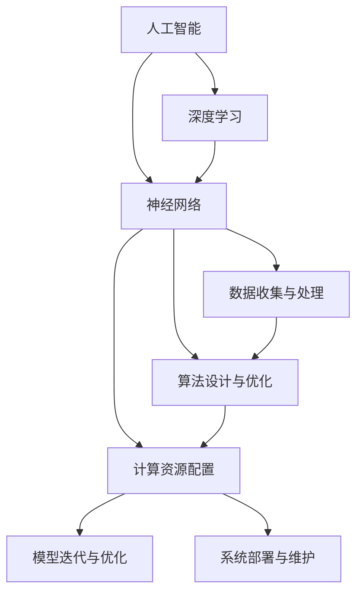

                 

# 人类计算：塑造未来的力量

在科技迅猛发展的今天，人工智能（AI）成为了引领时代前进的重要引擎。然而，人工智能的发展并非一蹴而就，而是依赖于强大的基础计算能力。本文将深入探讨人类计算在人工智能领域的角色，及其对未来发展的深远影响。

## 1. 背景介绍

### 1.1 问题由来

在20世纪60年代，计算机科学家们就开始尝试用机器模拟人类的智能行为。到了21世纪，随着计算能力和数据量的爆炸式增长，深度学习和神经网络等技术逐渐成为人工智能的主流。这些技术依赖于大规模数据集和高性能计算，但这些数据集和计算能力本身的来源，便是人类的计算和创造。

人类计算在人工智能的发展中扮演着至关重要的角色。通过人类计算，我们收集并处理数据，创造出算法，构建出庞大的数据集，为机器学习和深度学习提供了土壤。本文将从人类计算的角度，探讨其对人工智能发展的贡献，及其在未来科技中的应用和挑战。

### 1.2 问题核心关键点

人类计算的核心关键点主要包括以下几点：

1. **数据收集与处理**：人工智能需要大量数据来训练模型，而这些数据的收集与处理，依赖于人类计算能力。
2. **算法设计与优化**：深度学习模型需要复杂的算法来训练，这些算法的设计与优化，也是人类计算的重要部分。
3. **计算资源配置**：高性能计算资源（如GPU、TPU等）的配置和利用，需要大量人力物力的投入。
4. **模型迭代与优化**：模型训练和优化过程中的超参数调整、模型评估等，都需要人类计算来辅助完成。
5. **系统部署与维护**：模型部署到实际应用中，以及系统运维，都需要大量人类计算来确保稳定运行。

## 2. 核心概念与联系

### 2.1 核心概念概述

- **人工智能**：利用计算机技术模拟人类智能行为，包括感知、学习、推理、决策等能力的系统。
- **深度学习**：一种基于神经网络的学习方法，通过多层非线性变换，从数据中提取特征。
- **神经网络**：由大量神经元组成的计算模型，用于模拟生物神经网络的信息处理过程。
- **人类计算**：依赖人类智慧与劳力，进行数据收集、处理、算法设计与优化等计算工作。

这些概念之间的联系可以通过以下Mermaid流程图来展示：



这个流程图展示了大规模人工智能系统的构建过程，其中数据收集与处理、算法设计与优化、计算资源配置、模型迭代与优化以及系统部署与维护等环节，都离不开人类计算的参与。

## 3. 核心算法原理 & 具体操作步骤

### 3.1 算法原理概述

基于人类计算的人工智能系统，其核心算法原理可以总结如下：

1. **数据预处理**：收集、清洗、标注数据，并对其进行特征工程处理，使其适用于深度学习模型的训练。
2. **模型训练**：使用深度学习算法，通过大量标注数据训练模型，使其具备一定的预测能力。
3. **模型评估与优化**：使用测试集评估模型性能，根据评估结果进行模型优化，提升模型精度和鲁棒性。
4. **模型部署与维护**：将优化后的模型部署到实际应用中，并进行持续监控和优化，确保其稳定运行。

### 3.2 算法步骤详解

基于人类计算的人工智能系统，其操作步骤一般包括以下几个环节：

**Step 1: 数据准备**

- 收集与标注数据：从各种渠道（如互联网、数据库、传感器等）收集数据，并进行标注。
- 数据清洗与预处理：对数据进行去重、填补缺失值、归一化等处理。
- 特征工程：对数据进行特征提取和转换，使其适合深度学习模型的输入格式。

**Step 2: 模型构建与训练**

- 选择模型架构：如卷积神经网络（CNN）、循环神经网络（RNN）、变分自编码器（VAE）等。
- 设定超参数：如学习率、批大小、迭代次数等，并进行初始化。
- 数据加载与处理：将数据加载到模型中进行前向传播，并计算损失函数。
- 反向传播与优化：通过反向传播算法计算梯度，使用优化算法（如Adam、SGD等）更新模型参数。
- 模型保存与检查点：定期保存模型权重，以防止训练中断或故障。

**Step 3: 模型评估与优化**

- 划分训练集、验证集和测试集：防止模型过拟合。
- 评估模型性能：使用测试集评估模型精度、召回率、F1值等指标。
- 超参数调整：根据评估结果调整超参数，提升模型性能。
- 模型优化：使用正则化、dropout等技术，提升模型泛化能力。

**Step 4: 模型部署与维护**

- 导出模型：将训练好的模型导出为可部署的格式（如TensorFlow SavedModel、PyTorch模型文件等）。
- 部署模型：将模型部署到服务器、云端或移动设备中。
- 系统监控：实时监控模型运行状态，收集性能指标。
- 模型更新与优化：根据新的数据和应用需求，定期更新和优化模型。

### 3.3 算法优缺点

基于人类计算的人工智能系统，其算法优缺点如下：

**优点：**
1. **高效处理复杂数据**：人类计算能够高效处理结构化和非结构化数据，适用于多种数据类型。
2. **灵活性高**：人类计算在算法设计和模型优化方面具有高度灵活性，能够适应多种任务需求。
3. **可解释性强**：人类计算能够对算法和模型的内部工作机制进行详细解释，便于理解和优化。

**缺点：**
1. **依赖数据质量**：数据的质量直接影响到模型的性能，而数据收集和处理过程复杂且耗时。
2. **计算资源消耗大**：大规模深度学习模型的训练和优化需要高性能计算资源，成本较高。
3. **模型泛化能力受限**：模型对训练数据的依赖较大，泛化能力有待进一步提升。
4. **难以自动化**：部分环节（如特征工程、超参数调整等）依赖人类直觉和经验，难以自动化。

### 3.4 算法应用领域

基于人类计算的人工智能系统，在多个领域得到了广泛应用，例如：

- **计算机视觉**：图像识别、物体检测、人脸识别、图像生成等。
- **自然语言处理**：机器翻译、情感分析、语音识别、聊天机器人等。
- **推荐系统**：商品推荐、内容推荐、用户画像等。
- **医疗健康**：疾病诊断、医学影像分析、健康监测等。
- **自动驾驶**：目标检测、路径规划、环境感知等。
- **金融科技**：信用评分、风险评估、算法交易等。

## 4. 数学模型和公式 & 详细讲解 & 举例说明

### 4.1 数学模型构建

基于人类计算的人工智能系统，其数学模型构建可以总结如下：

- **输入层**：将原始数据转换为神经网络的输入格式，通常使用one-hot编码或归一化处理。
- **隐藏层**：通过多层神经元的非线性变换，提取数据的特征表示。
- **输出层**：将隐藏层的特征映射到目标输出空间，进行分类、回归等任务。

### 4.2 公式推导过程

以二分类问题为例，其数学模型可以表示为：

$$
P(y|x; \theta) = \sigma(W^T \cdot x + b)
$$

其中，$P(y|x; \theta)$表示给定输入$x$下，输出$y$的概率，$\sigma$表示sigmoid函数，$W$和$b$为模型的权重和偏置。

### 4.3 案例分析与讲解

以图像识别为例，其数学模型可以表示为：

$$
f(x) = W^T \cdot x + b
$$

其中，$W$为卷积核，$x$为输入图像，$b$为偏置，$f(x)$为输出特征图。

该模型通过卷积操作提取图像的局部特征，并使用池化操作降低维度，最终通过全连接层进行分类。在实际应用中，可以通过反向传播算法计算梯度，使用优化算法（如Adam、SGD等）更新模型参数。

## 5. 项目实践：代码实例和详细解释说明

### 5.1 开发环境搭建

在进行人工智能项目实践前，我们需要准备好开发环境。以下是使用Python进行PyTorch开发的环境配置流程：

1. 安装Anaconda：从官网下载并安装Anaconda，用于创建独立的Python环境。

2. 创建并激活虚拟环境：
```bash
conda create -n pytorch-env python=3.8 
conda activate pytorch-env
```

3. 安装PyTorch：根据CUDA版本，从官网获取对应的安装命令。例如：
```bash
conda install pytorch torchvision torchaudio cudatoolkit=11.1 -c pytorch -c conda-forge
```

4. 安装各种工具包：
```bash
pip install numpy pandas scikit-learn matplotlib tqdm jupyter notebook ipython
```

完成上述步骤后，即可在`pytorch-env`环境中开始人工智能项目的开发。

### 5.2 源代码详细实现

这里以图像识别为例，给出使用PyTorch进行神经网络模型训练的代码实现。

首先，定义模型结构：

```python
import torch
import torch.nn as nn
import torch.optim as optim

class CNNModel(nn.Module):
    def __init__(self):
        super(CNNModel, self).__init__()
        self.conv1 = nn.Conv2d(3, 32, kernel_size=3, stride=1, padding=1)
        self.relu1 = nn.ReLU()
        self.pool1 = nn.MaxPool2d(kernel_size=2, stride=2)
        self.conv2 = nn.Conv2d(32, 64, kernel_size=3, stride=1, padding=1)
        self.relu2 = nn.ReLU()
        self.pool2 = nn.MaxPool2d(kernel_size=2, stride=2)
        self.fc1 = nn.Linear(64*28*28, 1024)
        self.relu3 = nn.ReLU()
        self.fc2 = nn.Linear(1024, 10)

    def forward(self, x):
        x = self.conv1(x)
        x = self.relu1(x)
        x = self.pool1(x)
        x = self.conv2(x)
        x = self.relu2(x)
        x = self.pool2(x)
        x = x.view(-1, 64*28*28)
        x = self.fc1(x)
        x = self.relu3(x)
        x = self.fc2(x)
        return x
```

然后，定义数据集和数据加载器：

```python
from torch.utils.data import DataLoader
from torchvision import datasets, transforms

# 数据预处理
transform = transforms.Compose([
    transforms.ToTensor(),
    transforms.Normalize((0.5,), (0.5,))
])

# 加载数据集
train_dataset = datasets.CIFAR10(root='./data', train=True, download=True, transform=transform)
test_dataset = datasets.CIFAR10(root='./data', train=False, download=True, transform=transform)

# 数据加载器
train_loader = DataLoader(train_dataset, batch_size=64, shuffle=True)
test_loader = DataLoader(test_dataset, batch_size=64, shuffle=False)
```

接着，定义训练和评估函数：

```python
def train_epoch(model, optimizer, train_loader):
    model.train()
    for batch_idx, (data, target) in enumerate(train_loader):
        optimizer.zero_grad()
        output = model(data)
        loss = nn.CrossEntropyLoss()(output, target)
        loss.backward()
        optimizer.step()

def evaluate(model, test_loader):
    model.eval()
    total_loss = 0
    correct = 0
    with torch.no_grad():
        for data, target in test_loader:
            output = model(data)
            loss = nn.CrossEntropyLoss()(output, target)
            total_loss += loss.item() * data.size(0)
            pred = output.argmax(dim=1, keepdim=True)
            correct += pred.eq(target.view_as(pred)).sum().item()
    print('Test set: Average loss: {:.4f}, Accuracy: {}/{} ({:.0f}%)\n'.format(
        total_loss / len(test_loader.dataset),
        correct, len(test_loader.dataset),
        100. * correct / len(test_loader.dataset)))
```

最后，启动训练流程并在测试集上评估：

```python
epochs = 10
learning_rate = 0.01

# 初始化模型和优化器
model = CNNModel()
optimizer = optim.SGD(model.parameters(), lr=learning_rate, momentum=0.9, weight_decay=1e-4)

# 训练过程
for epoch in range(epochs):
    train_epoch(model, optimizer, train_loader)
    evaluate(model, test_loader)

print('Training finished.')
```

以上就是使用PyTorch进行神经网络模型训练的完整代码实现。可以看到，PyTorch提供了强大的自动微分和优化能力，使得模型训练过程变得简洁高效。

### 5.3 代码解读与分析

让我们再详细解读一下关键代码的实现细节：

**CNNModel类**：
- `__init__`方法：初始化神经网络的各层结构。
- `forward`方法：定义前向传播过程，通过一系列卷积、池化、全连接层进行特征提取和分类。

**数据集和数据加载器**：
- 使用`torchvision`库中的`CIFAR10`数据集，进行数据预处理、加载和分割。
- 使用`DataLoader`类，将数据以批为单位加载到模型中。

**训练和评估函数**：
- 使用`SGD`优化器，设定学习率、动量和权重衰减等参数。
- 定义训练和评估函数，分别进行模型训练和测试。
- 在训练过程中，使用`optimizer.zero_grad()`清空梯度，`loss.backward()`计算梯度，`optimizer.step()`更新模型参数。

**训练流程**：
- 定义总的epoch数和学习率，开始循环迭代。
- 每个epoch内，先在训练集上进行训练，输出平均loss。
- 在测试集上评估模型，输出测试集上的准确率。
- 所有epoch结束后，输出最终训练结果。

可以看到，PyTorch的强大功能和丰富的库支持，使得神经网络的实现变得非常简单和高效。开发者可以更加专注于算法的优化和创新，而无需过多关注底层的实现细节。

## 6. 实际应用场景

### 6.1 医疗影像分析

在医疗领域，基于人类计算的人工智能系统可以用于医学影像分析，如CT扫描、MRI等。该系统能够自动识别病灶，辅助医生进行诊断和治疗决策。

**操作步骤**：
- 收集并标注医学影像数据，进行预处理和增强。
- 设计卷积神经网络模型，用于特征提取和分类。
- 在训练集上训练模型，并在验证集上进行评估。
- 将训练好的模型部署到实际医疗系统中，实时处理和分析影像数据。

**应用实例**：
- **肺结节检测**：通过神经网络模型自动识别肺部影像中的结节，提高早期肺癌的发现率。
- **乳腺癌诊断**：对乳腺X光片进行分类，检测乳腺肿瘤，辅助医生进行诊断。

### 6.2 自动驾驶

在自动驾驶领域，基于人类计算的人工智能系统可以用于目标检测、路径规划等关键任务。该系统能够实时处理传感器数据，进行环境和交通状况的分析和决策。

**操作步骤**：
- 收集并标注自动驾驶数据集，如摄像头、激光雷达、GPS等传感器数据。
- 设计卷积神经网络模型，用于目标检测和分类。
- 在训练集上训练模型，并在测试集上进行评估。
- 将训练好的模型部署到自动驾驶系统中，实时处理和分析环境数据。

**应用实例**：
- **交通信号识别**：通过神经网络模型自动识别交通信号，辅助车辆进行避障和导航。
- **行人检测**：检测行人和自行车等非机动车，避免碰撞事故。

### 6.3 金融风险管理

在金融领域，基于人类计算的人工智能系统可以用于信用评分、风险评估等任务。该系统能够实时处理和分析交易数据，评估客户的信用风险和市场波动。

**操作步骤**：
- 收集并标注金融交易数据，如股票价格、汇率、交易量等。
- 设计循环神经网络模型，用于时间序列分析和预测。
- 在训练集上训练模型，并在测试集上进行评估。
- 将训练好的模型部署到金融系统中，实时监控和预测市场变化。

**应用实例**：
- **股票价格预测**：通过神经网络模型预测股票价格走势，辅助投资者进行决策。
- **信用评分**：根据客户的历史交易数据，评估其信用风险，提供个性化的贷款方案。

### 6.4 未来应用展望

随着人工智能技术的不断发展和应用，基于人类计算的人工智能系统将会在更多领域得到广泛应用。未来，我们可以预见以下几个方向：

1. **多模态计算**：将视觉、语音、文本等多种模态的数据进行融合，构建更加全面和深入的智能系统。
2. **联邦学习**：通过分布式计算和数据协同，实现模型训练和优化，保护数据隐私和安全。
3. **自动化模型设计**：利用自动化机器学习（AutoML）技术，自动设计模型架构和超参数，加速模型训练和优化。
4. **自适应学习**：通过持续学习（Continual Learning）和在线学习（Online Learning）技术，使模型能够不断适应新数据和新任务。
5. **伦理与道德**：构建具有伦理导向的智能系统，确保模型决策的公正性和透明性，避免偏见和歧视。

这些方向将进一步拓展人工智能的应用范围，提升其智能化水平，为人类社会带来更多的便利和福祉。

## 7. 工具和资源推荐

### 7.1 学习资源推荐

为了帮助开发者系统掌握人工智能技术的理论基础和实践技巧，这里推荐一些优质的学习资源：

1. 《深度学习》（Ian Goodfellow）：深度学习领域的经典教材，系统介绍了深度学习的基本原理和应用。
2. 《Python机器学习》（Sebastian Raschka）：介绍使用Python进行机器学习和深度学习开发的基础知识和实践技巧。
3. 《TensorFlow官方文档》：TensorFlow的官方文档，提供了详细的API文档和示例代码，适合新手入门。
4. 《PyTorch官方文档》：PyTorch的官方文档，提供了丰富的教程和样例，适合深入学习和实践。
5. 《Kaggle机器学习竞赛》：Kaggle上的机器学习竞赛，提供了大量的实际问题和解决方案，适合实践锻炼。

通过对这些资源的学习实践，相信你一定能够快速掌握人工智能技术的精髓，并用于解决实际的机器学习问题。

### 7.2 开发工具推荐

高效的开发离不开优秀的工具支持。以下是几款用于人工智能项目开发的常用工具：

1. PyTorch：基于Python的开源深度学习框架，灵活动态的计算图，适合快速迭代研究。
2. TensorFlow：由Google主导开发的开源深度学习框架，生产部署方便，适合大规模工程应用。
3. Jupyter Notebook：交互式编程环境，适合快速实验和展示结果。
4. Weights & Biases：模型训练的实验跟踪工具，可以记录和可视化模型训练过程中的各项指标，方便对比和调优。
5. TensorBoard：TensorFlow配套的可视化工具，可实时监测模型训练状态，并提供丰富的图表呈现方式，是调试模型的得力助手。

合理利用这些工具，可以显著提升人工智能项目的开发效率，加快创新迭代的步伐。

### 7.3 相关论文推荐

人工智能技术的发展离不开学界的持续研究。以下是几篇奠基性的相关论文，推荐阅读：

1. AlexNet：深度学习领域的首个突破性模型，奠定了卷积神经网络（CNN）的基础。
2. ResNet：提出残差连接结构，解决了深度神经网络训练中的梯度消失问题，使模型更深、更复杂。
3. AlphaGo：基于深度学习和蒙特卡洛树搜索的国际象棋、围棋程序，展示了AI在复杂决策任务上的能力。
4. GPT-3：基于Transformer的预训练语言模型，展示了自然语言处理领域的最新进展。
5. TPU：由Google开发的专用硬件加速器，用于高性能计算，为深度学习应用提供了强大的硬件支持。

这些论文代表了大规模人工智能技术的最新进展，通过学习这些前沿成果，可以帮助研究者把握学科前进方向，激发更多的创新灵感。

## 8. 总结：未来发展趋势与挑战

### 8.1 研究成果总结

本文对基于人类计算的人工智能系统进行了全面系统的介绍。首先阐述了人工智能的发展历程和人类计算在其中扮演的角色，明确了人类计算在人工智能发展中的重要价值。其次，从理论到实践，详细讲解了人类计算在人工智能系统构建过程中的核心算法原理和具体操作步骤，给出了完整的人工智能项目开发流程。同时，本文还探讨了人类计算在实际应用场景中的广泛应用，展示了其在多个领域的巨大潜力。

### 8.2 未来发展趋势

展望未来，基于人类计算的人工智能系统将呈现以下几个发展趋势：

1. **多模态计算**：将视觉、语音、文本等多种模态的数据进行融合，构建更加全面和深入的智能系统。
2. **联邦学习**：通过分布式计算和数据协同，实现模型训练和优化，保护数据隐私和安全。
3. **自动化模型设计**：利用自动化机器学习（AutoML）技术，自动设计模型架构和超参数，加速模型训练和优化。
4. **自适应学习**：通过持续学习（Continual Learning）和在线学习（Online Learning）技术，使模型能够不断适应新数据和新任务。
5. **伦理与道德**：构建具有伦理导向的智能系统，确保模型决策的公正性和透明性，避免偏见和歧视。

这些趋势凸显了人工智能技术的广阔前景，以及人类计算在其中的关键作用。这些方向的探索发展，必将进一步提升人工智能系统的性能和应用范围，为人类社会带来更多的便利和福祉。

### 8.3 面临的挑战

尽管基于人类计算的人工智能系统已经取得了瞩目成就，但在迈向更加智能化、普适化应用的过程中，它仍面临着诸多挑战：

1. **数据质量和隐私保护**：大规模数据集的质量和隐私保护问题，将直接影响系统的性能和可靠性。
2. **计算资源限制**：高性能计算资源（如GPU、TPU等）的配置和利用，需要大量人力物力的投入。
3. **模型泛化能力**：模型对训练数据的依赖较大，泛化能力有待进一步提升。
4. **自动化和可解释性**：部分环节（如特征工程、超参数调整等）依赖人类直觉和经验，难以自动化。模型的决策过程难以解释，不利于实际应用。
5. **伦理与安全**：模型的决策过程可能存在偏见、歧视等问题，需要建立伦理导向的评估机制，确保模型的安全性。

### 8.4 研究展望

面对人工智能系统面临的诸多挑战，未来的研究需要在以下几个方面寻求新的突破：

1. **数据质量提升**：利用自动化机器学习技术，提升数据标注和清洗的效率和质量，减少人工干预。
2. **分布式计算优化**：探索高效分布式计算技术，如联邦学习、边缘计算等，降低计算成本和资源消耗。
3. **模型压缩与优化**：利用模型压缩和优化技术，如剪枝、量化等，减少模型的计算复杂度和存储空间。
4. **自动化模型设计**：开发更加智能的自动化模型设计工具，加速模型训练和优化过程。
5. **模型可解释性**：引入可解释性技术，如LIME、SHAP等，增强模型的决策透明性和可信度。
6. **伦理与安全**：构建具有伦理导向的评估机制，确保模型决策的公正性和透明性，避免偏见和歧视。

这些研究方向的探索，必将引领人工智能技术迈向更高的台阶，为构建安全、可靠、可解释、可控的智能系统铺平道路。面向未来，人工智能技术还需要与其他人工智能技术进行更深入的融合，如知识表示、因果推理、强化学习等，多路径协同发力，共同推动人工智能技术的进步。只有勇于创新、敢于突破，才能不断拓展人工智能技术的边界，让人工智能更好地服务于人类社会。

## 9. 附录：常见问题与解答

**Q1：人工智能的发展是否会取代人类智能？**

A: 人工智能的发展旨在增强人类智能，而非取代人类智能。虽然人工智能在某些领域能够超越人类，但在创造性、情感理解和复杂决策等方面，人类仍然具有不可替代的优势。人工智能和人类智能可以互补，共同构建更加智能化的未来社会。

**Q2：人工智能的发展会对就业产生影响吗？**

A: 人工智能的发展将对部分职业产生冲击，但同时也会创造新的就业机会。通过提高生产效率和创新能力，人工智能可以为社会创造更多价值，带动就业市场的繁荣。人类需要适应和应对这一变化，通过教育和培训提升自身竞争力。

**Q3：人工智能的发展是否会带来伦理和安全问题？**

A: 人工智能的发展确实带来了伦理和安全问题，如偏见、歧视、隐私泄露等。为了应对这些问题，需要建立伦理导向的评估机制，确保模型决策的公正性和透明性。同时，需要制定相关法律法规，加强数据隐私和安全保护。

**Q4：人工智能的发展是否会加剧数字鸿沟？**

A: 人工智能的发展可能会加剧数字鸿沟，特别是在资源匮乏地区。为了缩小数字鸿沟，需要普及人工智能技术和知识，提高公众的科技素养和应用能力。同时，需要关注弱势群体的需求，推动公平共享的AI应用。

**Q5：人工智能的发展是否会对自然环境产生影响？**

A: 人工智能的发展需要大量数据和计算资源，可能会对环境产生一定影响。为了减少环境影响，需要采用高效、绿色的计算技术，如分布式计算、能效优化等。同时，需要关注算法的可持续发展，减少对环境的负面影响。

总之，人工智能技术的发展离不开人类智慧的推动和引导。在利用人工智能技术提升效率、创造价值的同时，也需要关注其潜在的伦理和安全问题，确保其健康、可持续的发展。面向未来，人工智能技术将与人类智慧共同进步，为人类社会带来更多的便利和福祉。

