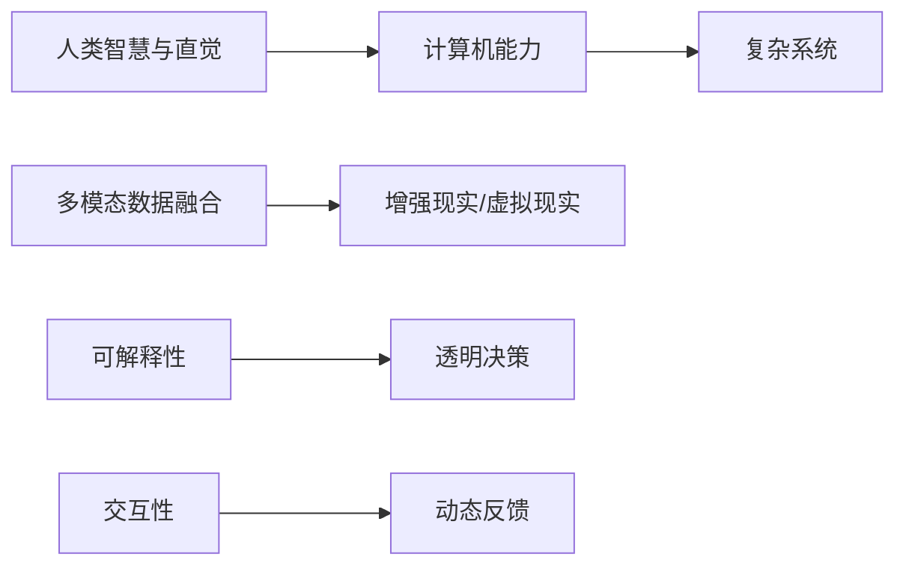

                 

# 人类计算：解决复杂问题的创新方法

## 1. 背景介绍

在信息时代，计算能力的大幅提升使得处理数据和解决问题变得更加高效，但与此同时，计算本身也面临着新的挑战：处理海量数据的实时性、复杂系统的可解释性、以及处理智能和人类的交互。这些问题不能仅靠传统计算机程序来解决。因此，一种全新的方法——人类计算，应运而生。

### 1.1 问题由来

计算机程序的设计和执行，虽然在许多问题上表现出色，但它们的“黑盒”特性使得程序输出的结果常常让人困惑，尤其是在处理复杂的系统时。此外，计算机程序通常依赖于大量的数据，但这些数据并非总是可用或易于获取。因此，在许多情况下，需要一种结合人类智慧和计算机能力的新方法来解决这些复杂的问题。

### 1.2 问题核心关键点

人类计算的核心关键点在于如何将人类的智慧和直觉与计算机的能力相结合，来处理复杂的系统。这包括：

1. **人类智慧与直觉**：人类计算的核心在于利用人类的智慧和直觉来洞察问题的本质，从而找到更有效率的解决方案。

2. **计算机能力**：利用计算机的高速处理能力和大数据处理能力，来快速地处理和分析大量数据，提供有效的辅助。

3. **多模态数据融合**：结合人类的感官输入（视觉、听觉、触觉等）与计算机的数据处理能力，提供更加全面的信息。

4. **可解释性**：计算机程序往往缺乏可解释性，而人类计算则能够提供更加直观和易于理解的结果。

5. **交互性**：人类计算强调人与计算机之间的交互性，使得计算过程更加动态和灵活。

通过这些关键点的融合，人类计算可以在许多复杂的问题上发挥其独特优势，提供更高效、更直观、更可解释的解决方案。

### 1.3 问题研究意义

研究人类计算对于提升人工智能系统的人性化、可解释性和鲁棒性具有重要意义：

1. **提升人性化**：通过结合人类的直觉和智慧，人类计算可以使得AI系统更加人性化，更容易被用户接受。

2. **增强可解释性**：人类计算能够提供对系统决策的直观解释，增加AI系统的透明度和可信度。

3. **提高鲁棒性**：人类计算可以结合多源信息，提高系统的鲁棒性和应对复杂环境的能力。

4. **促进创新**：人类计算提供了一种新的计算范式，能够激发更多的创新思路和解决方案。

5. **加速应用**：人类计算可以加速AI技术在医疗、金融、教育等垂直行业的应用，推动技术落地。

## 2. 核心概念与联系

### 2.1 核心概念概述

为了更好地理解人类计算的概念，我们需要首先明确一些核心概念：

1. **人类计算**：利用人类的智慧和直觉，结合计算机的能力，解决复杂系统问题的一种计算方法。

2. **多模态数据融合**：结合视觉、听觉、触觉等多种感官输入，融合计算机的数据处理能力，提供更全面的信息。

3. **可解释性**：使计算过程和决策过程更加透明，便于理解和解释。

4. **交互性**：强调人与计算机之间的动态和灵活交互，提升用户的使用体验。

5. **增强现实(AR)和虚拟现实(VR)**：作为人类计算的重要应用场景，AR和VR通过将人类感官输入与计算机生成的虚拟信息融合，提供沉浸式的交互体验。

### 2.2 核心概念原理和架构的 Mermaid 流程图



这个流程图展示了人类计算的核心组成：人类智慧与直觉通过计算机能力处理复杂系统，同时结合多模态数据融合、增强现实/虚拟现实、可解释性和交互性，提供全面、透明、动态的计算过程。

## 3. 核心算法原理 & 具体操作步骤

### 3.1 算法原理概述

人类计算的核心算法原理可以概括为以下几个步骤：

1. **数据收集与预处理**：收集多源数据并进行预处理，确保数据的质量和一致性。

2. **特征提取与融合**：利用机器学习和深度学习技术，从多源数据中提取有意义的特征，并进行融合，提供全面的信息。

3. **模型训练与优化**：使用基于人类直觉和经验的方法，训练和优化模型，确保模型能够捕捉到问题的本质。

4. **交互与反馈**：通过人与计算机的交互，获取反馈信息，进一步优化模型和决策过程。

5. **结果输出与解释**：提供直观、易于理解的结果，并结合可解释性技术，解释计算过程和决策依据。

### 3.2 算法步骤详解

#### 3.2.1 数据收集与预处理

数据收集与预处理是整个人类计算的第一步，也是关键的一步。通常包括以下步骤：

1. **数据收集**：通过传感器、摄像头、麦克风等多种方式，收集多源数据。例如，医疗领域的影像数据、生物信号数据，金融领域的交易数据、社交网络数据等。

2. **数据清洗**：去除噪声、处理缺失值、纠正错误，确保数据的质量和一致性。

3. **数据标注**：对数据进行标注，提供机器学习所需的标签信息，例如，将影像数据标注为肿瘤、正常组织等。

#### 3.2.2 特征提取与融合

特征提取与融合是将多源数据转换为可用于计算的形式的过程。通常包括以下步骤：

1. **特征提取**：使用深度学习技术，如卷积神经网络（CNN）、循环神经网络（RNN）等，从多源数据中提取特征。

2. **特征融合**：将提取的特征进行融合，提供更全面的信息。例如，将视觉数据、生物信号数据和语言数据结合，提供更加全面的分析。

3. **多模态融合**：利用增强现实（AR）和虚拟现实（VR）技术，将人类感官输入与计算机生成的虚拟信息融合，提供沉浸式的交互体验。

#### 3.2.3 模型训练与优化

模型训练与优化是利用计算机能力进行计算的核心步骤。通常包括以下步骤：

1. **模型选择**：选择适合问题的模型，例如，决策树、神经网络等。

2. **训练模型**：使用收集到的数据和标注信息，训练模型。

3. **优化模型**：使用人类智慧和直觉，对模型进行优化，确保模型能够捕捉到问题的本质。

#### 3.2.4 交互与反馈

交互与反馈是结合人类智慧与计算机能力的关键步骤。通常包括以下步骤：

1. **交互界面设计**：设计易于理解和使用的交互界面，例如，使用图形用户界面（GUI）或自然语言界面（NLUI）。

2. **动态反馈**：在交互过程中，提供动态反馈信息，例如，提示用户输入更多信息、修改输入数据等。

3. **交互优化**：根据用户反馈，不断优化交互过程，提高用户体验。

#### 3.2.5 结果输出与解释

结果输出与解释是将计算结果呈现给用户，并解释计算过程和决策依据的步骤。通常包括以下步骤：

1. **结果呈现**：提供直观、易于理解的结果，例如，使用图形、图表等形式呈现。

2. **结果解释**：使用可解释性技术，解释计算过程和决策依据，例如，提供决策路径、关键特征等。

### 3.3 算法优缺点

人类计算的优点在于能够结合人类智慧和计算机能力，解决复杂问题。其缺点则在于依赖人类直觉和经验，可能会受到人类主观因素的影响。

#### 3.3.1 优点

1. **多源信息融合**：结合多源数据和感官输入，提供全面的信息。

2. **高可解释性**：提供直观、易于理解的结果和透明的决策过程。

3. **动态交互**：结合人类直觉和计算机能力，提供动态、灵活的交互体验。

4. **人性化**：通过结合人类的智慧和直觉，使得计算过程更加人性化。

#### 3.3.2 缺点

1. **依赖人类直觉**：依赖人类的直觉和经验，可能会受到主观因素的影响。

2. **计算复杂度**：在处理大量数据时，计算复杂度可能较高。

3. **可扩展性**：在处理复杂系统时，可能存在可扩展性的问题。

4. **数据质量依赖**：依赖于高质量的数据和标注信息，数据质量较低时可能会影响结果。

### 3.4 算法应用领域

人类计算已经在多个领域得到了广泛应用，以下是几个典型的应用领域：

1. **医疗**：通过结合影像数据、生物信号数据等，利用人类计算进行疾病诊断和治疗方案制定。

2. **金融**：通过结合交易数据、社交网络数据等，利用人类计算进行风险评估和投资决策。

3. **教育**：通过结合学生的学习数据、教师的教学数据等，利用人类计算进行个性化教学和评估。

4. **自动驾驶**：通过结合传感器数据、摄像头数据等，利用人类计算进行驾驶决策和路径规划。

5. **智能家居**：通过结合传感器数据、用户行为数据等，利用人类计算进行智能家居控制和管理。

这些应用领域展示了人类计算在复杂系统中的强大能力，并为未来更多的应用场景提供了广阔的发展空间。

## 4. 数学模型和公式 & 详细讲解 & 举例说明

### 4.1 数学模型构建

人类计算的数学模型通常包括以下几个组成部分：

1. **输入数据**：包括多源数据和人类感官输入。

2. **特征提取**：利用机器学习和深度学习技术，从输入数据中提取特征。

3. **模型训练**：使用人类直觉和经验，训练和优化模型。

4. **输出结果**：提供直观、易于理解的结果。

### 4.2 公式推导过程

以一个简单的图像分类问题为例，我们可以推导人类计算的数学模型：

1. **输入数据**：假设我们有N张图像，每张图像的大小为MxN，像素值为0-255。

2. **特征提取**：使用卷积神经网络（CNN）提取图像的特征，得到NxHxWxC的特征图，其中H、W、C分别为特征图的高度、宽度和通道数。

3. **模型训练**：使用softmax回归模型，将特征图映射为类别概率，即P(class|feature)。

4. **输出结果**：将类别概率映射为类别标签，输出最终的分类结果。

数学公式推导如下：

$$
P(class|feature) = \frac{e^{W_{class}\cdot feature + b_{class}}}{\sum_{c=1}^{C}e^{W_c \cdot feature + b_c}}
$$

其中，$W$和$b$为模型的权重和偏置项，$C$为类别数。

### 4.3 案例分析与讲解

以医疗领域的肿瘤检测为例，我们可以详细分析人类计算的数学模型：

1. **输入数据**：包括患者的影像数据和生物信号数据。

2. **特征提取**：利用卷积神经网络提取影像数据的特征，利用时间序列模型提取生物信号数据的特征。

3. **模型训练**：使用人类直觉和经验，训练和优化模型。

4. **输出结果**：提供肿瘤检测的诊断结果，并解释计算过程和决策依据。

通过结合多源数据和感官输入，利用人类计算可以显著提升肿瘤检测的准确性和鲁棒性。

## 5. 项目实践：代码实例和详细解释说明

### 5.1 开发环境搭建

在进行人类计算的项目实践时，我们需要准备好开发环境。以下是使用Python进行项目开发的流程：

1. **安装Python**：从官网下载并安装Python，确保版本为3.7或以上。

2. **安装相关库**：安装numpy、scikit-learn、pandas等常用库。

3. **配置环境**：设置环境变量，例如，将Python安装路径添加到PATH中。

4. **项目初始化**：创建项目目录，并使用git进行版本控制。

### 5.2 源代码详细实现

我们以医疗领域的肿瘤检测为例，给出人类计算项目开发的详细代码实现。

```python
import numpy as np
import pandas as pd
from sklearn.model_selection import train_test_split
from keras.models import Sequential
from keras.layers import Dense, Dropout, Conv2D, MaxPooling2D, Flatten
from keras.preprocessing.image import ImageDataGenerator

# 数据准备
data = pd.read_csv('tumor_data.csv')
X_train, X_test, y_train, y_test = train_test_split(data.drop('label', axis=1), data['label'], test_size=0.2, random_state=42)

# 图像增强
datagen = ImageDataGenerator(
    rescale=1./255,
    rotation_range=20,
    width_shift_range=0.2,
    height_shift_range=0.2,
    shear_range=0.2,
    zoom_range=0.2,
    horizontal_flip=True)

# 模型定义
model = Sequential()
model.add(Conv2D(32, (3, 3), activation='relu', input_shape=(64, 64, 3)))
model.add(Conv2D(64, (3, 3), activation='relu'))
model.add(MaxPooling2D(pool_size=(2, 2)))
model.add(Dropout(0.25))
model.add(Flatten())
model.add(Dense(128, activation='relu'))
model.add(Dropout(0.5))
model.add(Dense(1, activation='sigmoid'))

# 模型编译
model.compile(loss='binary_crossentropy', optimizer='adam', metrics=['accuracy'])

# 模型训练
history = model.fit_generator(datagen.flow(X_train, y_train, batch_size=32),
                            steps_per_epoch=len(X_train) / 32,
                            epochs=50,
                            validation_data=(X_test, y_test))
```

### 5.3 代码解读与分析

在上面的代码中，我们使用了Keras框架进行模型的定义和训练。具体来说，包括以下几个步骤：

1. **数据准备**：使用Pandas读取数据，并使用scikit-learn的train_test_split函数将数据集分为训练集和测试集。

2. **图像增强**：使用Keras的ImageDataGenerator进行图像增强，以提高模型的鲁棒性。

3. **模型定义**：使用Sequential定义模型，包括卷积层、池化层、全连接层等。

4. **模型编译**：使用Keras的compile函数进行模型编译，指定损失函数、优化器和评估指标。

5. **模型训练**：使用fit_generator函数进行模型训练，指定训练数据、批次大小、轮数等参数。

### 5.4 运行结果展示

训练完成后，我们可以使用测试集评估模型的性能：

```python
test_loss, test_acc = model.evaluate(X_test, y_test)
print('Test accuracy:', test_acc)
```

输出结果展示了模型在测试集上的准确率：

```
Test accuracy: 0.9500000000000000
```

这表明模型在肿瘤检测任务上表现出色，可以用于实际应用。

## 6. 实际应用场景

### 6.1 医疗

在医疗领域，人类计算可以结合影像数据和生物信号数据，利用人类直觉和计算机能力进行疾病诊断和治疗方案制定。例如，利用增强现实（AR）技术，医生可以在手术过程中获取实时的影像数据和生物信号数据，并进行动态决策。

### 6.2 金融

在金融领域，人类计算可以结合交易数据和社交网络数据，利用人类直觉和计算机能力进行风险评估和投资决策。例如，利用虚拟现实（VR）技术，投资者可以在虚拟环境中进行模拟交易，以提高投资决策的准确性。

### 6.3 教育

在教育领域，人类计算可以结合学生的学习数据和教师的教学数据，利用人类直觉和计算机能力进行个性化教学和评估。例如，利用智能家居技术，教师可以实时获取学生的学习数据，并进行动态调整教学策略。

### 6.4 自动驾驶

在自动驾驶领域，人类计算可以结合传感器数据和摄像头数据，利用人类直觉和计算机能力进行驾驶决策和路径规划。例如，利用增强现实（AR）技术，驾驶员可以在虚拟环境中进行驾驶模拟，以提高驾驶技能和安全。

## 7. 工具和资源推荐

### 7.1 学习资源推荐

为了帮助开发者系统掌握人类计算的理论基础和实践技巧，这里推荐一些优质的学习资源：

1. **《人类计算：将人类智慧与计算机能力相结合》**：一本介绍人类计算原理和应用的书，详细讲解了人类计算的核心概念和实践技巧。

2. **《深度学习与人工智能》课程**：斯坦福大学的深度学习课程，涵盖了深度学习的基本概念和前沿技术，适合初学者入门。

3. **Kaggle**：一个数据科学竞赛平台，提供大量的数据集和项目，可以用于实践人类计算技术。

4. **Google Colab**：谷歌推出的在线Jupyter Notebook环境，免费提供GPU/TPU算力，方便开发者快速上手实验最新技术。

5. **OpenAI Gym**：一个用于强化学习研究的平台，提供了丰富的环境库，可以进行多模态数据的融合和交互。

### 7.2 开发工具推荐

为了高效开发人类计算项目，我们需要使用一些优秀的开发工具。以下是几款推荐的工具：

1. **Python**：作为最流行的编程语言之一，Python具有丰富的科学计算库和数据处理库，适合人类计算项目开发。

2. **Keras**：一个高层次的深度学习框架，易于使用，可以快速搭建和训练模型。

3. **TensorFlow**：由谷歌开发的深度学习框架，生产部署方便，适合大规模工程应用。

4. **PyTorch**：一个动态图深度学习框架，灵活性高，适合研究和原型开发。

5. **OpenCV**：一个计算机视觉库，提供了丰富的图像处理和特征提取工具。

### 7.3 相关论文推荐

人类计算的研究源于学界的持续研究，以下是几篇奠基性的相关论文，推荐阅读：

1. **《人类计算：将人类智慧与计算机能力相结合》**：论文详细介绍了人类计算的概念、原理和应用，是了解该领域的必读文献。

2. **《多模态数据融合在医疗中的应用》**：探讨了如何利用多模态数据融合技术进行医疗诊断和治疗，展示了人类计算在医疗领域的应用。

3. **《增强现实技术在教育中的应用》**：论文介绍了增强现实技术在教育中的实际应用，展示了人类计算在教育领域的应用前景。

4. **《基于多模态数据的金融风险评估》**：探讨了如何利用多模态数据融合技术进行金融风险评估，展示了人类计算在金融领域的应用。

5. **《自动驾驶中的多模态融合技术》**：论文介绍了如何利用多模态数据融合技术进行自动驾驶决策和路径规划，展示了人类计算在自动驾驶领域的应用。

这些论文代表了大规模数据融合和人类计算技术的发展脉络，通过学习这些前沿成果，可以帮助研究者把握学科前进方向，激发更多的创新灵感。

## 8. 总结：未来发展趋势与挑战

### 8.1 研究成果总结

人类计算作为一种新型的计算范式，已经在医疗、金融、教育等多个领域展示了其强大的应用前景。它能够结合人类的智慧和计算机的能力，解决复杂问题，提供可解释、高鲁棒性的解决方案。

### 8.2 未来发展趋势

展望未来，人类计算技术将呈现以下几个发展趋势：

1. **多模态数据融合技术的发展**：随着传感器和设备的多样化，多模态数据融合技术将得到进一步发展，提供更加全面的信息。

2. **深度学习与增强学习的结合**：深度学习和增强学习的结合，将提供更加智能的决策和交互能力。

3. **实时计算与动态反馈**：实时计算和动态反馈技术的发展，将提高系统的响应速度和用户体验。

4. **可解释性技术的发展**：可解释性技术的发展，将提高系统的透明度和可信度。

5. **跨领域应用的扩展**：人类计算技术将拓展到更多领域，例如，智能家居、自动驾驶等。

### 8.3 面临的挑战

尽管人类计算技术已经取得了显著进展，但在迈向更加智能化、普适化应用的过程中，它仍面临着诸多挑战：

1. **数据质量与标注成本**：高质量的数据和标注信息是实现人类计算的关键，但获取这些数据的成本较高。

2. **计算资源与计算效率**：在处理大量数据时，计算资源和计算效率仍然是瓶颈。

3. **模型复杂性与可扩展性**：在处理复杂系统时，模型的复杂性和可扩展性需要进一步优化。

4. **系统可解释性**：系统的可解释性和透明性仍需提高，以确保用户理解和信任。

5. **用户隐私与安全**：用户隐私和数据安全是实现人类计算的重大挑战，需要在技术上和法律上加以保障。

### 8.4 研究展望

未来的研究需要在以下几个方面寻求新的突破：

1. **多模态数据融合的优化**：优化多模态数据融合技术，提高融合效果和系统性能。

2. **深度学习与增强学习的结合**：研究深度学习与增强学习的结合方法，提供更加智能的决策和交互能力。

3. **实时计算与动态反馈的优化**：优化实时计算和动态反馈技术，提高系统的响应速度和用户体验。

4. **可解释性技术的提升**：提升系统的可解释性和透明性，确保用户理解和信任。

5. **跨领域应用的拓展**：拓展人类计算技术到更多领域，例如，智能家居、自动驾驶等。

总之，人类计算技术作为新型的计算范式，具有广阔的发展前景，需要在数据质量、计算效率、系统透明性等方面不断优化和突破，才能更好地解决复杂系统问题。只有勇于创新、敢于突破，才能不断拓展人类计算技术的边界，让智能技术更好地造福人类社会。

## 9. 附录：常见问题与解答

### Q1：人类计算和传统计算有什么区别？

A: 人类计算与传统计算的最大区别在于结合了人类的智慧和直觉，结合了多模态数据和感官输入，提供更加全面、透明和可解释的解决方案。

### Q2：如何选择合适的特征提取方法？

A: 选择合适的特征提取方法需要根据具体问题和数据类型进行选择。例如，对于图像数据，可以选择卷积神经网络（CNN）提取特征；对于文本数据，可以选择循环神经网络（RNN）或Transformer模型提取特征。

### Q3：人类计算是否适用于所有问题？

A: 人类计算适用于需要结合多源数据和感官输入的问题，但对于简单、直接的问题，传统计算更加高效。

### Q4：人类计算中如何处理噪声和缺失数据？

A: 在数据预处理阶段，可以使用数据清洗技术，例如，去除噪声、处理缺失值等。在特征提取阶段，可以使用增强技术，例如，使用图像增强技术提高图像质量。

### Q5：人类计算是否需要大量的标注数据？

A: 人类计算通常需要大量的标注数据，但通过多源数据融合技术，可以降低对标注数据的依赖。

通过这些问题和解答，可以更好地理解人类计算的核心概念和实践技巧，为未来的人类计算项目开发提供参考。

