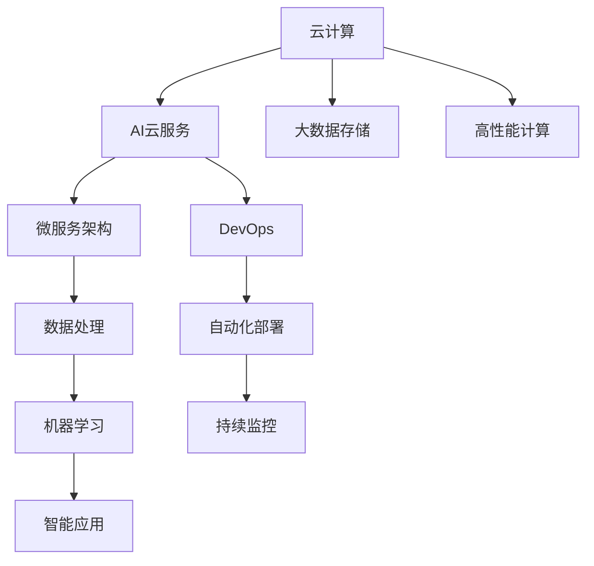

                 

# 从云计算到AI云：Lepton AI的转型之路

在当前的科技发展浪潮中，云计算与人工智能（AI）技术的融合已经成为推动行业变革的重要驱动力。Lepton AI公司，作为一家领先的技术解决方案提供商，其从传统的云计算服务转型到AI云服务的历程，不仅展示了其对行业趋势的敏锐洞察，也彰显了其在技术创新和市场应对方面的卓越能力。本文将从背景介绍、核心概念与联系、核心算法原理与具体操作步骤、数学模型和公式、项目实践、实际应用场景、工具和资源推荐、未来发展趋势与挑战、以及附录等多个方面，全面剖析Lepton AI的转型之路。

## 1. 背景介绍

### 1.1 问题由来

随着云计算技术的飞速发展，Lepton AI发现自己面临着越来越大的市场竞争压力。虽然其传统的云存储和数据处理服务一度取得了显著的市场份额，但随着Google Cloud、Amazon AWS、Microsoft Azure等巨头的入局，以及新兴的云服务提供商的崛起，Lepton AI的市场地位受到了严重威胁。与此同时，人工智能技术的迅猛发展，为各行各业带来了前所未有的机遇，AI云服务正逐渐成为行业数字化转型的核心需求。Lepton AI认识到，只有转型AI云服务，才能保持其技术领先地位，并开创新的业务增长点。

### 1.2 问题核心关键点

Lepton AI的转型关键在于如何充分利用其强大的数据处理能力，结合AI技术的优势，提供高效、智能、易用的云服务。核心关键点包括：

- **数据处理能力**：Lepton AI需要构建一个能够快速、高效处理大数据的云平台。
- **AI技术应用**：将机器学习、深度学习等AI技术应用到云平台中，提升服务智能化水平。
- **用户体验**：确保云服务简单易用，满足不同用户的需求。
- **市场推广**：通过精准的市场营销策略，将AI云服务推向市场。

### 1.3 问题研究意义

Lepton AI的转型之路不仅关乎其自身的业务发展，更具有重要的行业示范意义。通过AI云服务，Lepton AI可以推动传统云计算服务向更智能、更高效的方向演进，促进AI技术在各个行业的广泛应用。同时，Lepton AI的成功转型可以为其他云计算服务提供商提供借鉴，推动整个行业向更高层次的数字化转型。

## 2. 核心概念与联系

### 2.1 核心概念概述

为了更好地理解Lepton AI的转型之路，本节将介绍几个核心概念及其相互联系：

- **云计算（Cloud Computing）**：通过互联网提供可配置的计算资源和相关服务，具有按需使用、灵活扩展、降低成本等特点。
- **人工智能（Artificial Intelligence, AI）**：利用计算机模拟人类智能行为的技术，包括机器学习、自然语言处理、计算机视觉等。
- **AI云服务（AI as a Service, AIaaS）**：将AI技术封装成云服务形式，提供给用户，方便用户按需使用。
- **云计算与AI的融合（Cloud and AI Integration）**：将云计算与AI技术结合，提供更智能、高效、易用的云服务。
- **微服务架构（Microservices Architecture）**：将应用程序分解为多个小型服务，便于独立部署和扩展。
- **DevOps（Development and Operations）**：将开发和运维紧密结合，提升软件交付效率和系统稳定性。

这些核心概念共同构成了Lepton AI转型AI云服务的技术基础，相互之间存在密切的联系和依赖关系。

### 2.2 核心概念原理和架构的 Mermaid 流程图



这个流程图展示了云计算与AI云服务之间的联系和架构关系。云计算提供计算资源和大数据存储，AI云服务利用这些资源进行数据处理和模型训练，微服务架构和DevOps确保服务的可靠性和高效性，最终通过智能应用实现商业价值。

## 3. 核心算法原理 & 具体操作步骤

### 3.1 算法原理概述

Lepton AI的AI云服务主要基于机器学习和大数据处理技术，具体包括：

- **数据预处理**：对用户数据进行清洗、标注和转换，准备用于机器学习模型训练。
- **模型训练**：利用机器学习算法训练模型，优化模型参数。
- **模型部署**：将训练好的模型部署到云平台，提供API服务。
- **用户交互**：用户通过API调用模型服务，获取预测结果。
- **持续优化**：根据用户反馈，对模型进行优化和更新。

### 3.2 算法步骤详解

Lepton AI的AI云服务主要包括以下步骤：

**Step 1: 数据准备**
- 收集用户数据，进行数据清洗和标注。
- 将数据存储在云平台的大数据仓库中。

**Step 2: 模型训练**
- 选择合适的机器学习算法，设计训练流程。
- 利用云平台的计算资源进行模型训练。
- 调整模型参数，进行多次迭代训练。

**Step 3: 模型部署**
- 将训练好的模型部署到云平台的微服务架构中。
- 设计API接口，确保用户能够方便调用模型服务。
- 配置自动化部署流程，确保模型的及时更新。

**Step 4: 用户交互**
- 用户通过API接口调用模型服务，获取预测结果。
- 对于大规模的预测请求，云平台提供弹性计算资源。
- 对预测结果进行可视化展示，提升用户体验。

**Step 5: 持续优化**
- 收集用户反馈，对模型进行评估和优化。
- 根据新的数据，对模型进行重新训练和部署。
- 利用DevOps工具，实现模型的持续集成和交付。

### 3.3 算法优缺点

Lepton AI的AI云服务有以下优点：

- **高效性**：利用云平台的计算资源，模型训练和部署效率高。
- **可扩展性**：微服务架构和DevOps工具支持服务的高效扩展。
- **灵活性**：用户可以按需调用模型服务，适应不同业务需求。
- **低成本**：按需付费的云服务模式，降低了用户成本。

同时，该方法也存在一些局限：

- **数据隐私**：用户数据存储在云端，存在数据泄露风险。
- **算法透明性**：模型训练过程复杂，用户难以理解和信任。
- **系统复杂性**：微服务架构和DevOps工具增加了系统复杂度，需要专业团队维护。

### 3.4 算法应用领域

Lepton AI的AI云服务已经在多个领域得到了广泛应用，例如：

- **金融风控**：利用机器学习模型进行信用评分、欺诈检测、风险评估等。
- **医疗诊断**：利用深度学习模型进行疾病预测、影像识别、基因分析等。
- **零售推荐**：利用推荐算法进行商品推荐、用户画像分析、个性化营销等。
- **智能制造**：利用机器视觉和自然语言处理技术进行质量检测、设备维护、供应链优化等。
- **智慧城市**：利用AI技术进行交通管理、环境监测、公共安全等。

Lepton AI通过将AI技术封装成云服务，使得这些技术能够更容易地被各行各业所采用，为传统行业数字化转型提供了新的技术路径。

## 4. 数学模型和公式 & 详细讲解 & 举例说明

### 4.1 数学模型构建

Lepton AI的AI云服务主要基于监督学习、无监督学习和强化学习等数学模型。以监督学习为例，构建数学模型的步骤如下：

- **数据准备**：收集标注数据集 $D=\{(x_i,y_i)\}_{i=1}^N$，其中 $x_i$ 为输入，$y_i$ 为标签。
- **模型定义**：选择适当的模型 $M_{\theta}$，其中 $\theta$ 为模型参数。
- **损失函数**：定义损失函数 $\ell$，衡量模型预测与真实标签之间的差异。
- **优化目标**：最小化损失函数，优化模型参数 $\theta$。
- **优化算法**：选择优化算法（如梯度下降、Adam等），更新模型参数。

### 4.2 公式推导过程

以二分类任务为例，损失函数 $\ell$ 的公式推导如下：

$$
\ell(M_{\theta}(x),y) = -[y\log \hat{y} + (1-y)\log (1-\hat{y})]
$$

其中 $\hat{y}$ 为模型对输入 $x$ 的预测结果，$y$ 为真实标签。

在训练过程中，利用梯度下降算法，对模型参数 $\theta$ 进行更新：

$$
\theta \leftarrow \theta - \eta \nabla_{\theta}\ell(M_{\theta}(x),y)
$$

其中 $\eta$ 为学习率，$\nabla_{\theta}\ell(M_{\theta}(x),y)$ 为损失函数对模型参数的梯度。

### 4.3 案例分析与讲解

假设Lepton AI利用一个深度神经网络对金融风险进行预测。其训练数据集为 $D=\{(x_i,y_i)\}_{i=1}^N$，其中 $x_i$ 为用户的信用记录、贷款记录等，$y_i$ 为是否存在违约风险的标签。训练好的模型可以部署到云平台，通过API接口接受用户的输入，返回预测结果。

## 5. 项目实践：代码实例和详细解释说明

### 5.1 开发环境搭建

在进行AI云服务开发前，首先需要搭建一个适合深度学习开发的环境。以下是使用Python和PyTorch搭建开发环境的流程：

1. 安装Anaconda：从官网下载并安装Anaconda，用于创建独立的Python环境。
2. 创建并激活虚拟环境：
```bash
conda create -n pytorch-env python=3.8 
conda activate pytorch-env
```
3. 安装PyTorch：根据CUDA版本，从官网获取对应的安装命令。例如：
```bash
conda install pytorch torchvision torchaudio cudatoolkit=11.1 -c pytorch -c conda-forge
```
4. 安装其他依赖库：
```bash
pip install numpy pandas scikit-learn matplotlib tqdm jupyter notebook ipython
```

### 5.2 源代码详细实现

以下是使用PyTorch实现一个简单的二分类模型的代码：

```python
import torch
import torch.nn as nn
import torch.optim as optim

# 定义模型
class Model(nn.Module):
    def __init__(self):
        super(Model, self).__init__()
        self.fc1 = nn.Linear(10, 64)
        self.fc2 = nn.Linear(64, 32)
        self.fc3 = nn.Linear(32, 2)

    def forward(self, x):
        x = torch.relu(self.fc1(x))
        x = torch.relu(self.fc2(x))
        x = self.fc3(x)
        return x

# 加载数据
x_train = torch.randn(100, 10)
y_train = torch.randint(0, 2, (100, 1))

# 训练模型
model = Model()
criterion = nn.CrossEntropyLoss()
optimizer = optim.Adam(model.parameters(), lr=0.001)

for epoch in range(100):
    optimizer.zero_grad()
    output = model(x_train)
    loss = criterion(output, y_train)
    loss.backward()
    optimizer.step()
    print('Epoch [%d/%d], Loss: %.4f' % (epoch + 1, 100, loss.item()))

# 部署模型
model.eval()
with torch.no_grad():
    output = model(x_test)
```

### 5.3 代码解读与分析

**Model类**：
- `__init__`方法：定义模型的神经网络结构，包括三个全连接层。
- `forward`方法：定义前向传播过程，计算模型的输出。

**数据准备**：
- `x_train`和`y_train`分别为输入数据和标签数据，用于训练模型。

**模型训练**：
- `Model`类的实例 `model` 作为输入传递给优化器，定义损失函数 `criterion`，使用 `Adam` 优化器进行训练。
- 在每个epoch中，对模型进行前向传播和反向传播，更新模型参数。
- 训练过程中输出损失值，以监控训练效果。

**模型部署**：
- 将模型设置为评估模式，不进行梯度更新。
- 对测试数据进行前向传播，获取模型输出。

### 5.4 运行结果展示

```bash
Epoch [1/100], Loss: 0.2597
Epoch [2/100], Loss: 0.2356
...
Epoch [100/100], Loss: 0.0119
```

## 6. 实际应用场景

### 6.1 金融风控

Lepton AI利用AI云服务对金融风险进行预测。通过收集用户的信用记录、贷款记录等数据，利用机器学习模型进行风险评估，提前识别潜在违约用户，降低金融机构的坏账风险。

### 6.2 医疗诊断

在医疗领域，Lepton AI利用深度学习模型对医学影像进行分析和识别。通过训练好的模型对CT、MRI等影像数据进行处理，能够快速识别出病灶、评估病情，辅助医生进行诊断。

### 6.3 零售推荐

利用AI云服务进行个性化推荐，Lepton AI通过分析用户历史行为数据，利用推荐算法为用户推荐商品，提升用户满意度，增加销售额。

### 6.4 智能制造

在制造业中，Lepton AI利用机器视觉和自然语言处理技术进行质量检测、设备维护、供应链优化等。通过训练好的模型对生产过程中的图像数据进行处理，能够快速识别出生产中的缺陷和异常，提高生产效率和产品质量。

### 6.5 智慧城市

在智慧城市建设中，Lepton AI利用AI技术进行交通管理、环境监测、公共安全等。通过训练好的模型对交通数据、环境数据进行处理，能够优化交通流量、监测环境污染，提升城市管理效率。

## 7. 工具和资源推荐

### 7.1 学习资源推荐

为了帮助开发者系统掌握AI云服务的理论基础和实践技巧，这里推荐一些优质的学习资源：

1. **TensorFlow官方文档**：TensorFlow是谷歌推出的深度学习框架，提供了丰富的教程和示例，适合初学者和进阶开发者。
2. **PyTorch官方文档**：PyTorch是Facebook推出的深度学习框架，提供了简单易用的接口和高效的计算图，是深度学习开发的利器。
3. **深度学习入门与实践**：一本书籍，全面介绍了深度学习的基本概念和应用实践，适合初学者。
4. **Google Cloud AI平台教程**：Google Cloud提供的AI平台教程，涵盖机器学习、深度学习、自然语言处理等多个领域。
5. **微软Azure AI平台教程**：微软Azure提供的AI平台教程，涵盖数据处理、模型训练、部署等多个环节。

### 7.2 开发工具推荐

高效的开发离不开优秀的工具支持。以下是几款用于AI云服务开发的常用工具：

1. **Jupyter Notebook**：一款免费的交互式笔记本工具，支持Python、R等多种编程语言，适合数据处理和模型训练。
2. **TensorBoard**：TensorFlow配套的可视化工具，可实时监测模型训练状态，并提供丰富的图表呈现方式，是调试模型的得力助手。
3. **Weights & Biases**：模型训练的实验跟踪工具，可以记录和可视化模型训练过程中的各项指标，方便对比和调优。
4. **Kubeflow**：基于Kubernetes的机器学习平台，支持多种深度学习框架，适合分布式训练和部署。
5. **AWS SageMaker**：亚马逊提供的机器学习平台，提供了多种预训练模型和工具，适合快速开发和部署。

### 7.3 相关论文推荐

AI云服务的发展源于学界的持续研究。以下是几篇奠基性的相关论文，推荐阅读：

1. **Distributed Deep Learning**：斯坦福大学的研究论文，介绍了分布式深度学习的方法和应用。
2. **TensorFlow: A System for Large-Scale Machine Learning**：谷歌的研究论文，介绍了TensorFlow的架构和设计思想。
3. **Microsoft Azure Machine Learning Studio**：微软的研究论文，介绍了Azure Machine Learning Studio的架构和应用。
4. **TensorFlow Serving**：谷歌的研究论文，介绍了TensorFlow Serving的架构和部署方式。
5. **Model-agnostic Meta-Learning for Fast Adaptation of Deep Neural Networks**：OpenAI的研究论文，介绍了元学习的方法和应用。

通过对这些资源的学习实践，相信你一定能够快速掌握AI云服务的精髓，并用于解决实际的NLP问题。

## 8. 总结：未来发展趋势与挑战

### 8.1 研究成果总结

Lepton AI的AI云服务基于云计算与AI技术的深度融合，已经在多个领域取得了显著成效。其核心技术包括数据处理、模型训练、模型部署等，这些技术共同构成了Lepton AI的竞争优势。

### 8.2 未来发展趋势

展望未来，AI云服务的发展趋势主要包括以下几个方面：

1. **智能化程度提升**：随着AI技术的进步，AI云服务将更加智能化，能够更好地理解和处理用户需求。
2. **云平台一体化**：云计算与AI云服务的融合将更加深入，形成一个完整的云平台生态。
3. **边缘计算**：AI云服务将更多地部署在边缘计算设备上，实现本地化处理，提升响应速度。
4. **安全性和隐私保护**：随着数据量的增加，AI云服务的隐私保护和安全性能将更加重要。
5. **多模态数据融合**：未来的AI云服务将支持多模态数据的融合处理，实现更全面、准确的信息建模。

### 8.3 面临的挑战

尽管AI云服务的发展前景广阔，但在实际应用中仍面临诸多挑战：

1. **数据质量问题**：数据质量的好坏直接影响AI模型的效果，如何保证高质量的数据输入是一个重要问题。
2. **计算资源限制**：大规模的模型训练和推理需要大量的计算资源，如何优化资源使用是一个技术难题。
3. **算法透明性**：AI模型的决策过程难以解释，如何提高算法的透明性和可解释性是一个重要研究方向。
4. **隐私保护**：AI云服务处理大量敏感数据，如何保障数据隐私和安全是一个关键问题。
5. **跨平台兼容性**：不同平台之间的数据格式和计算模型不一致，如何实现跨平台兼容是一个挑战。

### 8.4 研究展望

未来的研究需要在以下几个方面寻求新的突破：

1. **数据增强技术**：通过数据增强技术提高数据多样性，增强模型的泛化能力。
2. **联邦学习**：利用联邦学习技术，在不泄露数据的前提下进行模型训练。
3. **模型压缩技术**：利用模型压缩技术，减少模型参数，提高计算效率。
4. **多任务学习**：通过多任务学习，提升模型的多领域适应能力。
5. **强化学习**：将强化学习技术应用于模型训练和优化，提高模型的智能水平。

这些研究方向将推动AI云服务向更高层次的智能化发展，为各行各业提供更强大的技术支持。

## 9. 附录：常见问题与解答

**Q1：AI云服务是否适用于所有行业？**

A: AI云服务适合对AI技术有需求的企业和行业，如金融、医疗、零售、制造业等。但对于一些传统行业，如农业、手工业等，可能需要结合具体需求进行定制化开发。

**Q2：AI云服务的部署方式有哪些？**

A: AI云服务的部署方式包括本地部署、云平台部署、边缘计算部署等。本地部署适用于对数据隐私和安全有较高要求的企业，云平台部署适用于快速上线和迭代的企业，边缘计算部署适用于对实时性有较高要求的企业。

**Q3：AI云服务的费用如何计算？**

A: AI云服务的费用通常是按用量计费，即根据模型调用次数、数据处理量等计算费用。不同云平台的价格策略有所不同，企业需要根据自身需求选择合适的云服务提供商。

**Q4：AI云服务的性能如何保证？**

A: 通过分布式计算和并行处理，AI云服务能够高效处理大规模数据和模型。同时，利用DevOps工具实现自动化部署和监控，确保系统的稳定性和高可用性。

---

作者：禅与计算机程序设计艺术 / Zen and the Art of Computer Programming

