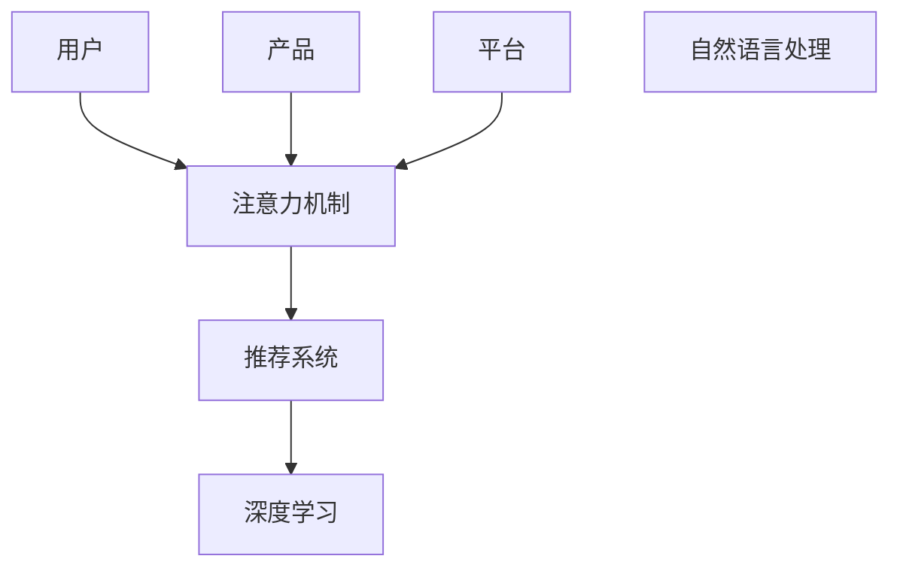

                 

## 1. 背景介绍

### 1.1 问题由来

随着数字经济时代的到来，经济活动的形态正在发生深刻的转变。工业经济时代，生产力以物理资源和劳动力的结合为支撑，生产流程是线性的、流程化的、线性的。而数字经济时代，数据成为核心生产要素，注意力成为关键资源。注意力经济不仅改变了生产方式，也重塑了社会经济结构。

### 1.2 问题核心关键点

注意力经济的核心在于如何高效地分配和利用注意力资源，以最大化经济价值。这包括：

- **用户注意力**：用户注意力是信息流量的入口，是商家获取市场份额的起点。
- **产品注意力**：产品吸引力的强弱，决定了其在市场上的竞争力。
- **平台注意力**：平台的用户黏性和吸引力，决定了其市场份额和品牌价值。

注意力经济中的重要一环是通过算法的精细化设计和优化，精准地推荐信息内容，提升用户满意度和转化率。算法的核心是计算用户对信息的关注度和相关性，以此为基础，优化推荐策略。

## 2. 核心概念与联系

### 2.1 核心概念概述

为更好地理解从工业经济到注意力经济的转变，我们首先介绍几个关键概念：

- **注意力机制(Attention Mechanism)**：通过计算信息之间的相关性，动态分配资源，优化决策过程。在深度学习中，注意力机制常用于图像识别、自然语言处理等领域，提升模型性能。

- **推荐系统(Recommendation System)**：基于用户的历史行为和偏好，通过算法预测用户对物品的兴趣，实现个性化推荐。推荐系统广泛应用于电商、社交媒体、视频网站等领域。

- **自然语言处理(Natural Language Processing, NLP)**：使计算机能够理解、解释和生成人类语言的技术。在注意力经济中，NLP技术能够更准确地分析用户反馈和情感，优化推荐策略。

- **深度学习(Deep Learning)**：通过多层神经网络，模拟人脑的推理和决策过程，实现复杂模式的识别和处理。深度学习算法是当前主流机器学习框架的核心。

- **注意力经济**：基于注意力机制，通过算法的精准推荐，优化资源配置和市场分配，最大化经济价值。

这些核心概念之间的逻辑关系可以通过以下Mermaid流程图来展示：



### 2.2 核心概念原理和架构的 Mermaid 流程图


## 3. 核心算法原理 & 具体操作步骤
### 3.1 算法原理概述

注意力经济的核心算法是注意力机制。注意力机制通过动态分配计算资源，对不同输入的权重进行加权，增强模型对关键信息的关注和理解。在推荐系统中，注意力机制通过计算用户对不同物品的关注度，实现精准推荐。

### 3.2 算法步骤详解

注意力机制的计算步骤如下：

1. **输入向量表示**：将输入序列（如文本、图片）转换为向量表示，以向量形式进行后续计算。

2. **注意力计算**：计算输入序列中每个元素与查询向量的相关性权重，即注意力分数。

3. **加权求和**：将输入向量与权重相乘后求和，得到加权后的向量表示。

4. **输出**：将加权后的向量作为模型输出，用于进一步决策或推荐。

### 3.3 算法优缺点

注意力机制的优点在于：

- **动态适应**：能够根据当前输入动态调整计算资源分配，提升模型性能。
- **多输入处理**：适用于多模态数据的处理，如文本、图像、语音等。
- **泛化能力强**：可以处理复杂的模式识别和推理任务。

缺点包括：

- **计算量大**：需要计算注意力权重和加权求和，计算复杂度高。
- **训练时间长**：训练过程中需要大量反向传播，训练时间较长。
- **参数复杂**：模型参数较多，需要高效的优化算法和数据处理策略。

### 3.4 算法应用领域

注意力机制在多个领域都有广泛应用，包括：

- **自然语言处理**：文本分类、机器翻译、问答系统、情感分析等。
- **计算机视觉**：图像分类、目标检测、图像生成、视频分析等。
- **声音处理**：语音识别、语音合成、声音分离、音频分类等。
- **推荐系统**：个性化推荐、内容推荐、广告投放等。

## 4. 数学模型和公式 & 详细讲解

### 4.1 数学模型构建

在自然语言处理中，注意力机制常用的数学模型包括：

- **点积注意力模型**：通过计算输入和查询向量的点积，得到注意力权重。
- **加性注意力模型**：通过计算输入和查询向量的相似度，得到注意力权重。

点积注意力模型的公式为：

$$
\text{Attention}(Q, K, V) = \text{Softmax}(\frac{QK^T}{\sqrt{d_k}})
$$

其中，$Q$ 为查询向量，$K$ 为键向量，$V$ 为值向量。$d_k$ 为键向量的维度。

### 4.2 公式推导过程

加性注意力模型的公式为：

$$
\alpha_{ij} = \text{Softmax}(\frac{e_{ij}}{\sqrt{d_k}})
$$

$$
\text{Attention}(Q, K, V) = \sum_{j=1}^{N}\alpha_{ij}V_j
$$

其中，$\alpha_{ij}$ 为输入 $x_i$ 对查询 $q$ 的注意力权重，$e_{ij}$ 为输入 $x_i$ 与查询 $q$ 的相似度。

### 4.3 案例分析与讲解

以情感分析任务为例，假设输入为一句话，查询向量 $q$ 为情感分析器的向量表示，键向量 $K$ 和值向量 $V$ 为句子中每个单词的向量表示。点积注意力模型可以计算出每个单词对情感分析器的贡献，从而获得情感极性的加权和，作为情感分析的结果。

## 5. 项目实践：代码实例和详细解释说明
### 5.1 开发环境搭建

在构建注意力经济系统时，我们需要搭建一个开发环境。以下是使用Python进行TensorFlow开发的环境配置流程：

1. 安装Anaconda：从官网下载并安装Anaconda，用于创建独立的Python环境。

2. 创建并激活虚拟环境：
```bash
conda create -n tf-env python=3.7 
conda activate tf-env
```

3. 安装TensorFlow：从官网获取对应的安装命令。例如：
```bash
pip install tensorflow==2.6
```

4. 安装其他所需库：
```bash
pip install numpy pandas scikit-learn tqdm jupyter notebook ipython
```

完成上述步骤后，即可在`tf-env`环境中开始项目实践。

### 5.2 源代码详细实现

下面我们以情感分析任务为例，给出使用TensorFlow实现点积注意力模型的PyTorch代码实现。

```python
import tensorflow as tf
from tensorflow.keras.layers import Dense, Input, concatenate

# 定义模型
class AttentionModel(tf.keras.Model):
    def __init__(self, vocab_size, embedding_dim):
        super(AttentionModel, self).__init__()
        self.embedding = Dense(vocab_size, input_dim=embedding_dim, activation='relu')
        self.attention = tf.keras.layers.Dense(vocab_size, activation='softmax')
        self.concat = Dense(1, activation='softmax')
    
    def call(self, x):
        x = self.embedding(x)
        attention_weights = self.attention(x)
        attention_values = tf.reduce_sum(attention_weights * x, axis=1)
        attention_output = self.concat(attention_values)
        return attention_output
    
# 加载数据集
import pandas as pd
import numpy as np

# 读取文本和标签
df = pd.read_csv('data.csv')
texts = df['text'].tolist()
labels = df['label'].tolist()

# 数据预处理
tokenizer = tf.keras.preprocessing.text.Tokenizer()
tokenizer.fit_on_texts(texts)
sequences = tokenizer.texts_to_sequences(texts)
max_len = max([len(x) for x in sequences])
X = tf.keras.preprocessing.sequence.pad_sequences(sequences, maxlen=max_len)

# 定义模型
vocab_size = len(tokenizer.word_index) + 1
embedding_dim = 128
model = AttentionModel(vocab_size, embedding_dim)

# 定义损失函数和优化器
loss_fn = tf.keras.losses.BinaryCrossentropy(from_logits=True)
optimizer = tf.keras.optimizers.Adam(learning_rate=0.001)

# 定义训练函数
@tf.function
def train_step(input_data, labels):
    with tf.GradientTape() as tape:
        logits = model(input_data)
        loss_value = loss_fn(labels, logits)
    gradients = tape.gradient(loss_value, model.trainable_variables)
    optimizer.apply_gradients(zip(gradients, model.trainable_variables))
    return loss_value

# 训练模型
num_epochs = 10
for epoch in range(num_epochs):
    epoch_loss = 0
    for input_data, label in train_dataset:
        loss_value = train_step(input_data, label)
        epoch_loss += loss_value
    print(f'Epoch {epoch+1}, loss: {epoch_loss/len(train_dataset)}')
```

### 5.3 代码解读与分析

让我们再详细解读一下关键代码的实现细节：

**AttentionModel类**：
- `__init__`方法：初始化嵌入层、注意力层和拼接层，其中拼接层用于计算情感极性。
- `call`方法：前向传播过程，先进行嵌入映射，再计算注意力权重和值向量，最后通过拼接层得到情感极性。

**数据预处理**：
- 使用`Tokenizer`对文本进行分词，并转换为序列。
- 对序列进行填充，保证序列长度一致。
- 加载文本和标签数据。

**训练函数**：
- 定义训练步骤函数`train_step`，先计算模型输出和损失函数，再计算梯度并优化模型参数。
- 在每个epoch内，对训练集中的每个样本进行前向传播和反向传播，计算损失值并更新模型参数。

**模型训练**：
- 定义训练轮数`num_epochs`，循环迭代训练模型。
- 在每个epoch内，计算平均损失值并输出。

可以看到，TensorFlow配合Keras框架使得点积注意力模型的实现变得简洁高效。开发者可以将更多精力放在数据处理、模型改进等高层逻辑上，而不必过多关注底层的实现细节。

当然，工业级的系统实现还需考虑更多因素，如模型的保存和部署、超参数的自动搜索、更灵活的任务适配层等。但核心的注意力计算过程基本与此类似。

## 6. 实际应用场景
### 6.1 智能客服系统

基于点积注意力机制的智能客服系统，可以实时监控和分析用户对话，智能推荐答案。系统通过采集大量的历史对话数据，训练一个点积注意力模型，用于计算用户对每个答案的关注度。在用户输入问题后，系统通过点积注意力机制，动态调整答案的权重，生成最合适的答案推荐。

### 6.2 金融舆情监测

在金融领域，情感分析技术可以实时监测市场舆情，识别情绪波动，预测市场趋势。通过分析股票、新闻、社交媒体等数据，系统可以构建点积注意力模型，对不同信息源进行加权，从而判断市场情绪的变化。一旦发现负面消息激增等异常情况，系统便会自动预警，帮助投资者规避风险。

### 6.3 个性化推荐系统

推荐系统通过点积注意力机制，计算用户对不同物品的关注度，实现个性化推荐。系统首先根据用户历史行为，训练一个点积注意力模型，用于计算物品对用户的吸引力。在用户浏览商品时，系统通过点积注意力机制，动态调整物品的权重，推荐最符合用户兴趣的商品。

### 6.4 未来应用展望

随着点积注意力机制的发展，未来将有更多应用场景受益于注意力经济。

在智慧医疗领域，情感分析技术可以用于实时监测患者的情绪变化，辅助医生进行心理干预和治疗。在智能交通领域，系统可以通过分析交通流量数据，智能调整信号灯设置，提高交通效率。

在教育领域，个性化推荐系统可以根据学生的学习行为，推荐合适的学习材料和课程，提升学习效果。在新闻媒体领域，情感分析技术可以实时监测社会舆情，辅助媒体进行报道和决策。

此外，在零售、广告、农业等多个领域，点积注意力机制也将大放异彩，赋能各行各业的发展。

## 7. 工具和资源推荐
### 7.1 学习资源推荐

为了帮助开发者系统掌握点积注意力机制的理论基础和实践技巧，这里推荐一些优质的学习资源：

1. 《深度学习》系列博文：由深度学习专家撰写，深入浅出地介绍了深度学习的基本原理和应用实例。

2. CS231n《计算机视觉：卷积神经网络》课程：斯坦福大学开设的计算机视觉明星课程，涵盖深度学习在计算机视觉中的应用。

3. 《自然语言处理与深度学习》书籍：详细介绍了自然语言处理中的深度学习技术，包括点积注意力机制的应用。

4. TensorFlow官方文档：提供了丰富的API和示例代码，方便开发者进行实践和调试。

5. Keras官方文档：提供了简单易用的API，帮助开发者快速上手深度学习模型开发。

通过对这些资源的学习实践，相信你一定能够快速掌握点积注意力机制的精髓，并用于解决实际的NLP问题。

### 7.2 开发工具推荐

高效的开发离不开优秀的工具支持。以下是几款用于点积注意力机制开发的常用工具：

1. TensorFlow：基于Python的开源深度学习框架，灵活性高，适用于各种深度学习模型的开发和训练。

2. PyTorch：基于Python的开源深度学习框架，支持动态计算图，适合快速迭代研究。

3. Keras：高层次的深度学习框架，易于上手，适合初学者和快速原型开发。

4. Jupyter Notebook：交互式开发环境，支持多种编程语言和数据格式，适合数据探索和模型实验。

5. TensorBoard：TensorFlow配套的可视化工具，支持实时监控训练状态，方便调试和优化。

6. Weights & Biases：模型训练的实验跟踪工具，可以记录和可视化模型训练过程中的各项指标，方便对比和调优。

合理利用这些工具，可以显著提升点积注意力机制的开发效率，加快创新迭代的步伐。

### 7.3 相关论文推荐

点积注意力机制的研究源于学界的持续探索。以下是几篇奠基性的相关论文，推荐阅读：

1. Attention is All You Need（即Transformer原论文）：提出了Transformer结构，引入了注意力机制，开启了NLP领域的预训练大模型时代。

2. BERT: Pre-training of Deep Bidirectional Transformers for Language Understanding：提出BERT模型，引入了自监督预训练任务，刷新了多项NLP任务SOTA。

3. Conformer: Fast Self-Attention with Linear Complexity：提出Conformer模型，优化了自注意力机制，提升了模型效率和效果。

4. T5: Exploring the Limits of Transfer Learning with a Unified Text-to-Text Transformer：提出T5模型，通过预训练模型实现跨任务迁移学习，提升了模型泛化能力。

5. Capsule Network: Architectures with Locally Connected Elements：提出了胶囊网络，通过注意力机制实现元素之间的局部连接，提升了模型对复杂模式的识别能力。

这些论文代表了深度学习领域在注意力机制上的重要进展，为点积注意力机制的发展提供了理论支撑。通过学习这些前沿成果，可以帮助研究者把握学科前进方向，激发更多的创新灵感。

## 8. 总结：未来发展趋势与挑战

### 8.1 总结

本文对基于点积注意力机制的推荐系统和情感分析技术进行了全面系统的介绍。首先阐述了从工业经济到注意力经济转变的背景和意义，明确了注意力经济对生产方式和社会结构的影响。其次，从原理到实践，详细讲解了点积注意力机制的数学原理和关键步骤，给出了点积注意力模型的完整代码实例。同时，本文还广泛探讨了点积注意力机制在智能客服、金融舆情、个性化推荐等多个行业领域的应用前景，展示了点积注意力机制的巨大潜力。此外，本文精选了点积注意力机制的学习资源，力求为读者提供全方位的技术指引。

通过本文的系统梳理，可以看到，点积注意力机制为实现精准推荐和情感分析提供了强大的技术支撑，极大地拓展了深度学习在实际应用中的表现。未来，伴随点积注意力机制和深度学习技术的不断发展，推荐系统和情感分析技术必将在更广泛的领域得到应用，为各行各业带来新的突破。

### 8.2 未来发展趋势

展望未来，点积注意力机制的发展将呈现以下几个趋势：

1. **多模态融合**：未来的推荐系统将不仅仅是文本或图像数据的处理，而是融合多模态数据，如文本、图像、音频等，提升推荐效果和用户体验。

2. **跨领域迁移**：点积注意力机制将更加注重跨领域的知识迁移，能够将一种领域的经验应用到另一种领域，提高模型的泛化能力。

3. **动态调整**：未来的系统将更加注重动态调整，能够根据用户的行为和环境变化，实时调整推荐策略，提升个性化和适应性。

4. **对抗训练**：点积注意力机制将引入对抗训练，通过对抗样本提高模型的鲁棒性，防止攻击和误导。

5. **集成学习**：未来的推荐系统将更加注重集成学习，通过结合多个模型的输出，提升推荐的准确性和稳定性。

6. **语义增强**：点积注意力机制将引入语义增强，通过理解和推理语义信息，提升推荐的合理性和可信度。

这些趋势将引领点积注意力机制的不断演进，使其在更广泛的应用场景中发挥作用。

### 8.3 面临的挑战

尽管点积注意力机制已经取得了瞩目成就，但在迈向更加智能化、普适化应用的过程中，它仍面临着诸多挑战：

1. **数据稀缺性**：点积注意力机制的训练需要大量的标注数据，尤其是在特定领域的应用中，数据获取难度较大。

2. **模型复杂性**：点积注意力机制的模型结构较为复杂，训练和推理速度较慢，难以满足实时性需求。

3. **可解释性不足**：点积注意力机制的决策过程缺乏可解释性，难以理解模型的内部工作机制和推理逻辑。

4. **对抗攻击**：点积注意力机制容易受到对抗攻击，如通过引入噪声或干扰，影响模型的正常输出。

5. **安全性问题**：点积注意力机制在应用过程中可能存在数据隐私和安全问题，如用户隐私泄露和数据滥用。

6. **计算资源需求**：点积注意力机制的计算复杂度较高，需要大量计算资源和存储空间。

正视点积注意力机制面临的这些挑战，积极应对并寻求突破，将是其走向成熟的必由之路。

### 8.4 研究展望

面对点积注意力机制所面临的挑战，未来的研究需要在以下几个方面寻求新的突破：

1. **数据增强**：通过数据增强技术，扩充训练集，提升模型的泛化能力。

2. **模型优化**：通过模型结构优化和计算图优化，提升模型的训练和推理效率。

3. **可解释性提升**：通过可解释性技术，如LIME、SHAP等，提升模型的透明性和可信度。

4. **安全保障**：通过对抗训练和数据脱敏等技术，保障数据和模型的安全性。

5. **多模态融合**：通过融合多模态数据，提升推荐系统的全面性和准确性。

6. **跨领域迁移**：通过跨领域迁移学习，提高模型的泛化能力和应用范围。

这些研究方向将引领点积注意力机制的不断演进，为推荐系统和情感分析技术带来新的突破。面向未来，点积注意力机制的研究和应用将不断深入，推动人工智能技术的进步和发展。

## 9. 附录：常见问题与解答

**Q1: 点积注意力机制在推荐系统中有什么优势？**

A: 点积注意力机制在推荐系统中的优势主要体现在：

1. **动态调整**：能够根据用户的历史行为和实时输入，动态调整物品的权重，提升推荐的个性化和适应性。
2. **模型泛化**：能够处理多模态数据，如文本、图像、音频等，提升推荐系统的全面性和准确性。
3. **对抗训练**：通过引入对抗训练，提升模型的鲁棒性和安全性，防止攻击和误导。
4. **跨领域迁移**：能够跨领域迁移知识，提高模型的泛化能力和应用范围。

**Q2: 如何提高点积注意力机制的可解释性？**

A: 提高点积注意力机制的可解释性主要可以通过以下方法：

1. **模型可视化**：通过可视化技术，如t-SNE、LIME等，展示模型的内部工作机制和推理逻辑。
2. **解释生成**：通过解释生成技术，如SHAP、Attention Visualization等，生成模型输出的解释和建议。
3. **特征重要性分析**：通过特征重要性分析，如SHAP值、LIME解释等，理解模型对不同特征的依赖关系。
4. **模型复现**：通过模型复现技术，如模型保存和加载、中间变量记录等，验证和理解模型的决策过程。

**Q3: 点积注意力机制在实时性要求较高的场景中如何优化？**

A: 在实时性要求较高的场景中，可以采用以下方法优化点积注意力机制：

1. **模型剪枝**：通过模型剪枝技术，去除冗余的层和参数，减小模型尺寸，提升推理速度。
2. **量化加速**：通过量化技术，将浮点模型转换为定点模型，压缩存储空间，提高计算效率。
3. **模型并行**：通过模型并行技术，利用多核CPU/GPU等资源，提升模型的计算能力。
4. **异步推理**：通过异步推理技术，并行处理多个请求，提升系统的吞吐量和响应速度。

**Q4: 点积注意力机制在多模态数据融合中如何应用？**

A: 点积注意力机制在多模态数据融合中的应用主要包括以下步骤：

1. **数据预处理**：对不同模态的数据进行预处理，转换为统一的向量表示。
2. **特征融合**：将不同模态的特征进行融合，得到多模态的特征表示。
3. **注意力计算**：通过点积注意力机制，计算不同模态特征之间的相关性权重，得到加权后的特征表示。
4. **模型训练**：在多模态特征表示的基础上，训练点积注意力模型，实现多模态数据的融合和推理。

**Q5: 点积注意力机制在跨领域迁移学习中如何应用？**

A: 点积注意力机制在跨领域迁移学习中的应用主要包括以下步骤：

1. **源领域预训练**：在源领域的数据上预训练点积注意力模型，学习领域特定的知识。
2. **特征映射**：通过特征映射技术，将源领域的特征映射到目标领域。
3. **注意力融合**：通过点积注意力机制，计算不同领域特征之间的相关性权重，得到加权后的特征表示。
4. **模型微调**：在加权后的特征表示的基础上，微调目标领域的模型，实现跨领域迁移学习。

通过这些步骤，点积注意力机制能够实现领域之间的知识迁移，提高模型的泛化能力和应用范围。

---

作者：禅与计算机程序设计艺术 / Zen and the Art of Computer Programming

