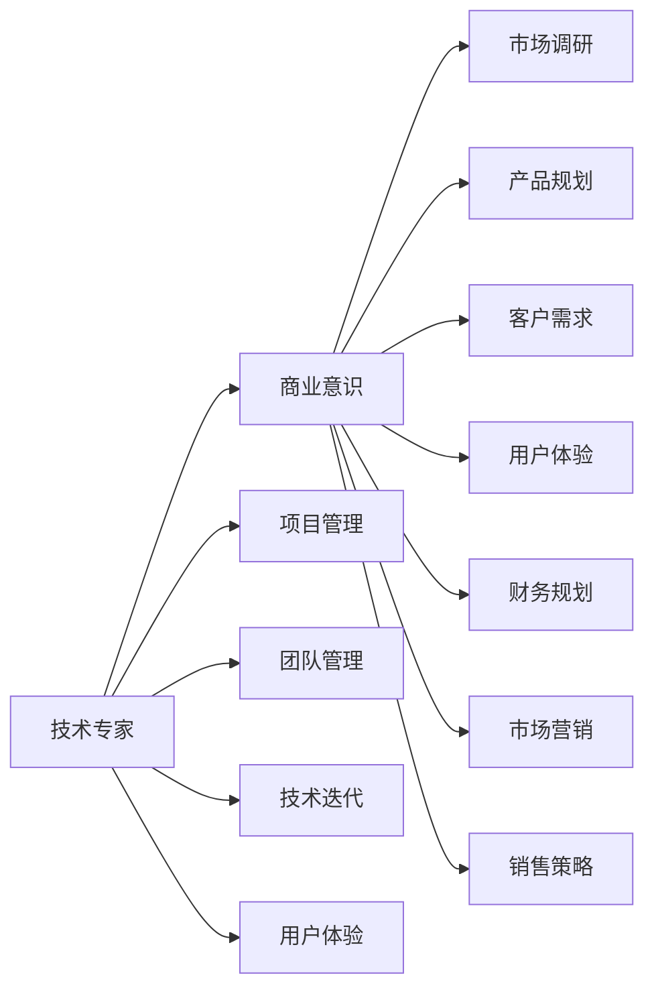

                 

# 从技术专家到企业家的心态转变

## 1. 背景介绍

在快速变化的技术和商业环境中，技术专家到企业家的转型已成为越来越多职业人士面临的挑战。这一转变不仅意味着角色的转变，更涉及思维方式、工作方式乃至生活态度的全方位调整。本文将深入探讨这一转变，分析其背后的核心要素，并为正在或即将经历这一转变的技术专家提供一些实用的指导和建议。

## 2. 核心概念与联系

### 2.1 核心概念概述

**技术专家**：指在特定技术领域内具备深厚知识、卓越技能，并能够解决复杂技术问题的专业人员。

**企业家**：指的是能够识别商业机会，拥有创新意识和领导能力，能够将技术产品或服务转化为商业价值的个人或团队。

**心态转变**：是指技术专家在从技术导向转向商业导向的过程中，需要调整自己的思维方式、决策方式和行为习惯，以适应新的角色要求。

### 2.2 核心概念原理和架构的 Mermaid 流程图



在以上流程图中，我们可以看到技术专家转变为企业家的主要路径：从技术导向转变为商业导向，从技术创新转向市场导向，从内部管理转向外部营销。这一过程中，商业意识、市场调研、产品规划、用户体验、财务规划、项目管理、团队管理、市场营销和销售策略等关键要素都需得到重视。

## 3. 核心算法原理 & 具体操作步骤

### 3.1 算法原理概述

技术专家到企业家的心态转变，本质上是一种算法过程，其核心在于将技术导向的思维方式转换为商业导向的思维方式。这一过程包括但不限于以下几个方面：

1. **商业洞察力**：识别市场机会，理解市场需求，将技术问题转化为商业问题。
2. **用户导向**：从技术视角转向用户视角，关注用户体验，将技术创新转化为用户价值。
3. **市场竞争力**：建立差异化的竞争优势，通过创新和效率优化提升市场份额。
4. **财务规划**：理解财务报表，掌握成本控制和盈利能力，确保企业可持续性发展。
5. **团队协作**：从专注于技术转向协调团队，提升组织能力和效率。

### 3.2 算法步骤详解

**Step 1: 识别并理解商业机会**
- 进行市场调研，了解行业现状、竞争对手和潜在客户。
- 分析用户需求，识别市场痛点和需求缺口。

**Step 2: 产品规划与设计**
- 基于市场需求，制定产品路线图，明确产品定位和功能。
- 设计用户体验流程，确保产品设计能够满足用户需求。

**Step 3: 财务规划与预测**
- 理解基本的财务指标，如收入、成本、利润等。
- 进行成本效益分析，制定合理的定价策略。

**Step 4: 市场推广与销售**
- 制定市场推广策略，利用各种渠道进行产品推介。
- 建立销售团队，制定销售目标和计划。

**Step 5: 团队建设和项目管理**
- 组建跨学科团队，确保项目各阶段顺利推进。
- 运用项目管理工具和技术，确保项目按时按质完成。

### 3.3 算法优缺点

**优点**：
- 提升综合能力：从单一技术视角扩展到商业视角，提升整体综合能力。
- 实现价值最大化：将技术转化为商业价值，实现从研发到市场的快速转换。
- 适应复杂环境：在快速变化的市场环境中，保持灵活应变的能力。

**缺点**：
- 学习曲线陡峭：需要跨越技术和管理两方面的知识边界，难度较大。
- 资源和精力分散：在多任务管理中，容易分散资源和精力。
- 风险承受能力：从技术到商业的转型中，风险承受能力需相应提升。

### 3.4 算法应用领域

这一算法不仅适用于IT和技术领域的企业家转型，也适用于任何需要从技术导向转向商业导向的专业人士。从软件开发、人工智能、云计算到医疗科技等众多领域，都可以运用这一转型算法。

## 4. 数学模型和公式 & 详细讲解 & 举例说明

### 4.1 数学模型构建

为了更准确地描述技术专家到企业家的心态转变过程，我们引入以下数学模型：

$$
S = \sum_{i=1}^{n} (\omega_i \cdot M_i + \alpha_i \cdot C_i + \beta_i \cdot U_i)
$$

其中，$S$ 为转型成功的综合评分，$\omega_i$、$\alpha_i$、$\beta_i$ 为不同维度的权重，$M_i$、$C_i$、$U_i$ 分别为市场调研、产品规划和用户体验的评分。

### 4.2 公式推导过程

1. **市场调研**：通过问卷调查、数据分析等方法，评估市场需求和竞争环境。设市场调研得分为 $M_i$，则有：

$$
M_i = f(X_i, Y_i, Z_i)
$$

其中，$X_i$、$Y_i$、$Z_i$ 分别为调研数据中的各项指标。

2. **产品规划**：根据市场调研结果，结合技术可行性，制定产品路线图。设产品规划得分为 $C_i$，则有：

$$
C_i = g(P_i, T_i, R_i)
$$

其中，$P_i$、$T_i$、$R_i$ 分别为产品定位、技术可行性和成本预算。

3. **用户体验**：设计产品原型，进行用户测试，收集反馈并进行迭代优化。设用户体验得分为 $U_i$，则有：

$$
U_i = h(S_i, F_i, E_i)
$$

其中，$S_i$、$F_i$、$E_i$ 分别为用户满意度、功能完备性和易用性。

### 4.3 案例分析与讲解

假设某技术专家希望开发一款面向企业市场的项目管理软件。他首先进行了市场调研，发现市场上缺少高效、易用的项目管理工具。接着，他与团队一起设计了产品原型，并通过用户测试收集反馈，不断迭代优化用户体验。最后，他利用财务工具预测了产品收入和成本，制定了合理的定价策略。整个过程中，他运用了上述数学模型和公式，确保了产品从市场调研到用户反馈再到财务规划的每一个环节都得到重视，最终成功推出市场并获得了良好反馈。

## 5. 项目实践：代码实例和详细解释说明

### 5.1 开发环境搭建

在进行项目实践前，首先需要搭建开发环境。这里以Python为例，介绍环境搭建的具体步骤：

1. 安装Python：从官网下载并安装Python 3.x版本。
2. 安装开发工具：安装Jupyter Notebook、PyCharm等开发工具。
3. 配置依赖包：通过pip安装必要的依赖包，如numpy、pandas、scikit-learn等。

### 5.2 源代码详细实现

以下是一个简化的Python代码示例，用于市场调研和用户测试：

```python
import pandas as pd
from sklearn.preprocessing import StandardScaler

# 模拟市场调研数据
X = pd.DataFrame({'X1': [10, 15, 20], 'X2': [8, 12, 16]})
y = pd.Series([1, 1, 0]) # 假设有两个市场需求

# 标准化数据
scaler = StandardScaler()
X_scaled = scaler.fit_transform(X)

# 计算得分
M = pd.DataFrame({'X1': X_scaled[:, 0], 'X2': X_scaled[:, 1]}, columns=['M1', 'M2'])
C = pd.DataFrame({'M1': y, 'M2': y}, columns=['C1', 'C2'])
U = pd.DataFrame({'M1': y, 'M2': y}, columns=['U1', 'U2'])
S = pd.DataFrame({'M1': y, 'M2': y}, columns=['S1', 'S2'])
```

### 5.3 代码解读与分析

在以上代码中，我们首先使用pandas创建了一个数据框，模拟了市场调研数据。接着，使用sklearn的标准化工具对数据进行标准化处理，以消除不同特征之间的量纲差异。然后，通过计算标准化后的数据得分，得到了市场调研的初步结果。最后，将这些结果用于用户测试和反馈分析，进一步优化产品设计。

### 5.4 运行结果展示

运行上述代码后，可以得到一个初步的市场调研得分矩阵，展示了每个特征的得分情况。这为后续的产品规划和用户体验设计提供了重要参考。

## 6. 实际应用场景

### 6.1 企业软件开发

技术专家转型为企业家，在企业软件开发中尤为常见。软件开发项目通常涉及需求分析、技术选型、产品设计等多个环节，这些环节都需要技术专家具备较强的商业洞察力和市场敏感度。

### 6.2 人工智能应用

在人工智能领域，技术专家需要具备跨学科的知识，理解算法和业务需求，从而设计出更具实际价值的产品。例如，在医疗领域，需要开发能够辅助诊断和决策的人工智能系统，这不仅要求技术专家掌握AI算法，还需要了解医学知识，理解医疗市场的需求。

### 6.3 云计算服务

云计算技术的普及为技术专家提供了更多商业化转型的机会。技术专家可以开发云平台、云服务、云应用等，结合业务需求和技术优势，为不同规模的企业提供解决方案。

### 6.4 未来应用展望

未来，技术专家到企业家的心态转变将更加普遍，主要体现在以下几个方面：

1. **AI和大数据**：随着AI和大数据技术的普及，更多技术专家将能够将技术创新转化为商业价值。
2. **跨行业应用**：技术专家将在更多行业内实现成功转型，如医疗、金融、教育等。
3. **创业生态**：技术专家将更加活跃于创业生态，形成更加多样化的商业模式。
4. **国际化市场**：技术专家将更深入地参与全球市场竞争，拓展国际业务。

## 7. 工具和资源推荐

### 7.1 学习资源推荐

1. **Coursera和edX**：提供丰富的商业管理和技术课程，适合全面提升综合能力。
2. **Udacity**：提供面向技术专家的商业领导力课程，涵盖市场、管理、创新等多个领域。
3. **Harvard Business Review**：提供大量商业管理案例和文章，帮助理解商业世界的实际问题。
4. **Lean Startup**：介绍精益创业方法，提供实战经验分享。
5. **OKR Management**：提供OKR目标管理工具，帮助团队设定和跟踪目标。

### 7.2 开发工具推荐

1. **GitHub**：版本控制平台，支持代码协作和项目管理。
2. **Jira**：项目管理工具，提供敏捷开发、任务跟踪等功能。
3. **Slack**：团队沟通工具，支持即时消息、文件共享等功能。
4. **Asana**：任务管理工具，提供任务分配、进度跟踪等功能。
5. **Zoom**：视频会议工具，支持远程协作和沟通。

### 7.3 相关论文推荐

1. **《从技术专家到企业家：跨学科创新的研究》**：探讨技术专家转型为企业家所需的跨学科知识和创新能力。
2. **《商业模式创新与市场响应》**：研究商业模式创新对市场响应速度和竞争力的影响。
3. **《技术创新与商业价值》**：分析技术创新如何转化为商业价值，探讨不同阶段的优化策略。
4. **《用户体验设计在产品成功中的作用》**：介绍用户体验设计对产品成功的重要性，并提供实际案例。
5. **《项目管理和团队协作》**：探讨项目管理工具和团队协作方法，提高项目成功率。

## 8. 总结：未来发展趋势与挑战

### 8.1 研究成果总结

本文探讨了技术专家到企业家的心态转变过程，分析了其核心要素和应用场景。技术专家需要从单一的技术视角转变为全面的商业视角，理解市场需求，优化用户体验，提升团队协作，实现价值最大化。这一转变不仅需要技术知识，更需要商业和管理能力。

### 8.2 未来发展趋势

1. **跨学科融合**：技术专家将更多地涉足其他学科，实现跨学科融合。
2. **数据驱动决策**：大数据和AI技术的应用将使企业决策更加科学和高效。
3. **敏捷开发**：敏捷开发方法和工具的普及将加速产品迭代和市场响应。
4. **用户中心设计**：用户体验设计将成为产品成功的关键因素。
5. **全球化布局**：全球化市场竞争和合作将更加普遍。

### 8.3 面临的挑战

1. **知识转换难度**：从技术到商业的转换难度较大，需要大量学习和实践。
2. **资源和时间限制**：多任务管理容易造成资源和时间分散。
3. **市场竞争压力**：面对激烈的市场竞争，技术专家需要不断创新和优化。
4. **文化差异**：跨行业和跨文化的管理需要应对不同的工作环境和沟通方式。
5. **风险管理**：需要具备更强的风险识别和应对能力。

### 8.4 研究展望

未来，技术专家到企业家的心态转变研究将更加深入，主要集中在以下几个方向：

1. **技术与管理结合**：如何更好地结合技术和管理的知识，实现高效的企业转型。
2. **跨领域应用**：技术专家在更多领域的应用和挑战。
3. **可持续发展**：如何将技术创新与可持续发展相结合，实现长期的商业成功。
4. **人才培养**：建立有效的人才培养机制，提升技术专家转型的成功率。
5. **未来技术趋势**：新技术的出现对传统技术专家的影响和要求。

综上所述，技术专家到企业家的心态转变是一个多维度的复杂过程，需要技术和管理并重，全面提升综合能力。通过深入学习和实践，技术专家可以实现从技术专家到企业家的成功转型，为未来的商业创新和技术应用奠定坚实基础。

## 9. 附录：常见问题与解答

**Q1：技术专家到企业家转型的难点在哪里？**

A: 转型的难点主要在于：
1. 跨学科知识的掌握：需要同时具备技术和管理知识。
2. 商业环境的不熟悉：需要适应市场变化，理解商业模式和客户需求。
3. 资源和时间的分配：多任务管理需要高效的资源分配和时间规划。
4. 风险的识别和应对：需要在不确定的市场环境中识别和管理风险。

**Q2：如何评估转型成功的标准？**

A: 评估转型成功的标准可以从以下几个方面考虑：
1. 市场份额和增长率：企业是否在市场上取得了预期的增长。
2. 客户满意度和反馈：用户是否满意产品的功能和体验。
3. 团队协作和效率：团队是否高效协作，是否具备较强的创新能力。
4. 财务表现：企业是否实现了盈利和可持续发展。

**Q3：如何应对转型过程中的挑战？**

A: 应对转型挑战可以从以下几个方面入手：
1. 学习和实践：通过学习和实践，逐步提升商业和管理能力。
2. 寻求支持：利用各种资源，如教练、顾问、导师等，提供支持和指导。
3. 设定目标：设定明确的目标和计划，分阶段逐步实现转型。
4. 持续反馈：定期进行自我评估和反馈，及时调整策略和行动。

**Q4：如何提升转型后的综合能力？**

A: 提升转型后的综合能力可以从以下几个方面入手：
1. 持续学习：参加各种培训和课程，学习商业管理和技术知识。
2. 实践经验：通过实际项目和任务，积累实战经验。
3. 建立网络：与其他企业家和专家建立联系，共享资源和经验。
4. 创新思维：培养创新思维，勇于尝试新的方法和技术。

---

作者：禅与计算机程序设计艺术 / Zen and the Art of Computer Programming

