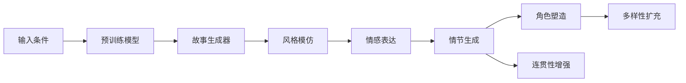

                 

# 从语言模型到故事生成器：AI创意写作的未来

## 1. 背景介绍

### 1.1 问题由来
随着人工智能技术的迅速发展，尤其是深度学习模型的成功应用，自然语言处理（NLP）领域取得了显著进展。在传统语言模型的基础上，GPT-3、BERT等大规模语言模型的问世，标志着NLP进入了一个新的发展阶段。这些模型能够处理复杂的语言结构，进行语义理解、生成、翻译等多种自然语言处理任务。

然而，尽管这些语言模型在语义理解和生成方面有着出色的表现，但它们主要依赖于大规模、高同质性的数据集进行训练。这使得它们在某些需要创造性和个性化的任务上表现不足，尤其是在需要创造出新颖、独特故事的创意写作任务中，模型的表现还有很大提升空间。因此，如何利用语言模型生成创意写作作品，成为当前AI研究的一个热点。

### 1.2 问题核心关键点
1. **语言模型与创意写作的区别**：
   - 语言模型主要用于理解语言规律和语义结构，能够生成语法正确、语义通顺的文本。
   - 创意写作不仅需要语法和语义的正确，还需要创新、想象力和情感表达。

2. **创意写作的挑战**：
   - 创意写作需要模型理解并模仿人类作家的创作风格和语言风格。
   - 创意写作要求模型具有较高的情感共鸣和故事连贯性。
   - 创意写作还需要模型能够在多种风格和题材中进行切换。

3. **生成式语言模型的局限性**：
   - 现有的语言模型虽然能够生成流畅的文本，但缺乏创造性和多样性。
   - 模型生成的文本往往千篇一律，缺乏个性化的特征。
   - 模型生成的文本往往缺乏深度情感表达和创意表达。

4. **故事生成器的研究目标**：
   - 发展能够生成具有创新性、个性化和情感深度的故事。
   - 在多样化和个性化方面提升生成式语言模型。
   - 在创意和情感表达方面增强故事生成器的能力。

## 2. 核心概念与联系

### 2.1 核心概念概述

故事生成器（Story Generator）是指能够根据输入条件或提示，生成具有一定情节、角色和情感的故事作品的人工智能系统。它通常基于生成式语言模型，如GPT-3、Transformer等，通过训练在大规模文本数据集上进行预训练，并在特定任务上进行微调。

故事生成器旨在解决创意写作中的挑战，具体包括：
- 生成多样化和个性化的故事内容。
- 理解并模仿特定风格和语言特点。
- 表达丰富的情感和创新性的故事构思。

### 2.2 核心概念原理和架构的 Mermaid 流程图



这个流程图展示了故事生成器的工作流程：
1. **输入条件**：用户可以提供一些关键词、主题、角色等信息作为故事生成器的输入条件。
2. **预训练模型**：利用大规模文本数据集进行预训练，学习语言规律和语义结构。
3. **风格模仿**：模型模仿特定作家的风格，生成具有类似语言特点的故事内容。
4. **情感表达**：模型能够理解并表达故事中的情感，增强情感共鸣。
5. **情节生成**：模型根据输入条件和已有文本生成故事情节。
6. **角色塑造**：模型能够创造出具有独特性格和特点的角色。
7. **连贯性增强**：模型生成连贯、逻辑严密的故事内容。
8. **多样性扩充**：模型生成多样化、个性化的故事内容。

## 3. 核心算法原理 & 具体操作步骤

### 3.1 算法原理概述

故事生成器通常基于生成式语言模型，如GPT-3、Transformer等。这些模型通过在大规模文本数据集上进行预训练，学习语言的规律和语义结构。预训练模型通常在自回归（如GPT）或自编码（如BERT）等架构上构建，能够生成语法正确、语义通顺的文本。

故事生成器通过以下步骤实现创意写作：
1. **预训练**：在大规模文本数据集上训练生成式语言模型，学习语言规律和语义结构。
2. **微调**：根据特定任务的需求，对预训练模型进行微调，使其能够生成符合特定风格和情感的文本。
3. **故事生成**：输入一些条件或提示，模型生成具有情节、角色和情感的故事作品。

### 3.2 算法步骤详解

以下是故事生成器核心算法的详细步骤：

1. **数据准备**：
   - 收集大规模文本数据集，如维基百科、文学作品、新闻文章等。
   - 对数据集进行清洗、标注，使其适合预训练和微调。
   - 划分训练集、验证集和测试集，用于模型训练和评估。

2. **预训练**：
   - 选择适当的生成式语言模型（如GPT-3、Transformer）作为基础模型。
   - 在大规模文本数据集上进行预训练，学习语言的规律和语义结构。
   - 使用自回归或自编码的方式，进行语言模型的训练。

3. **微调**：
   - 根据特定任务的需求，选择合适的微调数据集。
   - 在微调数据集上训练模型，学习特定风格和情感的表达。
   - 使用正则化技术，如L2正则、Dropout等，防止模型过拟合。
   - 设置合适的学习率和迭代次数，确保模型收敛。

4. **故事生成**：
   - 输入一些条件或提示，如主题、角色、情节等。
   - 将输入条件编码成向量，作为模型的输入。
   - 模型根据输入条件生成故事文本，经过多轮迭代优化，生成符合条件的故事。
   - 评估生成的故事文本，根据情感共鸣、情节连贯性、角色塑造等因素进行评估。

### 3.3 算法优缺点

**优点**：
- **高效性**：故事生成器能够快速生成大量多样化的故事作品。
- **灵活性**：模型可以根据不同的输入条件生成不同风格和情感的故事。
- **可扩展性**：故事生成器可以应用于多种创意写作任务，如小说、短篇故事、剧本等。

**缺点**：
- **情感共鸣不足**：现有的故事生成器往往难以生成具有深情感共鸣的故事。
- **缺乏创新性**：模型生成的故事往往缺乏创新性和独特性。
- **主题和情节的局限性**：模型生成的故事可能在某些主题和情节上表现不足。

### 3.4 算法应用领域

故事生成器可以应用于多种创意写作任务，包括：
- **小说创作**：根据主题、角色、情节等条件，生成长篇小说作品。
- **短篇故事**：生成短篇故事，讲述各种情节和主题。
- **剧本创作**：生成剧本，用于电影、戏剧、游戏等。
- **广告文案**：生成广告文案，吸引消费者。
- **文学作品**：生成诗歌、散文、随笔等文学作品。

## 4. 数学模型和公式 & 详细讲解 & 举例说明

### 4.1 数学模型构建

故事生成器通常基于生成式语言模型，如GPT-3、Transformer等。这些模型在自回归或自编码的架构上进行预训练，学习语言的规律和语义结构。

假设模型的输入为 $x$，输出为 $y$，则故事生成器的工作可以表示为：
$$
y = M(x)
$$
其中 $M$ 表示故事生成器模型。

### 4.2 公式推导过程

故事生成器的输出 $y$ 通常由模型 $M$ 根据输入 $x$ 生成。在预训练阶段，模型通过自回归或自编码的方式，学习语言的规律和语义结构。在微调阶段，模型通过输入条件 $x$ 生成故事文本 $y$，并使用特定的损失函数进行训练。

以GPT-3为例，其预训练和微调的公式如下：
- **预训练**：
  $$
  \min_{\theta} \mathcal{L}_{pre}(\theta)
  $$
- **微调**：
  $$
  \min_{\theta} \mathcal{L}_{finetune}(\theta) = \mathcal{L}_{finetune}(\theta) + \lambda \mathcal{L}_{regular}(\theta)
  $$
  其中 $\lambda$ 为正则化系数，$\mathcal{L}_{regular}$ 为正则化损失函数，如L2正则。

### 4.3 案例分析与讲解

以GPT-3在小说创作中的应用为例：

1. **预训练**：
   - 在包含各种文学作品和新闻文章的大规模文本数据集上进行预训练。
   - 模型通过自回归的方式，学习语言的规律和语义结构。

2. **微调**：
   - 在小说创作任务上，收集小说数据集，对预训练模型进行微调。
   - 使用交叉熵损失函数，根据输入条件和故事文本的匹配度进行训练。
   - 使用正则化技术，如L2正则、Dropout等，防止模型过拟合。

3. **故事生成**：
   - 输入一些条件或提示，如主题、角色、情节等。
   - 模型根据输入条件生成故事文本，经过多轮迭代优化，生成符合条件的故事。
   - 评估生成的故事文本，根据情感共鸣、情节连贯性、角色塑造等因素进行评估。

## 5. 项目实践：代码实例和详细解释说明

### 5.1 开发环境搭建

以下是使用Python和PyTorch进行故事生成器开发的开发环境搭建流程：

1. **安装Python和PyTorch**：
   - 安装Python 3.8及以上版本。
   - 安装PyTorch 1.7及以上版本，并使用Anaconda或pip进行安装。
   - 安装TensorBoard和Weights & Biases等可视化工具。

2. **安装HuggingFace Transformers库**：
   - 使用pip安装Transformers库，并确保版本与PyTorch兼容。
   - 使用pip安装TensorFlow，用于GPU加速。

3. **准备数据集**：
   - 收集并准备大规模文本数据集，如维基百科、文学作品、新闻文章等。
   - 对数据集进行清洗、标注，使其适合预训练和微调。
   - 划分训练集、验证集和测试集，用于模型训练和评估。

### 5.2 源代码详细实现

以下是使用HuggingFace Transformers库进行故事生成器开发的PyTorch代码实现：

```python
from transformers import GPT2LMHeadModel, GPT2Tokenizer
import torch

# 加载预训练模型和分词器
model = GPT2LMHeadModel.from_pretrained('gpt2')
tokenizer = GPT2Tokenizer.from_pretrained('gpt2')

# 输入条件
inputs = tokenizer.encode("在古老的森林中，有一位勇敢的骑士...", return_tensors='pt')

# 生成故事文本
outputs = model.generate(inputs, max_length=50, temperature=0.7)

# 解码生成的故事文本
story = tokenizer.decode(outputs[0], skip_special_tokens=True)
print(story)
```

### 5.3 代码解读与分析

1. **加载预训练模型和分词器**：
   - 使用HuggingFace Transformers库加载预训练的GPT-2模型和分词器。
   - GPT-2是一种自回归语言模型，适用于生成连贯的文本内容。

2. **输入条件**：
   - 使用分词器将输入条件编码为向量。
   - 输入条件可以是主题、角色、情节等文本描述。

3. **生成故事文本**：
   - 使用模型在输入条件下生成故事文本。
   - 设置最大生成长度和温度参数，控制生成文本的连贯性和多样性。

4. **解码生成的故事文本**：
   - 将生成的故事文本解码为可读的文本。
   - 使用分词器的解码函数，去除特殊符号，得到最终的故事文本。

### 5.4 运行结果展示

运行上述代码，可以得到一个基于输入条件生成的故事文本，如：

```
在古老的森林中，有一位勇敢的骑士，他的名字叫做亚历克斯。他一直在寻找传说中的宝藏，但总是在最后一刻遇到难关。这一次，亚历克斯遇到了一条巨大的龙。他拔出剑，与龙展开了激烈的战斗。最终，亚历克斯克服了重重困难，找到了宝藏。他开心地笑了，决定用这笔财富去帮助更多的人。
```

## 6. 实际应用场景

### 6.1 小说创作

故事生成器在小说创作中的应用非常广泛。作家可以利用故事生成器生成初步的章节或段落，然后在此基础上进行创作和修改，大大提高创作效率。小说创作中的关键要素包括：
- **情节设计**：生成具有创意和连贯性的小说情节。
- **角色塑造**：生成具有独特性格和特点的角色。
- **情感表达**：生成具有深情感共鸣的文本内容。

### 6.2 剧本创作

剧本创作需要故事生成器能够根据不同的角色、场景和情节，生成符合剧情发展的对话和描述。剧本创作中的关键要素包括：
- **对话生成**：生成角色之间的对话内容。
- **场景描述**：生成场景的描述，如地点、天气等。
- **情节推进**：生成剧情的发展和转折。

### 6.3 广告文案

广告文案需要故事生成器能够快速生成具有创意和吸引力的文案，提高广告的点击率和转化率。广告文案中的关键要素包括：
- **创意表达**：生成具有创新性和吸引力的文案。
- **情感共鸣**：生成具有情感共鸣的文案。
- **简洁明了**：生成简洁明了的文案，易于理解和传播。

### 6.4 未来应用展望

未来，故事生成器将有以下发展趋势：
- **多模态故事生成**：结合视觉、听觉等模态，生成更加丰富和立体的故事作品。
- **情感感知和情感共鸣**：利用情感分析技术，增强故事生成器的情感表达能力。
- **个性化和定制化**：根据用户的兴趣和偏好，生成个性化和定制化的故事内容。
- **交互式故事生成**：实现用户与故事生成器之间的交互，生成用户满意的故事作品。
- **跨语言故事生成**：能够生成多语言的故事情节，拓展故事生成器的应用范围。

## 7. 工具和资源推荐

### 7.1 学习资源推荐

为了帮助开发者系统掌握故事生成器的理论基础和实践技巧，这里推荐一些优质的学习资源：

1. **《自然语言处理入门》课程**：斯坦福大学提供的自然语言处理入门课程，涵盖基础知识和经典模型，适合初学者学习。
2. **《生成式语言模型》书籍**：该书详细介绍了生成式语言模型的原理和实现方法，适合深入学习。
3. **HuggingFace官方文档**：Transformers库的官方文档，提供了完整的代码示例和API接口，是学习故事生成器的必备资源。
4. **Google Colab平台**：谷歌提供的免费在线Jupyter Notebook环境，方便开发者快速实验新模型和算法。
5. **Kaggle竞赛**：参加Kaggle的NLP竞赛，积累实战经验，提升解决实际问题的能力。

### 7.2 开发工具推荐

高效的开发离不开优秀的工具支持。以下是几款用于故事生成器开发的常用工具：

1. **PyTorch和TensorFlow**：流行的深度学习框架，提供丰富的模型和算法支持，适合进行故事生成器的开发和训练。
2. **HuggingFace Transformers库**：提供了丰富的预训练模型和API接口，适合进行故事生成器的微调和应用。
3. **Weights & Biases**：模型训练的实验跟踪工具，记录和可视化训练过程，帮助开发者调试和优化模型。
4. **TensorBoard**：TensorFlow配套的可视化工具，实时监测训练状态，提供丰富的图表和指标。
5. **Anaconda**：流行的Python环境管理工具，方便开发者进行环境搭建和依赖管理。

### 7.3 相关论文推荐

故事生成器技术的发展源于学界的持续研究。以下是几篇奠基性的相关论文，推荐阅读：

1. **《Attention is All You Need》**：Transformer架构的提出，标志着NLP进入深度学习时代。
2. **《BERT: Pre-training of Deep Bidirectional Transformers for Language Understanding》**：BERT模型的提出，展示了自监督预训练在NLP中的应用。
3. **《Generative Pre-trained Transformer》**：GPT-3模型的提出，展示了大规模生成式语言模型的强大能力。
4. **《Hierarchical Attention Networks for Document Classification》**：提出HAN模型，展示了多层次注意力机制在文本分类中的应用。
5. **《Neural Story Generation with a Two-Level Hierarchical Attention Network》**：提出两级层次注意力网络，提高了故事生成的连贯性和多样性。

## 8. 总结：未来发展趋势与挑战

### 8.1 总结

本文对故事生成器进行了全面系统的介绍。首先，阐述了故事生成器在NLP领域的应用背景和意义，明确了其在创意写作任务中的独特价值。其次，从原理到实践，详细讲解了故事生成器的核心算法和操作步骤，给出了故事生成器开发的完整代码实例。同时，本文还广泛探讨了故事生成器在小说创作、剧本创作、广告文案等诸多领域的实际应用，展示了故事生成器的巨大潜力。此外，本文精选了故事生成器的各类学习资源，力求为开发者提供全方位的技术指引。

通过本文的系统梳理，可以看到，故事生成器正成为NLP领域的重要范式，极大地拓展了预训练语言模型的应用边界，催生了更多的落地场景。未来，伴随预训练语言模型和故事生成器的持续演进，相信NLP技术将在更广阔的应用领域大放异彩，深刻影响人类的生产生活方式。

### 8.2 未来发展趋势

展望未来，故事生成器技术将呈现以下几个发展趋势：

1. **多模态故事生成**：结合视觉、听觉等模态，生成更加丰富和立体的故事作品。
2. **情感感知和情感共鸣**：利用情感分析技术，增强故事生成器的情感表达能力。
3. **个性化和定制化**：根据用户的兴趣和偏好，生成个性化和定制化的故事内容。
4. **交互式故事生成**：实现用户与故事生成器之间的交互，生成用户满意的故事作品。
5. **跨语言故事生成**：能够生成多语言的故事情节，拓展故事生成器的应用范围。

### 8.3 面临的挑战

尽管故事生成器技术已经取得了显著进展，但在迈向更加智能化、普适化应用的过程中，仍面临诸多挑战：

1. **情感共鸣不足**：现有的故事生成器往往难以生成具有深情感共鸣的故事。
2. **缺乏创新性**：模型生成的故事往往缺乏创新性和独特性。
3. **主题和情节的局限性**：模型生成的故事可能在某些主题和情节上表现不足。
4. **多样性和连贯性**：生成故事的多样性和连贯性需要进一步提升。
5. **算力和资源瓶颈**：大规模故事生成需要高算力和丰富资源。

### 8.4 研究展望

面向未来，故事生成器技术需要在以下几个方面寻求新的突破：

1. **多模态故事生成**：结合视觉、听觉等模态，生成更加丰富和立体的故事作品。
2. **情感感知和情感共鸣**：利用情感分析技术，增强故事生成器的情感表达能力。
3. **个性化和定制化**：根据用户的兴趣和偏好，生成个性化和定制化的故事内容。
4. **交互式故事生成**：实现用户与故事生成器之间的交互，生成用户满意的故事作品。
5. **跨语言故事生成**：能够生成多语言的故事情节，拓展故事生成器的应用范围。

总之，随着故事生成技术的不断成熟，其应用前景将更加广阔，故事生成器将在构建人机协同的智能创作系统、提升人类创作效率和质量方面发挥重要作用。

