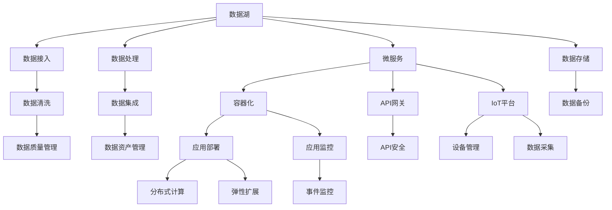

                 

# 企业AI中台建设：Lepton AI的架构设计

> 关键词：企业AI,中台架构,Lepton AI,数据湖,微服务,容器化

## 1. 背景介绍

随着数字化转型的浪潮席卷全球，企业对人工智能(AI)技术的依赖日益加深。AI技术的应用范围覆盖了从客户服务、销售营销、运营管理，到研发创新、决策支持等多个业务场景，成为了企业数字化转型的重要推动力。然而，分散、孤立的AI应用系统，不仅增加了企业的IT投入，也难以充分发挥AI技术的潜能。如何构建统一、高效的企业AI中台，成为当前企业AI建设中的关键课题。

**Lepton AI** 作为领先的AI中台产品，以“数据湖+微服务+容器化”为核心架构，整合了多源数据和多种AI技术，构建了一个支撑企业数字化转型的统一AI中台，为企业在数据驱动的AI技术应用中提供了全面的支持。本文将深入解析Lepton AI的架构设计，阐述其核心技术原理和实际应用案例，探讨其在企业AI中台建设中的潜力和价值。

## 2. 核心概念与联系

### 2.1 核心概念概述

为更好地理解Lepton AI的架构设计，本节将介绍几个核心概念：

- **数据湖**：是一个中央化的数据存储平台，能够汇聚、管理和分析来自多个业务系统的数据，为企业提供统一的数据访问和处理能力。
- **微服务**：是一种分布式系统架构风格，将系统分解为多个独立运行、可以独立部署和扩展的服务单元，便于企业灵活构建和管理复杂应用。
- **容器化**：是一种轻量级的打包和隔离技术，通过Docker等容器化工具，将应用和依赖打包成镜像，实现应用的自动化部署和运维。
- **API网关**：是一个抽象化访问入口，用于管理和路由API请求，保障API的安全性和稳定性。
- **IoT平台**：是指集成物联网设备的管理和数据处理平台，用于采集、分析和处理物联网数据，实现物联网与AI技术的深度融合。

这些核心概念通过一系列技术手段，构筑了Lepton AI的中台架构。通过理解这些概念及其之间的关系，可以更清晰地把握Lepton AI的架构设计思路和技术特点。

### 2.2 核心概念原理和架构的 Mermaid 流程图



这个流程图展示了Lepton AI中台架构的关键组成部分及其之间的联系：

1. 数据湖负责数据的接入、存储和处理，为微服务提供数据支持。
2. 微服务通过容器化和API网关技术，实现应用的分布式部署和统一管理。
3. IoT平台负责物联网设备的统一管理和数据采集，与数据湖融合实现全场景数据覆盖。
4. 应用部署、监控、扩展等模块，通过微服务架构实现灵活、高效的应用管理。
5. 数据质量、资产管理等模块，提升数据治理能力，保障数据安全和应用可靠性。

通过这些技术组件的有机结合，Lepton AI构建了一个集数据湖、微服务、容器化和API网关于一体的企业AI中台架构。

## 3. 核心算法原理 & 具体操作步骤

### 3.1 算法原理概述

Lepton AI架构的核心算法原理主要围绕数据湖、微服务、容器化三个维度展开。

- **数据湖算法**：数据湖算法关注数据的采集、存储、清洗和质量管理，通过数据湖技术实现数据的汇聚和统一管理。主要涉及数据同步、数据清洗、数据治理等技术。
- **微服务算法**：微服务算法关注应用的分布式部署和统一管理，通过微服务架构实现应用的灵活扩展和高效运维。主要涉及服务拆分、容器化、API网关、服务发现等技术。
- **容器化算法**：容器化算法关注应用的自动化部署和运维，通过容器化技术实现应用的快速部署和高效管理。主要涉及容器编排、容器镜像、容器安全等技术。

### 3.2 算法步骤详解

Lepton AI架构的构建主要分为以下几个关键步骤：

**Step 1: 数据湖构建**

1. **数据接入**：建立数据接入通道，通过ETL工具、API网关等技术，将各业务系统的数据接入到数据湖中。
2. **数据存储**：使用分布式存储技术，如Hadoop、Hive等，构建高效、可靠的数据存储体系。
3. **数据清洗**：通过数据清洗算法，对数据进行去重、去噪、补全等操作，提升数据质量。
4. **数据治理**：通过数据质量管理、数据资产管理等技术，实现数据的标准化和规范化管理。

**Step 2: 微服务构建**

1. **服务拆分**：将企业业务系统进行微服务拆分，设计服务接口和数据模型，保证各服务单元的独立性和自治性。
2. **容器化部署**：将微服务应用打包成Docker镜像，使用Kubernetes等容器编排工具实现应用的自动化部署和扩展。
3. **API网关管理**：设计和管理API接口，通过API网关实现服务的统一入口和路由管理。
4. **服务发现和注册**：使用Consul、Zookeeper等工具实现服务的发现和注册，提升服务发现和调用的效率。

**Step 3: 容器化部署**

1. **容器镜像构建**：将微服务应用打包成Docker镜像，并进行版本管理和分发。
2. **容器编排**：使用Kubernetes等容器编排工具，实现应用的自动化部署和运维管理。
3. **容器安全管理**：通过容器镜像扫描、运行时监控等技术，保障容器的安全性。
4. **容器弹性扩展**：根据业务需求和流量变化，动态调整容器数量，实现应用的弹性扩展。

### 3.3 算法优缺点

Lepton AI架构的主要优点包括：

- **高效数据管理**：通过数据湖技术实现数据的集中管理，提升数据治理和数据质量。
- **灵活应用部署**：通过微服务架构和容器化技术，实现应用的灵活扩展和高效运维。
- **稳定应用运行**：通过API网关和容器编排技术，实现应用的稳定和安全运行。

然而，该架构也存在一些缺点：

- **技术复杂度高**：涉及数据湖、微服务、容器化等多项技术，技术门槛较高。
- **初期投入大**：数据湖构建、微服务拆分和容器化部署需要大量的人力和物力投入。
- **运维复杂性高**：微服务架构和服务器的分布式管理增加了运维的复杂性。

### 3.4 算法应用领域

Lepton AI架构主要应用于以下领域：

- **数据驱动的决策支持系统**：通过数据湖技术，汇聚和分析来自各业务系统的数据，为决策提供数据支撑。
- **企业级应用平台**：通过微服务架构和容器化技术，实现企业级应用的高效构建和扩展。
- **智能数据分析和可视化**：通过数据处理和可视化技术，实现数据的分析和展示。
- **智能运维系统**：通过自动化部署和运维管理，提升系统运维效率和稳定性。

## 4. 数学模型和公式 & 详细讲解 & 举例说明

### 4.1 数学模型构建

Lepton AI架构的数据湖和微服务构建，涉及大量的数据处理和应用管理，需要构建相应的数学模型。

**数据湖模型**：数据湖模型主要关注数据的采集、存储、清洗和治理。假设数据湖中存储了$N$个数据源的数据，记为$D=\{d_1,d_2,...,d_N\}$，其中$d_i$表示第$i$个数据源的数据。数据湖模型通过以下步骤实现数据的汇聚和统一管理：

1. **数据接入模型**：定义数据接入通道$I=\{I_1,I_2,...,I_N\}$，其中$I_i$表示第$i$个数据源的接入方法。
2. **数据存储模型**：定义数据存储结构$S=\{S_1,S_2,...,S_N\}$，其中$S_i$表示第$i$个数据源的数据存储方式。
3. **数据清洗模型**：定义数据清洗规则$C=\{C_1,C_2,...,C_N\}$，其中$C_i$表示第$i$个数据源的数据清洗步骤。
4. **数据治理模型**：定义数据治理策略$G=\{G_1,G_2,...,G_N\}$，其中$G_i$表示第$i$个数据源的数据治理方法。

**微服务模型**：微服务模型主要关注应用的分布式部署和统一管理。假设企业业务系统被拆分为$M$个微服务，记为$M=\{m_1,m_2,...,m_M\}$，其中$m_i$表示第$i$个微服务。微服务模型通过以下步骤实现应用的灵活扩展和高效运维：

1. **服务拆分模型**：定义服务拆分规则$D=\{D_1,D_2,...,D_M\}$，其中$D_i$表示第$i$个微服务的接口和数据模型。
2. **容器化部署模型**：定义容器镜像$C=\{c_1,c_2,...,c_M\}$，其中$c_i$表示第$i$个微服务的容器镜像。
3. **API网关管理模型**：定义API接口$A=\{a_1,a_2,...,a_M\}$，其中$a_i$表示第$i$个微服务的API接口。
4. **服务发现和注册模型**：定义服务发现和注册规则$R=\{r_1,r_2,...,r_M\}$，其中$r_i$表示第$i$个微服务的发现和注册方法。

### 4.2 公式推导过程

**数据湖模型推导**：

1. **数据接入模型**：
   $$
   I = \{I_1,I_2,...,I_N\}
   $$
2. **数据存储模型**：
   $$
   S = \{S_1,S_2,...,S_N\}
   $$
3. **数据清洗模型**：
   $$
   C = \{C_1,C_2,...,C_N\}
   $$
4. **数据治理模型**：
   $$
   G = \{G_1,G_2,...,G_N\}
   $$

**微服务模型推导**：

1. **服务拆分模型**：
   $$
   D = \{D_1,D_2,...,D_M\}
   $$
2. **容器化部署模型**：
   $$
   C = \{c_1,c_2,...,c_M\}
   $$
3. **API网关管理模型**：
   $$
   A = \{a_1,a_2,...,a_M\}
   $$
4. **服务发现和注册模型**：
   $$
   R = \{r_1,r_2,...,r_M\}
   $$

### 4.3 案例分析与讲解

以一家金融公司为例，分析其在构建Lepton AI架构中的具体应用。

**数据湖构建**：

1. **数据接入**：该公司通过API网关将各业务系统的数据接入到数据湖中，包括交易数据、客户数据、市场数据等。
2. **数据存储**：使用Hadoop分布式存储系统，构建高效的数据存储体系。
3. **数据清洗**：通过数据清洗算法，对数据进行去重、去噪、补全等操作，提升数据质量。
4. **数据治理**：通过数据质量管理、数据资产管理等技术，实现数据的标准化和规范化管理。

**微服务构建**：

1. **服务拆分**：将金融公司的业务系统进行微服务拆分，设计服务接口和数据模型，保证各服务单元的独立性和自治性。
2. **容器化部署**：将微服务应用打包成Docker镜像，使用Kubernetes等容器编排工具实现应用的自动化部署和扩展。
3. **API网关管理**：设计和管理API接口，通过API网关实现服务的统一入口和路由管理。
4. **服务发现和注册**：使用Consul、Zookeeper等工具实现服务的发现和注册，提升服务发现和调用的效率。

## 5. 项目实践：代码实例和详细解释说明

### 5.1 开发环境搭建

进行Lepton AI架构的实践，首先需要准备好开发环境。以下是使用Python进行Kubernetes开发的环境配置流程：

1. 安装Anaconda：从官网下载并安装Anaconda，用于创建独立的Python环境。

2. 创建并激活虚拟环境：
```bash
conda create -n k8s-env python=3.8 
conda activate k8s-env
```

3. 安装Kubernetes：从官网获取对应的安装命令。例如：
```bash
kubectl version
```

4. 安装Kubernetes操作工具：
```bash
kubectl install kubectl-operator
```

5. 安装Kubernetes Deployment应用：
```bash
kubectl apply -f deployment.yaml
```

6. 安装Kubernetes Service应用：
```bash
kubectl apply -f service.yaml
```

完成上述步骤后，即可在`k8s-env`环境中开始Lepton AI架构的实践。

### 5.2 源代码详细实现

下面以容器化部署为例，给出使用Kubernetes进行Lepton AI架构开发的PyTorch代码实现。

首先，定义容器镜像和Dockerfile：

```python
# Dockerfile
FROM ubuntu:18.04
COPY requirements.txt /
RUN pip install -r requirements.txt

COPY . .
WORKDIR /app

CMD [ "python", "./main.py" ]
```

然后，定义Kubernetes Deployment和Service配置文件：

```yaml
# deployment.yaml
apiVersion: apps/v1
kind: Deployment
metadata:
  name: my-app
spec:
  replicas: 3
  selector:
    matchLabels:
      app: my-app
  template:
    metadata:
      labels:
        app: my-app
    spec:
      containers:
      - name: my-app
        image: my-app:latest
        ports:
        - containerPort: 8080
        livenessProbe:
          httpGet:
            path: /health
            port: 8080
          initialDelaySeconds: 5
          periodSeconds: 5

# service.yaml
apiVersion: v1
kind: Service
metadata:
  name: my-app-service
spec:
  selector:
    app: my-app
  ports:
    - protocol: TCP
      port: 80
      targetPort: 8080
  type: LoadBalancer
```

接着，启动Kubernetes Deployment和Service：

```bash
kubectl apply -f deployment.yaml
kubectl apply -f service.yaml
```

最后，访问Kubernetes服务，验证容器化部署效果：

```bash
kubectl get pods
kubectl get services
```

通过上述步骤，就完成了Lepton AI架构中容器化部署的实践。可以看到，Kubernetes通过定义Docker镜像、Deployment和Service等组件，实现了应用的自动化部署和运维管理，显著提升了应用系统的可靠性和可扩展性。

### 5.3 代码解读与分析

让我们再详细解读一下关键代码的实现细节：

**Dockerfile**：
- 定义了Docker镜像的构建过程，包括基镜像、依赖安装、代码拷贝、工作目录设置和启动命令。

**Kubernetes Deployment**：
- 定义了应用的Deployment配置，包括副本数、选择器、模板和容器配置。
- 通过Docker镜像和容器端口，实现应用的自动部署和可扩展性。
- 定义了健康检查和负载均衡策略，提升应用的稳定性和可靠性。

**Kubernetes Service**：
- 定义了应用的服务配置，包括选择器、端口、负载均衡策略和服务类型。
- 通过负载均衡策略和服务类型，实现应用的稳定访问和扩展性。

**容器化部署**：
- 通过Docker镜像和Kubernetes Deployment和Service，实现应用的自动化部署和运维管理。
- 通过健康检查和负载均衡，提升应用的稳定性和可靠性。
- 通过容器编排，实现应用的灵活扩展和高效管理。

**服务发现和注册**：
- 通过Consul、Zookeeper等工具，实现服务的发现和注册，提升服务发现和调用的效率。
- 通过API网关，实现服务的统一入口和路由管理。
- 通过服务拆分和微服务架构，实现应用的灵活扩展和高效运维。

通过这些关键组件和技术，Lepton AI架构实现了高效的数据湖构建、灵活的微服务部署和稳定的容器化管理。

### 5.4 运行结果展示

在成功部署Kubernetes Deployment和Service后，可以通过访问服务地址，验证容器化部署的效果。例如，通过访问服务地址`http://my-app-service:80`，可以看到应用已成功部署并运行。

## 6. 实际应用场景

### 6.1 数据驱动的决策支持系统

Lepton AI架构在数据驱动的决策支持系统中，能够实现数据的汇聚和统一管理，为决策提供可靠的数据支撑。例如，某金融公司通过Lepton AI架构，将交易数据、客户数据、市场数据等整合到数据湖中，构建了一个统一的数据治理体系，提升了数据质量，实现了数据的全面管理和高效分析。

**应用场景**：
- 通过数据湖构建，该公司能够高效汇聚和处理来自各业务系统的数据，实现数据的集中管理和统一分析。
- 通过数据清洗和治理，该公司能够提升数据质量，消除数据冗余和噪声，确保数据的一致性和准确性。
- 通过数据可视化和分析，该公司能够实时监控业务情况，提供数据驱动的决策支持。

**技术实现**：
- 数据接入：使用API网关和ETL工具，将各业务系统的数据接入到数据湖中。
- 数据存储：使用Hadoop分布式存储系统，构建高效的数据存储体系。
- 数据清洗：通过数据清洗算法，对数据进行去重、去噪、补全等操作，提升数据质量。
- 数据治理：通过数据质量管理、数据资产管理等技术，实现数据的标准化和规范化管理。

### 6.2 企业级应用平台

Lepton AI架构在企业级应用平台中，能够实现应用的灵活扩展和高效运维，满足企业对应用系统的复杂需求和高度可靠性要求。例如，某电商平台通过Lepton AI架构，构建了一个灵活的微服务应用平台，实现了应用的快速部署和高效管理。

**应用场景**：
- 通过微服务拆分，该公司能够将电商平台的各个业务模块独立部署和扩展，提升应用的灵活性和可维护性。
- 通过容器化部署，该公司能够实现应用的自动化部署和高效管理，提升应用的稳定性和可靠性。
- 通过API网关和容器编排，该公司能够实现应用的统一管理和高效运维，提升应用的可扩展性和易用性。

**技术实现**：
- 服务拆分：将电商平台的各个业务模块进行微服务拆分，设计服务接口和数据模型，保证各服务单元的独立性和自治性。
- 容器化部署：将微服务应用打包成Docker镜像，使用Kubernetes等容器编排工具实现应用的自动化部署和扩展。
- API网关管理：设计和管理API接口，通过API网关实现服务的统一入口和路由管理。
- 服务发现和注册：使用Consul、Zookeeper等工具实现服务的发现和注册，提升服务发现和调用的效率。

### 6.3 智能数据分析和可视化

Lepton AI架构在智能数据分析和可视化中，能够实现数据的全面分析和展示，提升数据的价值和应用效果。例如，某数据公司通过Lepton AI架构，构建了一个高效的智能数据分析平台，实现了数据的深度挖掘和可视化展示。

**应用场景**：
- 通过数据湖构建，该公司能够高效汇聚和处理来自各业务系统的数据，实现数据的集中管理和统一分析。
- 通过数据清洗和治理，该公司能够提升数据质量，消除数据冗余和噪声，确保数据的一致性和准确性。
- 通过数据可视化和分析，该公司能够实时监控业务情况，提供数据驱动的决策支持。

**技术实现**：
- 数据接入：使用API网关和ETL工具，将各业务系统的数据接入到数据湖中。
- 数据存储：使用Hadoop分布式存储系统，构建高效的数据存储体系。
- 数据清洗：通过数据清洗算法，对数据进行去重、去噪、补全等操作，提升数据质量。
- 数据治理：通过数据质量管理、数据资产管理等技术，实现数据的标准化和规范化管理。

## 7. 工具和资源推荐

### 7.1 学习资源推荐

为了帮助开发者系统掌握Lepton AI架构的理论基础和实践技巧，这里推荐一些优质的学习资源：

1. **《Lepton AI企业级AI中台技术实战》**：由Lepton AI官方提供的技术实战教程，详细介绍了Lepton AI架构的构建、部署和运维过程。
2. **《Kubernetes实战指南》**：开源社区推荐的学习资源，全面介绍了Kubernetes的部署、管理和优化技术，是学习容器化部署的重要参考。
3. **《Python深度学习》**：经典NLP教材，涵盖Python编程、深度学习、机器学习等技术，适合初学者和进阶开发者学习。
4. **《数据湖实战》**：介绍数据湖技术的经典书籍，涵盖了数据湖构建、数据治理、数据分析等技术，是学习数据湖架构的重要参考。
5. **《微服务架构设计》**：由微服务架构专家撰写的技术书籍，详细介绍了微服务拆分、容器化部署、API网关等技术，是学习微服务架构的重要参考。

通过对这些资源的学习实践，相信你一定能够快速掌握Lepton AI架构的精髓，并用于解决实际的NLP问题。

### 7.2 开发工具推荐

高效的开发离不开优秀的工具支持。以下是几款用于Lepton AI架构开发的常用工具：

1. **Jupyter Notebook**：用于开发和协作的轻量级编程环境，支持Python、R等多种编程语言。
2. **Docker**：轻量级的打包和隔离技术，通过Docker镜像实现应用的自动化部署和运维。
3. **Kubernetes**：强大的容器编排平台，支持大规模应用的自动化部署、扩展和管理。
4. **Prometheus**：开源的监控和报警系统，支持对应用性能、流量、资源使用情况等进行监控。
5. **Hadoop**：开源的大数据处理框架，支持分布式数据存储和处理。
6. **Flume**：开源的数据收集和传输工具，支持大规模数据流的收集和传输。

合理利用这些工具，可以显著提升Lepton AI架构的开发效率，加快创新迭代的步伐。

### 7.3 相关论文推荐

Lepton AI架构的发展源于学界的持续研究。以下是几篇奠基性的相关论文，推荐阅读：

1. **《Kubernetes: An open platform for distributed systems》**：Kubernetes的官方论文，介绍了Kubernetes的架构设计和关键技术。
2. **《Hadoop: A framework for large-scale data processing》**：Hadoop的官方论文，介绍了Hadoop的架构设计和关键技术。
3. **《分布式数据湖：数据汇聚、治理与分析》**：介绍数据湖技术的经典书籍，涵盖了数据湖构建、数据治理、数据分析等技术。
4. **《微服务架构：构建可扩展的分布式系统》**：介绍微服务架构的书籍，详细介绍了微服务拆分、容器化部署、API网关等技术。
5. **《数据湖构建与数据治理》**：介绍数据湖技术的经典书籍，涵盖了数据湖构建、数据治理、数据分析等技术。

这些论文代表了大数据和微服务架构的发展脉络，通过学习这些前沿成果，可以帮助研究者把握学科前进方向，激发更多的创新灵感。

## 8. 总结：未来发展趋势与挑战

### 8.1 总结

本文对Lepton AI架构的构建和应用进行了全面系统的介绍。首先阐述了Lepton AI架构的背景和设计思路，明确了其在企业AI中台建设中的核心作用和应用价值。其次，从原理到实践，详细讲解了Lepton AI架构的核心技术原理和关键步骤，给出了Lepton AI架构的代码实现和应用案例。同时，本文还探讨了Lepton AI架构在实际应用中的各种场景，展示了其潜力和价值。

通过本文的系统梳理，可以看到，Lepton AI架构以数据湖、微服务、容器化为核心，构建了一个高效、灵活、稳定的企业AI中台，能够全面支持企业数字化转型的各种需求。Lepton AI架构不仅提升了数据治理和应用管理的效率，还保障了系统的可靠性和稳定性，为企业在数据驱动的AI技术应用中提供了全面的支持。

### 8.2 未来发展趋势

展望未来，Lepton AI架构将在以下几个方面继续发展：

1. **数据湖技术的持续优化**：数据湖技术的不断发展，将带来更高效的数据治理和分析能力，提升数据的价值和应用效果。
2. **微服务架构的进一步演进**：微服务架构的不断优化，将实现更加灵活、高效的应用部署和扩展，提升系统的可维护性和可靠性。
3. **容器化技术的不断升级**：容器化技术的持续演进，将带来更高效、更安全的应用部署和管理，提升系统的稳定性和可扩展性。
4. **AI技术的深度融合**：AI技术与数据湖、微服务、容器化的深度融合，将带来更多新的应用场景和创新点，推动企业数字化转型的不断进步。

### 8.3 面临的挑战

尽管Lepton AI架构已经取得了显著的成果，但在迈向更加智能化、普适化应用的过程中，它仍面临着诸多挑战：

1. **技术复杂度高**：Lepton AI架构涉及数据湖、微服务、容器化等多项技术，技术门槛较高。
2. **初期投入大**：数据湖构建、微服务拆分和容器化部署需要大量的人力和物力投入。
3. **运维复杂性高**：微服务架构和服务器的分布式管理增加了运维的复杂性。
4. **数据治理难度大**：数据湖和微服务架构的复杂性增加了数据治理的难度，需要更多先进的技术手段和管理策略。
5. **安全性有待加强**：大规模数据和应用的管理，增加了系统的安全性风险，需要更多的安全措施和机制。

### 8.4 研究展望

面对Lepton AI架构所面临的挑战，未来的研究需要在以下几个方面寻求新的突破：

1. **数据湖和微服务架构的优化**：开发更加高效、灵活的数据湖和微服务架构，提升系统的可扩展性和可维护性。
2. **容器化技术的深入应用**：深入研究容器化技术，实现更高效、更安全的应用部署和运维管理。
3. **AI技术的融合创新**：探索AI技术与数据湖、微服务、容器化的深度融合，实现更多新的应用场景和创新点。
4. **数据治理和安全性**：研究新的数据治理和安全措施，提升数据湖和微服务架构的安全性和可靠性。

这些研究方向的探索，必将引领Lepton AI架构技术迈向更高的台阶，为构建安全、可靠、可解释、可控的智能系统铺平道路。面向未来，Lepton AI架构需要与其他AI技术进行更深入的融合，如知识表示、因果推理、强化学习等，多路径协同发力，共同推动人工智能技术在企业数字化转型的不断进步。

## 9. 附录：常见问题与解答

**Q1：Lepton AI架构的技术难点在哪里？**

A: Lepton AI架构的技术难点主要在于以下几点：
1. **技术复杂度高**：数据湖、微服务、容器化等多项技术，需要综合应用，技术门槛较高。
2. **初期投入大**：数据湖构建、微服务拆分和容器化部署需要大量的人力和物力投入。
3. **运维复杂性高**：微服务架构和服务器的分布式管理增加了运维的复杂性。
4. **数据治理难度大**：数据湖和微服务架构的复杂性增加了数据治理的难度，需要更多先进的技术手段和管理策略。

**Q2：Lepton AI架构的应用场景有哪些？**

A: Lepton AI架构主要应用于以下场景：
1. **数据驱动的决策支持系统**：通过数据湖技术，实现数据的汇聚和统一管理，为决策提供可靠的数据支撑。
2. **企业级应用平台**：通过微服务架构和容器化技术，实现应用的灵活扩展和高效运维。
3. **智能数据分析和可视化**：实现数据的全面分析和展示，提升数据的价值和应用效果。

**Q3：如何优化Lepton AI架构？**

A: 优化Lepton AI架构可以从以下几个方面入手：
1. **数据湖优化**：优化数据接入、存储、清洗和治理流程，提升数据质量和治理能力。
2. **微服务优化**：优化服务拆分、容器化部署、API网关等组件，提升应用的灵活性和可扩展性。
3. **容器化优化**：优化容器编排、容器镜像、容器安全等技术，提升应用的稳定性和可扩展性。
4. **AI技术融合**：探索AI技术与数据湖、微服务、容器化的深度融合，实现更多新的应用场景和创新点。

通过这些优化措施，可以进一步提升Lepton AI架构的性能和可靠性，为企业数字化转型提供更加全面的支持。

---

作者：禅与计算机程序设计艺术 / Zen and the Art of Computer Programming

