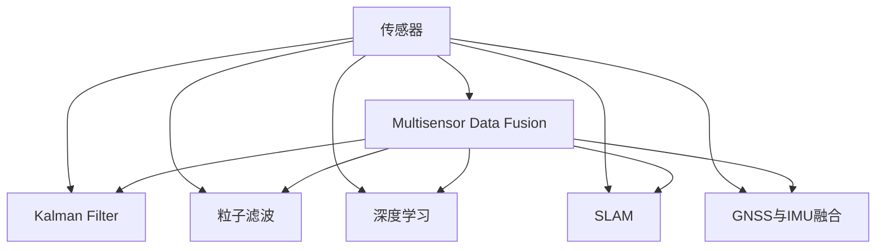

                 

# 传感器融合：获取准确的数据

## 1. 背景介绍

### 1.1 问题由来

随着物联网(IoT)技术的普及，传感器在多个行业得到了广泛应用，从智能家居、工业制造到医疗健康、交通运输等领域，传感器正在实时地采集大量的数据，以便辅助决策。然而，单个传感器往往存在感知范围、精度、响应速度等方面的限制，单一传感器无法全面覆盖场景中的各类需求。传感器融合（Sensor Fusion）应运而生，通过整合多个传感器的数据，取长补短，实现更高的数据完整性和精度，使应用系统能更准确地做出判断和决策。

传感器融合技术不仅能够提高数据的准确性，还能够显著降低系统的成本，延长传感器的使用寿命，增强系统的鲁棒性和可靠性。近年来，随着技术的进步和硬件设备的普及，传感器融合在自动驾驶、机器人、导航系统、军事侦察等领域中得到了广泛应用。

### 1.2 问题核心关键点

传感器融合的核心在于将多个传感器的数据进行综合，以获得更为准确、全面的信息。核心技术包括：

- Kalman滤波（Kalman Filter）：线性最小方差估计方法，广泛应用于传感器数据融合。
- 粒子滤波（Particle Filter）：一种基于概率的非线性滤波技术，适用于复杂系统的高精度数据融合。
- 深度学习（Deep Learning）：结合神经网络模型，对多源数据进行特征提取和融合，提升融合效果。
- SLAM（Simultaneous Localization and Mapping）：同步定位与映射技术，将传感器数据融合用于机器人定位与环境建模。
- GNSS与IMU融合：全球导航卫星系统（GNSS）与惯性测量单元（IMU）的融合，提升定位精度。

这些技术在各自的领域中都有着重要的应用，但如何将它们有效地融合在一起，是当前传感器融合研究的重点和难点。

## 2. 核心概念与联系

### 2.1 核心概念概述

为更好地理解传感器融合的基本原理和关键技术，本节将介绍几个核心概念：

- 传感器（Sensor）：能够感知物理世界的设备和组件，例如温度传感器、压力传感器、光线传感器等。
- 多传感器数据融合（Multisensor Data Fusion）：将多个传感器采集到的数据进行综合处理，提升整体感知能力。
- Kalman滤波：一种基于线性系统模型的估计方法，用于消除传感器噪声，提升数据精度。
- 粒子滤波：一种基于概率统计的非线性滤波技术，能够处理复杂、非线性的传感器数据。
- 深度学习：结合神经网络模型对传感器数据进行特征提取和融合，适用于复杂的感知任务。
- SLAM：同步定位与映射技术，结合传感器数据实现机器人的自主定位与环境建模。
- GNSS与IMU融合：将全球导航卫星系统与惯性测量单元融合，提升定位精度。

这些核心概念之间的关系可以通过以下Mermaid流程图来展示：



这个流程图展示了大语言模型的核心概念及其之间的关系：

1. 传感器用于感知物理世界，获取原始数据。
2. 多传感器数据融合将多个传感器的数据进行综合处理。
3. Kalman滤波、粒子滤波、深度学习等技术用于提升融合效果。
4. SLAM、GNSS与IMU融合等技术进一步强化数据精度和定位能力。

## 3. 核心算法原理 & 具体操作步骤

### 3.1 算法原理概述

传感器融合的本质是一种信息集成过程，通过综合处理多个传感器的数据，以获得更为准确、全面的感知结果。算法原理主要包括：

- Kalman滤波：利用线性系统的状态模型和观测模型，通过迭代更新状态估计值和协方差矩阵，消除传感器噪声，提升数据精度。
- 粒子滤波：基于概率统计的方法，通过采样和重采样，处理非线性的数据融合问题，适用于复杂的感知任务。
- 深度学习：结合神经网络模型，对传感器数据进行特征提取和融合，提升融合效果。

### 3.2 算法步骤详解

#### 3.2.1 Kalman滤波

Kalman滤波的步骤如下：

1. 初始化：给定初始状态向量 $x_0$ 和初始协方差矩阵 $P_0$，以及初始观测值 $y_1$。
2. 预测：根据系统模型，预测下一个状态的估计值 $\hat{x}_{k|k-1}$ 和协方差矩阵 $\hat{P}_{k|k-1}$。
3. 更新：根据观测值 $y_k$，更新状态估计值 $\hat{x}_{k|k}$ 和协方差矩阵 $P_{k|k}$。
4. 迭代：重复第2、3步，直至获取最终的状态估计值 $\hat{x}_k$ 和协方差矩阵 $P_k$。

Kalman滤波的核心公式如下：

$$
\begin{align*}
\hat{x}_{k|k-1} &= A\hat{x}_{k-1|k-1} + B u_{k-1} \\
\hat{P}_{k|k-1} &= A P_{k-1|k-1} A^T + Q_k \\
S_k &= H\hat{x}_{k|k-1} + R_k \\
K_k &= \hat{P}_{k|k-1} H^T S_k^{-1} \\
\hat{x}_{k|k} &= \hat{x}_{k|k-1} + K_k (y_k - H \hat{x}_{k|k-1}) \\
P_{k|k} &= (I - K_k H) P_{k|k-1}
\end{align*}
$$

其中，$A$ 和 $B$ 为系统模型矩阵，$u_k$ 为系统噪声，$H$ 为观测模型矩阵，$R_k$ 为观测噪声，$Q_k$ 为过程噪声，$S_k$ 为观测值误差协方差，$K_k$ 为滤波增益矩阵。

#### 3.2.2 粒子滤波

粒子滤波的步骤如下：

1. 初始化：设定先验概率密度函数 $p(x_{k|k-1})$ 和粒子数目 $N$，初始化粒子集 $X_{0|k-1} = \{x_0, x_0, ..., x_0\}$。
2. 采样：对每个粒子 $x_{i|k-1}$，计算其权重 $w_{i|k-1}$。
3. 重采样：根据权重分布，选择新的粒子集 $X_{k|k-1} = \{x_1, x_2, ..., x_N\}$。
4. 迭代：重复第2、3步，直至获取最终的状态估计值 $\hat{x}_k$。

粒子滤波的核心公式如下：

$$
\begin{align*}
w_{i|k-1} &= p(z_k|x_{i|k-1}) \\
X_{k|k-1} &= \{z_{1|k-1}, z_{2|k-1}, ..., z_{N|k-1}\} \\
\hat{x}_k &= \frac{1}{N} \sum_{i=1}^N w_{i|k-1} x_{i|k-1} \\
\hat{P}_k &= \frac{1}{N} \sum_{i=1}^N w_{i|k-1} (x_{i|k-1} - \hat{x}_k) (x_{i|k-1} - \hat{x}_k)^T
\end{align*}
$$

其中，$w_{i|k-1}$ 为粒子的权重，$X_{k|k-1}$ 为新的粒子集，$\hat{x}_k$ 为状态估计值，$\hat{P}_k$ 为状态估计误差协方差。

#### 3.2.3 深度学习

深度学习用于对传感器数据进行特征提取和融合，提升融合效果。常用的深度学习模型包括卷积神经网络（CNN）、循环神经网络（RNN）和长短期记忆网络（LSTM）等。

深度学习融合传感器数据的步骤如下：

1. 数据预处理：对传感器数据进行归一化、降噪等处理。
2. 特征提取：通过卷积、池化等操作，提取传感器数据的局部特征。
3. 融合：将提取的特征进行合并，生成新的特征向量。
4. 预测：使用深度学习模型，对融合后的特征进行预测，得到最终的感知结果。

### 3.3 算法优缺点

传感器融合技术具有以下优点：

1. 提升数据准确性：通过综合处理多个传感器的数据，可以消除单一传感器的局限性，提升整体感知能力。
2. 降低系统成本：通过融合多个低成本传感器，减少系统成本。
3. 提高系统鲁棒性：通过多重传感器数据的融合，提升系统的鲁棒性和可靠性。

同时，传感器融合技术也存在以下缺点：

1. 计算复杂度高：传感器数据量大、类型多，融合过程计算复杂度较高。
2. 算法复杂度高：Kalman滤波和粒子滤波算法相对复杂，需要较高的技术门槛。
3. 数据更新频率高：需要实时更新传感器数据，对系统的实时性要求高。

尽管存在这些局限性，传感器融合技术仍在大规模应用中发挥着重要作用，尤其在自动驾驶、机器人导航、定位系统等领域中，传感器融合是不可或缺的一部分。

### 3.4 算法应用领域

传感器融合技术广泛应用于以下领域：

- 自动驾驶：通过融合激光雷达、摄像头、IMU等多源数据，实现实时环境感知，提升驾驶安全性。
- 机器人导航：结合IMU、GPS、激光雷达等传感器，实现机器人的精准定位和环境建模。
- 定位系统：融合GNSS和IMU数据，实现室内外高精度的实时定位。
- 工业制造：通过传感器数据融合，实时监控生产过程，提升产品质量和生产效率。
- 医疗设备：融合多种传感器数据，实时监测患者健康状况，提升诊断准确性。

## 4. 数学模型和公式 & 详细讲解

### 4.1 数学模型构建

传感器融合的数学模型主要包括以下几个部分：

1. 传感器模型：描述传感器如何获取数据。
2. 状态模型：描述系统状态的变化。
3. 观测模型：描述传感器数据与系统状态的关系。

### 4.2 公式推导过程

以Kalman滤波为例，推导其在传感器融合中的应用。

假设传感器数据为 $z_k$，系统状态为 $x_k$，系统噪声为 $u_k$，过程噪声为 $Q_k$，观测噪声为 $R_k$，观测模型为 $H$，系统模型为 $A$，初始状态为 $x_0$，初始协方差为 $P_0$。

根据Kalman滤波公式，系统状态的预测和更新公式如下：

$$
\begin{align*}
\hat{x}_{k|k-1} &= A\hat{x}_{k-1|k-1} + B u_{k-1} \\
S_k &= H\hat{x}_{k|k-1} + R_k \\
K_k &= \hat{P}_{k|k-1} H^T S_k^{-1} \\
\hat{x}_{k|k} &= \hat{x}_{k|k-1} + K_k (z_k - H \hat{x}_{k|k-1}) \\
P_{k|k} &= (I - K_k H) P_{k|k-1}
\end{align*}
$$

其中，$\hat{x}_{k|k}$ 为状态估计值，$\hat{P}_{k|k}$ 为状态估计误差协方差。

### 4.3 案例分析与讲解

以自动驾驶系统为例，分析传感器融合的应用。

假设自动驾驶系统需要融合激光雷达、摄像头、IMU等传感器数据，实时感知周围环境，做出安全驾驶决策。系统状态包括车辆的位置、速度、姿态等，传感器模型包括激光雷达的激光点云数据、摄像头的图像数据、IMU的加速度和角速度数据等。通过状态模型和观测模型，将传感器数据转换为系统状态，并结合Kalman滤波等算法进行数据融合，最终输出车辆的位置和导航信息。

## 5. 项目实践：代码实例和详细解释说明

### 5.1 开发环境搭建

在进行传感器融合项目开发前，需要先搭建好开发环境。以下是使用Python进行Kalman滤波实现的开发环境配置流程：

1. 安装Python：从官网下载并安装Python，建议使用Anaconda，便于管理依赖库。

2. 创建虚拟环境：
```bash
conda create -n fusion-env python=3.7
conda activate fusion-env
```

3. 安装必要的依赖库：
```bash
pip install numpy scipy matplotlib sklearn
```

完成上述步骤后，即可在`fusion-env`环境中进行传感器融合项目的开发。

### 5.2 源代码详细实现

以下是使用Python实现Kalman滤波的示例代码：

```python
import numpy as np
import scipy.linalg

class KalmanFilter:
    def __init__(self, A, B, H, Q, R, x0, P0):
        self.A = A
        self.B = B
        self.H = H
        self.Q = Q
        self.R = R
        self.x = np.zeros_like(x0)
        self.P = P0
        self.x[0] = x0
        self.P = P0
        
    def predict(self, u):
        self.x = self.A @ self.x + self.B @ u
        self.P = self.A @ self.P @ self.A.T + self.Q
        
    def update(self, z):
        y = z - self.H @ self.x
        S = self.H @ self.P @ self.H.T + self.R
        K = self.P @ self.H.T @ scipy.linalg.inv(S)
        self.x = self.x + K @ y
        self.P = (np.eye(len(self.x)) - K @ self.H) @ self.P
        
    def estimate(self, z):
        self.predict(u)
        self.update(z)
        return self.x, self.P
```

在这个示例中，我们使用KalmanFilter类实现Kalman滤波算法。类中包含了一些关键的成员变量，如状态转移矩阵、观测矩阵、噪声协方差矩阵、初始状态和协方差矩阵等。KalmanFilter类还包含三个主要的方法：

1. `predict`方法：根据系统模型和过程噪声，进行状态的预测。
2. `update`方法：根据观测值和观测噪声，进行状态更新。
3. `estimate`方法：结合预测和更新过程，进行状态估计。

### 5.3 代码解读与分析

Kalman滤波的代码实现相对简洁，主要包括以下几个步骤：

1. 初始化：根据给定的系统模型、观测模型、噪声协方差等参数，初始化状态和协方差矩阵。
2. 预测：根据系统模型和过程噪声，进行状态的预测。
3. 更新：根据观测值和观测噪声，进行状态更新。
4. 估计：结合预测和更新过程，进行状态估计。

Kalman滤波的核心在于利用状态模型和观测模型，通过迭代更新状态估计值和协方差矩阵，消除传感器噪声，提升数据精度。

## 6. 实际应用场景

### 6.1 智能驾驶

智能驾驶系统需要融合多个传感器数据，如激光雷达、摄像头、IMU等，实现实时环境感知和路径规划。通过Kalman滤波等算法，系统可以实时更新车辆的状态信息，提升驾驶安全性。

### 6.2 无人机导航

无人机导航系统需要融合GPS、IMU、激光雷达等多源数据，实现精准的定位和避障。通过传感器融合技术，系统可以在复杂环境中进行稳定的导航和控制。

### 6.3 智能家居

智能家居系统需要融合温度、湿度、烟雾等传感器数据，实现环境的实时监控和调节。通过传感器融合技术，系统可以实时监测环境变化，提升居住体验。

### 6.4 工业制造

工业制造系统需要融合传感器数据，实时监控生产过程，提升产品质量和生产效率。通过传感器融合技术，系统可以及时发现异常，进行预警和干预。

### 6.5 医疗设备

医疗设备需要融合多种传感器数据，实时监测患者的健康状况。通过传感器融合技术，系统可以及时发现异常，提供及时的医疗干预。

## 7. 工具和资源推荐

### 7.1 学习资源推荐

为了帮助开发者系统掌握传感器融合的理论基础和实践技巧，这里推荐一些优质的学习资源：

1. 《传感器融合与多目标跟踪》书籍：介绍了传感器融合的基本概念和算法，涵盖了Kalman滤波、粒子滤波等多种技术。
2. 《深度学习与传感器融合》课程：由斯坦福大学开设，介绍了深度学习在传感器融合中的应用。
3. Udacity的《自动驾驶》课程：详细介绍了传感器融合在自动驾驶中的应用。
4. IEEE Xplore的传感器融合相关论文：包含大量传感器融合技术的经典论文，是深入学习的理想资源。
5. ROS（Robot Operating System）传感器融合相关教程：提供了传感器融合在机器人领域的应用教程。

通过对这些资源的学习实践，相信你一定能够快速掌握传感器融合的精髓，并用于解决实际的感知问题。

### 7.2 开发工具推荐

高效的开发离不开优秀的工具支持。以下是几款用于传感器融合开发的常用工具：

1. Python：广泛使用的高级编程语言，具有丰富的数学库和可视化工具，适合传感器融合等算法实现。
2. MATLAB：强大的工程计算软件，包含丰富的信号处理和控制工具，适合信号处理和仿真。
3. ROS：机器人操作系统，包含丰富的传感器和算法库，适合机器人领域的传感器融合开发。
4. OpenCV：开源计算机视觉库，包含多种图像处理和特征提取算法，适合视觉传感器数据处理。
5. TensorFlow：开源深度学习框架，支持深度学习在传感器融合中的应用。

合理利用这些工具，可以显著提升传感器融合任务的开发效率，加快创新迭代的步伐。

### 7.3 相关论文推荐

传感器融合技术的发展离不开学界的持续研究。以下是几篇奠基性的相关论文，推荐阅读：

1. 《A survey of Kalman filtering methods for sensor fusion》：介绍了Kalman滤波在传感器融合中的应用，适合入门学习。
2. 《Particle filtering》：介绍了粒子滤波的原理和应用，适合深入学习。
3. 《Fusion of multiple sensor data for improved vehicle control and safety》：介绍了多传感器数据融合在车辆控制中的应用，适合实际应用。
4. 《Vision-based Navigation for Unmanned Vehicles》：介绍了视觉传感器在无人驾驶中的应用，适合参考学习。
5. 《Sensor Fusion for Real-Time Human Pose Estimation》：介绍了传感器融合在人体姿态估计中的应用，适合应用学习。

这些论文代表了大语言模型微调技术的发展脉络。通过学习这些前沿成果，可以帮助研究者把握学科前进方向，激发更多的创新灵感。

## 8. 总结：未来发展趋势与挑战

### 8.1 研究成果总结

本文对传感器融合的基本概念和算法进行了系统介绍，详细讲解了Kalman滤波、粒子滤波、深度学习等核心技术，并给出了实际应用场景的代码实现。通过学习本文，读者可以全面了解传感器融合的基本原理和实现方法。

### 8.2 未来发展趋势

传感器融合技术将在未来继续发展，呈现以下几个趋势：

1. 多源数据融合：融合更多类型、更多维度的传感器数据，提升系统感知能力。
2. 融合算法优化：进一步优化Kalman滤波、粒子滤波等算法，提升数据融合效果。
3. 深度学习融合：结合深度学习模型，提升传感器数据的特征提取和融合效果。
4. 实时性提升：提升传感器数据的实时处理能力，满足实时应用的需求。
5. 边缘计算：将数据融合任务从中心服务器迁移到边缘设备，提升系统的响应速度和鲁棒性。

### 8.3 面临的挑战

尽管传感器融合技术已经取得了重要进展，但在实际应用中仍面临一些挑战：

1. 数据量大：传感器数据量大、类型多，处理和融合过程复杂。
2. 算法复杂：Kalman滤波和粒子滤波算法相对复杂，需要较高的技术门槛。
3. 实时性要求高：系统需要实时处理传感器数据，对系统的实时性要求高。
4. 算法鲁棒性差：传感器数据往往存在噪声和干扰，算法鲁棒性不足。

尽管存在这些挑战，传感器融合技术仍在大规模应用中发挥着重要作用，尤其在自动驾驶、机器人导航、定位系统等领域中，传感器融合是不可或缺的一部分。

### 8.4 研究展望

未来的传感器融合研究可以从以下几个方向寻求突破：

1. 多源数据融合：融合更多类型、更多维度的传感器数据，提升系统感知能力。
2. 融合算法优化：进一步优化Kalman滤波、粒子滤波等算法，提升数据融合效果。
3. 深度学习融合：结合深度学习模型，提升传感器数据的特征提取和融合效果。
4. 实时性提升：提升传感器数据的实时处理能力，满足实时应用的需求。
5. 边缘计算：将数据融合任务从中心服务器迁移到边缘设备，提升系统的响应速度和鲁棒性。

这些研究方向将推动传感器融合技术不断进步，提升系统的感知能力，拓展应用范围，为智能设备和系统的普及做出更大贡献。

## 9. 附录：常见问题与解答

**Q1: 传感器融合与多传感器数据融合有什么区别？**

A: 传感器融合是指将多个传感器的数据进行综合处理，以提升系统的感知能力和鲁棒性。而多传感器数据融合是传感器融合的一个具体实现方式，通常指的是通过数学方法，将多个传感器采集的数据进行综合处理，以提升整体感知能力。

**Q2: 传感器融合中常用的算法有哪些？**

A: 传感器融合中常用的算法包括Kalman滤波、粒子滤波、深度学习等。Kalman滤波是一种线性最小方差估计方法，适用于线性系统；粒子滤波是一种基于概率统计的方法，适用于非线性系统；深度学习则通过神经网络模型，对传感器数据进行特征提取和融合，适用于复杂的感知任务。

**Q3: 传感器融合与信号处理有什么区别？**

A: 传感器融合是指将多个传感器的数据进行综合处理，以提升系统的感知能力和鲁棒性。而信号处理则是指对信号进行采集、滤波、调制等处理，以提高信号的质量和可靠性。虽然两者都涉及到数据的处理和优化，但主要的应用场景和处理目标不同。

**Q4: 传感器融合有哪些应用场景？**

A: 传感器融合技术在多个领域中都有广泛应用，如自动驾驶、无人机导航、智能家居、工业制造、医疗设备等。通过融合多个传感器的数据，可以提升系统的感知能力，满足实际应用的需求。

**Q5: 传感器融合中需要注意哪些问题？**

A: 传感器融合中需要注意以下几个问题：

1. 数据质量：传感器数据往往存在噪声和干扰，需要对其进行预处理和降噪。
2. 算法复杂性：传感器融合算法相对复杂，需要较高的技术门槛。
3. 实时性：系统需要实时处理传感器数据，对系统的实时性要求高。
4. 鲁棒性：传感器数据往往存在误差和干扰，算法鲁棒性不足。

传感器融合技术需要在数据处理、算法优化和实时性等方面进行全面考虑，才能充分发挥其优势，满足实际应用的需求。

---

作者：禅与计算机程序设计艺术 / Zen and the Art of Computer Programming

