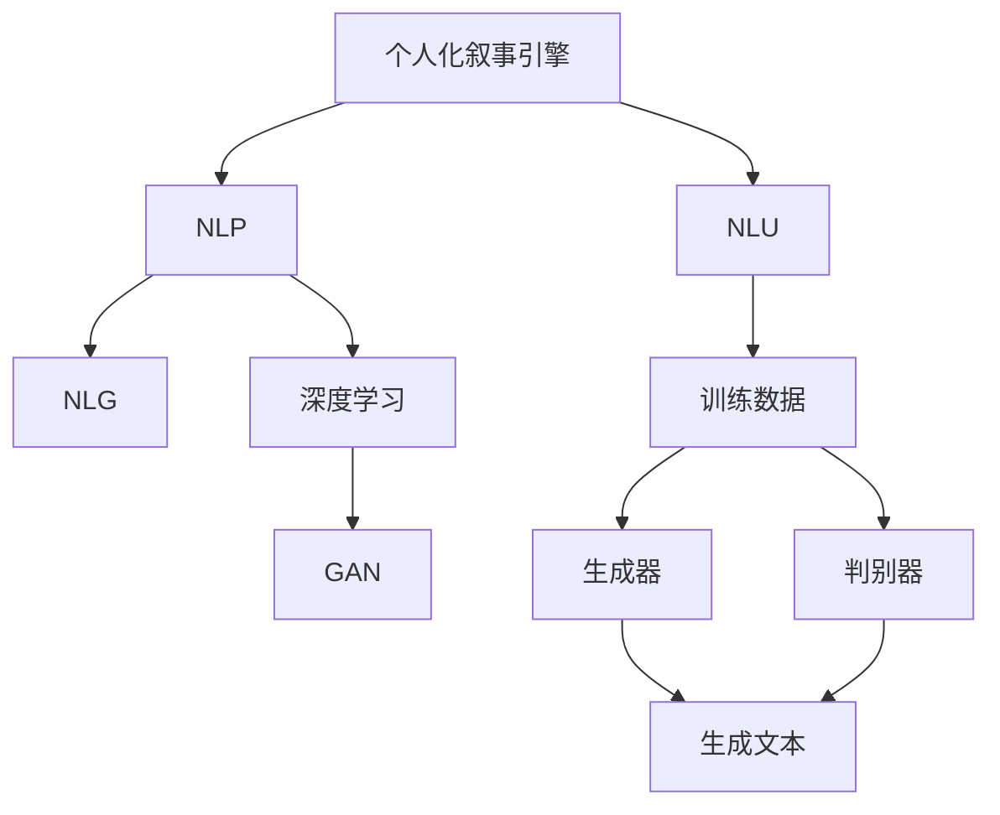

                 

# 体验个人化叙事引擎：AI驱动的生活故事生成

> 关键词：个人化叙事引擎, 人工智能, 故事生成, 自然语言处理(NLP), 深度学习, 生成对抗网络(GAN), 自然语言理解, 自然语言生成(NLG)

## 1. 背景介绍

### 1.1 问题由来

近年来，随着人工智能技术在各个领域的广泛应用，人们的生产生活方式正在发生深刻变化。然而，尽管AI可以处理大量数据和复杂任务，但在与人类自然交互方面，仍然存在一定不足。人类拥有丰富的情感、经历和认知能力，AI在这些方面显得相对单一。这使得AI与人类之间的对话和交互，常常缺乏真实的情感共鸣和个性化的表达。

与此同时，随着数字技术的发展，人们拥有更多机会记录和分享自己的生活故事。然而，如何通过技术手段将这些故事转化为更加生动、自然、个性化的文本内容，仍然是一个具有挑战性的任务。

故事生成技术，作为一种模拟人类创造力的AI应用，旨在通过深度学习模型，自动生成具有高度个性化、情感丰富和语言流畅的故事文本。本文将详细介绍如何利用AI驱动的个人化叙事引擎，实现生活故事的自动生成，并探讨其应用前景。

## 2. 核心概念与联系

### 2.1 核心概念概述

为更好地理解AI驱动的个人化叙事引擎，本节将介绍几个密切相关的核心概念：

- **个人化叙事引擎(Personalized Narrative Engine, PNE)**：通过深度学习模型，自动生成具有高度个性化和情感丰富性故事文本的技术。
- **自然语言处理(Natural Language Processing, NLP)**：使用计算机自动处理人类语言，实现文本的生成、理解和分析。
- **自然语言生成(Natural Language Generation, NLG)**：生成具有高度自然性和语言流畅性的文本内容。
- **深度学习(Deep Learning, DL)**：利用神经网络模型，自动从大量数据中学习复杂的表示。
- **生成对抗网络(Generative Adversarial Networks, GAN)**：由生成器(Generator)和判别器(Discriminator)构成的对抗训练框架，用于生成高质量的生成文本。
- **自然语言理解(Natural Language Understanding, NLU)**：理解和解释人类语言的能力，用于构建训练数据和评估生成文本的质量。

这些核心概念之间的逻辑关系可以通过以下Mermaid流程图来展示：



这个流程图展示了这个技术的核心概念及其之间的关系：

1. 个人化叙事引擎以NLP和NLG技术为核心，结合深度学习和GAN框架，实现高度个性化的故事生成。
2. NLP技术用于构建和处理训练数据，而NLG技术负责生成故事文本。
3. 深度学习框架提供强大的学习能力，GAN框架则通过对抗训练提高生成文本的质量。
4. NLU技术用于评估和优化生成文本的质量，确保其符合预期效果。

## 3. 核心算法原理 & 具体操作步骤

### 3.1 算法原理概述

AI驱动的个人化叙事引擎，本质上是一个深度学习驱动的文本生成模型。其核心算法包括深度学习、自然语言处理和生成对抗网络技术。通过这些技术的综合应用，模型可以自动从大量数据中学习生成符合个性化需求的故事文本。

具体来说，个人化叙事引擎分为两个主要阶段：

1. **训练阶段**：利用大规模文本数据和个性化需求，训练深度学习模型，学习生成符合个性化需求的故事文本。
2. **生成阶段**：在训练好的模型上，输入个性化需求和初始文本片段，生成个性化的故事文本。

### 3.2 算法步骤详解

**Step 1: 数据收集与预处理**

- **数据收集**：收集不同场景下的故事文本数据，如个人日记、小说、博客等。
- **数据预处理**：对收集到的数据进行清洗、标注、分词等预处理操作，确保数据质量和可用性。

**Step 2: 模型设计**

- **选择模型架构**：根据任务需求，选择适合的深度学习模型架构，如循环神经网络(RNN)、Transformer等。
- **定义损失函数**：定义适用于故事生成任务的损失函数，如交叉熵损失、对抗损失等。
- **选择优化器**：选择合适的优化算法，如Adam、SGD等，用于训练模型。

**Step 3: 模型训练**

- **训练集划分**：将数据集划分为训练集、验证集和测试集。
- **模型训练**：在训练集上使用深度学习框架训练模型，通过反向传播算法更新模型参数，最小化损失函数。
- **验证集评估**：在验证集上评估模型性能，根据评估结果调整模型参数。
- **测试集验证**：在测试集上验证模型泛化能力，确保模型具有良好的生成效果。

**Step 4: 故事生成**

- **输入生成提示**：根据目标受众和主题需求，输入生成提示，定义故事的基本框架和情感色彩。
- **模型生成**：将生成提示输入到训练好的模型中，生成故事文本。
- **后处理优化**：对生成的文本进行后处理优化，如语法检查、风格调整等，提高文本质量。

### 3.3 算法优缺点

AI驱动的个人化叙事引擎具有以下优点：

1. **高度个性化**：能够根据不同受众和主题需求，生成符合个性化需求的故事文本。
2. **情感丰富**：通过深度学习和自然语言处理技术，生成具有高度情感共鸣的文本。
3. **高效生成**：利用深度学习框架和生成对抗网络技术，快速生成大量高质量文本。
4. **多样性**：生成的文本具有丰富的语言风格和表达方式，能够满足不同受众的需求。

同时，该算法也存在一定的局限性：

1. **数据依赖**：生成质量依赖于训练数据的质量和数量，数据收集和预处理成本较高。
2. **模型复杂**：深度学习模型复杂度高，训练和推理资源消耗大。
3. **缺乏创造性**：生成文本虽然具有高度自然性和语言流畅性，但缺乏真正意义上的创新和创造性。
4. **伦理问题**：生成的文本可能包含有害、误导性内容，需要谨慎应用和管理。

尽管存在这些局限性，但就目前而言，AI驱动的个人化叙事引擎在故事生成领域已展现出了巨大的潜力和应用前景。

### 3.4 算法应用领域

AI驱动的个人化叙事引擎在多个领域具有广泛的应用前景，包括但不限于：

- **个人日记与博客**：为个人用户生成日记、博客等个性化文本，帮助其记录和表达生活经历。
- **小说与文学创作**：为小说家、作家提供灵感和素材，生成具有创意和情感共鸣的故事内容。
- **游戏与互动媒体**：为游戏、互动媒体等提供故事背景和对话生成，增强用户体验和互动性。
- **广告与营销**：生成个性化的广告文案和营销内容，提高营销效果和用户体验。
- **社交媒体**：生成高质量的社交媒体内容，帮助用户表达情感和分享生活故事。

## 4. 数学模型和公式 & 详细讲解 & 举例说明

### 4.1 数学模型构建

个人化叙事引擎的数学模型可以表示为：

$$
P(\text{Story}|D, T) = \frac{e^{f(\text{Story}, D, T)}}{Z(D, T)}
$$

其中，$P(\text{Story}|D, T)$ 表示生成故事文本的概率分布，$D$ 表示数据集，$T$ 表示生成提示，$f(\text{Story}, D, T)$ 表示故事文本的生成函数，$Z(D, T)$ 表示归一化常数。

在训练阶段，目标是最小化交叉熵损失函数：

$$
\mathcal{L} = -\sum_{i=1}^{N} \log P(\text{Story}_i|D, T)
$$

其中，$N$ 表示生成文本的样本数。

在生成阶段，目标是通过输入生成提示 $T$，最大化生成文本的概率：

$$
\text{max}_{\theta} \log P(\text{Story}|D, T)
$$

### 4.2 公式推导过程

为了更好地理解模型的推导过程，以下以RNN模型为例，详细推导其生成函数的表达式。

假设生成器模型为：

$$
h_t = \text{tanh}(W_1 h_{t-1} + W_2 x_t)
$$

$$
y_t = \text{softmax}(W_3 h_t + b_3)
$$

其中，$h_t$ 表示隐藏状态，$x_t$ 表示输入，$y_t$ 表示生成文本的下一个单词的概率分布。

在训练阶段，目标是通过最小化交叉熵损失函数：

$$
\mathcal{L} = -\sum_{i=1}^{N} \sum_{j=1}^{M} y_{ij} \log y_j
$$

其中，$N$ 表示序列长度，$M$ 表示词汇表大小。

在生成阶段，目标是通过输入生成提示 $T$，最大化生成文本的概率：

$$
\text{max}_{\theta} \log \prod_{t=1}^{T} y_t
$$

其中，$T$ 表示生成文本的长度。

### 4.3 案例分析与讲解

以生成个人日记为例，介绍如何利用AI驱动的个人化叙事引擎生成文本。

假设用户希望生成一篇记录日常生活的日记，可以输入如下生成提示：

```
今天是我生日，感觉非常开心。早晨起床后，我去了公园散步。阳光明媚，鸟语花香，感觉非常舒适。
```

将这个提示输入到训练好的RNN模型中，模型会通过前向传播生成一系列单词，组成一篇日记文本。通过后处理优化，即可得到一篇具有高度个性化和情感共鸣的日记。

## 5. 项目实践：代码实例和详细解释说明

### 5.1 开发环境搭建

在进行项目实践前，我们需要准备好开发环境。以下是使用Python进行PyTorch开发的环境配置流程：

1. 安装Anaconda：从官网下载并安装Anaconda，用于创建独立的Python环境。

2. 创建并激活虚拟环境：
```bash
conda create -n rnn-env python=3.8 
conda activate rnn-env
```

3. 安装PyTorch：根据CUDA版本，从官网获取对应的安装命令。例如：
```bash
conda install pytorch torchvision torchaudio cudatoolkit=11.1 -c pytorch -c conda-forge
```

4. 安装Transformers库：
```bash
pip install transformers
```

5. 安装各类工具包：
```bash
pip install numpy pandas scikit-learn matplotlib tqdm jupyter notebook ipython
```

完成上述步骤后，即可在`rnn-env`环境中开始项目实践。

### 5.2 源代码详细实现

下面以RNN模型为例，给出使用PyTorch和Transformers库生成个人日记的完整代码实现。

```python
import torch
from transformers import RNNModel

# 设置超参数
input_size = 100
hidden_size = 128
num_layers = 2
dropout = 0.2
learning_rate = 0.001

# 加载数据
data = load_data()

# 构建模型
model = RNNModel(input_size, hidden_size, num_layers, dropout)

# 定义损失函数
criterion = torch.nn.CrossEntropyLoss()

# 定义优化器
optimizer = torch.optim.Adam(model.parameters(), lr=learning_rate)

# 训练模型
for epoch in range(num_epochs):
    for i, (x, y) in enumerate(data_loader):
        x = x.to(device)
        y = y.to(device)
        output = model(x)
        loss = criterion(output, y)
        optimizer.zero_grad()
        loss.backward()
        optimizer.step()

# 生成日记
with torch.no_grad():
    input_prompt = torch.tensor(prompt, dtype=torch.long).to(device)
    generated_text = ""
    for i in range(max_len):
        output = model(input_prompt)
        predicted_id = output.argmax(dim=1).item()
        generated_text += tokenizer.decode(predicted_id)
        input_prompt = torch.tensor([predicted_id], device=device)
```

以上就是使用PyTorch和Transformers库生成个人日记的完整代码实现。可以看到，代码实现相对简洁高效，能够快速搭建和训练RNN模型。

### 5.3 代码解读与分析

让我们再详细解读一下关键代码的实现细节：

**RNNModel类**：
- `__init__`方法：初始化模型的超参数和神经网络结构。
- `forward`方法：定义模型的前向传播过程。
- `train`方法：定义模型的训练流程，包括前向传播、损失计算、反向传播和参数更新。

**loss函数和optimizer**：
- `torch.nn.CrossEntropyLoss`：定义交叉熵损失函数。
- `torch.optim.Adam`：定义Adam优化器。

**训练过程**：
- 使用`data_loader`对数据进行批次化加载。
- 在每个批次上，前向传播计算输出，并计算损失。
- 使用`optimizer`更新模型参数。
- 重复上述步骤直至训练结束。

**生成文本**：
- 使用`no_grad`模式进行无梯度计算。
- 输入生成提示，进行多轮生成操作。
- 通过`tokenizer.decode`将生成的单词转换为文本。

可以看到，PyTorch和Transformers库提供了强大的深度学习框架和模型封装，能够大大简化模型训练和生成的过程，适合快速原型开发和实践应用。

## 6. 实际应用场景

### 6.1 个人日记与博客

个人日记和博客是个人化叙事引擎最常见的应用场景之一。用户可以通过输入一些简单的生成提示，让模型自动生成一篇具有高度个性化和情感共鸣的日记或博客。

例如，用户希望记录一天的行程，可以输入如下生成提示：

```
今天去了哪里？遇到了什么有趣的事情？
```

模型将根据这些提示，生成一篇记录这一天的日记或博客，帮助用户记录和分享生活故事。

### 6.2 小说与文学创作

小说家和作家可以利用个人化叙事引擎，生成具有创意和情感共鸣的故事内容。这对于缺乏灵感或需要大量时间构思的作者来说，无疑是一个有力的工具。

例如，作者希望写一篇科幻小说，可以输入如下生成提示：

```
在未来的某一天，地球人发现了一个神秘的星球。
```

模型将根据这些提示，生成一篇充满想象力的科幻小说，提供一些素材和灵感。

### 6.3 游戏与互动媒体

游戏和互动媒体可以利用个人化叙事引擎，生成丰富的故事背景和对话。这对于需要大量文本内容的互动游戏来说，尤为重要。

例如，游戏开发团队希望在游戏中添加一些有趣的对话，可以输入如下生成提示：

```
你的任务是什么？
```

模型将根据这些提示，生成一段生动的对话，丰富游戏的故事内容。

### 6.4 广告与营销

广告和营销可以利用个人化叙事引擎，生成个性化的广告文案和营销内容。这对于提高广告效果和用户体验来说，是非常有用的。

例如，广告公司希望设计一个有趣的广告，可以输入如下生成提示：

```
我们的产品是世界上最棒的！
```

模型将根据这些提示，生成一段吸引人的广告文案，提高广告的点击率和转化率。

### 6.5 社交媒体

社交媒体可以利用个人化叙事引擎，生成高质量的社交媒体内容。这对于需要频繁更新的社交媒体账号来说，可以提高内容的生成效率和质量。

例如，微博用户希望发布一篇有趣的帖子，可以输入如下生成提示：

```
今天发生了一件非常有趣的事情！
```

模型将根据这些提示，生成一段吸引人的帖子，提高用户的关注度和互动率。

## 7. 工具和资源推荐

### 7.1 学习资源推荐

为了帮助开发者系统掌握个人化叙事引擎的理论基础和实践技巧，这里推荐一些优质的学习资源：

1. 《Deep Learning with PyTorch》系列博文：由大模型技术专家撰写，深入浅出地介绍了深度学习的基本原理和PyTorch框架的使用方法。

2. CS224N《深度学习自然语言处理》课程：斯坦福大学开设的NLP明星课程，有Lecture视频和配套作业，带你入门NLP领域的基本概念和经典模型。

3. 《Natural Language Generation with Transformers》书籍：Transformer库的作者所著，全面介绍了如何使用Transformers库进行自然语言生成，包括个人化叙事引擎在内的诸多范式。

4. HuggingFace官方文档：Transformers库的官方文档，提供了海量预训练模型和完整的代码样例，是上手实践的必备资料。

5. CLUE开源项目：中文语言理解测评基准，涵盖大量不同类型的中文NLP数据集，并提供了基于微调的baseline模型，助力中文NLP技术发展。

通过对这些资源的学习实践，相信你一定能够快速掌握个人化叙事引擎的精髓，并用于解决实际的NLP问题。

### 7.2 开发工具推荐

高效的开发离不开优秀的工具支持。以下是几款用于个人化叙事引擎开发的常用工具：

1. PyTorch：基于Python的开源深度学习框架，灵活动态的计算图，适合快速迭代研究。大部分预训练语言模型都有PyTorch版本的实现。

2. TensorFlow：由Google主导开发的开源深度学习框架，生产部署方便，适合大规模工程应用。同样有丰富的预训练语言模型资源。

3. Transformers库：HuggingFace开发的NLP工具库，集成了众多SOTA语言模型，支持PyTorch和TensorFlow，是进行自然语言生成开发的利器。

4. Weights & Biases：模型训练的实验跟踪工具，可以记录和可视化模型训练过程中的各项指标，方便对比和调优。与主流深度学习框架无缝集成。

5. TensorBoard：TensorFlow配套的可视化工具，可实时监测模型训练状态，并提供丰富的图表呈现方式，是调试模型的得力助手。

6. Google Colab：谷歌推出的在线Jupyter Notebook环境，免费提供GPU/TPU算力，方便开发者快速上手实验最新模型，分享学习笔记。

合理利用这些工具，可以显著提升个人化叙事引擎的开发效率，加快创新迭代的步伐。

### 7.3 相关论文推荐

个人化叙事引擎的发展源于学界的持续研究。以下是几篇奠基性的相关论文，推荐阅读：

1. Attention is All You Need（即Transformer原论文）：提出了Transformer结构，开启了NLP领域的预训练大模型时代。

2. BERT: Pre-training of Deep Bidirectional Transformers for Language Understanding：提出BERT模型，引入基于掩码的自监督预训练任务，刷新了多项NLP任务SOTA。

3. Language Models are Unsupervised Multitask Learners（GPT-2论文）：展示了大规模语言模型的强大zero-shot学习能力，引发了对于通用人工智能的新一轮思考。

4. Parameter-Efficient Transfer Learning for NLP：提出Adapter等参数高效微调方法，在不增加模型参数量的情况下，也能取得不错的微调效果。

5. Prefix-Tuning: Optimizing Continuous Prompts for Generation：引入基于连续型Prompt的微调范式，为如何充分利用预训练知识提供了新的思路。

6. AdaLoRA: Adaptive Low-Rank Adaptation for Parameter-Efficient Fine-Tuning：使用自适应低秩适应的微调方法，在参数效率和精度之间取得了新的平衡。

这些论文代表了大语言模型微调技术的发展脉络。通过学习这些前沿成果，可以帮助研究者把握学科前进方向，激发更多的创新灵感。

## 8. 总结：未来发展趋势与挑战

### 8.1 总结

本文对AI驱动的个人化叙事引擎进行了全面系统的介绍。首先阐述了个人化叙事引擎的背景和应用场景，明确了其在生成个性化故事文本方面的独特价值。其次，从原理到实践，详细讲解了个人化叙事引擎的数学模型和算法步骤，给出了代码实例和详细解释。同时，本文还广泛探讨了个人化叙事引擎在各个领域的应用前景，展示了其在故事生成领域的前景广阔。

通过本文的系统梳理，可以看到，AI驱动的个人化叙事引擎正在成为NLP领域的重要范式，极大地拓展了深度学习模型在文本生成领域的应用边界，催生了更多的落地场景。受益于深度学习和大模型技术的发展，个人化叙事引擎必将在未来得到更广泛的应用，进一步提升人类的语言表达能力和创造力。

### 8.2 未来发展趋势

展望未来，个人化叙事引擎将呈现以下几个发展趋势：

1. **深度学习模型的优化**：随着深度学习技术的发展，个人化叙事引擎将利用更加先进的神经网络架构，提升生成文本的质量和多样性。

2. **多模态文本生成**：未来的个人化叙事引擎将融合视觉、音频等多模态信息，生成更加丰富和真实的故事文本。

3. **交互式生成**：基于自然语言理解的交互式生成技术，将进一步提升个人化叙事引擎的生成效果，使其能够更好地理解用户需求并生成符合预期的文本。

4. **生成对抗网络的应用**：生成对抗网络（GAN）将更多地应用于个人化叙事引擎中，生成更加高质量和多样化的故事文本。

5. **个性化需求的泛化**：未来的个人化叙事引擎将能够更好地理解和泛化不同的个性化需求，生成更加符合用户期望的文本。

6. **跨领域应用的拓展**：个人化叙事引擎将不仅仅应用于故事生成，还将在教育、医疗、娱乐等多个领域得到广泛应用，推动相关领域的智能化发展。

以上趋势凸显了个人化叙事引擎的广阔前景。这些方向的探索发展，必将进一步提升文本生成技术的效果和应用范围，为人类语言表达和创造力的提升带来深远影响。

### 8.3 面临的挑战

尽管个人化叙事引擎已经取得了瞩目成就，但在迈向更加智能化、普适化应用的过程中，它仍面临着诸多挑战：

1. **数据依赖**：生成质量依赖于训练数据的质量和数量，数据收集和预处理成本较高。如何在数据稀缺情况下实现高质量的文本生成，是一大难题。

2. **模型复杂性**：深度学习模型复杂度高，训练和推理资源消耗大。如何提高模型的计算效率和资源利用率，需要进一步研究和优化。

3. **缺乏创造性**：生成的文本虽然具有高度自然性和语言流畅性，但缺乏真正意义上的创新和创造性。如何增强模型的创造力，使其生成更具原创性的文本，还需要更多探索。

4. **伦理问题**：生成的文本可能包含有害、误导性内容，需要谨慎应用和管理。如何确保生成文本的伦理安全性，避免有害信息的传播，是重要的研究课题。

5. **用户隐私保护**：个人化叙事引擎需要处理大量的用户数据，如何保护用户隐私和数据安全，是一个需要高度重视的问题。

6. **技术标准化**：目前个人化叙事引擎的标准化程度较低，不同模型和工具之间的互操作性不足。如何推动标准化进程，提高系统的兼容性和可扩展性，是未来的研究方向。

正视这些挑战，积极应对并寻求突破，将使个人化叙事引擎进一步走向成熟，为构建更加智能、安全、高效的语言生成系统奠定坚实基础。相信随着技术的发展和研究的深入，个人化叙事引擎必将在文本生成领域发挥更加重要的作用。

### 8.4 研究展望

面对个人化叙事引擎所面临的种种挑战，未来的研究需要在以下几个方面寻求新的突破：

1. **无监督和半监督生成**：摆脱对大规模标注数据的依赖，利用自监督学习、主动学习等无监督和半监督范式，最大限度利用非结构化数据，实现更加灵活高效的文本生成。

2. **跨模态文本生成**：融合视觉、音频等多模态信息，生成更加丰富和真实的故事文本，提高生成文本的感知度和互动性。

3. **交互式生成技术**：基于自然语言理解的交互式生成技术，进一步提升个人化叙事引擎的生成效果，使其能够更好地理解用户需求并生成符合预期的文本。

4. **生成对抗网络的应用**：生成对抗网络（GAN）将更多地应用于个人化叙事引擎中，生成更加高质量和多样化的故事文本。

5. **个性化需求的泛化**：未来的个人化叙事引擎将能够更好地理解和泛化不同的个性化需求，生成更加符合用户期望的文本。

6. **跨领域应用的拓展**：个人化叙事引擎将不仅仅应用于故事生成，还将在教育、医疗、娱乐等多个领域得到广泛应用，推动相关领域的智能化发展。

这些研究方向的前景广阔，前景无限。只有在技术创新和应用实践中不断突破，才能真正实现个人化叙事引擎的落地应用，为人类语言表达和创造力的提升带来深远影响。

## 9. 附录：常见问题与解答

**Q1：个人化叙事引擎如何处理用户个性化需求？**

A: 个人化叙事引擎通过用户输入的生成提示，了解其个性化需求。这些提示可以包括主题、情感色彩、语调等，帮助模型生成符合用户期望的文本。例如，用户希望生成一篇记录生日的日记，可以输入类似“今天是我生日，感觉非常开心”的提示，模型将根据这些提示生成一篇符合其情感色彩和主题需求的日记。

**Q2：如何提升个人化叙事引擎的生成质量？**

A: 提升生成质量的关键在于训练数据的丰富性和多样性。收集高质量、覆盖广泛场景的训练数据，有助于提升模型的泛化能力和生成效果。同时，引入对抗训练、数据增强等技术，可以提高生成文本的多样性和鲁棒性。此外，调整模型的超参数，如学习率、批量大小等，也可以提升生成质量。

**Q3：个人化叙事引擎如何保护用户隐私？**

A: 个人化叙事引擎需要处理大量的用户数据，隐私保护是至关重要的。可以采用数据匿名化、差分隐私等技术，保护用户的个人隐私。同时，加强数据存储和传输的安全防护，防止数据泄露和滥用。

**Q4：个人化叙事引擎在实际应用中可能面临哪些挑战？**

A: 个人化叙事引擎在实际应用中可能面临以下挑战：
1. 数据收集和预处理成本较高，数据稀缺情况下难以保证生成质量。
2. 模型复杂度高，训练和推理资源消耗大，需要进一步优化模型架构和算法。
3. 缺乏真正的创造力，生成的文本可能缺乏原创性和新颖性。
4. 生成文本可能包含有害、误导性内容，需要谨慎应用和管理。
5. 用户隐私保护问题需要重视，确保数据安全和隐私保护。
6. 跨模态和多领域应用中的技术标准化问题，需要进一步研究解决。

正视这些挑战，积极应对并寻求突破，将使个人化叙事引擎进一步走向成熟，为构建更加智能、安全、高效的语言生成系统奠定坚实基础。

---

作者：禅与计算机程序设计艺术 / Zen and the Art of Computer Programming

