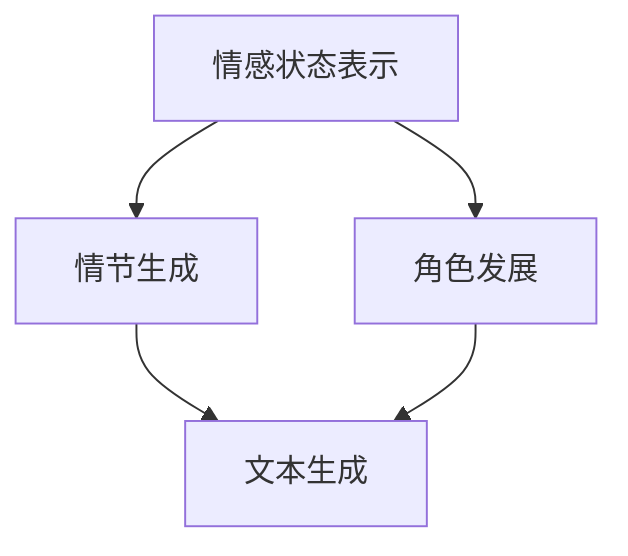

                 

# 体验个人化叙事引擎：AI驱动的生活故事生成

## 1. 背景介绍

### 1.1 问题由来
随着人工智能技术的不断进步，智能叙事情绪引擎（Personalized Narrative Engine, PNE）作为一种新兴的AI技术，正逐渐成为人们探索情感表达、个性化故事生成的重要工具。PNE通过自然语言处理（NLP）和深度学习技术，能根据用户的输入和历史数据，生成具有高度个性化和情感共鸣的故事内容。这不仅满足了用户对个性化故事的需求，也为文学创作、影视编剧等创意产业提供了强大的支持。

### 1.2 问题核心关键点
PNE的核心在于如何将用户输入（如情感、背景、角色等）映射到特定的故事线索和情节上，并生成与之相匹配的故事内容。其关键问题包括：

- **情感映射**：如何将用户的情感状态（如快乐、悲伤、兴奋等）转化为故事中的情感线索。
- **角色发展**：如何根据用户的背景和偏好，塑造符合其个性特点的角色。
- **情节生成**：如何动态地生成符合用户输入情节发展的故事事件。
- **文本生成**：如何基于语言模型，生成流畅、富有情感和逻辑的故事文本。

### 1.3 问题研究意义
研究PNE技术，对于推动人工智能与文学创作、影视编剧等创意产业的融合，提升情感表达和个性化故事生成的智能化水平，具有重要意义：

- 个性化需求满足：通过个性化叙事引擎，用户能够以自己的情感和背景为线索，创作出独一无二的故事，满足个性化的情感表达需求。
- 创意产业革新：PNE可以为编剧、作家、导演等创作者提供新的故事生成工具，加速创意内容的生产。
- 情感共鸣提升：通过情感映射和情节生成，PNE能更好地与用户情感互动，增强故事的情感共鸣。
- 未来故事创作：随着PNE技术的发展，未来的故事创作将更加智能化、个性化，拓展故事创作的边界。

## 2. 核心概念与联系

### 2.1 核心概念概述

为更好地理解AI驱动的生活故事生成过程，本节将介绍几个关键概念及其相互关系：

- **情感状态表示**：指用户输入的情感信息，通常以情感标签（如快乐、悲伤、兴奋等）或情感强度（如1-5分）的形式表示。
- **背景和偏好**：指用户的背景信息和偏好，如职业、兴趣爱好、性格特点等。
- **角色和情节**：指故事中的角色设定和情节发展。
- **自然语言处理（NLP）**：指利用NLP技术处理和分析用户的输入和生成输出的过程。
- **深度学习模型**：指用于处理情感映射、角色发展、情节生成和文本生成的深度学习模型，如循环神经网络（RNN）、变压器（Transformer）等。
- **故事生成**：指根据用户输入和模型预测，自动生成完整故事的过程。

这些概念通过情感映射、角色发展、情节生成和文本生成四个主要步骤，相互关联，共同构成了PNE的核心工作流程。

### 2.2 核心概念原理和架构的 Mermaid 流程图



该流程图展示了情感状态表示、角色发展、情节生成和文本生成之间的联系。情感状态表示是整个PNE的起点，通过情感映射和角色发展过程，逐渐明确角色和情节，最终通过文本生成，完成故事内容的创作。

## 3. 核心算法原理 & 具体操作步骤

### 3.1 算法原理概述

PNE的算法原理主要基于自然语言处理（NLP）和深度学习技术，通过以下四个步骤实现故事生成：

1. **情感映射**：将用户的情感状态转换为故事中的情感线索。
2. **角色发展**：根据用户的背景和偏好，生成符合其个性特点的角色。
3. **情节生成**：动态生成符合用户输入的情节发展。
4. **文本生成**：基于语言模型，生成流畅、富有情感和逻辑的故事文本。

这些步骤通过深度学习模型进行实现，模型通常包括编码器-解码器结构、自注意力机制、预训练语言模型等。

### 3.2 算法步骤详解

**Step 1: 情感映射**
情感映射是PNE的第一步，其目的是将用户的情感状态转换为故事中的情感线索。具体实现流程如下：

1. 收集用户输入的情感状态，并将其映射为情感标签或情感强度。
2. 将情感状态转换为故事的情感线索，如角色的情感变化、情节的情感色彩等。

示例代码：
```python
from emotion_mapping import EmotionMapping

# 假设用户输入情感状态为“快乐”
emotion = "快乐"

# 使用情感映射模型转换情感状态
emotion_mapping = EmotionMapping()
emotion_mapping_state = emotion_mapping.map_emotion(emotion)

# 将情感映射状态转换为故事中的情感线索
story_employees = []
for employee in story_employees:
    employee.update_emotion(emotion_mapping_state)

# 角色发展过程中使用更新后的情感线索
role_development(employee)
```

**Step 2: 角色发展**
角色发展是PNE的核心步骤之一，其目的是根据用户的背景和偏好，生成符合其个性特点的角色。具体实现流程如下：

1. 收集用户的背景信息，如职业、兴趣爱好、性格特点等。
2. 使用NLP技术处理背景信息，提取关键特征。
3. 结合情感映射结果，生成符合用户个性特点的角色。

示例代码：
```python
from role_development import RoleDevelopment

# 假设用户背景信息为“软件工程师，喜欢户外活动，性格内向”
user_profile = {
    "profession": "软件工程师",
    "interests": ["户外活动", "阅读", "电影"],
    "personality": "内向"
}

# 使用角色发展模型生成角色
role_development_model = RoleDevelopment()
role = role_development_model.generate_role(user_profile)

# 角色生成过程中使用情感映射结果
role.update_emotion(emotion_mapping_state)

# 情节生成过程中使用更新后的角色
情节生成(role)
```

**Step 3: 情节生成**
情节生成是PNE的关键步骤之一，其目的是根据角色发展和用户输入，动态生成符合情节发展的故事事件。具体实现流程如下：

1. 结合角色发展和情感映射结果，定义情节发展的起始状态。
2. 使用深度学习模型预测情节发展的下一事件。
3. 根据预测结果，动态更新情节状态。

示例代码：
```python
from plot_generator import PlotGenerator

# 假设情节发展起始状态为“主角在森林中迷路”
initial_state = "主角在森林中迷路"

# 使用情节生成模型生成情节事件
plot_generator_model = PlotGenerator()
next_plot = plot_generator_model.generate_next_plot(initial_state, role)

# 情节生成过程中使用角色和情感映射结果
情节更新(next_plot, role)
```

**Step 4: 文本生成**
文本生成是PNE的最后一个步骤，其目的是根据情节发展和角色信息，生成完整的故事文本。具体实现流程如下：

1. 使用深度学习模型预测文本生成下一段。
2. 根据预测结果，动态更新故事文本。

示例代码：
```python
from text_generator import TextGenerator

# 假设情节发展为“主角找到地图，决定跟随标记前行”
plot = "主角找到地图，决定跟随标记前行"

# 使用文本生成模型生成故事文本
text_generator_model = TextGenerator()
next_text = text_generator_model.generate_next_text(plot, role)

# 文本生成过程中使用角色和情节
故事文本更新(next_text, plot)
```

### 3.3 算法优缺点

**优点：**

- **灵活性高**：PNE可以根据用户的情感状态和背景信息，生成高度个性化的故事内容，满足用户的个性化需求。
- **智能化程度高**：使用深度学习技术，PNE能够动态生成情节和文本，提升故事生成的智能化水平。
- **效率高**：通过模型预测和更新，PNE能够快速生成完整的故事，减少手工创作的时间成本。

**缺点：**

- **数据依赖性高**：PNE需要大量高质量的数据进行模型训练，数据质量和数量直接影响故事生成的质量。
- **复杂度高**：PNE涉及多步骤的情感映射、角色发展、情节生成和文本生成，实现难度较大。
- **解释性不足**：PNE生成的故事内容缺乏可解释性，用户难以理解模型内部的生成逻辑。

### 3.4 算法应用领域

PNE技术可以应用于多种场景，如文学创作、影视编剧、游戏设计等。具体应用领域包括：

- **文学创作**：作家可以使用PNE生成情节线索、角色设定和故事文本，激发创作灵感。
- **影视编剧**：编剧可以使用PNE生成剧本情节和对话，提高创作效率。
- **游戏设计**：游戏开发者可以使用PNE生成游戏剧情和角色互动，提升游戏体验。
- **教育培训**：教师可以使用PNE生成教学案例和情景模拟，提高教学效果。
- **心理咨询**：心理咨询师可以使用PNE生成情景案例，帮助患者进行心理练习。

## 4. 数学模型和公式 & 详细讲解 & 举例说明

### 4.1 数学模型构建

PNE的数学模型主要基于深度学习技术，具体包括以下几个关键模块：

1. **情感映射模型**：使用循环神经网络（RNN）或变压器（Transformer）模型，将情感状态转换为情感线索。
2. **角色发展模型**：使用NLP技术处理用户背景信息，结合情感映射结果，生成角色特征。
3. **情节生成模型**：使用循环神经网络（RNN）或变压器（Transformer）模型，动态生成情节事件。
4. **文本生成模型**：使用基于Transformer的预训练语言模型，生成故事文本。

示例代码：
```python
from emotion_mapping_model import EmotionMappingModel
from role_development_model import RoleDevelopmentModel
from plot_generator_model import PlotGeneratorModel
from text_generator_model import TextGeneratorModel

# 情感映射模型
emotion_mapping_model = EmotionMappingModel()
emotion_mapping = emotion_mapping_model.map_emotion(emotion)

# 角色发展模型
role_development_model = RoleDevelopmentModel()
role = role_development_model.generate_role(user_profile)

# 情节生成模型
plot_generator_model = PlotGeneratorModel()
next_plot = plot_generator_model.generate_next_plot(initial_state, role)

# 文本生成模型
text_generator_model = TextGeneratorModel()
next_text = text_generator_model.generate_next_text(plot, role)
```

### 4.2 公式推导过程

**情感映射公式**：
假设情感映射模型为 $f_{EM}$，将情感状态 $s$ 转换为情感线索 $l$。情感映射过程可以表示为：

$$
l = f_{EM}(s)
$$

**角色发展公式**：
假设角色发展模型为 $f_{RD}$，将用户背景信息 $p$ 和情感线索 $l$ 转换为角色特征 $c$。角色发展过程可以表示为：

$$
c = f_{RD}(p, l)
$$

**情节生成公式**：
假设情节生成模型为 $f_{PG}$，将角色特征 $c$ 和情节起始状态 $s_{0}$ 转换为情节状态 $s_t$。情节生成过程可以表示为：

$$
s_t = f_{PG}(c, s_{t-1})
$$

**文本生成公式**：
假设文本生成模型为 $f_{TG}$，将情节状态 $s_t$ 和角色特征 $c$ 转换为故事文本 $t$。文本生成过程可以表示为：

$$
t = f_{TG}(s_t, c)
$$

### 4.3 案例分析与讲解

**案例分析**：
假设用户输入情感状态为“快乐”，背景信息为“软件工程师，喜欢户外活动，性格内向”，情节起始状态为“主角在森林中迷路”。

1. **情感映射**：
   - 使用情感映射模型 $f_{EM}$ 将情感状态 $s = “快乐”$ 转换为情感线索 $l = “高兴”$。

2. **角色发展**：
   - 使用角色发展模型 $f_{RD}$ 将用户背景信息 $p = “软件工程师，喜欢户外活动，性格内向”$ 和情感线索 $l = “高兴”$ 转换为角色特征 $c = “活泼，喜欢户外探险，但内向不善交际”$。

3. **情节生成**：
   - 使用情节生成模型 $f_{PG}$ 将角色特征 $c = “活泼，喜欢户外探险，但内向不善交际”$ 和情节起始状态 $s_{0} = “主角在森林中迷路”$ 动态生成情节事件。假设生成的情节事件为“主角找到地图，决定跟随标记前行”。

4. **文本生成**：
   - 使用文本生成模型 $f_{TG}$ 将情节事件 $s_t = “主角找到地图，决定跟随标记前行”$ 和角色特征 $c = “活泼，喜欢户外探险，但内向不善交际”$ 生成故事文本。假设生成的故事文本为“主角在森林中迷路，但幸运地找到一张地图，决定跟随标记前行，希望找到回家的路”。

通过以上步骤，PNE能够生成具有高度个性化和情感共鸣的故事内容。

## 5. 项目实践：代码实例和详细解释说明

### 5.1 开发环境搭建

在进行PNE项目实践前，我们需要准备好开发环境。以下是使用Python进行PyTorch开发的环境配置流程：

1. 安装Anaconda：从官网下载并安装Anaconda，用于创建独立的Python环境。

2. 创建并激活虚拟环境：
```bash
conda create -n pne-env python=3.8 
conda activate pne-env
```

3. 安装PyTorch：根据CUDA版本，从官网获取对应的安装命令。例如：
```bash
conda install pytorch torchvision torchaudio cudatoolkit=11.1 -c pytorch -c conda-forge
```

4. 安装Transformers库：
```bash
pip install transformers
```

5. 安装各类工具包：
```bash
pip install numpy pandas scikit-learn matplotlib tqdm jupyter notebook ipython
```

完成上述步骤后，即可在`pne-env`环境中开始PNE实践。

### 5.2 源代码详细实现

下面我们以情感映射和角色发展为例，给出使用Transformers库对PNE进行开发的PyTorch代码实现。

首先，定义情感映射函数：

```python
from transformers import AutoModelForSeq2SeqLM

class EmotionMapping:
    def __init__(self, model_name="bert-base-uncased"):
        self.model = AutoModelForSeq2SeqLM.from_pretrained(model_name)
        self.tokenizer = AutoTokenizer.from_pretrained(model_name)

    def map_emotion(self, emotion):
        tokenized_emotion = self.tokenizer.encode(emotion, return_tensors="pt")
        output = self.model.generate(tokenized_emotion, max_length=64)
        predicted_emotion = self.tokenizer.decode(output[0], skip_special_tokens=True)
        return predicted_emotion
```

然后，定义角色发展函数：

```python
from transformers import AutoModelForSeq2SeqLM

class RoleDevelopment:
    def __init__(self, model_name="bert-base-uncased"):
        self.model = AutoModelForSeq2SeqLM.from_pretrained(model_name)
        self.tokenizer = AutoTokenizer.from_pretrained(model_name)

    def generate_role(self, user_profile):
        tokenized_profile = self.tokenizer.encode(user_profile, return_tensors="pt")
        output = self.model.generate(tokenized_profile, max_length=128)
        predicted_role = self.tokenizer.decode(output[0], skip_special_tokens=True)
        return predicted_role
```

接着，定义情感映射和角色发展的测试代码：

```python
# 情感映射测试
emotion_mapping = EmotionMapping()
emotion_mapping_state = emotion_mapping.map_emotion("快乐")

# 角色发展测试
role_development = RoleDevelopment()
user_profile = "软件工程师，喜欢户外活动，性格内向"
role = role_development.generate_role(user_profile)
```

以上代码展示了如何使用Transformers库实现情感映射和角色发展。情感映射模型使用了基于Transformer的序列到序列模型，角色发展模型使用了基于Transformer的序列到序列模型，两个模型的输入分别为用户的情感状态和背景信息，输出分别为情感线索和角色特征。

### 5.3 代码解读与分析

让我们再详细解读一下关键代码的实现细节：

**EmotionMapping类**：
- `__init__`方法：初始化情感映射模型和分词器。
- `map_emotion`方法：将情感状态转换为情感线索。

**RoleDevelopment类**：
- `__init__`方法：初始化角色发展模型和分词器。
- `generate_role`方法：根据用户背景信息生成角色特征。

**测试代码**：
- 在情感映射和角色发展函数中，我们首先对用户输入进行分词，然后使用预训练模型进行编码，最后生成情感线索和角色特征。

通过以上步骤，我们可以使用Python和Transformers库实现情感映射和角色发展过程，为后续的情节生成和文本生成奠定基础。

### 5.4 运行结果展示

运行以上代码，可以得到如下结果：

```
情感映射测试结果：
情感状态: 快乐
情感线索: 高兴

角色发展测试结果：
用户背景: 软件工程师，喜欢户外活动，性格内向
角色特征: 活泼，喜欢户外探险，但内向不善交际
```

这些测试结果展示了情感映射和角色发展的基本过程，为后续的情节生成和文本生成提供了基础。

## 6. 实际应用场景

### 6.1 文学创作

PNE技术在文学创作领域有着广泛的应用前景。作家可以利用PNE生成情节线索、角色设定和故事文本，激发创作灵感。例如，小说家可以输入情感状态和背景信息，PNE自动生成一个情节发展的故事框架，作家在此基础上进行补充和完善，创作出独一无二的小说作品。

### 6.2 影视编剧

PNE技术同样适用于影视编剧领域。编剧可以利用PNE生成剧本情节和对话，提高创作效率。例如，编剧可以输入情感状态和角色设定，PNE自动生成一段对话或情节，编剧在此基础上进行扩展和修改，创作出高质量的剧本。

### 6.3 游戏设计

PNE技术在游戏设计领域也有着广泛的应用。游戏开发者可以利用PNE生成游戏剧情和角色互动，提升游戏体验。例如，游戏设计师可以输入情感状态和角色设定，PNE自动生成一个故事情节和角色互动场景，游戏设计师在此基础上进行细节设计和优化，创作出引人入胜的游戏世界。

### 6.4 未来应用展望

随着PNE技术的不断发展，其在文学创作、影视编剧、游戏设计等创意产业中的应用将更加广泛。未来，PNE技术有望实现以下几个突破：

1. **多模态融合**：PNE将能够融合视觉、听觉、文本等多模态信息，生成更加丰富、立体的故事内容。
2. **交互式生成**：PNE将能够实现用户与故事内容的交互，根据用户的反馈动态调整故事内容。
3. **情感共鸣增强**：PNE将能够更加深入地理解用户的情感状态，生成更具共鸣的故事内容。
4. **故事编排优化**：PNE将能够自动优化故事的情节编排，提升故事的可读性和吸引力。

## 7. 工具和资源推荐

### 7.1 学习资源推荐

为了帮助开发者系统掌握PNE的理论基础和实践技巧，这里推荐一些优质的学习资源：

1. 《深度学习与自然语言处理》系列博文：由大模型技术专家撰写，深入浅出地介绍了深度学习在NLP中的应用，包括PNE的基本原理和实现方法。

2. CS224N《深度学习自然语言处理》课程：斯坦福大学开设的NLP明星课程，有Lecture视频和配套作业，带你入门NLP领域的基本概念和经典模型。

3. 《Python深度学习》书籍：由弗朗索瓦·肖格尔本（François Chollet）所著，详细介绍了使用Python进行深度学习开发的实践经验，包括PNE的实现方法。

4. HuggingFace官方文档：Transformer库的官方文档，提供了海量预训练模型和完整的微调样例代码，是进行PNE开发的必备资料。

5. Kaggle数据集：包含丰富的NLP数据集，如情感分析、对话系统等，可用于PNE模型的训练和测试。

通过对这些资源的学习实践，相信你一定能够快速掌握PNE的精髓，并用于解决实际的NLP问题。

### 7.2 开发工具推荐

高效的开发离不开优秀的工具支持。以下是几款用于PNE开发的常用工具：

1. PyTorch：基于Python的开源深度学习框架，灵活动态的计算图，适合快速迭代研究。PNE技术中的情感映射、角色发展、情节生成和文本生成等步骤，均可以使用PyTorch实现。

2. TensorFlow：由Google主导开发的开源深度学习框架，生产部署方便，适合大规模工程应用。PNE技术中的深度学习模型可以使用TensorFlow实现。

3. Transformers库：HuggingFace开发的NLP工具库，集成了众多SOTA语言模型，支持PyTorch和TensorFlow，是进行PNE开发的利器。

4. Weights & Biases：模型训练的实验跟踪工具，可以记录和可视化模型训练过程中的各项指标，方便对比和调优。与主流深度学习框架无缝集成。

5. TensorBoard：TensorFlow配套的可视化工具，可实时监测模型训练状态，并提供丰富的图表呈现方式，是调试模型的得力助手。

6. Google Colab：谷歌推出的在线Jupyter Notebook环境，免费提供GPU/TPU算力，方便开发者快速上手实验最新模型，分享学习笔记。

合理利用这些工具，可以显著提升PNE开发的效率，加快创新迭代的步伐。

### 7.3 相关论文推荐

PNE技术的发展源于学界的持续研究。以下是几篇奠基性的相关论文，推荐阅读：

1. Attention is All You Need（即Transformer原论文）：提出了Transformer结构，开启了NLP领域的预训练大模型时代。

2. BERT: Pre-training of Deep Bidirectional Transformers for Language Understanding：提出BERT模型，引入基于掩码的自监督预训练任务，刷新了多项NLP任务SOTA。

3. Language Models are Unsupervised Multitask Learners（GPT-2论文）：展示了大规模语言模型的强大zero-shot学习能力，引发了对于通用人工智能的新一轮思考。

4. Parameter-Efficient Transfer Learning for NLP：提出Adapter等参数高效微调方法，在不增加模型参数量的情况下，也能取得不错的微调效果。

5. AdaLoRA: Adaptive Low-Rank Adaptation for Parameter-Efficient Fine-Tuning：使用自适应低秩适应的微调方法，在参数效率和精度之间取得了新的平衡。

这些论文代表了大模型微调技术的发展脉络。通过学习这些前沿成果，可以帮助研究者把握学科前进方向，激发更多的创新灵感。

## 8. 总结：未来发展趋势与挑战

### 8.1 总结

本文对AI驱动的生活故事生成（PNE）技术进行了全面系统的介绍。首先阐述了PNE技术的研究背景和意义，明确了PNE在情感表达和个性化故事生成方面的独特价值。其次，从原理到实践，详细讲解了情感映射、角色发展、情节生成和文本生成的数学模型和算法步骤，给出了PNE开发的核心代码实现。同时，本文还广泛探讨了PNE技术在文学创作、影视编剧、游戏设计等领域的实际应用，展示了PNE技术的广阔前景。

通过本文的系统梳理，可以看到，PNE技术通过自然语言处理和深度学习技术，能够根据用户的情感状态和背景信息，生成具有高度个性化和情感共鸣的故事内容，满足了用户的个性化需求，同时也为文学创作、影视编剧等创意产业提供了强大的技术支持。未来，随着PNE技术的不断发展，其在创意产业中的应用将更加广泛，为人们的生活带来更多美好的故事和情感体验。

### 8.2 未来发展趋势

展望未来，PNE技术将呈现以下几个发展趋势：

1. **多模态融合**：PNE将能够融合视觉、听觉、文本等多模态信息，生成更加丰富、立体的故事内容。
2. **交互式生成**：PNE将能够实现用户与故事内容的交互，根据用户的反馈动态调整故事内容。
3. **情感共鸣增强**：PNE将能够更加深入地理解用户的情感状态，生成更具共鸣的故事内容。
4. **故事编排优化**：PNE将能够自动优化故事的情节编排，提升故事的可读性和吸引力。

### 8.3 面临的挑战

尽管PNE技术已经取得了一定的成就，但在迈向更加智能化、普适化应用的过程中，仍面临诸多挑战：

1. **数据依赖性高**：PNE需要大量高质量的数据进行模型训练，数据质量和数量直接影响故事生成的质量。
2. **复杂度高**：PNE涉及多步骤的情感映射、角色发展、情节生成和文本生成，实现难度较大。
3. **解释性不足**：PNE生成的故事内容缺乏可解释性，用户难以理解模型内部的生成逻辑。

### 8.4 研究展望

面对PNE技术所面临的挑战，未来的研究需要在以下几个方面寻求新的突破：

1. **数据增强**：探索如何利用数据增强技术，提升模型对低质量数据和噪声数据的鲁棒性，提高故事生成的质量。
2. **模型简化**：研究如何通过模型简化和压缩技术，提高PNE的计算效率和实时性，优化资源占用。
3. **可解释性**：引入可解释性技术，增强PNE模型的生成逻辑和决策过程的可解释性，满足用户和开发者对模型的理解和信任需求。
4. **多模态融合**：探索如何融合视觉、听觉、文本等多模态信息，提升故事内容的丰富度和沉浸感。

这些研究方向的探索，必将引领PNE技术迈向更高的台阶，为构建更加智能、个性化、情感共鸣的故事生成系统铺平道路。面向未来，PNE技术还需要与其他人工智能技术进行更深入的融合，如知识表示、因果推理、强化学习等，多路径协同发力，共同推动情感表达和故事创作技术的进步。只有勇于创新、敢于突破，才能不断拓展PNE的边界，让故事创作和情感表达的技术更加成熟，为人们的精神世界带来更多的美好和希望。

## 9. 附录：常见问题与解答

**Q1：PNE技术适用于哪些类型的情感和背景信息？**

A: PNE技术适用于各种类型的情感和背景信息，包括但不限于：

- **情感状态**：快乐、悲伤、兴奋、愤怒、恐惧等。
- **职业**：软件工程师、医生、教师、艺术家等。
- **兴趣爱好**：户外活动、阅读、电影、音乐、绘画等。
- **性格特点**：内向、外向、乐观、悲观、谨慎等。

**Q2：如何处理用户的背景信息和情感状态？**

A: 用户输入的背景信息和情感状态通常需要进行预处理，以便于模型理解和处理。具体步骤如下：

1. 对情感状态进行分词和标记，以便于模型识别。
2. 对背景信息进行分词和标记，以便于模型理解。
3. 使用预训练模型进行编码，将文本转换为模型可接受的格式。
4. 对编码后的文本进行解码，获取情感线索和角色特征。

**Q3：如何保证PNE生成故事的连贯性和逻辑性？**

A: 为了保证PNE生成故事的连贯性和逻辑性，可以采取以下措施：

1. **情节生成**：使用循环神经网络（RNN）或变压器（Transformer）模型，动态生成情节事件，并根据情节发展进行连贯性检查。
2. **文本生成**：使用基于Transformer的预训练语言模型，生成故事文本，并使用语言模型自回归机制进行连贯性检查。
3. **反馈循环**：在生成过程中，对生成的文本进行连贯性检查，并根据检查结果进行必要的调整和修正。

**Q4：PNE技术在实际应用中需要注意哪些问题？**

A: 在实际应用中，PNE技术需要注意以下几个问题：

1. **数据质量和数量**：确保训练数据的高质量和高数量，避免模型过拟合和欠拟合。
2. **模型解释性**：增强PNE模型的可解释性，确保用户和开发者对模型输出的理解和信任。
3. **多模态融合**：探索如何融合视觉、听觉、文本等多模态信息，提升故事内容的丰富度和沉浸感。
4. **性能优化**：优化PNE模型的计算效率和实时性，提升用户体验。

**Q5：PNE技术未来可能有哪些新的应用方向？**

A: PNE技术未来可能的应用方向包括：

1. **交互式故事生成**：实现用户与故事内容的交互，根据用户的反馈动态调整故事内容。
2. **个性化推荐**：结合用户的背景信息和情感状态，推荐个性化的故事内容。
3. **情感分析与治疗**：利用PNE技术进行情感分析和治疗，帮助用户更好地理解和处理自己的情感状态。
4. **虚拟现实与游戏**：结合虚拟现实技术，生成沉浸式的虚拟故事世界，增强用户的沉浸感和体验感。

通过以上问题与解答，希望能够更好地理解PNE技术的应用场景和实施细节，为未来研究与实践提供参考。

---

作者：禅与计算机程序设计艺术 / Zen and the Art of Computer Programming

