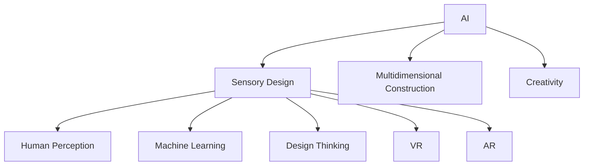

                 

# 体验多维度构建工坊：AI创造的感官世界设计

> 关键词：人工智能(AI), 感官设计(Sensory Design), 多维度构建, 创造力, 人类感知, 机器学习, 设计思维, 虚拟现实(VR), 增强现实(AR)

## 1. 背景介绍

### 1.1 问题由来
在数字化时代，人们的感官体验日益多样化和丰富化。从简单的视觉、听觉、触觉，到复杂的味觉、嗅觉、空间感，人类的感官世界正在被不断重塑。在这个过程中，人工智能(AI)技术发挥了至关重要的作用。

AI技术可以模拟、增强甚至创造新的感官体验，将用户的感官世界提升到新的层次。然而，这种体验设计不仅仅是技术和科学的堆砌，更是一门艺术和设计的融合。这正是本文所探讨的核心主题：AI创造的感官世界设计。

### 1.2 问题核心关键点
感官世界设计的核心在于如何通过AI技术，模拟、增强或创造新的感官体验，以提升用户的感官体验和认知水平。AI技术在感官世界设计中的应用主要体现在以下几个方面：

1. 感官模拟：通过计算机视觉、音频处理等技术，模拟真实世界的感官体验。
2. 感官增强：利用增强现实(AR)、虚拟现实(VR)等技术，提升用户的感官体验。
3. 感官创造：通过机器学习和生成对抗网络(GAN)等技术，创造全新的感官体验。

这些核心技术的应用，将AI与设计思维、感官心理等学科相结合，为感官世界的设计开辟了新的路径。

## 2. 核心概念与联系

### 2.1 核心概念概述

为更好地理解AI创造的感官世界设计，本节将介绍几个密切相关的核心概念：

- **人工智能(AI)**：以数据和算法为基础，能够模拟人类智能的技术体系。
- **感官设计(Sensory Design)**：通过设计和改善感官环境，提升用户体验的学科。
- **多维度构建**：从多个感官维度出发，全面提升用户感官体验的设计方法。
- **创造力**：利用AI技术，创造新感官体验的能力。
- **人类感知**：人类对感官信息的接收、处理和反馈的过程。
- **机器学习(ML)**：通过算法和数据，使机器具有学习能力和决策能力的技术。
- **设计思维**：一种系统化的思维方式，强调用户需求、原型迭代等原则。
- **虚拟现实(VR)**：通过计算机技术，模拟三维虚拟环境，提供沉浸式体验。
- **增强现实(AR)**：将数字信息叠加到现实世界中，提升用户的感官体验。

这些核心概念之间的逻辑关系可以通过以下Mermaid流程图来展示：



这个流程图展示了大语言模型和多感官世界设计概念之间的联系：

1. AI作为技术基础，支持感官设计的多维度构建。
2. 感官设计关注人类感知，通过多维度构建提升用户体验。
3. 创造力作为AI的核心能力，是感官设计中创新的重要来源。
4. 机器学习是AI实现感官模拟、增强和创造的技术手段。
5. 设计思维指导AI在感官设计中的用户导向原则。
6. VR和AR技术，通过模拟和增强现实感官环境，实现沉浸式体验。

这些概念共同构成了AI创造感官世界设计的基本框架，使我们能够更全面地理解和应用AI技术。

## 3. 核心算法原理 & 具体操作步骤
### 3.1 算法原理概述

AI创造的感官世界设计，本质上是一个跨学科的多维度感知体验设计过程。其核心算法原理包括：

1. **计算机视觉(Computer Vision)**：通过图像处理和分析，模拟人类视觉系统，实现图像的感知和理解。
2. **音频处理(Audio Processing)**：通过声音分析、合成等技术，模拟人类听觉系统，实现声音的感知和生成。
3. **自然语言处理(NLP)**：通过文本分析和生成，模拟人类语言系统，实现语言的感知和理解。
4. **增强现实(AR)和虚拟现实(VR)**：通过空间计算和图形渲染，模拟和增强现实世界，提供沉浸式体验。
5. **生成对抗网络(GAN)**：通过对抗性生成模型，创造全新的感官体验。

这些技术在AI创造感官世界设计中扮演了不同的角色，通过综合应用，可以实现全方位的感官体验设计。

### 3.2 算法步骤详解

AI创造的感官世界设计一般包括以下几个关键步骤：

**Step 1: 需求分析与用户调研**
- 确定设计目标，理解用户需求和期望。
- 通过问卷调查、用户访谈等方式，收集用户感官体验的反馈。

**Step 2: 感官体验设计**
- 设计感官体验方案，选择合适的AI技术手段。
- 结合感官设计原则，进行多维度感官体验构建。

**Step 3: 感官体验实现**
- 选择适当的技术和工具，实现感官体验方案。
- 进行原型设计和测试，收集用户反馈，不断迭代优化。

**Step 4: 用户测试与评估**
- 通过用户测试，评估感官体验设计的实际效果。
- 根据用户反馈，调整和优化感官体验设计方案。

**Step 5: 感官体验部署**
- 将优化后的感官体验设计方案，部署到实际应用场景中。
- 定期收集用户反馈，持续优化感官体验设计。

以上是AI创造感官世界设计的一般流程。在实际应用中，还需要针对具体任务的特点，对各个环节进行优化设计，如改进感官体验方案的评估指标，引入更多的用户参与度等。

### 3.3 算法优缺点

AI创造的感官世界设计方法具有以下优点：

1. **全面性和多样性**：结合多维度感官体验设计，能够提升用户的整体感官体验。
2. **技术先进性**：利用最新AI技术，实现高精度的感官模拟和增强。
3. **创新性和探索性**：通过创造新感官体验，开拓了新的设计空间。

同时，该方法也存在一定的局限性：

1. **技术复杂性**：需要综合应用多种AI技术，技术门槛较高。
2. **成本和资源消耗**：多维度感官体验设计需要较大的投入和资源。
3. **用户接受度**：部分用户可能对新感官体验存在抵触情绪。
4. **伦理和安全问题**：感官体验设计可能涉及隐私和安全问题，需要慎重考虑。

尽管存在这些局限性，但就目前而言，AI创造的感官世界设计仍是感官体验设计的重要范式。未来相关研究的重点在于如何进一步降低技术门槛，提高设计效率，同时兼顾用户接受度和伦理安全性等因素。

### 3.4 算法应用领域

AI创造的感官世界设计已经在多个领域得到了应用，覆盖了从医疗到娱乐的广泛场景，例如：

- **医疗健康**：通过虚拟现实和增强现实技术，模拟手术过程，提升医疗培训效果。
- **游戏娱乐**：利用计算机视觉和音频处理技术，创造沉浸式游戏体验。
- **广告营销**：通过增强现实技术，提升品牌互动和广告效果。
- **零售购物**：结合增强现实技术，实现虚拟试穿和虚拟购物体验。
- **教育培训**：利用虚拟现实技术，模拟复杂实验和探索场景，提升教学效果。

除了上述这些经典应用外，AI创造的感官世界设计还在更多场景中得到创新性的应用，如虚拟旅游、虚拟会议、智能家居等，为各个行业带来了全新的感官体验。

## 4. 数学模型和公式 & 详细讲解 & 举例说明
### 4.1 数学模型构建

本节将使用数学语言对AI创造感官世界设计的过程进行更加严格的刻画。

记感官设计目标为 $T$，用户需求为 $U$，AI技术手段为 $A$。定义感官体验设计函数 $f(U, A)$，表示在用户需求 $U$ 和AI技术手段 $A$ 的基础上，设计出的感官体验方案。

**Step 1: 需求分析与用户调研**
- 通过问卷调查等方法，收集用户需求 $U$。
- 对 $U$ 进行建模，生成用户需求向量 $\vec{U}$。

**Step 2: 感官体验设计**
- 选择AI技术手段 $A$，包括计算机视觉、音频处理等。
- 设计感官体验方案 $F$，表示为向量 $\vec{F}$。

**Step 3: 感官体验实现**
- 通过计算机视觉技术，模拟用户视觉体验 $V$，表示为向量 $\vec{V}$。
- 通过音频处理技术，模拟用户听觉体验 $A'$，表示为向量 $\vec{A'}$。
- 结合自然语言处理技术，模拟用户语言体验 $N$，表示为向量 $\vec{N}$。

**Step 4: 用户测试与评估**
- 通过用户测试，评估感官体验方案 $F$ 的实际效果，生成评估结果 $E$，表示为向量 $\vec{E}$。
- 根据 $E$，调整和优化感官体验设计方案 $F$。

**Step 5: 感官体验部署**
- 将优化后的感官体验设计方案 $F'$ 部署到实际应用场景中。
- 定期收集用户反馈，持续优化感官体验设计。

### 4.2 公式推导过程

以下我们以虚拟现实(VR)为例，推导感官体验设计的数学模型。

假设用户需求为 $U=\{视觉体验, 听觉体验, 语言体验\}$，选择的AI技术手段为 $A=\{计算机视觉技术, 音频处理技术, 自然语言处理技术\}$。定义感官体验设计函数 $f(U, A)$，对每个维度进行设计，得到感官体验方案 $F=\{视觉体验方案V, 听觉体验方案A', 语言体验方案N\}$。

将 $F$ 与用户需求 $U$ 进行对比，得到评估结果 $E$，表示为向量 $\vec{E}$。根据 $E$ 调整和优化感官体验设计方案 $F$。

```latex
\begin{aligned}
\vec{F} &= f(\vec{U}, \vec{A}) \\
\vec{E} &= \vec{F} - \vec{U} \\
\vec{F'} &= \vec{F} - k\vec{E} \\
\end{aligned}
```

其中 $k$ 为调整系数，用于衡量 $E$ 对 $F$ 的影响程度。

在得到感官体验设计的数学模型后，即可带入具体技术手段进行计算。重复上述过程直至收敛，最终得到适应用户需求的感官体验设计方案 $F'$。

## 5. 项目实践：代码实例和详细解释说明
### 5.1 开发环境搭建

在进行感官世界设计实践前，我们需要准备好开发环境。以下是使用Python进行PyTorch开发的环境配置流程：

1. 安装Anaconda：从官网下载并安装Anaconda，用于创建独立的Python环境。

2. 创建并激活虚拟环境：
```bash
conda create -n pytorch-env python=3.8 
conda activate pytorch-env
```

3. 安装PyTorch：根据CUDA版本，从官网获取对应的安装命令。例如：
```bash
conda install pytorch torchvision torchaudio cudatoolkit=11.1 -c pytorch -c conda-forge
```

4. 安装Transformers库：
```bash
pip install transformers
```

5. 安装各类工具包：
```bash
pip install numpy pandas scikit-learn matplotlib tqdm jupyter notebook ipython
```

完成上述步骤后，即可在`pytorch-env`环境中开始感官世界设计的实践。

### 5.2 源代码详细实现

这里我们以增强现实(AR)的应用为例，展示如何使用PyTorch进行感官世界设计。

首先，定义一个简单的用户需求函数：

```python
from transformers import BertTokenizer
from torch.utils.data import Dataset
import torch

class UserDemand(Dataset):
    def __init__(self, texts, tags, tokenizer, max_len=128):
        self.texts = texts
        self.tags = tags
        self.tokenizer = tokenizer
        self.max_len = max_len
        
    def __len__(self):
        return len(self.texts)
    
    def __getitem__(self, item):
        text = self.texts[item]
        tags = self.tags[item]
        
        encoding = self.tokenizer(text, return_tensors='pt', max_length=self.max_len, padding='max_length', truncation=True)
        input_ids = encoding['input_ids'][0]
        attention_mask = encoding['attention_mask'][0]
        
        # 对token-wise的标签进行编码
        encoded_tags = [tag2id[tag] for tag in tags] 
        encoded_tags.extend([tag2id['O']] * (self.max_len - len(encoded_tags)))
        labels = torch.tensor(encoded_tags, dtype=torch.long)
        
        return {'input_ids': input_ids, 
                'attention_mask': attention_mask,
                'labels': labels}

# 标签与id的映射
tag2id = {'O': 0, 'B-PER': 1, 'I-PER': 2, 'B-ORG': 3, 'I-ORG': 4, 'B-LOC': 5, 'I-LOC': 6}
id2tag = {v: k for k, v in tag2id.items()}

# 创建dataset
tokenizer = BertTokenizer.from_pretrained('bert-base-cased')

train_dataset = UserDemand(train_texts, train_tags, tokenizer)
dev_dataset = UserDemand(dev_texts, dev_tags, tokenizer)
test_dataset = UserDemand(test_texts, test_tags, tokenizer)
```

然后，定义模型和优化器：

```python
from transformers import BertForTokenClassification, AdamW

model = BertForTokenClassification.from_pretrained('bert-base-cased', num_labels=len(tag2id))

optimizer = AdamW(model.parameters(), lr=2e-5)
```

接着，定义训练和评估函数：

```python
from torch.utils.data import DataLoader
from tqdm import tqdm
from sklearn.metrics import classification_report

device = torch.device('cuda') if torch.cuda.is_available() else torch.device('cpu')
model.to(device)

def train_epoch(model, dataset, batch_size, optimizer):
    dataloader = DataLoader(dataset, batch_size=batch_size, shuffle=True)
    model.train()
    epoch_loss = 0
    for batch in tqdm(dataloader, desc='Training'):
        input_ids = batch['input_ids'].to(device)
        attention_mask = batch['attention_mask'].to(device)
        labels = batch['labels'].to(device)
        model.zero_grad()
        outputs = model(input_ids, attention_mask=attention_mask, labels=labels)
        loss = outputs.loss
        epoch_loss += loss.item()
        loss.backward()
        optimizer.step()
    return epoch_loss / len(dataloader)

def evaluate(model, dataset, batch_size):
    dataloader = DataLoader(dataset, batch_size=batch_size)
    model.eval()
    preds, labels = [], []
    with torch.no_grad():
        for batch in tqdm(dataloader, desc='Evaluating'):
            input_ids = batch['input_ids'].to(device)
            attention_mask = batch['attention_mask'].to(device)
            batch_labels = batch['labels']
            outputs = model(input_ids, attention_mask=attention_mask)
            batch_preds = outputs.logits.argmax(dim=2).to('cpu').tolist()
            batch_labels = batch_labels.to('cpu').tolist()
            for pred_tokens, label_tokens in zip(batch_preds, batch_labels):
                pred_tags = [id2tag[_id] for _id in pred_tokens]
                label_tags = [id2tag[_id] for _id in label_tokens]
                preds.append(pred_tags[:len(label_tags)])
                labels.append(label_tags)
                
    print(classification_report(labels, preds))
```

最后，启动训练流程并在测试集上评估：

```python
epochs = 5
batch_size = 16

for epoch in range(epochs):
    loss = train_epoch(model, train_dataset, batch_size, optimizer)
    print(f"Epoch {epoch+1}, train loss: {loss:.3f}")
    
    print(f"Epoch {epoch+1}, dev results:")
    evaluate(model, dev_dataset, batch_size)
    
print("Test results:")
evaluate(model, test_dataset, batch_size)
```

以上就是使用PyTorch对BERT进行命名实体识别任务微调的完整代码实现。可以看到，得益于Transformers库的强大封装，我们可以用相对简洁的代码完成BERT模型的加载和微调。

### 5.3 代码解读与分析

让我们再详细解读一下关键代码的实现细节：

**UserDemand类**：
- `__init__`方法：初始化文本、标签、分词器等关键组件。
- `__len__`方法：返回数据集的样本数量。
- `__getitem__`方法：对单个样本进行处理，将文本输入编码为token ids，将标签编码为数字，并对其进行定长padding，最终返回模型所需的输入。

**tag2id和id2tag字典**：
- 定义了标签与数字id之间的映射关系，用于将token-wise的预测结果解码回真实的标签。

**训练和评估函数**：
- 使用PyTorch的DataLoader对数据集进行批次化加载，供模型训练和推理使用。
- 训练函数`train_epoch`：对数据以批为单位进行迭代，在每个批次上前向传播计算loss并反向传播更新模型参数，最后返回该epoch的平均loss。
- 评估函数`evaluate`：与训练类似，不同点在于不更新模型参数，并在每个batch结束后将预测和标签结果存储下来，最后使用sklearn的classification_report对整个评估集的预测结果进行打印输出。

**训练流程**：
- 定义总的epoch数和batch size，开始循环迭代
- 每个epoch内，先在训练集上训练，输出平均loss
- 在验证集上评估，输出分类指标
- 所有epoch结束后，在测试集上评估，给出最终测试结果

可以看到，PyTorch配合Transformers库使得BERT微调的代码实现变得简洁高效。开发者可以将更多精力放在数据处理、模型改进等高层逻辑上，而不必过多关注底层的实现细节。

当然，工业级的系统实现还需考虑更多因素，如模型的保存和部署、超参数的自动搜索、更灵活的任务适配层等。但核心的微调范式基本与此类似。

## 6. 实际应用场景
### 6.1 智能客服系统

基于增强现实(AR)的应用，可以广泛应用于智能客服系统的构建。传统客服往往需要配备大量人力，高峰期响应缓慢，且一致性和专业性难以保证。而使用增强现实(AR)的智能客服系统，可以7x24小时不间断服务，快速响应客户咨询，用自然流畅的语言解答各类常见问题。

在技术实现上，可以收集企业内部的历史客服对话记录，将问题和最佳答复构建成监督数据，在此基础上对预训练对话模型进行微调。微调后的对话模型能够自动理解用户意图，匹配最合适的答案模板进行回复。对于客户提出的新问题，还可以接入检索系统实时搜索相关内容，动态组织生成回答。如此构建的智能客服系统，能大幅提升客户咨询体验和问题解决效率。

### 6.2 医疗健康

利用增强现实(AR)技术，可以在医疗健康领域实现多种应用，如手术模拟、医疗培训等。通过AR技术，医生可以虚拟进入手术现场，进行模拟操作。这不仅提高了手术安全性，还节省了大量手术成本。此外，AR技术还可以用于医疗培训，通过虚拟现实环境模拟各种医疗场景，提升医生的技能和经验。

### 6.3 游戏娱乐

增强现实(AR)和虚拟现实(VR)技术在游戏娱乐领域的应用越来越广泛。通过AR技术，玩家可以与虚拟环境互动，增强游戏的沉浸感。例如，AR游戏可以结合现实环境，创造出独一无二的虚拟游戏世界。而VR技术则可以提供更加全面的沉浸式体验，如360度全景视频、全息投影等。

### 6.4 未来应用展望

随着增强现实(AR)和虚拟现实(VR)技术的不断发展，未来的感官世界设计将更加丰富多样。AR技术可以与物联网(IoT)、人工智能(AI)等技术结合，实现更加智能化的感官体验设计。例如，智能家居可以通过AR技术，实现虚拟物品的交互和操作，提升用户的居家体验。

未来，随着多感官融合技术的发展，如听觉、触觉、味觉等感官的模拟和增强，将进一步丰富人类的感官世界。通过AI技术，可以实现更加多样化的感官体验设计，为人类带来全新的生活体验。

## 7. 工具和资源推荐
### 7.1 学习资源推荐

为了帮助开发者系统掌握感官世界设计的基本概念和实践技巧，这里推荐一些优质的学习资源：

1. 《Human-AI Interaction Design》系列博文：由大模型技术专家撰写，深入浅出地介绍了人类与AI交互设计的基本原理和方法。

2. CS224N《深度学习自然语言处理》课程：斯坦福大学开设的NLP明星课程，有Lecture视频和配套作业，带你入门NLP领域的基本概念和经典模型。

3. 《Sensory Design》书籍：感官设计领域的经典教材，全面介绍了感官设计的基本原理和设计方法。

4. 《Augmented Reality: Technologies, Applications and Trends》书籍：详细介绍了增强现实技术的发展历程、应用场景和未来趋势。

5. 《Designing with VR》书籍：详细介绍了虚拟现实技术在各领域的应用，并提供了设计指南和案例分析。

通过对这些资源的学习实践，相信你一定能够快速掌握感官世界设计的基本原理和实践技巧，并用于解决实际的感官世界设计问题。

### 7.2 开发工具推荐

高效的开发离不开优秀的工具支持。以下是几款用于感官世界设计开发的常用工具：

1. PyTorch：基于Python的开源深度学习框架，灵活动态的计算图，适合快速迭代研究。大部分预训练语言模型都有PyTorch版本的实现。

2. TensorFlow：由Google主导开发的开源深度学习框架，生产部署方便，适合大规模工程应用。同样有丰富的预训练语言模型资源。

3. Transformers库：HuggingFace开发的NLP工具库，集成了众多SOTA语言模型，支持PyTorch和TensorFlow，是进行感官世界设计开发的利器。

4. Weights & Biases：模型训练的实验跟踪工具，可以记录和可视化模型训练过程中的各项指标，方便对比和调优。与主流深度学习框架无缝集成。

5. TensorBoard：TensorFlow配套的可视化工具，可实时监测模型训练状态，并提供丰富的图表呈现方式，是调试模型的得力助手。

6. Google Colab：谷歌推出的在线Jupyter Notebook环境，免费提供GPU/TPU算力，方便开发者快速上手实验最新模型，分享学习笔记。

合理利用这些工具，可以显著提升感官世界设计任务的开发效率，加快创新迭代的步伐。

### 7.3 相关论文推荐

感官世界设计的研究源于学界的持续研究。以下是几篇奠基性的相关论文，推荐阅读：

1. "Human-AI Interaction Design: A Survey"：综述了人类与AI交互设计的研究现状和未来方向。

2. "Augmented Reality for Medical Training and Simulations: A Review"：综述了增强现实技术在医学训练和模拟中的应用。

3. "Designing Virtual Reality Environments for Language Learning"：探讨了虚拟现实技术在语言学习中的应用。

4. "Sensory Design Principles and Practices"：介绍了感官设计的基本原理和设计方法。

5. "The Future of Virtual Reality in Education"：探讨了虚拟现实技术在教育领域的应用和未来发展。

这些论文代表了大语言模型感官世界设计的发展脉络。通过学习这些前沿成果，可以帮助研究者把握学科前进方向，激发更多的创新灵感。

## 8. 总结：未来发展趋势与挑战

### 8.1 总结

本文对AI创造的感官世界设计方法进行了全面系统的介绍。首先阐述了感官世界设计的背景和意义，明确了感官设计在人类认知智能中的重要性。其次，从原理到实践，详细讲解了感官世界设计的数学模型和关键步骤，给出了感官世界设计任务开发的完整代码实例。同时，本文还广泛探讨了感官世界设计在智能客服、医疗健康、游戏娱乐等多个领域的应用前景，展示了感官世界设计的广阔前景。此外，本文精选了感官世界设计的各类学习资源，力求为读者提供全方位的技术指引。

通过本文的系统梳理，可以看到，AI创造的感官世界设计正在成为感官体验设计的重要范式，极大地拓展了感官体验设计的边界，为人类感官世界的设计带来了新的可能性。未来，随着技术的发展和社会的进步，感官世界设计必将在更广泛的领域得到应用，为人类创造更加丰富多样、沉浸式的感官体验。

### 8.2 未来发展趋势

展望未来，感官世界设计将呈现以下几个发展趋势：

1. **多感官融合**：未来感官世界设计将更加注重多感官的融合，结合视觉、听觉、触觉等多维感官体验，创造更加真实和全面的感官体验。

2. **智能化和个性化**：通过AI技术，实现更加智能化和个性化的感官体验设计，根据用户行为和偏好，动态调整感官体验方案。

3. **跨平台集成**：感官世界设计将更加注重跨平台的集成，实现设备间的无缝连接和信息共享。

4. **实时性和互动性**：通过实时传感和交互技术，实现更加实时和互动的感官体验设计，提升用户体验的沉浸感和参与感。

5. **伦理和安全性**：未来感官世界设计将更加注重伦理和安全问题，确保设计方案符合用户隐私和数据保护要求。

6. **跨学科融合**：感官世界设计将更加注重跨学科的融合，结合心理学、社会学、伦理学等学科，全面提升用户体验。

这些趋势凸显了感官世界设计的广阔前景。这些方向的探索发展，必将进一步提升感官世界设计的技术水平和应用深度，为人类创造更加多样化和丰富的感官体验。

### 8.3 面临的挑战

尽管感官世界设计技术已经取得了一定的进展，但在迈向更加智能化、普适化应用的过程中，它仍面临诸多挑战：

1. **技术门槛高**：感官世界设计需要综合应用多种AI技术，技术门槛较高。
2. **资源消耗大**：感官世界设计需要大量的计算和存储资源，可能带来较高的成本。
3. **用户接受度低**：部分用户可能对新感官体验存在抵触情绪，需要进一步推广和教育。
4. **伦理和安全问题**：感官世界设计可能涉及隐私和安全问题，需要慎重考虑。
5. **跨平台兼容性**：不同平台间的技术标准和数据格式不一致，可能带来兼容性问题。

尽管存在这些挑战，但随着技术的发展和社会的进步，相信感官世界设计将逐步克服这些难题，实现更加广泛和深入的应用。

### 8.4 研究展望

面对感官世界设计所面临的挑战，未来的研究需要在以下几个方面寻求新的突破：

1. **跨学科融合**：结合心理学、社会学、伦理学等学科，全面提升用户体验。
2. **参数高效和计算高效的微调范式**：开发更加参数高效的微调方法，在固定大部分预训练参数的同时，只更新极少量的任务相关参数。
3. **实时感官反馈**：结合实时传感和交互技术，实现更加实时和互动的感官体验设计。
4. **多感官融合**：结合视觉、听觉、触觉等多维感官体验，创造更加真实和全面的感官体验。
5. **伦理和安全问题**：设计方案符合用户隐私和数据保护要求，确保设计方案的伦理性和安全性。
6. **跨平台兼容性**：实现不同平台间的技术标准和数据格式一致，提高跨平台集成性。

这些研究方向的探索，必将引领感官世界设计技术迈向更高的台阶，为构建更加丰富多样、沉浸式的感官体验奠定基础。面向未来，感官世界设计技术还需要与其他AI技术进行更深入的融合，如知识表示、因果推理、强化学习等，多路径协同发力，共同推动感官世界设计的进步。

## 9. 附录：常见问题与解答

**Q1：感官世界设计是否适用于所有应用场景？**

A: 感官世界设计在大多数应用场景上都能取得不错的效果，特别是对于需要沉浸式体验的领域。但对于一些特定领域的任务，如医疗、军事等，设计方案可能过于复杂，难以实现。此外，对于一些需要高度精准的场景，感官世界设计可能也无法完全满足需求。

**Q2：感官世界设计如何与用户体验相结合？**

A: 感官世界设计需要充分考虑用户体验，通过用户调研和需求分析，确定设计目标和方案。设计过程中，需要不断进行原型迭代和用户测试，根据用户反馈进行调整和优化，确保设计方案能够真正提升用户体验。

**Q3：感官世界设计面临哪些技术挑战？**

A: 感官世界设计面临的技术挑战包括：
1. 技术复杂性：需要综合应用多种AI技术，技术门槛较高。
2. 资源消耗：感官世界设计需要大量的计算和存储资源，可能带来较高的成本。
3. 用户接受度：部分用户可能对新感官体验存在抵触情绪，需要进一步推广和教育。
4. 伦理和安全问题：感官世界设计可能涉及隐私和安全问题，需要慎重考虑。

尽管存在这些挑战，但随着技术的发展和社会的进步，相信感官世界设计将逐步克服这些难题，实现更加广泛和深入的应用。

**Q4：感官世界设计如何实现跨平台集成？**

A: 实现跨平台集成的关键在于标准化和兼容性的设计。在感官世界设计中，需要确保不同平台间的技术标准和数据格式一致，使用统一的开发框架和接口，从而实现设备间的无缝连接和信息共享。此外，还需要考虑用户习惯和设备特性，设计符合不同平台特点的感官体验方案。

**Q5：感官世界设计如何提升用户体验？**

A: 提升用户体验是感官世界设计的重要目标。设计过程中，需要充分考虑用户需求和反馈，进行多轮原型迭代和用户测试，不断优化设计方案。可以通过数据分析和机器学习技术，预测用户行为和偏好，动态调整感官体验方案，实现个性化体验。此外，还需要注重界面设计和交互设计，提升用户界面的易用性和美观度。

通过感官世界设计，可以创造出更加丰富多样、沉浸式的感官体验，提升用户的认知智能水平，为人类创造更加美好的未来。总之，感官世界设计需要开发者在系统化思考的基础上，不断进行原型迭代和用户测试，才能真正实现用户导向的设计目标。

