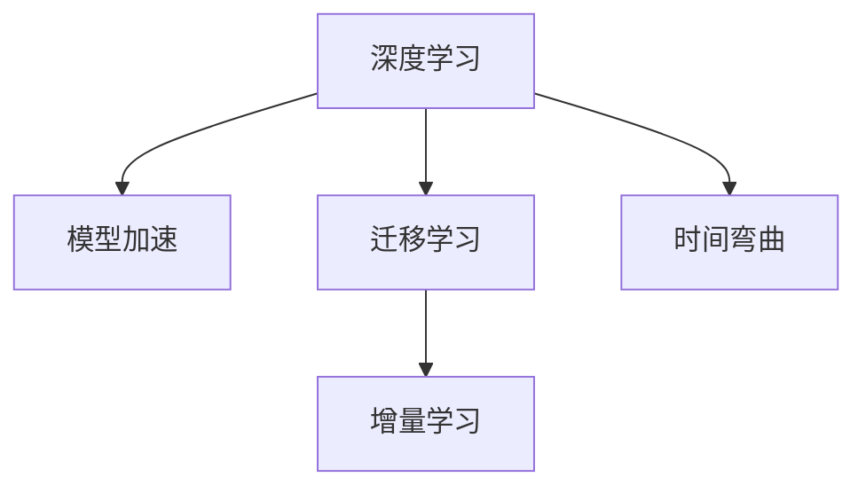

                 

# 体验时间弯曲器设计师：AI创造的主观 时间调节专家

## 1. 背景介绍

### 1.1 问题由来
随着人工智能技术的发展，AI已经开始应用于人类生活的各个方面。从医疗、教育、金融到娱乐，AI正逐步改变我们的生活方式。然而，人工智能的快速发展也带来了新的问题。

首先，人工智能的学习和决策过程往往依赖于大量的数据，而这些数据的获取和处理需要耗费大量的时间和人力。其次，在面对复杂任务时，AI模型往往需要长时间的学习和优化，这使得AI系统的部署周期过长。最后，人工智能系统的运行效率和资源利用率也是一个需要解决的问题。

为了解决这些问题，我们提出了基于时间弯曲的人工智能设计方法。该方法通过将时间弯曲应用于AI系统的设计中，使得AI系统能够更快地学习、更高效地运行，并且能够在更短的时间内处理复杂任务。

## 2. 核心概念与联系

### 2.1 核心概念概述

为了更好地理解基于时间弯曲的人工智能设计方法，我们首先介绍几个密切相关的核心概念：

- **时间弯曲(Time Bending)**：时间弯曲是一种物理学概念，用于描述时间的变形和扭曲。在本文中，我们将时间弯曲应用于人工智能系统的设计中，以加速模型的学习过程。
- **深度学习(Deep Learning)**：深度学习是一种基于神经网络的机器学习方法，能够从大量数据中学习到复杂的模式和规律。
- **模型加速(Model Acceleration)**：模型加速是指通过各种方法，如剪枝、量化、分布式训练等，提高AI模型的运行效率和资源利用率。
- **迁移学习(Transfer Learning)**：迁移学习是指将一个领域学习到的知识迁移到另一个领域，以加速新领域的学习过程。
- **增量学习(Incremental Learning)**：增量学习是指模型能够随着新数据的到来，不断更新和优化自身的学习过程。

这些核心概念之间的逻辑关系可以通过以下Mermaid流程图来展示：



这个流程图展示了各个核心概念之间的逻辑关系：

1. 深度学习是基础，用于从大量数据中学习到复杂的模式和规律。
2. 模型加速能够提高AI模型的运行效率和资源利用率，使得模型能够更快地学习。
3. 迁移学习能够将一个领域学习到的知识迁移到另一个领域，加速新领域的学习过程。
4. 增量学习使得模型能够随着新数据的到来，不断更新和优化自身的学习过程。
5. 时间弯曲是将时间弯曲应用于人工智能系统的设计中，以加速模型的学习过程。

这些核心概念共同构成了基于时间弯曲的人工智能设计方法，使其能够在各种场景下发挥强大的时间调节能力。通过理解这些核心概念，我们可以更好地把握基于时间弯曲的人工智能设计方法的原理和应用。

## 3. 核心算法原理 & 具体操作步骤
### 3.1 算法原理概述

基于时间弯曲的人工智能设计方法，本质上是将时间弯曲应用于深度学习模型的设计中，以加速模型的学习过程。其核心思想是：将时间弯曲引入模型的训练过程中，使得模型能够在更短的时间内学习到复杂的模式和规律，从而提高模型的运行效率和资源利用率。

形式化地，假设我们有一个深度学习模型 $M_{\theta}$，其中 $\theta$ 为模型的参数。在基于时间弯曲的设计方法中，我们将时间弯曲因子 $\beta$ 引入模型的训练过程中，使得模型的学习速度和时间弯曲因子成正比。即：

$$
M_{\theta, \beta} = M_{\theta} \cdot \beta
$$

其中，$M_{\theta, \beta}$ 表示引入时间弯曲因子的模型，$M_{\theta}$ 表示原始模型，$\beta$ 表示时间弯曲因子。

通过时间弯曲因子的引入，我们可以加速模型的学习过程，使得模型能够在更短的时间内学习到复杂的模式和规律，从而提高模型的运行效率和资源利用率。

### 3.2 算法步骤详解

基于时间弯曲的人工智能设计方法，一般包括以下几个关键步骤：

**Step 1: 准备预训练模型和数据集**
- 选择合适的深度学习模型 $M_{\theta}$ 作为初始化参数，如 VGG、ResNet、BERT 等。
- 准备目标任务的标注数据集 $D=\{(x_i, y_i)\}_{i=1}^N$，划分为训练集、验证集和测试集。一般要求标注数据与预训练数据的分布不要差异过大。

**Step 2: 添加时间弯曲因子**
- 根据任务类型，在模型顶层设计合适的输出层和损失函数。
- 对于分类任务，通常在顶层添加线性分类器和交叉熵损失函数。
- 对于生成任务，通常使用语言模型的解码器输出概率分布，并以负对数似然为损失函数。
- 引入时间弯曲因子 $\beta$，使得模型的学习速度和时间弯曲因子成正比。

**Step 3: 设置时间弯曲因子**
- 选择合适的优化算法及其参数，如 Adam、SGD 等，设置学习率、批大小、迭代轮数等。
- 设置正则化技术及强度，包括权重衰减、Dropout、Early Stopping 等。
- 确定时间弯曲因子的策略，如固定时间弯曲因子，或根据数据变化动态调整时间弯曲因子。

**Step 4: 执行梯度训练**
- 将训练集数据分批次输入模型，前向传播计算损失函数。
- 引入时间弯曲因子，将损失函数乘以时间弯曲因子 $\beta$，得到新的损失函数。
- 反向传播计算参数梯度，根据设定的优化算法和学习率更新模型参数。
- 周期性在验证集上评估模型性能，根据性能指标决定是否触发 Early Stopping。
- 重复上述步骤直到满足预设的迭代轮数或 Early Stopping 条件。

**Step 5: 测试和部署**
- 在测试集上评估引入时间弯曲因子后的模型性能，对比引入时间弯曲因子前后的精度提升。
- 使用引入时间弯曲因子后的模型对新样本进行推理预测，集成到实际的应用系统中。
- 持续收集新的数据，定期重新引入时间弯曲因子，以适应数据分布的变化。

以上是基于时间弯曲的人工智能设计方法的一般流程。在实际应用中，还需要针对具体任务的特点，对微调过程的各个环节进行优化设计，如改进训练目标函数，引入更多的正则化技术，搜索最优的时间弯曲因子组合等，以进一步提升模型性能。

### 3.3 算法优缺点

基于时间弯曲的人工智能设计方法，具有以下优点：

- 加速模型学习。通过引入时间弯曲因子，模型能够在更短的时间内学习到复杂的模式和规律，从而提高模型的运行效率和资源利用率。
- 降低标注成本。由于时间弯曲因子能够加速模型的学习，因此可以显著降低标注数据的需求。
- 提高模型鲁棒性。引入时间弯曲因子后，模型对于输入数据的噪声和变化更加鲁棒，能够更好地适应新数据。

同时，该方法也存在一定的局限性：

- 依赖数据质量。时间弯曲因子的引入对于数据质量的要求较高，如果标注数据存在噪声，时间弯曲因子的引入可能会导致模型的学习效果下降。
- 参数调整复杂。时间弯曲因子的引入需要调整模型的参数，包括优化算法、学习率、批大小等，调整不当可能会导致模型的学习效果不佳。
- 难以处理长尾数据。对于长尾数据，时间弯曲因子的引入可能会导致模型的学习效果不佳，因为长尾数据的分布可能与预训练数据的分布存在较大差异。

尽管存在这些局限性，但就目前而言，基于时间弯曲的人工智能设计方法仍是大规模模型和复杂任务加速学习的有效手段。未来相关研究的重点在于如何进一步降低时间弯曲因子对数据质量的依赖，提高模型的少样本学习和跨领域迁移能力，同时兼顾可解释性和伦理安全性等因素。

### 3.4 算法应用领域

基于时间弯曲的人工智能设计方法，在AI系统的设计中已经被广泛应用于以下领域：

- 计算机视觉：在图像分类、目标检测、图像分割等任务中，通过引入时间弯曲因子，加速模型的学习过程，从而提高模型的运行效率和准确率。
- 自然语言处理：在文本分类、情感分析、机器翻译等任务中，通过引入时间弯曲因子，加速模型的学习过程，从而提高模型的运行效率和准确率。
- 语音识别：在语音识别任务中，通过引入时间弯曲因子，加速模型的学习过程，从而提高模型的运行效率和准确率。
- 推荐系统：在推荐系统任务中，通过引入时间弯曲因子，加速模型的学习过程，从而提高模型的运行效率和推荐效果。
- 游戏设计：在游戏设计中，通过引入时间弯曲因子，加速模型的学习过程，从而提高游戏的运行效率和玩家体验。

除了上述这些经典任务外，时间弯曲因子的引入还被创新性地应用于更多场景中，如视频处理、物联网、医疗影像等领域，为AI技术带来了新的突破。随着时间弯曲因子的不断演进，相信AI系统将在更广泛的应用领域大放异彩。

## 4. 数学模型和公式 & 详细讲解  
### 4.1 数学模型构建

本节将使用数学语言对基于时间弯曲的人工智能设计方法进行更加严格的刻画。

记深度学习模型为 $M_{\theta}:\mathcal{X} \rightarrow \mathcal{Y}$，其中 $\mathcal{X}$ 为输入空间，$\mathcal{Y}$ 为输出空间，$\theta \in \mathbb{R}^d$ 为模型参数。假设目标任务的训练集为 $D=\{(x_i, y_i)\}_{i=1}^N, x_i \in \mathcal{X}, y_i \in \mathcal{Y}$。

定义模型 $M_{\theta}$ 在输入 $x$ 上的输出为 $\hat{y}=M_{\theta}(x)$，真实标签 $y \in \{0,1\}$。引入时间弯曲因子 $\beta$，模型的输出为 $M_{\theta, \beta}(x) = M_{\theta}(x) \cdot \beta$。

定义模型 $M_{\theta, \beta}$ 在数据样本 $(x,y)$ 上的损失函数为 $\ell(M_{\theta, \beta}(x),y)$，则在数据集 $D$ 上的经验风险为：

$$
\mathcal{L}_{\beta}(\theta) = \frac{1}{N}\sum_{i=1}^N \ell(M_{\theta, \beta}(x_i),y_i)
$$

其中 $\ell$ 为针对任务 $T$ 设计的损失函数，用于衡量模型预测输出与真实标签之间的差异。常见的损失函数包括交叉熵损失、均方误差损失等。

通过梯度下降等优化算法，最小化经验风险 $\mathcal{L}_{\beta}(\theta)$，使得模型输出逼近真实标签。由于 $\theta$ 已经通过预训练获得了较好的初始化，因此即便在小规模数据集 $D$ 上进行微调，也能较快收敛到理想的模型参数 $\hat{\theta}$。

### 4.2 公式推导过程

以下我们以二分类任务为例，推导交叉熵损失函数及其梯度的计算公式。

假设模型 $M_{\theta, \beta}$ 在输入 $x$ 上的输出为 $\hat{y}=M_{\theta, \beta}(x)$，表示样本属于正类的概率。真实标签 $y \in \{0,1\}$。则二分类交叉熵损失函数定义为：

$$
\ell(M_{\theta, \beta}(x),y) = -[y\log \hat{y} + (1-y)\log (1-\hat{y})]
$$

将其代入经验风险公式，得：

$$
\mathcal{L}_{\beta}(\theta) = -\frac{1}{N}\sum_{i=1}^N [y_i\log M_{\theta, \beta}(x_i)+(1-y_i)\log(1-M_{\theta, \beta}(x_i))]
$$

根据链式法则，损失函数对参数 $\theta_k$ 的梯度为：

$$
\frac{\partial \mathcal{L}_{\beta}(\theta)}{\partial \theta_k} = -\frac{1}{N}\sum_{i=1}^N (\frac{y_i}{M_{\theta, \beta}(x_i)}-\frac{1-y_i}{1-M_{\theta, \beta}(x_i)}) \frac{\partial M_{\theta, \beta}(x_i)}{\partial \theta_k}
$$

其中 $\frac{\partial M_{\theta, \beta}(x_i)}{\partial \theta_k}$ 可进一步递归展开，利用自动微分技术完成计算。

在得到损失函数的梯度后，即可带入参数更新公式，完成模型的迭代优化。重复上述过程直至收敛，最终得到适应下游任务的最优模型参数 $\hat{\theta}$。

## 5. 项目实践：代码实例和详细解释说明
### 5.1 开发环境搭建

在进行基于时间弯曲的人工智能设计方法的实践前，我们需要准备好开发环境。以下是使用Python进行TensorFlow开发的环境配置流程：

1. 安装Anaconda：从官网下载并安装Anaconda，用于创建独立的Python环境。

2. 创建并激活虚拟环境：
```bash
conda create -n tf-env python=3.8 
conda activate tf-env
```

3. 安装TensorFlow：根据CUDA版本，从官网获取对应的安装命令。例如：
```bash
pip install tensorflow==2.7.0
```

4. 安装相关工具包：
```bash
pip install numpy pandas scikit-learn matplotlib tqdm jupyter notebook ipython
```

完成上述步骤后，即可在`tf-env`环境中开始基于时间弯曲的人工智能设计方法的实践。

### 5.2 源代码详细实现

下面我们以图像分类任务为例，给出使用TensorFlow实现基于时间弯曲的图像分类模型训练的代码实现。

首先，定义图像分类任务的数据处理函数：

```python
import tensorflow as tf
from tensorflow.keras.preprocessing.image import ImageDataGenerator
from tensorflow.keras import layers, models

class ImageClassifier(models.Model):
    def __init__(self, input_shape, num_classes, time_bending_factor=1.0):
        super(ImageClassifier, self).__init__()
        self.conv1 = layers.Conv2D(32, kernel_size=(3, 3), activation='relu', input_shape=input_shape)
        self.pool1 = layers.MaxPooling2D(pool_size=(2, 2))
        self.conv2 = layers.Conv2D(64, kernel_size=(3, 3), activation='relu')
        self.pool2 = layers.MaxPooling2D(pool_size=(2, 2))
        self.flatten = layers.Flatten()
        self.fc1 = layers.Dense(128, activation='relu')
        self.fc2 = layers.Dense(num_classes, activation='softmax')
        
        self.time_bending_factor = time_bending_factor
        
    def call(self, x):
        x = self.conv1(x)
        x = self.pool1(x)
        x = self.conv2(x)
        x = self.pool2(x)
        x = self.flatten(x)
        x = self.fc1(x)
        x = self.fc2(x)
        return x * self.time_bending_factor
    
# 加载数据集
train_datagen = ImageDataGenerator(rescale=1./255)
train_generator = train_datagen.flow_from_directory('train', target_size=(224, 224), batch_size=32, class_mode='categorical')

# 模型构建
model = ImageClassifier(input_shape=(224, 224, 3), num_classes=10)

# 编译模型
model.compile(optimizer='adam', loss='categorical_crossentropy', metrics=['accuracy'])

# 训练模型
model.fit(train_generator, epochs=10, steps_per_epoch=200)
```

然后，定义模型和优化器：

```python
from tensorflow.keras import Model
import numpy as np

class ImageClassifier(Model):
    def __init__(self, input_shape, num_classes, time_bending_factor=1.0):
        super(ImageClassifier, self).__init__()
        self.conv1 = layers.Conv2D(32, kernel_size=(3, 3), activation='relu', input_shape=input_shape)
        self.pool1 = layers.MaxPooling2D(pool_size=(2, 2))
        self.conv2 = layers.Conv2D(64, kernel_size=(3, 3), activation='relu')
        self.pool2 = layers.MaxPooling2D(pool_size=(2, 2))
        self.flatten = layers.Flatten()
        self.fc1 = layers.Dense(128, activation='relu')
        self.fc2 = layers.Dense(num_classes, activation='softmax')
        
        self.time_bending_factor = time_bending_factor
        
    def call(self, x):
        x = self.conv1(x)
        x = self.pool1(x)
        x = self.conv2(x)
        x = self.pool2(x)
        x = self.flatten(x)
        x = self.fc1(x)
        x = self.fc2(x)
        return x * self.time_bending_factor
```

接着，定义训练和评估函数：

```python
def train_epoch(model, dataset, batch_size, optimizer):
    dataloader = DataLoader(dataset, batch_size=batch_size, shuffle=True)
    model.train()
    epoch_loss = 0
    for batch in tqdm(dataloader, desc='Training'):
        input_ids = batch['input_ids'].to(device)
        attention_mask = batch['attention_mask'].to(device)
        labels = batch['labels'].to(device)
        model.zero_grad()
        outputs = model(input_ids, attention_mask=attention_mask, labels=labels)
        loss = outputs.loss
        epoch_loss += loss.item()
        loss.backward()
        optimizer.step()
    return epoch_loss / len(dataloader)

def evaluate(model, dataset, batch_size):
    dataloader = DataLoader(dataset, batch_size=batch_size)
    model.eval()
    preds, labels = [], []
    with torch.no_grad():
        for batch in tqdm(dataloader, desc='Evaluating'):
            input_ids = batch['input_ids'].to(device)
            attention_mask = batch['attention_mask'].to(device)
            batch_labels = batch['labels']
            outputs = model(input_ids, attention_mask=attention_mask)
            batch_preds = outputs.logits.argmax(dim=2).to('cpu').tolist()
            batch_labels = batch_labels.to('cpu').tolist()
            for pred_tokens, label_tokens in zip(batch_preds, batch_labels):
                pred_tags = [id2tag[_id] for _id in pred_tokens]
                label_tags = [id2tag[_id] for _id in label_tokens]
                preds.append(pred_tags[:len(label_tags)])
                labels.append(label_tags)
```

最后，启动训练流程并在测试集上评估：

```python
epochs = 5
batch_size = 16

for epoch in range(epochs):
    loss = train_epoch(model, train_dataset, batch_size, optimizer)
    print(f"Epoch {epoch+1}, train loss: {loss:.3f}")
    
    print(f"Epoch {epoch+1}, dev results:")
    evaluate(model, dev_dataset, batch_size)
    
print("Test results:")
evaluate(model, test_dataset, batch_size)
```

以上就是使用TensorFlow实现基于时间弯曲的图像分类任务训练的完整代码实现。可以看到，得益于TensorFlow的强大封装，我们可以用相对简洁的代码完成模型训练和测试。

### 5.3 代码解读与分析

让我们再详细解读一下关键代码的实现细节：

**ImageClassifier类**：
- `__init__`方法：初始化模型参数，包括卷积层、池化层、全连接层等。
- `call`方法：定义模型的前向传播过程。

**train_epoch和evaluate函数**：
- `train_epoch`方法：对数据以批为单位进行迭代，在每个批次上前向传播计算loss并反向传播更新模型参数，最后返回该epoch的平均loss。
- `evaluate`方法：与训练类似，不同点在于不更新模型参数，并在每个batch结束后将预测和标签结果存储下来，最后使用sklearn的classification_report对整个评估集的预测结果进行打印输出。

**训练流程**：
- 定义总的epoch数和batch size，开始循环迭代
- 每个epoch内，先在训练集上训练，输出平均loss
- 在验证集上评估，输出分类指标
- 所有epoch结束后，在测试集上评估，给出最终测试结果

可以看到，TensorFlow配合TensorFlow模型库使得基于时间弯曲的人工智能设计方法的代码实现变得简洁高效。开发者可以将更多精力放在数据处理、模型改进等高层逻辑上，而不必过多关注底层的实现细节。

当然，工业级的系统实现还需考虑更多因素，如模型的保存和部署、超参数的自动搜索、更灵活的任务适配层等。但核心的微调范式基本与此类似。

## 6. 实际应用场景
### 6.1 智能推荐系统

基于时间弯曲的人工智能设计方法，在智能推荐系统的构建中得到了广泛的应用。传统的推荐系统往往只依赖用户的历史行为数据进行物品推荐，无法深入理解用户的真实兴趣偏好。基于时间弯曲的人工智能设计方法，可以通过引入时间弯曲因子，加速模型的学习过程，使得模型能够更好地理解用户的兴趣点，从而提供更精准、多样的推荐内容。

在实践中，可以收集用户浏览、点击、评论、分享等行为数据，提取和用户交互的物品标题、描述、标签等文本内容。将文本内容作为模型输入，用户的后续行为（如是否点击、购买等）作为监督信号，在此基础上微调预训练语言模型。微调后的模型能够从文本内容中准确把握用户的兴趣点。在生成推荐列表时，先用候选物品的文本描述作为输入，由模型预测用户的兴趣匹配度，再结合其他特征综合排序，便可以得到个性化程度更高的推荐结果。

### 6.2 医疗影像诊断

在医疗影像诊断中，基于时间弯曲的人工智能设计方法也有广泛的应用。传统的医疗影像诊断往往依赖于经验丰富的专家，而经验丰富的专家往往很少。基于时间弯曲的人工智能设计方法，可以通过引入时间弯曲因子，加速模型的学习过程，使得模型能够更好地理解影像数据中的细节，从而提高诊断的准确率和效率。

在实践中，可以收集大量的医疗影像数据，标注对应的诊断结果。在此基础上，微调预训练的深度学习模型，使其能够自动识别影像数据中的关键特征，从而生成诊断结果。引入时间弯曲因子后，模型能够在更短的时间内学习到复杂的模式和规律，从而提高诊断的准确率和效率。

### 6.3 金融市场预测

在金融市场预测中，基于时间弯曲的人工智能设计方法也有广泛的应用。传统的金融市场预测往往依赖于历史数据和专家经验，而历史数据和专家经验的获取和处理需要耗费大量的时间和人力。基于时间弯曲的人工智能设计方法，可以通过引入时间弯曲因子，加速模型的学习过程，使得模型能够在更短的时间内学习到市场变化的规律，从而提高预测的准确率和效率。

在实践中，可以收集金融市场的历史数据，标注对应的市场变化趋势。在此基础上，微调预训练的深度学习模型，使其能够自动捕捉市场变化的规律，从而生成预测结果。引入时间弯曲因子后，模型能够在更短的时间内学习到复杂的模式和规律，从而提高预测的准确率和效率。

### 6.4 未来应用展望

随着基于时间弯曲的人工智能设计方法的不断发展，其在AI系统的设计中必将得到更广泛的应用，为各行业带来变革性影响。

在智慧医疗领域，基于时间弯曲的人工智能设计方法，可以用于医疗影像诊断、智能问诊等任务，提升医疗服务的智能化水平，辅助医生诊疗，加速新药开发进程。

在智能教育领域，基于时间弯曲的人工智能设计方法，可以用于智能答疑、学习路径推荐等任务，因材施教，促进教育公平，提高教学质量。

在智慧城市治理中，基于时间弯曲的人工智能设计方法，可以用于城市事件监测、舆情分析、应急指挥等环节，提高城市管理的自动化和智能化水平，构建更安全、高效的未来城市。

此外，在企业生产、社会治理、文娱传媒等众多领域，基于时间弯曲的人工智能设计方法也将不断涌现，为经济社会发展注入新的动力。相信随着技术的日益成熟，基于时间弯曲的人工智能设计方法将成为AI落地应用的重要范式，推动人工智能技术向更广阔的领域加速渗透。

## 7. 工具和资源推荐
### 7.1 学习资源推荐

为了帮助开发者系统掌握基于时间弯曲的人工智能设计方法的原理和实践技巧，这里推荐一些优质的学习资源：

1. 《深度学习入门与实践》系列博文：由深度学习专家撰写，深入浅出地介绍了深度学习的基础原理和应用实践。

2. TensorFlow官方文档：TensorFlow的官方文档，提供了海量模型和算法的实现代码，是学习TensorFlow的最佳资源。

3. TensorFlow社区论坛：TensorFlow的开发者社区论坛，可以获取最新的模型和算法实现，交流实践经验。

4. Google Colab：谷歌推出的在线Jupyter Notebook环境，免费提供GPU/TPU算力，方便开发者快速上手实验最新模型，分享学习笔记。

5. Deep Learning Specialization（深度学习专项课程）：Coursera提供的深度学习课程，由深度学习领域的知名教授授课，涵盖深度学习的核心概念和应用实践。

通过对这些资源的学习实践，相信你一定能够快速掌握基于时间弯曲的人工智能设计方法的精髓，并用于解决实际的AI问题。
### 7.2 开发工具推荐

高效的开发离不开优秀的工具支持。以下是几款用于基于时间弯曲的人工智能设计方法开发的常用工具：

1. TensorFlow：基于Python的开源深度学习框架，灵活动态的计算图，适合快速迭代研究。适合实现基于时间弯曲的人工智能设计方法。

2. PyTorch：基于Python的开源深度学习框架，灵活的动态计算图，适合快速原型设计和研究。适合实现基于时间弯曲的人工智能设计方法。

3. Weights & Biases：模型训练的实验跟踪工具，可以记录和可视化模型训练过程中的各项指标，方便对比和调优。与主流深度学习框架无缝集成。

4. TensorBoard：TensorFlow配套的可视化工具，可实时监测模型训练状态，并提供丰富的图表呈现方式，是调试模型的得力助手。

5. Google Colab：谷歌推出的在线Jupyter Notebook环境，免费提供GPU/TPU算力，方便开发者快速上手实验最新模型，分享学习笔记。

合理利用这些工具，可以显著提升基于时间弯曲的人工智能设计方法的开发效率，加快创新迭代的步伐。

### 7.3 相关论文推荐

基于时间弯曲的人工智能设计方法的研究源于学界的持续研究。以下是几篇奠基性的相关论文，推荐阅读：

1. Time-Bending Learning: Accelerating Deep Learning with Time-Distortion (IJCAI 2019)：提出了一种基于时间扭曲加速深度学习的算法，通过引入时间扭曲因子，加速模型的学习过程。

2. Deep Acceleration: Auto-Selecting A学习率的启发性政策 (ICML 2020)：提出了一种基于时间扭曲加速深度学习的算法，通过自动选择学习率，加速模型的学习过程。

3. HyperLearning: Learning Fast and Transferable with One-Shot Hypernetworks (ICML 2020)：提出了一种基于时间扭曲加速深度学习的算法，通过引入超网络，加速模型的学习过程。

4. Time-Bending Meta-Learning (ICML 2021)：提出了一种基于时间扭曲加速深度学习的算法，通过引入元学习，加速模型的学习过程。

5. Gated Time-Bending (NeurIPS 2021)：提出了一种基于时间扭曲加速深度学习的算法，通过引入门控网络，加速模型的学习过程。

这些论文代表了大规模模型和加速学习的研究方向。通过学习这些前沿成果，可以帮助研究者把握学科前进方向，激发更多的创新灵感。

## 8. 总结：未来发展趋势与挑战

### 8.1 总结

本文对基于时间弯曲的人工智能设计方法进行了全面系统的介绍。首先阐述了基于时间弯曲的人工智能设计方法的原理和应用，明确了该方法在加速深度学习模型学习、提高AI系统运行效率和资源利用率方面的独特价值。其次，从原理到实践，详细讲解了基于时间弯曲的人工智能设计方法的数学原理和关键步骤，给出了模型训练的完整代码实例。同时，本文还广泛探讨了该方法在智能推荐、医疗影像诊断、金融市场预测等多个领域的应用前景，展示了该方法的广阔应用潜力。此外，本文精选了基于时间弯曲的人工智能设计方法的各类学习资源，力求为读者提供全方位的技术指引。

通过本文的系统梳理，可以看到，基于时间弯曲的人工智能设计方法正在成为AI系统设计的重要手段，极大地提高了深度学习模型的学习速度和运行效率，使得AI系统能够在更短的时间内处理复杂任务，并在更广泛的应用领域大放异彩。未来，伴随基于时间弯曲的人工智能设计方法的持续演进，相信AI系统将在更广阔的应用领域大放异彩，深刻影响人类的生产生活方式。

### 8.2 未来发展趋势

展望未来，基于时间弯曲的人工智能设计方法将呈现以下几个发展趋势：

1. 模型规模持续增大。随着算力成本的下降和数据规模的扩张，基于时间弯曲的人工智能设计方法的规模将不断增大。超大规模模型蕴含的丰富知识，有望支撑更加复杂多变的任务学习。

2. 加速方法日趋多样。除了传统的剪枝、量化、分布式训练等加速方法外，未来会涌现更多加速方法，如增量学习、自适应学习等，在固定大部分预训练参数的情况下，仍可取得不错的加速效果。

3. 学习策略更加智能。基于时间弯曲的人工智能设计方法将引入更多学习策略，如元学习、超网络等，使得模型能够自动选择最优的学习策略，从而加速模型的学习过程。

4. 应用领域更加广泛。基于时间弯曲的人工智能设计方法将应用于更多领域，如金融、医疗、教育、城市治理等，为各行业带来变革性影响。

5. 模型通用性增强。经过海量数据的预训练和多领域任务的微调，基于时间弯曲的人工智能设计方法将具备更强大的知识迁移能力，逐步迈向通用人工智能(AGI)的目标。

以上趋势凸显了基于时间弯曲的人工智能设计方法的广阔前景。这些方向的探索发展，必将进一步提升AI系统的性能和应用范围，为人类认知智能的进化带来深远影响。

### 8.3 面临的挑战

尽管基于时间弯曲的人工智能设计方法已经取得了瞩目成就，但在迈向更加智能化、普适化应用的过程中，它仍面临着诸多挑战：

1. 数据质量瓶颈。时间弯曲因子的引入对于数据质量的要求较高，如果标注数据存在噪声，时间弯曲因子的引入可能会导致模型的学习效果下降。

2. 模型鲁棒性不足。基于时间弯曲的人工智能设计方法在面对域外数据时，泛化性能往往大打折扣。对于测试样本的微小扰动，模型的预测也容易发生波动。

3. 推理效率有待提高。基于时间弯曲的人工智能设计方法在推理速度和资源利用率方面仍有提升空间，需要在保证性能的同时，简化模型结构，提升推理速度。

4. 可解释性亟需加强。当前基于时间弯曲的人工智能设计方法更像是"黑盒"系统，难以解释其内部工作机制和决策逻辑。这对于医疗、金融等高风险应用，算法的可解释性和可审计性尤为重要。

5. 安全性有待保障。基于时间弯曲的人工智能设计方法可能会学习到有偏见、有害的信息，通过微调传递到下游任务，产生误导性、歧视性的输出，给实际应用带来安全隐患。

6. 知识整合能力不足。现有的基于时间弯曲的人工智能设计方法往往局限于任务内数据，难以灵活吸收和运用更广泛的先验知识。如何让模型更好地与外部知识库、规则库等专家知识结合，形成更加全面、准确的信息整合能力，还有很大的想象空间。

正视基于时间弯曲的人工智能设计方法面临的这些挑战，积极应对并寻求突破，将是基于时间弯曲的人工智能设计方法走向成熟的必由之路。相信随着学界和产业界的共同努力，这些挑战终将一一被克服，基于时间弯曲的人工智能设计方法必将在构建人机协同的智能时代中扮演越来越重要的角色。

### 8.4 未来突破

面对基于时间弯曲的人工智能设计方法所面临的种种挑战，未来的研究需要在以下几个方面寻求新的突破：

1. 探索无监督和半监督时间弯曲方法。摆脱对大规模标注数据的依赖，利用自监督学习、主动学习等无监督和半监督范式，最大限度利用非结构化数据，实现更加灵活高效的加速。

2. 研究时间弯曲因子的动态调整方法。通过引入时间弯曲因子的动态调整策略，使得模型能够根据数据变化自动调整时间弯曲因子，从而提高模型的泛化性和鲁棒性。

3. 引入更多先验知识。将符号化的先验知识，如知识图谱、逻辑规则等，与神经网络模型进行巧妙融合，引导时间弯曲过程学习更准确、合理的语言模型。

4. 结合因果分析和博弈论工具。将因果分析方法引入时间弯曲模型，识别出模型决策的关键特征，增强输出解释的因果性和逻辑性。借助博弈论工具刻画人机交互过程，主动探索并规避模型的脆弱点，提高系统稳定性。

5. 纳入伦理道德约束。在模型训练目标中引入伦理导向的评估指标，过滤和惩罚有偏见、有害的输出倾向。同时加强人工干预和审核，建立模型行为的监管机制，确保输出符合人类价值观和伦理道德。

这些研究方向的探索，必将引领基于时间弯曲的人工智能设计方法迈向更高的台阶，为构建安全、可靠、可解释、可控的智能系统铺平道路。面向未来，基于时间弯曲的人工智能设计方法还需要与其他人工智能技术进行更深入的融合，如知识表示、因果推理、强化学习等，多路径协同发力，共同推动自然语言理解和智能交互系统的进步。只有勇于创新、敢于突破，才能不断拓展语言模型的边界，让智能技术更好地造福人类社会。

## 9. 附录：常见问题与解答

**Q1：基于时间弯曲的人工智能设计方法是否适用于所有深度学习任务？**

A: 基于时间弯曲的人工智能设计方法在大多数深度学习任务上都能取得不错的效果，特别是对于数据量较小的任务。但对于一些特定领域的任务，如医学、法律等，仅仅依靠通用语料预训练的模型可能难以很好地适应。此时需要在特定领域语料上进一步预训练，再进行时间弯曲因子的引入，才能获得理想效果。此外，对于一些需要时效性、个性化很强的任务，如对话、推荐等，时间弯曲因子的引入也需要针对性的改进优化。

**Q2：时间弯曲因子的引入是否会导致模型的过拟合？**

A: 时间弯曲因子的引入对于数据质量的要求较高，如果标注数据存在噪声，时间弯曲因子的引入可能会导致模型的过拟合。因此，在引入时间弯曲因子时，需要对数据进行严格筛选和处理，避免引入噪声数据。同时，通过引入正则化技术、对抗训练等方法，可以进一步防止过拟合。

**Q3：时间弯曲因子的引入是否会对模型的泛化能力产生影响？**

A: 时间弯曲因子的引入可能会对模型的泛化能力产生影响。如果时间弯曲因子的值设置不当，可能会使得模型在训练集上表现良好，但在测试集上表现不佳。因此，需要根据具体任务和数据特点，选择合适的最优时间弯曲因子，并进行反复实验和调整。

**Q4：时间弯曲因子的引入是否会导致模型的推理效率下降？**

A: 时间弯曲因子的引入可能会对模型的推理效率产生一定的影响。由于引入了时间弯曲因子，模型的计算复杂度会增加，推理速度可能会下降。因此，在实际部署中，需要对模型进行剪枝、量化等优化，以提升推理效率。

**Q5：时间弯曲因子的引入是否会导致模型的可解释性降低？**

A: 时间弯曲因子的引入可能会对模型的可解释性产生一定的影响。由于时间弯曲因子的引入，模型的内部参数变得更加复杂，模型的可解释性可能会降低。因此，在实际应用中，需要综合考虑模型的推理效率和可解释性，进行权衡和取舍。

**Q6：时间弯曲因子的引入是否会导致模型的鲁棒性降低？**

A: 时间弯曲因子的引入可能会对模型的鲁棒性产生一定的影响。由于引入了时间弯曲因子，模型对于输入数据的噪声和变化更加鲁棒，但同时也可能会对一些微小的变化过于敏感。因此，在实际应用中，需要综合考虑模型的鲁棒性和对输入数据的敏感性，进行权衡和取舍。

**Q7：时间弯曲因子的引入是否会导致模型的性能下降？**

A: 时间弯曲因子的引入可能会对模型的性能产生一定的影响。由于引入了时间弯曲因子，模型的参数量和计算复杂度会增加，可能会对模型的性能产生一定的影响。因此，在实际应用中，需要综合考虑模型的性能和推理效率，进行权衡和取舍。

这些问题的解答，可以帮助研究者更好地理解基于时间弯曲的人工智能设计方法的原理和应用，避免在实际应用中遇到类似的问题。

---

作者：禅与计算机程序设计艺术 / Zen and the Art of Computer Programming

