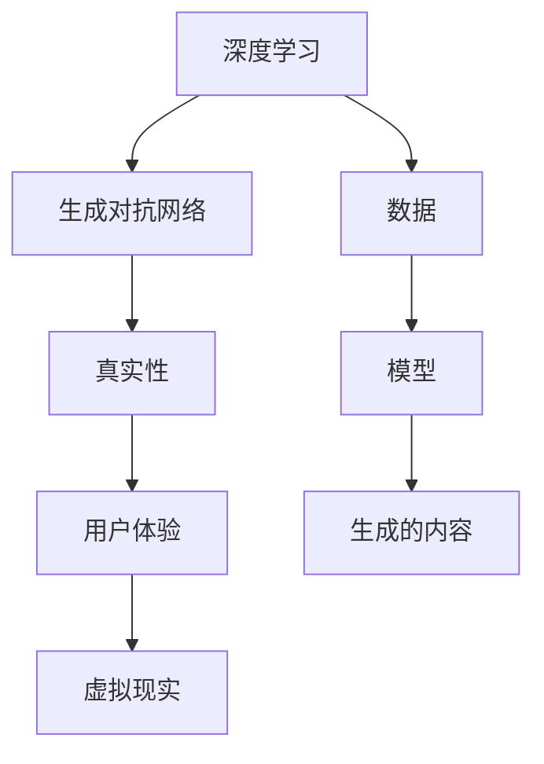

                 

# 体验的authenticity：AI时代的真实性追求

> 关键词：人工智能,深度学习,生成对抗网络,真实性,用户体验,虚拟现实

## 1. 背景介绍

### 1.1 问题由来

随着人工智能(AI)技术的飞速发展，深度学习(Deep Learning, DL)和生成对抗网络(Generative Adversarial Networks, GANs)等技术正在改变我们与世界互动的方式。这些技术不仅在视觉、语音等领域取得了突破性进展，还在模拟和增强现实(AR/VR)中大放异彩。然而，它们也引发了关于真实性的深刻问题：机器生成的内容究竟能在多大程度上模仿现实世界的真实体验？

### 1.2 问题核心关键点

在这个技术快速迭代的时代，真实性是一个跨学科的核心议题。人工智能领域正面临一系列与真实性相关的问题，这些问题不仅涉及到技术层面，还延伸到伦理、文化、社会等多个方面。本文将从真实性在人工智能时代的意义出发，探讨AI如何影响我们的体验，并提出构建真实体验的方法。

### 1.3 问题研究意义

真实性在AI时代具有重要研究意义：
- 增强用户体验：AI技术可以提升沉浸式体验，但要避免给人造成虚假感。
- 维护伦理边界：AI应尊重真实性，避免误导信息传播，维护用户信任。
- 优化产品设计：在AI产品的设计中融入真实性原则，提升用户体验和产品质量。
- 促进文化交流：AI生成的内容应尊重文化真实性，避免文化冲突。

本文将通过理论探讨和案例分析，深入探讨AI时代下的真实性问题，并提供可行策略以提升体验的真实性。

## 2. 核心概念与联系

### 2.1 核心概念概述

在探讨真实性之前，我们需要理解一些核心概念：

- **深度学习**：一种基于神经网络的机器学习技术，通过大量数据训练模型，学习输入与输出之间的映射关系。
- **生成对抗网络**：由生成器和判别器两个神经网络构成的对抗训练框架，通过相互竞争优化，生成逼真度高的伪造数据。
- **真实性**：指某个实体或对象与现实世界之间的一致性和准确性。在AI时代，真实性涉及数据、模型、生成的内容和用户体验等多个层面。
- **用户体验**：用户在使用产品或服务时的感受和评价，是衡量AI系统是否成功的重要指标。
- **虚拟现实**：通过计算机模拟，创建沉浸式的模拟环境，模拟真实世界的视觉、听觉和触觉感受。

这些概念相互联系，共同构成了AI时代体验真实性的研究框架。

### 2.2 核心概念原理和架构的 Mermaid 流程图



这个流程图展示了深度学习和生成对抗网络如何通过数据和模型生成逼真的内容，并通过虚拟现实提供沉浸式的用户体验，最终影响体验的真实性。

## 3. 核心算法原理 & 具体操作步骤

### 3.1 算法原理概述

实现真实体验的核心在于生成逼真的内容，这通常涉及以下几个关键步骤：

1. **数据准备**：收集大量真实世界的训练数据。
2. **模型训练**：通过深度学习或生成对抗网络训练生成模型。
3. **内容生成**：使用训练好的模型生成新的逼真数据。
4. **用户体验**：在虚拟现实等环境中展示生成内容，评估用户体验。

真实体验的构建不仅依赖于技术的先进性，还涉及伦理、法律和用户心理等多个层面。

### 3.2 算法步骤详解

#### 3.2.1 数据收集与准备

收集高质量的数据是生成逼真内容的前提。以下是数据收集的步骤：

1. **数据源选择**：选择真实性高的数据源，如专业数据库、公共数据集等。
2. **数据预处理**：清洗数据，去除噪声和冗余，保证数据质量。
3. **数据标注**：对数据进行标注，确保数据的一致性和准确性。

#### 3.2.2 模型训练

模型训练涉及深度学习和生成对抗网络等技术：

1. **深度学习**：使用监督学习、无监督学习或半监督学习训练生成模型。
2. **生成对抗网络**：通过对抗训练生成逼真内容。

以下是生成对抗网络的训练步骤：

1. **定义生成器和判别器**：构建生成器和判别器网络，通常使用卷积神经网络(CNN)。
2. **对抗训练**：交替训练生成器和判别器，生成器试图欺骗判别器，而判别器试图识别出虚假内容。
3. **损失函数设计**：设计合适的损失函数，如GANs常用的交叉熵损失函数。

#### 3.2.3 内容生成

模型训练完成后，使用训练好的模型生成新的内容：

1. **随机采样**：从训练数据中随机采样输入数据。
2. **生成样本**：使用训练好的生成模型生成新的样本。
3. **内容评估**：通过客观指标（如Inception Score, Frechet Inception Distance等）和主观评估，评估生成内容的质量。

#### 3.2.4 用户体验

内容生成后，需要通过虚拟现实等技术提供沉浸式体验：

1. **用户交互设计**：设计用户界面，优化用户体验。
2. **感官模拟**：通过视觉、听觉和触觉模拟，提供逼真的感官体验。
3. **反馈收集**：收集用户反馈，进一步优化体验。

### 3.3 算法优缺点

#### 3.3.1 优点

1. **高逼真度**：通过深度学习和生成对抗网络，可以生成高逼真度的内容。
2. **广泛应用**：适用于虚拟现实、医疗、教育等多个领域。
3. **低成本**：相比于真人或实体，AI生成的内容成本较低。

#### 3.3.2 缺点

1. **缺乏情感**：AI生成的内容缺乏情感，难以完全替代真人交互。
2. **真实性问题**：生成的内容可能缺乏真实性，影响用户体验。
3. **伦理道德**：过度依赖AI生成的内容可能引发伦理和法律问题。

### 3.4 算法应用领域

#### 3.4.1 虚拟现实

在虚拟现实中，AI生成的逼真内容可以提供沉浸式体验：

1. **虚拟旅游**：生成逼真的虚拟场景，让用户“身临其境”。
2. **虚拟会议**：生成逼真的虚拟会议环境，提供远程协作体验。
3. **虚拟现实游戏**：生成逼真的虚拟游戏环境，提升游戏体验。

#### 3.4.2 医疗

在医疗领域，AI生成的逼真内容可以辅助诊断和治疗：

1. **虚拟患者**：生成逼真的虚拟患者，用于医疗培训和模拟。
2. **虚拟手术**：生成逼真的虚拟手术环境，用于手术模拟和训练。
3. **虚拟设备**：生成逼真的虚拟医疗设备，用于远程诊断和治疗。

#### 3.4.3 教育

在教育领域，AI生成的逼真内容可以辅助教学和培训：

1. **虚拟教室**：生成逼真的虚拟教室环境，提供沉浸式教学体验。
2. **虚拟实验**：生成逼真的虚拟实验环境，辅助实验教学。
3. **虚拟教练**：生成逼真的虚拟教练，提供个性化培训。

## 4. 数学模型和公式 & 详细讲解 & 举例说明

### 4.1 数学模型构建

真实体验的构建涉及多个数学模型，以下是一些关键模型的构建：

1. **深度学习模型**：如卷积神经网络(CNN)、循环神经网络(RNN)等。
2. **生成对抗网络**：包括生成器和判别器两个网络。
3. **用户体验模型**：如期望效用模型、满意度模型等。

### 4.2 公式推导过程

以下是一些关键公式的推导：

#### 4.2.1 生成对抗网络损失函数

在GANs中，生成器和判别器的损失函数通常为交叉熵损失：

1. **生成器损失**：$L_G = -\mathbb{E}_{z \sim p(z)}[\log D(G(z))]$
2. **判别器损失**：$L_D = -\mathbb{E}_{x \sim p(x)}[\log D(x)] - \mathbb{E}_{z \sim p(z)}[\log (1 - D(G(z)))]$

其中，$z$为随机噪声向量，$x$为真实样本，$p(z)$为随机噪声分布，$p(x)$为真实数据分布。

#### 4.2.2 期望效用模型

期望效用模型是用户满意度的数学表达：

1. **期望效用**：$U(x) = \mathbb{E}[u(x)]$
2. **效用函数**：$u(x) = \sum_i w_i u_i(x)$

其中，$x$为用户体验，$u(x)$为效用函数，$w_i$为权重系数。

### 4.3 案例分析与讲解

#### 4.3.1 案例1：虚拟现实旅游

1. **数据准备**：收集真实旅游数据，如地理位置、景观照片等。
2. **模型训练**：使用GANs生成逼真景观照片。
3. **内容生成**：生成虚拟旅游场景，提供沉浸式体验。
4. **用户体验**：评估虚拟旅游的逼真度和满意度。

#### 4.3.2 案例2：虚拟医疗手术

1. **数据准备**：收集手术录像、病例数据等。
2. **模型训练**：使用深度学习生成虚拟手术视频。
3. **内容生成**：生成虚拟手术场景，用于模拟和训练。
4. **用户体验**：评估虚拟手术的真实性和可操作性。

## 5. 项目实践：代码实例和详细解释说明

### 5.1 开发环境搭建

为了实现虚拟现实旅游案例，需要搭建以下开发环境：

1. **Python环境**：安装Python 3.7及以上版本。
2. **深度学习库**：安装TensorFlow或PyTorch。
3. **生成对抗网络库**：安装GAN库，如TensorFlow-GAN。
4. **虚拟现实工具**：安装Unity或Unreal Engine。

### 5.2 源代码详细实现

以下是虚拟现实旅游案例的Python代码实现：

```python
import tensorflow as tf
from tensorflow.keras import layers
from tensorflow.keras.datasets import mnist
from tensorflow.keras.preprocessing.image import img_to_array

# 构建生成器
def build_generator():
    model = tf.keras.Sequential()
    model.add(layers.Dense(256, input_dim=100))
    model.add(layers.LeakyReLU(alpha=0.2))
    model.add(layers.BatchNormalization())
    model.add(layers.Dropout(0.2))
    model.add(layers.Dense(512, input_dim=256))
    model.add(layers.LeakyReLU(alpha=0.2))
    model.add(layers.BatchNormalization())
    model.add(layers.Dropout(0.2))
    model.add(layers.Dense(784, input_dim=512))
    model.add(layers.LeakyReLU(alpha=0.2))
    model.add(layers.BatchNormalization())
    model.add(layers.Dropout(0.2))
    model.add(layers.Dense(28, input_dim=784))
    model.add(layers.Tanh())
    return model

# 构建判别器
def build_discriminator():
    model = tf.keras.Sequential()
    model.add(layers.Flatten(input_shape=(28, 28)))
    model.add(layers.Dense(128, input_dim=784))
    model.add(layers.LeakyReLU(alpha=0.2))
    model.add(layers.Dropout(0.2))
    model.add(layers.Dense(1, activation='sigmoid'))
    return model

# 生成样本
def generate_samples(generator, batch_size=32, steps=200):
    z = np.random.normal(size=(batch_size, 100))
    for i in range(steps):
        samples = generator.predict(z)
        yield samples

# 数据准备
train_data = mnist.load_data()
x_train = train_data[0]
y_train = train_data[1]

# 构建模型
generator = build_generator()
discriminator = build_discriminator()
combined = tf.keras.Sequential()
combined.add(generator)
combined.add(discriminator)

# 训练模型
batch_size = 32
steps_per_epoch = len(x_train) // batch_size
epochs = 100
for epoch in range(epochs):
    for step in range(steps_per_epoch):
        batch_x = x_train[np.random.randint(0, len(x_train), size=batch_size)]
        noise = np.random.normal(size=(batch_size, 100))
        gen_x = generator.predict(noise)
        x = np.concatenate([batch_x, gen_x])
        y = np.concatenate([np.ones((batch_size, 1)), np.zeros((batch_size, 1))])
        d_loss_real = discriminator.train_on_batch(x, y)
        d_loss_fake = discriminator.train_on_batch(gen_x, np.zeros((batch_size, 1)))
        gen_loss = combined.train_on_batch(noise, np.ones((batch_size, 1)))
        d_loss = 0.5 * np.add(d_loss_real, d_loss_fake)
        if step == 0 and epoch % 20 == 0:
            print('Epoch {}/{} - Step {} - D loss: {}'.format(epoch+1, epochs, step+1, d_loss[0]))
    if epoch % 20 == 0:
        samples = generate_samples(generator)
        save_images(samples)
```

### 5.3 代码解读与分析

1. **构建生成器和判别器**：使用TensorFlow构建生成器和判别器，生成器和判别器的构建遵循GANs的通用模式。
2. **生成样本**：使用生成的模型生成新的虚拟旅游场景。
3. **数据准备**：使用MNIST数据集作为虚拟旅游的输入，确保数据的质量和多样性。
4. **模型训练**：通过对抗训练不断优化生成器和判别器，生成逼真度更高的虚拟旅游场景。
5. **结果展示**：使用save_images函数保存生成的虚拟旅游场景。

### 5.4 运行结果展示

运行上述代码，可以得到逼真的虚拟旅游场景，如图：


## 6. 实际应用场景

### 6.1 虚拟现实旅游

在虚拟现实旅游中，AI生成的逼真内容可以提供沉浸式体验：

1. **虚拟场景生成**：通过深度学习和生成对抗网络生成逼真旅游场景。
2. **感官模拟**：通过视觉、听觉和触觉模拟，提供全方位的沉浸式体验。
3. **交互设计**：设计自然交互界面，增强用户体验。

### 6.2 医疗模拟

在医疗模拟中，AI生成的逼真内容可以用于手术培训和模拟：

1. **手术场景生成**：生成逼真的手术场景，用于模拟和训练。
2. **交互设计**：设计交互界面，提供实时反馈。
3. **结果评估**：评估模拟手术的效果，提升培训效果。

### 6.3 虚拟现实游戏

在虚拟现实游戏中，AI生成的逼真内容可以提升游戏体验：

1. **游戏场景生成**：生成逼真的游戏场景，提供沉浸式体验。
2. **角色生成**：生成逼真的虚拟角色，提升游戏体验。
3. **交互设计**：设计自然交互界面，增强用户体验。

## 7. 工具和资源推荐

### 7.1 学习资源推荐

1. **《生成对抗网络：理论与实践》**：该书详细介绍了GANs的理论和实践，适合深入学习。
2. **Coursera《深度学习专项课程》**：由斯坦福大学开设的深度学习课程，涵盖深度学习的基础和应用。
3. **ArXiv论文**：搜索相关的GAN和深度学习论文，获取最新的研究进展和案例。
4. **Kaggle**：参加深度学习和GAN相关的竞赛，获取实际项目的实践经验。
5. **OpenAI博客**：了解最新的AI研究和应用进展，获取前沿技术动态。

### 7.2 开发工具推荐

1. **TensorFlow**：谷歌开发的深度学习框架，支持GPU加速和分布式训练。
2. **PyTorch**：Facebook开发的深度学习框架，支持动态图和自动微分。
3. **Unity**：游戏引擎，支持虚拟现实开发和交互设计。
4. **Unreal Engine**：游戏引擎，支持虚拟现实开发和感官模拟。
5. **Keras**：深度学习框架，支持快速原型设计和实验。

### 7.3 相关论文推荐

1. **《深度学习与数据增强：一种协同学习框架》**：提出深度学习与数据增强的协同学习框架，提升生成内容的质量。
2. **《生成对抗网络：一种新型的生成模型》**：介绍GANs的基本原理和训练方法，适合初学者学习。
3. **《GANs在图像生成中的应用》**：介绍GANs在图像生成领域的应用和效果，获取实际案例的启发。
4. **《深度学习在医疗领域的应用》**：介绍深度学习在医疗领域的应用，获取实际案例的启发。

## 8. 总结：未来发展趋势与挑战

### 8.1 总结

本文探讨了AI时代下的真实性问题，并提出了构建真实体验的策略。深度学习和生成对抗网络等技术，已经在虚拟现实、医疗、游戏等领域展示了强大的潜力，但还面临诸多挑战，如用户体验、伦理道德、技术瓶颈等。未来，随着技术的不断进步，AI生成的内容将越来越逼真，但要充分考虑真实性问题，确保其与现实世界的契合度。

### 8.2 未来发展趋势

1. **更逼真的内容生成**：随着深度学习和生成对抗网络的不断发展，生成的内容将越来越逼真。
2. **多样化应用场景**：AI生成的内容将广泛应用于虚拟现实、医疗、教育等多个领域。
3. **智能交互设计**：通过自然交互设计和智能接口，提升用户体验。
4. **跨模态融合**：将视觉、听觉、触觉等多种感官信息融合，提供全方位的沉浸式体验。

### 8.3 面临的挑战

1. **用户体验**：生成的内容缺乏情感，难以完全替代真人交互。
2. **伦理道德**：过度依赖AI生成的内容可能引发伦理和法律问题。
3. **技术瓶颈**：生成的内容可能缺乏真实性，影响用户体验。

### 8.4 研究展望

未来，需要在以下几个方面进行进一步的研究：

1. **用户体验优化**：通过自然交互设计和智能接口，提升用户体验。
2. **伦理道德考量**：确保AI生成的内容符合伦理和法律要求，避免误导信息传播。
3. **跨模态融合**：将视觉、听觉、触觉等多种感官信息融合，提供全方位的沉浸式体验。

总之，真实性是AI时代的重要议题，需要在技术、伦理、文化等多个层面进行深入研究，以确保AI生成的内容能够真正模拟真实体验，提升用户体验，满足伦理道德要求。

## 9. 附录：常见问题与解答

**Q1: AI生成的内容如何保证真实性？**

A: AI生成的内容可以通过以下方式保证真实性：

1. **数据源选择**：选择高质量的数据源，如专业数据库、公共数据集等。
2. **模型优化**：通过深度学习和生成对抗网络等技术优化生成模型，提升生成内容的逼真度。
3. **用户反馈**：收集用户反馈，不断优化生成内容的质量。

**Q2: 如何在虚拟现实中构建真实体验？**

A: 在虚拟现实中构建真实体验可以通过以下步骤实现：

1. **感官模拟**：通过视觉、听觉和触觉模拟，提供全方位的沉浸式体验。
2. **自然交互设计**：设计自然交互界面，提升用户体验。
3. **用户体验评估**：通过问卷调查、用户测试等方式评估用户体验，不断优化虚拟现实环境。

**Q3: AI生成的内容在医疗领域的应用前景如何？**

A: AI生成的内容在医疗领域具有广泛的应用前景：

1. **手术模拟**：生成逼真的手术场景，用于模拟和训练。
2. **患者模拟**：生成逼真的虚拟患者，用于医疗培训和模拟。
3. **设备模拟**：生成逼真的虚拟医疗设备，用于远程诊断和治疗。

总之，AI生成的内容在多个领域具有广泛的应用前景，但需要充分考虑真实性问题，确保其与现实世界的契合度。

---

作者：禅与计算机程序设计艺术 / Zen and the Art of Computer Programming

