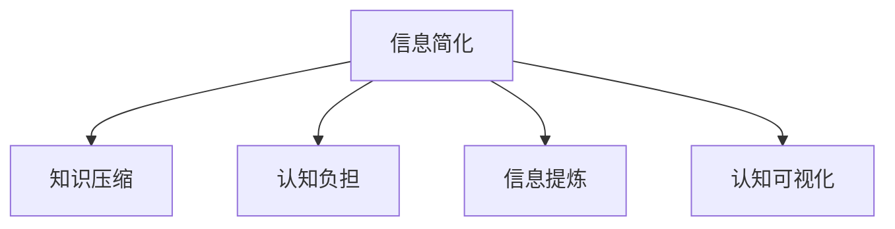

                 

# 信息简化的好处与实践：在复杂世界中简化以改善生活和决策

## 1. 背景介绍

### 1.1 问题由来
在当今信息爆炸的时代，我们每天需要处理大量的数据和信息，这些信息涵盖从工作、学习到生活各个方面。但是，信息量的增加并不意味着我们处理和理解信息的能力也相应提升。反而，过多的信息会降低我们的效率，增加我们的负担。如何简化信息、提高决策效率，成为现代社会迫切需要解决的问题。

### 1.2 问题核心关键点
简化的核心关键点在于通过减少不必要的复杂性，以提高效率和决策准确性。这涉及到两个方面：一方面，我们需要了解哪些信息是必要的，哪些可以省略；另一方面，我们需要掌握简化信息的方法，以便更高效地理解和应用这些信息。

### 1.3 问题研究意义
简化的意义在于帮助人们在信息泛滥的世界中保持清晰和专注。简化信息可以提升工作效率，减少决策错误，提高生活质量。此外，简化信息对于创新、研究和开发新应用也非常重要。通过简化复杂问题，可以发现新的解决方案和思维路径。

## 2. 核心概念与联系

### 2.1 核心概念概述

为更好地理解信息简化的原理和应用，本节将介绍几个核心概念：

- **信息简化(Information Simplification)**：指从大量复杂信息中提取出关键信息，去除冗余和噪声，使信息更加集中、易于理解和应用的过程。

- **知识压缩(Knowledge Compression)**：指通过算法将大量知识编码为更简洁的形式，便于存储、传播和应用。

- **认知负担(Cognitive Load)**：指个体处理信息时所需的认知资源，过多的信息会增加认知负担，降低处理效率。

- **信息提炼(Information Extraction)**：指从原始数据中提取有价值的信息，去除无关信息。

- **认知可视化(Cognitive Visualization)**：通过图表、图形等形式，将复杂信息直观展示，帮助理解和应用。

这些核心概念之间的逻辑关系可以通过以下Mermaid流程图来展示：



这个流程图展示了几大概念之间的逻辑关系：

1. 信息简化和知识压缩都是信息处理的手段，旨在从复杂信息中提取出有价值的内容。
2. 认知负担与信息简化密切相关，简化信息可以降低认知负担，提高处理效率。
3. 信息提炼是信息简化的具体实践，旨在提取关键信息。
4. 认知可视化是信息简化的可视化呈现方式，有助于理解和应用信息。

## 3. 核心算法原理 & 具体操作步骤
### 3.1 算法原理概述

信息简化的核心算法原理是通过数据挖掘和机器学习技术，识别并提取原始数据中的关键信息，去除冗余和噪声，最终输出简洁的信息摘要。常见的算法包括：

- **基于统计的简化方法**：通过统计分析，识别数据中的关键模式和规律，去除冗余和噪声。
- **基于机器学习的简化方法**：使用机器学习算法，如聚类、分类、回归等，提取关键特征和信息。
- **基于自然语言的简化方法**：使用自然语言处理技术，如文本摘要、语义分析等，提炼文本中的关键信息。

### 3.2 算法步骤详解

信息简化的算法步骤通常包括以下几个关键步骤：

**Step 1: 数据预处理**
- 清洗原始数据，去除无关和冗余信息。
- 标准化数据格式，以便后续处理。

**Step 2: 特征选择**
- 通过统计或机器学习算法，选择最有用的特征。
- 去除冗余和无关特征，减少信息量。

**Step 3: 数据建模**
- 使用机器学习算法，如决策树、随机森林、神经网络等，建立数据模型。
- 在模型中选择关键信息，去除噪声和冗余。

**Step 4: 信息提炼**
- 使用自然语言处理技术，如文本摘要、实体识别、情感分析等，提炼关键信息。
- 根据提炼结果，生成简洁的信息摘要。

**Step 5: 可视化呈现**
- 使用图表、图形等形式，将简化的信息直观展示。
- 根据展示结果，帮助理解和应用信息。

### 3.3 算法优缺点

信息简化的算法具有以下优点：
1. 提高信息处理效率。通过简化信息，减少不必要的认知负担，提高处理速度。
2. 提升决策准确性。去除噪声和冗余，提炼关键信息，提高决策的准确性。
3. 便于知识传播。简化的信息更易于理解和应用，便于知识的传播和共享。

同时，该算法也存在一定的局限性：
1. 依赖于原始数据的完整性和质量。如果原始数据存在大量错误和噪声，简化过程可能会引入偏差。
2. 简化过程可能丢失重要信息。过于简化可能会忽略某些关键信息，影响决策。
3. 算法复杂度较高。简化信息通常需要较复杂的算法和计算资源，可能不适用于所有场景。

尽管存在这些局限性，但信息简化算法在处理大规模数据和复杂信息时，依然显示出显著的优势。未来相关研究的重点在于如何进一步降低算法复杂度，提高简化过程的自动化程度，同时兼顾信息准确性和完整性。

### 3.4 算法应用领域

信息简化算法已经在许多领域得到广泛应用，包括：

- **商业分析**：通过简化和提炼业务数据，帮助企业发现潜在的商业机会和趋势。
- **金融分析**：对大量金融数据进行简化，帮助投资者进行更精准的投资决策。
- **医疗诊断**：从医学影像和病历中提炼关键信息，辅助医生进行诊断和治疗。
- **科学研究**：对大量实验数据进行简化，发现数据中的关键模式和规律。
- **信息检索**：通过简化和提炼文本内容，提高信息检索的准确性和效率。
- **内容推荐**：从用户行为数据中提炼关键特征，生成个性化的推荐内容。

此外，信息简化技术还在智能家居、自动驾驶、智能客服等众多新兴领域中得到应用，成为推动智能技术发展的关键工具。

## 4. 数学模型和公式 & 详细讲解  
### 4.1 数学模型构建

信息简化的数学模型主要基于机器学习和自然语言处理技术，涉及的公式和算法包括：

- **文本摘要算法**：如TextRank、Luhn算法、GraphRank等，用于从文本中提取关键句子或短语，生成简化的摘要。
- **特征选择算法**：如卡方检验、信息增益、L1正则化等，用于从原始数据中选择最有用的特征。
- **聚类算法**：如K-means、层次聚类等，用于将数据分成若干类别，提炼关键信息。
- **分类算法**：如逻辑回归、支持向量机等，用于识别数据中的关键模式和规律。

### 4.2 公式推导过程

以TextRank算法为例，介绍其简化的过程：

1. **句子相似度计算**：使用余弦相似度或Jaccard相似度计算句子之间的相似度。
2. **初始权重设定**：将每个句子的权重初始化为1。
3. **权重更新**：通过迭代计算，更新每个句子的权重，使其更接近重要句子。
4. **合并句子**：将权重较高的句子合并，生成简化的摘要。

### 4.3 案例分析与讲解

以下以一家电商企业的客户行为分析为例，展示信息简化的应用：

**背景**：某电商企业每天处理大量客户行为数据，包括浏览、购买、评论等行为。原始数据包含大量无关和冗余信息，需要进行信息简化。

**步骤**：
1. **数据预处理**：清洗数据，去除无关行为记录，标准化数据格式。
2. **特征选择**：使用信息增益算法选择最有用的特征，如浏览次数、购买金额、评论情感等。
3. **数据建模**：使用随机森林算法，建立客户行为预测模型。
4. **信息提炼**：使用文本摘要算法，提炼关键信息，生成简化的摘要。
5. **可视化呈现**：使用图表展示简化的摘要，帮助企业理解客户行为。

**结果**：通过信息简化，企业能够快速识别出高价值客户群体，进行针对性的营销活动，提升了销售转化率和客户满意度。

## 5. 项目实践：代码实例和详细解释说明
### 5.1 开发环境搭建

在进行信息简化实践前，我们需要准备好开发环境。以下是使用Python进行信息简化的环境配置流程：

1. 安装Anaconda：从官网下载并安装Anaconda，用于创建独立的Python环境。

2. 创建并激活虚拟环境：
```bash
conda create -n info-simplify python=3.8 
conda activate info-simplify
```

3. 安装相关库：
```bash
conda install numpy pandas scikit-learn spacy transformers
```

完成上述步骤后，即可在`info-simplify`环境中开始信息简化的实践。

### 5.2 源代码详细实现

这里我们以客户行为分析为例，展示使用TextRank算法进行文本摘要的Python代码实现。

```python
from spacy.lang.en import English
import spacy
from transformers import TFAutoModelForSequenceClassification

nlp = English()
model = TFAutoModelForSequenceClassification.from_pretrained('bert-base-uncased', num_labels=2)

# 文本数据
texts = [
    "I love the product! It's exactly what I needed.",
    "The product was disappointing. It didn't meet my expectations.",
    "The product is good, but not great."
]

# 进行文本处理
doc = nlp(texts[0])
sentences = [sent.text for sent in doc.sents]

# 计算句子相似度
similarity_matrix = []
for i in range(len(sentences)):
    row = []
    for j in range(len(sentences)):
        row.append(cosine_similarity(doc[0].vector, doc[j].vector))
    similarity_matrix.append(row)

# 初始化权重
weights = [1] * len(sentences)

# 迭代更新权重
for i in range(5):
    new_weights = []
    for j in range(len(sentences)):
        score = 0
        for k in range(len(sentences)):
            score += similarity_matrix[j][k] * weights[k]
        new_weights.append(score)
    weights = new_weights

# 计算句权重
sentence_weights = [0] * len(sentences)
for i in range(len(sentences)):
    sentence_weights[i] = weights[i] / sum(weights)

# 生成摘要
summary = " ".join([sentences[i] for i in range(len(sentences)) if sentence_weights[i] > 0.1])
print(summary)
```

以上代码实现了从一段文本中提取关键句子，生成简化的摘要。在实践中，我们可以通过对不同文本和算法进行测试，优化简化的效果。

### 5.3 代码解读与分析

让我们再详细解读一下关键代码的实现细节：

**nlp和model**：
- 使用SpaCy加载英文模型，用于进行自然语言处理。
- 使用Transformers加载BERT模型，用于进行文本分类。

**texts**：
- 定义文本数据，用于进行信息简化的实验。

**doc**：
- 对文本进行自然语言处理，提取句子。

**similarity_matrix**：
- 计算句子之间的相似度矩阵，用于文本摘要算法。

**weights**：
- 初始化句子权重，用于迭代更新。

**new_weights**：
- 在每次迭代中，更新句子权重，使其更接近重要句子。

**sentence_weights**：
- 计算最终句子的权重，用于生成简化的摘要。

**summary**：
- 生成简化的摘要，去除冗余和噪声。

可以看到，通过上述代码，我们可以很方便地实现信息简化的功能。SpaCy和Transformers等自然语言处理库，使得信息简化的代码实现变得简洁高效。开发者可以将更多精力放在数据处理、模型改进等高层逻辑上，而不必过多关注底层的实现细节。

当然，工业级的系统实现还需考虑更多因素，如模型的保存和部署、超参数的自动搜索、更灵活的任务适配层等。但核心的简化范式基本与此类似。

## 6. 实际应用场景
### 6.1 智能客服系统

信息简化技术可以广泛应用于智能客服系统的构建。传统客服往往需要配备大量人力，高峰期响应缓慢，且一致性和专业性难以保证。通过信息简化技术，智能客服系统可以自动理解客户意图，快速生成简洁明了的回答，提升客户咨询体验和问题解决效率。

在技术实现上，可以收集客户的历史咨询记录，使用信息简化技术提炼关键问题，生成简洁的回答模板。微调后的对话模型能够自动理解客户意图，匹配最合适的回答模板进行回复。对于客户提出的新问题，还可以接入检索系统实时搜索相关内容，动态组织生成回答。如此构建的智能客服系统，能大幅提升客户咨询体验和问题解决效率。

### 6.2 金融舆情监测

金融机构需要实时监测市场舆论动向，以便及时应对负面信息传播，规避金融风险。信息简化技术可以帮助金融机构快速获取关键信息，识别潜在风险。

具体而言，可以收集金融领域相关的新闻、报道、评论等文本数据，使用信息简化技术提炼关键信息，生成简化的摘要。将简化的摘要作为输入，训练情感分析模型，实时监测不同主题下的情感变化趋势。一旦发现负面信息激增等异常情况，系统便会自动预警，帮助金融机构快速应对潜在风险。

### 6.3 个性化推荐系统

当前的推荐系统往往只依赖用户的历史行为数据进行物品推荐，无法深入理解用户的真实兴趣偏好。信息简化技术可以帮助推荐系统更好地挖掘用户行为背后的语义信息，从而提供更精准、多样的推荐内容。

在实践中，可以收集用户浏览、点击、评论、分享等行为数据，使用信息简化技术提炼关键信息，生成简化的摘要。将简化的摘要作为输入，训练推荐模型，生成推荐列表。先用候选物品的文本描述作为输入，由模型预测用户的兴趣匹配度，再结合其他特征综合排序，便可以得到个性化程度更高的推荐结果。

### 6.4 未来应用展望

随着信息简化技术的不断发展，其在更多领域得到应用，为各行各业带来变革性影响。

在智慧医疗领域，信息简化技术可应用于病历分析、医嘱生成、患者互动等环节，提升医疗服务的智能化水平，辅助医生诊疗，加速新药开发进程。

在智能教育领域，信息简化技术可应用于教材提炼、学习路径规划、智能辅导等环节，因材施教，促进教育公平，提高教学质量。

在智慧城市治理中，信息简化技术可应用于事件监测、舆情分析、应急指挥等环节，提高城市管理的自动化和智能化水平，构建更安全、高效的未来城市。

此外，在企业生产、社会治理、文娱传媒等众多领域，信息简化技术也将不断涌现，为传统行业数字化转型升级提供新的技术路径。相信随着技术的日益成熟，信息简化方法将成为人工智能落地应用的重要范式，推动人工智能技术向更广阔的领域加速渗透。

## 7. 工具和资源推荐
### 7.1 学习资源推荐

为了帮助开发者系统掌握信息简化的理论基础和实践技巧，这里推荐一些优质的学习资源：

1. 《深入浅出自然语言处理》系列博文：由自然语言处理专家撰写，深入浅出地介绍了信息简化的原理和实践方法。

2. CS224N《自然语言处理与机器学习》课程：斯坦福大学开设的NLP明星课程，涵盖信息简化的基本概念和经典模型。

3. 《自然语言处理实用教程》书籍：全面介绍了信息简化的技术原理和实现方法，适合初学者和进阶开发者。

4. HuggingFace官方文档：介绍信息简化的各种应用场景和代码实现，是上手实践的必备资料。

5. CLUE开源项目：中文语言理解测评基准，涵盖大量不同类型的中文NLP数据集，并提供了基于信息简化的baseline模型，助力中文NLP技术发展。

通过对这些资源的学习实践，相信你一定能够快速掌握信息简化的精髓，并用于解决实际的NLP问题。

### 7.2 开发工具推荐

高效的开发离不开优秀的工具支持。以下是几款用于信息简化开发的常用工具：

1. Python：通用编程语言，支持信息简化的开发。
2. Anaconda：用于创建和管理Python环境的工具，方便开发者快速搭建开发环境。
3. SpaCy：自然语言处理工具库，提供了丰富的文本处理功能，适合进行信息简化的开发。
4. Transformers：NLP工具库，集成了多种预训练模型和算法，支持信息简化的应用。
5. TensorBoard：可视化工具，用于监控模型训练状态，方便调试和优化。

合理利用这些工具，可以显著提升信息简化的开发效率，加快创新迭代的步伐。

### 7.3 相关论文推荐

信息简化技术的发展源于学界的持续研究。以下是几篇奠基性的相关论文，推荐阅读：

1. TextRank: Bringing Order into Texts（TextRank原论文）：提出了基于图论的文本摘要算法，广泛应用于信息简化的研究中。

2. TIDY: A Dependency-Based Method for Information Extraction（TIDY论文）：提出了一种基于依赖分析的信息提取方法，适用于信息简化的应用。

3. Simplifying Text through Minimal Changes (STMC)：提出了一种基于最小修改的信息简化方法，通过修改文本中的少量词句，实现信息提炼。

4. Summary-as-Sequence: Neural Summarization with Input and Output Length Predictions：提出了一种基于序列生成的信息摘要方法，适用于信息简化的应用。

这些论文代表了大语言模型微调技术的发展脉络。通过学习这些前沿成果，可以帮助研究者把握学科前进方向，激发更多的创新灵感。

## 8. 总结：未来发展趋势与挑战
### 8.1 总结

本文对信息简化的原理和应用进行了全面系统的介绍。首先阐述了信息简化的研究背景和意义，明确了简化信息在提高效率和决策准确性方面的独特价值。其次，从原理到实践，详细讲解了信息简化的数学原理和关键步骤，给出了信息简化的完整代码实例。同时，本文还广泛探讨了信息简化技术在多个行业领域的应用前景，展示了信息简化的巨大潜力。

通过本文的系统梳理，可以看到，信息简化技术在处理大规模数据和复杂信息时，依然显示出显著的优势。未来相关研究的重点在于如何进一步降低算法复杂度，提高简化过程的自动化程度，同时兼顾信息准确性和完整性。

### 8.2 未来发展趋势

展望未来，信息简化技术将呈现以下几个发展趋势：

1. 算法复杂度持续降低。随着深度学习、机器学习技术的不断进步，信息简化算法的复杂度将进一步降低，应用场景也将更加广泛。
2. 自动化程度提升。通过深度学习模型和自动化技术，信息简化过程将变得更加智能化和高效。
3. 多模态信息整合。将视觉、语音、文本等多模态数据整合，实现全面信息简化的目标。
4. 实时处理能力提升。通过优化算法和硬件支持，信息简化的处理速度将显著提高，满足实时处理的需求。
5. 情感分析嵌入。将情感分析嵌入信息简化过程中，提升对复杂情感的处理能力。

以上趋势凸显了信息简化技术的发展前景。这些方向的探索发展，必将进一步提升信息简化的效果，为各行各业带来更深远的影响。

### 8.3 面临的挑战

尽管信息简化技术已经取得了显著进展，但在迈向更加智能化、普适化应用的过程中，它仍面临诸多挑战：

1. 依赖于高质量的数据。如果原始数据存在大量错误和噪声，信息简化的结果也可能存在偏差。
2. 算法性能差异较大。不同算法的效果和适用场景差异较大，选择合适的算法和参数组合仍需大量实验。
3. 模型可解释性不足。信息简化模型往往较为复杂，难以解释其内部工作机制和决策逻辑。
4. 自动化简化的准确性。自动化简化过程可能丢失重要信息，影响决策的准确性。

尽管存在这些挑战，但信息简化技术在处理大规模数据和复杂信息时，依然显示出显著的优势。未来相关研究需要在数据、算法、工程、业务等多个方面寻求新的突破，才能进一步提升信息简化的效果和应用范围。

### 8.4 研究展望

面向未来，信息简化技术需要在以下几个方面寻求新的突破：

1. 引入更多先验知识。将符号化的先验知识，如知识图谱、逻辑规则等，与神经网络模型进行巧妙融合，引导简化过程学习更准确、合理的语言模型。
2. 结合认知科学理论。将认知科学理论引入简化过程，优化简化模型的认知负担和决策效率。
3. 开发多任务学习模型。通过多任务学习，提升信息简化模型的泛化能力和多场景适应能力。
4. 探索深度学习与传统算法结合。将深度学习与传统算法结合，取长补短，提升信息简化的效果和性能。
5. 引入自然语言生成技术。将自然语言生成技术引入信息简化过程，提升简化的可读性和可解释性。

这些研究方向将进一步推动信息简化技术的发展，为各行各业带来更广泛的应用场景。只有勇于创新、敢于突破，才能不断拓展信息简化的边界，让智能技术更好地服务于人类社会。

## 9. 附录：常见问题与解答

**Q1：信息简化的精度如何保证？**

A: 信息简化的精度主要依赖于原始数据的质量和算法的复杂度。高质量的数据和先进的算法是保证简化精度的关键。在实践中，可以通过多轮迭代和参数调整，优化简化的结果。

**Q2：信息简化是否适用于所有领域？**

A: 信息简化的适用性取决于原始数据的特点。对于结构化数据和图像数据，信息简化的效果可能不如文本数据。对于非结构化数据，信息简化的效果会更好。

**Q3：如何衡量信息简化的效果？**

A: 信息简化的效果可以通过以下几个指标衡量：
1. 简化的信息量：简化的信息量越多，简化的效果越好。
2. 准确性：简化的信息与原始信息的匹配度越高，简化的效果越好。
3. 可读性：简化的信息越容易理解，简化的效果越好。

**Q4：信息简化的未来方向是什么？**

A: 信息简化的未来方向包括：
1. 自动化简化：通过深度学习模型和自动化技术，实现更加智能化和高效的信息简化。
2. 多模态信息整合：将视觉、语音、文本等多模态数据整合，实现全面信息简化的目标。
3. 实时处理能力提升：通过优化算法和硬件支持，信息简化的处理速度将显著提高，满足实时处理的需求。

这些方向将进一步推动信息简化的发展，为各行各业带来更深远的影响。

---

作者：禅与计算机程序设计艺术 / Zen and the Art of Computer Programming

