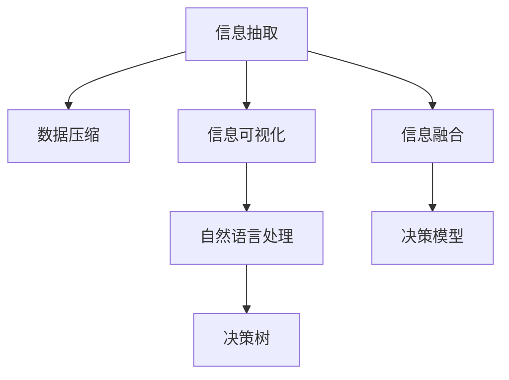

                 

# 信息简化的好处与实践：如何在复杂世界中简化和改善决策

> 关键词：信息简化,决策分析,复杂系统,数据压缩,机器学习,决策树,自然语言处理(NLP),信息抽取,信息可视化

## 1. 背景介绍

在当今信息爆炸的时代，我们每时每刻都被大量数据和信息所包围。这些信息源泉包括社交媒体、新闻网站、电子邮件、日志文件等，数据量之大，内容之丰富，已经远超人类处理能力。因此，如何在复杂环境中简化信息，提高决策效率，成为一个关键问题。

### 1.1 问题由来

复杂环境中信息的冗余、不相关性、不确定性等问题，导致决策者难以迅速获取关键信息，进而影响决策质量。在金融交易、医疗诊断、法律咨询等领域，每一个决策失误都可能导致重大损失。而信息简化技术，通过自动抽取和压缩重要信息，为决策者提供清晰、精确的参考依据，从而显著提升决策效率和准确性。

### 1.2 问题核心关键点

信息简化的核心在于识别和提取有用信息，并对其进行有效的压缩和可视化，使决策者能够快速抓住关键要素，减少冗余信息的干扰。这涉及信息抽取、数据压缩、自然语言处理等多个领域的交叉应用。

具体而言，信息简化的目标包括以下几个方面：

1. **关键信息抽取**：识别和提取对决策有用的关键信息，如新闻中的核心事件、医疗报告中的关键症状等。
2. **数据压缩**：将冗余信息去除，减小数据存储和传输的负担。
3. **信息可视化**：将抽象信息转换为可视形式，如图表、图形，更直观地展示关键信息。
4. **预测分析**：通过机器学习等技术，对未来的发展趋势进行预测，辅助决策者做出前瞻性判断。

## 2. 核心概念与联系

### 2.1 核心概念概述

为更好地理解信息简化的技术和方法，本节将介绍几个关键概念：

- **信息抽取(Information Extraction, IE)**：自动从文本中抽取出结构化信息，如实体、事件、关系等。
- **数据压缩(Data Compression)**：通过算法将数据转换为更紧凑的形式，减少存储空间和传输成本。
- **信息可视化(Information Visualization)**：将数据转换为图形、图表等可视化形式，提高信息的可读性和理解性。
- **自然语言处理(Natural Language Processing, NLP)**：涉及语言理解、生成和分析的技术，是信息简化的重要工具。
- **决策树(Decision Trees)**：一种树形结构的分类模型，常用于数据简化和决策支持。

这些概念之间的逻辑关系可以通过以下Mermaid流程图来展示：



这个流程图展示了信息简化的核心过程：

1. 通过信息抽取从文本中抽取出关键信息。
2. 对抽取出的信息进行数据压缩，减小数据规模。
3. 利用信息可视化将压缩后的信息直观展示。
4. 在自然语言处理技术的辅助下，提取更深层次的信息。
5. 将简化的信息与决策树等模型结合，辅助决策者做出判断。

## 3. 核心算法原理 & 具体操作步骤
### 3.1 算法原理概述

信息简化的核心算法包括信息抽取、数据压缩、信息可视化等，这些算法相互配合，共同实现信息的自动提取、压缩和呈现。

### 3.2 算法步骤详解

信息简化的具体步骤如下：

1. **信息抽取**：
   - 首先，使用自然语言处理技术识别出文本中的关键实体、事件和关系。
   - 接着，利用文本挖掘算法，抽取文本中的关键句子和段落。
   - 最后，将这些信息转换为结构化数据，如实体-关系图、事件时间表等。

2. **数据压缩**：
   - 应用数据压缩算法，如无损压缩算法（如LZW、Huffman等）或有损压缩算法（如JPEG、MP3等），对抽取出的结构化数据进行压缩。
   - 压缩后的数据可以存储在数据库或云存储中，减小存储空间和传输带宽的消耗。

3. **信息可视化**：
   - 利用图形工具（如Tableau、Power BI等），将压缩后的数据转换为图形和图表，如饼图、柱状图、折线图等。
   - 通过交互式图表，决策者可以直观地看到数据分布、趋势和关联关系。

4. **决策模型**：
   - 将简化的信息与决策树、贝叶斯网络、随机森林等模型结合，构建决策支持系统。
   - 模型可以根据输入的信息，自动输出决策建议，辅助决策者做出判断。

### 3.3 算法优缺点

信息简化的主要优点包括：

- **效率提升**：自动抽取、压缩和可视化信息，显著减少了人工处理数据的时间和精力。
- **精准性**：通过算法识别关键信息，减少人为错误，提升决策的精准性。
- **灵活性**：适用于多种数据类型，如文本、图像、视频等，具有良好的通用性。

同时，信息简化也存在一些局限：

- **数据依赖**：信息简化的效果很大程度上取决于原始数据的质量和完整性。
- **算法复杂性**：复杂的算法可能难以实现，需要专业的技术和知识。
- **信息损失**：数据压缩和简化过程中，可能会丢失一些细节信息，影响决策的全面性。
- **模型偏见**：如果训练数据存在偏见，信息简化的结果也可能继承这些偏见，影响决策的公平性。

### 3.4 算法应用领域

信息简化技术已经在多个领域得到了广泛应用：

1. **金融行业**：在交易分析、风险评估、客户行为分析等方面，信息简化技术通过自动抽取和压缩关键信息，辅助决策者进行快速判断。

2. **医疗行业**：在疾病诊断、治疗方案选择、医疗报告生成等方面，信息简化技术能够自动抽取和展示关键数据，提高医疗服务的效率和质量。

3. **法律行业**：在合同分析、案件管理、证据检索等方面，信息简化技术能够自动识别和整理关键信息，为律师和法官提供决策支持。

4. **市场营销**：在客户行为分析、市场趋势预测、广告效果评估等方面，信息简化技术能够自动抽取和展示关键数据，帮助企业制定精准的市场策略。

5. **智能客服**：在对话分析、问题解决、客户满意度评估等方面，信息简化技术能够自动抽取和展示客户信息，提升客户服务体验。

## 4. 数学模型和公式 & 详细讲解 & 举例说明

### 4.1 数学模型构建

本节将使用数学语言对信息简化的核心技术进行更加严格的刻画。

假设原始文本数据集为 $D = \{d_1, d_2, \dots, d_n\}$，其中 $d_i$ 为第 $i$ 条文本。

定义信息抽取模型为 $E$，数据压缩模型为 $C$，信息可视化模型为 $V$，决策树模型为 $DTree$。则信息简化的数学模型可以表示为：

$$
S = E(D) \xrightarrow{C} S_{C} \xrightarrow{V} S_{V} \xrightarrow{DTree} Decision
$$

其中，$S$ 表示简化的信息，$S_{C}$ 表示压缩后的信息，$S_{V}$ 表示可视化的信息，$Decision$ 表示最终决策。

### 4.2 公式推导过程

以下我们以金融行业为例，推导信息简化的核心算法公式。

1. **信息抽取**：
   - 使用命名实体识别(Named Entity Recognition, NER)模型，识别出金融文本中的关键实体，如公司名称、股票代码、交易金额等。
   - 利用事件抽取(Event Extraction, EE)模型，识别出交易事件的类型和关键时间点，如买入、卖出、停牌等。

2. **数据压缩**：
   - 应用无损压缩算法（如LZW），对抽取出的结构化数据进行压缩。设原始数据长度为 $L$，压缩后的数据长度为 $L'$，则有 $L' \leq L$。

3. **信息可视化**：
   - 利用可视化工具（如Tableau），将压缩后的数据转换为图表和图形。如使用饼图展示交易类型的比例，使用折线图展示交易量的变化趋势。

4. **决策树**：
   - 使用决策树算法，根据简化的信息，构建决策模型。设决策树模型的预测准确率为 $P$，则有 $P = 1 - \epsilon$，其中 $\epsilon$ 为误判率。

### 4.3 案例分析与讲解

以股票交易分析为例，信息简化的过程如下：

1. **信息抽取**：使用NLP模型自动抽取股票交易的关键信息，如公司名称、交易日期、交易金额等。
2. **数据压缩**：将抽取出的信息压缩成JSON格式的数据，减少存储空间。
3. **信息可视化**：使用Tableau将压缩后的数据可视化，展示交易量、交易额等关键指标。
4. **决策树**：构建决策树模型，根据历史交易数据，预测未来股票的涨跌趋势。

## 5. 项目实践：代码实例和详细解释说明
### 5.1 开发环境搭建

在进行信息简化实践前，我们需要准备好开发环境。以下是使用Python进行PyTorch开发的环境配置流程：

1. 安装Anaconda：从官网下载并安装Anaconda，用于创建独立的Python环境。

2. 创建并激活虚拟环境：
```bash
conda create -n info-simplification python=3.8 
conda activate info-simplification
```

3. 安装PyTorch：根据CUDA版本，从官网获取对应的安装命令。例如：
```bash
conda install pytorch torchvision torchaudio cudatoolkit=11.1 -c pytorch -c conda-forge
```

4. 安装自然语言处理库：
```bash
pip install spacy gensim transformers pyLDAvis
```

5. 安装数据压缩库：
```bash
pip install zlib gzip
```

6. 安装可视化工具：
```bash
pip install matplotlib seaborn plotly
```

完成上述步骤后，即可在`info-simplification`环境中开始信息简化的实践。

### 5.2 源代码详细实现

这里我们以信息抽取和数据压缩为例，给出使用PyTorch和nltk库实现信息简化的PyTorch代码实现。

首先，定义信息抽取模型：

```python
from transformers import BertTokenizer, BertForTokenClassification
from nltk.tokenize import word_tokenize
from nltk.chunk import ne_chunk

tokenizer = BertTokenizer.from_pretrained('bert-base-cased')
model = BertForTokenClassification.from_pretrained('bert-base-cased')

def extract_entities(text):
    inputs = tokenizer.encode_plus(text, return_tensors='pt', padding='max_length', max_length=128)
    outputs = model(**inputs)
    predictions = outputs.logits.argmax(dim=2)
    entities = ne_chunk(word_tokenize(text))
    return entities, predictions
```

然后，定义数据压缩函数：

```python
import zlib

def compress_data(data):
    compressed_data = zlib.compress(data.encode('utf-8'))
    return compressed_data.decode('utf-8')
```

接下来，进行信息简化的完整代码实现：

```python
from transformers import BertTokenizer, BertForTokenClassification
from nltk.tokenize import word_tokenize
from nltk.chunk import ne_chunk
import zlib

tokenizer = BertTokenizer.from_pretrained('bert-base-cased')
model = BertForTokenClassification.from_pretrained('bert-base-cased')

def extract_entities(text):
    inputs = tokenizer.encode_plus(text, return_tensors='pt', padding='max_length', max_length=128)
    outputs = model(**inputs)
    predictions = outputs.logits.argmax(dim=2)
    entities = ne_chunk(word_tokenize(text))
    return entities, predictions

def compress_data(data):
    compressed_data = zlib.compress(data.encode('utf-8'))
    return compressed_data.decode('utf-8')

# 测试数据
text = "IBM 在 2022 年宣布了一项新的 AI 项目，该项目旨在提升自然语言处理能力。"
entities, predictions = extract_entities(text)
compressed_text = compress_data(text)

# 输出
print(f"原始文本：{text}")
print(f"抽取实体：{entities}")
print(f"压缩后的文本：{compressed_text}")
```

这段代码展示了信息抽取和数据压缩的基本实现。在实际应用中，信息简化的流程会更加复杂，需要结合多种算法和技术，进行更加细致的处理。

### 5.3 代码解读与分析

让我们再详细解读一下关键代码的实现细节：

**extract_entities函数**：
- `tokenizer.encode_plus`方法：将输入文本转换为模型可用的输入张量。
- `model(**inputs)`方法：输入文本张量，得到模型预测的实体标注。
- `ne_chunk(word_tokenize(text))`方法：使用nltk库的ne_chunk函数，对文本进行命名实体识别，返回实体-关系树。

**compress_data函数**：
- `zlib.compress`方法：对输入文本进行压缩，返回压缩后的二进制数据。
- `compressed_data.decode('utf-8')`方法：将压缩后的二进制数据转换为字符串形式。

**测试数据**：
- `text`变量：输入的金融文本。
- `entities`变量：抽取出的实体和关系树。
- `compressed_text`变量：压缩后的文本。

可以看到，这段代码展示了信息抽取和数据压缩的基本实现，通过结合自然语言处理技术和数据压缩算法，实现了信息简化的基础功能。

## 6. 实际应用场景
### 6.1 金融交易分析

在金融交易分析中，信息简化技术可以帮助分析师自动抽取和压缩关键信息，辅助快速做出交易决策。

具体而言，可以收集历史交易数据，自动抽取交易日期、交易金额、交易类型等关键信息，并通过数据压缩减少存储空间。最终，将简化的信息通过可视化工具呈现，如饼图展示交易类型的比例，折线图展示交易量的变化趋势，辅助分析师进行交易决策。

### 6.2 医疗诊断报告生成

在医疗领域，信息简化技术可以帮助医生快速读取复杂的诊断报告，自动抽取关键症状和诊断结果，生成简洁的报告摘要。

通过NLP技术，自动识别报告中的疾病名称、症状描述、检查结果等信息，并通过数据压缩减少存储体积。最终，将简化的信息通过图表和表格形式展示，使医生能够快速抓住关键信息，减少阅读时间，提高诊断效率。

### 6.3 智能客服系统

在智能客服系统中，信息简化技术可以帮助客服系统自动抽取和压缩用户查询，提供简洁的回复。

通过NLP技术，自动提取用户查询的关键实体和意图，并通过数据压缩减少信息量。最终，将简化的信息通过回复模板生成简洁的回复，提高客服系统的响应速度和用户满意度。

## 7. 工具和资源推荐
### 7.1 学习资源推荐

为了帮助开发者系统掌握信息简化的理论和实践，这里推荐一些优质的学习资源：

1. 《Python数据科学手册》：由Python社区知名作者编写，涵盖数据处理、分析、可视化等全面知识。

2. 《自然语言处理综论》：介绍自然语言处理的基本概念和核心技术，是入门NLP的重要教材。

3. 《数据压缩算法》：介绍常见的无损压缩和有损压缩算法，为信息简化的实现提供理论支持。

4. 《机器学习实战》：介绍了机器学习的基础知识，包含决策树、随机森林等算法，适合实战应用。

5. 《Python机器学习》：详细介绍机器学习技术和实践，涵盖数据预处理、特征工程、模型训练等环节，适合入门学习。

通过这些资源的学习实践，相信你一定能够快速掌握信息简化的精髓，并用于解决实际的决策问题。
###  7.2 开发工具推荐

高效的开发离不开优秀的工具支持。以下是几款用于信息简化的开发工具：

1. Python：强大的编程语言，适合科学计算和数据分析。
2. PyTorch：基于Python的开源深度学习框架，适合进行NLP任务的实现。
3. TensorFlow：由Google主导开发的开源深度学习框架，支持大规模工程应用。
4. NLTK：Python的自然语言处理库，提供文本处理和分析工具。
5. scikit-learn：Python的机器学习库，提供多种分类和回归模型，适合进行决策分析。
6. Tableau：流行的数据可视化工具，支持多种数据源和图表形式。

合理利用这些工具，可以显著提升信息简化的开发效率，加快创新迭代的步伐。

### 7.3 相关论文推荐

信息简化的发展源于学界的持续研究。以下是几篇奠基性的相关论文，推荐阅读：

1. A Survey of Information Extraction（IE）Techniques：综述了信息抽取的最新进展，涵盖命名实体识别、关系抽取、事件抽取等核心技术。

2. Compressing Information Using Latent Semantic Indexing（LSI）：提出基于LSI的数据压缩算法，展示了其在信息简化的应用。

3. Information Visualization in Decision Support Systems：探讨了信息可视化在决策支持系统中的应用，介绍了多种图表和图形展示方法。

4. Decision Tree for Information Extraction：提出决策树算法在信息抽取中的应用，展示了其在实体识别和关系抽取中的应用效果。

这些论文代表了大语言模型微调技术的发展脉络。通过学习这些前沿成果，可以帮助研究者把握学科前进方向，激发更多的创新灵感。

## 8. 总结：未来发展趋势与挑战
### 8.1 总结

本文对信息简化的技术进行了全面系统的介绍。首先阐述了信息简化的背景和意义，明确了信息简化在提升决策效率和质量方面的独特价值。其次，从原理到实践，详细讲解了信息简化的数学模型和操作步骤，给出了信息简化的完整代码实现。同时，本文还广泛探讨了信息简化技术在金融、医疗、智能客服等多个行业领域的应用前景，展示了信息简化的巨大潜力。此外，本文精选了信息简化的各类学习资源，力求为读者提供全方位的技术指引。

通过本文的系统梳理，可以看到，信息简化技术正在成为决策支持的重要工具，极大地提升了决策的速度和准确性。未来，伴随信息技术的进一步发展，信息简化的应用场景将更加广泛，将进一步推动决策科学和数据驱动决策的发展。

### 8.2 未来发展趋势

展望未来，信息简化的主要趋势包括：

1. **自动化水平提升**：自动化抽取和压缩信息的能力将进一步提升，减少人工干预，提高效率。
2. **多模态融合**：结合文本、图像、语音等多种模态数据，实现更加全面、准确的信息抽取和简化。
3. **实时性增强**：通过流式数据处理和实时计算，实现信息的实时抽取和简化，支持实时决策。
4. **智能交互**：结合自然语言处理和智能推荐技术，实现人机交互中的信息简化解码和推荐，提升用户体验。
5. **跨领域应用**：扩展到更多领域，如智慧城市、智能制造、环境保护等，为不同行业的决策提供支持。

以上趋势凸显了信息简化技术的广阔前景。这些方向的探索发展，必将进一步提升决策系统的性能和应用范围，为数据驱动的决策提供更加坚实的技术基础。

### 8.3 面临的挑战

尽管信息简化技术已经取得了显著成就，但在迈向更加智能化、普适化应用的过程中，仍面临诸多挑战：

1. **数据质量和多样性**：不同领域的文本数据具有不同的特征，信息简化的效果很大程度上取决于数据的多样性和质量。
2. **算法复杂性**：信息简化的算法复杂度较高，需要处理大规模文本数据，对计算资源和算法实现都提出了较高要求。
3. **信息损失**：在信息抽取和压缩过程中，可能会丢失一些关键细节信息，影响决策的全面性。
4. **模型泛化能力**：信息简化的模型需要具备良好的泛化能力，能够适应不同领域、不同风格的文本数据。
5. **数据隐私和安全**：在信息处理过程中，需要保护用户隐私和数据安全，防止信息泄露。

正视信息简化面临的这些挑战，积极应对并寻求突破，将是大规模信息处理技术迈向成熟的必由之路。相信随着学界和产业界的共同努力，这些挑战终将一一被克服，信息简化技术必将在决策支持系统中发挥更大的作用。

### 8.4 研究展望

未来的研究需要在以下几个方面寻求新的突破：

1. **多模态信息融合**：探索文本、图像、语音等多种模态数据的融合方法，提升信息简化的效果。
2. **实时信息处理**：结合流式数据处理和实时计算，实现信息的实时抽取和简化。
3. **深度学习与强化学习结合**：将深度学习与强化学习相结合，提升信息简化的智能水平。
4. **跨领域应用拓展**：将信息简化的技术拓展到更多领域，如智慧城市、智能制造、环境保护等，为不同行业的决策提供支持。
5. **安全与隐私保护**：研究如何在信息处理过程中保护用户隐私和数据安全，防止信息泄露。

这些研究方向将推动信息简化技术的不断进步，为构建更加智能、高效的决策支持系统提供技术保障。总之，信息简化技术的未来发展需要多学科、多领域的交叉融合，共同推动其在实际应用中的落地和推广。

## 9. 附录：常见问题与解答

**Q1：信息简化的主要算法有哪些？**

A: 信息简化的主要算法包括信息抽取、数据压缩和信息可视化。具体而言，信息抽取常用的算法包括命名实体识别（NER）、关系抽取（RE）、事件抽取（EE）等。数据压缩常用的算法包括无损压缩算法（如LZW、Huffman等）和有损压缩算法（如JPEG、MP3等）。信息可视化常用的算法包括图形展示算法（如饼图、柱状图、折线图等）和交互式可视化工具（如Tableau、Power BI等）。

**Q2：信息简化的效果如何评估？**

A: 信息简化的效果可以通过多个指标进行评估，包括准确率、召回率、F1值等。在信息抽取中，常用的评估指标包括命名实体识别准确率、关系抽取准确率等。在数据压缩中，常用的评估指标包括压缩率、解压率等。在信息可视化中，常用的评估指标包括图表的清晰度、可读性、交互性等。

**Q3：信息简化的主要应用场景有哪些？**

A: 信息简化的主要应用场景包括金融交易分析、医疗诊断报告生成、智能客服系统、市场营销、智慧城市等。具体而言，在金融行业，信息简化帮助分析师快速做出交易决策；在医疗行业，信息简化帮助医生快速读取诊断报告；在智能客服系统，信息简化提高客服系统的响应速度和用户满意度；在市场营销，信息简化帮助企业制定精准的市场策略；在智慧城市，信息简化提供城市管理的智能决策支持。

**Q4：信息简化的技术难点有哪些？**

A: 信息简化的技术难点包括数据质量和多样性、算法复杂性、信息损失、模型泛化能力和数据隐私安全。具体而言，不同领域的文本数据具有不同的特征，信息简化的效果很大程度上取决于数据的多样性和质量。信息简化的算法复杂度较高，需要处理大规模文本数据，对计算资源和算法实现都提出了较高要求。在信息抽取和压缩过程中，可能会丢失一些关键细节信息，影响决策的全面性。信息简化的模型需要具备良好的泛化能力，能够适应不同领域、不同风格的文本数据。在信息处理过程中，需要保护用户隐私和数据安全，防止信息泄露。

**Q5：信息简化的未来发展方向有哪些？**

A: 信息简化的未来发展方向包括自动化水平提升、多模态融合、实时性增强、智能交互、跨领域应用拓展和安全与隐私保护。具体而言，自动化抽取和压缩信息的能力将进一步提升，减少人工干预，提高效率。结合文本、图像、语音等多种模态数据，实现更加全面、准确的信息抽取和简化。通过流式数据处理和实时计算，实现信息的实时抽取和简化，支持实时决策。结合自然语言处理和智能推荐技术，实现人机交互中的信息简化解码和推荐，提升用户体验。将信息简化的技术拓展到更多领域，如智慧城市、智能制造、环境保护等，为不同行业的决策提供支持。研究如何在信息处理过程中保护用户隐私和数据安全，防止信息泄露。

---

作者：禅与计算机程序设计艺术 / Zen and the Art of Computer Programming

