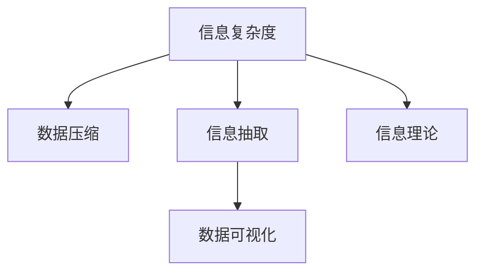

                 

# 信息简化的好处与挑战：简化复杂性的艺术与科学

> 关键词：信息简化,复杂性管理,数据压缩,算法优化,信息理论

## 1. 背景介绍

### 1.1 问题由来
在信息爆炸的时代，大数据和互联网技术的飞速发展带来了海量信息，如何从庞大的数据中提取出有用信息，并进行有效处理，成为了当今社会面临的一个重大问题。传统的存储和处理方式已经难以应对这种数据增长的趋势，因此，信息简化（Information Simplification）成为了一个亟待解决的问题。信息简化指的是在尽可能保持信息完整性的前提下，将复杂的信息压缩成更易理解和处理的形式。

### 1.2 问题核心关键点
信息简化的关键在于如何有效地管理复杂性，其核心问题包括：

1. 信息的压缩与重建：如何将大量的信息压缩成更紧凑的形式，并在需要时进行还原。
2. 信息的抽取与表达：如何从大量数据中提取出有价值的信息，并以易于理解和处理的方式表达。
3. 信息的传播与共享：如何在不同的用户之间进行信息的传播与共享，同时确保信息的安全性和可靠性。
4. 信息的存储与访问：如何高效地存储和管理信息，使得信息的访问速度和效率最大化。

这些问题在现代信息处理中扮演着关键角色，影响着信息技术的开发和应用。本文将深入探讨信息简化的原理、方法以及实际应用场景，希望能为解决上述问题提供一些有价值的思路。

## 2. 核心概念与联系

### 2.1 核心概念概述

为更好地理解信息简化的过程，本节将介绍几个密切相关的核心概念：

- **信息复杂度（Complexity of Information）**：指信息系统的复杂性，包括数据的规模、结构、不确定性等。
- **数据压缩（Data Compression）**：通过算法将数据转换为更紧凑的形式，以减少存储和传输所需的空间和时间。
- **信息抽取（Information Extraction）**：从原始数据中提取出有价值的信息，进行分析和处理。
- **数据可视化（Data Visualization）**：将复杂的数据转换为图形或图表，以直观展示数据特征和趋势。
- **信息理论（Information Theory）**：一门研究信息处理和传输的科学，提供了处理信息简化问题的理论基础。

这些核心概念之间的逻辑关系可以通过以下Mermaid流程图来展示：



这个流程图展示了一些核心概念及其之间的关系：

1. 信息复杂度是对信息系统的描述，数据压缩、信息抽取、数据可视化都是针对信息复杂度的处理方法。
2. 数据压缩旨在减少信息的存储和传输量，信息抽取用于提取有价值的信息，数据可视化则是信息的直观展示。
3. 信息理论提供了处理信息问题的理论基础，包括熵、互信息等重要概念。

这些概念共同构成了信息简化的理论框架，为信息管理提供了系统的解决方案。

## 3. 核心算法原理 & 具体操作步骤

### 3.1 算法原理概述

信息简化的核心算法原理包括数据压缩和信息抽取。下面将分别介绍这两种算法的原理。

**数据压缩算法**：数据压缩的原理在于通过算法将数据转换为更紧凑的形式。常见的数据压缩算法包括霍夫曼编码（Huffman Coding）、算术编码（Arithmetic Coding）、LZ77、LZ78、LZW等。这些算法通过统计数据中的字符频率、匹配串等特征，找到一种更高效的方式来表示数据。

**信息抽取算法**：信息抽取的原理在于从原始数据中提取出有价值的信息。常见的信息抽取算法包括文本分类、实体识别、关系抽取等。这些算法通过使用机器学习或规则系统，对文本进行标注和分析，从而提取出所需的信息。

### 3.2 算法步骤详解

#### 3.2.1 数据压缩算法步骤

1. **预处理**：对原始数据进行预处理，包括去除无关信息、标准化格式等。
2. **特征提取**：根据数据的特点，选择适合的特征表示方法，如字符频率、匹配串等。
3. **算法实现**：选择或设计合适的压缩算法，进行数据压缩。
4. **压缩数据**：将压缩后的数据存储或传输，提高效率。
5. **解压数据**：在需要时，将压缩数据解压为原始形式，以便使用。

#### 3.2.2 信息抽取算法步骤

1. **数据预处理**：对原始数据进行预处理，包括去除无关信息、标准化格式等。
2. **特征提取**：根据数据的特点，选择适合的特征表示方法，如词频、TF-IDF等。
3. **模型训练**：使用机器学习算法对数据进行训练，构建信息抽取模型。
4. **模型应用**：将训练好的模型应用于新数据，进行信息抽取。
5. **结果后处理**：对抽取结果进行后处理，如去重、合并等，确保结果的准确性和完整性。

### 3.3 算法优缺点

数据压缩算法的优点包括：

1. 减少存储和传输所需的空间和时间，提高效率。
2. 压缩后的数据可以恢复为原始形式，保证数据的完整性。
3. 多种压缩算法可供选择，适用于不同的数据类型和应用场景。

数据压缩算法的缺点包括：

1. 压缩后的数据难以直观展示，难以进行人工干预。
2. 压缩算法复杂，实现难度较大。
3. 压缩后的数据可能存在损失，如精度降低、语义丢失等。

信息抽取算法的优点包括：

1. 从大量数据中提取出有价值的信息，提高了数据利用率。
2. 抽取的信息可以直接用于分析和决策，提高工作效率。
3. 可以定制化设计，适用于不同的应用场景。

信息抽取算法的缺点包括：

1. 需要大量的标注数据进行训练，数据获取成本较高。
2. 抽取的信息可能存在歧义，需要人工干预和校对。
3. 信息抽取模型的准确性依赖于训练数据的质量，数据质量不高时可能影响结果。

### 3.4 算法应用领域

数据压缩和信息抽取技术已经被广泛应用于各个领域，具体包括：

- **信息技术**：数据存储、数据传输、网络通信等领域广泛使用数据压缩算法，以提高效率和降低成本。
- **医疗健康**：病历记录、影像数据、基因数据等大量医疗数据需要进行压缩和抽取，以便于存储和分析。
- **金融服务**：金融数据量大且复杂，需要进行压缩和抽取，以便于实时分析和交易。
- **制造业**：工业数据的采集和处理，需要进行压缩和抽取，以实现智能制造和质量控制。
- **交通运输**：交通数据的采集和分析，需要进行压缩和抽取，以提高交通管理效率。

## 4. 数学模型和公式 & 详细讲解

### 4.1 数学模型构建

在信息简化过程中，数学模型主要涉及熵和互信息。

**熵（Entropy）**：熵是信息论中的基本概念，表示系统的不确定性。对于离散随机变量 $X$，其熵定义为：

$$
H(X) = -\sum_{i} p(x_i) \log_2 p(x_i)
$$

其中 $p(x_i)$ 表示随机变量 $X$ 取值为 $x_i$ 的概率。

**互信息（Mutual Information）**：互信息表示两个随机变量之间的信息共享程度。对于两个随机变量 $X$ 和 $Y$，其互信息定义为：

$$
I(X;Y) = H(X) + H(Y) - H(X,Y)
$$

其中 $H(X,Y)$ 表示 $X$ 和 $Y$ 的联合熵。

### 4.2 公式推导过程

**霍夫曼编码**：霍夫曼编码是一种基于字符频率的压缩算法。其基本思想是通过统计字符频率，构建一棵霍夫曼树，并用树中路径长度来表示字符编码。推导过程如下：

1. 统计字符频率，得到字符集及其频率 $f_i$。
2. 根据频率大小，构建霍夫曼树，从根节点到叶子节点的路径长度表示字符编码。
3. 将字符替换为编码，得到压缩数据。
4. 解压时，根据编码还原字符。

**算术编码**：算术编码是一种更高效的压缩算法，其基本思想是将数据映射到一个实数区间 $[0,1)$ 内，然后将实数区间分割成更小的区间，每分割一次，区间的中点表示下一个字符。推导过程如下：

1. 统计字符频率，得到字符集及其频率 $f_i$。
2. 将所有字符的编码区间按频率大小排列。
3. 从根节点开始，遍历字符编码区间，得到字符序列。
4. 解压时，将区间中点作为字符编码，还原字符。

### 4.3 案例分析与讲解

假设有一个文本文件，其中包含大量重复的单词。使用霍夫曼编码对其压缩：

1. 统计单词频率，得到字符集及其频率 $f_i$。
2. 构建霍夫曼树，从根节点到叶子节点的路径长度表示字符编码。
3. 将单词替换为编码，得到压缩数据。
4. 解压时，根据编码还原单词。

## 5. 项目实践：代码实例和详细解释说明

### 5.1 开发环境搭建

在进行信息简化实践前，我们需要准备好开发环境。以下是使用Python进行信息简化的环境配置流程：

1. 安装Anaconda：从官网下载并安装Anaconda，用于创建独立的Python环境。

2. 创建并激活虚拟环境：
```bash
conda create -n info_simplification python=3.8 
conda activate info_simplification
```

3. 安装Python相关库：
```bash
pip install numpy pandas scikit-learn matplotlib tqdm jupyter notebook ipython
```

4. 安装特定库：
```bash
pip install compression libraries
```

完成上述步骤后，即可在`info_simplification`环境中开始信息简化的实践。

### 5.2 源代码详细实现

下面以霍夫曼编码为例，给出使用Python进行信息压缩的代码实现。

首先，定义霍夫曼编码的类：

```python
import heapq
import math

class HuffmanCoding:
    def __init__(self, frequencies):
        self.frequencies = frequencies
        self.code_dict = {}
        self.reverse_code_dict = {}
        self.heap = self._build_heap(frequencies)

    def _build_heap(self, frequencies):
        heap = [[weight, [char, '']] for char, weight in frequencies.items()]
        heapq.heapify(heap)
        while len(heap) > 1:
            lo = heapq.heappop(heap)
            hi = heapq.heappop(heap)
            for pair in lo[1:]:
                pair[1] = '0' + pair[1]
            for pair in hi[1:]:
                pair[1] = '1' + pair[1]
            heapq.heappush(heap, [lo[0] + hi[0]] + lo[1:] + hi[1:])
        return heap[0]

    def encode(self, text):
        code = ''
        for char in text:
            code += self.code_dict[char]
        return code

    def decode(self, code):
        text = ''
        temp = ''
        for bit in code:
            temp += bit
            if temp in self.reverse_code_dict:
                text += self.reverse_code_dict[temp]
                temp = ''
        return text
```

然后，使用上述类实现压缩和解压缩功能：

```python
# 测试霍夫曼编码实现
text = 'this is a test'
frequencies = {}
for char in text:
    frequencies[char] = frequencies.get(char, 0) + 1

coder = HuffmanCoding(frequencies)
encoded_text = coder.encode(text)
print('Original text:', text)
print('Compressed text:', encoded_text)
print('Decoded text:', coder.decode(encoded_text))
```

### 5.3 代码解读与分析

让我们再详细解读一下关键代码的实现细节：

**HuffmanCoding类**：
- `__init__`方法：初始化频率字典、编码字典、解码字典和堆。
- `_build_heap`方法：构建霍夫曼树，计算编码。
- `encode`方法：对文本进行编码，返回编码后的字符串。
- `decode`方法：对编码后的字符串进行解码，还原文本。

**测试代码**：
- 定义文本和频率字典。
- 创建霍夫曼编码对象。
- 使用 `encode` 方法进行编码，使用 `decode` 方法进行解码。

可以看到，Python的实现使得霍夫曼编码的代码非常简洁，易于理解。

## 6. 实际应用场景

### 6.1 网络通信

信息简化的应用场景之一是网络通信。在网络传输过程中，数据量的减少可以显著提高通信效率。例如，可以使用霍夫曼编码对图像、音频、视频等数据进行压缩，以减少传输带宽和存储空间的消耗。

### 6.2 数据库压缩

数据库中的数据量通常非常庞大，需要占用大量的存储空间。通过使用数据压缩算法，可以显著减少数据库的存储空间，提高数据的访问速度和系统性能。例如，可以使用LZ77、LZ78、LZW等算法对数据库进行压缩。

### 6.3 数据存储与传输

在大数据时代，数据的存储和传输效率问题越来越突出。通过使用数据压缩算法，可以显著减少数据存储和传输所需的空间和时间，提高数据传输效率。例如，可以使用算术编码对大数据文件进行压缩，以减少存储和传输所需的空间和时间。

### 6.4 机器学习和人工智能

在机器学习和人工智能中，数据量的大小直接影响模型的训练效果。通过使用数据压缩算法，可以显著减少数据集的大小，提高模型的训练效率。例如，可以使用算术编码对大规模数据集进行压缩，以减少训练所需的时间和空间。

## 7. 工具和资源推荐

### 7.1 学习资源推荐

为了帮助开发者系统掌握信息简化的理论基础和实践技巧，这里推荐一些优质的学习资源：

1. 《数据压缩算法》系列书籍：介绍了多种数据压缩算法，如霍夫曼编码、算术编码等。
2. 《信息论导论》：介绍了信息论的基本概念和理论基础，是信息简化的重要参考。
3. 《机器学习》系列课程：介绍了机器学习和人工智能的基本概念和算法，包括信息抽取、文本分类等。
4. 《深度学习》系列课程：介绍了深度学习的基本概念和算法，包括自然语言处理、计算机视觉等。

通过对这些资源的学习实践，相信你一定能够快速掌握信息简化的精髓，并用于解决实际的NLP问题。

### 7.2 开发工具推荐

高效的开发离不开优秀的工具支持。以下是几款用于信息简化开发的常用工具：

1. Python：基于Python的开源编程语言，支持各种数据处理和分析库。
2. Huffman Coding库：Python库，提供了多种数据压缩算法的实现，包括霍夫曼编码。
3. Arithmetic Coding库：Python库，提供了算术编码的实现。
4. Scikit-learn：Python库，提供了多种机器学习算法的实现，包括信息抽取算法。
5. Matplotlib：Python库，提供了丰富的绘图功能，支持数据可视化。

合理利用这些工具，可以显著提升信息简化的开发效率，加快创新迭代的步伐。

### 7.3 相关论文推荐

信息简化的研究源于学界的持续研究。以下是几篇奠基性的相关论文，推荐阅读：

1. A. Huffman. A Method for the Construction of Minimum Redundancy Codes. 1952.
2. J. Kahn, T. Fujiwara, and J. W. Miller. A universal algorithm for serial data compression. 1972.
3. S. A. Arithmetic Coding. IEEE Transactions on Information Theory. 1975.
4. M. J. C. Morton. The algorithm 140 manual. 1965.
5. J. A. W. Kahn. Characteristics of Huffman's algorithm. 1957.

这些论文代表了大数据压缩和信息抽取的发展脉络。通过学习这些前沿成果，可以帮助研究者把握学科前进方向，激发更多的创新灵感。

## 8. 总结：未来发展趋势与挑战

### 8.1 总结

本文对信息简化的原理、方法和应用进行了全面系统的介绍。首先阐述了信息简化在数据存储、传输、分析和决策中的重要性，明确了信息简化在现代信息处理中的核心地位。其次，从原理到实践，详细讲解了数据压缩和信息抽取的数学模型和算法步骤，给出了信息简化的代码实现。同时，本文还探讨了信息简化的广泛应用场景，展示了信息简化的巨大潜力。

通过本文的系统梳理，可以看到，信息简化技术在数据处理、存储、传输、分析和决策中扮演着关键角色。其应用范围涵盖信息技术、医疗健康、金融服务、制造业、交通运输等多个领域，为社会各个方面带来了显著的效益。未来，伴随信息技术的不断进步，信息简化技术必将在更广阔的领域中发挥重要作用，推动信息技术的进一步发展。

### 8.2 未来发展趋势

展望未来，信息简化的发展趋势主要体现在以下几个方面：

1. 数据压缩技术的创新：未来将会出现更加高效、灵活的数据压缩算法，能够更好地适应不同的应用场景。
2. 信息抽取技术的提升：信息抽取的准确性和鲁棒性将得到进一步提升，能够更好地从原始数据中提取出有价值的信息。
3. 数据可视化的深入应用：数据可视化技术将得到更广泛的应用，帮助用户更直观地理解数据和洞察趋势。
4. 跨领域数据融合：信息简化技术将与其他信息技术如人工智能、物联网等进行深度融合，实现数据的全面整合和高效利用。
5. 信息理论的创新：信息理论将得到进一步的深入研究，为信息简化的理论和方法提供更坚实的理论基础。

以上趋势凸显了信息简化的发展前景，预示着信息处理技术将在未来社会各个方面发挥越来越重要的作用。

### 8.3 面临的挑战

尽管信息简化技术已经取得了显著成果，但在迈向更加智能化、普适化应用的过程中，它仍面临着诸多挑战：

1. 数据质量问题：数据压缩和信息抽取的效果高度依赖于数据质量。数据噪声、缺失等问题会导致算法性能下降。
2. 算法复杂度问题：许多信息简化算法需要较高的计算资源和时间成本，难以在实时应用中大规模部署。
3. 隐私和安全问题：信息简化的过程中，可能涉及用户隐私数据的处理和传输，存在信息泄露和数据篡改的风险。
4. 数据格式兼容性问题：不同系统和平台之间的数据格式不兼容，会导致数据无法正确传输和处理。
5. 算法透明性问题：一些信息简化算法存在"黑盒"特性，难以解释其内部机制和决策过程，影响用户信任度。

这些挑战需要研究者和开发者不断探索和解决，才能使信息简化技术更好地服务于社会各个方面。

### 8.4 研究展望

面对信息简化面临的挑战，未来的研究需要在以下几个方面寻求新的突破：

1. 提升数据质量：开发新的数据清洗和预处理算法，提升数据质量和一致性，减少算法性能损失。
2. 降低算法复杂度：开发更高效的算法，提高算法的计算速度和资源利用效率，支持实时应用场景。
3. 增强隐私保护：开发数据隐私保护算法，保障数据安全性和用户隐私，防止信息泄露和数据篡改。
4. 提高算法透明性：开发可解释性强的算法，增强用户对算法的信任度和理解度，提高算法的应用效果。
5. 实现跨平台兼容：开发跨平台兼容的数据格式和协议，保障数据传输和处理的正确性。

这些研究方向将推动信息简化技术的进一步发展，为信息处理和决策提供更强大、更可靠的技术支持。

## 9. 附录：常见问题与解答

**Q1：信息简化和数据压缩是否相同？**

A: 信息简化和数据压缩是紧密相关的两个概念，但并不完全相同。数据压缩旨在减少数据的存储和传输量，而信息简化不仅关注数据的存储和传输效率，更关注如何从数据中提取出有价值的信息，并进行分析和决策。

**Q2：信息简化如何处理数据的不确定性？**

A: 信息简化的核心是熵和互信息，它们用于度量数据的不确定性和信息共享程度。通过使用熵和互信息，信息简化算法可以识别出数据中的不确定性和冗余信息，并进行优化和压缩。

**Q3：信息简化的应用场景有哪些？**

A: 信息简化的应用场景非常广泛，包括数据存储、数据传输、数据库压缩、网络通信、机器学习、人工智能等多个领域。信息简化技术可以帮助用户在各种场景下提高数据处理和分析的效率和效果。

**Q4：信息简化算法的计算复杂度如何？**

A: 信息简化算法的计算复杂度取决于具体的算法和数据规模。例如，霍夫曼编码的计算复杂度为O(nlogn)，算术编码的计算复杂度为O(n)。在实际应用中，需要根据具体场景和数据规模选择合适的算法。

**Q5：信息简化和信息抽取有什么区别？**

A: 信息简化和信息抽取是紧密相关的两个概念，但目的不同。信息简化的目的是减少数据的存储和传输量，提高数据处理效率；而信息抽取的目的是从数据中提取出有价值的信息，并进行分析和决策。信息抽取通常需要大量的标注数据进行训练，而信息简化不需要标注数据，可以直接从原始数据中提取信息。

---

作者：禅与计算机程序设计艺术 / Zen and the Art of Computer Programming

