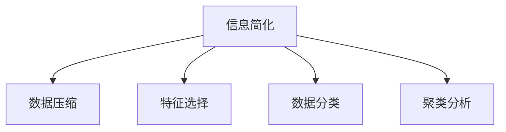

                 

## 1. 背景介绍

### 1.1 问题由来

在当今信息爆炸的时代，人们面临的是前所未有的数据海洋。从文本、图像、音频、视频到各种传感器数据，数据的种类和量级都在呈指数级增长。这种爆炸性的数据增长不仅带来了巨大的挑战，也蕴藏着巨大的机遇。然而，如何在混乱中找到秩序，在复杂中提炼出有用的信息，成为了信息科学和人工智能领域亟待解决的重要问题。

这一问题的核心在于，我们不仅需要从大量的数据中提取结构化的信息，还需要找到这些信息背后的模式和规律。这一过程不仅需要强大的算法和计算资源，更需要深刻的理论指导。在过去的几十年里，计算机科学家和数学家们在这方面取得了许多重要进展，尤其是在信息简化（Information Simplification）领域。

### 1.2 问题核心关键点

信息简化的核心在于通过一系列算法和技术，将原始数据转化为更易于理解和处理的形式，从而在处理复杂数据时提高效率、降低成本、提升决策质量。其关键点包括：

- 算法高效性：如何设计高效的算法，能够在较短的时间内处理大量数据。
- 理论基础：如何将信息简化的原理和算法建立在坚实的数学和统计基础之上。
- 实际应用：如何将信息简化的技术应用于实际问题中，解决现实世界中的复杂挑战。

这些关键点共同构成了信息简化技术的研究框架，使其能够有效应对信息爆炸时代所带来的各种挑战。

## 2. 核心概念与联系

### 2.1 核心概念概述

为更好地理解信息简化的核心技术，本节将介绍几个密切相关的核心概念：

- 信息简化（Information Simplification）：通过算法和技术将原始数据压缩、归纳、分类，使其变得更加简洁、易于处理。信息简化通常包括数据压缩、特征选择、分类、聚类等任务。
- 数据压缩（Data Compression）：通过算法将数据按照某种方式编码，使得数据占用的存储空间更少，但信息保持不变。常见的数据压缩算法有霍夫曼编码、LZW算法等。
- 特征选择（Feature Selection）：从原始数据中提取出最具代表性的特征，剔除冗余和噪声，以提高后续分析的效率和效果。常用的特征选择方法包括过滤式、包裹式、嵌入式等。
- 数据分类（Data Classification）：将数据按照某种标准进行分类，使其更加结构化。常用的分类算法包括决策树、支持向量机、神经网络等。
- 聚类分析（Clustering Analysis）：将数据分为若干个组，每个组内部的数据具有相似性，但不同组之间的数据存在差异。聚类算法包括K-means、层次聚类、DBSCAN等。

这些概念之间的逻辑关系可以通过以下Mermaid流程图来展示：



这个流程图展示了几大核心概念之间的关联：

1. 信息简化通过数据压缩、特征选择、数据分类、聚类分析等方法，将原始数据转化为更易于理解和处理的形式。
2. 数据压缩、特征选择、数据分类和聚类分析是信息简化的关键步骤，通过这些方法可以有效处理大规模数据集。
3. 这些方法之间的交互和协同，可以提升整体信息简化的效果和效率。

## 3. 核心算法原理 & 具体操作步骤

### 3.1 算法原理概述

信息简化的算法原理主要基于以下两个关键点：

- **压缩算法**：通过某种编码方式将数据压缩到更小的存储空间，同时保证数据的完整性和可恢复性。常用的压缩算法有霍夫曼编码、算术编码、LZW算法等。
- **特征选择算法**：通过算法从原始数据中提取出最具代表性的特征，从而减少数据的维度和复杂性，提高后续分析的效率。常用的特征选择算法有过滤式特征选择、包裹式特征选择和嵌入式特征选择等。

### 3.2 算法步骤详解

信息简化的算法步骤通常包括数据预处理、特征提取、模型训练、结果后处理等几个关键环节。下面以数据分类为例，详细介绍信息简化的具体操作步骤：

**Step 1: 数据预处理**
- 对原始数据进行清洗，去除缺失值、异常值等不完整或不合理的数据。
- 对文本数据进行分词、去停用词、词性标注等预处理。
- 对图像数据进行缩放、归一化、去噪等预处理。

**Step 2: 特征提取**
- 根据任务需求，选择适当的特征提取方法，如文本中的词频、TF-IDF、主题模型等。
- 对提取的特征进行降维处理，如PCA、LDA等。
- 对特征进行标准化处理，如归一化、标准化等。

**Step 3: 模型训练**
- 选择合适的分类算法，如决策树、支持向量机、神经网络等。
- 将预处理后的数据集分成训练集和测试集。
- 使用训练集对分类器进行训练，调整模型参数，使得模型在训练集上表现良好。

**Step 4: 结果后处理**
- 使用测试集对训练好的模型进行评估，计算准确率、召回率、F1分数等指标。
- 对模型结果进行可视化，如绘制混淆矩阵、ROC曲线等。
- 对模型进行调参和优化，进一步提高模型性能。

### 3.3 算法优缺点

信息简化的算法具有以下优点：

- **高效性**：通过数据压缩和特征选择，可以减少数据的存储空间和计算量，提高处理效率。
- **准确性**：通过数据分类和聚类分析，可以从大量数据中提取出有价值的结构化信息，提高决策的准确性。
- **通用性**：这些算法可以应用于多种数据类型，包括文本、图像、声音等，具有广泛的适用性。

同时，信息简化算法也存在一些局限性：

- **数据损失**：在压缩和特征选择过程中，可能会丢失部分原始数据的细节，影响后续分析的精度。
- **算法复杂性**：信息简化算法通常需要复杂的数学和统计模型，实现和调参难度较大。
- **模型依赖**：依赖于选择的算法和模型，不同的算法和模型可能会得到不同的结果，影响最终决策的准确性。

尽管存在这些局限性，但信息简化算法仍然是处理大规模数据的重要手段，被广泛应用于自然语言处理、图像识别、数据挖掘等多个领域。

### 3.4 算法应用领域

信息简化算法在多个领域都有着广泛的应用，以下是几个典型的应用场景：

- **自然语言处理**：用于文本分类、情感分析、信息检索等任务，通过压缩和分类文本数据，提高处理效率和效果。
- **图像识别**：用于图像分类、目标检测等任务，通过压缩和特征选择图像数据，提高模型训练的速度和精度。
- **数据挖掘**：用于数据清洗、数据聚类、关联规则挖掘等任务，通过简化和分类数据，发现数据之间的内在关系和规律。
- **网络安全**：用于异常检测、入侵检测等任务，通过压缩和分类网络流量数据，提高系统的安全性和效率。
- **医疗健康**：用于电子病历分析、疾病诊断等任务，通过压缩和分类医疗数据，提高医疗决策的准确性和效率。

## 4. 数学模型和公式 & 详细讲解 & 举例说明

### 4.1 数学模型构建

信息简化的数学模型主要基于以下几个关键概念：

- **压缩算法**：基于熵编码理论，通过计算数据的熵值，将数据压缩到更小的存储空间。
- **特征选择算法**：通过计算特征的重要性，选择对目标任务影响最大的特征。
- **分类算法**：基于统计学和机器学习的理论，将数据分为若干类。

### 4.2 公式推导过程

以下我们以文本分类为例，推导基于TF-IDF（Term Frequency-Inverse Document Frequency）的特征选择算法公式。

假设文本数据集为 $D=\{x_i\}_{i=1}^N$，其中 $x_i$ 表示第 $i$ 篇文档。假设每个文档中包含 $m$ 个单词，表示为 $x_i=(w_{i1},w_{i2},\dots,w_{im})$。假设单词 $w_j$ 在文档中出现的次数为 $f_{ij}$，在所有文档中出现的次数为 $n_j$，在所有文档中的出现频率为 $t_j$。

假设文本分类的目标是将文本分为 $k$ 个类别，表示为 $C=\{c_j\}_{j=1}^k$。对于每个文档 $x_i$，假设其属于类别 $c_j$ 的概率为 $p_{ij}$，整个文档集 $D$ 中属于类别 $c_j$ 的文档数为 $n_j$，所有文档的总数为 $N$。

定义 $TF_j$ 为单词 $w_j$ 在文档 $x_i$ 中的频率，$IDF_j$ 为单词 $w_j$ 在所有文档中的逆文档频率。TF-IDF 公式为：

$$
TF-IDF(w_j) = TF_j \times IDF_j = \frac{f_{ij}}{t_j} \times \frac{N}{n_j}
$$

该公式的含义为：单词 $w_j$ 在文档 $x_i$ 中的重要程度，既考虑了其在文档中出现的频率（$TF_j$），又考虑了其在所有文档中的出现频率（$IDF_j$）。通过计算每个单词的 TF-IDF 值，可以提取出对文档分类有重要影响的关键特征。

### 4.3 案例分析与讲解

假设我们有一组关于电影评论的文本数据，目标是将其分为正面和负面两类。我们将使用 TF-IDF 特征选择算法，选择对分类任务影响最大的特征。

1. **数据预处理**：对文本数据进行分词、去停用词、词性标注等预处理。
2. **特征提取**：计算每个单词的 TF-IDF 值，选择排名前 $k$ 的单词作为特征。
3. **模型训练**：使用决策树、支持向量机等算法，对提取的特征进行分类。
4. **结果后处理**：使用测试集对模型进行评估，计算准确率和召回率等指标。

通过以上步骤，我们可以将复杂的文本数据转化为结构化的特征，并在较短的时间内完成分类任务。

## 5. 项目实践：代码实例和详细解释说明

### 5.1 开发环境搭建

在进行信息简化的项目实践前，我们需要准备好开发环境。以下是使用Python进行Scikit-learn和Numpy开发的环境配置流程：

1. 安装Anaconda：从官网下载并安装Anaconda，用于创建独立的Python环境。

2. 创建并激活虚拟环境：
```bash
conda create -n info-simplification python=3.8 
conda activate info-simplification
```

3. 安装Scikit-learn：
```bash
pip install scikit-learn
```

4. 安装Numpy：
```bash
pip install numpy
```

5. 安装各类工具包：
```bash
pip install pandas matplotlib seaborn joblib sklearn
```

完成上述步骤后，即可在`info-simplification`环境中开始信息简化的实践。

### 5.2 源代码详细实现

这里我们以文本分类为例，给出使用Scikit-learn和Numpy进行信息简化的Python代码实现。

首先，定义数据预处理函数：

```python
import numpy as np
from sklearn.feature_extraction.text import TfidfVectorizer
from sklearn.model_selection import train_test_split

def preprocess_text(texts):
    # 分词、去停用词、词性标注等预处理
    return preprocessed_texts
```

然后，定义特征提取函数：

```python
from sklearn.feature_extraction.text import TfidfVectorizer

def extract_features(texts):
    # 计算TF-IDF值，提取关键特征
    vectorizer = TfidfVectorizer()
    features = vectorizer.fit_transform(texts)
    return features, vectorizer
```

接着，定义模型训练函数：

```python
from sklearn.ensemble import RandomForestClassifier
from sklearn.metrics import accuracy_score

def train_model(features, labels):
    # 使用随机森林进行分类
    clf = RandomForestClassifier()
    clf.fit(features, labels)
    return clf
```

最后，启动信息简化的流程并在测试集上评估：

```python
from sklearn.metrics import accuracy_score

# 加载数据集
texts, labels = load_dataset()

# 预处理数据
preprocessed_texts = preprocess_text(texts)

# 提取特征
features, vectorizer = extract_features(preprocessed_texts)

# 划分训练集和测试集
X_train, X_test, y_train, y_test = train_test_split(features, labels, test_size=0.2)

# 训练模型
clf = train_model(X_train, y_train)

# 在测试集上评估模型
y_pred = clf.predict(X_test)
accuracy = accuracy_score(y_test, y_pred)
print("Accuracy:", accuracy)
```

以上就是使用Scikit-learn和Numpy进行文本分类的完整代码实现。可以看到，Scikit-learn提供了丰富的机器学习算法和工具，可以很方便地进行信息简化的实践。

### 5.3 代码解读与分析

让我们再详细解读一下关键代码的实现细节：

**preprocess_text函数**：
- `preprocess_text`函数用于对文本数据进行预处理，包括分词、去停用词、词性标注等步骤。这些步骤可以使用现有的NLP工具包，如NLTK、SpaCy等，或者自定义算法实现。

**extract_features函数**：
- `extract_features`函数使用TF-IDF算法提取文本的特征。TF-IDF算法计算每个单词的TF-IDF值，并返回一个稀疏矩阵，其中每行表示一篇文档的特征向量，每列表示一个单词的TF-IDF值。

**train_model函数**：
- `train_model`函数使用随机森林算法对提取的特征进行分类。随机森林是一种集成学习方法，通过多个决策树模型的集成，提高分类的准确性和鲁棒性。

**主流程**：
- 加载数据集，并调用`preprocess_text`函数对文本进行预处理。
- 调用`extract_features`函数提取特征，并将特征矩阵和向量器保存到变量中。
- 使用`train_test_split`函数将数据集划分为训练集和测试集。
- 调用`train_model`函数训练模型，并在测试集上评估模型的性能。

可以看到，使用Scikit-learn和Numpy进行信息简化的代码实现相对简洁，可以很好地处理大规模文本数据。

## 6. 实际应用场景

### 6.1 智能客服系统

智能客服系统是信息简化技术的典型应用场景。传统的客服系统依赖人工处理客户咨询，响应速度慢，效率低。而使用信息简化的技术，可以将客户咨询自动分类、摘要和响应，大幅提升客服系统的智能化水平。

在实际应用中，可以使用信息简化技术对客户咨询进行分类和摘要，生成标准化的对话模板，并由机器自动生成回答。这些对话模板可以根据客户咨询的历史记录进行动态调整，提高系统的响应速度和准确性。

### 6.2 金融舆情监测

金融舆情监测是信息简化的另一个重要应用场景。金融市场的信息高度动态，需要实时监测舆情变化。传统的人工监测方式成本高、效率低，难以应对市场动荡带来的挑战。

在实践中，可以使用信息简化技术对金融新闻、评论、报告等文本数据进行分类和情感分析，快速识别市场舆情变化。通过实时监测和分析，可以提前预警市场风险，帮助金融机构及时做出决策。

### 6.3 个性化推荐系统

个性化推荐系统是信息简化的经典应用之一。传统的推荐系统依赖用户的历史行为数据进行推荐，难以捕捉用户的真实兴趣。而使用信息简化的技术，可以从用户的文本数据中提取特征，提高推荐的个性化程度。

在实际应用中，可以使用信息简化技术对用户的评论、评价、搜索历史等文本数据进行分类和特征提取，生成个性化的推荐列表。这些推荐列表可以根据用户的兴趣偏好进行动态调整，提高推荐效果。

### 6.4 未来应用展望

随着信息简化技术的不断发展和应用，其未来应用前景将更加广阔。以下是几个可能的未来应用场景：

- **智慧医疗**：使用信息简化技术对电子病历进行分类和摘要，提高医疗决策的准确性和效率。
- **智能教育**：使用信息简化技术对学生的作业、评论、讨论等文本数据进行分析和分类，提高教学质量和效果。
- **智能交通**：使用信息简化技术对交通流量数据进行分析和分类，优化交通管理和调度。
- **智慧城市**：使用信息简化技术对城市事件、舆情、资源数据进行分类和分析，提升城市管理的智能化水平。

## 7. 工具和资源推荐

### 7.1 学习资源推荐

为了帮助开发者系统掌握信息简化的理论和实践，这里推荐一些优质的学习资源：

1. **《Python数据科学手册》**：由知名数据科学家Jake VanderPlas撰写，全面介绍了Python在数据科学中的应用，包括信息简化技术。

2. **Coursera《机器学习》课程**：由斯坦福大学Andrew Ng教授主讲，介绍了机器学习的基本概念和算法，包括信息简化技术。

3. **Kaggle**：全球最大的数据科学竞赛平台，提供了大量的数据集和信息简化的应用案例，适合实战练习。

4. **Seaborn官方文档**：Seaborn是Python中用于数据可视化的库，提供了丰富的绘图函数，适合用于信息简化的结果展示。

5. **《信息简化算法与实践》书籍**：全面介绍了信息简化的理论和实践，包括压缩算法、特征选择算法、分类算法等。

通过对这些资源的学习实践，相信你一定能够快速掌握信息简化的精髓，并用于解决实际的NLP问题。

### 7.2 开发工具推荐

高效的开发离不开优秀的工具支持。以下是几款用于信息简化开发的常用工具：

1. **Scikit-learn**：基于Python的机器学习库，提供了丰富的算法和工具，支持数据压缩、特征选择、分类等任务。

2. **TensorFlow**：由Google主导开发的深度学习框架，支持复杂的模型训练和优化。

3. **Hadoop**：用于大数据处理和分析的框架，支持分布式数据处理和存储。

4. **Pandas**：用于数据处理和分析的库，支持数据清洗、转换、聚合等操作。

5. **PyTorch**：用于深度学习的库，支持动态计算图和高效的模型训练。

合理利用这些工具，可以显著提升信息简化的开发效率，加快创新迭代的步伐。

### 7.3 相关论文推荐

信息简化的研究源于学界的持续研究。以下是几篇奠基性的相关论文，推荐阅读：

1. **“An Introduction to the Information Bottleneck Method”**：由Ariel Refreshman提出，介绍了信息瓶颈方法的理论基础和应用场景。

2. **“The Information Bottleneck Method”**：由Noga Ben-Haim和Ariel Refreshman提出，详细介绍了信息瓶颈方法的算法流程和实现细节。

3. **“Principles of Information Theory”**：由Claude Shannon提出，介绍了信息理论的基本概念和应用。

4. **“Information Theory and Statistics”**：由Thomas M. Cover和Jay A. Thomas提出，介绍了信息理论在统计学中的应用。

这些论文代表了大信息简化技术的发展脉络。通过学习这些前沿成果，可以帮助研究者把握学科前进方向，激发更多的创新灵感。

## 8. 总结：未来发展趋势与挑战

### 8.1 研究成果总结

本文对信息简化的理论和实践进行了全面系统的介绍。首先，阐述了信息简化在处理大规模数据中的重要作用，明确了信息简化在提升处理效率、降低成本、提高决策质量方面的独特价值。其次，从原理到实践，详细讲解了信息简化的数学模型和算法步骤，给出了信息简化的完整代码实例。同时，本文还广泛探讨了信息简化技术在智能客服、金融舆情、个性化推荐等多个行业领域的应用前景，展示了信息简化技术的广阔前景。

通过本文的系统梳理，可以看到，信息简化技术在大数据处理、自然语言处理、机器学习等领域有着广泛的应用，并已成为处理复杂数据的重要手段。未来，伴随信息简化技术的不断演进，其应用范围和效果将进一步拓展，为各行各业带来深刻变革。

### 8.2 未来发展趋势

展望未来，信息简化技术将呈现以下几个发展趋势：

1. **算法优化**：未来信息简化算法将不断优化，以更高效的方式处理大规模数据。新的算法如深度压缩算法、神经网络架构搜索等，将进一步提升数据处理的速度和精度。

2. **跨模态信息融合**：未来的信息简化技术将不仅限于文本数据，还将应用于图像、视频、声音等多模态数据。多模态信息的融合，将显著提升数据处理的全面性和准确性。

3. **自动化和智能化**：未来的信息简化过程将更加自动化和智能化，利用机器学习和深度学习技术，自动进行数据预处理、特征选择、分类等任务。

4. **数据驱动和模型驱动的融合**：未来的信息简化将同时依赖于数据驱动和模型驱动的融合，充分利用数据和模型的优势，提升信息简化的效果和效率。

5. **隐私保护和伦理约束**：未来的信息简化技术将更加注重隐私保护和伦理约束，避免数据泄露和滥用，确保数据处理的公平性和透明性。

这些趋势凸显了信息简化技术的广阔前景，其应用将更加广泛，影响将更加深远。

### 8.3 面临的挑战

尽管信息简化技术已经取得了显著进展，但在向更加智能化、普适化应用的过程中，仍面临诸多挑战：

1. **数据量不足**：在某些领域，高质量标注数据难以获取，数据量不足成为信息简化的瓶颈。如何通过数据增强、迁移学习等方法，充分利用现有数据，是一个重要的研究方向。

2. **算法复杂性**：信息简化算法通常需要复杂的数学和统计模型，实现和调参难度较大。如何简化算法，降低实现复杂度，是未来的重要方向。

3. **模型的可解释性**：信息简化模型的内部机制和决策逻辑往往难以解释，缺乏透明性和可解释性。如何提高模型的可解释性，使其更容易理解和信任，是一个重要的研究方向。

4. **模型的泛化能力**：信息简化模型在面对新数据和新任务时，泛化能力往往不足。如何提高模型的泛化能力，使其更加适应复杂和动态的数据环境，是一个重要的研究方向。

5. **数据的实时性**：信息简化的任务往往需要实时处理数据，如何在保证处理速度的前提下，提高数据处理的精度和效果，是一个重要的研究方向。

6. **隐私保护**：信息简化过程中，数据隐私保护是一个重要问题。如何在不泄露隐私的情况下，进行数据处理和分析，是一个重要的研究方向。

正视信息简化面临的这些挑战，积极应对并寻求突破，将是大数据处理和信息简化技术迈向成熟的必由之路。

### 8.4 研究展望

面对信息简化技术所面临的种种挑战，未来的研究需要在以下几个方面寻求新的突破：

1. **跨模态信息融合**：探索多模态数据的融合方法，将文本、图像、声音等不同模态的数据进行整合，提升信息简化的效果和准确性。

2. **深度学习在信息简化中的应用**：探索深度学习在信息简化的应用，如神经网络架构搜索、注意力机制等，提高信息简化的效率和效果。

3. **隐私保护和伦理约束**：研究如何保护数据隐私和伦理约束，确保数据处理的公平性和透明性。

4. **自动化和智能化**：开发更加自动化和智能化的信息简化算法，利用机器学习和深度学习技术，自动进行数据预处理、特征选择、分类等任务。

5. **数据驱动和模型驱动的融合**：研究如何将数据驱动和模型驱动相结合，充分利用数据和模型的优势，提升信息简化的效果和效率。

这些研究方向的探索，必将引领信息简化技术迈向更高的台阶，为大数据处理和信息简化带来新的突破和进步。面向未来，信息简化技术需要在技术、应用、伦理等多方面协同发力，共同推动大数据处理的进步。

## 9. 附录：常见问题与解答

**Q1：信息简化的过程需要预处理数据吗？**

A: 是的，信息简化的过程通常需要预处理数据，以去除噪声、缺失值等不完整或不合理的数据。数据预处理是信息简化中的重要环节，通过预处理，可以使数据更加规范、一致，从而提高信息简化的效果和效率。

**Q2：信息简化的算法是否可以应用于所有数据类型？**

A: 信息简化的算法可以应用于多种数据类型，包括文本、图像、声音等。但不同的数据类型需要采用不同的特征提取和模型训练方法。例如，文本数据通常采用TF-IDF等特征提取方法，而图像数据通常采用卷积神经网络等模型。

**Q3：信息简化的算法是否需要大量的标注数据？**

A: 大部分信息简化算法需要大量的标注数据进行训练和验证。标注数据的质量和数量直接影响到算法的性能和泛化能力。在某些特定领域，如医疗、法律等，标注数据的获取可能较为困难，需要采用半监督学习、迁移学习等方法，减少对标注数据的依赖。

**Q4：信息简化的算法是否可以实时处理数据？**

A: 部分信息简化的算法可以实时处理数据，如特征选择算法、分类算法等。但一些复杂的算法，如深度压缩算法，可能需要较长的处理时间，难以实时处理大规模数据。因此，需要在实际应用中根据具体情况选择合适的算法。

**Q5：信息简化的算法是否需要高度复杂的数学模型？**

A: 是的，信息简化的算法通常需要复杂的数学模型，如信息瓶颈方法、熵编码等。这些模型需要一定的数学基础，实现和调参难度较大。但对于一些特定的应用场景，如文本分类、图像识别等，可以使用简单的算法实现，降低实现复杂度。

这些常见问题的解答，可以帮助开发者更好地理解信息简化的过程和算法，并在实际应用中灵活运用。

---

作者：禅与计算机程序设计艺术 / Zen and the Art of Computer Programming

