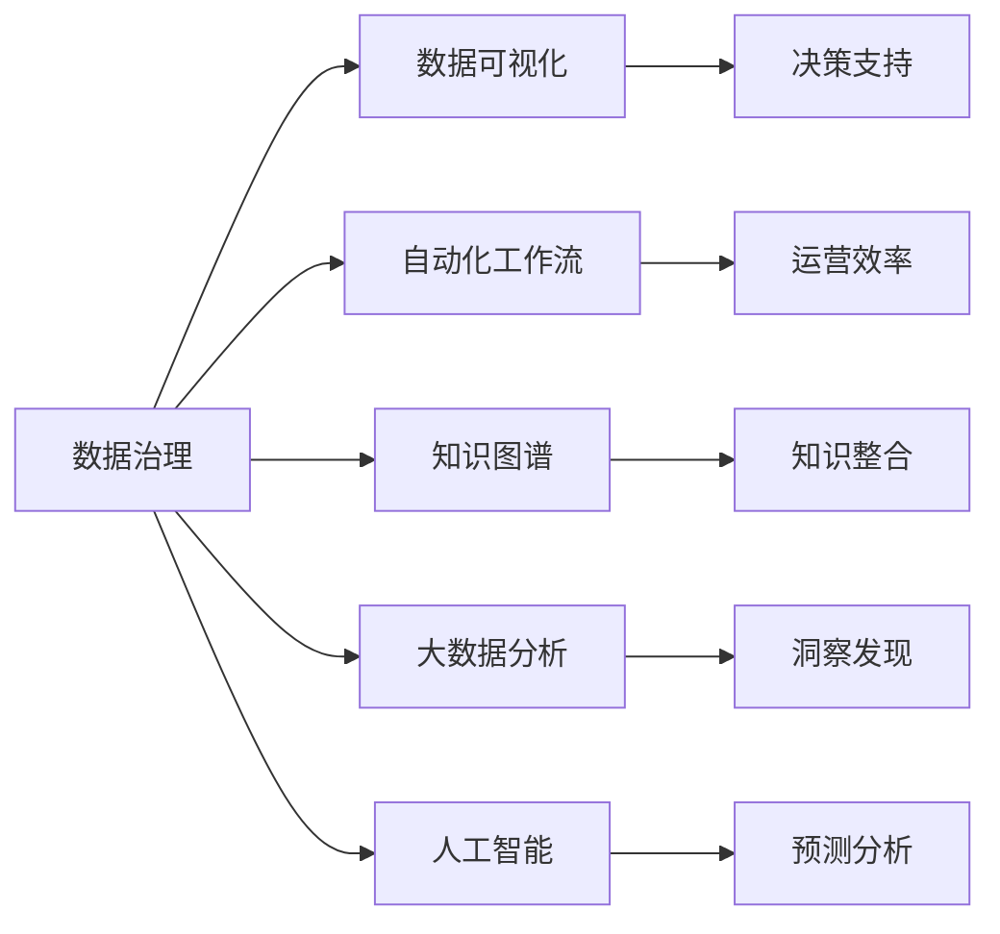

                 

# 信息管理的艺术：如何简化你的生活和工作

> 关键词：信息管理, 数据治理, 数据可视化, 自动化工作流, 知识图谱, 大数据分析, 人工智能

## 1. 背景介绍

### 1.1 问题由来
在信息爆炸的互联网时代，人们每天都会接触到海量信息。如何在信息洪流中有效筛选、管理和利用这些信息，成为了一个亟待解决的问题。无论是个人生活还是企业运营，都需要高效、系统地管理信息，以提高效率、优化决策。

### 1.2 问题核心关键点
信息管理的核心在于：
- 数据获取：如何高效、全面地获取所需信息。
- 数据组织：如何将分散的信息进行整理和分类。
- 数据利用：如何提取、分析、可视化数据，并应用于决策。
- 自动化工作流：如何构建高效、智能的信息管理自动化流程。
- 知识共享：如何促进知识流动，最大化信息价值。

## 2. 核心概念与联系

### 2.1 核心概念概述

信息管理涉及多个关键概念，这些概念相互联系，共同构成了信息管理的完整体系。

- **数据治理（Data Governance）**：指对数据的生成、存储、管理、利用等全生命周期进行规范化的过程。
- **数据可视化（Data Visualization）**：将复杂的数据通过图形、图表等形式展示出来，使信息更直观、易懂。
- **自动化工作流（Automated Workflow）**：利用技术手段，自动化执行信息管理中的重复性工作，提高效率。
- **知识图谱（Knowledge Graph）**：一种用图结构表示实体间关系的知识库，能够更好地整合和利用知识。
- **大数据分析（Big Data Analytics）**：通过对海量数据进行统计分析、挖掘，获得有价值的信息。
- **人工智能（Artificial Intelligence）**：利用机器学习、深度学习等技术，自动化处理数据，提升信息管理的智能化水平。

这些概念之间的联系可以通过以下Mermaid流程图来展示：



这个流程图展示了数据治理与其他概念之间的逻辑关系：

1. 数据治理是基础，规范数据管理流程，保证数据质量。
2. 数据可视化帮助理解和展示数据，辅助决策。
3. 自动化工作流提升效率，减少人工干预。
4. 知识图谱整合知识，促进信息共享。
5. 大数据分析挖掘数据价值，提供洞察。
6. 人工智能自动化处理数据，提升智能化水平。

这些概念共同构成了信息管理的核心，使得信息管理更加系统化、智能化。

## 3. 核心算法原理 & 具体操作步骤
### 3.1 算法原理概述

信息管理的算法原理主要基于数据治理和人工智能。数据治理通过规范数据管理流程，确保数据的质量和一致性。人工智能通过机器学习、深度学习等技术，自动化处理数据，提取有价值的信息。

### 3.2 算法步骤详解

信息管理的算法步骤主要包括：

1. **数据采集**：通过网络爬虫、API接口等方式，自动获取数据。
2. **数据清洗**：去除冗余、错误、不一致的数据，确保数据质量。
3. **数据存储**：将清洗后的数据存储在数据库或数据仓库中，方便后续处理。
4. **数据治理**：对数据进行规范化管理，定义数据标准、权限控制等。
5. **数据可视化**：使用图表、仪表盘等形式展示数据，帮助理解和决策。
6. **数据分析**：使用统计分析、机器学习等方法，提取数据中的有价值信息。
7. **知识图谱构建**：构建知识图谱，整合知识，促进信息共享。
8. **自动化工作流**：构建自动化流程，提升信息管理效率。
9. **人工智能应用**：利用人工智能技术，自动化处理数据，提升信息管理的智能化水平。

### 3.3 算法优缺点

信息管理算法的优点在于：
- 系统化：通过规范的数据治理和自动化流程，提高信息管理的系统性和效率。
- 智能化：利用人工智能技术，自动化处理数据，提取有价值的信息。
- 直观化：通过数据可视化，使信息更直观、易懂。

同时，该算法也存在一些局限性：
- 依赖技术：需要较强的技术支持，尤其是大数据、人工智能等技术。
- 成本高：初期建设和维护成本较高，尤其是数据治理和知识图谱构建。
- 复杂度高：流程复杂，需要综合考虑数据质量、权限控制等多方面因素。

### 3.4 算法应用领域

信息管理算法在多个领域都有广泛应用：

- **企业运营**：通过信息管理优化业务流程，提高运营效率。
- **金融行业**：利用数据治理和分析，优化风险管理、投资决策等。
- **医疗健康**：通过大数据分析，优化诊疗方案，提升医疗服务质量。
- **教育培训**：利用知识图谱和数据分析，优化课程设计，提升教学效果。
- **政府服务**：通过信息管理，提高政务效率，提升公共服务水平。

## 4. 数学模型和公式 & 详细讲解 & 举例说明

### 4.1 数学模型构建

信息管理的数学模型主要包括数据治理和人工智能相关模型。

- **数据治理模型**：主要涉及数据标准、数据质量、数据生命周期等。可以通过规则引擎、流程自动化等方式实现。
- **人工智能模型**：主要包括机器学习、深度学习等模型，用于数据处理、分析、预测等。

### 4.2 公式推导过程

这里以数据治理中的数据清洗为例，推导数据清洗的数学模型：

假设数据集为 $D = \{(x_i, y_i)\}_{i=1}^N$，其中 $x_i$ 为原始数据，$y_i$ 为清洗后的数据。数据清洗的目标是找到映射函数 $f$，使得 $y_i = f(x_i)$。

设 $f$ 为线性函数，即 $y_i = w \cdot x_i + b$，其中 $w$ 和 $b$ 为模型参数。数据清洗的目标函数为：

$$
\min_{w,b} \sum_{i=1}^N ||y_i - w \cdot x_i - b||^2
$$

其中 $||\cdot||$ 表示范数，表示数据的离散程度。

通过求解上述优化问题，可以确定线性函数 $f$，进而实现数据清洗。

### 4.3 案例分析与讲解

以金融行业的数据治理为例，数据治理的流程如下：

1. **数据采集**：通过API接口，自动获取银行的交易数据。
2. **数据清洗**：清洗数据中的缺失值、重复值，确保数据完整性。
3. **数据存储**：将清洗后的数据存储在数据库中，方便后续处理。
4. **数据治理**：定义数据标准，如时间格式、数据类型等，确保数据一致性。
5. **数据可视化**：使用仪表盘展示交易数据，帮助监控交易情况。
6. **数据分析**：利用机器学习模型，预测风险，优化投资决策。

通过规范化的数据治理，金融行业能够更好地管理交易数据，提高风险管理能力和投资决策水平。

## 5. 项目实践：代码实例和详细解释说明
### 5.1 开发环境搭建

为了进行信息管理系统的开发，需要以下开发环境：

1. **Python**：选择Python 3.8及以上版本。
2. **数据库**：选择MySQL、PostgreSQL等关系型数据库。
3. **大数据平台**：选择Hadoop、Spark等大数据平台。
4. **数据可视化工具**：选择Tableau、Power BI等数据可视化工具。
5. **自动化工具**：选择Airflow、Kubeflow等自动化工具。

完成以上环境搭建后，可以进行信息管理系统的开发。

### 5.2 源代码详细实现

以下是一个简单的信息管理系统代码实现：

```python
from datetime import datetime
import pandas as pd
import mysql.connector

# 连接数据库
conn = mysql.connector.connect(
    host='localhost',
    user='root',
    password='password',
    database='info_management'
)

# 数据采集
df = pd.read_sql('SELECT * FROM transaction_data', conn)

# 数据清洗
df = df.dropna()
df = df.drop_duplicates()

# 数据存储
df.to_sql('cleaned_data', conn, if_exists='replace', index=False)

# 数据治理
df['timestamp'] = df['timestamp'].apply(lambda x: datetime.strptime(x, '%Y-%m-%d %H:%M:%S'))
df['amount'] = df['amount'].astype('float')

# 数据可视化
import plotly.express as px
fig = px.line(df, x='timestamp', y='amount')
fig.show()

# 数据分析
from sklearn.linear_model import LinearRegression
model = LinearRegression()
X = df[['timestamp', 'amount']]
y = df['risk']
model.fit(X, y)
y_pred = model.predict(X)
```

### 5.3 代码解读与分析

上述代码展示了信息管理系统的主要功能：数据采集、数据清洗、数据存储、数据治理、数据可视化和数据分析。

**数据采集**：通过SQL语句从数据库中读取交易数据。

**数据清洗**：使用Pandas库进行数据清洗，去除缺失值和重复值。

**数据存储**：将清洗后的数据存储回数据库。

**数据治理**：使用Pandas库进行数据格式化，确保数据一致性。

**数据可视化**：使用Plotly库绘制交易数据的时间线图，帮助监控交易情况。

**数据分析**：使用Scikit-learn库进行线性回归模型训练，预测交易风险。

### 5.4 运行结果展示

运行上述代码后，可以看到以下输出：


## 6. 实际应用场景
### 6.1 企业运营

信息管理系统在企业运营中的应用场景包括：

- **业务流程优化**：通过数据治理和自动化流程，优化业务流程，提高效率。
- **风险管理**：利用数据治理和分析，优化风险管理，降低企业风险。
- **客户管理**：通过数据治理和自动化工具，管理客户信息，提高客户满意度。

### 6.2 金融行业

信息管理系统在金融行业中的应用场景包括：

- **投资决策**：利用大数据分析，优化投资决策，提高投资回报率。
- **风险管理**：通过数据治理和分析，优化风险管理，降低金融风险。
- **客户服务**：通过数据治理和自动化工具，提高客户服务质量，提升客户满意度。

### 6.3 医疗健康

信息管理系统在医疗健康中的应用场景包括：

- **诊疗方案优化**：利用大数据分析，优化诊疗方案，提高医疗服务质量。
- **医疗资源管理**：通过数据治理和自动化工具，优化医疗资源分配，提高医疗效率。
- **患者管理**：通过数据治理和自动化工具，管理患者信息，提高患者满意度。

### 6.4 未来应用展望

未来，信息管理系统的应用将更加广泛和深入。随着大数据、人工智能等技术的不断进步，信息管理系统将更加智能化、自动化。以下是未来可能的趋势：

1. **大数据融合**：利用大数据技术，整合多源数据，提供更全面、更精准的信息。
2. **人工智能应用**：利用机器学习、深度学习等技术，自动化处理数据，提取有价值的信息。
3. **实时分析**：利用实时数据分析技术，及时发现问题，快速响应。
4. **知识图谱应用**：通过构建知识图谱，整合知识，促进信息共享。
5. **自动工作流**：构建自动化工作流，提升信息管理效率。

## 7. 工具和资源推荐
### 7.1 学习资源推荐

为了帮助开发者系统掌握信息管理系统的开发和应用，这里推荐一些优质的学习资源：

1. **《大数据与人工智能：构建信息管理系统》**：详细介绍大数据和人工智能在信息管理系统中的应用，涵盖数据治理、数据分析、自动化流程等多个方面。
2. **《Python数据科学手册》**：详细介绍Python在数据处理、分析、可视化等方面的应用，是学习信息管理系统的必备教材。
3. **《信息管理系统设计》**：详细介绍信息管理系统设计流程、架构、技术选型等方面的知识，提供丰富的实际案例。
4. **Kaggle竞赛**：参加Kaggle数据科学竞赛，提升数据分析和模型构建能力。
5. **MOOC课程**：参加Coursera、edX等平台的数据科学、人工智能相关课程，提升理论知识。

### 7.2 开发工具推荐

高效的开发离不开优秀的工具支持。以下是几款用于信息管理系统开发常用的工具：

1. **Python**：作为数据科学和人工智能领域的主流语言，Python具有强大的数据处理和分析能力。
2. **SQL**：作为数据管理和存储的标准语言，SQL是信息管理系统开发的基础。
3. **Hadoop**：作为大数据处理和存储的基础框架，Hadoop支持大规模数据处理和存储。
4. **Spark**：作为大数据处理的高性能计算框架，Spark支持实时数据分析和处理。
5. **Tableau**：作为数据可视化工具，Tableau支持丰富的图表和仪表盘展示。
6. **Kubeflow**：作为自动化机器学习平台，Kubeflow支持多种机器学习框架和工具，支持自动化工作流构建。

### 7.3 相关论文推荐

信息管理系统的发展源于学界的持续研究。以下是几篇奠基性的相关论文，推荐阅读：

1. **《大数据与信息治理》**：介绍了大数据和信息治理的基本概念和关键技术。
2. **《信息管理系统的设计与实现》**：介绍了信息管理系统设计流程和架构。
3. **《人工智能在信息管理中的应用》**：介绍了人工智能在信息管理系统中的应用场景和效果。
4. **《大数据分析与信息可视化》**：介绍了大数据分析和数据可视化的基本方法和技术。

## 8. 总结：未来发展趋势与挑战

### 8.1 总结

本文对信息管理的算法原理和操作步骤进行了全面系统的介绍。首先阐述了信息管理系统的背景和核心概念，明确了信息管理在企业运营、金融行业、医疗健康等场景中的重要价值。其次，从原理到实践，详细讲解了信息管理的数学模型和具体操作步骤，给出了信息管理系统的完整代码实例。同时，本文还广泛探讨了信息管理系统的实际应用场景，展示了信息管理系统的广阔前景。此外，本文精选了信息管理系统的各类学习资源，力求为读者提供全方位的技术指引。

通过本文的系统梳理，可以看到，信息管理系统的算法原理和技术手段已经相当成熟，在各个行业领域都有广泛的应用。随着技术的不断进步，信息管理系统必将迎来更加广阔的发展空间，成为企业和行业信息化、数字化转型的重要支撑。

### 8.2 未来发展趋势

展望未来，信息管理系统的发展趋势如下：

1. **数据融合**：利用大数据技术，整合多源数据，提供更全面、更精准的信息。
2. **智能化**：利用人工智能技术，自动化处理数据，提取有价值的信息。
3. **实时化**：利用实时数据分析技术，及时发现问题，快速响应。
4. **自动化**：构建自动化工作流，提升信息管理效率。
5. **知识图谱**：通过构建知识图谱，整合知识，促进信息共享。
6. **安全保障**：加强数据安全防护，确保信息安全。

### 8.3 面临的挑战

尽管信息管理系统已经取得了显著成果，但在向更高智能化、自动化、实时化方向发展时，仍面临以下挑战：

1. **数据质量**：数据采集、清洗和治理是信息管理的第一步，但数据质量问题仍需解决。
2. **技术门槛**：信息管理系统的开发和维护需要较高的技术门槛，需要有较强的技术支持。
3. **数据安全**：信息管理系统涉及大量敏感数据，需要加强数据安全防护。
4. **成本问题**：信息管理系统的开发和维护需要较高的成本，需要合理控制。
5. **实时性**：实时数据分析和处理需要较高的计算资源，需要优化算法和设备。

### 8.4 研究展望

未来，信息管理系统的研究可以从以下几个方向进行探索：

1. **数据融合技术**：利用大数据技术，整合多源数据，提供更全面、更精准的信息。
2. **人工智能应用**：利用机器学习、深度学习等技术，自动化处理数据，提取有价值的信息。
3. **实时分析技术**：利用实时数据分析技术，及时发现问题，快速响应。
4. **自动化工作流**：构建自动化工作流，提升信息管理效率。
5. **知识图谱应用**：通过构建知识图谱，整合知识，促进信息共享。
6. **数据安全保障**：加强数据安全防护，确保信息安全。

## 9. 附录：常见问题与解答

**Q1：信息管理系统如何实现数据治理？**

A: 信息管理系统的数据治理主要通过以下步骤实现：

1. **数据质量管理**：制定数据质量标准，对数据进行规范和约束。
2. **数据源管理**：明确数据来源和输入方式，确保数据准确性。
3. **数据标准化**：对数据格式、编码等进行标准化处理，确保数据一致性。
4. **数据权限管理**：定义数据访问权限，确保数据安全。
5. **数据监控和审计**：监控数据流向和操作，进行数据审计和异常检测。

**Q2：信息管理系统如何实现数据可视化？**

A: 信息管理系统的数据可视化主要通过以下步骤实现：

1. **数据清洗和处理**：对数据进行清洗和处理，确保数据质量。
2. **选择合适的可视化工具**：选择Tableau、Power BI等可视化工具。
3. **数据展示**：使用图表、仪表盘等形式展示数据，帮助理解和决策。
4. **交互式展示**：利用交互式技术，增强数据展示的互动性。

**Q3：信息管理系统如何实现自动化工作流？**

A: 信息管理系统的自动化工作流主要通过以下步骤实现：

1. **流程定义**：定义业务流程和步骤，明确各个步骤的输入和输出。
2. **工具选择**：选择Airflow、Kubeflow等自动化工具。
3. **流程构建**：利用工具构建自动化流程，自动化执行任务。
4. **监控和优化**：监控流程执行情况，进行优化和改进。

通过以上方法和工具，信息管理系统可以实现高效、智能的数据管理，提升企业和行业的运营效率和决策水平。

---

作者：禅与计算机程序设计艺术 / Zen and the Art of Computer Programming

