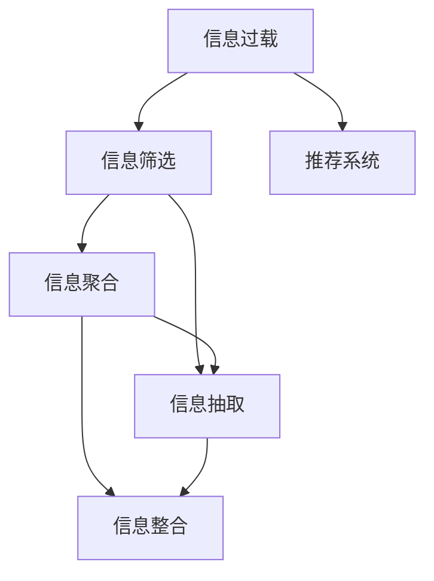

                 

# 信息过载与信息筛选技术：在信息洪流中找到有价值的信息

## 1. 背景介绍

在信息化迅速发展的今天，数据和信息源的数量呈爆炸性增长。社交媒体、新闻网站、博客、论坛、研究论文、科学期刊等，每天产生的海量数据中，有价值的信息往往淹没在无用的数据之中。互联网用户面临信息过载的挑战，需要高效的筛选和聚合技术，才能快速找到所需信息。

信息过载问题不仅影响个人用户的工作效率，也对企业级应用系统带来了巨大的压力。传统的信息检索和推荐系统面临数据量激增、信息多样性增加等问题，需要新的技术和方法来应对。

## 2. 核心概念与联系

### 2.1 核心概念概述

为更好地理解信息筛选技术，本节将介绍几个核心概念：

- **信息过载**：在信息处理过程中，由于信息量过大，信息源过于多样，导致个体难以处理全部信息，从而无法获取有用信息的现象。

- **信息筛选**：从大量信息源中挑选出有用信息，将其与其他无用信息分离的过程。信息筛选可以采用手动浏览、基于规则的自动化、机器学习等方法。

- **信息聚合**：将零散的、孤立的信息源进行组织、分类和聚合，以形成更有结构、更有意义的信息集合。信息聚合通常使用元数据、关系图谱、主题模型等技术。

- **推荐系统**：根据用户的历史行为数据和特征，推荐可能感兴趣的信息和内容。推荐系统广泛应用于电子商务、社交媒体、新闻资讯等领域。

- **信息抽取**：从非结构化数据（如文本、图像、音频等）中提取出有用信息，将其转换为结构化数据。信息抽取使用自然语言处理、计算机视觉等技术。

- **信息整合**：将不同来源和形式的信息进行整合，形成一个统一的信息视图。信息整合有助于解决信息孤岛问题，提高信息利用效率。

这些核心概念之间的逻辑关系可以通过以下Mermaid流程图来展示：



这个流程图展示了几项关键技术之间的相互关系：

1. 信息过载需要通过信息筛选技术来处理，提取有价值的信息。
2. 信息筛选和信息抽取可以互补，将非结构化数据转换为结构化数据。
3. 信息聚合和信息整合有助于形成统一的信息视图，提升信息利用效率。
4. 推荐系统基于用户历史数据，向用户推荐感兴趣的信息。

## 3. 核心算法原理 & 具体操作步骤

### 3.1 算法原理概述

信息筛选技术的核心思想是从大量无用的信息中提取出有价值的内容。其原理可以归结为以下几个方面：

1. **过滤**：基于某些规则或特征对信息进行初步筛选，去除无用的信息。
2. **排序**：根据预设的权重或算法对信息进行排序，选择更重要的信息。
3. **聚类**：使用聚类算法将信息划分为不同的类别，便于用户浏览和检索。
4. **降维**：使用降维算法对高维信息进行处理，降低处理复杂度。

在实际应用中，信息筛选技术通常采用机器学习模型进行自动化处理，通过训练模型学习信息特征，预测信息的价值。常用的机器学习模型包括分类器、聚类器、推荐系统等。

### 3.2 算法步骤详解

以下是信息筛选技术的典型流程：

1. **数据预处理**：将原始数据转换为模型能够处理的格式，包括清洗、归一化、特征提取等步骤。
2. **模型训练**：使用标记数据训练分类器、聚类器、推荐系统等模型，学习信息特征和价值。
3. **特征选择**：根据模型预测结果，选择最重要的特征，去除冗余和噪声。
4. **模型评估**：使用测试集评估模型性能，选择最优模型。
5. **信息筛选**：对新数据进行分类、聚类或推荐，筛选出有价值的信息。

### 3.3 算法优缺点

信息筛选技术的优点包括：

1. 自动化程度高，可处理大规模信息源，提升信息筛选效率。
2. 模型可不断优化，适应数据分布变化，提升筛选效果。
3. 能够自动学习特征，减轻人工干预，降低成本。

但同时也存在一些缺点：

1. 数据质量和标记数据质量直接影响筛选效果，需大量高质量数据。
2. 模型复杂度高，训练和推理成本高，需要高性能计算资源。
3. 部分方法依赖于标注数据，标注数据获取成本较高。
4. 难以处理复杂、非结构化的信息源。
5. 算法透明性不足，难以解释和调试。

### 3.4 算法应用领域

信息筛选技术广泛用于多个领域，包括但不限于：

1. **搜索引擎**：优化搜索结果排序，提升用户体验。
2. **电子商务**：推荐用户可能感兴趣的商品，增加销售额。
3. **新闻网站**：个性化推荐新闻文章，提高用户粘性。
4. **社交媒体**：过滤低质量信息，提高信息曝光率。
5. **智能客服**：筛选常见问题，提高用户满意度。
6. **企业文档管理**：分类和聚类企业文档，便于检索和查询。

## 4. 数学模型和公式 & 详细讲解 & 举例说明

### 4.1 数学模型构建

信息筛选技术的数学模型通常包括分类模型、聚类模型和推荐模型等。

#### 4.1.1 分类模型

分类模型的目标是判断信息是否属于某一类别。常用的分类模型包括朴素贝叶斯、支持向量机、随机森林、神经网络等。

假设有一个二分类问题，模型输入为 $x$，输出为 $y \in \{0, 1\}$，则常见的分类模型可以表示为：

$$
P(y=1|x; \theta) = \sigma(\sum_{i=1}^n w_ix_i + b)
$$

其中 $\sigma$ 为sigmoid函数，$w$ 和 $b$ 为模型参数。

#### 4.1.2 聚类模型

聚类模型的目标是将信息划分为不同的组或簇，每个簇内信息相似度较高。常用的聚类模型包括K-means、层次聚类、DBSCAN等。

假设 $x$ 表示信息特征，$z_i$ 表示聚类标签，则聚类模型可以表示为：

$$
z_i = \mathop{\arg\min}_k \| x_i - \mu_k \|
$$

其中 $\mu_k$ 为聚类中心。

#### 4.1.3 推荐模型

推荐模型的目标是向用户推荐感兴趣的信息。常用的推荐模型包括协同过滤、矩阵分解、深度学习推荐系统等。

假设用户 $u$ 对物品 $i$ 的评分 $r_{ui}$ 为：

$$
r_{ui} = \alpha u_i + \beta v_i + \epsilon
$$

其中 $u_i$ 和 $v_i$ 为物品和用户的特征向量，$\epsilon$ 为噪声项。

### 4.2 公式推导过程

下面以K-means聚类模型为例，推导其算法流程。

K-means聚类的目标是将数据 $x$ 划分为 $K$ 个簇，使得每个簇内的数据点与簇中心点的距离最小。

设 $x$ 表示数据点，$c$ 表示簇中心点，$d(x,c)$ 表示数据点与簇中心点的距离。则K-means算法流程如下：

1. 随机选择 $K$ 个数据点作为初始簇中心。
2. 对于每个数据点，计算其与每个簇中心的距离，将其分配到最近的簇。
3. 对于每个簇，重新计算其簇中心点。
4. 重复步骤2和3，直到簇中心点不再变化或达到预设迭代次数。

### 4.3 案例分析与讲解

以某电子商务平台的商品推荐系统为例，分析信息筛选技术的应用。

该系统使用了深度学习推荐模型，基于用户的历史购买记录、浏览记录、评价等信息，预测用户对新商品的可能评分。

1. **数据预处理**：将用户的点击、购买、浏览行为数据转换为向量形式，进行归一化和特征选择。
2. **模型训练**：使用用户行为数据训练深度学习模型，学习商品和用户之间的关系。
3. **特征选择**：选择用户评分、商品特征等重要特征，去除冗余和噪声。
4. **模型评估**：使用测试集评估模型性能，选择最优模型。
5. **推荐系统**：基于训练好的模型，对用户进行商品推荐，提升用户购物体验。

## 5. 项目实践：代码实例和详细解释说明

### 5.1 开发环境搭建

在进行信息筛选技术开发前，我们需要准备好开发环境。以下是使用Python进行TensorFlow开发的环境配置流程：

1. 安装Anaconda：从官网下载并安装Anaconda，用于创建独立的Python环境。

2. 创建并激活虚拟环境：
```bash
conda create -n tf-env python=3.8 
conda activate tf-env
```

3. 安装TensorFlow：根据CUDA版本，从官网获取对应的安装命令。例如：
```bash
conda install tensorflow tensorflow-cpu -c conda-forge
```

4. 安装各类工具包：
```bash
pip install numpy pandas scikit-learn matplotlib tqdm jupyter notebook ipython
```

完成上述步骤后，即可在`tf-env`环境中开始信息筛选技术的开发。

### 5.2 源代码详细实现

下面以K-means聚类算法为例，给出使用TensorFlow进行信息筛选的Python代码实现。

```python
import tensorflow as tf
import numpy as np
import matplotlib.pyplot as plt

# 创建随机数据
x = np.random.randn(100, 2)
plt.scatter(x[:,0], x[:,1])
plt.show()

# 定义K-means模型
class KMeans:
    def __init__(self, K=2, max_iterations=100):
        self.K = K
        self.max_iterations = max_iterations
        self.centroids = None
        
    def fit(self, data):
        self.centroids = self._init_centroids(data)
        for _ in range(self.max_iterations):
            self._assign_clusters(data)
            self._update_centroids(data)
            
    def _init_centroids(self, data):
        indices = np.random.choice(len(data), self.K, replace=False)
        return data[indices]
    
    def _assign_clusters(self, data):
        self.labels = np.argmin(np.linalg.norm(data[:, np.newaxis] - self.centroids, axis=2), axis=1)
        
    def _update_centroids(self, data):
        new_centroids = np.array([data[self.labels == k].mean(axis=0) for k in range(self.K)])
        self.centroids = new_centroids
    
    def predict(self, data):
        self._assign_clusters(data)
        return self.labels

# 运行K-means模型
kmeans = KMeans(K=2, max_iterations=100)
kmeans.fit(x)
plt.scatter(x[:,0], x[:,1], c=kmeans.labels)
plt.show()
```

### 5.3 代码解读与分析

让我们再详细解读一下关键代码的实现细节：

**KMeans类**：
- `__init__`方法：初始化K值和迭代次数等参数，以及簇中心点。
- `_init_centroids`方法：随机选择K个初始簇中心点。
- `_assign_clusters`方法：计算每个数据点与簇中心点的距离，分配到最近的簇。
- `_update_centroids`方法：根据簇内数据点重新计算簇中心点。
- `predict`方法：预测新数据点的簇标签。

**主程序**：
- 创建随机数据集，并在图表中展示数据分布。
- 实例化KMeans类，并对其训练和预测过程进行展示。

可以看到，TensorFlow提供了丰富的机器学习库，使得信息筛选技术的实现变得简洁高效。开发者可以将更多精力放在数据处理、模型改进等高层逻辑上，而不必过多关注底层的实现细节。

## 6. 实际应用场景

### 6.1 智能客服系统

智能客服系统通过信息筛选技术，可以快速识别用户的问题，并给出相应的解决方案。系统通过分析用户的语音、文字信息，进行情感分析和实体识别，筛选出关键问题，匹配最合适的回答。

在技术实现上，可以使用K-means聚类算法对用户问题进行预分类，使用神经网络模型对问题进行详细分析。微调后的神经网络模型能够从用户描述中提取意图，匹配最合适的回答模板。

### 6.2 个性化推荐系统

个性化推荐系统通过信息筛选技术，为用户推荐感兴趣的商品和内容。系统根据用户的历史行为数据，使用协同过滤、矩阵分解等推荐算法，筛选出与用户偏好相似的商品，并进行排序推荐。

在实际应用中，推荐系统可以结合用户评分数据、商品描述、用户画像等多维数据，使用深度学习推荐模型进行优化，提升推荐效果。

### 6.3 智能文档管理

智能文档管理系统通过信息筛选技术，对企业文档进行分类和聚类，便于用户检索和查询。系统根据文档的标题、摘要、关键词等信息，使用聚类算法将文档分为不同的类别，生成文档索引和导航。

在技术实现上，可以使用K-means、层次聚类等聚类算法，将文档进行分类和聚合。系统还可以使用文本摘要技术，自动生成文档摘要，便于用户快速浏览。

### 6.4 未来应用展望

随着信息筛选技术的不断发展，其在各个领域的应用将更加广泛。

在智慧医疗领域，智能问答系统通过信息筛选技术，可以处理大量的医学知识和病历数据，为医生提供实时信息支持和辅助诊疗。

在智能教育领域，个性化学习系统通过信息筛选技术，可以推荐适合学生水平的学习资源，提高学习效果。

在智慧城市治理中，智能监控系统通过信息筛选技术，可以筛选出异常事件和热点话题，提高城市安全管理和公共服务质量。

此外，在金融、电商、社交媒体等众多领域，信息筛选技术也将发挥重要作用，推动人工智能技术的深度应用。相信随着信息筛选技术的不断进步，智能系统在各个行业的应用将更加深入，提升用户的生活和工作效率。

## 7. 工具和资源推荐

### 7.1 学习资源推荐

为了帮助开发者系统掌握信息筛选技术的理论基础和实践技巧，这里推荐一些优质的学习资源：

1. 《深度学习》系列书籍：涵盖深度学习的基本概念和算法，适合初学者和中级开发者。

2. CS229《机器学习》课程：斯坦福大学开设的机器学习课程，讲解了各种机器学习算法，包括分类、聚类、推荐系统等。

3. 《Python数据科学手册》书籍：详细介绍了Python在数据科学领域的应用，包括数据预处理、模型训练、结果评估等。

4. TensorFlow官方文档：TensorFlow的官方文档，提供了丰富的机器学习库和示例代码，是学习信息筛选技术的必备资料。

5. Scikit-learn官方文档：Scikit-learn的官方文档，提供了丰富的机器学习模型和工具，适合快速原型开发。

通过对这些资源的学习实践，相信你一定能够快速掌握信息筛选技术的精髓，并用于解决实际的NLP问题。

### 7.2 开发工具推荐

高效的开发离不开优秀的工具支持。以下是几款用于信息筛选开发的常用工具：

1. TensorFlow：基于Python的开源深度学习框架，灵活动态的计算图，适合快速迭代研究。TensorFlow提供了丰富的机器学习库，包括分类、聚类、推荐系统等。

2. Scikit-learn：基于Python的机器学习库，提供了丰富的分类、聚类、回归等算法。

3. Keras：基于TensorFlow的高级神经网络库，支持快速搭建深度学习模型，适合初学者使用。

4. Weights & Biases：模型训练的实验跟踪工具，可以记录和可视化模型训练过程中的各项指标，方便对比和调优。与TensorFlow无缝集成。

5. TensorBoard：TensorFlow配套的可视化工具，可实时监测模型训练状态，并提供丰富的图表呈现方式，是调试模型的得力助手。

6. Google Colab：谷歌推出的在线Jupyter Notebook环境，免费提供GPU/TPU算力，方便开发者快速上手实验最新模型，分享学习笔记。

合理利用这些工具，可以显著提升信息筛选技术的开发效率，加快创新迭代的步伐。

### 7.3 相关论文推荐

信息筛选技术的快速发展得益于学界的持续研究。以下是几篇奠基性的相关论文，推荐阅读：

1. 《An Introduction to K-Means Clustering》：详细介绍了K-means聚类算法的原理和实现，适合初学者和中级开发者。

2. 《Collaborative Filtering for Implicit Feedback Datasets》：介绍了协同过滤算法的原理和实现，适合推荐系统的开发者。

3. 《Deep Textual Information Extraction》：介绍了自然语言处理技术在信息抽取中的应用，适合NLP开发者。

4. 《Learning Representations for Multimodal Machine Learning》：介绍了多模态信息融合的原理和实现，适合跨领域应用开发者。

5. 《Data Mining: Concepts and Techniques》：涵盖了数据挖掘和信息抽取的基本概念和算法，适合全面了解信息筛选技术。

这些论文代表了大信息筛选技术的发展脉络。通过学习这些前沿成果，可以帮助研究者把握学科前进方向，激发更多的创新灵感。

## 8. 总结：未来发展趋势与挑战

### 8.1 总结

本文对信息筛选技术的背景、原理和应用进行了全面系统的介绍。首先阐述了信息过载问题的背景和信息筛选技术的意义，明确了信息筛选技术在提升信息利用效率方面的独特价值。其次，从原理到实践，详细讲解了信息筛选的数学模型和算法步骤，给出了信息筛选任务开发的完整代码实例。同时，本文还广泛探讨了信息筛选技术在智能客服、个性化推荐等多个领域的应用前景，展示了信息筛选范式的巨大潜力。此外，本文精选了信息筛选技术的各类学习资源，力求为读者提供全方位的技术指引。

通过本文的系统梳理，可以看到，信息筛选技术在大数据时代具有重要意义，其应用不仅有助于提升信息利用效率，还能够推动各行业的智能化转型。未来，伴随信息技术的不断进步，信息筛选技术将在更多领域发挥重要作用，为人类的生产和生活带来深刻变革。

### 8.2 未来发展趋势

展望未来，信息筛选技术将呈现以下几个发展趋势：

1. **多模态信息融合**：信息筛选技术将更多地结合视觉、语音、文本等多种模态数据，提升信息利用效率。

2. **深度学习技术应用**：深度学习技术在信息筛选中的普及将带来更高的精度和自动化水平，提升系统的智能程度。

3. **实时信息处理**：实时信息处理技术将使信息筛选系统能够更快地响应数据变化，提升用户体验。

4. **联邦学习**：联邦学习技术将使信息筛选系统能够在保护隐私的前提下，利用分布式数据进行模型训练，提升模型效果。

5. **可解释性和透明性**：信息筛选技术将更多地关注模型可解释性和透明性，提供更好的用户体验。

6. **跨领域应用**：信息筛选技术将在更多领域得到应用，如智能制造、智慧城市、智能交通等，推动行业智能化转型。

以上趋势凸显了信息筛选技术的广阔前景。这些方向的探索发展，必将进一步提升信息筛选系统的性能和应用范围，为人类认知智能的进化带来深远影响。

### 8.3 面临的挑战

尽管信息筛选技术已经取得了瞩目成就，但在迈向更加智能化、普适化应用的过程中，它仍面临诸多挑战：

1. **数据质量和标注成本**：高质量数据和标注数据是信息筛选的基础，但标注成本高，数据获取难。如何降低标注成本，提高数据质量，将是一大难题。

2. **模型复杂度和计算资源**：信息筛选技术通常需要高性能计算资源，训练和推理复杂度高，如何优化模型和算法，降低计算成本，将是重要的研究方向。

3. **模型泛化能力**：信息筛选模型需要在多样化的数据上保持良好性能，如何提高模型的泛化能力，避免过拟合，仍需进一步研究。

4. **隐私和安全问题**：信息筛选涉及大量个人数据，如何保护用户隐私，确保数据安全，将是重要的技术挑战。

5. **算法透明性和可解释性**：信息筛选模型通常具有复杂性，如何提高算法的透明性和可解释性，帮助用户理解模型的决策过程，将是重要的研究方向。

6. **跨模态数据融合**：信息筛选技术在多模态数据融合上仍存在挑战，如何更好地整合不同模态的信息，提升整体性能，将是重要的研究方向。

这些挑战需要研究者在理论和实践上不断突破，推动信息筛选技术不断进步。相信随着技术的持续发展，信息筛选技术将在更多的场景下得到应用，为人工智能技术在各行业的落地提供有力支持。

### 8.4 研究展望

面向未来，信息筛选技术需要在以下几个方向进行深入研究：

1. **联邦学习**：探索在保护用户隐私的前提下，利用分布式数据进行信息筛选模型训练。

2. **深度学习**：开发更高效、更准确的深度学习模型，提升信息筛选效果。

3. **多模态融合**：研究多模态数据的融合技术，提升信息筛选系统的智能化水平。

4. **实时处理**：研究实时信息处理技术，提升信息筛选系统的响应速度。

5. **可解释性**：开发更透明的算法模型，提供更好的用户体验。

6. **跨领域应用**：推动信息筛选技术在更多领域的应用，推动人工智能技术的深度应用。

这些研究方向将引领信息筛选技术走向更高的台阶，为人类的生产和生活带来更深远的变革。总之，信息筛选技术需要不断优化模型和算法，提升数据处理能力，才能更好地适应未来信息时代的需求。

## 9. 附录：常见问题与解答

**Q1：信息筛选技术是否适用于所有数据源？**

A: 信息筛选技术通常适用于结构化数据，如表格数据、时间序列数据等。但对于非结构化数据，如文本、图像、音频等，需要进行预处理和特征提取，才能进行信息筛选。对于复杂、多样化的数据源，需要结合多种技术手段进行综合处理。

**Q2：信息筛选模型如何处理噪声和异常数据？**

A: 信息筛选模型通常使用过滤、降维等技术来处理噪声和异常数据。在实际应用中，可以使用K-means聚类、DBSCAN聚类等算法对数据进行预处理，去除异常点和噪声数据，提升信息筛选效果。

**Q3：信息筛选技术是否需要大量的标注数据？**

A: 信息筛选技术通常不需要大量的标注数据，但需要高质量的训练数据。对于推荐系统、分类器等任务，可以使用用户行为数据、物品特征数据等进行训练，无需标注数据。对于聚类算法等，需要选择合适的聚类中心和算法，提升聚类效果。

**Q4：信息筛选技术是否可以应用于多模态数据？**

A: 信息筛选技术可以应用于多模态数据，但需要结合多种技术手段进行综合处理。例如，对于视频数据，可以将其转换为图像序列，进行图像聚类；对于语音数据，可以提取音频特征，进行语音识别；对于文本数据，可以使用自然语言处理技术进行文本摘要和分类。

**Q5：信息筛选技术是否可以应用于实时数据流？**

A: 信息筛选技术可以应用于实时数据流，但需要实时处理和计算能力。在实际应用中，可以使用流处理框架，如Apache Flink、Apache Kafka等，实时处理数据流，进行信息筛选和推荐。

这些问答展示了信息筛选技术在不同应用场景下的关键问题，帮助开发者更好地理解技术细节，提高应用效果。

---

作者：禅与计算机程序设计艺术 / Zen and the Art of Computer Programming

