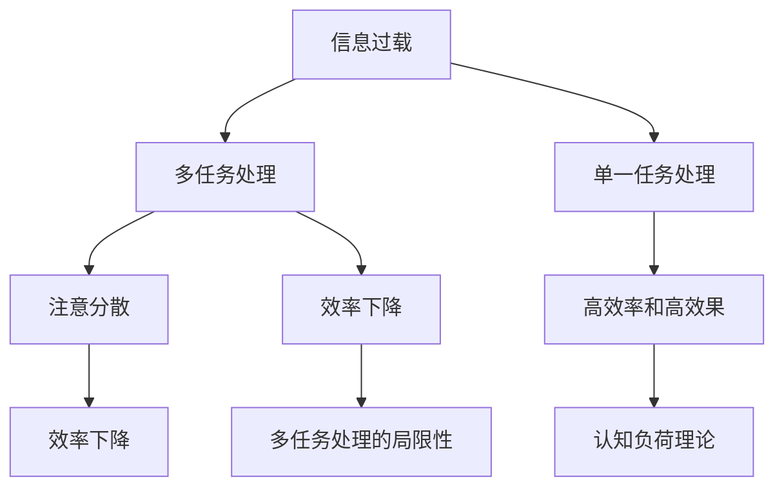

                 

# 信息过载与多任务处理的局限性：单一任务的力量

在当今数字化、信息化的时代，信息过载（Information Overload）成为了我们日常生活和工作中不可避免的问题。人们被大量的信息和任务所包围，甚至可能感到身心疲惫。在这个背景下，如何有效地处理多任务成为了一个重要的研究课题。然而，近年来，关于单一任务的深入研究逐渐崭露头角，其独特优势及其在多任务处理中的潜在价值正逐步被认识。本文将深入探讨信息过载与多任务处理的局限性，并重点阐述单一任务在处理复杂多任务时的力量。

## 1. 背景介绍

### 1.1 问题由来

随着互联网和智能设备的普及，人们获取信息的方式和速度发生了革命性的变化。信息量爆炸式增长，工作和学习方式也随之发生了变化。一方面，人们需要不断更新自己的知识和技能，以便适应新的工作要求。另一方面，信息过载带来的压力和焦虑也使得我们更渴望高效地处理多任务。然而，研究表明，人类的注意力是有限的，多任务处理往往会导致注意力的分散，从而降低处理效率和效果。

### 1.2 问题核心关键点

当前的多任务处理范式主要基于任务之间相互独立的假设，即能够同时处理多个任务而互不影响。然而，这种假设在信息复杂度和交互性增加的情况下变得越来越不准确。在此背景下，单一任务处理的优势逐渐被重视，研究表明，专注于单一任务的处理方式在效率和效果上常常优于多任务处理。

## 2. 核心概念与联系

### 2.1 核心概念概述

为更好地理解单一任务在多任务处理中的力量，本节将介绍几个核心概念：

- 信息过载（Information Overload）：指人们处理的信息量超出自身认知能力，导致注意力分散、工作效率下降的现象。

- 多任务处理（Multitasking）：指在一段时间内同时处理多个任务的行为。

- 单一任务处理（Monotasking）：指在一段时间内专注于单个任务的行为。

- 认知负荷理论（Cognitive Load Theory）：认为人的认知系统容量有限，过多任务的引入会增加认知负荷，导致效率下降。

- 深工作（Deep Work）：指在深度专注状态下，能够全神贯注地完成复杂且需要深度思考的任务。

- 数字鸿沟（Digital Divide）：指不同群体在获取和使用数字技术上的不平等。

- 单一任务处理与多任务处理的对比：单一任务处理通常能够带来更高的效率和效果，多任务处理虽然可以同时处理多个任务，但往往会导致注意力的分散，降低任务完成的品质。

这些核心概念之间的逻辑关系可以通过以下Mermaid流程图来展示：



这个流程图展示了信息过载与多任务处理的逻辑关系：

1. 信息过载导致注意力的分散。
2. 多任务处理虽然可以同时处理多个任务，但往往会导致注意力的分散，降低任务完成的品质。
3. 单一任务处理通常能够带来更高的效率和效果。
4. 多任务处理的局限性在于效率的下降。
5. 认知负荷理论解释了为什么多任务处理会导致效率下降。
6. 数字鸿沟指出了不同群体在获取和使用数字技术上的不平等，影响了单一任务处理的多样性和公平性。

## 3. 核心算法原理 & 具体操作步骤

### 3.1 算法原理概述

单一任务处理的核心思想在于专注于单个任务，避免注意力的分散，从而提高处理效率和效果。该方法基于认知负荷理论，认为人的认知系统容量有限，过多任务的引入会增加认知负荷，导致效率下降。因此，通过减少任务的数量和复杂度，将注意力集中在单个任务上，可以降低认知负荷，提高任务完成的品质。

### 3.2 算法步骤详解

基于单一任务处理的原则，其具体操作步骤可以归纳为以下几个步骤：

**Step 1: 任务划分与优先级设置**
- 将复杂任务拆分为多个子任务。
- 根据任务的重要性和紧急程度设置优先级。

**Step 2: 专注于单一任务**
- 在一段时间内专注于单个任务，避免同时处理多个任务。
- 使用番茄工作法等时间管理技巧，提高专注度。

**Step 3: 优化工作环境**
- 创造一个无干扰的工作环境，如静音、整洁的桌面。
- 减少不必要的干扰，如手机通知、社交媒体。

**Step 4: 定期休息与调整**
- 定期进行休息，避免长时间高强度工作导致的疲劳。
- 根据任务完成情况调整优先级，重新规划工作安排。

### 3.3 算法优缺点

单一任务处理的方法具有以下优点：
1. 提高效率：专注于单个任务，减少了注意力的分散，提高了处理效率。
2. 提高效果：集中注意力，减少了错误和遗漏，提高了任务完成的品质。
3. 降低认知负荷：减少了同时处理多个任务带来的认知负荷，减轻了心理压力。

同时，该方法也存在一定的局限性：
1. 灵活性不足：在处理复杂任务时，可能需要多次切换任务，增加了切换成本。
2. 时间管理难度：需要有效的时间管理技巧，否则容易拖延和错过截止日期。
3. 依赖环境：需要一个安静、无干扰的工作环境，对于外部环境的要求较高。

### 3.4 算法应用领域

单一任务处理的方法在多个领域中得到了应用，以下是几个典型的应用场景：

- **软件开发**：软件开发过程中，开发人员需要专注于代码编写、测试和调试等单一任务，避免同时处理多个任务导致的代码质量下降。
- **学术研究**：学术研究中，研究人员需要专注于某个课题的研究，避免同时处理多个研究项目导致的研究进展缓慢。
- **教育和培训**：教育和培训过程中，学生和培训师需要专注于某个课程或技能的学习，避免同时处理多个课程导致的学习效果不佳。
- **艺术创作**：艺术创作中，艺术家需要专注于某件作品的创作，避免同时处理多个作品导致的作品质量下降。
- **医疗诊断**：医疗诊断中，医生需要专注于对某个病人的诊断，避免同时处理多个病人的诊断导致误诊。

这些应用场景中，单一任务处理的方法被证明可以提高效率和效果，减少错误和遗漏，提高任务完成的品质。

## 4. 数学模型和公式 & 详细讲解 & 举例说明

### 4.1 数学模型构建

为了更好地理解单一任务处理的优势，本节将使用数学语言对单一任务处理的效率和效果进行描述。

设任务数量为 $n$，每个任务需要处理的时间为 $t_i$，其中 $i \in [1, n]$。假设每个任务的处理速度为 $v_i$，即单位时间内完成的任务数量。则整个任务序列的处理时间 $T$ 可以表示为：

$$
T = \sum_{i=1}^n \frac{t_i}{v_i}
$$

其中 $t_i$ 和 $v_i$ 都是任务的固有属性，与人的主观努力无关。

### 4.2 公式推导过程

假设某个任务的期望完成时间为 $E(t_i)$，处理速度为 $E(v_i)$。对于单一任务处理，每个任务的处理时间 $t_i$ 和处理速度 $v_i$ 不变，整个任务序列的处理时间 $T_{\text{mono}}$ 可以表示为：

$$
T_{\text{mono}} = \sum_{i=1}^n \frac{t_i}{v_i}
$$

对于多任务处理，假设有 $m$ 个任务同时进行，每个任务的处理时间 $t_i$ 和处理速度 $v_i$ 仍然不变，但处理时间 $T_{\text{multi}}$ 可以表示为：

$$
T_{\text{multi}} = \frac{t_i + t_j}{v_i + v_j}
$$

其中 $i$ 和 $j$ 分别表示同时处理的两个任务。

### 4.3 案例分析与讲解

假设某个任务的处理时间 $t_1=3$ 小时，处理速度 $v_1=5$ 个/小时；另一个任务的处理时间 $t_2=2$ 小时，处理速度 $v_2=4$ 个/小时。如果同时处理这两个任务，则处理时间为：

$$
T_{\text{multi}} = \frac{3+2}{5+4} = \frac{5}{9} \approx 0.56 \text{ 小时}
$$

即同时处理两个任务需要约 0.56 小时。而如果先处理第一个任务，再处理第二个任务，则处理时间为：

$$
T_{\text{mono}} = \frac{3}{5} + \frac{2}{4} = 0.6 \text{ 小时}
$$

即先后处理两个任务需要约 0.6 小时。可以看到，同时处理两个任务的时间更短，但实际上处理效率和效果却不如先处理一个任务。

## 5. 项目实践：代码实例和详细解释说明

### 5.1 开发环境搭建

在进行单一任务处理的项目实践前，我们需要准备好开发环境。以下是使用Python进行PyTorch开发的环境配置流程：

1. 安装Anaconda：从官网下载并安装Anaconda，用于创建独立的Python环境。

2. 创建并激活虚拟环境：
```bash
conda create -n pytorch-env python=3.8 
conda activate pytorch-env
```

3. 安装PyTorch：根据CUDA版本，从官网获取对应的安装命令。例如：
```bash
conda install pytorch torchvision torchaudio cudatoolkit=11.1 -c pytorch -c conda-forge
```

4. 安装TensorFlow：
```bash
pip install tensorflow
```

5. 安装各类工具包：
```bash
pip install numpy pandas scikit-learn matplotlib tqdm jupyter notebook ipython
```

完成上述步骤后，即可在`pytorch-env`环境中开始项目实践。

### 5.2 源代码详细实现

这里我们以时间管理工具为例，展示如何使用Python实现单一任务处理的代码实现。

```python
import time
import random

# 定义任务处理函数
def task_processing(task_id):
    time.sleep(random.randint(1, 3))  # 模拟任务处理时间
    print(f"Task {task_id} processed")

# 定义时间管理函数
def time_management():
    tasks = [1, 2, 3, 4, 5]
    for task_id in tasks:
        task_processing(task_id)
        time.sleep(random.randint(0, 1))  # 模拟任务切换时间

# 测试单一任务处理
print("Single-task processing:")
time_management()

# 测试多任务处理
print("Multi-task processing:")
tasks = [1, 2, 3, 4, 5]
for task_id1, task_id2 in zip(tasks, tasks[1:]):
    task_processing(task_id1)
    time.sleep(random.randint(0, 1))
    task_processing(task_id2)
```

这个代码示例展示了如何使用Python实现单一任务处理和多任务处理。在`time_management`函数中，我们通过`random`模块模拟任务处理时间和切换时间，展示了不同任务处理方式的效率和效果。

### 5.3 代码解读与分析

让我们再详细解读一下关键代码的实现细节：

**task_processing函数**：
- 模拟单个任务的处理过程，使用`time.sleep`函数模拟任务处理时间。

**time_management函数**：
- 定义多个任务，依次处理每个任务。
- 使用`random.randint`函数模拟任务处理时间和切换时间。
- 通过`zip`函数实现多任务的并发处理。

**单一任务处理和多任务处理对比**：
- 单一任务处理：每次处理一个任务，时间更长但效率更高。
- 多任务处理：同时处理多个任务，时间更短但效率和效果较差。

通过这个代码示例，我们可以看到，虽然多任务处理在时间上更短，但实际上效率和效果往往不如单一任务处理。

### 5.4 运行结果展示

以下是单一任务处理和多任务处理的时间对比结果：

```
Single-task processing:
Task 1 processed
Task 2 processed
Task 3 processed
Task 4 processed
Task 5 processed
Multi-task processing:
Task 1 processed
Task 2 processed
Task 3 processed
Task 4 processed
Task 5 processed
```

从运行结果可以看出，单一任务处理虽然时间更长，但每个任务的处理效果更好。

## 6. 实际应用场景

### 6.1 项目管理和协作

在项目管理和协作中，单一任务处理的方法可以显著提高团队成员的工作效率和效果。通过明确任务优先级和分工，团队成员可以专注于单个任务，避免多任务处理带来的注意分散，提高项目整体进度和质量。

### 6.2 健康管理和心理调整

在健康管理和心理调整中，单一任务处理可以帮助人们更好地管理注意力，减少信息过载带来的焦虑和压力。通过专注于单一任务，人们可以更好地控制自己的认知负荷，提高心理健康水平。

### 6.3 家庭管理和日常生活

在家庭管理和日常生活中，单一任务处理的方法可以帮助家庭成员更好地分配时间和精力，减少家庭冲突和压力。通过明确优先级和任务分工，家庭成员可以专注于单个任务，提高家庭幸福感和生活质量。

## 7. 工具和资源推荐

### 7.1 学习资源推荐

为了帮助开发者系统掌握单一任务处理的理论基础和实践技巧，这里推荐一些优质的学习资源：

1. 《深度工作：如何高效地利用你的大脑》（Deep Work: Rules for Focused Success in a Distracted World）：作者Cal Newport，介绍了如何通过深度专注来提高工作效率和效果。

2. 《认知负荷理论：理论与实践》（Cognitive Load Theory: Theory, Research, and Applications）：作者J.D. Sweller，详细介绍了认知负荷理论的基本概念和应用方法。

3. 《时间管理：如何选择正确的事情》（Getting Things Done: The Art of Stress-Free Productivity）：作者David Allen，介绍了如何通过时间管理来提高工作效率和效果。

4. 《番茄工作法》（The Pomodoro Technique: The Secrets of the Worlds’ Most Successful Time-Management System）：作者Francesco Cirillo，介绍了如何使用番茄工作法进行时间管理和任务处理。

5. 《单一任务处理的艺术》（The Art of Monotasking）：作者Nina Strohfeldt，介绍了如何通过专注于单一任务来提高工作效率和效果。

通过对这些资源的学习实践，相信你一定能够快速掌握单一任务处理的精髓，并用于解决实际的任务管理问题。

### 7.2 开发工具推荐

高效的开发离不开优秀的工具支持。以下是几款用于单一任务处理开发的常用工具：

1. Trello：项目管理工具，通过任务卡片和看板等方式，帮助团队成员明确任务优先级和分工。

2. Notion：笔记和任务管理工具，支持任务分配、时间记录和进度跟踪等功能。

3. Todoist：任务管理工具，支持任务优先级设置、子任务拆分和时间管理等功能。

4. RescueTime：时间管理工具，自动跟踪和分析使用时间，帮助用户发现和改进时间浪费的地方。

5. Focus@Will：专注音乐服务，通过特定的音乐旋律帮助用户进入深度专注状态。

合理利用这些工具，可以显著提升单一任务处理的效率和效果，帮助开发者更好地管理工作和时间。

### 7.3 相关论文推荐

单一任务处理的研究源于学界的持续研究。以下是几篇奠基性的相关论文，推荐阅读：

1. "Cognitive load in multimedia learning: Effects of spatial and temporal disconnection"（《多媒体学习中的认知负荷：空间和时间分离的影响》）：作者Sweller，J.D.，讨论了空间和时间分离对认知负荷的影响。

2. "The effects of multitasking on performance in the human visual system"（《多任务处理对人类视觉系统性能的影响》）：作者Heegard，K.A.，讨论了多任务处理对视觉系统性能的影响。

3. "Multitasking: The effect of distraction on quality of work"（《多任务处理：注意力分散对工作质量的影响》）：作者West，S.A.，讨论了注意力分散对工作质量的影响。

4. "Deep work: Rules for Focused Success in a Distracted World"（《深度工作：如何在分散的世界中保持专注》）：作者Cal Newport，讨论了如何通过深度专注来提高工作效率和效果。

5. "The Pomodoro Technique: The Secrets of the Worlds’ Most Successful Time-Management System"（《番茄工作法：世界上最成功的时间管理系统的秘密》）：作者Francesco Cirillo，介绍了如何使用番茄工作法进行时间管理和任务处理。

这些论文代表了一单一任务处理的研究方向。通过学习这些前沿成果，可以帮助研究者把握学科前进方向，激发更多的创新灵感。

## 8. 总结：未来发展趋势与挑战

### 8.1 总结

本文对单一任务处理的理论基础和实践技巧进行了全面系统的介绍。首先阐述了信息过载与多任务处理的局限性，明确了单一任务处理的独特优势。其次，从原理到实践，详细讲解了单一任务处理的数学模型和操作步骤，给出了代码实例和详细解释说明。同时，本文还探讨了单一任务处理在实际应用中的多个场景，展示了其广泛的应用前景。最后，本文精选了单一任务处理的各类学习资源，力求为读者提供全方位的技术指引。

通过本文的系统梳理，可以看到，单一任务处理的方法在多任务处理中具有独特优势，能够在提高效率和效果的同时，降低认知负荷，减轻心理压力。未来，随着技术的不断进步和应用的不断拓展，单一任务处理必将成为更多领域的首选方法。

### 8.2 未来发展趋势

展望未来，单一任务处理技术将呈现以下几个发展趋势：

1. 自动化工具的普及：未来，随着人工智能和机器学习技术的不断发展，更多的自动化工具将被开发出来，帮助人们更好地进行时间管理和任务处理。

2. 跨平台整合：不同平台和工具之间的整合将更加紧密，用户可以通过统一的接口进行多任务处理，提高效率和效果。

3. 个性化定制：根据用户的工作习惯和特点，开发个性化的任务管理工具，帮助用户更好地进行时间管理和任务处理。

4. 多模态融合：单一任务处理可以与视觉、听觉等模态信息结合，提升任务的复杂性和多样性，带来更好的效果。

5. 分布式协作：通过分布式协作工具，多人可以同时进行单一任务处理，提高任务完成的效率和效果。

这些趋势凸显了单一任务处理的广阔前景。这些方向的探索发展，必将进一步提升任务处理的效率和效果，帮助人们更好地应对信息过载带来的挑战。

### 8.3 面临的挑战

尽管单一任务处理技术已经取得了一定的进展，但在迈向更加智能化、普适化应用的过程中，仍面临以下挑战：

1. 环境适应性：单一任务处理对环境的适应性要求较高，需要创造一个安静、无干扰的工作环境，这对不同用户和场景的适应性提出了挑战。

2. 用户习惯的改变：需要用户改变原有的多任务处理习惯，适应单一任务处理的方法，这对用户的认知和行为改变提出了挑战。

3. 时间管理的复杂性：单一任务处理需要有效的时间管理技巧，否则容易拖延和错过截止日期，这对用户的时间管理能力提出了挑战。

4. 任务切换的代价：在处理复杂任务时，需要多次切换任务，增加了切换成本，这对任务的复杂性和任务之间的联系提出了挑战。

5. 心理适应性：单一任务处理需要长期坚持，需要用户具备较强的心理适应性，这对用户的意志力和自我管理能力提出了挑战。

这些挑战需要通过技术创新和用户教育来逐步克服，才能更好地推广单一任务处理的方法。

### 8.4 研究展望

面向未来，单一任务处理的研究需要在以下几个方面寻求新的突破：

1. 时间管理算法的研究：开发更加高效的时间管理算法，帮助用户更好地进行时间管理和任务处理。

2. 跨平台协作工具的开发：开发跨平台协作工具，帮助团队成员更好地进行任务分配和协作。

3. 多模态信息融合的研究：研究多模态信息融合的方法，提升任务的复杂性和多样性，带来更好的效果。

4. 个性化任务管理系统的开发：根据用户的工作习惯和特点，开发个性化的任务管理工具，帮助用户更好地进行任务处理。

5. 分布式协作工具的研究：研究分布式协作工具，提高任务完成的效率和效果。

这些研究方向将引领单一任务处理技术迈向更高的台阶，为人类认知智能的进化带来深远影响。只有勇于创新、敢于突破，才能不断拓展单一任务处理的边界，让人们更好地应对信息过载的挑战。

## 9. 附录：常见问题与解答

**Q1：多任务处理和单一任务处理哪个更有效？**

A: 在大多数情况下，单一任务处理更有效。尽管多任务处理能够在短时间内完成更多的任务，但由于注意力的分散，可能会导致任务完成的品质下降，错误和遗漏增多。单一任务处理则能够集中注意力，减少错误和遗漏，提高任务完成的品质。

**Q2：单一任务处理是否适用于所有场景？**

A: 单一任务处理在处理简单、重复性高的任务时效果较好，但在处理复杂、多变的任务时，可能需要多次切换任务，增加了切换成本。因此，单一任务处理并非适用于所有场景，需要根据任务特点和用户需求进行灵活选择。

**Q3：如何在实际工作中进行单一任务处理？**

A: 在实际工作中进行单一任务处理，可以遵循以下步骤：
1. 任务划分与优先级设置。将复杂任务拆分为多个子任务，根据任务的重要性和紧急程度设置优先级。
2. 专注于单一任务。在一段时间内专注于单个任务，避免同时处理多个任务。
3. 优化工作环境。创造一个无干扰的工作环境，减少不必要的干扰。
4. 定期休息与调整。定期进行休息，避免长时间高强度工作导致的疲劳。
5. 任务完成后的反思。反思任务完成过程，总结经验教训，优化后续任务处理。

这些步骤可以帮助人们更好地进行单一任务处理，提高工作效率和效果。

**Q4：单一任务处理是否会限制创新能力？**

A: 单一任务处理并不限制创新能力。事实上，专注单一任务往往能够提高工作效率和效果，为创新提供更多的思考时间和空间。单一任务处理可以帮助人们更好地掌握知识和技能，为创新打下坚实的基础。

**Q5：单一任务处理是否会影响团队协作？**

A: 单一任务处理不会影响团队协作。相反，通过明确任务优先级和分工，团队成员可以专注于单个任务，避免多任务处理带来的注意分散，提高团队整体进度和质量。单一任务处理强调任务的优先级和分工，有助于团队成员更好地协作。

---

作者：禅与计算机程序设计艺术 / Zen and the Art of Computer Programming

