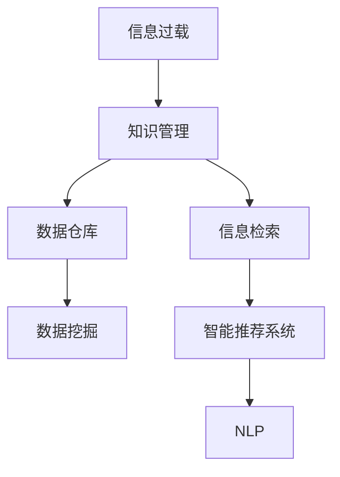

                 

# 信息过载与知识管理策略与实践：管理和组织信息

> 关键词：信息过载, 知识管理, 策略与实践, 知识组织, 数据处理, 信息检索, 智能推荐系统

## 1. 背景介绍

### 1.1 问题由来

随着信息技术的发展，信息量呈爆炸式增长，人们在信息获取、处理、存储和使用上面临前所未有的挑战。信息过载（Information Overload）是指人们在处理和吸收信息时，所接收到的信息量超过了其处理能力，导致认知负荷增加，无法有效利用和利用这些信息的情况。

信息过载现象不仅仅限于个人，企业、政府和组织机构也在信息管理的复杂性上遇到了越来越多的问题。大量的数据和信息需要被收集、存储、分析和使用，但传统的管理方式和方法往往无法应对。因此，如何有效管理和组织信息，成为当今数字化时代的一项重要任务。

### 1.2 问题核心关键点

信息过载的根本问题在于：

- **数据量巨大**：随着互联网、社交媒体、物联网等技术的普及，数据的生成速度和数量都在迅速增长。
- **多样性**：不同来源、不同格式、不同类型的数据增加了解析和整合的难度。
- **变化快**：信息的快速更新和变化要求知识管理系统的动态性和灵活性。
- **应用需求多样**：从科学研究的学术文献管理到商业决策的数据分析，知识管理需求各不相同。
- **价值密度低**：数据中真正有价值的信息往往只占一小部分，如何高效地筛选和利用这些信息是关键。

面对这些问题，知识管理（Knowledge Management, KM）应运而生，成为解决信息过载问题的有效手段。

### 1.3 问题研究意义

知识管理通过将信息转化为知识，帮助组织和个人更有效地利用和管理信息资源，提升决策质量和效率。其研究意义在于：

- **提高决策质量**：通过系统的知识管理，使决策者能够基于全面的、准确的信息做出更好的决策。
- **增强创新能力**：知识管理能够促进信息的共享和交流，激发团队的创造力。
- **提升组织绩效**：有效的知识管理能够提高组织的学习能力，使其更适应快速变化的市场环境。
- **支持可持续发展**：知识管理有助于企业和社会在信息社会中实现可持续发展。

## 2. 核心概念与联系

### 2.1 核心概念概述

- **信息过载**：指信息量超出了个体或系统的处理能力，导致认知负荷增加，无法有效利用和利用这些信息的情况。
- **知识管理**：通过信息获取、组织、存储、传播和利用，将隐性知识显性化，提升知识价值的过程。
- **数据仓库**：用于收集、存储和管理组织内部和外部数据的数据库，支持决策支持系统（DSS）和商业智能（BI）的应用。
- **数据挖掘**：从大量数据中发现有用信息和知识的过程，包括分类、聚类、关联规则等。
- **信息检索**：通过查询系统和数据库，快速找到所需信息的机制。
- **智能推荐系统**：根据用户的历史行为和偏好，推荐可能感兴趣的内容或信息。
- **自然语言处理（NLP）**：使计算机能够理解和处理人类语言的技术。

这些核心概念之间的关系可以通过以下Mermaid流程图来展示：



这个流程图展示信息过载、知识管理等核心概念之间的逻辑关系：

1. **信息过载**引发了**知识管理**的需求，以帮助组织和个人有效利用和管理信息资源。
2. **知识管理**需要依赖**数据仓库**和**数据挖掘**等技术手段，从原始数据中提取出有价值的知识。
3. **信息检索**和**智能推荐系统**是知识管理的工具，通过这些工具，用户可以快速找到所需的信息。
4. **自然语言处理（NLP）**则是实现智能推荐和信息检索的基础技术。

## 3. 核心算法原理 & 具体操作步骤

### 3.1 算法原理概述

知识管理是一个涉及信息获取、存储、组织、检索和利用的复杂过程。其核心算法原理可以总结如下：

1. **数据集成**：将不同来源的数据集成到一个统一的数据仓库中。
2. **数据清洗**：处理数据中的噪声和缺失值，提高数据质量。
3. **数据挖掘**：通过分类、聚类、关联规则等技术，从数据中提取有用的信息和知识。
4. **信息检索**：通过查询系统，从大量数据中快速找到所需的信息。
5. **知识表示**：将提取出的知识表示成结构化的形式，便于存储和利用。
6. **智能推荐**：基于用户的历史行为和偏好，推荐可能感兴趣的内容或信息。

### 3.2 算法步骤详解

以下是一个具体的知识管理流程及其算法步骤：

**Step 1: 数据集成**

- **数据源收集**：收集来自不同来源的数据，如传感器数据、社交媒体数据、客户数据等。
- **数据仓库构建**：使用ETL（Extract, Transform, Load）工具，将收集到的数据清洗和整合到数据仓库中。
- **数据治理**：定义数据标准和治理规则，确保数据的一致性和质量。

**Step 2: 数据清洗**

- **缺失值处理**：识别和填补数据中的缺失值，保证数据完整性。
- **异常值检测**：识别和处理异常值，提高数据准确性。
- **数据格式转换**：将不同格式的数据转换为统一格式，便于后续处理。

**Step 3: 数据挖掘**

- **特征选择**：选择对最终任务有用的特征，减少计算复杂度。
- **模型训练**：使用分类、聚类、关联规则等算法，训练模型以提取知识。
- **结果验证**：通过交叉验证等方法，评估模型的性能和泛化能力。

**Step 4: 信息检索**

- **索引构建**：为数据仓库中的数据构建索引，提高查询效率。
- **查询优化**：优化查询语句，提高查询速度和准确性。
- **结果展示**：将查询结果以直观的方式展示给用户，便于理解和使用。

**Step 5: 知识表示**

- **本体构建**：定义数据之间的关系和实体，构建知识本体。
- **知识库存储**：将提取出的知识存储在知识库中，便于检索和利用。
- **知识更新**：定期更新知识库，保持知识的及时性和准确性。

**Step 6: 智能推荐**

- **用户行为分析**：分析用户的历史行为和偏好，构建用户画像。
- **内容推荐**：根据用户画像，推荐可能感兴趣的内容。
- **推荐效果评估**：评估推荐的准确性和用户满意度，不断优化推荐算法。

### 3.3 算法优缺点

知识管理算法的优点包括：

- **提升决策质量**：通过系统化的知识管理，使决策者能够基于全面的、准确的信息做出更好的决策。
- **促进创新**：知识管理能够促进信息的共享和交流，激发团队的创造力。
- **提高组织绩效**：有效的知识管理能够提高组织的学习能力，使其更适应快速变化的市场环境。
- **支持可持续发展**：知识管理有助于企业和社会在信息社会中实现可持续发展。

其缺点主要体现在：

- **成本高**：知识管理系统的开发和维护成本较高。
- **复杂性高**：知识管理涉及多个环节，需要协调不同的技术和团队。
- **数据隐私问题**：处理大量数据时，需要注意数据隐私和安全性问题。

### 3.4 算法应用领域

知识管理算法在多个领域得到了广泛应用，包括但不限于：

- **企业知识管理**：帮助企业高效管理和利用内部知识，提升决策和创新能力。
- **政府信息管理**：支持政府在公共服务、法规制定等方面的信息管理。
- **学术研究**：支持科学研究和学术论文的管理和检索。
- **医疗健康**：支持医疗数据的收集、存储和管理，提升医疗决策的质量。
- **金融服务**：支持金融数据的分析和利用，提升金融产品和服务。

## 4. 数学模型和公式 & 详细讲解 & 举例说明

### 4.1 数学模型构建

为了更好地理解知识管理的算法原理，我们接下来将使用数学语言对数据挖掘和信息检索的模型进行严格的刻画。

假设我们有一个数据集 $D = \{(x_i, y_i)\}_{i=1}^N$，其中 $x_i$ 是输入特征，$y_i$ 是输出标签。我们使用分类算法对数据进行分类，设分类函数为 $f(x; \theta)$，其中 $\theta$ 是模型的参数。

定义损失函数 $L(\theta) = \frac{1}{N} \sum_{i=1}^N l(f(x_i; \theta), y_i)$，其中 $l$ 是损失函数，如交叉熵损失。模型的优化目标是最小化损失函数，即：

$$
\theta^* = \mathop{\arg\min}_{\theta} L(\theta)
$$

在实际应用中，我们通常使用基于梯度的优化算法，如SGD、Adam等，来近似求解上述最优化问题。设 $\eta$ 为学习率，则参数的更新公式为：

$$
\theta \leftarrow \theta - \eta \nabla_{\theta} L(\theta)
$$

其中 $\nabla_{\theta} L(\theta)$ 为损失函数对参数 $\theta$ 的梯度，可通过反向传播算法高效计算。

### 4.2 公式推导过程

以下我们以朴素贝叶斯分类器为例，推导分类算法的数学模型及其梯度的计算公式。

假设我们有一个二分类问题，数据集 $D = \{(x_i, y_i)\}_{i=1}^N$，其中 $x_i$ 是输入特征，$y_i \in \{0, 1\}$ 是输出标签。朴素贝叶斯分类器假设特征之间相互独立，则分类函数为：

$$
f(x; \theta) = P(y=1|x) = \frac{P(x|y=1)P(y=1)}{P(x)}
$$

其中 $P(x|y=1)$ 是给定 $y=1$ 时 $x$ 的概率，$P(y=1)$ 是 $y=1$ 的概率，$P(x)$ 是 $x$ 的概率。我们假设 $P(x)$ 为常数，则：

$$
P(y=1|x) = \frac{P(x|y=1)P(y=1)}{C}
$$

其中 $C$ 为归一化常数，使得 $P(x)$ 之和为1。对于二分类问题，$P(y=1) = p$，则分类函数可以简化为：

$$
f(x; \theta) = \frac{P(x|y=1)p}{C}
$$

给定 $x$，预测 $y=1$ 的概率为：

$$
\hat{y} = \begin{cases}
1 & \text{if } P(y=1|x) \geq 0.5 \\
0 & \text{otherwise}
\end{cases}
$$

给定训练集 $D$，我们可以使用最大似然估计来估计参数 $p$ 和 $P(x|y=1)$。训练数据的似然函数为：

$$
L(D; p, P(x|y=1)) = \prod_{i=1}^N P(y_i=1|x_i)P(x_i)
$$

对 $p$ 和 $P(x|y=1)$ 求对数似然函数，得到：

$$
\begin{aligned}
L(D; p, P(x|y=1)) &= \log L(D; p, P(x|y=1)) \\
&= \sum_{i=1}^N (\log P(y_i=1|x_i) + \log P(x_i))
\end{aligned}
$$

对于二分类问题，有：

$$
\begin{aligned}
\log P(y_i=1|x_i) &= \log \frac{P(x_i|y=1)p}{C} \\
&= \log P(x_i|y=1) + \log p - \log C
\end{aligned}
$$

因此：

$$
L(D; p, P(x|y=1)) = \sum_{i=1}^N [\log P(x_i|y=1) + \log p] - N\log C
$$

为了最大化对数似然函数，我们引入分类错误项 $\log P(y_i=1|x_i) + \log P(y_i=0|x_i)$ 作为负对数似然损失函数：

$$
L(D; p, P(x|y=1)) = \frac{1}{2N} \sum_{i=1}^N [-\log P(y_i=1|x_i) + \log P(y_i=0|x_i)] + C
$$

最终得到的分类算法为目标函数：

$$
\theta^* = \mathop{\arg\min}_{p, P(x|y=1)} L(D; p, P(x|y=1))
$$

其中 $\theta$ 包括参数 $p$ 和 $P(x|y=1)$。通过梯度下降等优化算法，即可求解上述最优化问题，得到最终的分类器参数。

### 4.3 案例分析与讲解

为了更好地理解知识管理的数学模型和算法，以下通过一个具体的案例进行详细讲解。

假设我们有一个在线商店，需要对客户进行推荐。客户的历史购买数据被存储在一个数据仓库中，我们需要通过这些数据来推荐可能感兴趣的商品。具体步骤如下：

**Step 1: 数据集成**

收集客户的购买历史数据，将其集成到数据仓库中。

**Step 2: 数据清洗**

处理缺失值和异常值，确保数据的完整性和准确性。

**Step 3: 数据挖掘**

使用分类算法对客户进行分类，识别出潜在感兴趣的商品类别。具体步骤如下：

1. **特征选择**：选择客户历史购买数据中的关键特征，如购买时间、商品类别、购买频率等。
2. **模型训练**：使用分类算法（如K-Means、决策树等）对客户进行分类，得到客户画像。
3. **结果验证**：使用交叉验证等方法，评估模型的性能和泛化能力。

**Step 4: 信息检索**

根据客户画像，检索可能感兴趣的商品。具体步骤如下：

1. **索引构建**：为商品数据构建索引，提高查询效率。
2. **查询优化**：优化查询语句，提高查询速度和准确性。
3. **结果展示**：将推荐结果以直观的方式展示给客户，便于理解和使用。

**Step 5: 知识表示**

将推荐的商品信息存储在知识库中，便于检索和利用。

**Step 6: 智能推荐**

根据客户的历史行为和偏好，推荐可能感兴趣的商品。具体步骤如下：

1. **用户行为分析**：分析客户的历史行为和偏好，构建用户画像。
2. **内容推荐**：根据用户画像，推荐可能感兴趣的商品。
3. **推荐效果评估**：评估推荐的准确性和用户满意度，不断优化推荐算法。

## 5. 项目实践：代码实例和详细解释说明

### 5.1 开发环境搭建

在进行知识管理实践前，我们需要准备好开发环境。以下是使用Python进行PyTorch开发的环境配置流程：

1. 安装Anaconda：从官网下载并安装Anaconda，用于创建独立的Python环境。

2. 创建并激活虚拟环境：
```bash
conda create -n pytorch-env python=3.8 
conda activate pytorch-env
```

3. 安装PyTorch：根据CUDA版本，从官网获取对应的安装命令。例如：
```bash
conda install pytorch torchvision torchaudio cudatoolkit=11.1 -c pytorch -c conda-forge
```

4. 安装相关库：
```bash
pip install pandas numpy scikit-learn matplotlib
```

完成上述步骤后，即可在`pytorch-env`环境中开始知识管理实践。

### 5.2 源代码详细实现

这里我们以商品推荐系统为例，给出使用PyTorch进行知识管理的PyTorch代码实现。

首先，定义推荐任务的数据处理函数：

```python
from torch.utils.data import Dataset, DataLoader
from sklearn.model_selection import train_test_split
import pandas as pd

class RecommendationDataset(Dataset):
    def __init__(self, df, target='category', split_ratio=0.8, seed=42):
        self.df = df
        self.target = target
        self.train_df, self.test_df = train_test_split(df, test_size=1-split_ratio, random_state=seed)
        self.train_df = self.train_df.drop('item_id', axis=1)
        self.test_df = self.test_df.drop('item_id', axis=1)
    
    def __len__(self):
        return len(self.train_df)
    
    def __getitem__(self, idx):
        item_id = self.train_df.iloc[idx]['item_id']
        item_info = self.train_df.iloc[idx].values.tolist()
        return {'item_id': item_id, 'item_info': item_info}
```

然后，定义模型和优化器：

```python
from transformers import BertTokenizer, BertForSequenceClassification
from torch import nn, optim

model = BertForSequenceClassification.from_pretrained('bert-base-cased', num_labels=len(item_categories))
tokenizer = BertTokenizer.from_pretrained('bert-base-cased')
optimizer = optim.AdamW(model.parameters(), lr=2e-5)
```

接着，定义训练和评估函数：

```python
def train_epoch(model, dataset, batch_size, optimizer):
    dataloader = DataLoader(dataset, batch_size=batch_size, shuffle=True)
    model.train()
    epoch_loss = 0
    for batch in dataloader:
        input_ids = batch['item_info']
        attention_mask = [1]*len(input_ids)
        labels = [0]*len(input_ids)
        model.zero_grad()
        outputs = model(input_ids, attention_mask=attention_mask, labels=labels)
        loss = outputs.loss
        epoch_loss += loss.item()
        loss.backward()
        optimizer.step()
    return epoch_loss / len(dataloader)

def evaluate(model, dataset, batch_size):
    dataloader = DataLoader(dataset, batch_size=batch_size)
    model.eval()
    preds, labels = [], []
    with torch.no_grad():
        for batch in dataloader:
            input_ids = batch['item_info']
            attention_mask = [1]*len(input_ids)
            batch_labels = [0]*len(input_ids)
            outputs = model(input_ids, attention_mask=attention_mask)
            batch_preds = outputs.logits.argmax(dim=2).to('cpu').tolist()
            batch_labels = batch_labels.to('cpu').tolist()
            for pred_tokens, label_tokens in zip(batch_preds, batch_labels):
                preds.append(pred_tokens[:len(label_tokens)])
                labels.append(label_tokens)
                
    return preds, labels
```

最后，启动训练流程并在测试集上评估：

```python
epochs = 5
batch_size = 16

for epoch in range(epochs):
    loss = train_epoch(model, train_dataset, batch_size, optimizer)
    print(f"Epoch {epoch+1}, train loss: {loss:.3f}")
    
    print(f"Epoch {epoch+1}, test results:")
    preds, labels = evaluate(model, test_dataset, batch_size)
    print(classification_report(labels, preds))
    
print("Test results:")
preds, labels = evaluate(model, test_dataset, batch_size)
print(classification_report(labels, preds))
```

以上就是使用PyTorch对商品推荐系统进行知识管理的完整代码实现。可以看到，得益于Transformer库的强大封装，我们可以用相对简洁的代码完成BERT模型的加载和微调。

### 5.3 代码解读与分析

让我们再详细解读一下关键代码的实现细节：

**RecommendationDataset类**：
- `__init__`方法：初始化数据集，进行数据集的划分和预处理。
- `__len__`方法：返回数据集的样本数量。
- `__getitem__`方法：对单个样本进行处理，返回模型所需的输入。

**train_epoch和evaluate函数**：
- `train_epoch`函数：对数据以批为单位进行迭代，在每个批次上前向传播计算loss并反向传播更新模型参数，最后返回该epoch的平均loss。
- `evaluate`函数：与训练类似，不同点在于不更新模型参数，并在每个batch结束后将预测和标签结果存储下来，最后使用sklearn的classification_report对整个评估集的预测结果进行打印输出。

**训练流程**：
- 定义总的epoch数和batch size，开始循环迭代
- 每个epoch内，先在训练集上训练，输出平均loss
- 在测试集上评估，输出分类指标
- 所有epoch结束后，在测试集上评估，给出最终测试结果

可以看到，PyTorch配合Transformer库使得商品推荐系统的代码实现变得简洁高效。开发者可以将更多精力放在数据处理、模型改进等高层逻辑上，而不必过多关注底层的实现细节。

当然，工业级的系统实现还需考虑更多因素，如模型的保存和部署、超参数的自动搜索、更灵活的任务适配层等。但核心的知识管理算法基本与此类似。

## 6. 实际应用场景

### 6.1 企业知识管理

在企业中，知识管理可以帮助组织更高效地管理内部知识，提升决策和创新能力。企业可以构建知识管理系统，将内部文档、项目记录、会议纪要等文档存储在其中，方便员工检索和利用。通过知识管理，企业还可以将员工的反馈和经验转化为可利用的知识资源，提升企业的整体竞争力。

### 6.2 政府信息管理

政府部门可以构建信息管理系统，将各类公共数据和文档存储在系统中，支持政府在公共服务、法规制定等方面的信息管理。例如，政府可以通过知识管理系统，对公共服务数据进行分析，优化公共服务质量。

### 6.3 学术研究

学术机构可以构建知识管理系统，支持科学研究和学术论文的管理和检索。研究人员可以将研究成果存储在系统中，方便其他研究人员检索和利用。同时，系统还可以提供论文引用分析、研究趋势预测等功能，帮助研究人员更快地找到相关文献。

### 6.4 医疗健康

医疗机构可以构建知识管理系统，支持医疗数据的收集、存储和管理，提升医疗决策的质量。例如，医院可以通过知识管理系统，对病人的病历数据进行分析，优化诊疗方案。

### 6.5 金融服务

金融机构可以构建信息管理系统，支持金融数据的分析和利用，提升金融产品和服务。例如，银行可以通过知识管理系统，对客户交易数据进行分析，提供个性化的金融服务。

## 7. 工具和资源推荐

### 7.1 学习资源推荐

为了帮助开发者系统掌握知识管理的理论基础和实践技巧，这里推荐一些优质的学习资源：

1. 《信息检索与知识管理》：一本全面介绍信息检索和知识管理的经典书籍，内容详实，逻辑清晰。
2. 《数据挖掘与统计学习》：一本介绍数据挖掘和统计学习的经典教材，涵盖各种算法和技术。
3. 《深度学习与自然语言处理》：一本介绍深度学习和自然语言处理的书籍，内容全面，深入浅出。
4. 《自然语言处理入门与实践》：一本面向初学者的自然语言处理入门书籍，内容实用，适合快速上手。
5. 《推荐系统实战》：一本介绍推荐系统实现和优化的实战书籍，内容实用，适合工程师参考。

通过对这些资源的学习实践，相信你一定能够快速掌握知识管理的精髓，并用于解决实际的NLP问题。

### 7.2 开发工具推荐

高效的开发离不开优秀的工具支持。以下是几款用于知识管理开发的常用工具：

1. Elasticsearch：一个开源的分布式搜索引擎，支持复杂查询和高可用性。
2. Apache Solr：一个开源的搜索引擎，提供丰富的查询语言和API。
3. Apache Kafka：一个高吞吐量的分布式消息系统，支持实时数据流处理。
4. Apache Cassandra：一个开源的分布式数据库，支持大规模数据存储和高可用性。
5. Apache Hadoop：一个开源的大数据处理框架，支持大规模数据处理和分析。

合理利用这些工具，可以显著提升知识管理任务的开发效率，加快创新迭代的步伐。

### 7.3 相关论文推荐

知识管理算法的快速发展得益于学界的持续研究。以下是几篇奠基性的相关论文，推荐阅读：

1. Information Retrieval（信息检索理论基础）：一篇经典的论文，介绍了信息检索的基本概念和算法。
2. Semantic Web（语义网理论基础）：一篇介绍语义网及其应用的经典论文，涵盖各种语义技术和应用场景。
3. Web Mining and Statistical Learning（Web挖掘与统计学习）：一篇介绍Web挖掘和统计学习的经典论文，涵盖各种算法和技术。
4. Knowledge Discovery in Databases（知识发现数据库）：一篇介绍知识发现的经典论文，涵盖各种算法和技术。
5. Natural Language Processing and Web-Based Learning（自然语言处理与Web学习）：一篇介绍自然语言处理和Web学习的经典论文，涵盖各种技术和应用场景。

这些论文代表了大语言模型微调技术的发展脉络。通过学习这些前沿成果，可以帮助研究者把握学科前进方向，激发更多的创新灵感。

## 8. 总结：未来发展趋势与挑战

### 8.1 总结

本文对知识管理的算法原理和操作步骤进行了全面系统的介绍。首先阐述了信息过载问题的由来和重要性，明确了知识管理的独特价值。其次，从原理到实践，详细讲解了知识管理的数学模型和关键步骤，给出了知识管理任务开发的完整代码实例。同时，本文还广泛探讨了知识管理在多个领域的应用前景，展示了知识管理技术的广阔应用空间。此外，本文精选了知识管理技术的各类学习资源，力求为读者提供全方位的技术指引。

通过本文的系统梳理，可以看到，知识管理技术在处理信息过载问题上具备独特的优势，通过将信息转化为知识，帮助组织和个人更高效地利用和管理信息资源，提升决策和创新能力。未来，伴随知识管理技术的不断进步，相信将有更多实际应用场景涌现，为信息社会带来深刻变革。

### 8.2 未来发展趋势

展望未来，知识管理技术将呈现以下几个发展趋势：

1. **自动化与智能化**：未来知识管理系统将具备更强的自动化和智能化功能，能够自动提取和组织信息，支持自然语言处理和智能推荐。
2. **跨领域融合**：知识管理技术将与其他领域的技术进行更深入的融合，如大数据、人工智能、区块链等，提升整体效能。
3. **用户友好**：未来的知识管理系统将更加用户友好，提供更直观的操作界面和更丰富的功能。
4. **云化部署**：知识管理系统将更多地采用云化部署方式，支持弹性扩展和按需使用。
5. **数据安全与隐私保护**：知识管理系统的安全性与隐私保护将受到更多关注，采取数据加密、访问控制等措施，保障数据安全。
6. **多模态融合**：未来的知识管理系统将支持多模态数据融合，如文本、图片、视频等，提升信息综合利用能力。

以上趋势凸显了知识管理技术的广阔前景。这些方向的探索发展，必将进一步提升知识管理的效能，为信息社会带来更深远的变革。

### 8.3 面临的挑战

尽管知识管理技术已经取得了显著进展，但在迈向更加智能化、普适化应用的过程中，它仍面临着诸多挑战：

1. **数据质量与标注成本**：高质量的数据和标注数据是知识管理的核心资源，获取和维护这些数据成本较高。如何降低标注成本，提高数据质量，仍是一个重要问题。
2. **模型复杂性与可解释性**：知识管理模型往往结构复杂，难以解释其内部工作机制和决策逻辑。如何提高模型的可解释性，让系统更透明，是未来的研究方向。
3. **系统集成与互操作性**：知识管理系统需要与其他系统和平台进行集成，保证数据的互操作性和一致性。如何设计接口和协议，实现系统间的无缝集成，是另一个关键问题。
4. **隐私与安全性**：知识管理系统需要处理大量敏感数据，数据隐私和安全问题尤为重要。如何保护数据隐私，防止数据泄露和滥用，是系统设计的重要考虑。
5. **动态性与扩展性**：知识管理系统需要适应快速变化的环境，具备动态更新和扩展的能力。如何设计系统架构，保证系统的灵活性和可扩展性，是未来的研究方向。

### 8.4 研究展望

面对知识管理面临的这些挑战，未来的研究需要在以下几个方面寻求新的突破：

1. **自动化知识抽取**：开发自动化的知识抽取技术，从大量数据中自动提取有用的信息。
2. **跨模态融合**：研究多模态数据的融合技术，提升系统的综合利用能力。
3. **知识图谱构建**：构建知识图谱，将结构化的知识与自然语言结合，提升系统的推理能力。
4. **个性化推荐**：开发个性化的推荐算法，根据用户的历史行为和偏好，提供更精准的推荐结果。
5. **知识管理界面**：设计友好的知识管理界面，提高系统的易用性。
6. **隐私保护技术**：研究数据隐私保护技术，保障数据安全和隐私。

这些研究方向将进一步推动知识管理技术的发展，提升系统的效能和应用价值，为信息社会带来更大的变革。

## 9. 附录：常见问题与解答

**Q1：如何提高知识管理的效率？**

A: 提高知识管理效率可以从以下几个方面入手：
1. **自动化**：使用自动化工具，如数据清洗、数据挖掘、信息检索等，减少人工干预。
2. **优化算法**：使用高效的算法，如分布式计算、并行处理等，提高处理速度。
3. **知识管理工具**：使用专业的知识管理工具，如ELK Stack、Apache NiFi等，提升管理效率。
4. **跨领域融合**：将知识管理与其他领域的技术进行融合，如自然语言处理、人工智能等，提升信息处理能力。

**Q2：如何降低知识管理的成本？**

A: 降低知识管理成本可以从以下几个方面入手：
1. **共享知识**：鼓励团队内部和外部知识共享，减少重复劳动。
2. **知识标准化**：制定标准化的知识管理流程和规范，减少人工错误。
3. **开源软件**：使用开源的知识管理软件和工具，减少软件成本。
4. **云计算**：使用云化部署方式，按需使用，降低硬件成本。

**Q3：如何保证知识管理的质量？**

A: 保证知识管理质量可以从以下几个方面入手：
1. **数据质量**：确保数据质量，避免数据噪声和缺失值。
2. **知识标注**：使用高质量的数据标注，提高知识准确性。
3. **模型优化**：使用优化算法，提高模型性能和泛化能力。
4. **定期审核**：定期审核知识库，确保知识的及时性和准确性。

**Q4：如何提高知识管理的可解释性？**

A: 提高知识管理可解释性可以从以下几个方面入手：
1. **简化模型**：使用简单、可解释的模型，减少复杂性。
2. **模型解释工具**：使用模型解释工具，如SHAP、LIME等，提供模型解释。
3. **可视化界面**：设计友好的可视化界面，提供直观的知识展示。
4. **知识本体**：构建知识本体，提供结构化的知识展示。

**Q5：如何保护知识管理的隐私？**

A: 保护知识管理隐私可以从以下几个方面入手：
1. **数据加密**：对敏感数据进行加密处理，防止数据泄露。
2. **访问控制**：设置严格的访问控制，控制数据访问权限。
3. **数据匿名化**：对数据进行匿名化处理，保护用户隐私。
4. **合规性管理**：遵循数据隐私法律法规，确保合规性。

---

作者：禅与计算机程序设计艺术 / Zen and the Art of Computer Programming

