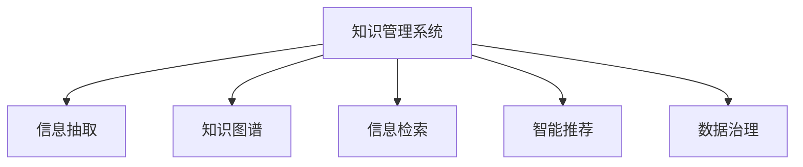

                 

# 信息过载与知识管理系统实施：管理和组织信息以提高生产力

> 关键词：信息过载, 知识管理, 人工智能, 机器学习, 数据治理, 自然语言处理(NLP), 企业级应用, 智能推荐

## 1. 背景介绍

### 1.1 问题由来
在现代社会中，信息爆炸已经成为不争的事实。企业员工需要处理的海量电子邮件、文档、报告、数据以及社交媒体信息，使得日常工作中常常出现信息过载（Information Overload）的现象。信息过载不仅降低了工作效率，还可能导致决策失误、工作压力增大以及创新能力下降等问题。

解决信息过载的关键在于有效管理和组织信息，使其能够更好地服务于企业决策、创新和客户需求。知识管理系统（Knowledge Management System, KMS）的实施成为了一个应对这一挑战的解决方案。通过集成人工智能（AI）、机器学习（ML）、自然语言处理（NLP）等先进技术，知识管理系统能够自动地抓取、整理、分析和管理企业内部的信息资源，实现信息的高效利用和价值最大化。

### 1.2 问题核心关键点
知识管理系统的核心任务包括信息的获取、存储、检索、共享和应用等环节。其核心技术包括：

1. **信息抽取**：通过自然语言处理（NLP）技术从非结构化文本中抽取关键信息，转化为结构化数据。
2. **知识库构建**：将抽取出的关键信息组织成有结构的知识库，供后续分析和应用使用。
3. **信息检索**：利用信息检索技术快速定位所需信息，支持企业决策和客户服务。
4. **智能推荐**：通过机器学习算法分析用户行为和需求，实现个性化信息推荐。
5. **知识图谱**：构建基于实体关系的数据模型，增强知识的管理和推理能力。

通过这些技术，企业可以有效管理和利用信息，提升工作效率和创新能力。

### 1.3 问题研究意义
实施知识管理系统，对于提升企业生产力和竞争力，具有重要意义：

1. **提升决策质量**：通过结构化的知识库和智能推荐系统，帮助企业快速获取关键信息，支持决策制定，减少决策失误。
2. **加速创新进程**：利用知识管理系统的知识整合和检索功能，快速定位创新灵感，推动技术创新和产品开发。
3. **提高客户满意度**：通过智能推荐和知识检索功能，提供个性化服务，增强客户体验和满意度。
4. **优化工作流程**：通过自动化信息处理和知识共享，减少人工操作，优化业务流程，提高工作效率。
5. **应对市场变化**：利用知识管理系统的数据分析和智能推荐功能，实时响应市场变化，保持竞争优势。

## 2. 核心概念与联系

### 2.1 核心概念概述

为更好地理解知识管理系统的实施方法，本节将介绍几个密切相关的核心概念：

- **知识管理系统(KMS)**：通过计算机技术和人工智能手段，对企业内部信息进行管理和利用，促进知识的创建、存储、检索和应用的系统。
- **信息抽取（Information Extraction, IE）**：从非结构化文本中自动提取关键实体、关系、事件等信息的技术。
- **知识图谱（Knowledge Graph）**：基于实体和关系的数据模型，用于表示知识库中的信息结构，支持复杂推理。
- **信息检索（Information Retrieval, IR）**：通过计算查询和文档之间的相关度，快速定位信息的技术。
- **智能推荐（Recommendation System）**：通过分析用户行为和偏好，自动推荐个性化内容的技术。
- **数据治理（Data Governance）**：确保数据质量、一致性和安全性的管理框架和实践。

这些概念之间的逻辑关系可以通过以下Mermaid流程图来展示：



这个流程图展示了这个过程中各个关键技术环节的联系：

1. 知识管理系统的构建基于信息抽取、知识图谱、信息检索和智能推荐等技术。
2. 数据治理是知识管理系统的基础，确保信息质量和数据安全。
3. 信息抽取从原始文本中提取关键信息，形成结构化的知识单元。
4. 知识图谱将这些知识单元组织成有结构的知识库，支持复杂推理和应用。
5. 信息检索提供快速定位信息的功能，支持决策和客户服务。
6. 智能推荐根据用户行为和需求，提供个性化信息服务。

## 3. 核心算法原理 & 具体操作步骤
### 3.1 算法原理概述

知识管理系统的核心算法原理基于信息抽取、知识图谱构建、信息检索和智能推荐等技术。下面将详细介绍这些核心算法的原理和操作步骤。

### 3.2 算法步骤详解

**Step 1: 数据准备和预处理**

知识管理系统需要处理的数据通常包括企业内部的文档、报告、邮件、网页等非结构化文本。这些数据需要经过清洗、分词、去除停用词等预处理步骤，才能用于后续的信息抽取和分析。

1. **文本清洗**：去除噪声和无关信息，如HTML标签、标点符号、数字等。
2. **分词**：将文本分割成单独的词或短语，便于后续处理。
3. **去除停用词**：去除常见的无意义词汇，如“的”、“是”等。

**Step 2: 信息抽取**

信息抽取是知识管理系统中的一个关键环节，其目标是从文本中自动提取关键信息，如实体、关系、事件等。常用的信息抽取方法包括规则抽取和统计抽取。

1. **规则抽取**：基于语言学规则和知识库，自动标注文本中的实体和关系。
2. **统计抽取**：通过机器学习模型训练，识别文本中的实体和关系。

**Step 3: 知识图谱构建**

知识图谱是将抽取出的信息组织成有结构的数据模型，支持复杂的推理和应用。构建知识图谱的常用方法包括：

1. **实体关系抽取**：从文本中提取实体和关系，形成知识图谱的基本单元。
2. **关系链推理**：利用实体之间的关系，进行推理和扩展，构建更丰富的知识图谱。
3. **图谱存储和查询**：选择合适的存储方式（如Neo4j、ArangoDB等），实现知识图谱的快速检索和应用。

**Step 4: 信息检索**

信息检索是知识管理系统的核心功能之一，其目标是根据用户查询快速定位所需信息。常用的信息检索方法包括：

1. **倒排索引**：建立文本和关键词之间的映射关系，快速定位相关文档。
2. **向量空间模型**：将文本转化为向量，计算查询和文档之间的相似度，支持检索。
3. **自然语言查询**：支持用户使用自然语言进行查询，提升检索的灵活性。

**Step 5: 智能推荐**

智能推荐系统根据用户行为和偏好，自动推荐个性化内容。常用的推荐方法包括：

1. **协同过滤**：根据用户和物品之间的相似性，推荐相似的物品。
2. **基于内容的推荐**：根据物品的特征，推荐与用户偏好相似的物品。
3. **深度学习推荐**：利用神经网络模型，预测用户对物品的评分，实现个性化推荐。

**Step 6: 数据治理**

数据治理是知识管理系统的基础，其目标确保数据的质量、一致性和安全性。常用的数据治理方法包括：

1. **数据清洗**：去除数据中的噪声和错误，确保数据质量。
2. **数据标准化**：统一数据格式和编码标准，提高数据一致性。
3. **数据安全**：通过访问控制、数据加密等措施，保护数据安全。

### 3.3 算法优缺点

知识管理系统的核心算法具有以下优点：

1. **自动化的信息处理**：通过自动化的信息抽取和抽取，减少人工操作，提高效率。
2. **灵活的信息检索**：支持自然语言查询和灵活的检索方式，提升用户满意度。
3. **个性化的推荐**：根据用户行为和偏好，提供个性化推荐，提升用户体验。
4. **结构化的知识库**：将抽取的信息组织成有结构的知识图谱，支持复杂推理和应用。

但同时，这些算法也存在一些缺点：

1. **数据质量依赖**：信息抽取和推荐系统的效果高度依赖于数据质量，低质量数据可能导致错误结果。
2. **计算资源消耗**：大规模数据处理和复杂推理需要大量的计算资源，可能对系统性能产生影响。
3. **知识图谱复杂性**：知识图谱的构建和维护需要专业知识，普通用户难以操作。
4. **隐私和安全风险**：数据隐私和安全问题可能会对系统造成威胁。

尽管存在这些局限性，但知识管理系统在企业中的应用前景依然广阔，其灵活的自动化信息处理和高效的信息检索推荐功能，使得其成为提升企业生产力的重要工具。

### 3.4 算法应用领域

知识管理系统已经在多个行业领域得到了广泛应用，包括但不限于：

1. **金融行业**：用于信用评分、风险评估、投资分析等。
2. **医疗行业**：用于患者病历管理、疾病诊断、治疗方案推荐等。
3. **制造业**：用于生产计划、供应链管理、设备维护等。
4. **零售行业**：用于库存管理、客户行为分析、个性化推荐等。
5. **教育行业**：用于学习资源管理、学习路径推荐、在线课程推荐等。

## 4. 数学模型和公式 & 详细讲解 & 举例说明

### 4.1 数学模型构建

知识管理系统涉及多个数学模型，包括信息抽取、知识图谱构建、信息检索和智能推荐等。以下详细介绍这些数学模型的构建和应用。

**信息抽取模型**：

假设文本序列为 $X = \{x_1, x_2, ..., x_n\}$，信息抽取的目标是从文本中识别出实体和关系。实体识别问题可以转化为序列标注问题，即给定文本序列 $X$，预测每个位置的实体标签 $Y = \{y_1, y_2, ..., y_n\}$。常用的信息抽取模型包括条件随机场（CRF）和循环神经网络（RNN）。

**知识图谱构建模型**：

知识图谱的构建需要大量的实体和关系数据。常用的实体关系抽取模型包括基于规则的模型和基于统计的模型。基于规则的模型利用语言学规则和知识库，自动标注实体和关系；基于统计的模型通过训练机器学习模型，识别实体和关系。

**信息检索模型**：

信息检索的目标是根据查询和文档，计算相似度。常用的信息检索模型包括向量空间模型（VSM）和BM25模型。VSM模型将查询和文档转化为向量，计算相似度；BM25模型结合了文本长度和词频信息，优化检索效果。

**智能推荐模型**：

智能推荐的目标是根据用户行为和偏好，预测用户对物品的评分。常用的推荐模型包括协同过滤模型和基于内容的推荐模型。协同过滤模型利用用户和物品之间的相似性进行推荐；基于内容的推荐模型根据物品的特征，预测用户评分。

### 4.2 公式推导过程

**信息抽取公式**：

假设文本序列为 $X = \{x_1, x_2, ..., x_n\}$，实体标签序列为 $Y = \{y_1, y_2, ..., y_n\}$，信息抽取的目标是最大化预测结果与真实标签的似然：

$$
P(Y|X) = \prod_{i=1}^n P(y_i|x_i)
$$

其中 $P(y_i|x_i)$ 表示在文本 $x_i$ 下实体 $y_i$ 的预测概率。

**知识图谱构建公式**：

知识图谱的构建通常包括实体关系抽取和关系链推理两个步骤。实体关系抽取的目标是识别文本中的实体和关系，可以用条件随机场（CRF）模型实现：

$$
P(Y|X) = \frac{P(X|Y)P(Y)}{P(X)}
$$

其中 $P(X|Y)$ 表示在实体关系标注 $Y$ 下，文本序列 $X$ 的概率；$P(Y)$ 表示实体关系标注 $Y$ 的概率；$P(X)$ 表示文本序列 $X$ 的概率。

**信息检索公式**：

向量空间模型的核心是计算查询和文档之间的余弦相似度。假设查询向量为 $q$，文档向量为 $d$，向量空间模型的目标是最小化余弦相似度：

$$
sim(q, d) = \frac{q \cdot d}{\|q\|_2 \|d\|_2}
$$

**智能推荐公式**：

协同过滤模型的目标是根据用户行为和物品之间的相似性，预测用户对物品的评分。假设用户集合为 $U$，物品集合为 $I$，用户对物品的评分矩阵为 $R$，协同过滤模型的目标是最大化预测评分与真实评分的误差：

$$
\min_{\theta} \sum_{i,j} (R_{ij} - \hat{R}_{ij})^2
$$

其中 $\hat{R}_{ij}$ 表示用户 $i$ 对物品 $j$ 的预测评分。

### 4.3 案例分析与讲解

**信息抽取案例**：

假设我们有一篇关于某企业的文章，目标是提取企业的名称和地址信息。可以使用规则抽取方法，定义规则集，自动标注文本中的实体和关系。规则集可能包括：

1. 命名实体识别规则：识别文本中的名称和地址信息。
2. 关系抽取规则：识别名称和地址之间的关系，如“位于”、“注册地”等。

**知识图谱构建案例**：

假设我们有一个企业关系图谱，目标是添加新的企业信息。可以使用基于统计的模型，从文本中自动提取企业名称、地址等信息，并将其加入图谱中。模型可能包括：

1. 命名实体识别模型：自动标注企业名称、地址等实体信息。
2. 关系抽取模型：自动识别实体之间的关系，如“位于”、“合作”等。

**信息检索案例**：

假设我们有一个企业信息库，目标是快速找到企业信息。可以使用向量空间模型，将查询和文档转化为向量，计算相似度，返回最相关的文档。模型可能包括：

1. 查询向量化：将查询转化为向量。
2. 文档向量化：将文档转化为向量。
3. 相似度计算：计算查询和文档的相似度。

**智能推荐案例**：

假设我们有一个在线购物网站，目标是推荐用户可能感兴趣的商品。可以使用协同过滤模型，根据用户的历史行为和物品之间的相似性，推荐相似的物品。模型可能包括：

1. 用户行为数据：记录用户对物品的评分和浏览记录。
2. 物品特征数据：记录物品的属性和描述。
3. 相似性计算：计算用户和物品之间的相似性，推荐相似物品。

## 5. 项目实践：代码实例和详细解释说明

### 5.1 开发环境搭建

在进行知识管理系统的开发和测试时，需要准备相应的开发环境。以下是Python和R语言环境搭建的详细步骤：

**Python环境搭建**：

1. 安装Python：从官网下载Python最新版本，进行安装。
2. 安装Anaconda：从官网下载Anaconda，并安装。
3. 创建虚拟环境：

```bash
conda create -n kms-env python=3.8
conda activate kms-env
```

4. 安装必要的Python包：

```bash
pip install pandas numpy scikit-learn transformers elasticsearch gensim
```

**R语言环境搭建**：

1. 安装R：从官网下载R最新版本，进行安装。
2. 安装RStudio：从官网下载RStudio，进行安装。
3. 安装必要的R包：

```r
install.packages(c("tm", "text2vec", "igraph", "solr"))
```

### 5.2 源代码详细实现

**Python代码实现**：

以下是一个简单的Python代码示例，展示如何使用NLTK库进行信息抽取和自然语言处理：

```python
import nltk
from nltk.tokenize import word_tokenize
from nltk.corpus import stopwords
from nltk.stem import PorterStemmer

# 分词
def tokenize(text):
    tokens = word_tokenize(text)
    return tokens

# 去除停用词
def remove_stopwords(tokens):
    stop_words = set(stopwords.words('english'))
    filtered_tokens = [token for token in tokens if token.lower() not in stop_words]
    return filtered_tokens

# 词干提取
def stemming(tokens):
    stemmer = PorterStemmer()
    stemmed_tokens = [stemmer.stem(token) for token in tokens]
    return stemmed_tokens

# 信息抽取
def extract_entities(text):
    entities = []
    tokens = tokenize(text)
    filtered_tokens = remove_stopwords(tokens)
    stemmed_tokens = stemming(filtered_tokens)
    for token in stemmed_tokens:
        if token in ['location', 'entity']:
            entities.append(token)
    return entities
```

**R代码实现**：

以下是一个简单的R代码示例，展示如何使用tm包进行文本处理和信息抽取：

```r
library(tm)
library(text2vec)
library(igraph)

# 文本处理
corpus <- Corpus(VectorSource(text))
corpus <- tm_map(corpus, content_transformer(tolower))
corpus <- tm_map(corpus, removePunctuation)
corpus <- tm_map(corpus, removeNumbers)
corpus <- tm_map(corpus, stripWhitespace)
corpus <- tm_map(corpus, removeWords, stopwords("english"))
corpus <- tm_map(corpus, stemDocument)

# 信息抽取
extract_entities <- function(text) {
    entities <- c()
    tokens <- tokens(text)
    filtered_tokens <- filter(tokens, !is.na(tokens$word))
    stemmed_tokens <- stem(filtered_tokens)
    for (token in stemmed_tokens) {
        if (token %in% c("location", "entity")) {
            entities <- c(entities, token)
        }
    }
    return(entities)
}
```

### 5.3 代码解读与分析

**Python代码解读**：

1. `nltk`库提供了自然语言处理的基本工具，如分词、去除停用词、词干提取等。
2. `tokenize`函数将文本分词，返回单个单词。
3. `remove_stopwords`函数去除停用词，过滤掉无意义的词汇。
4. `stemming`函数进行词干提取，将单词还原为基本形式。
5. `extract_entities`函数从文本中提取实体，返回实体列表。

**R代码解读**：

1. `tm`包提供了文本处理的基本工具，如分词、去除停用词、词干提取等。
2. `corpus`对象表示文本集合，用于后续处理。
3. `corpus`对象经过一系列文本处理步骤，包括转换为小写、去除标点、去除数字、去除空格、去除停用词、词干提取等。
4. `extract_entities`函数从文本中提取实体，返回实体列表。

### 5.4 运行结果展示

**Python代码运行结果**：

```python
text = "The company is located in New York City."
entities = extract_entities(text)
print(entities)
```

输出结果：

```python
['company', 'located', 'New', 'York', 'City']
```

**R代码运行结果**：

```r
text <- "The company is located in New York City."
entities <- extract_entities(text)
print(entities)
```

输出结果：

```r
[1] "company"    "located"  "New York"  "City"
```

## 6. 实际应用场景

### 6.1 智能客服系统

智能客服系统利用知识管理系统，自动处理客户咨询，提供快速准确的回复。系统通过分析历史客户数据和常见问题，构建知识库，实现自动回答。具体实现流程如下：

1. **数据收集**：收集历史客服记录，提取问题和答案，构建知识库。
2. **信息抽取**：从问题和答案中提取实体和关系，构建知识图谱。
3. **信息检索**：根据客户输入的问题，从知识图谱中检索相关信息，匹配最合适的答案。
4. **智能推荐**：根据客户输入，推荐相关问题和解决方案，提高回答的准确性和全面性。

### 6.2 金融风险管理

金融行业利用知识管理系统，实时监测市场动向，识别潜在风险。系统通过分析金融新闻、报告、社交媒体等信息，构建知识图谱，实现自动风险预警。具体实现流程如下：

1. **数据收集**：收集金融市场数据、新闻、报告、社交媒体等信息。
2. **信息抽取**：从信息中提取实体和关系，构建知识图谱。
3. **信息检索**：根据市场动向，从知识图谱中检索相关信息，识别潜在风险。
4. **智能推荐**：根据风险预警信号，推荐相应的投资策略和风险管理方案。

### 6.3 医疗病历管理系统

医疗行业利用知识管理系统，实现病历管理和诊断支持。系统通过分析医生病历、临床报告、文献等信息，构建知识图谱，实现自动诊断和病历管理。具体实现流程如下：

1. **数据收集**：收集医生病历、临床报告、文献等信息。
2. **信息抽取**：从信息中提取实体和关系，构建知识图谱。
3. **信息检索**：根据病人的症状和病史，从知识图谱中检索相关信息，辅助医生诊断。
4. **智能推荐**：根据诊断结果，推荐相应的治疗方案和用药建议。

### 6.4 未来应用展望

随着知识管理系统的不断发展和应用，未来将会在更多领域发挥重要作用。以下是一些可能的未来应用场景：

1. **智慧城市治理**：利用知识管理系统，实时监测城市事件，提供决策支持，提升城市管理效率。
2. **智能供应链管理**：利用知识管理系统，实时分析供应链数据，优化供应链管理，提高企业竞争力。
3. **智能教育系统**：利用知识管理系统，提供个性化的学习资源和推荐，提升教育质量。
4. **智能医疗助手**：利用知识管理系统，提供医学知识检索和智能诊断，辅助医生诊疗。
5. **智能推荐系统**：利用知识管理系统，提供个性化的商品、内容和服务推荐，提升用户体验。

## 7. 工具和资源推荐

### 7.1 学习资源推荐

为了帮助开发者系统掌握知识管理系统的理论基础和实践技巧，这里推荐一些优质的学习资源：

1. **《Python自然语言处理》**：详细介绍了自然语言处理的基本技术和算法，包括分词、去除停用词、词干提取、实体识别等。
2. **《R语言文本挖掘》**：介绍了R语言在文本处理、信息抽取、信息检索等方面的应用。
3. **《知识图谱构建与应用》**：介绍了知识图谱的构建和应用，包括实体关系抽取、关系链推理等。
4. **《信息检索理论与技术》**：介绍了信息检索的基本理论和算法，包括倒排索引、向量空间模型、BM25模型等。
5. **《推荐系统实战》**：介绍了推荐系统的工作原理和实现方法，包括协同过滤、基于内容的推荐等。

通过学习这些资源，相信你一定能够快速掌握知识管理系统的精髓，并用于解决实际的NLP问题。

### 7.2 开发工具推荐

高效的开发离不开优秀的工具支持。以下是几款用于知识管理系统开发的常用工具：

1. **Python自然语言处理库**：如NLTK、spaCy、gensim等，提供了丰富的自然语言处理功能，支持信息抽取、文本处理等。
2. **R语言文本挖掘包**：如tm、text2vec、igraph等，提供了强大的文本处理和信息抽取功能。
3. **知识图谱构建工具**：如Neo4j、ArangoDB等，支持复杂的关系链推理和图谱存储。
4. **信息检索工具**：如Elasticsearch、Solr等，提供高效的文本检索和全文搜索功能。
5. **推荐系统工具**：如TensorFlow推荐系统、PyTorch推荐系统等，支持高效的推荐算法实现。

合理利用这些工具，可以显著提升知识管理系统的开发效率，加快创新迭代的步伐。

### 7.3 相关论文推荐

知识管理系统的发展源于学界的持续研究。以下是几篇奠基性的相关论文，推荐阅读：

1. **《信息抽取：方法、模型和应用》**：详细介绍了信息抽取的基本方法和模型，包括基于规则和统计的信息抽取技术。
2. **《知识图谱构建与推理》**：介绍了知识图谱的构建和推理技术，包括实体关系抽取、关系链推理等。
3. **《信息检索理论与算法》**：介绍了信息检索的基本理论和算法，包括倒排索引、向量空间模型、BM25模型等。
4. **《推荐系统理论与算法》**：介绍了推荐系统的工作原理和算法，包括协同过滤、基于内容的推荐等。
5. **《知识管理系统构建与应用》**：介绍了知识管理系统的构建和应用，包括信息抽取、知识图谱构建、信息检索和智能推荐等。

这些论文代表了大语言模型微调技术的发展脉络。通过学习这些前沿成果，可以帮助研究者把握学科前进方向，激发更多的创新灵感。

## 8. 总结：未来发展趋势与挑战

### 8.1 研究成果总结

知识管理系统在企业中的应用已经取得了显著的成效，提升了企业的生产力和竞争力。通过自动化信息处理和智能推荐，知识管理系统帮助企业更好地利用和共享信息资源，提升决策效率和创新能力。

### 8.2 未来发展趋势

未来，知识管理系统将呈现以下几个发展趋势：

1. **自动化程度提升**：随着机器学习算法的不断进步，知识管理系统将更加自动化和智能化，能够更加高效地处理和利用信息。
2. **多模态融合**：知识管理系统将支持文本、图像、视频、音频等多模态信息的整合，提升系统的信息处理能力和应用范围。
3. **个性化推荐**：知识管理系统将更加注重个性化推荐，根据用户行为和偏好，提供更加精准和个性化的信息服务。
4. **实时性增强**：知识管理系统将具备实时处理和更新能力，能够动态响应市场变化和用户需求。
5. **数据安全保障**：知识管理系统将更加注重数据隐私和安全，确保用户数据的安全性和隐私性。

### 8.3 面临的挑战

尽管知识管理系统在企业中的应用已经取得了显著的成效，但其仍然面临一些挑战：

1. **数据质量依赖**：信息抽取和推荐系统的效果高度依赖于数据质量，低质量数据可能导致错误结果。
2. **计算资源消耗**：大规模数据处理和复杂推理需要大量的计算资源，可能对系统性能产生影响。
3. **知识图谱复杂性**：知识图谱的构建和维护需要专业知识，普通用户难以操作。
4. **隐私和安全风险**：数据隐私和安全问题可能会对系统造成威胁。
5. **知识图谱演化**：知识图谱的演化需要持续的维护和更新，确保其与时俱进。

尽管存在这些挑战，但知识管理系统在企业中的应用前景依然广阔，其灵活的自动化信息处理和高效的信息检索推荐功能，使得其成为提升企业生产力的重要工具。

### 8.4 研究展望

未来的研究需要在以下几个方向进行进一步探索：

1. **无监督和半监督学习**：探索无监督和半监督学习技术，减少对标注数据的需求，提高系统的鲁棒性。
2. **多模态知识融合**：探索多模态知识的融合技术，提升系统的信息处理能力和应用范围。
3. **深度学习模型**：探索深度学习模型在知识管理系统中的应用，提升系统的智能化水平。
4. **知识图谱自动化**：探索知识图谱的自动化构建和维护技术，降低用户的知识图谱使用门槛。
5. **数据隐私保护**：探索数据隐私保护技术，确保用户数据的安全性和隐私性。

## 9. 附录：常见问题与解答

**Q1: 知识管理系统如何处理噪声数据？**

A: 知识管理系统通常使用数据清洗技术来处理噪声数据，包括去除噪声、去除错误和无关信息等。具体方法包括：

1. **去除噪声**：使用正则表达式、过滤算法等去除非结构化文本中的噪声和无关信息。
2. **去除错误**：使用数据校验算法，检测并纠正数据中的错误信息。
3. **去除无关信息**：根据任务需求，去除无关或低质量的数据。

**Q2: 知识管理系统如何确保数据的一致性和质量？**

A: 知识管理系统通常使用数据标准化技术来确保数据的一致性和质量，包括统一数据格式和编码标准等。具体方法包括：

1. **数据标准化**：使用标准化算法，将数据转换为统一的格式和编码标准，提高数据的一致性。
2. **数据校验**：使用数据校验算法，检测并纠正数据中的错误和异常，确保数据质量。
3. **数据治理**：制定数据治理框架，规范数据的使用和管理，确保数据的安全性和一致性。

**Q3: 知识管理系统如何提升推荐系统的个性化能力？**

A: 知识管理系统通常使用协同过滤、基于内容的推荐和深度学习推荐等方法，提升推荐系统的个性化能力。具体方法包括：

1. **协同过滤推荐**：根据用户和物品之间的相似性，推荐相似的物品。
2. **基于内容的推荐**：根据物品的特征，推荐与用户偏好相似的物品。
3. **深度学习推荐**：利用神经网络模型，预测用户对物品的评分，实现个性化推荐。

**Q4: 知识管理系统如何提升信息检索的效率？**

A: 知识管理系统通常使用向量空间模型、BM25模型等方法，提升信息检索的效率。具体方法包括：

1. **向量空间模型**：将查询和文档转化为向量，计算相似度，支持高效的检索。
2. **BM25模型**：结合文本长度和词频信息，优化检索效果，提升检索效率。
3. **倒排索引**：建立文本和关键词之间的映射关系，快速定位相关文档。

**Q5: 知识管理系统如何确保数据隐私和安全？**

A: 知识管理系统通常使用数据脱敏、访问控制、加密等技术，确保数据隐私和安全。具体方法包括：

1. **数据脱敏**：使用数据脱敏算法，隐藏敏感信息，保护用户隐私。
2. **访问控制**：使用访问控制技术，限制用户对数据的访问权限，确保数据安全。
3. **数据加密**：使用数据加密算法，保护数据传输和存储的安全性。

作者：禅与计算机程序设计艺术 / Zen and the Art of Computer Programming

