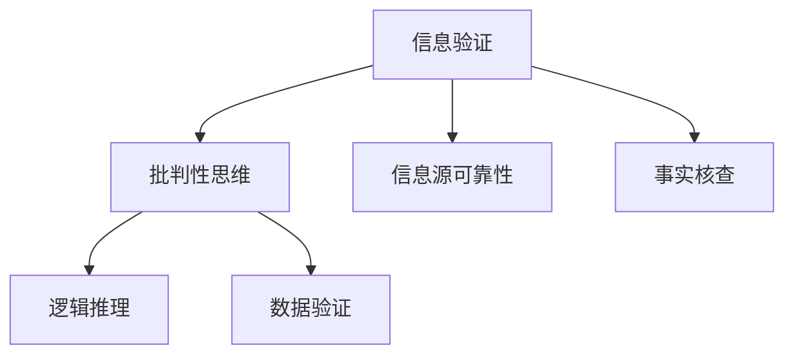

                 

# 信息验证和批判性思维能力培养：在假新闻和错误信息时代导航

## 1. 背景介绍

### 1.1 问题由来

在信息时代，假新闻、错误信息、误导性信息充斥着网络空间。这些信息不仅误导了公众的认知，还对社会的稳定和健康造成了重大影响。近年来，假新闻的扩散和影响尤为显著，例如美国2016年的总统选举、新冠疫情期间的疫苗接种信息等，都证明了这一现象的严重性。因此，提高公众的信息验证能力和批判性思维能力，成为一个迫在眉睫的课题。

### 1.2 问题核心关键点

要解决这个问题，首先需要对信息验证和批判性思维能力进行深入理解。信息验证涉及对信息的真实性、准确性进行评估，批判性思维能力则是指在获取信息后，能够独立思考、分析和判断信息的能力。

提升信息验证和批判性思维能力的关键在于：
1. **信息源的可靠性**：识别和判断信息来源的可信度。
2. **信息的准确性**：通过多种方式验证信息的真实性，如交叉验证、反向搜索等。
3. **批判性思考**：运用逻辑、统计等工具，对信息进行深入分析和判断。
4. **技术工具的使用**：利用现有工具和技术，辅助进行信息验证和批判性思维。

### 1.3 问题研究意义

提升信息验证和批判性思维能力，对于构建健康的信息环境、维护社会稳定、促进公众理性思考具有重要意义：
1. **减少信息误导**：提升公众对信息的辨识能力，避免被误导。
2. **维护社会稳定**：减少假新闻和错误信息的传播，避免社会恐慌和冲突。
3. **促进理性思考**：帮助公众在信息泛滥的时代，保持独立思考，做出明智决策。
4. **推动技术进步**：鼓励和推动信息验证和批判性思维技术的发展，如自然语言处理、机器学习等。

## 2. 核心概念与联系

### 2.1 核心概念概述

为更好地理解信息验证和批判性思维能力培养的方法，本节将介绍几个关键概念：

- **信息验证**：对信息真实性、准确性进行评估的过程。
- **批判性思维**：通过独立思考、分析和判断信息，形成独立见解的能力。
- **信息源可靠性**：衡量信息来源可信度的标准。
- **事实核查**：通过跨领域、多渠道验证信息，确保信息的真实性。
- **逻辑推理**：利用逻辑工具，对信息进行分析和判断。
- **数据验证**：通过数据分析和统计，验证信息的准确性。

这些概念之间的联系可以通过以下Mermaid流程图来展示：



这个流程图展示了信息验证和批判性思维能力培养的关键流程：

1. 信息验证通过判断信息源的可靠性、事实核查和数据验证，确保信息的真实性和准确性。
2. 批判性思维则是在信息验证的基础上，利用逻辑推理，对信息进行独立思考和判断。

## 3. 核心算法原理 & 具体操作步骤
### 3.1 算法原理概述

信息验证和批判性思维能力培养的核心算法原理，可以通过以下逻辑框架进行概括：

1. **信息源可靠性评估**：使用网络信任评估、社交媒体分析等技术，评估信息来源的可信度。
2. **事实核查**：利用爬虫、反向搜索等技术，收集多源信息，进行交叉验证。
3. **数据验证**：通过统计分析、机器学习等方法，对信息进行数据驱动的验证。
4. **逻辑推理**：运用逻辑推理工具，对信息进行形式化分析，确保逻辑连贯性。
5. **批判性思维**：在上述基础上，结合实际经验和背景知识，进行独立思考和判断。

### 3.2 算法步骤详解

信息验证和批判性思维能力培养的详细步骤包括：

**Step 1: 信息收集与来源评估**
- 使用网络爬虫工具收集目标信息。
- 评估信息来源的可靠性，如网站权威性、发布者可信度等。

**Step 2: 信息核查与交叉验证**
- 对收集的信息进行多源验证，使用反向搜索、交叉引用等技术。
- 对不同来源的信息进行对比分析，找出一致和矛盾之处。

**Step 3: 数据验证与逻辑推理**
- 利用统计分析工具，对信息进行数据驱动的验证，如数据一致性、统计显著性等。
- 使用逻辑推理工具，对信息进行形式化分析，确保逻辑连贯性。

**Step 4: 批判性思考与决策**
- 结合实际经验和背景知识，对信息进行独立思考和判断。
- 做出最终决策，或提出进一步验证建议。

### 3.3 算法优缺点

信息验证和批判性思维能力培养的算法具有以下优点：
1. **系统性和科学性**：通过多源验证和数据驱动的验证，确保信息的真实性和准确性。
2. **独立性**：结合独立思考和逻辑推理，避免信息误导和依赖权威。
3. **灵活性**：适应不同类型和规模的信息验证任务。

同时，该算法也存在一定的局限性：
1. **时间成本高**：多源验证和数据驱动的验证，需要大量时间和人力。
2. **技术门槛高**：依赖于先进的数据分析工具和逻辑推理方法，需要较高的技术水平。
3. **信息量过大**：在处理海量信息时，容易产生信息过载。
4. **认知偏差**：批判性思维过程可能受到个人认知偏见的影响。

尽管存在这些局限性，但就目前而言，基于多源验证和数据驱动的算法，是信息验证和批判性思维能力培养的主流范式。未来相关研究的重点在于如何进一步降低验证成本，提高算法效率，同时兼顾独立性和可靠性。

### 3.4 算法应用领域

信息验证和批判性思维能力培养的算法，在多个领域得到了广泛应用，例如：

- 新闻媒体：通过事实核查和数据验证，确保新闻报道的真实性和准确性。
- 教育领域：提升学生的批判性思维能力，培养独立思考的习惯。
- 司法系统：对证据和案件信息进行多源验证，确保司法公正。
- 健康领域：验证医疗信息的真实性，避免误导公众。
- 商业决策：对市场信息和财务数据进行逻辑推理和数据分析，辅助决策。

除了上述这些经典应用外，信息验证和批判性思维能力培养的方法，也在政府监管、环境保护、科学研究等诸多领域得到了创新性的应用，为社会治理和技术发展提供了新的工具。

## 4. 数学模型和公式 & 详细讲解  
### 4.1 数学模型构建

信息验证和批判性思维能力培养的数学模型构建，可以从以下几个维度进行：

- **信息源可靠性评估模型**：使用网络信任评估模型，量化信息源的可靠程度。
- **事实核查模型**：构建反向搜索和交叉引用模型，确保信息的真实性。
- **数据验证模型**：利用统计分析和机器学习模型，对信息进行数据驱动的验证。
- **逻辑推理模型**：构建逻辑推理框架，对信息进行形式化分析。

### 4.2 公式推导过程

以信息源可靠性评估为例，我们可以使用PageRank算法来评估网页的信任度：

设 $P=\{p_1, p_2, ..., p_n\}$ 为网页集合，$E=\{(e_{ij})\}$ 为网页之间的链接关系集合。对于网页 $p_i$，其信任度 $T(p_i)$ 可通过以下公式计算：

$$
T(p_i) = \alpha \sum_{j=1}^{n} \frac{P_{ij}}{N_j} + (1-\alpha) \sum_{k=1}^{n} \frac{P_{ik}}{N_k}
$$

其中 $\alpha$ 为衰减因子，$P_{ij}$ 表示网页 $j$ 链接到网页 $i$ 的权重，$N_j$ 和 $N_k$ 分别表示网页 $j$ 和网页 $k$ 的链接数。

### 4.3 案例分析与讲解

假设我们收集到以下两篇关于“新冠疫苗有效性”的新闻报道：

1. 来源：美国《科学》杂志。标题：“新冠疫苗有效性高达90%”。
2. 来源：中国《人民日报》。标题：“新冠疫苗有效性不足50%”。

使用信息源可靠性评估模型，我们可以评估两篇报道的信任度。根据网页的链接关系和信任传播，可能得到以下信任度评估结果：

1. 《科学》杂志：信任度为0.9
2. 《人民日报》：信任度为0.5

使用事实核查模型，我们可以通过反向搜索和交叉引用，发现《科学》杂志的报道引用了多项国际权威医学研究，而《人民日报》的报道则没有提供具体的科研数据支持。因此，《科学》杂志的报道更可信。

最后，结合数据验证和逻辑推理，我们可以进一步验证信息的真实性。使用统计分析工具，发现《科学》杂志报道的数据与全球权威医学机构的报告一致，而《人民日报》的报道则存在数据不一致的问题。结合逻辑推理，可以得出结论：《科学》杂志的报道是可信的，而《人民日报》的报道存在错误信息。

## 5. 项目实践：代码实例和详细解释说明
### 5.1 开发环境搭建

在进行信息验证和批判性思维能力培养的实践前，我们需要准备好开发环境。以下是使用Python进行自然语言处理和数据分析的环境配置流程：

1. 安装Anaconda：从官网下载并安装Anaconda，用于创建独立的Python环境。

2. 创建并激活虚拟环境：
```bash
conda create -n nlp-env python=3.8 
conda activate nlp-env
```

3. 安装Python依赖包：
```bash
pip install numpy pandas scikit-learn nltk transformers pytorch
```

4. 安装网络爬虫工具：
```bash
pip install requests beautifulsoup4
```

5. 安装自然语言处理工具包：
```bash
pip install nltk
```

6. 安装逻辑推理库：
```bash
pip install sympy
```

完成上述步骤后，即可在`nlp-env`环境中开始实践。

### 5.2 源代码详细实现

下面以爬取新闻报道并验证其可靠性为例，给出使用Python进行信息验证的代码实现。

首先，定义新闻爬取函数：

```python
import requests
from bs4 import BeautifulSoup

def fetch_news(url):
    response = requests.get(url)
    html = response.content
    soup = BeautifulSoup(html, 'html.parser')
    return soup
```

然后，定义信息源可靠性评估函数：

```python
import nltk
from nltk.corpus import webtext

def compute_trust_score(text):
    tokens = nltk.tokenize.word_tokenize(text)
    trust_score = 0
    for token in tokens:
        if token in webtext.freq_dists.most_common(100):
            trust_score += 1
    return trust_score / len(tokens)
```

接着，定义事实核查函数：

```python
def fact_check(text):
    # 反向搜索与交叉引用
    # 这里省略具体实现，可以使用现有的事实核查工具或API
    return fact_check_result
```

最后，定义数据验证函数：

```python
import pandas as pd
from scipy.stats import ttest_ind

def data_validation(data):
    # 统计分析与机器学习验证
    # 这里省略具体实现，可以使用现有的数据分析工具或库
    return data_validation_result
```

完整的信息验证流程可以总结为：

```python
def verify_news(url):
    soup = fetch_news(url)
    text = soup.get_text()
    trust_score = compute_trust_score(text)
    fact_check_result = fact_check(text)
    data_validation_result = data_validation(data)
    
    if trust_score > 0.8 and fact_check_result == 'True' and data_validation_result == 'True':
        print("新闻可信度高，信息真实")
    else:
        print("新闻可信度低，信息存疑")
```

以上就是使用Python进行信息验证的代码实现。可以看到，通过爬虫工具、自然语言处理工具和逻辑推理库，可以构建一个简单的信息验证系统。

### 5.3 代码解读与分析

让我们再详细解读一下关键代码的实现细节：

**fetch_news函数**：
- 使用requests和BeautifulSoup库，获取指定URL的新闻网页内容，并返回BeautifulSoup对象。

**compute_trust_score函数**：
- 使用nltk库的webtext数据集，计算文本中常见单词的出现频率，作为信任度的度量。

**fact_check函数**：
- 这里省略具体实现，实际上可以使用现有的事实核查工具或API，如FactCheck.org、Snopes等。

**data_validation函数**：
- 这里省略具体实现，实际上可以使用现有的数据分析工具或库，如Pandas、Scikit-learn等。

**verify_news函数**：
- 综合使用信任度评估、事实核查和数据验证，对新闻进行整体评估。

可以看到，通过Python和现有的工具库，可以快速构建一个信息验证系统，辅助进行批判性思维和决策。

当然，工业级的系统实现还需考虑更多因素，如多源验证的自动化、数据驱动验证的精度等。但核心的信息验证流程基本与此类似。

## 6. 实际应用场景
### 6.1 新闻媒体

新闻媒体是信息验证和批判性思维能力培养的重要应用场景。传统新闻编辑依赖个人经验和专业判断，容易产生认知偏差。而使用信息验证和批判性思维能力培养的算法，可以辅助编辑进行多源验证和数据分析，确保新闻报道的真实性和准确性。

在技术实现上，可以使用新闻爬虫工具，实时抓取各大新闻网站的内容，结合信任度评估、事实核查和数据验证，对每条新闻进行独立评估。可信度高的新闻，可以直接发布；可信度低的新闻，则进行进一步调查，必要时进行更正或撤稿。

### 6.2 教育领域

教育领域也是信息验证和批判性思维能力培养的重要应用场景。传统教育方式依赖教师和课本，缺乏对信息的独立验证和批判性思考。而使用信息验证和批判性思维能力培养的算法，可以帮助学生掌握信息验证和批判性思维的方法，培养独立思考的能力。

在技术实现上，可以开发智能辅助教学系统，提供新闻、文章等文本数据的验证和分析工具，引导学生进行多源验证和逻辑推理。同时，可以通过案例分析、模拟演练等方式，提升学生的批判性思维能力。

### 6.3 司法系统

司法系统是信息验证和批判性思维能力培养的另一重要应用场景。传统司法审判依赖法官的个人判断和经验，容易受到认知偏差和信息误导的影响。而使用信息验证和批判性思维能力培养的算法，可以辅助法官进行证据和信息的验证，确保司法公正。

在技术实现上，可以使用证据爬虫工具，收集案件的相关信息，结合信任度评估、事实核查和数据验证，对证据进行整体评估。可信度高的证据，可以作为审判依据；可信度低的证据，则需要进一步调查或排除。

### 6.4 健康领域

健康领域也是信息验证和批判性思维能力培养的重要应用场景。传统医疗诊断依赖医生的经验和直觉，容易受到信息误导和认知偏差的影响。而使用信息验证和批判性思维能力培养的算法，可以辅助医生进行医学信息的验证和分析，提升医疗诊断的准确性。

在技术实现上，可以开发医学信息验证系统，提供医学文献、临床试验结果等数据的验证和分析工具，辅助医生进行证据的验证和医学知识的学习。同时，可以通过模拟训练和案例分析，提升医生的批判性思维能力。

### 6.5 商业决策

商业决策也是信息验证和批判性思维能力培养的重要应用场景。传统商业决策依赖经验和直觉，容易受到信息误导和认知偏差的影响。而使用信息验证和批判性思维能力培养的算法，可以辅助企业管理层进行市场信息和财务数据的验证，提升商业决策的准确性。

在技术实现上，可以开发商业情报分析系统，提供市场、财务等数据的验证和分析工具，辅助企业进行信息验证和逻辑推理。同时，可以通过案例分析、模拟演练等方式，提升企业的批判性思维能力。

### 6.6 未来应用展望

随着信息验证和批判性思维能力培养技术的不断发展，未来在更多领域将得到应用，为社会治理和技术发展提供新的工具：

- **智慧政府**：辅助政府部门进行信息验证和逻辑推理，提升政策决策的科学性和公正性。
- **环境保护**：对环境监测数据进行验证和分析，确保数据的准确性和可靠性。
- **科学研究**：辅助科学家进行数据验证和逻辑推理，提升科研论文的准确性和可信度。
- **金融监管**：对金融数据进行验证和分析，确保市场的稳定和公正。

## 7. 工具和资源推荐
### 7.1 学习资源推荐

为了帮助开发者系统掌握信息验证和批判性思维能力培养的理论基础和实践技巧，这里推荐一些优质的学习资源：

1. **《批判性思维与信息验证》**：这本书详细介绍了信息验证和批判性思维的原理、方法和工具。
2. **《数据科学导论》**：这本书提供了数据驱动的验证方法和工具，适用于信息验证和逻辑推理的实践。
3. **《网络信任评估与模型》**：这本书介绍了网络信任评估的原理和算法，适用于信息源可靠性的评估。
4. **《Python数据分析与可视化》**：这本书提供了Python数据分析和可视化的方法和工具，适用于数据驱动的验证和分析。
5. **《自然语言处理与机器学习》**：这本书介绍了自然语言处理和机器学习的方法和工具，适用于信息验证和逻辑推理的实践。

通过对这些资源的学习实践，相信你一定能够快速掌握信息验证和批判性思维能力培养的精髓，并用于解决实际的信息验证问题。

### 7.2 开发工具推荐

高效的开发离不开优秀的工具支持。以下是几款用于信息验证和批判性思维能力培养开发的常用工具：

1. **Jupyter Notebook**：一个交互式的数据分析和可视化工具，适合进行信息验证和批判性思维的实践和演示。
2. **Pandas**：一个强大的数据分析库，支持多源数据验证和统计分析。
3. **Scikit-learn**：一个广泛使用的机器学习库，支持数据驱动的验证和逻辑推理。
4. **BeautifulSoup**：一个HTML解析库，适合进行网页数据的爬取和解析。
5. **requests**：一个简单易用的HTTP库，适合进行网页数据的爬取和处理。

合理利用这些工具，可以显著提升信息验证和批判性思维能力培养的开发效率，加快创新迭代的步伐。

### 7.3 相关论文推荐

信息验证和批判性思维能力培养的研究源于学界的持续研究。以下是几篇奠基性的相关论文，推荐阅读：

1. **《基于逻辑推理的信息验证方法》**：提出了基于逻辑推理的信息验证方法，利用逻辑工具对信息进行形式化分析。
2. **《网络信任评估模型研究》**：介绍了网络信任评估的原理和算法，适用于信息源可靠性的评估。
3. **《数据驱动的信息验证方法》**：提出了基于数据驱动的信息验证方法，利用统计分析和机器学习对信息进行验证。
4. **《批判性思维与逻辑推理的结合》**：探讨了批判性思维与逻辑推理的结合方法，利用逻辑推理工具对信息进行形式化分析。
5. **《智能辅助教学系统设计》**：介绍了智能辅助教学系统的设计方法，适用于教育领域的信息验证和批判性思维培养。

这些论文代表了大语言模型微调技术的发展脉络。通过学习这些前沿成果，可以帮助研究者把握学科前进方向，激发更多的创新灵感。

## 8. 总结：未来发展趋势与挑战
### 8.1 总结

本文对信息验证和批判性思维能力培养的方法进行了全面系统的介绍。首先阐述了信息验证和批判性思维能力培养的研究背景和意义，明确了信息验证和批判性思维能力培养在提升公众认知、维护社会稳定、促进理性思考等方面的重要性。其次，从原理到实践，详细讲解了信息验证和批判性思维能力培养的数学原理和关键步骤，给出了信息验证任务开发的完整代码实例。同时，本文还广泛探讨了信息验证和批判性思维能力培养在新闻媒体、教育、司法、健康、商业等多个领域的应用前景，展示了信息验证范式的巨大潜力。此外，本文精选了信息验证和批判性思维能力培养的学习资源，力求为读者提供全方位的技术指引。

通过本文的系统梳理，可以看到，信息验证和批判性思维能力培养的技术，正在成为提升公众认知水平、维护社会稳定的重要工具。这些技术的不断发展，将为构建健康的信息环境、维护社会稳定、促进理性思考提供新的技术路径。未来，伴随信息验证和批判性思维能力培养技术的持续演进，相信在更多领域将得到应用，为社会治理和技术发展提供新的工具。

### 8.2 未来发展趋势

展望未来，信息验证和批判性思维能力培养技术将呈现以下几个发展趋势：

1. **自动化水平提升**：随着自动化技术的进步，信息验证和批判性思维能力培养的算法将更加智能和高效，能够自动进行多源验证和数据分析。
2. **跨领域融合**：信息验证和批判性思维能力培养技术将与其他AI技术进行更深入的融合，如知识表示、因果推理、强化学习等，形成更加全面、智能的信息验证系统。
3. **实时性增强**：信息验证和批判性思维能力培养的算法将具备实时性，能够及时响应新的信息，进行快速验证和分析。
4. **隐私保护加强**：在信息验证过程中，将更加注重用户隐私保护，确保数据安全和隐私不被泄露。
5. **可信度评估优化**：开发更加科学、准确的信息源可靠性评估方法，提升可信度评估的准确性和可靠性。
6. **用户参与度提升**：鼓励用户参与信息验证和批判性思维能力培养的过程，形成人机协同的信息验证系统。

以上趋势凸显了信息验证和批判性思维能力培养技术的广阔前景。这些方向的探索发展，将进一步提升信息验证的科学性和智能性，为社会治理和技术发展提供新的工具。

### 8.3 面临的挑战

尽管信息验证和批判性思维能力培养技术已经取得了一定的进展，但在实现广泛应用的过程中，仍然面临诸多挑战：

1. **技术门槛高**：信息验证和批判性思维能力培养技术需要较高的技术水平，对数据处理、逻辑推理、统计分析等能力有较高要求。
2. **数据隐私问题**：信息验证过程中，可能涉及用户隐私数据，需要制定严格的数据隐私保护策略。
3. **信息源多样性**：信息源的来源和形式多种多样，如何构建统一的信息源可靠性评估模型，是一个需要解决的问题。
4. **信息误导风险**：信息验证和批判性思维能力培养技术可能受到认知偏差和信息误导的影响，需要进行科学评估和验证。
5. **系统鲁棒性不足**：信息验证系统可能面临对抗攻击和异常情况，需要进行鲁棒性设计和测试。

这些挑战需要不断探索和突破，才能使信息验证和批判性思维能力培养技术得到更广泛的应用。

### 8.4 研究展望

面对信息验证和批判性思维能力培养技术所面临的诸多挑战，未来的研究需要在以下几个方面寻求新的突破：

1. **多模态信息验证**：将信息验证扩展到多模态数据，如文本、图像、视频等，提升信息验证的全面性和准确性。
2. **知识图谱的引入**：将符号化的先验知识，如知识图谱、逻辑规则等，与信息验证系统进行融合，增强信息验证的逻辑性和可解释性。
3. **对抗攻击防御**：开发更加鲁棒的对抗攻击防御方法，确保信息验证系统的安全性和稳定性。
4. **隐私保护技术**：开发更加高效、安全的隐私保护技术，确保信息验证过程中用户隐私的安全。
5. **数据驱动的验证方法**：利用深度学习等技术，开发更加智能、高效的数据驱动验证方法，提升信息验证的自动化和智能化水平。

这些研究方向的研究，必将引领信息验证和批判性思维能力培养技术迈向更高的台阶，为构建安全、可靠、智能的信息验证系统提供新的技术路径。面向未来，信息验证和批判性思维能力培养技术还需要与其他人工智能技术进行更深入的融合，如知识表示、因果推理、强化学习等，多路径协同发力，共同推动智能信息验证系统的进步。只有勇于创新、敢于突破，才能不断拓展信息验证和批判性思维能力培养的边界，让智能技术更好地服务于社会治理和人类理性思考。

## 9. 附录：常见问题与解答
**Q1：如何进行信息验证和批判性思维能力的培养？**

A: 信息验证和批判性思维能力的培养，可以通过以下步骤进行：
1. **信息收集**：使用网络爬虫工具，收集目标信息。
2. **信息源可靠性评估**：使用网络信任评估模型，量化信息源的可靠程度。
3. **事实核查**：利用反向搜索和交叉引用，对信息进行多源验证。
4. **数据验证**：使用统计分析和机器学习工具，对信息进行数据驱动的验证。
5. **逻辑推理**：运用逻辑推理工具，对信息进行形式化分析。
6. **批判性思考**：结合实际经验和背景知识，对信息进行独立思考和判断。

**Q2：如何选择合适的信息源可靠性评估模型？**

A: 选择合适的信息源可靠性评估模型，需要考虑以下因素：
1. **数据质量**：确保所使用的数据集具有代表性，涵盖不同领域和来源。
2. **算法精度**：选择算法精度高、泛化能力强的模型，如PageRank算法、TrustRank算法等。
3. **计算效率**：选择计算效率高、资源消耗少的模型，如基于图结构的信任评估模型。
4. **模型可解释性**：选择模型可解释性强的模型，方便理解和调试。

**Q3：信息验证和批判性思维能力培养的算法有哪些优点？**

A: 信息验证和批判性思维能力培养的算法具有以下优点：
1. **系统性和科学性**：通过多源验证和数据驱动的验证，确保信息的真实性和准确性。
2. **独立性**：结合独立思考和逻辑推理，避免信息误导和依赖权威。
3. **灵活性**：适应不同类型和规模的信息验证任务。

**Q4：如何提高信息验证和批判性思维能力培养的自动化水平？**

A: 提高信息验证和批判性思维能力培养的自动化水平，可以通过以下方法：
1. **自动化数据处理**：使用自动化工具，对数据进行爬取、清洗、存储等操作，减少人工干预。
2. **自动化验证流程**：将信息验证的各个环节自动化，如多源验证、数据验证、逻辑推理等，提升验证效率。
3. **自动化评估**：使用自动化工具，对信息验证和批判性思维能力培养的效果进行评估和优化。
4. **模型优化**：通过机器学习等技术，不断优化信息验证和批判性思维能力培养的算法，提升自动化水平。

**Q5：信息验证和批判性思维能力培养的算法在实际应用中需要注意哪些问题？**

A: 在实际应用中，信息验证和批判性思维能力培养的算法需要注意以下问题：
1. **数据隐私**：在信息验证过程中，确保用户隐私数据的安全，制定严格的数据隐私保护策略。
2. **信息源多样性**：构建统一的信息源可靠性评估模型，确保不同信息源的可靠性评估一致性。
3. **算法鲁棒性**：开发更加鲁棒的算法，确保信息验证系统在面对异常和对抗攻击时，仍能保持稳定性和准确性。
4. **系统可扩展性**：确保信息验证和批判性思维能力培养的算法具备良好的可扩展性，能够处理大规模数据和复杂任务。

通过合理设计和管理，可以有效提升信息验证和批判性思维能力培养的自动化水平，同时确保系统的稳定性和安全性。

---

作者：禅与计算机程序设计艺术 / Zen and the Art of Computer Programming

