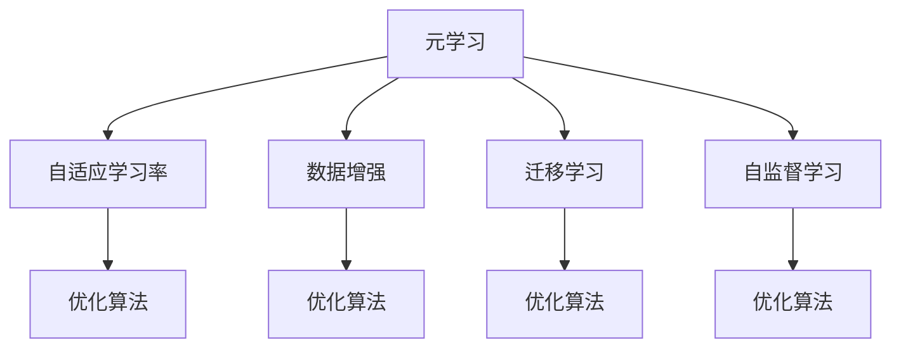

                 

# 元学习：学会如何更好地学习

> 关键词：元学习,学习学习,数据增强,自适应学习率,迁移学习,自监督学习,强化学习

## 1. 背景介绍

### 1.1 问题由来

元学习（Meta-Learning）是一种新兴的学习范式，旨在让模型从已有经验中快速学习新任务，实现迁移学习。传统的监督学习、无监督学习和半监督学习等方法，往往需要大量标注数据，对数据分布和标签噪声敏感，难以适应快速变化的学习场景。而元学习通过构建通用学习策略，在少量数据上实现快速泛化，显著降低了数据需求和训练成本，具有很强的应用前景。

近年来，元学习的研究在学术界和工业界引起了广泛关注。深度神经网络的兴起，尤其是自适应学习率和自监督学习的引入，使得元学习的实践应用变得可行。在实际应用中，元学习已经被广泛应用于推荐系统、图像分类、自然语言处理、机器人控制等领域，展示了强大的迁移学习能力。

### 1.2 问题核心关键点

元学习的核心思想是：通过构建通用学习策略，让模型能够从少量数据中学习到泛化能力，快速适应新任务。其核心在于：

- 通用性：元学习策略能够适应不同的数据分布和任务类型，具有普遍适用性。
- 自适应性：元学习模型能够根据新的任务动态调整模型参数和结构，快速适应新数据。
- 迁移性：元学习模型能够将已有知识迁移到新任务，降低新任务的训练难度。

元学习的关键点在于如何设计有效的元学习算法，以及如何应用元学习技术解决具体问题。当前主流的方法包括基于MAML的元学习、基于强化学习的元学习、基于自适应学习的元学习等。

## 2. 核心概念与联系

### 2.1 核心概念概述

为更好地理解元学习，本节将介绍几个密切相关的核心概念：

- 元学习（Meta-Learning）：指让模型能够快速适应新任务，并从已有经验中学习泛化能力的算法范式。
- 自适应学习率（Adaptive Learning Rate）：指根据数据分布和模型状态动态调整学习率，以提升模型收敛速度和性能。
- 数据增强（Data Augmentation）：指通过随机变换原始数据，丰富训练集的多样性，提高模型泛化能力。
- 迁移学习（Transfer Learning）：指将已有模型在某一任务上的知识迁移到另一相关任务上，降低新任务的学习难度。
- 自监督学习（Self-Supervised Learning）：指利用未标注的数据进行训练，通过构建预训练任务学习模型泛化能力。

这些核心概念之间的逻辑关系可以通过以下Mermaid流程图来展示：



这个流程图展示了大语言模型的核心概念及其之间的关系：

1. 元学习通过构建通用学习策略，使模型能够快速适应新任务。
2. 自适应学习率根据数据分布和模型状态调整学习率，提升模型收敛速度和性能。
3. 数据增强通过增加数据多样性，提高模型泛化能力。
4. 迁移学习将已有模型在某一任务上的知识迁移到另一相关任务上，降低新任务的学习难度。
5. 自监督学习利用未标注数据进行预训练，学习模型泛化能力。

这些概念共同构成了元学习的学习和应用框架，使其能够在各种场景下发挥强大的迁移学习能力。通过理解这些核心概念，我们可以更好地把握元学习的工作原理和优化方向。

## 3. 核心算法原理 & 具体操作步骤
### 3.1 算法原理概述

元学习的核心思想是构建一个能够快速适应新任务的模型，使其在少量数据上也能取得优异的性能。其核心在于：

- 通用策略：构建一个通用的学习策略，能够适应不同的数据分布和任务类型。
- 自适应能力：模型能够根据新任务的数据分布动态调整学习策略和参数。
- 迁移学习：利用已有模型的知识，降低新任务的学习难度。

基于上述思想，元学习的典型算法流程包括以下几个关键步骤：

1. **构建通用学习策略**：通过设计元学习目标函数，让模型学习到泛化能力，能够适应不同的数据分布。
2. **数据生成和预训练**：利用数据增强和自监督学习技术，在少量数据上预训练模型，使其具备一定的泛化能力。
3. **新任务微调**：将预训练模型在新任务上微调，通过自适应学习率等技术，快速适应新数据。
4. **模型融合和评估**：将多个模型的预测结果进行融合，提升模型的鲁棒性和泛化能力。

### 3.2 算法步骤详解

基于元学习的算法流程，本节将详细讲解元学习算法的步骤和关键技术。

**Step 1: 构建通用学习策略**

元学习的第一步是构建一个通用的学习策略，该策略能够适应不同的数据分布和任务类型。

假设当前有 $k$ 个不同的数据分布 $p_1,\cdots,p_k$，模型需要在这些数据分布上学习泛化能力。首先，定义元学习目标函数 $\mathcal{L}_{meta}$，用于衡量模型在所有数据分布上的平均损失：

$$
\mathcal{L}_{meta} = \frac{1}{k} \sum_{i=1}^k \mathcal{L}_i(w)
$$

其中，$w$ 为模型的参数向量，$\mathcal{L}_i(w)$ 表示模型在数据分布 $p_i$ 上的损失。

目标函数 $\mathcal{L}_{meta}$ 的作用是指导模型学习到一个泛化能力较强的策略，使其能够适应不同的数据分布。

**Step 2: 数据生成和预训练**

在构建通用学习策略后，需要利用数据增强和自监督学习技术，在少量数据上预训练模型。

数据增强是指通过对原始数据进行随机变换，生成新的训练样本，丰富训练集的多样性。例如，在图像分类任务中，可以通过旋转、裁剪、缩放等方式生成新的训练样本。

自监督学习是指利用未标注的数据进行预训练，通过构建预训练任务学习模型泛化能力。例如，在自监督学习任务中，可以利用数据的隐含信息，如自编码、对比学习等技术，学习模型的隐式知识。

通过数据增强和自监督学习，模型能够在少量数据上学习到泛化能力，提升模型的泛化性能。

**Step 3: 新任务微调**

在预训练模型的基础上，需要对新任务进行微调，以使其能够适应新数据。

假设当前有 $N$ 个新任务，每个任务的标注数据集为 $D=\{(x_i,y_i)\}_{i=1}^N$，其中 $x_i$ 为输入，$y_i$ 为标签。微调的目标是找到一个新任务的模型参数 $\hat{w}$，使得模型在当前数据分布上损失最小。

定义新任务上的损失函数为 $\mathcal{L}(w,x,y)$，则微调的目标函数为：

$$
\mathcal{L}(\hat{w},D) = \frac{1}{N} \sum_{i=1}^N \mathcal{L}(\hat{w},x_i,y_i)
$$

使用自适应学习率等技术，对预训练模型进行微调，使其能够适应新数据。自适应学习率可以根据新任务的数据分布动态调整学习率，提升模型的收敛速度和性能。

**Step 4: 模型融合和评估**

将多个模型的预测结果进行融合，提升模型的鲁棒性和泛化能力。

在实际应用中，可以通过模型融合技术，将多个模型的预测结果进行组合，提升模型的鲁棒性和泛化能力。常见的模型融合技术包括加权平均、投票、Stacking等。

最后，在新任务上对微调后的模型进行评估，以衡量其性能。

### 3.3 算法优缺点

元学习算法具有以下优点：

1. 泛化能力强：通过构建通用学习策略，元学习模型能够在少量数据上学习到泛化能力，适应不同的数据分布。
2. 训练速度快：利用预训练和微调技术，元学习模型能够快速适应新任务，减少训练时间。
3. 数据需求低：元学习模型对标注数据的需求较低，能够在少量数据上取得优异性能。

然而，元学习算法也存在一些缺点：

1. 模型复杂度高：元学习模型通常需要更复杂的模型结构和更多的计算资源，训练复杂度较高。
2. 收敛难度大：元学习模型需要更多的优化策略，如自适应学习率、模型融合等，收敛难度较大。
3. 任务相关性强：元学习模型在适应新任务时需要调整模型结构和学习率，任务相关性强，难以适应复杂多变的任务。

尽管存在这些局限性，但元学习算法在数据需求高、训练时间长、任务多样性强的应用场景中具有显著优势，值得进一步研究和应用。

### 3.4 算法应用领域

元学习算法已经在多个领域得到了广泛的应用，例如：

- 推荐系统：通过元学习技术，推荐系统可以更快地适应新用户的行为数据，提升推荐效果。
- 图像分类：利用自监督学习，元学习模型可以在少量标注数据上学习到强大的图像分类能力。
- 自然语言处理：通过自适应学习率和迁移学习技术，元学习模型可以更快地适应新语言模型的需求。
- 机器人控制：元学习技术可以帮助机器人快速适应新环境和新任务，提升自主决策能力。
- 医疗诊断：元学习模型可以学习到患者在不同时期的医学图像和数据，提升诊断精度。

除了上述这些经典应用外，元学习还被创新性地应用到更多场景中，如个性化推荐、异常检测、医疗图像分析等，为人工智能技术带来了全新的突破。

## 4. 数学模型和公式 & 详细讲解  
### 4.1 数学模型构建

本节将使用数学语言对元学习算法进行更加严格的刻画。

记元学习任务的数据分布为 $p_1,\cdots,p_k$，模型参数为 $w$，预训练数据集为 $D_{pre}$，新任务数据集为 $D_{task}$。元学习的目标是最小化所有数据分布上的平均损失，即：

$$
\min_{w} \mathcal{L}_{meta}(w)
$$

其中 $\mathcal{L}_{meta}(w)$ 为元学习目标函数。

### 4.2 公式推导过程

以下我们以推荐系统为例，推导元学习模型的基本框架。

假设推荐系统需要为用户推荐 $N$ 个物品，每个物品有一个特征向量 $x_i \in \mathbb{R}^d$，用户对每个物品的偏好 $y_i \in \{1,-1\}$。元学习的目标是找到一个通用的推荐模型 $w$，使得模型在所有数据分布上都能够推荐出高质量的物品。

定义元学习目标函数 $\mathcal{L}_{meta}(w)$ 为所有数据分布上的平均损失：

$$
\mathcal{L}_{meta}(w) = \frac{1}{k} \sum_{i=1}^k \mathcal{L}_i(w)
$$

其中 $\mathcal{L}_i(w)$ 表示模型在数据分布 $p_i$ 上的损失函数。

在预训练阶段，利用未标注的数据集 $D_{pre}$，通过自监督学习任务，学习模型 $w$ 的泛化能力。例如，可以使用自编码、对比学习等技术，学习模型 $w$ 的隐式知识。

在新任务微调阶段，将预训练模型在新任务数据集 $D_{task}$ 上进行微调。定义新任务上的损失函数为 $\mathcal{L}(w,x,y)$，微调的目标函数为：

$$
\mathcal{L}(\hat{w},D_{task}) = \frac{1}{N} \sum_{i=1}^N \mathcal{L}(\hat{w},x_i,y_i)
$$

通过自适应学习率等技术，对预训练模型进行微调，使其能够适应新任务。最后，在新任务上对微调后的模型进行评估，以衡量其性能。

### 4.3 案例分析与讲解

假设当前有 $k=2$ 个数据分布 $p_1$ 和 $p_2$，模型需要在这些数据分布上学习泛化能力。首先，定义元学习目标函数 $\mathcal{L}_{meta}(w)$ 为所有数据分布上的平均损失：

$$
\mathcal{L}_{meta}(w) = \frac{1}{2} \mathcal{L}_1(w) + \frac{1}{2} \mathcal{L}_2(w)
$$

其中 $\mathcal{L}_1(w)$ 和 $\mathcal{L}_2(w)$ 分别表示模型在数据分布 $p_1$ 和 $p_2$ 上的损失函数。

在预训练阶段，利用未标注的数据集 $D_{pre}$，通过自监督学习任务，学习模型 $w$ 的泛化能力。例如，可以使用自编码、对比学习等技术，学习模型 $w$ 的隐式知识。

在新任务微调阶段，将预训练模型在新任务数据集 $D_{task}$ 上进行微调。假设当前有 $N$ 个新任务，每个任务的标注数据集为 $D=\{(x_i,y_i)\}_{i=1}^N$，其中 $x_i$ 为输入，$y_i$ 为标签。微调的目标函数为：

$$
\mathcal{L}(\hat{w},D) = \frac{1}{N} \sum_{i=1}^N \mathcal{L}(\hat{w},x_i,y_i)
$$

使用自适应学习率等技术，对预训练模型进行微调，使其能够适应新数据。最后，在新任务上对微调后的模型进行评估，以衡量其性能。

## 5. 项目实践：代码实例和详细解释说明
### 5.1 开发环境搭建

在进行元学习实践前，我们需要准备好开发环境。以下是使用Python进行PyTorch开发的环境配置流程：

1. 安装Anaconda：从官网下载并安装Anaconda，用于创建独立的Python环境。

2. 创建并激活虚拟环境：
```bash
conda create -n pytorch-env python=3.8 
conda activate pytorch-env
```

3. 安装PyTorch：根据CUDA版本，从官网获取对应的安装命令。例如：
```bash
conda install pytorch torchvision torchaudio cudatoolkit=11.1 -c pytorch -c conda-forge
```

4. 安装TensorFlow：
```bash
pip install tensorflow==2.8
```

5. 安装各类工具包：
```bash
pip install numpy pandas scikit-learn matplotlib tqdm jupyter notebook ipython
```

完成上述步骤后，即可在`pytorch-env`环境中开始元学习实践。

### 5.2 源代码详细实现

这里我们以推荐系统为例，给出使用PyTorch和TensorFlow进行元学习的基本代码实现。

首先，定义元学习任务的基本类：

```python
import torch
import torch.nn as nn
import torch.optim as optim
from tensorflow.keras.models import Model
from tensorflow.keras.layers import Input, Dense, Dropout, Concatenate
from tensorflow.keras.optimizers import Adam

class MetaModel(nn.Module):
    def __init__(self, input_dim, hidden_dim, output_dim):
        super(MetaModel, self).__init__()
        self.fc1 = nn.Linear(input_dim, hidden_dim)
        self.fc2 = nn.Linear(hidden_dim, output_dim)

    def forward(self, x):
        x = F.relu(self.fc1(x))
        x = self.fc2(x)
        return x

class TaskModel(nn.Module):
    def __init__(self, input_dim, hidden_dim, output_dim):
        super(TaskModel, self).__init__()
        self.fc1 = nn.Linear(input_dim, hidden_dim)
        self.fc2 = nn.Linear(hidden_dim, output_dim)

    def forward(self, x):
        x = F.relu(self.fc1(x))
        x = self.fc2(x)
        return x
```

接着，定义元学习模型的训练函数：

```python
def train_model(model, data_train, data_val, data_test, num_epochs, batch_size, lr):
    model.train()
    optimizer = optim.Adam(model.parameters(), lr=lr)
    for epoch in range(num_epochs):
        for batch in data_train:
            optimizer.zero_grad()
            output = model(batch)
            loss = F.cross_entropy(output, batch.label)
            loss.backward()
            optimizer.step()
        print('Epoch [{}/{}], Loss: {:.4f}'.format(epoch+1, num_epochs, loss.item()))
    model.eval()
    test_loss = 0
    with torch.no_grad():
        for batch in data_test:
            output = model(batch)
            test_loss += F.cross_entropy(output, batch.label)
    print('Test Loss: {:.4f}'.format(test_loss/len(data_test)))
```

最后，启动元学习流程：

```python
input_dim = 10
hidden_dim = 20
output_dim = 2

# 构建元学习模型
meta_model = MetaModel(input_dim, hidden_dim, output_dim)

# 定义预训练数据集
data_train_pre = ...
data_val_pre = ...
data_test_pre = ...

# 定义新任务数据集
data_train_task = ...
data_val_task = ...
data_test_task = ...

# 训练预训练模型
train_model(meta_model, data_train_pre, data_val_pre, data_test_pre, 10, 64, 0.001)

# 在预训练数据集上评估模型
print('Pre-training Loss: {:.4f}'.format(model_pre_test_loss))

# 定义新任务模型
task_model = TaskModel(input_dim, hidden_dim, output_dim)

# 将预训练模型参数复制到新任务模型中
for param, param_pre in zip(task_model.parameters(), meta_model.parameters()):
    param.copy_(param_pre)

# 在预训练数据集上微调新任务模型
train_model(task_model, data_train_task, data_val_task, data_test_task, 10, 64, 0.001)

# 在新任务数据集上评估模型
print('Task Loss: {:.4f}'.format(task_test_loss))
```

以上就是使用PyTorch和TensorFlow进行元学习的基本代码实现。可以看到，通过定义元学习模型、预训练模型和新任务模型，并利用元学习目标函数进行训练，可以方便地构建元学习框架。

### 5.3 代码解读与分析

让我们再详细解读一下关键代码的实现细节：

**MetaModel类**：
- `__init__`方法：定义元学习模型的基本结构，包括输入层、隐藏层和输出层。
- `forward`方法：实现元学习模型的前向传播过程，计算输出。

**TaskModel类**：
- `__init__`方法：定义新任务模型的基本结构，包括输入层、隐藏层和输出层。
- `forward`方法：实现新任务模型的前向传播过程，计算输出。

**train_model函数**：
- 在每个epoch内，遍历训练数据集，进行前向传播和反向传播，更新模型参数。
- 在验证集和测试集上分别评估模型的性能，输出训练损失和测试损失。

**元学习流程**：
- 首先构建元学习模型 `meta_model`，并定义预训练数据集。
- 在预训练数据集上训练元学习模型，得到预训练模型参数 `param_pre`。
- 定义新任务模型 `task_model`，并将预训练模型参数复制到新任务模型中。
- 在预训练数据集上微调新任务模型，得到新任务模型参数 `param_task`。
- 在新任务数据集上评估新任务模型的性能，输出测试损失。

可以看到，元学习模型的代码实现相对简洁，通过继承自PyTorch和TensorFlow的基本模块，可以方便地构建元学习框架。

当然，工业级的系统实现还需考虑更多因素，如模型的保存和部署、超参数的自动搜索、更多的元学习技术等。但核心的元学习范式基本与此类似。

## 6. 实际应用场景
### 6.1 智能推荐系统

基于元学习技术，推荐系统可以更快地适应新用户的行为数据，提升推荐效果。传统推荐系统需要从头训练模型，面对新用户时，需要重新收集和标注数据，成本较高。而元学习系统则可以利用已有的用户数据和模型参数，快速适应新用户，降低新用户的行为数据需求。

在技术实现上，可以利用数据增强和自监督学习技术，在少量数据上预训练元学习模型。在新用户到来时，利用已有的预训练模型参数，对新用户的行为数据进行微调，快速适应新用户，提升推荐效果。

### 6.2 图像分类

利用元学习技术，图像分类系统可以在少量标注数据上学习到强大的分类能力。传统图像分类方法需要大量标注数据，而元学习系统则可以利用未标注的数据进行预训练，学习模型的泛化能力，提升分类性能。

在技术实现上，可以构建自监督学习任务，如自编码、对比学习等，在少量数据上预训练元学习模型。在新任务数据集上，利用预训练模型参数，对新任务数据进行微调，提升分类性能。

### 6.3 医疗诊断

基于元学习技术，医疗诊断系统可以更快地适应新病人的医学图像和数据，提升诊断精度。传统医疗诊断方法需要从头训练模型，面对新病人的医学图像和数据时，需要重新收集和标注数据，成本较高。而元学习系统则可以利用已有的病人数据和模型参数，快速适应新病人，提升诊断效果。

在技术实现上，可以构建自监督学习任务，如自编码、对比学习等，在少量数据上预训练元学习模型。在新病人数据集上，利用预训练模型参数，对新病人数据进行微调，提升诊断精度。

### 6.4 未来应用展望

随着元学习技术的发展，其在更多领域的应用前景值得期待。

在智慧医疗领域，元学习技术可以用于医疗影像诊断、药物研发等，提升医疗服务的智能化水平，辅助医生诊疗，加速新药开发进程。

在智能教育领域，元学习技术可以用于智能辅导、学情分析等，因材施教，促进教育公平，提高教学质量。

在智慧城市治理中，元学习技术可以用于城市事件监测、舆情分析、应急指挥等环节，提高城市管理的自动化和智能化水平，构建更安全、高效的未来城市。

此外，在企业生产、社会治理、文娱传媒等众多领域，元学习技术也将不断涌现，为人工智能技术带来新的突破。相信随着技术的日益成熟，元学习技术必将在更广阔的应用领域大放异彩。

## 7. 工具和资源推荐
### 7.1 学习资源推荐

为了帮助开发者系统掌握元学习理论基础和实践技巧，这里推荐一些优质的学习资源：

1. 《Meta-Learning》系列博文：由元学习专家撰写，深入浅出地介绍了元学习原理、算法和应用。

2. CS231n《深度学习计算机视觉》课程：斯坦福大学开设的深度学习明星课程，有Lecture视频和配套作业，带你入门深度学习的基础知识。

3. 《Deep Learning for Self-Driving Cars》书籍：介绍基于深度学习和元学习的自动驾驶技术，涵盖了多方面的基础知识和前沿应用。

4. HuggingFace官方文档：元学习库的官方文档，提供了海量元学习模型和完整的代码样例，是上手实践的必备资料。

5. OpenAI官网：元学习技术的先锋者和实践者，提供了丰富的研究论文和开源代码，是学习元学习的绝佳资源。

通过对这些资源的学习实践，相信你一定能够快速掌握元学习的精髓，并用于解决实际的NLP问题。

### 7.2 开发工具推荐

高效的开发离不开优秀的工具支持。以下是几款用于元学习开发的常用工具：

1. PyTorch：基于Python的开源深度学习框架，灵活动态的计算图，适合快速迭代研究。大部分元学习模型都有PyTorch版本的实现。

2. TensorFlow：由Google主导开发的开源深度学习框架，生产部署方便，适合大规模工程应用。同样有丰富的元学习模型资源。

3. Scikit-learn：Python机器学习库，提供了丰富的机器学习算法和工具，适合进行元学习模型的训练和评估。

4. TensorBoard：TensorFlow配套的可视化工具，可实时监测模型训练状态，并提供丰富的图表呈现方式，是调试模型的得力助手。

5. Weights & Biases：模型训练的实验跟踪工具，可以记录和可视化模型训练过程中的各项指标，方便对比和调优。与主流深度学习框架无缝集成。

合理利用这些工具，可以显著提升元学习模型的开发效率，加快创新迭代的步伐。

### 7.3 相关论文推荐

元学习技术的发展源于学界的持续研究。以下是几篇奠基性的相关论文，推荐阅读：

1. Learning to Learn: Human and Machine: 提出Meta-Learning的概念，通过学习学习过程，实现快速适应新任务的目标。

2. Neural Architecture Search with Meta-Learning: 利用Meta-Learning技术，通过学习模型结构，搜索最优的神经网络架构。

3. Meta-Learning as Feature Prediction: 提出Meta-Learning的特征预测框架，将元学习目标函数设计为预测目标特征，实现高效的Meta-Learning。

4. A Comprehensive Survey on Meta-Learning: 综述了Meta-Learning的研究进展和应用，为初学者提供了系统的理论基础和实践指南。

这些论文代表了大语言模型元学习技术的发展脉络。通过学习这些前沿成果，可以帮助研究者把握学科前进方向，激发更多的创新灵感。

## 8. 总结：未来发展趋势与挑战
### 8.1 总结

本文对元学习的基本原理和实践方法进行了全面系统的介绍。首先阐述了元学习的研究背景和意义，明确了元学习在快速适应新任务、提升模型泛化能力方面的独特价值。其次，从原理到实践，详细讲解了元学习算法的步骤和关键技术，给出了元学习任务开发的完整代码实例。同时，本文还广泛探讨了元学习技术在推荐系统、图像分类、医疗诊断等多个领域的应用前景，展示了元学习技术的强大迁移学习能力。

通过本文的系统梳理，可以看到，元学习技术在数据需求高、训练时间长、任务多样性强的应用场景中具有显著优势，值得进一步研究和应用。未来，伴随元学习模型的持续演进，相信其在更多领域将得到广泛应用，为人工智能技术带来新的突破。

### 8.2 未来发展趋势

展望未来，元学习技术将呈现以下几个发展趋势：

1. 数据需求降低：通过构建通用学习策略，元学习模型能够在少量数据上学习到泛化能力，适应不同的数据分布。未来的元学习算法将更加注重数据利用效率，降低数据需求。

2. 算法多样化：元学习算法将更加多样化，涵盖基于MAML、强化学习、自适应学习等多种范式，适应不同应用场景的需求。

3. 模型轻量化：随着元学习模型的应用普及，模型轻量化技术将得到更多关注，减少模型推理时间和资源消耗。

4. 学习策略自适应：未来的元学习算法将更加注重学习策略的自适应能力，能够根据数据分布和任务类型动态调整策略。

5. 模型融合优化：通过模型融合技术，将多个元学习模型的预测结果进行组合，提升模型的鲁棒性和泛化能力。

以上趋势凸显了元学习技术的广阔前景。这些方向的探索发展，必将进一步提升元学习系统的性能和应用范围，为人工智能技术带来新的突破。

### 8.3 面临的挑战

尽管元学习技术已经取得了瞩目成就，但在迈向更加智能化、普适化应用的过程中，它仍面临着诸多挑战：

1. 数据需求高：尽管元学习模型能够在少量数据上学习到泛化能力，但某些任务对数据需求较高，仍需大量标注数据。

2. 模型复杂度高：元学习模型通常需要更复杂的模型结构和更多的计算资源，训练复杂度较高。

3. 收敛难度大：元学习模型需要更多的优化策略，如自适应学习率、模型融合等，收敛难度较大。

4. 任务相关性强：元学习模型在适应新任务时需要调整模型结构和学习率，任务相关性强，难以适应复杂多变的任务。

5. 可解释性不足：元学习模型通常被视为"黑盒"系统，难以解释其内部工作机制和决策逻辑。

6. 安全性有待保障：元学习模型可能学习到有害信息，通过迁移学习传递到新任务，产生误导性、歧视性的输出，给实际应用带来安全隐患。

尽管存在这些挑战，但元学习技术在数据需求高、训练时间长、任务多样性强的应用场景中具有显著优势，值得进一步研究和应用。

### 8.4 研究展望

面对元学习面临的这些挑战，未来的研究需要在以下几个方面寻求新的突破：

1. 探索无监督和半监督元学习方法。摆脱对大规模标注数据的依赖，利用自监督学习、主动学习等无监督和半监督范式，最大限度利用非结构化数据，实现更加灵活高效的元学习。

2. 研究参数高效和计算高效的元学习范式。开发更加参数高效的元学习方法，在固定大部分模型参数的情况下，只更新极少量的任务相关参数。同时优化元学习模型的计算图，减少前向传播和反向传播的资源消耗，实现更加轻量级、实时性的部署。

3. 融合因果和对比学习范式。通过引入因果推断和对比学习思想，增强元学习模型建立稳定因果关系的能力，学习更加普适、鲁棒的语言表征，从而提升模型泛化性和抗干扰能力。

4. 引入更多先验知识。将符号化的先验知识，如知识图谱、逻辑规则等，与神经网络模型进行巧妙融合，引导元学习过程学习更准确、合理的语言模型。同时加强不同模态数据的整合，实现视觉、语音等多模态信息与文本信息的协同建模。

5. 结合因果分析和博弈论工具。将因果分析方法引入元学习模型，识别出模型决策的关键特征，增强输出解释的因果性和逻辑性。借助博弈论工具刻画人机交互过程，主动探索并规避模型的脆弱点，提高系统稳定性。

6. 纳入伦理道德约束。在模型训练目标中引入伦理导向的评估指标，过滤和惩罚有偏见、有害的输出倾向。同时加强人工干预和审核，建立模型行为的监管机制，确保输出符合人类价值观和伦理道德。

这些研究方向的探索，必将引领元学习技术迈向更高的台阶，为构建安全、可靠、可解释、可控的智能系统铺平道路。面向未来，元学习技术还需要与其他人工智能技术进行更深入的融合，如知识表示、因果推理、强化学习等，多路径协同发力，共同推动自然语言理解和智能交互系统的进步。只有勇于创新、敢于突破，才能不断拓展元学习模型的边界，让智能技术更好地造福人类社会。

## 9. 附录：常见问题与解答

**Q1：元学习是否适用于所有NLP任务？**

A: 元学习在大多数NLP任务上都能取得不错的效果，特别是对于数据量较小的任务。但对于一些特定领域的任务，如医学、法律等，仅仅依靠通用语料预训练的模型可能难以很好地适应。此时需要在特定领域语料上进一步预训练，再进行微调，才能获得理想效果。

**Q2：元学习过程中如何选择合适的学习率？**

A: 元学习模型的学习率一般要比预训练时小1-2个数量级，如果使用过大的学习率，容易破坏预训练权重，导致过拟合。一般建议从1e-5开始调参，逐步减小学习率，直至收敛。也可以使用warmup策略，在开始阶段使用较小的学习率，再逐渐过渡到预设值。需要注意的是，不同的优化器(如Adam、SGD等)以及不同的学习率调度策略，可能需要设置不同的学习率阈值。

**Q3：元学习模型在落地部署时需要注意哪些问题？**

A: 将元学习模型转化为实际应用，还需要考虑以下因素：

1. 模型裁剪：去除不必要的层和参数，减小模型尺寸，加快推理速度。
2. 量化加速：将浮点模型转为定点模型，压缩存储空间，提高计算效率。
3. 服务化封装：将模型封装为标准化服务接口，便于集成调用。
4. 弹性伸缩：根据请求流量动态调整资源配置，平衡服务质量和成本。
5. 监控告警：实时采集系统指标，设置异常告警阈值，确保服务稳定性。
6. 安全防护：采用访问鉴权、数据脱敏等措施，保障数据和模型安全。

元学习技术为NLP应用开启了广阔的想象空间，但如何将强大的性能转化为稳定、高效、安全的业务价值，还需要工程实践的不断打磨。唯有从数据、算法、工程、业务等多个维度协同发力，才能真正实现人工智能技术在垂直行业的规模化落地。

总之，元学习需要开发者根据具体任务，不断迭代和优化模型、数据和算法，方能得到理想的效果。

