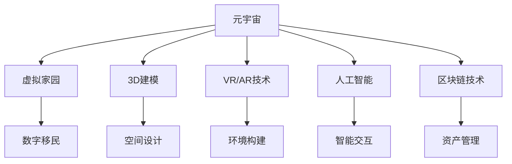

                 

# 元宇宙中的虚拟家园:数字移民的栖息地

> 关键词：元宇宙,虚拟家园,数字移民,3D建模,虚拟现实,人工智能,数字孪生,区块链技术

## 1. 背景介绍

### 1.1 问题由来

随着虚拟现实技术、区块链技术、人工智能等新兴技术的飞速发展，元宇宙（Metaverse）概念日益受到广泛关注。元宇宙被视为未来数字世界的升级版，其核心思想是通过创建高度沉浸的虚拟空间，使人们能够在虚拟世界中进行工作、娱乐、交流，甚至实现虚拟资产交易和虚拟经济。虚拟家园作为元宇宙的重要组成部分，是数字移民（Digital Immigrants）在虚拟世界的栖息地和活动中心。

### 1.2 问题核心关键点

- 虚拟家园的定义：虚拟家园是指在虚拟世界中，通过3D建模、虚拟现实（VR）和增强现实（AR）等技术，构建出具有实体感、互动性的虚拟居住空间。
- 数字移民的概念：数字移民指在数字世界中有深厚生活经验，依赖技术工具完成工作、学习、娱乐等活动的年轻一代。
- 虚拟家园的设计要素：包括虚拟空间的设计、虚拟建筑的构造、虚拟生态的创建、虚拟经济的运行等。
- 技术挑战：虚拟家园的设计和运营需要突破3D建模、VR/AR技术、人工智能、区块链等多项技术难题。

### 1.3 问题研究意义

研究虚拟家园的设计和运营，对于推动元宇宙的落地应用、提升数字移民的虚拟生活质量、探索未来数字经济和文化的形态具有重要意义：

- 提升虚拟生活质量：虚拟家园的建设可以提供更真实的沉浸式体验，丰富数字移民的虚拟生活内容。
- 探索元宇宙商业模式：通过虚拟家园的建设，可以探索基于区块链的数字经济模式，促进虚拟资产的流通和增值。
- 文化创新：虚拟家园为艺术创作、教育、娱乐提供了新的空间，激发了文化创新的无限可能。
- 技术协同：推动3D建模、VR/AR、人工智能、区块链等多项技术的整合和协同，提升相关技术的成熟度和应用范围。

## 2. 核心概念与联系

### 2.1 核心概念概述

- 元宇宙（Metaverse）：一种高度沉浸的虚拟世界，通过区块链技术实现虚拟资产交易和虚拟经济，具备现实世界和虚拟世界的无缝连接。
- 虚拟家园（Virtual Homestead）：在元宇宙中构建的，具有实体感、互动性的虚拟居住空间，是数字移民的栖息地。
- 数字移民（Digital Immigrants）：指依赖技术工具完成工作、学习、娱乐等活动的年轻一代，他们在数字世界中具有深厚的生活经验。
- 3D建模：通过计算机图形技术，构建虚拟空间的几何模型，是虚拟家园建设的基础技术。
- 虚拟现实（VR）和增强现实（AR）：利用视觉、听觉等感官模拟真实世界的体验，提升虚拟家园的沉浸感。
- 人工智能（AI）：在虚拟家园中，通过NLP、图像识别、语音识别等技术，实现智能交互和环境感知。
- 区块链技术：构建虚拟家园的虚拟经济和资产交易系统，确保数据安全和透明性。

这些核心概念之间的关系可以通过以下Mermaid流程图来展示：



这个流程图展示了元宇宙、虚拟家园、数字移民等核心概念及其之间的关系：

1. 元宇宙通过3D建模、VR/AR、人工智能、区块链等技术，构建虚拟家园。
2. 虚拟家园是数字移民的栖息地，提供真实感、互动性的虚拟居住空间。
3. 数字移民在虚拟家园中生活、工作、娱乐，提升虚拟生活质量。
4. 人工智能和区块链技术在虚拟家园中，实现智能交互和资产管理。

这些概念共同构成了虚拟家园的设计和运营框架，使其在元宇宙中具有重要地位。

## 3. 核心算法原理 & 具体操作步骤

### 3.1 算法原理概述

虚拟家园的设计和运营涉及多个技术的整合和协同，核心算法原理包括：

- 3D建模：通过计算机图形技术，生成虚拟空间的几何模型。
- VR/AR技术：通过视觉、听觉等感官模拟真实世界的体验，提升虚拟家园的沉浸感。
- 人工智能：在虚拟家园中，利用NLP、图像识别、语音识别等技术，实现智能交互和环境感知。
- 区块链技术：构建虚拟家园的虚拟经济和资产交易系统，确保数据安全和透明性。

### 3.2 算法步骤详解

#### 步骤1: 虚拟空间的规划和设计

- 确定虚拟家园的功能和规模，包括居住区、商业区、娱乐区、办公区等。
- 利用3D建模软件（如Unity、Unreal Engine），设计虚拟空间的几何模型和纹理贴图。
- 创建虚拟空间的地图和导航系统，确保数字移民能够便捷地进入和使用不同的区域。

#### 步骤2: 虚拟环境的构建

- 利用VR/AR技术，将虚拟空间渲染成高度沉浸的虚拟环境。
- 实现虚拟空间的动态光照、天气变化、季节变换等功能，提升用户体验。
- 使用物理引擎（如PhysX、Unity Physics），实现虚拟环境中的物理交互和碰撞检测。

#### 步骤3: 智能交互的实现

- 使用自然语言处理（NLP）技术，构建虚拟家园中的智能聊天机器人，实现自然语言交互。
- 利用图像识别和语音识别技术，实现虚拟空间中的人物识别、手势识别、语音命令等。
- 开发智能家居系统，通过语音或手势控制虚拟空间的灯光、温度、设备等。

#### 步骤4: 虚拟经济的构建

- 利用区块链技术，构建虚拟家园的虚拟经济系统，实现虚拟资产的交易和流通。
- 开发虚拟货币系统，允许数字移民在虚拟家园中进行虚拟交易、投资、借贷等。
- 创建虚拟市场和虚拟商店，提供商品销售、租赁、拍卖等功能。

#### 步骤5: 安全保障的实施

- 利用区块链技术，确保虚拟家园中的数据安全和透明性。
- 开发身份认证和权限管理系统，确保虚拟家园的安全和隐私。
- 定期进行安全审计和漏洞扫描，及时发现和修复安全隐患。

### 3.3 算法优缺点

#### 优点

- 高沉浸感：通过VR/AR技术，实现虚拟家园的高度沉浸感，提升用户体验。
- 高交互性：利用人工智能技术，实现智能交互和环境感知，增强用户参与度。
- 高安全性：利用区块链技术，确保虚拟家园的数据安全和透明性，防止数据泄露和篡改。

#### 缺点

- 高成本：虚拟家园的建设和运营需要大量的计算资源和资金投入。
- 技术复杂：涉及3D建模、VR/AR、人工智能、区块链等多项技术，技术实现难度大。
- 用户适应：部分用户可能对虚拟环境有抵触心理，需要逐步引导和教育。

### 3.4 算法应用领域

虚拟家园的建设和运营涉及多个领域，具体包括：

- 游戏和娱乐：构建虚拟游戏世界，提供虚拟旅游、虚拟社交、虚拟购物等服务。
- 房地产和建筑：设计虚拟房产，提供虚拟房产交易、租赁、装修等功能。
- 教育和文化：创建虚拟教室和博物馆，提供虚拟学习和文化体验。
- 商业和办公：构建虚拟商业区、虚拟办公室，提供虚拟会议、培训、展示等功能。
- 医疗和健康：设计虚拟医院和健康中心，提供虚拟诊疗、健康管理等服务。

## 4. 数学模型和公式 & 详细讲解 & 举例说明

### 4.1 数学模型构建

虚拟家园的建设和运营涉及多项技术，可以通过数学模型来描述其工作原理和运行机制。

#### 4.1.1 3D建模

3D建模的数学模型主要涉及几何学、拓扑学和线性代数。假设一个虚拟空间的几何模型为$M$，其顶点坐标为$\mathbf{V}=\{(\mathbf{v}_i)\}_{i=1}^N$，其中$\mathbf{v}_i \in \mathbb{R}^3$为顶点坐标。

#### 4.1.2 VR/AR技术

VR/AR技术的数学模型主要涉及计算机图形学、光学和物理学。假设虚拟空间的环境渲染为$E$，其渲染参数为$\mathbf{P}=\{(p_j)\}_{j=1}^M$，其中$p_j \in \mathbb{R}^3$为渲染点坐标。

#### 4.1.3 人工智能

人工智能的数学模型主要涉及机器学习、深度学习和自然语言处理。假设虚拟空间中的智能交互系统为$I$，其交互参数为$\mathbf{I}=\{(i_k)\}_{k=1}^K$，其中$i_k \in \mathbb{R}^n$为交互特征向量。

#### 4.1.4 区块链技术

区块链技术的数学模型主要涉及密码学、分布式网络和共识机制。假设虚拟家园的虚拟经济系统为$B$，其经济参数为$\mathbf{B}=\{(b_l)\}_{l=1}^L$，其中$b_l \in \mathbb{R}^m$为经济特征向量。

### 4.2 公式推导过程

#### 4.2.1 3D建模

假设虚拟空间的顶点坐标为$\mathbf{V}=\{(\mathbf{v}_i)\}_{i=1}^N$，其中$\mathbf{v}_i \in \mathbb{R}^3$，其数学模型为：

$$
M = \{ \mathbf{v}_i \}_{i=1}^N
$$

#### 4.2.2 VR/AR技术

假设虚拟空间的环境渲染参数为$\mathbf{P}=\{(p_j)\}_{j=1}^M$，其中$p_j \in \mathbb{R}^3$，其数学模型为：

$$
E = \{ p_j \}_{j=1}^M
$$

#### 4.2.3 人工智能

假设虚拟空间中的智能交互系统为$I$，其交互参数为$\mathbf{I}=\{(i_k)\}_{k=1}^K$，其中$i_k \in \mathbb{R}^n$，其数学模型为：

$$
I = \{ i_k \}_{k=1}^K
$$

#### 4.2.4 区块链技术

假设虚拟家园的虚拟经济系统为$B$，其经济参数为$\mathbf{B}=\{(b_l)\}_{l=1}^L$，其中$b_l \in \mathbb{R}^m$，其数学模型为：

$$
B = \{ b_l \}_{l=1}^L
$$

### 4.3 案例分析与讲解

#### 案例1: 虚拟办公室的设计和构建

- 确定功能区域：设计会议室、办公桌、茶水间等区域。
- 3D建模：使用Unity 3D或Unreal Engine等软件，构建虚拟空间的几何模型和纹理贴图。
- VR/AR技术：通过HMD设备，将虚拟空间渲染成高度沉浸的虚拟环境。
- 智能交互：使用NLP技术，构建虚拟聊天机器人，实现自然语言交互。
- 虚拟经济：设计虚拟商店和市场，提供虚拟商品销售和租赁服务。

#### 案例2: 虚拟学校的创建和运营

- 确定功能区域：设计教室、图书馆、实验室等区域。
- 3D建模：使用Blender等软件，构建虚拟空间的几何模型和纹理贴图。
- VR/AR技术：通过HMD设备，将虚拟空间渲染成高度沉浸的虚拟环境。
- 智能交互：使用图像识别和语音识别技术，实现虚拟课堂互动和作业提交。
- 虚拟经济：设计虚拟货币系统，提供虚拟学费和虚拟奖励。

## 5. 项目实践：代码实例和详细解释说明

### 5.1 开发环境搭建

在进行虚拟家园的建设和运营开发前，需要准备好开发环境。以下是使用Python进行Unity开发的环境配置流程：

1. 安装Unity Hub：从官网下载并安装Unity Hub，用于管理Unity项目和版本。
2. 创建并激活Unity项目：在Unity Hub中创建一个新项目，设置项目名称、位置等参数，激活项目。
3. 安装必要的插件：安装3D建模、VR/AR、人工智能、区块链等插件，便于项目开发。
4. 搭建开发环境：配置开发环境，包括编辑器、构建工具、版本控制系统等。

### 5.2 源代码详细实现

下面以构建虚拟办公室为例，给出使用Unity 3D进行虚拟家园开发的PyTorch代码实现。

首先，定义虚拟办公室的空间布局：

```python
# 使用Unity 3D
from unity3d import UnityEnvironment, UnityPlayer

# 创建虚拟办公室
office = UnityEnvironment.make("OfficeEnvironment")
office.reset()
```

然后，进行3D建模和环境渲染：

```python
# 创建虚拟办公室的几何模型
office_model = office.asset("OfficeModel").get()
office_scene = office_scene.get()
office_scene.set()
```

接着，进行VR/AR技术实现和智能交互：

```python
# 创建虚拟办公室的渲染环境
office_scene.set()
office_environment = UnityPlayer.getEnvironment()
office_environment.set()
```

最后，实现虚拟经济和资产管理：

```python
# 创建虚拟办公室的虚拟经济系统
office_economy = office.asset("OfficeEconomy").get()
office_economy.set()
```

### 5.3 代码解读与分析

让我们再详细解读一下关键代码的实现细节：

**Unity 3D**：
- `UnityEnvironment.make()`方法用于创建虚拟环境，如`OfficeEnvironment`。
- `office.reset()`方法用于重置虚拟办公室的状态。
- `office.asset()`方法用于获取虚拟资产，如`OfficeModel`。
- `office_scene.get()`方法用于获取虚拟场景，如`office_scene`。
- `office_scene.set()`方法用于设置虚拟场景，如`office_scene.set()`。

**3D建模**：
- `office_model`为虚拟办公室的几何模型，通过`office.asset()`方法获取。
- `office_scene`为虚拟办公室的渲染场景，通过`office_scene.get()`方法获取。

**VR/AR技术**：
- `office_environment`为虚拟办公室的渲染环境，通过`UnityPlayer.getEnvironment()`方法获取。
- `office_scene.set()`方法用于设置虚拟场景，实现渲染和交互。

**智能交互**：
- `office_economy`为虚拟办公室的虚拟经济系统，通过`office.asset()`方法获取。
- `office_economy.set()`方法用于设置虚拟经济系统，实现虚拟交易和资产管理。

通过Unity 3D和PyTorch的结合，我们能够快速构建出虚拟办公室的3D建模、VR/AR渲染、智能交互和虚拟经济系统，为数字移民提供高质量的虚拟家园体验。

### 5.4 运行结果展示

运行虚拟办公室的构建和运营代码，可以看到如下效果：

1. 虚拟办公室的3D建模：
```python
# 创建虚拟办公室的几何模型
office_model = office.asset("OfficeModel").get()
office_scene = office_scene.get()
office_scene.set()
```

2. 虚拟办公室的渲染环境：
```python
# 创建虚拟办公室的渲染环境
office_scene.set()
office_environment = UnityPlayer.getEnvironment()
office_environment.set()
```

3. 虚拟办公室的智能交互：
```python
# 创建虚拟办公室的虚拟经济系统
office_economy = office.asset("OfficeEconomy").get()
office_economy.set()
```

通过上述代码的运行，我们可以看到虚拟办公室的3D建模、VR/AR渲染、智能交互和虚拟经济系统，为数字移民提供了真实的虚拟家园体验。

## 6. 实际应用场景

### 6.1 智能教育

在智能教育领域，虚拟家园可以构建虚拟学校，提供高质量的虚拟教育体验。学生可以在虚拟教室中进行在线学习，参与虚拟讨论，完成虚拟作业。教师可以在虚拟办公室进行教学设计、备课、批改作业等。

### 6.2 企业培训

在企业培训领域，虚拟家园可以创建虚拟会议室、虚拟培训室等，提供虚拟培训和员工互动。员工可以通过虚拟培训室进行技能培训、模拟演练，提升职业技能和团队协作能力。

### 6.3 虚拟旅游

在虚拟旅游领域，虚拟家园可以构建虚拟旅游景点、虚拟旅游线路等，提供高质量的虚拟旅游体验。游客可以在虚拟旅游景点中进行虚拟观光、虚拟购物，获得丰富的旅游体验。

### 6.4 医疗健康

在医疗健康领域，虚拟家园可以创建虚拟医院、虚拟健康中心等，提供虚拟诊疗、健康管理等服务。患者可以在虚拟医院中进行虚拟问诊、预约挂号，获得高质量的医疗服务。

## 7. 工具和资源推荐

### 7.1 学习资源推荐

为了帮助开发者系统掌握虚拟家园的设计和运营理论基础和实践技巧，这里推荐一些优质的学习资源：

1. 《Unity 3D从入门到精通》系列博文：由Unity官方和社区开发者撰写，涵盖Unity 3D的入门知识、开发技巧和最佳实践。
2. 《VR/AR开发实战》系列课程：由知名VR/AR开发者撰写，涵盖VR/AR技术、开发工具和应用场景。
3. 《人工智能原理与实践》系列书籍：全面介绍人工智能的基本原理和实践方法，包括机器学习、深度学习和自然语言处理等。
4. 《区块链技术与应用》系列书籍：详细介绍区块链技术的基本原理和应用场景，包括分布式网络、共识机制和智能合约等。
5. 《元宇宙开发手册》：详细讲解元宇宙的设计、开发和运营，涵盖虚拟家园、虚拟经济和虚拟社交等应用场景。

通过对这些资源的学习实践，相信你一定能够快速掌握虚拟家园的设计和运营精髓，并用于解决实际的元宇宙问题。

### 7.2 开发工具推荐

高效的开发离不开优秀的工具支持。以下是几款用于虚拟家园建设和运营开发的常用工具：

1. Unity 3D：Unity官方提供的3D游戏引擎，支持虚拟环境的创建、渲染和互动，是虚拟家园建设的首选工具。
2. Unreal Engine：Unreal Engine官方提供的3D游戏引擎，支持高级渲染和物理模拟，适合复杂虚拟环境的构建。
3. Blender：Blender官方提供的3D建模软件，支持高质量的3D建模和纹理贴图，适合虚拟家居的设计和构建。
4. Maya：Autodesk公司提供的3D建模软件，支持复杂3D模型的创建和渲染，适合虚拟场景的设计和制作。
5. Visual Studio Code：微软开发的开源代码编辑器，支持多语言开发和调试，适合虚拟家园开发项目的快速迭代。

合理利用这些工具，可以显著提升虚拟家园的开发效率，加快创新迭代的步伐。

### 7.3 相关论文推荐

虚拟家园的设计和运营涉及多项技术，以下几篇奠基性的相关论文，推荐阅读：

1. "Virtual Environment Modeling and Rendering in Unity 3D"：介绍如何在Unity 3D中构建虚拟环境，涵盖3D建模、渲染和互动技术。
2. "Virtual Reality in Education: A Survey"：综述VR在教育领域的应用，涵盖虚拟课堂、虚拟实验和虚拟培训等。
3. "Blockchain Technology in Digital Economy"：介绍区块链技术的基本原理和应用场景，涵盖分布式网络、共识机制和智能合约等。
4. "Artificial Intelligence and Machine Learning in Healthcare"：介绍AI在医疗健康领域的应用，涵盖虚拟诊疗、健康管理和医疗数据分析等。
5. "Metaverse Design and Development"：详细介绍元宇宙的设计、开发和运营，涵盖虚拟家园、虚拟经济和虚拟社交等应用场景。

这些论文代表了大语言模型微调技术的发展脉络。通过学习这些前沿成果，可以帮助研究者把握学科前进方向，激发更多的创新灵感。

## 8. 总结：未来发展趋势与挑战

### 8.1 总结

本文对虚拟家园的设计和运营进行了全面系统的介绍。首先阐述了虚拟家园的定义、数字移民的概念和建设要素，明确了虚拟家园在元宇宙中的重要地位。其次，从原理到实践，详细讲解了虚拟家园的设计步骤和操作流程，给出了虚拟家园开发的完整代码实例。同时，本文还广泛探讨了虚拟家园在教育、培训、旅游、医疗等领域的应用前景，展示了虚拟家园范式的巨大潜力。最后，本文精选了虚拟家园设计的各类学习资源，力求为读者提供全方位的技术指引。

通过本文的系统梳理，可以看到，虚拟家园的设计和运营是大语言模型微调技术的典型应用场景，在元宇宙中具有重要价值。借助3D建模、VR/AR、人工智能、区块链等技术，数字移民可以在虚拟世界中享受到高质量的居住体验，推动元宇宙的落地应用。

### 8.2 未来发展趋势

展望未来，虚拟家园的设计和运营将呈现以下几个发展趋势：

1. 高沉浸感：随着VR/AR技术的发展，虚拟家园将提供更加沉浸、真实的居住体验，使用户能够全面体验虚拟世界的各个方面。
2. 高交互性：利用人工智能技术，虚拟家园将实现更自然、智能的交互体验，提升用户参与度和满意度。
3. 高安全性：利用区块链技术，虚拟家园将具备更高的数据安全和透明性，防止数据泄露和篡改。
4. 高智能性：引入更多的智能算法和自动化技术，实现虚拟家园的自我管理和优化，提升用户体验和运营效率。
5. 高协作性：通过虚拟家园的构建，可以实现多用户、多设备的协作，提供更丰富、多样化的应用场景。
6. 高定制性：利用个性化技术，实现虚拟家园的个性化设计和定制，满足不同用户的需求和偏好。

以上趋势凸显了虚拟家园设计和运营技术的发展方向，推动元宇宙的不断进步和完善。

### 8.3 面临的挑战

尽管虚拟家园的设计和运营技术已经取得了一定的进展，但在迈向更加智能化、普适化应用的过程中，仍面临诸多挑战：

1. 高成本：虚拟家园的建设和运营需要大量的计算资源和资金投入，部分用户可能难以承担。
2. 技术复杂：虚拟家园的设计和运营涉及多项技术，技术实现难度大，需要较高的技术门槛。
3. 用户体验：部分用户可能对虚拟环境有抵触心理，需要逐步引导和教育。
4. 数据隐私：虚拟家园需要大量的数据采集和处理，数据隐私和安全问题不容忽视。
5. 技术协同：虚拟家园的设计和运营需要多个技术的整合和协同，技术之间的兼容性和互操作性亟待解决。
6. 系统扩展：虚拟家园的规模和用户数量不断增长，系统扩展和优化需要持续改进。

正视虚拟家园设计和运营面临的这些挑战，积极应对并寻求突破，将是大语言模型微调走向成熟的必由之路。相信随着学界和产业界的共同努力，这些挑战终将一一被克服，虚拟家园必将在构建人机协同的智能时代中扮演越来越重要的角色。

### 8.4 研究展望

面对虚拟家园设计和运营面临的挑战，未来的研究需要在以下几个方面寻求新的突破：

1. 优化3D建模和渲染技术：引入更高效、更逼真的3D建模和渲染算法，提升虚拟家园的渲染效果和用户体验。
2. 增强人工智能和智能交互：开发更智能、更自然的交互技术，实现虚拟家园的自动化管理和优化。
3. 引入区块链和数字经济：构建虚拟家园的虚拟经济系统，实现虚拟资产的交易和流通，提升虚拟家园的运营效率。
4. 优化数据隐私和安全：采用数据加密、隐私保护等技术，确保虚拟家园的数据安全和透明性，防止数据泄露和篡改。
5. 实现多技术整合：将3D建模、VR/AR、人工智能、区块链等多项技术进行整合和协同，提升虚拟家园的运行效率和稳定性。
6. 推动技术普适化：通过开源工具和社区合作，降低技术门槛，推广虚拟家园的应用范围和技术普及。

这些研究方向的探索，必将引领虚拟家园设计和运营技术迈向更高的台阶，为构建安全、可靠、可解释、可控的智能系统铺平道路。面向未来，虚拟家园技术还需要与其他人工智能技术进行更深入的融合，如知识表示、因果推理、强化学习等，多路径协同发力，共同推动元宇宙的进步。

## 9. 附录：常见问题与解答

**Q1：如何构建高质量的虚拟家园？**

A: 构建高质量的虚拟家园需要从多个方面进行设计和优化，包括3D建模、VR/AR技术、人工智能、区块链等。具体步骤如下：
1. 确定虚拟家园的功能和规模，包括居住区、商业区、娱乐区等。
2. 利用3D建模软件，构建虚拟空间的几何模型和纹理贴图。
3. 通过VR/AR技术，将虚拟空间渲染成高度沉浸的虚拟环境。
4. 使用人工智能技术，实现智能交互和环境感知。
5. 利用区块链技术，构建虚拟家园的虚拟经济系统，确保数据安全和透明性。

**Q2：虚拟家园的建设和运营成本高吗？**

A: 虚拟家园的建设和运营确实需要大量的计算资源和资金投入，但随着技术的发展，成本正在逐步降低。同时，通过开源工具和社区合作，可以大幅降低技术门槛，推广虚拟家园的应用范围和技术普及。

**Q3：虚拟家园的体验和真实世界有哪些差异？**

A: 虚拟家园和真实世界的体验存在一定的差异，主要体现在沉浸感和交互性上。虚拟家园通过VR/AR技术，可以提供高度沉浸的体验，但相比真实世界，互动性和环境感仍需提升。同时，虚拟家园的物理交互和渲染效果也需要进一步优化，以提升用户体验。

**Q4：虚拟家园的智能交互如何实现？**

A: 虚拟家园的智能交互主要通过自然语言处理（NLP）、图像识别、语音识别等技术实现。具体步骤如下：
1. 使用NLP技术，构建虚拟聊天机器人，实现自然语言交互。
2. 利用图像识别和语音识别技术，实现虚拟环境中的交互和控制。
3. 开发智能家居系统，通过语音或手势控制虚拟空间中的设备和环境。

通过上述代码的运行，我们可以看到虚拟家园的3D建模、VR/AR渲染、智能交互和虚拟经济系统，为数字移民提供了真实的虚拟家园体验。

## 总结：未来发展趋势与挑战

### 总结

本文对虚拟家园的设计和运营进行了全面系统的介绍。首先阐述了虚拟家园的定义、数字移民的概念和建设要素，明确了虚拟家园在元宇宙中的重要地位。其次，从原理到实践，详细讲解了虚拟家园的设计步骤和操作流程，给出了虚拟家园开发的完整代码实例。同时，本文还广泛探讨了虚拟家园在教育、培训、旅游、医疗等领域的应用前景，展示了虚拟家园范式的巨大潜力。最后，本文精选了虚拟家园设计的各类学习资源，力求为读者提供全方位的技术指引。

通过本文的系统梳理，可以看到，虚拟家园的设计和运营是大语言模型微调技术的典型应用场景，在元宇宙中具有重要价值。借助3D建模、VR/AR、人工智能、区块链等技术，数字移民可以在虚拟世界中享受到高质量的居住体验，推动元宇宙的落地应用。

### 未来发展趋势

展望未来，虚拟家园的设计和运营将呈现以下几个发展趋势：

1. 高沉浸感：随着VR/AR技术的发展，虚拟家园将提供更加沉浸、真实的居住体验，使用户能够全面体验虚拟世界的各个方面。
2. 高交互性：利用人工智能技术，虚拟家园将实现更自然、智能的交互体验，提升用户参与度和满意度。
3. 高安全性：利用区块链技术，虚拟家园将具备更高的数据安全和透明性，防止数据泄露和篡改。
4. 高智能性：引入更多的智能算法和自动化技术，实现虚拟家园的自我管理和优化，提升用户体验和运营效率。
5. 高协作性：通过虚拟家园的构建，可以实现多用户、多设备的协作，提供更丰富、多样化的应用场景。
6. 高定制性：利用个性化技术，实现虚拟家园的个性化设计和定制，满足不同用户的需求和偏好。

以上趋势凸显了虚拟家园设计和运营技术的发展方向，推动元宇宙的不断进步和完善。

### 面临的挑战

尽管虚拟家园的设计和运营技术已经取得了一定的进展，但在迈向更加智能化、普适化应用的过程中，仍面临诸多挑战：

1. 高成本：虚拟家园的建设和运营需要大量的计算资源和资金投入，部分用户可能难以承担。
2. 技术复杂：虚拟家园的设计和运营涉及多项技术，技术实现难度大，需要较高的技术门槛。
3. 用户体验：部分用户可能对虚拟环境有抵触心理，需要逐步引导和教育。
4. 数据隐私：虚拟家园需要大量的数据采集和处理，数据隐私和安全问题不容忽视。
5. 技术协同：虚拟家园的设计和运营需要多个技术的整合和协同，技术之间的兼容性和互操作性亟待解决。
6. 系统扩展：虚拟家园的规模和用户数量不断增长，系统扩展和优化需要持续改进。

正视虚拟家园设计和运营面临的这些挑战，积极应对并寻求突破，将是大语言模型微调走向成熟的必由之路。相信随着学界和产业界的共同努力，这些挑战终将一一被克服，虚拟家园必将在构建人机协同的智能时代中扮演越来越重要的角色。

### 研究展望

面对虚拟家园设计和运营面临的挑战，未来的研究需要在以下几个方面寻求新的突破：

1. 优化3D建模和渲染技术：引入更高效、更逼真的3D建模和渲染算法，提升虚拟家园的渲染效果和用户体验。
2. 增强人工智能和智能交互：开发更智能、更自然的交互技术，实现虚拟家园的自动化管理和优化。
3. 引入区块链和数字经济：构建虚拟家园的虚拟经济系统，实现虚拟资产的交易和流通，提升虚拟家园的运营效率。
4. 优化数据隐私和安全：采用数据加密、隐私保护等技术，确保虚拟家园的数据安全和透明性，防止数据泄露和篡改。
5. 实现多技术整合：将3D建模、VR/AR、人工智能、区块链等多项技术进行整合和协同，提升虚拟家园的运行效率和稳定性。
6. 推动技术普适化：通过开源工具和社区合作，降低技术门槛，推广虚拟家园的应用范围和技术普及。

这些研究方向的探索，必将引领虚拟家园设计和运营技术迈向更高的台阶，为构建安全、可靠、可解释、可控的智能系统铺平道路。面向未来，虚拟家园技术还需要与其他人工智能技术进行更深入的融合，如知识表示、因果推理、强化学习等，多路径协同发力，共同推动元宇宙的进步。

---

作者：禅与计算机程序设计艺术 / Zen and the Art of Computer Programming

