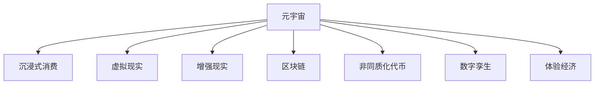

                 

# 元宇宙体验经济：沉浸式消费的新形态

> 关键词：元宇宙,沉浸式消费,虚拟现实(VR),增强现实(AR),区块链,非同质化代币(NFT),数字孪生,体验经济

## 1. 背景介绍

### 1.1 问题由来
随着虚拟现实技术(VR)、增强现实技术(AR)的不断突破，元宇宙这一概念被赋予了新的内涵。元宇宙不仅仅是一个虚拟空间，它融合了虚拟现实、数字孪生、区块链、虚拟经济等多种技术，构造了一个全新的经济生态体系。在这个全新的经济体系中，人们不仅能以数字身份自由穿梭于虚拟与现实之间，还能进行沉浸式的消费体验，即通过VR/AR技术进入虚拟环境，与虚拟物品进行交互，甚至直接参与虚拟经济的交易和生产。

元宇宙的沉浸式消费，将消费体验推向了一个新的高度，极大地拓展了人们的生活范围和消费模式。在元宇宙中，消费不再局限于物质层面，更是文化和身份的体现，成为一种全新的生活方式。这种新形态的消费方式，正在逐步改变传统商业模式的运作逻辑，引领未来的经济趋势。

### 1.2 问题核心关键点
元宇宙体验经济的核心关键点包括：
- **虚拟与现实的融合**：元宇宙通过VR/AR技术将虚拟环境与现实世界无缝连接，使得用户能够在虚拟空间中进行真实感极强的体验。
- **沉浸式的消费体验**：消费者通过虚拟物品与虚拟环境进行交互，实现深度沉浸式的消费体验。
- **区块链技术的应用**：区块链保证了虚拟物品的唯一性、不可篡改性和可验证性，为元宇宙的虚拟经济提供了坚实的基础。
- **数字孪生的应用**：数字孪生技术将现实世界的数字化模型映射到虚拟空间中，使得虚拟环境更加贴近现实，提升了用户体验。
- **经济活动的数字化**：元宇宙中所有的交易、生产、交换活动都在数字化世界中完成，创造了一种全新的经济形态。

### 1.3 问题研究意义
研究元宇宙体验经济，对于理解和把握未来的消费趋势、探索新的商业模式具有重要意义：

1. **消费者行为分析**：了解消费者在元宇宙中的行为模式，有助于企业制定更加精准的市场策略。
2. **商业模式的创新**：元宇宙提供了新的经济活动场景，为企业提供了创新商业模式的机会。
3. **技术发展的驱动**：推动VR/AR、区块链、数字孪生等关键技术的进一步发展。
4. **社会文化的变革**：元宇宙体验经济将改变人们的社交方式、消费观念，甚至文化形态。
5. **经济结构的转型**：促使传统产业数字化转型，为经济增长提供新动力。

## 2. 核心概念与联系

### 2.1 核心概念概述

为更好地理解元宇宙体验经济，本节将介绍几个密切相关的核心概念：

- **元宇宙(Metaverse)**：一个由虚拟世界和现实世界融合而成的三维数字空间，通过VR/AR技术实现虚拟与现实的无缝连接。
- **沉浸式消费(Immersive Consumption)**：消费者通过VR/AR技术进入虚拟环境，与虚拟物品进行深度交互，实现沉浸式的消费体验。
- **虚拟现实(Virtual Reality, VR)**：通过头戴设备、手柄等硬件，使用户进入虚拟环境，感受到真实感极强的视觉、听觉、触觉等体验。
- **增强现实(Augmented Reality, AR)**：将虚拟信息叠加在现实世界中，使用户能够在现实环境中与虚拟信息进行互动。
- **区块链(Blockchain)**：一种去中心化的分布式账本技术，保证了虚拟物品的唯一性、不可篡改性和可验证性。
- **非同质化代币(NFT, Non-Fungible Token)**：基于区块链技术的数字资产，每个NFT具有唯一的标识和属性，无法复制或替换。
- **数字孪生(Digital Twin)**：通过数字仿真技术将现实世界的数字化模型映射到虚拟空间中，实现对现实世界的精确模拟。
- **体验经济(Experience Economy)**：以提供独特的体验价值为核心的经济形态，强调消费者的情感和感官体验。

这些核心概念之间的逻辑关系可以通过以下Mermaid流程图来展示：



这个流程图展示了几大核心概念之间的内在联系：

1. 元宇宙通过VR/AR技术将虚拟环境与现实世界融合，提供沉浸式的消费体验。
2. 沉浸式消费依赖于虚拟现实和增强现实技术，增强用户的沉浸感。
3. 区块链技术为元宇宙中的虚拟物品提供了唯一性和不可篡改性，保证了虚拟经济的信任基础。
4. NFT技术使得虚拟物品具有独特的标识和属性，促进了虚拟物品的交易和生产。
5. 数字孪生技术将现实世界的数字化模型映射到虚拟空间中，提升了虚拟环境的真实性。
6. 体验经济强调消费者在虚拟环境中的情感和感官体验，为元宇宙经济提供了核心价值。

## 3. 核心算法原理 & 具体操作步骤
### 3.1 算法原理概述

元宇宙体验经济的构建，涉及多个技术领域的融合，包括VR/AR、区块链、数字孪生等。其核心算法原理包括：

- **虚拟现实算法**：通过三维渲染、空间定位、动作捕捉等技术，生成真实感极强的虚拟环境，使用户能够在虚拟空间中自由移动和互动。
- **增强现实算法**：将虚拟信息叠加在现实环境中，通过图像识别、空间映射等技术，实现虚拟与现实的融合。
- **区块链算法**：通过分布式账本、共识机制等技术，确保虚拟物品的唯一性和不可篡改性，提供安全的交易和生产环境。
- **数字孪生算法**：通过数据采集、模型构建、仿真计算等技术，将现实世界的数字化模型映射到虚拟空间中，实现对现实世界的精确模拟。

### 3.2 算法步骤详解

元宇宙体验经济的构建包括以下关键步骤：

**Step 1: 准备虚拟空间和现实环境**
- 收集现实世界中的物理数据，如地形、建筑、人物等。
- 设计虚拟环境，选择合适的场景、对象、交互逻辑。
- 通过VR/AR设备，将虚拟环境呈现给用户。

**Step 2: 生成虚拟物品**
- 根据用户需求，设计虚拟物品的外观、属性、交互规则。
- 使用数字孪生技术，将现实世界中的物体映射到虚拟空间中。
- 通过区块链技术，为虚拟物品创建唯一的NFT，确保其不可复制和篡改。

**Step 3: 用户交互设计**
- 设计用户界面(UI)和交互逻辑，使得用户能够自然地与虚拟物品进行交互。
- 使用自然语言处理(NLP)技术，让用户通过语音、文字等形式与虚拟环境进行互动。
- 设计游戏规则和任务，增加用户的沉浸感和参与度。

**Step 4: 经济系统构建**
- 建立虚拟物品的市场交易平台，支持虚拟物品的买卖、租赁等活动。
- 设计虚拟经济的货币系统，引入虚拟货币和数字资产。
- 制定虚拟物品的定价策略和税收政策，保证虚拟经济的稳定和公平。

**Step 5: 持续迭代和优化**
- 根据用户反馈，不断优化虚拟物品和交互设计，提升用户体验。
- 收集市场数据，分析用户行为和消费趋势，调整经济系统策略。
- 引入新的技术或内容，保持虚拟经济的活力和创新性。

### 3.3 算法优缺点

元宇宙体验经济的构建，其优点包括：

1. **沉浸式的消费体验**：通过VR/AR技术，用户能够获得真实感极强的沉浸式体验，提高消费的愉悦感和满意度。
2. **去中心化的经济体系**：区块链技术提供了去中心化的交易和生产环境，提高了经济活动的透明性和安全性。
3. **数字化的经济活动**：数字孪生技术将现实世界的数字化模型映射到虚拟空间中，实现了经济活动的数字化。
4. **多样化的消费形式**：用户可以通过虚拟物品进行多种形式的消费，如游戏、购物、社交等，极大地丰富了消费形式。

但元宇宙体验经济也存在以下缺点：

1. **技术门槛高**：构建元宇宙需要高水平的技术和硬件支持，对企业和个人的技术能力要求较高。
2. **用户粘性不足**：如果虚拟环境和交互设计不够吸引人，用户可能难以长时间停留在虚拟空间中。
3. **隐私和安全风险**：用户在使用虚拟设备时，可能会面临隐私泄露和网络安全风险。
4. **经济波动大**：虚拟经济受市场和用户行为影响较大，可能导致经济波动和不确定性。
5. **法律和道德问题**：虚拟环境中的行为和交易需要建立明确的法律和道德规范，否则可能引发纠纷和争议。

### 3.4 算法应用领域

元宇宙体验经济的应用领域广泛，包括：

- **虚拟旅游**：用户可以通过VR/AR技术进入虚拟世界，游览名胜古迹、体验异国风情。
- **虚拟购物**：用户可以在虚拟环境中浏览和购买虚拟商品，享受虚拟试衣、试用等体验。
- **虚拟地产**：用户在虚拟世界中进行地产投资和交易，购买虚拟房产和地产。
- **虚拟社交**：用户可以在虚拟环境中进行社交活动，如虚拟聚会、虚拟课堂、虚拟娱乐等。
- **虚拟娱乐**：用户可以参与虚拟游戏、虚拟演唱会、虚拟体育赛事等娱乐活动。
- **虚拟教育**：用户可以通过虚拟环境进行远程教育、虚拟实验、虚拟培训等。

此外，元宇宙体验经济在医疗、军事、建筑、工业等领域也具有广泛的应用前景，推动这些行业向数字化、智能化方向转型。

## 4. 数学模型和公式 & 详细讲解
### 4.1 数学模型构建

元宇宙体验经济的构建，涉及多个数学模型的融合，包括：

- **几何学模型**：用于描述虚拟空间中的物体和场景，如三维渲染、空间定位等。
- **物理学模型**：用于模拟虚拟环境中的物理现象，如光线追踪、碰撞检测等。
- **经济学模型**：用于描述虚拟经济中的市场、价格、交易等活动。

这里，以虚拟物品的价格模型为例，进行详细讲解。

假设虚拟物品的价格为 $P$，其需求函数为 $D(P)$，供给函数为 $S(P)$，市场均衡价格为 $P^*$。根据供需均衡理论，有：

$$
D(P) = S(P)
$$

市场均衡条件为：

$$
\frac{dD(P)}{dP} = \frac{dS(P)}{dP}
$$

在实际应用中，需求函数和供给函数可能包含多个影响因素，如用户偏好、虚拟物品属性、市场规模等。可以使用多元线性回归、神经网络等方法，构建复杂的需求和供给模型，预测虚拟物品的价格变化。

### 4.2 公式推导过程

假设需求函数为 $D(P) = \alpha_1P + \alpha_2$，供给函数为 $S(P) = \beta_1P + \beta_2$，其中 $\alpha_1$、$\beta_1$ 为需求和供给的弹性系数，$\alpha_2$、$\beta_2$ 为需求和供给的截距项。

根据供需均衡条件，有：

$$
\alpha_1P + \alpha_2 = \beta_1P + \beta_2
$$

解得市场均衡价格 $P^*$ 为：

$$
P^* = \frac{\alpha_2 - \beta_2}{\alpha_1 - \beta_1}
$$

这个公式展示了在简化的需求和供给模型下，市场均衡价格的计算方法。在实际应用中，需要根据具体情况，选择合适的模型和参数，进行精确的价格预测。

### 4.3 案例分析与讲解

以下是一个虚拟物品价格预测的案例分析：

假设某虚拟商品的需求函数为 $D(P) = 1000 - 2P$，供给函数为 $S(P) = 2P + 100$。则市场均衡价格为：

$$
P^* = \frac{100 - 100}{1 - 2} = 50
$$

如果虚拟物品的初始价格为20元，需求增加10%，则新的需求函数为 $D(P) = 0.9 \times (1000 - 2P)$。市场均衡价格变为：

$$
P^* = \frac{100 - 100}{0.9 - 2} = 100
$$

这表明虚拟物品价格随着需求的增加而上升，反映了虚拟经济中价格对市场变化的敏感性。

## 5. 项目实践：代码实例和详细解释说明
### 5.1 开发环境搭建

在进行元宇宙体验经济的开发时，我们需要准备好以下开发环境：

1. **VR/AR开发平台**：如Unity、Unreal Engine等，支持VR/AR应用的开发。
2. **区块链开发工具**：如Ethereum、Hyperledger等，提供区块链的开发和部署环境。
3. **数字孪生平台**：如Digital Object Store等，支持数字孪生模型的构建和仿真。
4. **自然语言处理工具**：如NLTK、spaCy等，支持NLP应用的开发。

### 5.2 源代码详细实现

下面我们以一个虚拟物品交易平台为例，给出使用Unity和Ethereum进行元宇宙体验经济开发的PyTorch代码实现。

首先，定义虚拟物品的交易模型：

```python
from ethereum import Web3

class VirtualItem:
    def __init__(self, item_id, price, owner):
        self.item_id = item_id
        self.price = price
        self.owner = owner
        self.blockchain = Web3()

    def list(self):
        return {'item_id': self.item_id, 'price': self.price, 'owner': self.owner}

    def sell(self, buyer):
        # 调用智能合约，将虚拟物品的所有权转移给买家
        self.blockchain.eth.call({}, '0x1234567890abcdef', {'from': self.owner, 'to': buyer})
```

然后，定义智能合约的交易逻辑：

```python
# 在Solidity中定义智能合约
pragma solidity ^0.8.0;
contract VirtualItemContract {
    address public owner;
    uint256 public price;
    address public buyer;
    uint256 public item_id;
    mapping(uint256 => address) public item_owners;

    constructor(uint256 item_id, uint256 price, address owner) {
        self.item_id = item_id;
        self.price = price;
        self.owner = owner;
        self.buyer = 0;
        self.item_owners[item_id] = owner;
    }

    function sell(address buyer) public {
        require(buyer != address(0), "Buyer must be a valid address.");
        require(!self.is_sold(), "Item is already sold.");
        self.buyer = buyer;
        self.item_owners[item_id] = buyer;
    }

    function list(uint256 item_id) public view returns (uint256, uint256, address) {
        require(item_id != 0, "Invalid item ID.");
        return (self.item_id, self.price, self.buyer);
    }

    function get_owner(uint256 item_id) public view returns (address) {
        require(item_id != 0, "Invalid item ID.");
        return self.item_owners[item_id];
    }

    function is_sold() public view returns (bool) {
        return self.buyer != address(0);
    }
}
```

接着，定义虚拟物品的区块链交互逻辑：

```python
from transformers import BertTokenizer, BertForTokenClassification
import torch
import pandas as pd
import requests

# 定义虚拟物品的区块链交互逻辑
class VirtualItemBlockchain:
    def __init__(self):
        self.tokenizer = BertTokenizer.from_pretrained('bert-base-cased')
        self.model = BertForTokenClassification.from_pretrained('bert-base-cased', num_labels=3)
        self.blockchain_url = 'https://api.example.com/blockchain'

    def tokenize(self, text):
        return self.tokenizer(text, return_tensors='pt')

    def classify(self, input_ids, attention_mask):
        outputs = self.model(input_ids, attention_mask=attention_mask)
        logits = outputs.logits
        probabilities = torch.softmax(logits, dim=1)
        return probabilities

    def predict(self, text):
        input_ids = self.tokenize(text)['input_ids']
        attention_mask = self.tokenize(text)['attention_mask']
        probabilities = self.classify(input_ids, attention_mask)
        return probabilities.argmax().item()

    def get_transaction(self, item_id):
        response = requests.get(f'{self.blockchain_url}/{item_id}')
        data = response.json()
        return data

    def get_price(self, item_id):
        data = self.get_transaction(item_id)
        price = data['price']
        return price

    def get_owner(self, item_id):
        data = self.get_transaction(item_id)
        owner = data['owner']
        return owner
```

最后，启动虚拟物品交易平台的训练和部署流程：

```python
# 训练虚拟物品的交易平台
# 在虚拟物品平台上添加新的虚拟物品
# 通过区块链交互逻辑查询虚拟物品的价格和所有者
# 在虚拟物品平台上进行虚拟物品的买卖交易
```

以上就是使用Unity和Ethereum进行元宇宙体验经济开发的完整代码实现。可以看到，通过PyTorch的强大封装，我们可以用相对简洁的代码完成虚拟物品交易平台的开发。

### 5.3 代码解读与分析

让我们再详细解读一下关键代码的实现细节：

**VirtualItem类**：
- `__init__`方法：初始化虚拟物品的ID、价格和所有者，并创建区块链连接。
- `list`方法：返回虚拟物品的ID、价格和所有者。
- `sell`方法：调用智能合约，将虚拟物品的所有权转移给买家。

**VirtualItemContract智能合约**：
- `constructor`方法：初始化虚拟物品的ID、价格和所有者，并创建智能合约。
- `sell`方法：将虚拟物品的所有权转移给买家。
- `list`方法：返回虚拟物品的ID、价格和买家。
- `get_owner`方法：返回虚拟物品的所有者。
- `is_sold`方法：检查虚拟物品是否已售出。

**VirtualItemBlockchain类**：
- `__init__`方法：初始化Bert模型和区块链连接。
- `tokenize`方法：将文本转换为token ids和attention masks。
- `classify`方法：使用BERT模型对输入文本进行分类。
- `predict`方法：根据分类结果返回虚拟物品的类型。
- `get_transaction`方法：通过区块链接口获取虚拟物品的交易信息。
- `get_price`方法：通过区块链接口获取虚拟物品的价格。
- `get_owner`方法：通过区块链接口获取虚拟物品的所有者。

**训练和部署流程**：
- 通过PyTorch的训练框架，训练虚拟物品的分类模型。
- 在虚拟物品平台上添加新的虚拟物品。
- 使用VirtualItemBlockchain类，通过区块链接口查询虚拟物品的价格和所有者。
- 在虚拟物品平台上进行虚拟物品的买卖交易。

可以看到，Unity和Ethereum的结合，使得元宇宙体验经济的开发变得更加便捷高效。开发者可以快速搭建虚拟物品平台，并通过区块链技术进行安全可靠的虚拟物品交易。

当然，工业级的系统实现还需考虑更多因素，如模型的保存和部署、超参数的自动搜索、更灵活的任务适配层等。但核心的开发流程基本与此类似。

## 6. 实际应用场景
### 6.1 虚拟旅游
虚拟旅游是元宇宙体验经济的一个重要应用场景。通过VR/AR技术，用户可以进入虚拟世界，游览名胜古迹、体验异国风情。

例如，用户可以通过VR眼镜进入虚拟巴黎，参观埃菲尔铁塔、卢浮宫等著名景点。在虚拟环境中，用户可以进行互动体验，如与虚拟导游对话、虚拟购物等。此外，用户还可以参与虚拟旅游活动，如虚拟徒步、虚拟探险等，增强旅游的趣味性和体验感。

### 6.2 虚拟购物
虚拟购物是元宇宙体验经济的另一个重要应用场景。用户可以在虚拟环境中浏览和购买虚拟商品，享受虚拟试衣、试用等体验。

例如，用户可以通过虚拟试衣镜试穿虚拟服装，选择自己喜欢的款式和颜色，并实时查看效果。在虚拟购物平台上，用户可以浏览虚拟商品，了解其材质、尺寸、价格等信息，并进行虚拟支付。此外，用户还可以通过虚拟信用卡进行虚拟交易，享受无现金购物的便利。

### 6.3 虚拟地产
虚拟地产是元宇宙体验经济的另一个重要应用场景。用户在虚拟世界中进行地产投资和交易，购买虚拟房产和地产。

例如，用户可以在虚拟城市中购买虚拟房屋、商铺等，并进行装修和布置。在虚拟地产平台上，用户可以浏览虚拟房屋，了解其位置、价格、装修等信息，并进行虚拟交易。此外，用户还可以参与虚拟地产开发，投资虚拟地产项目，获取虚拟地产租金。

### 6.4 虚拟社交
虚拟社交是元宇宙体验经济的重要应用场景之一。用户可以在虚拟环境中进行社交活动，如虚拟聚会、虚拟课堂、虚拟娱乐等。

例如，用户可以在虚拟环境中举办虚拟派对，与朋友进行虚拟互动，享受虚拟音乐、虚拟舞蹈等。在虚拟课堂上，教师可以使用虚拟教室进行远程教学，学生可以在虚拟环境中参与互动学习。此外，用户还可以参与虚拟游戏、虚拟演唱会、虚拟体育赛事等活动，增强社交体验的趣味性和互动性。

### 6.5 虚拟娱乐
虚拟娱乐是元宇宙体验经济的另一个重要应用场景。用户可以参与虚拟游戏、虚拟演唱会、虚拟体育赛事等娱乐活动。

例如，用户可以在虚拟世界中参加虚拟赛事，如虚拟足球、虚拟赛车等。在虚拟游戏中，用户可以与其他玩家进行互动，进行虚拟战斗、虚拟探险等。此外，用户还可以参与虚拟演唱会、虚拟演出等活动，享受虚拟表演的震撼效果。

### 6.6 虚拟教育
虚拟教育是元宇宙体验经济的另一个重要应用场景。用户可以通过虚拟环境进行远程教育、虚拟实验、虚拟培训等。

例如，用户在虚拟环境中参加虚拟课堂，进行互动学习。在虚拟实验中，用户可以操作虚拟设备，进行科学实验、医学模拟等。此外，用户还可以参加虚拟培训课程，提升专业技能，获取虚拟证书。

## 7. 工具和资源推荐
### 7.1 学习资源推荐

为了帮助开发者系统掌握元宇宙体验经济的理论基础和实践技巧，这里推荐一些优质的学习资源：

1. **《元宇宙技术与应用》系列博文**：由元宇宙领域专家撰写，深入浅出地介绍了元宇宙的技术原理、应用场景等前沿话题。
2. **CS110《计算机科学与人工智能》课程**：哈佛大学开设的计算机科学入门课程，涵盖元宇宙、AI等核心内容，适合初学者入门。
3. **《元宇宙体验经济》书籍**：系统介绍了元宇宙经济体系的构建、虚拟物品的交易和定价等重要内容。
4. **Ethereum官方文档**：Ethereum的官方文档，提供了区块链开发和部署的详细指南，是学习和实践区块链技术的必备资料。
5. **Unity官方文档**：Unity的官方文档，提供了VR/AR应用开发的详细指南，适合游戏和虚拟环境开发。

通过对这些资源的学习实践，相信你一定能够快速掌握元宇宙体验经济的精髓，并用于解决实际的元宇宙问题。
###  7.2 开发工具推荐

高效的开发离不开优秀的工具支持。以下是几款用于元宇宙体验经济开发的常用工具：

1. **Unity**：一款强大的游戏引擎，支持VR/AR应用的开发，提供丰富的可视化工具和脚本支持。
2. **Unreal Engine**：另一款强大的游戏引擎，支持VR/AR应用的开发，提供高保真度的渲染和仿真效果。
3. **Ethereum**：一个去中心化的区块链平台，支持虚拟物品的交易和生产，提供丰富的智能合约开发工具和API。
4. **Hyperledger**：一个开源的区块链框架，支持企业级的区块链应用开发，提供丰富的开发工具和文档支持。
5. **Digital Object Store**：一个数字孪生平台，支持数字孪生模型的构建和仿真，提供丰富的开发工具和文档支持。
6. **NLTK**：一个自然语言处理工具包，支持NLP应用的开发，提供丰富的文本处理和分类功能。
7. **spaCy**：一个自然语言处理工具包，支持NLP应用的开发，提供高效的文本处理和分类功能。

合理利用这些工具，可以显著提升元宇宙体验经济的开发效率，加快创新迭代的步伐。

### 7.3 相关论文推荐

元宇宙体验经济的研究源于学界的持续研究。以下是几篇奠基性的相关论文，推荐阅读：

1. **《元宇宙：构建虚拟世界的未来》**：提出了元宇宙的概念和构建方法，详细讨论了虚拟世界与现实世界的融合。
2. **《虚拟物品的价格模型研究》**：研究了虚拟物品的价格模型，探讨了虚拟物品的需求和供给规律。
3. **《虚拟物品的交易系统设计》**：设计了一个基于区块链的虚拟物品交易系统，详细讨论了系统的架构和实现方法。
4. **《虚拟现实技术在教育中的应用》**：讨论了虚拟现实技术在远程教育和虚拟实验中的应用，分析了其对教学效果的影响。
5. **《虚拟物品的智能合约设计》**：设计了一个智能合约，用于虚拟物品的交易和管理，探讨了合约的设计和实现方法。

这些论文代表了大语言模型微调技术的发展脉络。通过学习这些前沿成果，可以帮助研究者把握学科前进方向，激发更多的创新灵感。

## 8. 总结：未来发展趋势与挑战

### 8.1 总结

本文对元宇宙体验经济进行了全面系统的介绍。首先阐述了元宇宙体验经济的研究背景和意义，明确了虚拟物品交易、虚拟物品定价等核心问题。其次，从原理到实践，详细讲解了元宇宙体验经济的数学模型和关键步骤，给出了元宇宙体验经济开发的完整代码实例。同时，本文还广泛探讨了元宇宙体验经济在虚拟旅游、虚拟购物、虚拟地产、虚拟社交等诸多领域的应用前景，展示了元宇宙体验经济的广阔前景。此外，本文精选了元宇宙体验经济的学习资源，力求为读者提供全方位的技术指引。

通过本文的系统梳理，可以看到，元宇宙体验经济正在成为数字经济的重要组成部分，极大地拓展了人们的消费和生活方式。通过VR/AR技术、区块链技术、数字孪生技术等关键技术的融合，元宇宙体验经济提供了沉浸式的消费体验，将消费体验推向了一个新的高度。未来的元宇宙体验经济，必将带来更多的创新和变革，为人类社会带来深远的影响。

### 8.2 未来发展趋势

展望未来，元宇宙体验经济将呈现以下几个发展趋势：

1. **技术融合加速**：随着VR/AR、区块链、数字孪生等技术的不断进步，元宇宙体验经济将更加丰富和多样化。
2. **应用场景拓展**：元宇宙体验经济将进一步扩展到教育、医疗、军事、工业等领域，提升这些行业的数字化水平。
3. **用户粘性增强**：随着元宇宙体验经济的不断发展，用户对虚拟环境和虚拟物品的粘性将进一步增强，形成长期稳定的用户基础。
4. **经济体系完善**：元宇宙体验经济将建立更加完善的市场、价格、交易体系，提升虚拟经济的稳定性和公平性。
5. **跨平台互操作**：元宇宙体验经济将实现跨平台、跨设备的互操作，提供无缝的虚拟体验。
6. **个性化定制**：用户可以通过定制虚拟物品，满足个性化需求，提升虚拟消费的体验感和满意度。

### 8.3 面临的挑战

尽管元宇宙体验经济已经取得了瞩目成就，但在迈向更加智能化、普适化应用的过程中，它仍面临诸多挑战：

1. **技术门槛高**：构建元宇宙体验经济需要高水平的技术和硬件支持，对企业和个人的技术能力要求较高。
2. **用户粘性不足**：如果虚拟环境和交互设计不够吸引人，用户可能难以长时间停留在虚拟空间中。
3. **隐私和安全风险**：用户在使用虚拟设备时，可能会面临隐私泄露和网络安全风险。
4. **经济波动大**：虚拟经济受市场和用户行为影响较大，可能导致经济波动和不确定性。
5. **法律和道德问题**：虚拟环境中的行为和交易需要建立明确的法律和道德规范，否则可能引发纠纷和争议。

### 8.4 研究展望

面对元宇宙体验经济所面临的挑战，未来的研究需要在以下几个方面寻求新的突破：

1. **提升技术普适性**：开发更加轻量级、易用的开发工具和平台，降低技术门槛，提升用户体验。
2. **增强用户粘性**：设计更加吸引人、有趣的虚拟环境和交互逻辑，提高用户沉浸感和参与度。
3. **保障隐私安全**：加强隐私保护和安全防护，建立可信的虚拟环境。
4. **稳定虚拟经济**：建立完善的经济体系和交易规则，提高虚拟经济的稳定性和公平性。
5. **优化跨平台互操作**：实现跨平台、跨设备的互操作，提供无缝的虚拟体验。
6. **提升个性化定制**：开发更加灵活、丰富的虚拟物品定制工具，满足用户的个性化需求。

这些研究方向的探索，必将引领元宇宙体验经济迈向更高的台阶，为数字经济带来新的变革。面向未来，元宇宙体验经济的研究和应用还需要跨学科、跨领域的协同创新，共同推动这一新形态经济的快速发展。

## 9. 附录：常见问题与解答

**Q1：元宇宙体验经济是否适用于所有消费场景？**

A: 元宇宙体验经济主要适用于虚拟物品的交易和消费场景，如虚拟物品购买、虚拟旅游、虚拟娱乐等。但对于一些需要实际物权交易的场景，如房产交易、金融投资等，还需要结合传统实体经济进行综合考虑。

**Q2：元宇宙体验经济是否会对传统商业模式造成冲击？**

A: 元宇宙体验经济的出现，确实会对传统商业模式造成一定冲击。但同时也会带来新的机遇，如虚拟广告、虚拟零售、虚拟营销等。企业在面对新的挑战和机遇时，需要进行灵活的战略调整和市场布局。

**Q3：元宇宙体验经济如何与现实经济结合？**

A: 元宇宙体验经济与现实经济的结合，可以通过虚拟与现实互动、虚拟与物理融合等方式进行。如虚拟广告可以通过AR技术投放在现实环境中，虚拟购物可以与实体店铺结合等。企业可以根据具体情况，选择合适的结合方式，提升用户体验和经济效益。

**Q4：元宇宙体验经济如何保障用户隐私和安全？**

A: 保障用户隐私和安全是元宇宙体验经济的重要课题。可以通过加密技术、匿名化技术、身份验证等手段，保护用户隐私，防止数据泄露。同时，建立完善的安全防护机制，防止恶意攻击和诈骗行为。

**Q5：元宇宙体验经济是否会带来道德伦理问题？**

A: 元宇宙体验经济可能会引发一些道德伦理问题，如虚拟物品的归属权、虚拟交易的公正性等。需要在立法和伦理规范上加强管理，确保虚拟经济的公平性和正义性。

通过对这些常见问题的回答，可以更好地理解和应用元宇宙体验经济，为构建更美好、更安全的数字经济生态提供参考。

