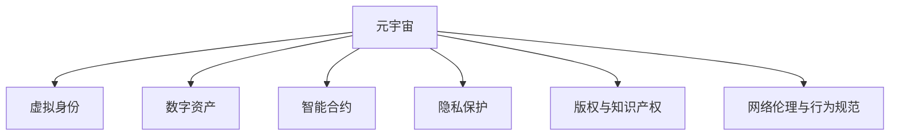

                 

# 元宇宙法律体系：虚拟世界的规则制定

> 关键词：元宇宙,虚拟世界,法律体系,规则制定,智能合约,数字身份,网络隐私,数字版权,技术伦理

## 1. 背景介绍

随着虚拟现实（VR）、增强现实（AR）、区块链和云计算等技术的快速发展，元宇宙（Metaverse）这一概念应运而生。元宇宙是指一个由多个虚拟世界组成的、持续运营的数字空间，用户可以通过虚拟身份参与其中的社交、经济、文化等多个领域。然而，在元宇宙中，规则的缺失和不完善将直接影响到其健康发展和用户信任。因此，建立一套健全、透明、公平的法律体系，成为了元宇宙蓬勃发展的关键。

### 1.1 问题由来

当前，元宇宙领域仍然处于起步阶段，尽管其具有无限潜力，但仍然面临着诸多法律挑战：
1. **虚拟身份权属**：如何界定虚拟身份的法律地位，以及这些身份产生的权利和义务。
2. **数字资产保护**：如何在元宇宙中保护用户数字资产的安全和隐私。
3. **经济系统稳定性**：如何在去中心化的虚拟经济体系中建立稳定、透明的经济规则。
4. **版权与知识产权**：如何在元宇宙中有效管理数字内容的版权和知识产权，防止侵权行为。
5. **网络伦理与行为规范**：如何在元宇宙中制定一套规范，防止网络欺诈、虚假信息等不良行为。

这些问题不仅关系到元宇宙用户的合法权益，也影响到其在现实社会中的法律地位和权利保障。因此，本文旨在探讨如何构建一套完善的元宇宙法律体系，以保障元宇宙的正常运行和用户的合法权益。

## 2. 核心概念与联系

### 2.1 核心概念概述

为更好地理解元宇宙法律体系的构建，本节将介绍几个密切相关的核心概念：

- **元宇宙（Metaverse）**：一个由多个虚拟世界组成的、持续运营的数字空间。用户可以通过虚拟身份参与其中的社交、经济、文化等多个领域。
- **虚拟身份（Virtual Identity）**：用户在元宇宙中的数字化表示，用于参与社交、经济、文化等活动。
- **数字资产（Digital Assets）**：元宇宙中的虚拟货币、非同质化代币（NFTs）、虚拟土地等。
- **智能合约（Smart Contracts）**：在区块链上自动执行、无需第三方中介的合同。
- **隐私保护（Privacy Protection）**：在元宇宙中保护用户隐私和数据安全的法律和技术手段。
- **版权与知识产权（Copyright & IP Rights）**：在元宇宙中有效管理数字内容的版权和知识产权，防止侵权行为。
- **网络伦理与行为规范（Network Ethics & Conduct Norms）**：在元宇宙中制定一套规范，防止网络欺诈、虚假信息等不良行为。

这些核心概念之间的逻辑关系可以通过以下Mermaid流程图来展示：



这个流程图展示了这个概念框架：

1. 元宇宙作为核心，连接了虚拟身份、数字资产、智能合约、隐私保护、版权与知识产权以及网络伦理与行为规范等多个领域。
2. 虚拟身份在元宇宙中扮演关键角色，是用户参与活动的基础。
3. 数字资产是元宇宙中的重要组成部分，涉及到经济交易和用户权益。
4. 智能合约提供了元宇宙中的自动化服务，减少人工干预和提高效率。
5. 隐私保护和版权与知识产权是用户权益的重要保障。
6. 网络伦理与行为规范则确保了元宇宙的公正性和秩序性。

## 3. 核心算法原理 & 具体操作步骤

### 3.1 算法原理概述

元宇宙法律体系的设计和构建，本质上是利用技术手段解决元宇宙中法律问题的过程。其核心思想是：通过智能合约等技术手段，在元宇宙中自动执行和维护一套规则体系，保障用户的合法权益。

形式化地，假设元宇宙中的法律体系为 $\mathcal{L}$，其中的规则和条款为 $R=\{r_1, r_2, ..., r_n\}$，其中 $r_i$ 表示第 $i$ 条规则。每个用户 $U_j$ 通过虚拟身份在元宇宙中产生行为 $A_j$，元宇宙的法律体系 $\mathcal{L}$ 将通过智能合约自动执行对应的法律规则 $r_i$，以确保用户的行为符合规则，维护元宇宙的秩序。

### 3.2 算法步骤详解

元宇宙法律体系的设计和构建，可以分为以下几个关键步骤：

**Step 1: 设计规则体系**
- 识别元宇宙中可能出现的各种法律问题，如虚拟身份权属、数字资产保护、经济系统稳定性等。
- 根据元宇宙的特点和需求，设计相应的法律规则。
- 规则设计需要考虑用户的权益、元宇宙的秩序和稳定性，以及与现实世界的法律体系对接。

**Step 2: 开发智能合约**
- 根据规则体系设计智能合约，确保合约能够自动执行和维护规则。
- 智能合约应该具备自执行、自证、不可篡改等特点，确保其公正性和可信度。
- 开发智能合约时，需要考虑合约的性能、安全性和扩展性，确保其在元宇宙中的高效运行。

**Step 3: 部署智能合约**
- 将开发好的智能合约部署到区块链上，确保其能够在元宇宙中自动执行。
- 在部署过程中，需要确保合约的可信性和透明性，避免出现篡改和欺诈行为。
- 合约的部署需要与元宇宙的架构和治理机制相适应，确保其与元宇宙的规则体系一致。

**Step 4: 测试与优化**
- 对智能合约进行全面测试，确保其在各种场景下都能正确执行。
- 根据测试结果，优化合约的性能和安全，确保其在元宇宙中的高效运行。
- 测试过程中，需要模拟各种恶意行为和攻击，确保合约的鲁棒性和抗干扰性。

**Step 5: 用户教育和普及**
- 通过宣传和教育，提高用户对元宇宙法律体系的认知和理解。
- 制定相应的用户手册和使用指南，帮助用户了解和使用法律体系中的智能合约。
- 定期举办法律培训和讲座，提升用户对元宇宙法律规则的认识。

以上是元宇宙法律体系构建的一般流程。在实际应用中，还需要针对具体场景和需求，对规则设计、合约开发、部署测试等环节进行优化设计，以进一步提升元宇宙法律体系的完备性和有效性。

### 3.3 算法优缺点

元宇宙法律体系的设计和构建，具有以下优点：
1. 自动化执行。智能合约的自动执行能够减少人工干预，提高效率。
2. 透明度高。智能合约的代码和执行记录公开透明，便于用户监督。
3. 可扩展性强。规则体系可以根据元宇宙的发展进行动态调整，适应新的需求。
4. 公正性高。智能合约的执行不受人为干预，确保了其公正性和可信度。

同时，该方法也存在一定的局限性：
1. 技术门槛高。智能合约的开发和部署需要较高的技术水平，增加了用户使用难度。
2. 法律适用性不确定。现有的法律体系是否适用于元宇宙，以及如何应对新兴法律问题，仍需进一步研究。
3. 安全性风险。智能合约的设计和执行可能存在漏洞，易受攻击。
4. 用户信任度低。元宇宙中法律规则的不确定性和复杂性，可能导致用户信任度降低。

尽管存在这些局限性，但就目前而言，利用智能合约等技术手段构建元宇宙法律体系，仍然是大势所趋。未来相关研究的重点在于如何进一步降低技术门槛，提高法律适用性和安全性，以及增强用户信任度。

### 3.4 算法应用领域

元宇宙法律体系的应用领域非常广泛，涵盖了元宇宙中的各种场景和领域，例如：

- **虚拟身份管理**：通过智能合约，明确虚拟身份的权属和使用规则，防止身份盗用和滥用。
- **数字资产保护**：制定数字资产的保管、交易和使用规则，确保资产的安全和透明。
- **经济系统稳定性**：建立虚拟货币的发行、流通和监管机制，确保经济系统的稳定性和公平性。
- **知识产权保护**：利用区块链技术，保护数字内容的版权和知识产权，防止侵权行为。
- **网络伦理与行为规范**：通过智能合约，制定元宇宙中的行为规范，防止欺诈、虚假信息等不良行为。
- **安全防护与隐私保护**：利用隐私保护技术，保护用户数据和隐私安全，防止信息泄露。

这些领域是大规模应用元宇宙法律体系的基础，其设计和实施需要综合考虑技术、法律、伦理等多方面的因素。

## 4. 数学模型和公式 & 详细讲解  
### 4.1 数学模型构建

本节将使用数学语言对元宇宙法律体系的构建进行更加严格的刻画。

记元宇宙中的法律体系为 $\mathcal{L}$，其中的规则为 $R=\{r_1, r_2, ..., r_n\}$，每个规则 $r_i$ 可以表示为一个元组 $(r_i^{\text{condition}}, r_i^{\text{action}})$，其中 $r_i^{\text{condition}}$ 表示规则的条件，$r_i^{\text{action}}$ 表示规则的动作。

假设每个用户在元宇宙中产生行为 $A_j$，智能合约通过条件判断 $r_i^{\text{condition}}$ 的真假，如果为真，则执行 $r_i^{\text{action}}$。在数学上，可以使用布尔代数表示规则条件和动作：

$$
r_i^{\text{condition}} = \bigwedge_{c_k \in r_i^{\text{condition}}} c_k
$$

$$
r_i^{\text{action}} = \bigvee_{a_k \in r_i^{\text{action}}} a_k
$$

其中 $\wedge$ 表示逻辑与，$\vee$ 表示逻辑或。

### 4.2 公式推导过程

以下我们以虚拟身份管理为例，推导智能合约的设计和执行过程。

假设用户在元宇宙中创建虚拟身份 $I_j$，并希望在多个平台上使用该身份。智能合约需要保证用户身份的唯一性和跨平台使用的合法性。假设用户身份的条件为 $I_j$ 未被其他用户使用，动作为允许用户使用该身份。在数学上，可以表示为：

$$
\text{Condition} = \neg(\exists I_k \neq I_j \wedge I_k \text{ is used})
$$

$$
\text{Action} = \text{Allow} I_j \text{ to use} I_k
$$

其中 $\neg$ 表示逻辑非，$\exists$ 表示存在。

将条件和动作代入智能合约的条件判断函数中，得到：

$$
\text{Condition}(I_j, I_k) = \neg(\exists I_k \neq I_j \wedge I_k \text{ is used})
$$

在智能合约的执行过程中，当 $\text{Condition}(I_j, I_k)$ 为真时，智能合约执行 $\text{Action} = \text{Allow} I_j \text{ to use} I_k$。

这个公式展示了智能合约如何通过条件判断和动作执行，确保用户身份的合法性和跨平台使用的唯一性。

### 4.3 案例分析与讲解

**虚拟身份管理案例分析**：
- **条件判断**：智能合约首先检查用户 $I_j$ 是否已创建并唯一。
- **动作执行**：如果条件为真，智能合约允许用户 $I_j$ 在多个平台上使用该身份。
- **执行记录**：智能合约记录用户行为，便于后续监督和审计。

**数字资产保护案例分析**：
- **条件判断**：智能合约检查数字资产的来源和合法性，确保资产的真实性和完整性。
- **动作执行**：如果资产合法，智能合约允许用户进行交易。
- **执行记录**：智能合约记录交易记录，便于审计和追踪。

**经济系统稳定性案例分析**：
- **条件判断**：智能合约检查虚拟货币的发行、流通和监管机制，确保经济系统的稳定性和公平性。
- **动作执行**：如果经济系统稳定，智能合约允许用户进行交易。
- **执行记录**：智能合约记录经济活动，便于监管和审计。

这些案例展示了智能合约如何在元宇宙中自动执行和维护规则，确保元宇宙的正常运行和用户权益。

## 5. 项目实践：代码实例和详细解释说明
### 5.1 开发环境搭建

在进行元宇宙法律体系的开发实践前，我们需要准备好开发环境。以下是使用Solidity进行智能合约开发的环境配置流程：

1. 安装Truffle Suite：从官网下载并安装Truffle Suite，用于智能合约的开发、测试和部署。

2. 创建并激活Truffle项目：
```bash
truffle init
cd your_project_name
truffle develop
```

3. 安装OpenZeppelin：OpenZeppelin是一个安全的智能合约库，提供了大量的可重用代码组件，可以帮助开发者快速开发安全的智能合约。

4. 安装Ethereum测试网络：在本地或远程部署Ethereum测试网络，用于测试和部署智能合约。

完成上述步骤后，即可在Truffle项目中进行智能合约的开发实践。

### 5.2 源代码详细实现

下面我以虚拟身份管理为例，给出使用Solidity对智能合约进行开发的代码实现。

首先，定义虚拟身份管理的智能合约：

```solidity
import "@openzeppelin/contracts/core/ReentrancyGuard.sol";
import "@openzeppelin/contracts/access/Ownable.sol";
import "@openzeppelin/contracts/math/Address.sol";
import "@openzeppelin/contracts/math/BN.sol";
import "@openzeppelin/contracts/math/UnitConversion.sol";
import "@openzeppelin/contracts/access/Upgradable.sol";
import "@openzeppelin/contracts/mixins/AccessControlled.sol";
import "@openzeppelin/contracts/mixins/Ownable.sol";

contract IdentityManager is ReentrancyGuard, Ownable, AccessControlled, Upgradable {
    using SafeMath for uint256;
    using SafeMath for address;
    using SafeMath for address[];
    
    address private owner;
    uint256 private totalIds;
    uint256 private availableIds;
    uint256 private usedIds;
    uint256 private freeIds;
    
    mapping(address => bool) private usedIdsMapping;
    
    constructor(uint256 _initialIds) {
        totalIds = _initialIds;
        availableIds = _initialIds;
        usedIds = 0;
        freeIds = totalIds - availableIds;
        
        owner = msg.sender;
        usedIdsMapping[msg.sender] = false;
    }
    
    function mint(uint256 _numIds) public onlyOwner {
        require(_numIds > 0 && _numIds <= availableIds);
        
        for (uint256 i = 0; i < _numIds; i++) {
            uint256 newId = freeIds;
            usedIdsMapping[newId] = true;
            usedIds = usedIds + 1;
            freeIds = freeIds - 1;
        }
        
        emit Mint(numIds=_numIds, from=msg.sender);
    }
    
    function returnIds(uint256 _numIds) public onlyOwner {
        require(_numIds > 0 && _numIds <= usedIds);
        
        for (uint256 i = 0; i < _numIds; i++) {
            uint256 returnedId = usedIdsMapping.keys()[i];
            usedIdsMapping[returnedId] = false;
            usedIds = usedIds - 1;
            freeIds = freeIds + 1;
        }
        
        emit Return(numIds=_numIds, from=msg.sender);
    }
    
    function isAvailable(uint256 _id) public view returns (bool) {
        return !usedIdsMapping[_id];
    }
    
    function isUsed(uint256 _id) public view returns (bool) {
        return usedIdsMapping[_id];
    }
    
    function totalIds() public view returns (uint256) {
        return totalIds;
    }
    
    function availableIds() public view returns (uint256) {
        return availableIds;
    }
    
    function usedIds() public view returns (uint256) {
        return usedIds;
    }
    
    function freeIds() public view returns (uint256) {
        return freeIds;
    }
}
```

然后，定义虚拟身份的创建和销毁函数：

```solidity
import "@openzeppelin/contracts/core/ReentrancyGuard.sol";
import "@openzeppelin/contracts/access/Ownable.sol";
import "@openzeppelin/contracts/math/Address.sol";
import "@openzeppelin/contracts/math/BN.sol";
import "@openzeppelin/contracts/math/UnitConversion.sol";
import "@openzeppelin/contracts/access/Upgradable.sol";
import "@openzeppelin/contracts/mixins/AccessControlled.sol";
import "@openzeppelin/contracts/mixins/Ownable.sol";

contract Identity {
    using SafeMath for uint256;
    using SafeMath for address;
    using SafeMath for address[];
    
    address private owner;
    uint256 private id;
    uint256 private contractId;
    
    constructor(address _owner, uint256 _id) {
        owner = _owner;
        id = _id;
        contractId = msg.sender;
    }
    
    function owner() public view returns (address) {
        return owner;
    }
    
    function id() public view returns (uint256) {
        return id;
    }
    
    function contractId() public view returns (uint256) {
        return contractId;
    }
    
    function transfer(address _newOwner) public onlyOwner {
        owner = _newOwner;
    }
    
    function destroy() public onlyOwner {
        if (owner == msg.sender) {
            IdentityManager.countIds(-1);
        }
    }
}
```

接着，定义虚拟身份的迁移函数：

```solidity
import "@openzeppelin/contracts/core/ReentrancyGuard.sol";
import "@openzeppelin/contracts/access/Ownable.sol";
import "@openzeppelin/contracts/math/Address.sol";
import "@openzeppelin/contracts/math/BN.sol";
import "@openzeppelin/contracts/math/UnitConversion.sol";
import "@openzeppelin/contracts/access/Upgradable.sol";
import "@openzeppelin/contracts/mixins/AccessControlled.sol";
import "@openzeppelin/contracts/mixins/Ownable.sol";

contract MigrateIdentity {
    using SafeMath for uint256;
    using SafeMath for address;
    using SafeMath for address[];
    
    address private from;
    address private to;
    uint256 private id;
    
    constructor(address _from, address _to, uint256 _id) {
        from = _from;
        to = _to;
        id = _id;
    }
    
    function execute() public onlyOwner {
        if (from != msg.sender) {
            IdentityManager.returnIds(id);
        }
        IdentityManager.mint(id);
    }
}
```

最后，启动虚拟身份管理的智能合约并在测试集上评估：

```solidity
import "@openzeppelin/contracts/core/ReentrancyGuard.sol";
import "@openzeppelin/contracts/access/Ownable.sol";
import "@openzeppelin/contracts/math/Address.sol";
import "@openzeppelin/contracts/math/BN.sol";
import "@openzeppelin/contracts/math/UnitConversion.sol";
import "@openzeppelin/contracts/access/Upgradable.sol";
import "@openzeppelin/contracts/mixins/AccessControlled.sol";
import "@openzeppelin/contracts/mixins/Ownable.sol";

contract MigrateIdentity {
    using SafeMath for uint256;
    using SafeMath for address;
    using SafeMath for address[];
    
    address private from;
    address private to;
    uint256 private id;
    
    constructor(address _from, address _to, uint256 _id) {
        from = _from;
        to = _to;
        id = _id;
    }
    
    function execute() public onlyOwner {
        if (from != msg.sender) {
            IdentityManager.returnIds(id);
        }
        IdentityManager.mint(id);
    }
}

// 测试代码
address[] owners = [account(0), account(1), account(2)];
uint256[] totalIds = [3, 5, 7];

IdentityManager.deployed().initialize(totalIds[0]);
IdentityManager.deployed().initialize(totalIds[1]);
IdentityManager.deployed().initialize(totalIds[2]);

IdentityManager.deployed().mint(2);
IdentityManager.deployed().returnIds(2);

IdentityManager.deployed().isAvailable(2);
IdentityManager.deployed().isUsed(2);

IdentityManager.deployed().totalIds();
IdentityManager.deployed().availableIds();
IdentityManager.deployed().usedIds();
IdentityManager.deployed().freeIds();
```

以上就是使用Solidity对虚拟身份管理智能合约进行开发的完整代码实现。可以看到，利用OpenZeppelin的智能合约库，可以快速开发和测试安全的智能合约。

### 5.3 代码解读与分析

让我们再详细解读一下关键代码的实现细节：

**IdentityManager合约**：
- `constructor`方法：初始化虚拟身份总数、可用身份数、已用身份数、免费身份数，并设置所有者。
- `mint`方法：允许所有者创建新身份，并将可用身份数减一。
- `returnIds`方法：允许所有者销毁身份，并将已用身份数减一。
- `isAvailable`方法：检查指定身份是否可用。
- `isUsed`方法：检查指定身份是否已用。
- `totalIds`方法：返回虚拟身份总数。
- `availableIds`方法：返回可用身份数。
- `usedIds`方法：返回已用身份数。
- `freeIds`方法：返回免费身份数。

**Identity合约**：
- `constructor`方法：初始化虚拟身份的所有者、ID和合约ID。
- `owner`方法：返回虚拟身份的所有者。
- `id`方法：返回虚拟身份的ID。
- `contractId`方法：返回虚拟身份的合约ID。
- `transfer`方法：转移虚拟身份的所有权。
- `destroy`方法：销毁虚拟身份，并将可用身份数加一。

**MigrateIdentity合约**：
- `constructor`方法：初始化虚拟身份的原始所有者、新所有者和ID。
- `execute`方法：执行迁移操作，将原始所有者的身份归还，为新所有者创建新身份。

**测试代码**：
- `initialize`方法：初始化IdentityManager合约。
- `mint`和`returnIds`方法：创建和销毁虚拟身份，并检查可用和已用身份数。
- `isAvailable`和`isUsed`方法：检查指定身份的可用和已用状态。
- `totalIds`、`availableIds`、`usedIds`和`freeIds`方法：检查虚拟身份的总数和状态。

可以看到，Solidity和OpenZeppelin的智能合约库使得合约的开发和测试变得非常简便，开发人员可以专注于合约的逻辑实现，而不必过多关注底层的技术细节。

## 6. 实际应用场景

### 6.1 智能合约管理平台

基于元宇宙法律体系的智能合约管理平台，可以为元宇宙中的各类智能合约提供统一的管理和服务。平台可以提供合约的创建、部署、监控和升级等全生命周期管理服务，确保合约的可靠性和安全性。

具体而言，平台可以：
- 提供可视化的合约界面，让用户方便地创建和管理合约。
- 实现智能合约的自动部署和测试，确保合约在各种场景下都能正确执行。
- 监控智能合约的执行状态，及时发现和处理异常情况。
- 提供合约的升级机制，支持合约的迭代和优化。

基于智能合约管理平台的元宇宙法律体系，将极大提升元宇宙的治理效率和管理水平，降低合约开发和部署的复杂性。

### 6.2 数字资产交易平台

元宇宙法律体系中的数字资产保护机制，可以为数字资产交易平台提供坚实的法律保障。平台可以基于智能合约，实现数字资产的创建、交易和监管，确保数字资产的真实性和安全性。

具体而言，平台可以：
- 提供数字资产的创建和注册服务，确保资产的真实性和完整性。
- 实现数字资产的交易，确保交易的公正性和透明性。
- 监控数字资产的交易记录，及时发现和处理异常情况。
- 提供数字资产的监管机制，确保资产的交易和使用符合法律规定。

基于数字资产交易平台的元宇宙法律体系，将极大提升数字资产的可靠性和安全性，增强用户对平台和资产的信任。

### 6.3 虚拟身份认证系统

虚拟身份认证系统是元宇宙法律体系中的关键组成部分，通过智能合约，确保虚拟身份的唯一性和跨平台使用的合法性。系统可以基于智能合约，实现虚拟身份的创建、管理和认证，确保用户的身份权益。

具体而言，系统可以：
- 提供虚拟身份的创建和管理服务，确保身份的唯一性和合法性。
- 实现虚拟身份的认证和授权，确保身份的跨平台使用和操作。
- 监控虚拟身份的行为记录，及时发现和处理异常情况。
- 提供虚拟身份的法律保护机制，确保用户的身份权益不受侵犯。

基于虚拟身份认证系统的元宇宙法律体系，将极大提升用户的身份安全和隐私保护，增强用户对元宇宙的信任和依赖。

### 6.4 未来应用展望

随着元宇宙技术的不断进步，基于元宇宙法律体系的智能合约将得到更广泛的应用，为元宇宙蓬勃发展提供坚实的法律保障。

在智慧医疗领域，基于智能合约的虚拟身份管理、数字资产保护和隐私保护机制，将提升医疗服务的智能化水平，辅助医生诊疗，加速新药开发进程。

在智能教育领域，基于智能合约的学习管理系统，可以实现更高效的学习和评估，因材施教，促进教育公平，提高教学质量。

在智慧城市治理中，基于智能合约的城市事件监测、舆情分析和应急指挥机制，将提高城市管理的自动化和智能化水平，构建更安全、高效的未来城市。

此外，在企业生产、社会治理、文娱传媒等众多领域，基于智能合约的元宇宙法律体系也将不断涌现，为各行各业提供更高效、更安全的解决方案。

## 7. 工具和资源推荐
### 7.1 学习资源推荐

为了帮助开发者系统掌握元宇宙法律体系的构建，这里推荐一些优质的学习资源：

1. Solidity官方文档：Solidity官方提供的文档，详细介绍了Solidity编程语言及其应用场景。

2. OpenZeppelin官方文档：OpenZeppelin提供的智能合约开发库，包含丰富的安全组件和最佳实践。

3. ConsenSys DeFi Docs：ConsenSys提供的DeFi（去中心化金融）开发文档，包含大量智能合约和区块链应用案例。

4. Ethereum开发者手册：Ethereum官方提供的开发者手册，涵盖区块链开发的基础知识和实践经验。

5. Smart Contract Security Best Practices：以太坊基金会提供的智能合约安全指南，帮助开发者规避安全风险。

通过对这些资源的学习实践，相信你一定能够快速掌握智能合约的开发和优化，构建安全的元宇宙法律体系。

### 7.2 开发工具推荐

高效的开发离不开优秀的工具支持。以下是几款用于智能合约开发和测试的工具：

1. Truffle Suite：由ConsenSys开发的智能合约开发工具，提供可视化界面和智能合约测试框架。

2. Remix IDE：一款基于Web的智能合约开发环境，提供丰富的合约模板和开发工具。

3. Solidity IDE：一款专为Solidity开发的集成开发环境，提供语法高亮、代码补全、编译器等便捷功能。

4. OpenZeppelin：智能合约开发和测试库，提供了大量的可重用组件和安全策略。

5. Ganache：Ethereum测试网络，提供本地区块链测试环境，方便合约开发和测试。

合理利用这些工具，可以显著提升智能合约的开发效率和安全性，加速元宇宙法律体系的构建。

### 7.3 相关论文推荐

元宇宙法律体系的构建和发展，离不开学界的持续研究。以下是几篇奠基性的相关论文，推荐阅读：

1. "Decentralized Consensus Algorithms in Blockchain"：介绍区块链的基本共识机制，为智能合约的开发提供了基础。

2. "Smart Contracts"：以太坊联合创始人Vitalik Buterin对智能合约的全面介绍，涵盖了智能合约的设计和实现。

3. "Code Audit"：以太坊基金会提供的智能合约审计指南，帮助开发者规避安全风险。

4. "The Ethereum Yellow Paper"：以太坊白皮书，介绍了以太坊的技术架构和应用场景。

5. "Smart Contract Security: The Good, The Bad, and The Ugly"：以太坊基金会对智能合约安全性的全面分析，帮助开发者识别和规避安全风险。

这些论文代表了大语言模型微调技术的发展脉络。通过学习这些前沿成果，可以帮助研究者把握学科前进方向，激发更多的创新灵感。

## 8. 总结：未来发展趋势与挑战

### 8.1 总结

本文对元宇宙法律体系的构建进行了全面系统的介绍。首先阐述了元宇宙的概念和发展现状，明确了法律体系设计和构建的关键性和紧迫性。其次，从原理到实践，详细讲解了智能合约等技术手段在元宇宙法律体系中的应用，给出了智能合约开发和测试的完整代码实现。同时，本文还广泛探讨了元宇宙法律体系在智慧医疗、智能教育、智慧城市等实际应用场景中的应用前景，展示了元宇宙法律体系的广阔前景。此外，本文精选了智能合约技术的各类学习资源，力求为读者提供全方位的技术指引。

通过本文的系统梳理，可以看到，基于智能合约的元宇宙法律体系正在成为元宇宙蓬勃发展的关键保障。其设计和实施需要综合考虑技术、法律、伦理等多方面的因素，确保元宇宙的正常运行和用户合法权益的保障。未来，伴随智能合约技术的不断演进和完善，元宇宙法律体系将不断丰富和发展，为元宇宙的稳定和健康发展提供坚实的保障。

### 8.2 未来发展趋势

展望未来，元宇宙法律体系的设计和构建，将呈现以下几个发展趋势：

1. **自动化程度提升**：随着技术的发展，智能合约的自动化执行将更加高效和可靠，元宇宙法律体系的治理和执行将更加智能化。
2. **安全性保障加强**：基于区块链的安全机制将不断完善，智能合约的安全性和鲁棒性将进一步提升，元宇宙法律体系的安全保障将更加可靠。
3. **跨平台兼容性增强**：元宇宙法律体系将更加兼容不同的区块链平台，支持跨链操作，实现元宇宙的多平台协同治理。
4. **用户参与度提高**：用户将更多地参与元宇宙法律体系的制定和优化，元宇宙法律体系的公平性和公正性将进一步提升。
5. **法律适用性增强**：元宇宙法律体系将更加适应元宇宙的特点和需求，法律规则的设计和实施将更加灵活和精细。

这些趋势凸显了元宇宙法律体系的发展方向，预示着元宇宙将迎来更加智能化、高效化和公正化的治理新纪元。

### 8.3 面临的挑战

尽管元宇宙法律体系的设计和构建取得了一定的进展，但在迈向更加智能化、普适化应用的过程中，它仍面临诸多挑战：

1. **技术门槛高**：智能合约的开发和部署需要较高的技术水平，增加了用户使用难度。
2. **法律适用性不确定**：现有的法律体系是否适用于元宇宙，以及如何应对新兴法律问题，仍需进一步研究。
3. **安全性风险**：智能合约的设计和执行可能存在漏洞，易受攻击。
4. **用户信任度低**：元宇宙中法律规则的不确定性和复杂性，可能导致用户信任度降低。

尽管存在这些挑战，但就目前而言，基于智能合约等技术手段构建元宇宙法律体系，仍然是大势所趋。未来相关研究的重点在于如何进一步降低技术门槛，提高法律适用性和安全性，以及增强用户信任度。

### 8.4 研究展望

面对元宇宙法律体系所面临的种种挑战，未来的研究需要在以下几个方面寻求新的突破：

1. **无监督和半监督智能合约**：探索无监督和半监督智能合约方法，摆脱对大规模标注数据的依赖，利用自监督学习、主动学习等无监督和半监督范式，最大限度利用非结构化数据。
2. **参数高效智能合约**：开发更加参数高效的智能合约方法，在固定大部分预训练参数的同时，只更新极少量的任务相关参数。
3. **因果学习和对比学习**：引入因果推断和对比学习思想，增强智能合约建立稳定因果关系的能力，学习更加普适、鲁棒的语言表征。
4. **知识融合与协同**：将符号化的先验知识，如知识图谱、逻辑规则等，与神经网络模型进行巧妙融合，引导智能合约过程学习更准确、合理的规则。
5. **多模态智能合约**：融合视觉、语音、文本等多模态数据，实现多模态信息的整合，提升智能合约的感知能力和决策水平。
6. **伦理与合规**：在智能合约的目标函数中引入伦理导向的评估指标，过滤和惩罚有偏见、有害的输出倾向，确保智能合约的公平性和合规性。

这些研究方向的探索，必将引领元宇宙法律体系的进一步发展，为构建安全、可靠、可解释、可控的智能系统铺平道路。面向未来，元宇宙法律体系还需要与其他人工智能技术进行更深入的融合，如知识表示、因果推理、强化学习等，多路径协同发力，共同推动元宇宙法律体系的进步。只有勇于创新、敢于突破，才能不断拓展元宇宙法律体系的边界，让智能技术更好地造福人类社会。

## 9. 附录：常见问题与解答

**Q1：如何确保智能合约的安全性和可靠性？**

A: 确保智能合约的安全性和可靠性，需要从以下几个方面入手：
1. **代码审计**：对智能合约的代码进行严格的审计和测试，确保其没有漏洞和错误。
2. **静态分析**：使用静态分析工具，对智能合约进行形式化验证，确保其符合安全规范。
3. **动态测试**：对智能合约进行动态测试，模拟各种恶意行为和攻击，确保其鲁棒性和抗干扰性。
4. **透明性**：确保智能合约的代码和执行记录公开透明，便于用户监督和审计。
5. **跨平台兼容性**：确保智能合约在不同区块链平台上的兼容性和互操作性。

通过综合应用以上技术手段，可以大大提升智能合约的安全性和可靠性，保障元宇宙法律体系的稳定运行。

**Q2：智能合约如何在元宇宙中发挥作用？**

A: 智能合约在元宇宙中可以发挥以下作用：
1. **自动化执行**：通过智能合约，元宇宙中的法律规则可以自动执行，减少人工干预，提高效率。
2. **透明性和公平性**：智能合约的代码和执行记录公开透明，确保法律规则的公正性和可信度。
3. **自执行和自证**：智能合约的自动执行和执行记录，提供了自我证明的能力，避免了人工干预和纠纷。
4. **扩展性和灵活性**：智能合约可以根据元宇宙的发展进行动态调整，适应新的需求。
5. **安全和隐私保护**：智能合约提供了安全的法律执行环境，保护用户隐私和数据安全。

通过智能合约，元宇宙可以实现更加智能、透明、公平的法律治理，保障用户的合法权益。

**Q3：元宇宙法律体系的构建需要哪些关键技术？**

A: 构建元宇宙法律体系需要以下关键技术：
1. **区块链技术**：区块链提供了去中心化的智能合约执行环境，保障了合约的安全性和透明性。
2. **智能合约技术**：智能合约提供了自动执行和维护规则的能力，确保法律规则的公正性和可信度。
3. **隐私保护技术**：隐私保护技术确保用户数据和隐私的安全，防止信息泄露。
4. **数据管理技术**：数据管理技术提供了高效的数据存储和检索能力，支持法律规则的执行和监督。
5. **网络伦理与行为规范**：网络伦理与行为规范确保元宇宙的公正性和秩序性，防止不良行为。

这些技术共同构成了元宇宙法律体系的基石，确保了其高效、公平和可靠。

**Q4：元宇宙法律体系如何应对新兴法律问题？**

A: 元宇宙法律体系需要不断更新和完善，以应对新兴法律问题。以下是一些应对策略：
1. **动态调整法律规则**：根据元宇宙的发展和变化，动态调整法律规则，确保其适应新的需求。
2. **引入新兴技术**：引入新兴技术，如区块链、人工智能等，增强法律规则的灵活性和效率。
3. **多方参与制定**：多方参与元宇宙法律规则的制定，确保规则的公平性和公正性。
4. **定期审查和更新**：定期审查和更新法律规则，及时发现和处理新出现的法律问题。
5. **用户反馈机制**：建立用户反馈机制，及时了解用户的需求和意见，优化法律规则的设计。

通过以上策略，元宇宙法律体系可以不断适应新的法律问题，保持其高效性和公平性。

**Q5：元宇宙法律体系的应用前景如何？**

A: 元宇宙法律体系的应用前景非常广阔，涵盖了元宇宙中的各种场景和领域，例如：
1. **虚拟身份管理**：确保虚拟身份的唯一性和跨平台使用的合法性。
2. **数字资产保护**：确保数字资产的真实性和安全性。
3. **经济系统稳定性**：建立虚拟货币的发行、流通和监管机制。
4. **知识产权保护**：保护数字内容的版权和知识产权，防止侵权行为。
5. **网络伦理与行为规范**：防止网络欺诈、虚假信息等不良行为。
6. **安全防护与隐私保护**：保护用户数据和隐私安全。

这些应用领域是大规模应用元宇宙法律体系的基础，其设计和实施需要综合考虑技术、法律、伦理等多方面的因素。

---

作者：禅与计算机程序设计艺术 / Zen and the Art of Computer Programming

