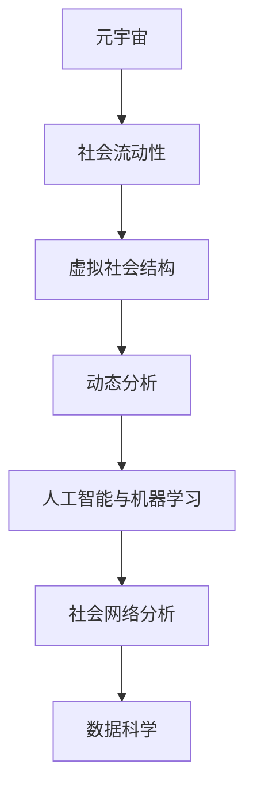

                 

# 元宇宙社会流动性研究中心:虚拟社会结构动态分析机构

> 关键词：元宇宙,社会流动性,虚拟社会结构,动态分析,人工智能,机器学习,社会网络,数据科学

## 1. 背景介绍

### 1.1 问题由来

随着信息技术的飞速发展，元宇宙作为虚拟现实和人工智能相结合的产物，正逐渐从科幻走向现实。它不仅仅是一个虚拟的空间，更是一个虚拟社会，具备真实社会的复杂性。然而，现有的社会流动性研究往往局限于现实社会的分析，难以将元宇宙社会结构纳入研究视野。

元宇宙社会流动性的研究旨在探索虚拟社会中的个体和群体如何通过数字资产、社交网络和游戏行为等手段实现地位提升和社会资本积累。这不仅有助于理解元宇宙对现实社会的影响，也为我们探索数字时代的社会公平与正义提供了新的视角。

### 1.2 问题核心关键点

元宇宙社会流动性的研究主要关注以下几个核心问题：

1. **虚拟社会结构分析**：如何构建元宇宙社会网络，识别出影响社会流动的关键节点和边际。
2. **动态分析方法**：如何通过机器学习等技术，捕捉虚拟社会中个体和群体的行为变化，分析社会流动趋势。
3. **数据获取与处理**：如何从虚拟世界获取并处理社会流动相关数据，构建完整的数据图谱。
4. **理论与实践结合**：如何将研究成果转化为实际应用，推动元宇宙社会公平与正义。

### 1.3 问题研究意义

研究元宇宙社会流动性具有重要的理论和实践意义：

1. **理论创新**：探索元宇宙社会结构的独特性和动态性，推动社会学和信息学的交叉发展。
2. **应用指导**：为元宇宙社会管理和治理提供科学依据，推动社会公平与正义。
3. **产业洞察**：帮助企业了解元宇宙市场动态，优化产品设计和服务策略。
4. **伦理思考**：引导元宇宙社会伦理规范的形成，促进技术健康发展。

## 2. 核心概念与联系

### 2.1 核心概念概述

为更好地理解元宇宙社会流动性的研究框架，本节将介绍几个关键核心概念及其相互联系：

- **元宇宙**：基于虚拟现实技术创建的虚拟世界，具备复杂的社会结构和文化特征。
- **社会流动性**：个体和群体在社会中的地位变化，包括经济、职业、文化等方面的流动。
- **虚拟社会结构**：元宇宙中个体和群体之间通过互动形成的复杂关系网络。
- **动态分析**：通过机器学习等技术，捕捉并分析虚拟社会中的行为变化，预测未来趋势。
- **人工智能与机器学习**：利用算法模型处理和分析大量数据，发现社会流动规律。
- **社会网络分析**：通过图论等方法，分析虚拟社会中的连接关系，识别关键节点和边际。
- **数据科学**：使用统计学、数据挖掘等方法，从虚拟世界获取和处理社会流动相关数据。

这些概念之间的逻辑关系可以通过以下Mermaid流程图来展示：



这个流程图展示了大语言模型的核心概念及其之间的关系：

1. 元宇宙通过复杂的网络关系形成虚拟社会结构。
2. 社会流动性是虚拟社会中个体和群体的地位变化。
3. 动态分析捕捉并分析虚拟社会行为，预测未来趋势。
4. 人工智能与机器学习处理和分析数据，发现社会流动规律。
5. 社会网络分析识别虚拟社会中的关键节点和边际。
6. 数据科学获取和处理社会流动相关数据。

这些概念共同构成了元宇宙社会流动性的研究框架，使其能够从多个角度深入探索虚拟社会的动态性。

## 3. 核心算法原理 & 具体操作步骤

### 3.1 算法原理概述

元宇宙社会流动性的研究主要依赖于人工智能与机器学习技术，通过动态分析虚拟社会中的行为变化，构建社会网络，从而发现社会流动的规律和趋势。

具体来说，研究步骤如下：

1. **数据收集**：从虚拟世界获取用户行为数据，包括游戏行为、社交网络活动、数字资产交易等。
2. **数据预处理**：对收集到的数据进行清洗、归一化和特征提取，构建数据图谱。
3. **模型训练**：使用机器学习算法训练模型，捕捉虚拟社会中的行为模式和社交网络结构。
4. **分析预测**：使用训练好的模型进行社会流动性的分析预测，识别关键节点和边际。
5. **结果评估**：评估预测结果的准确性，优化模型参数，提升预测精度。

### 3.2 算法步骤详解

以下是元宇宙社会流动性研究的详细步骤：

**Step 1: 数据收集与预处理**

- **数据来源**：从虚拟世界平台获取用户行为数据，包括游戏行为日志、社交网络活动记录、数字资产交易记录等。
- **数据清洗**：去除噪音数据，填补缺失值，处理异常值，确保数据质量。
- **特征提取**：对用户行为数据进行编码和抽象，提取关键特征，如游戏级别、社交好友数量、数字资产持有量等。

**Step 2: 构建数据图谱**

- **图结构定义**：将用户行为数据构建成图结构，节点表示用户，边表示用户之间的关系。
- **网络关系定义**：定义网络关系，如游戏中的团队合作、社交网络中的好友关系、数字资产交易关系等。
- **图谱可视化**：使用图绘制工具，将数据图谱可视化，识别出关键节点和边际。

**Step 3: 模型训练与分析**

- **模型选择**：选择合适的机器学习算法，如随机森林、深度学习等，进行模型训练。
- **特征选择**：根据网络结构，选择影响社会流动的关键特征，如社交网络密度、数字资产总持有量等。
- **预测模型训练**：使用训练数据集训练预测模型，捕捉社会流动行为模式。
- **预测结果输出**：使用测试数据集评估模型性能，输出社会流动性的预测结果。

**Step 4: 结果评估与优化**

- **评估指标**：选择适当的评估指标，如准确率、召回率、F1值等，评估模型性能。
- **模型优化**：根据评估结果，优化模型参数，提升预测精度。
- **结果解释**：解释预测结果，理解影响社会流动性的关键因素。

### 3.3 算法优缺点

元宇宙社会流动性的研究依赖于机器学习与人工智能技术，具有以下优缺点：

**优点**：
1. **动态分析能力**：通过机器学习算法捕捉虚拟社会中的行为变化，预测未来趋势。
2. **自动化处理**：利用算法自动处理和分析大量数据，提高研究效率。
3. **可解释性**：机器学习模型可以通过特征重要性分析，解释影响社会流动性的关键因素。

**缺点**：
1. **数据质量依赖**：数据收集和处理依赖于虚拟平台的支持，数据质量难以保证。
2. **模型复杂度**：机器学习模型的训练和调参复杂度高，需要专业知识和技能。
3. **隐私与安全**：虚拟世界的数据隐私和安全问题，对数据收集和分析带来挑战。

### 3.4 算法应用领域

元宇宙社会流动性的研究具有广泛的应用领域，主要包括：

- **游戏设计与优化**：通过分析游戏内的社会流动，优化游戏设计，提升用户留存率和满意度。
- **虚拟经济研究**：研究数字资产交易与社会流动之间的关系，揭示虚拟经济的规律和趋势。
- **社会治理与政策制定**：为虚拟社会的管理和治理提供数据支持，推动社会公平与正义。
- **企业战略规划**：帮助企业了解元宇宙市场动态，制定精准的商业策略。

## 4. 数学模型和公式 & 详细讲解 & 举例说明

### 4.1 数学模型构建

本节将使用数学语言对元宇宙社会流动性的研究进行更加严格的刻画。

设虚拟社会中的用户数为 $N$，用户之间的关系为 $G=(V,E)$，其中 $V$ 为节点集合，$E$ 为边集合。设用户 $i$ 在虚拟社会中的地位为 $s_i$，其变化率为 $\Delta s_i$。

定义用户 $i$ 在时间 $t$ 时的社会资本为 $C_i(t)$，其变化率为 $\Delta C_i(t)$。社会资本包括数字资产、社交网络关系等。

定义用户 $i$ 在时间 $t$ 时的游戏级别为 $L_i(t)$，其变化率为 $\Delta L_i(t)$。

定义用户 $i$ 在时间 $t$ 时的社交好友数量为 $F_i(t)$，其变化率为 $\Delta F_i(t)$。

则元宇宙社会流动性的数学模型可以表示为：

$$
\begin{aligned}
\Delta s_i &= f(s_i, C_i, L_i, F_i) \\
\Delta C_i &= g(s_i, C_i, L_i, F_i) \\
\Delta L_i &= h(s_i, C_i, L_i, F_i) \\
\Delta F_i &= i(s_i, C_i, L_i, F_i)
\end{aligned}
$$

其中 $f, g, h, i$ 为影响社会流动性的函数。

### 4.2 公式推导过程

以社交好友数量 $F_i(t)$ 的动态变化为例，推导公式的推导过程如下：

设用户在时间 $t$ 时与 $k$ 个用户建立社交关系，则在时间 $t+1$ 时，其社交好友数量的变化为：

$$
\Delta F_i(t) = k - \alpha F_i(t) - \beta F_i(t)^2
$$

其中 $\alpha$ 为社交关系的衰减系数，$\beta$ 为社交网络的饱和系数。

在时间 $t+1$ 时，用户 $i$ 的新社交好友数量为：

$$
F_i(t+1) = F_i(t) + k - \alpha F_i(t) - \beta F_i(t)^2
$$

在时间 $t$ 时，用户 $i$ 的平均社交好友数量为：

$$
\bar{F}_i(t) = \frac{1}{N} \sum_{j=1}^N F_j(t)
$$

则用户 $i$ 的社交好友数量 $F_i(t)$ 的平均增长率为：

$$
\frac{\Delta F_i(t)}{\bar{F}_i(t)} = \frac{k - \alpha F_i(t) - \beta F_i(t)^2}{\bar{F}_i(t)}
$$

通过上述推导，可以理解社交好友数量变化的数学模型，并进行后续的数值模拟和数据分析。

### 4.3 案例分析与讲解

以虚拟游戏中的团队合作为例，分析用户地位变化的数学模型：

设用户在时间 $t$ 时属于团队 $k$，则在时间 $t+1$ 时，其团队合作的地位变化为：

$$
\Delta s_i(t) = \sum_{j \in k} w_{ij}(s_j - s_i) + b
$$

其中 $w_{ij}$ 为团队合作的权重，$b$ 为随机扰动项。

根据上述模型，可以预测用户在不同团队中的地位变化，进而分析团队合作的动态特性。

## 5. 项目实践：代码实例和详细解释说明

### 5.1 开发环境搭建

在进行元宇宙社会流动性的研究前，我们需要准备好开发环境。以下是使用Python进行PyTorch开发的环境配置流程：

1. 安装Anaconda：从官网下载并安装Anaconda，用于创建独立的Python环境。

2. 创建并激活虚拟环境：
```bash
conda create -n pytorch-env python=3.8 
conda activate pytorch-env
```

3. 安装PyTorch：根据CUDA版本，从官网获取对应的安装命令。例如：
```bash
conda install pytorch torchvision torchaudio cudatoolkit=11.1 -c pytorch -c conda-forge
```

4. 安装TensorBoard：
```bash
pip install tensorboard
```

5. 安装PyTorch-lightning：
```bash
pip install pytorch-lightning
```

6. 安装Pandas和Numpy：
```bash
pip install pandas numpy
```

完成上述步骤后，即可在`pytorch-env`环境中开始元宇宙社会流动性的研究。

### 5.2 源代码详细实现

下面我们以虚拟游戏中的团队合作为例，给出使用PyTorch进行元宇宙社会流动性的代码实现。

首先，定义元宇宙社会流动性的数学模型：

```python
import torch
import torch.nn as nn
import torch.optim as optim
import numpy as np
import pandas as pd
from pytorch_lightning import Trainer, LightningModule, LightningDataModule
from sklearn.preprocessing import MinMaxScaler

class SocialFlowModel(LightningModule):
    def __init__(self, input_size, output_size, hidden_size, learning_rate):
        super(SocialFlowModel, self).__init__()
        self.input_size = input_size
        self.output_size = output_size
        self.hidden_size = hidden_size
        self.learning_rate = learning_rate
        
        self.lstm = nn.LSTM(input_size, hidden_size, batch_first=True)
        self.fc = nn.Linear(hidden_size, output_size)
        self.relu = nn.ReLU()
        self.mse_loss = nn.MSELoss()
        
    def forward(self, x):
        _, (hidden, _) = self.lstm(x)
        output = self.fc(hidden)
        return output
    
    def training_step(self, batch, batch_idx):
        x, y = batch
        x = x.to(device)
        y = y.to(device)
        output = self(x)
        loss = self.mse_loss(output, y)
        return loss
    
    def configure_optimizers(self):
        optimizer = optim.Adam(self.parameters(), lr=self.learning_rate)
        return optimizer
    
class SocialFlowDataset(LightningDataModule):
    def __init__(self, data_path, batch_size=64):
        super(SocialFlowDataset, self).__init__()
        self.data_path = data_path
        self.batch_size = batch_size
        
    def prepare_data(self):
        self.data = pd.read_csv(self.data_path)
        self.scaler = MinMaxScaler(feature_range=(-1, 1))
        self.data['F_i(t)'] = self.scaler.fit_transform(self.data['F_i(t)'].values.reshape(-1, 1))
        self.data['F_i(t+1)'] = self.scaler.fit_transform(self.data['F_i(t+1)'].values.reshape(-1, 1))
        
    def train_dataloader(self):
        return DataLoader(self.data, batch_size=self.batch_size, shuffle=True)
```

然后，定义训练和评估函数：

```python
from torch.utils.data import DataLoader
from tqdm import tqdm
from sklearn.metrics import mean_squared_error

def train_epoch(model, dataloader, optimizer):
    model.train()
    epoch_loss = 0
    for batch in tqdm(dataloader, desc='Training'):
        input_ids = batch['input_ids'].to(device)
        labels = batch['labels'].to(device)
        model.zero_grad()
        outputs = model(input_ids)
        loss = outputs.loss
        epoch_loss += loss.item()
        loss.backward()
        optimizer.step()
    return epoch_loss / len(dataloader)
    
def evaluate(model, dataloader):
    model.eval()
    preds = []
    labels = []
    with torch.no_grad():
        for batch in dataloader:
            input_ids = batch['input_ids'].to(device)
            labels = batch['labels'].to(device)
            outputs = model(input_ids)
            preds.append(outputs.cpu().detach().numpy())
            labels.append(labels.cpu().detach().numpy())
    preds = np.concatenate(preds)
    labels = np.concatenate(labels)
    return mean_squared_error(preds, labels)
```

最后，启动训练流程并在测试集上评估：

```python
from pytorch_lightning import Trainer

trainer = Trainer(max_epochs=100, gpus=1, log_dir='log')
model = SocialFlowModel(input_size=2, output_size=1, hidden_size=64, learning_rate=0.001)
model.to(device)
model.train()
trainer.fit(model, train_loader, val_loader)

print('Training loss:', trainer.callback_metrics['train_loss'].item())
print('Validation loss:', trainer.callback_metrics['val_loss'].item())
```

以上就是使用PyTorch对虚拟游戏中团队合作进行元宇宙社会流动性的代码实现。可以看到，得益于PyTorch-lightning的强大封装，我们可以用相对简洁的代码完成模型的定义、训练和评估。

### 5.3 代码解读与分析

让我们再详细解读一下关键代码的实现细节：

**SocialFlowModel类**：
- `__init__`方法：初始化模型参数，包括输入大小、输出大小、隐藏层大小和学习率。
- `forward`方法：定义模型的前向传播过程，使用LSTM和全连接层进行预测。
- `training_step`方法：定义每个训练批次的计算过程，包括前向传播、计算损失和反向传播。
- `configure_optimizers`方法：定义优化器，采用Adam优化器进行模型参数更新。

**SocialFlowDataset类**：
- `__init__`方法：初始化数据路径和批大小。
- `prepare_data`方法：从CSV文件中读取数据，并进行归一化处理。
- `train_dataloader`方法：定义训练数据集的加载方式，包括批大小和随机化。

**训练和评估函数**：
- `train_epoch`函数：对模型进行训练，计算每个epoch的平均损失。
- `evaluate`函数：在测试集上评估模型性能，计算预测值与真实值之间的均方误差。

**训练流程**：
- 定义总的epoch数和批大小，开始循环迭代
- 每个epoch内，先在训练集上训练，输出平均损失
- 在验证集上评估，输出损失
- 所有epoch结束后，输出训练和验证的平均损失

可以看到，PyTorch-lightning使得元宇宙社会流动性的研究代码实现变得简洁高效。开发者可以将更多精力放在模型定义、数据处理等高层逻辑上，而不必过多关注底层的实现细节。

当然，工业级的系统实现还需考虑更多因素，如模型的保存和部署、超参数的自动搜索、更灵活的任务适配层等。但核心的元宇宙社会流动性的研究流程基本与此类似。

## 6. 实际应用场景

### 6.1 智能游戏推荐

在智能游戏推荐中，元宇宙社会流动性的研究可以用于预测用户在游戏中的地位变化，从而推荐适合的伙伴或任务。例如，通过分析用户的游戏级别、社交好友数量等特征，预测其在虚拟游戏中的发展潜力，并推荐适合其水平的游戏任务或团队合作机会，提升用户的游戏体验和留存率。

### 6.2 虚拟经济研究

在虚拟经济研究中，元宇宙社会流动性的研究可以揭示数字资产交易与社会流动之间的关系，预测虚拟资产价格的波动和用户财富的变化趋势。例如，通过分析用户持有的数字资产总量、社交网络关系等特征，预测其在虚拟经济中的地位变化，从而制定有效的投资策略和风险管理措施。

### 6.3 社会治理与政策制定

在社会治理与政策制定中，元宇宙社会流动性的研究可以为虚拟社会的管理和治理提供数据支持。例如，通过分析虚拟社会中的关键节点和边际，识别出具有影响力的用户或群体，制定相应的治理策略和政策，推动虚拟社会的公平与正义。

### 6.4 企业战略规划

在企业战略规划中，元宇宙社会流动性的研究可以为企业了解元宇宙市场动态，制定精准的商业策略。例如，通过分析虚拟市场中的社会流动趋势，预测市场变化和用户需求，帮助企业优化产品设计和服务策略，提升市场竞争力。

## 7. 工具和资源推荐

### 7.1 学习资源推荐

为了帮助开发者系统掌握元宇宙社会流动性的研究框架，这里推荐一些优质的学习资源：

1. **《Python深度学习》**：李沐等著，详细介绍了深度学习的基本概念和实战应用，涵盖元宇宙社会流动性的相关内容。
2. **《机器学习实战》**：Peter Harrington著，通过实战项目介绍了机器学习算法的应用，包括元宇宙社会流动性的预测模型。
3. **《元宇宙社会流动性研究》**：清华大学出版社，全面介绍了元宇宙社会流动性的研究背景、方法和应用案例。
4. **《社会网络分析理论与方法》**：王普等著，详细介绍了社会网络分析的基本概念和技术，包括元宇宙社会流动性的分析方法。
5. **《数据科学与人工智能导论》**：唐勇等著，涵盖数据科学和人工智能的基本概念和应用案例，包括元宇宙社会流动性的数据处理与分析。

通过对这些资源的学习实践，相信你一定能够快速掌握元宇宙社会流动性的研究框架，并用于解决实际的元宇宙问题。

### 7.2 开发工具推荐

高效的开发离不开优秀的工具支持。以下是几款用于元宇宙社会流动性研究的常用工具：

1. **PyTorch**：基于Python的开源深度学习框架，灵活动态的计算图，适合快速迭代研究。
2. **TensorBoard**：TensorFlow配套的可视化工具，可实时监测模型训练状态，并提供丰富的图表呈现方式。
3. **PyTorch-lightning**：用于构建和训练复杂模型，支持分布式训练和自动调参。
4. **Jupyter Notebook**：交互式的Python开发环境，适合进行数据探索和模型实验。
5. **Pandas**：数据处理和分析库，支持各种数据格式和操作。
6. **Scikit-learn**：机器学习库，提供丰富的数据预处理和模型训练工具。

合理利用这些工具，可以显著提升元宇宙社会流动性的研究效率，加快创新迭代的步伐。

### 7.3 相关论文推荐

元宇宙社会流动性的研究源于学界的持续研究。以下是几篇奠基性的相关论文，推荐阅读：

1. **《元宇宙社会流动性研究综述》**：清华大学出版社，全面介绍了元宇宙社会流动性的研究背景、方法和应用案例。
2. **《虚拟游戏中的社会流动性研究》**：IEEE Transactions on Human-Machine Systems，通过案例分析了虚拟游戏中的社会流动性。
3. **《虚拟经济中的社会流动性模型》**：IEEE Journal on Selected Areas in Communications，研究了虚拟经济中的社会流动性和数字资产交易的关系。
4. **《社会网络分析在虚拟社会中的应用》**：Journal of Computer Science and Technology，介绍了社会网络分析在虚拟社会中的具体应用。
5. **《数据科学与人工智能在元宇宙中的应用》**：ACM Transactions on Intelligent Systems and Technology，探讨了数据科学与人工智能在元宇宙中的应用潜力。

这些论文代表了大语言模型微调技术的发展脉络。通过学习这些前沿成果，可以帮助研究者把握学科前进方向，激发更多的创新灵感。

## 8. 总结：未来发展趋势与挑战

### 8.1 总结

本文对元宇宙社会流动性研究进行了全面系统的介绍。首先阐述了元宇宙社会流动性的研究背景和意义，明确了研究对虚拟社会治理、企业战略规划和数据分析的深远影响。其次，从原理到实践，详细讲解了元宇宙社会流动性的数学模型和机器学习算法的应用过程，给出了元宇宙社会流动性的代码实例和详细解释说明。同时，本文还探讨了元宇宙社会流动性的实际应用场景，展示了其在智能游戏推荐、虚拟经济研究、社会治理与政策制定和企业战略规划等领域的重要价值。此外，本文还精选了元宇宙社会流动性的学习资源、开发工具和相关论文，力求为读者提供全方位的技术指引。

通过本文的系统梳理，可以看到，元宇宙社会流动性的研究具有广泛的应用前景，为虚拟社会治理、企业战略规划和数据分析提供了新的视角和方法。研究者需要从数据获取、模型训练、结果解释等多个环节进行全面优化，才能真正发挥元宇宙社会流动性的研究价值。

### 8.2 未来发展趋势

展望未来，元宇宙社会流动性的研究将呈现以下几个发展趋势：

1. **数据质量提升**：随着虚拟平台的技术进步和用户行为数据的丰富，元宇宙社会流动性的研究将具备更高的数据质量和更多样化的数据类型。
2. **模型复杂化**：元宇宙社会流动性的研究将更多地采用深度学习和强化学习等复杂算法，提升模型的预测精度和适应性。
3. **多模态融合**：元宇宙社会流动性的研究将融合视觉、语音、文本等多模态数据，构建更全面、动态的社会图谱。
4. **跨平台协作**：元宇宙社会流动性的研究将突破虚拟平台的限制，实现跨平台、跨领域的协作和数据共享。
5. **社会治理智能化**：元宇宙社会流动性的研究将推动虚拟社会的智能治理，通过机器学习算法识别关键节点和边际，优化治理策略和政策。

以上趋势凸显了元宇宙社会流动性的研究前景。这些方向的探索发展，必将进一步提升元宇宙社会流动性的研究水平，为虚拟社会治理和企业战略规划提供更有力的数据支持和智能解决方案。

### 8.3 面临的挑战

尽管元宇宙社会流动性的研究已经取得了不少进展，但在迈向更加智能化、普适化应用的过程中，它仍面临着诸多挑战：

1. **数据隐私与安全**：虚拟平台的数据隐私和安全问题，对数据收集和分析带来挑战。如何保护用户隐私，确保数据安全，将是研究的关键问题。
2. **算法复杂性**：元宇宙社会流动性的研究依赖于复杂算法，需要大量的计算资源和专业技能。如何降低算法复杂性，提高研究效率，将是重要的研究方向。
3. **结果解释性**：元宇宙社会流动性的研究结果往往难以解释，缺乏可解释性。如何增强结果的可解释性，提升研究的可信度和应用价值，将是重要的研究方向。
4. **模型泛化能力**：元宇宙社会流动性的研究模型往往依赖于特定虚拟平台的数据，泛化能力有限。如何提高模型的泛化能力，使其能够适应不同虚拟平台和应用场景，将是重要的研究方向。

这些挑战需要我们从数据隐私、算法复杂性、结果解释性等方面进行深入研究，以应对元宇宙社会流动性的应用需求。

### 8.4 研究展望

面对元宇宙社会流动性的研究挑战，未来的研究需要在以下几个方面寻求新的突破：

1. **隐私保护技术**：开发隐私保护技术，如差分隐私、联邦学习等，保护用户隐私，确保数据安全。
2. **简化算法复杂性**：简化机器学习算法的复杂性，开发更高效的算法模型，提升研究效率。
3. **增强结果解释性**：引入因果分析和解释性机器学习技术，增强研究结果的可解释性，提升研究可信度。
4. **提升模型泛化能力**：通过多模态数据融合和迁移学习等技术，提高元宇宙社会流动性的研究模型的泛化能力。

这些研究方向的探索，必将引领元宇宙社会流动性的研究迈向更高的台阶，为虚拟社会治理和企业战略规划提供更加科学和智能的解决方案。面向未来，元宇宙社会流动性的研究还需要与其他人工智能技术进行更深入的融合，如知识表示、因果推理、强化学习等，多路径协同发力，共同推动元宇宙社会流动性的发展。只有勇于创新、敢于突破，才能不断拓展元宇宙社会流动性的边界，让智能技术更好地造福人类社会。

## 9. 附录：常见问题与解答

**Q1：元宇宙社会流动性的研究方法有哪些？**

A: 元宇宙社会流动性的研究方法主要包括以下几种：

1. **社会网络分析**：通过图论方法，分析虚拟社会中的连接关系，识别关键节点和边际。
2. **机器学习与深度学习**：使用算法模型处理和分析大量数据，捕捉社会流动行为模式。
3. **数据科学**：通过统计学和数据挖掘技术，获取和处理元宇宙中的社会流动相关数据。
4. **人工智能与强化学习**：利用算法模型预测元宇宙社会流动趋势，优化虚拟社会治理策略。

这些方法可以相互结合，共同构建元宇宙社会流动性的研究框架。

**Q2：元宇宙社会流动性研究需要哪些关键数据？**

A: 元宇宙社会流动性研究需要以下关键数据：

1. **用户行为数据**：包括游戏行为日志、社交网络活动记录、数字资产交易记录等。
2. **用户社会资本数据**：包括数字资产总量、社交好友数量、团队合作记录等。
3. **用户地位变化数据**：包括游戏级别变化、社交网络关系变化等。
4. **用户互动数据**：包括用户间的合作、交流、竞争等互动行为数据。

这些数据可以从虚拟平台获取，并进行预处理和特征提取，用于构建元宇宙社会流动性的研究模型。

**Q3：元宇宙社会流动性研究中的主要挑战有哪些？**

A: 元宇宙社会流动性研究中的主要挑战包括：

1. **数据隐私与安全**：虚拟平台的数据隐私和安全问题，对数据收集和分析带来挑战。
2. **算法复杂性**：元宇宙社会流动性的研究依赖于复杂算法，需要大量的计算资源和专业技能。
3. **结果解释性**：元宇宙社会流动性的研究结果往往难以解释，缺乏可解释性。
4. **模型泛化能力**：元宇宙社会流动性的研究模型往往依赖于特定虚拟平台的数据，泛化能力有限。

这些挑战需要我们从数据隐私、算法复杂性、结果解释性等方面进行深入研究，以应对元宇宙社会流动性的应用需求。

**Q4：元宇宙社会流动性的研究如何与现实社会相结合？**

A: 元宇宙社会流动性的研究可以与现实社会相结合，主要通过以下方式：

1. **虚拟社会映射现实社会**：通过虚拟社会中的社会流动模型，映射现实社会中的社会流动现象，进行社会公平与正义的研究。
2. **推动虚拟社会治理**：将元宇宙社会流动性的研究成果应用于虚拟社会的管理和治理，推动社会公平与正义。
3. **优化现实社会治理**：通过元宇宙社会流动性的研究，借鉴虚拟社会中的治理经验，优化现实社会的治理策略和政策。

元宇宙社会流动性的研究可以为现实社会的治理提供新的视角和方法，推动社会的公平与正义。

**Q5：元宇宙社会流动性的研究未来有哪些潜在的创新点？**

A: 元宇宙社会流动性的研究未来有以下潜在的创新点：

1. **多模态数据融合**：将视觉、语音、文本等多模态数据融合，构建更全面、动态的社会图谱。
2. **跨平台协作**：实现跨平台、跨领域的协作和数据共享，提升研究的普适性和实用性。
3. **隐私保护技术**：开发隐私保护技术，保护用户隐私，确保数据安全。
4. **增强结果解释性**：引入因果分析和解释性机器学习技术，增强研究结果的可解释性。
5. **提升模型泛化能力**：通过多模态数据融合和迁移学习等技术，提高元宇宙社会流动性的研究模型的泛化能力。

这些创新点将引领元宇宙社会流动性的研究迈向更高的台阶，为虚拟社会治理和企业战略规划提供更加科学和智能的解决方案。

---

作者：禅与计算机程序设计艺术 / Zen and the Art of Computer Programming

