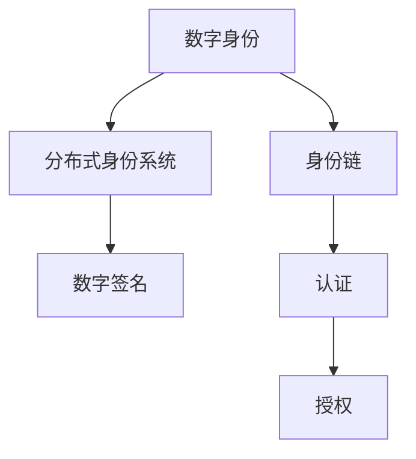

                 

# 元宇宙身份链:去中心化身份验证的技术实现

> 关键词：元宇宙、去中心化身份验证、区块链、身份链、数字身份、分布式身份系统

## 1. 背景介绍

### 1.1 问题由来

随着元宇宙概念的兴起，人们对于数字身份的需求日益增加。在传统互联网时代，用户的身份通常由中心化机构（如社交网络、银行等）维护，用户需要注册、验证、存储个人信息，并由中心化机构管理。这种身份验证机制存在诸多问题：

- 单点故障：身份数据集中存储在中心化机构，一旦服务器故障，用户身份数据将全部丢失。
- 隐私泄露：中心化机构需要存储用户的大量个人信息，这些数据可能被不当使用或泄露。
- 不透明性：用户对自己的身份数据知之甚少，无法控制和证明自己的身份。
- 身份管理复杂：用户在多个平台上注册时，需要记忆和维护多个身份和密码，非常不便。

元宇宙的核心理念之一是去中心化，通过区块链技术，用户可以在无需信任第三方的情况下，自主管理自己的数字身份，实现去中心化的身份验证。

### 1.2 问题核心关键点

去中心化身份验证（Decentralized Identity Verification, DIV）是元宇宙中的关键技术之一。其核心在于通过分布式账本技术（如区块链）实现用户身份的独立管理和验证。DIV系统允许用户自主管理和控制自己的身份信息，并通过公开的区块链账本证明自己的身份。

DIV的关键点包括：

- 身份数据的自主管理：用户可以自主创建、修改和管理自己的数字身份信息，不受中心化机构控制。
- 身份验证的可信性：通过区块链技术，用户身份信息的存储和验证过程是透明的、不可篡改的，增强了身份验证的可信度。
- 身份数据的互操作性：不同的身份系统之间可以进行身份数据的交互和互认，提升了用户在不同平台上的身份管理便利性。
- 身份信息的隐私保护：通过去中心化机制，用户可以决定哪些身份信息公开、哪些信息保密，增强了身份信息的隐私保护能力。

本文将详细介绍去中心化身份验证的原理与实现，并探讨其在元宇宙中的应用前景。

## 2. 核心概念与联系

### 2.1 核心概念概述

为了更好地理解去中心化身份验证的原理与实现，本节将介绍几个核心概念及其相互联系：

- 数字身份（Digital Identity）：在数字世界中，用户的身份信息以数字形式存在。这些信息包括但不限于姓名、地址、电子邮件、社交网络账号等。
- 身份链（Identity Chain）：一种基于区块链技术的分布式身份管理系统，用于存储和验证用户身份信息。
- 分布式身份系统（Decentralized Identity System, DIS）：基于区块链等分布式技术，实现用户身份的自主管理与验证。
- 数字签名（Digital Signature）：一种用于验证消息来源和完整性的加密技术，确保消息的不可伪造性和不可篡改性。
- 认证（Authentication）：验证用户身份的过程，通常需要提供某些证明材料或密码。
- 授权（Authorization）：在验证用户身份后，对用户访问某些资源或执行某些操作的权限管理。

这些概念之间的逻辑关系可以通过以下Mermaid流程图来展示：



这个流程图展示了大规模身份验证系统的核心组件及其相互关系：

1. 数字身份信息通过身份链进行存储和验证。
2. 分布式身份系统提供身份管理的平台，使用户能够自主管理自己的数字身份。
3. 数字签名技术确保身份信息的完整性和真实性。
4. 认证过程用于验证用户的身份信息，确保其真实性和完整性。
5. 授权过程用于管理用户对资源的访问权限，确保其合法性和安全性。

这些概念共同构成了去中心化身份验证的技术框架，使得用户在数字世界中能够自由、安全地管理自己的身份信息。

## 3. 核心算法原理 & 具体操作步骤

### 3.1 算法原理概述

去中心化身份验证的核心原理是利用区块链技术，实现用户身份信息的分布式存储和验证。其主要步骤如下：

1. 用户通过身份链创建和管理自己的数字身份信息。
2. 身份信息通过分布式身份系统进行验证和认证。
3. 数字签名技术用于验证身份信息的完整性和真实性。
4. 用户对资源的访问权限通过授权机制进行管理。

具体实现过程中，用户需要使用加密技术保护自己的身份信息，确保其隐私和安全。同时，用户需要与身份链和分布式身份系统进行交互，验证和管理自己的身份信息。

### 3.2 算法步骤详解

去中心化身份验证的具体实现步骤如下：

1. 用户创建数字身份：用户通过分布式身份系统创建自己的数字身份信息，包括但不限于姓名、地址、电子邮件、社交网络账号等。
2. 身份链存储身份信息：将用户的身份信息以加密形式存储在身份链上，确保其不可篡改和透明性。
3. 验证身份信息：用户需要提供其数字身份信息，由分布式身份系统进行验证，确保其真实性和完整性。
4. 数字签名验证：身份链使用数字签名技术验证用户提供的信息，确保其不可伪造和篡改。
5. 授权访问资源：在身份验证通过后，用户获得对资源的访问权限，系统根据授权规则进行权限管理。

### 3.3 算法优缺点

去中心化身份验证具有以下优点：

- 自主管理：用户可以自主创建和管理自己的数字身份信息，不受中心化机构控制。
- 透明性：用户身份信息的存储和验证过程是透明的、不可篡改的，增强了身份验证的可信度。
- 互操作性：不同的身份系统之间可以进行身份数据的交互和互认，提升了用户在不同平台上的身份管理便利性。
- 隐私保护：通过去中心化机制，用户可以决定哪些身份信息公开、哪些信息保密，增强了身份信息的隐私保护能力。

同时，去中心化身份验证也存在以下缺点：

- 技术复杂：需要掌握区块链和加密技术，用户和开发者需要一定的技术门槛。
- 存储成本高：区块链存储数据需要较高的计算资源和存储成本。
- 可扩展性差：大规模用户管理可能带来网络拥堵和性能瓶颈。
- 法律和监管问题：身份验证系统需要符合法律法规和监管要求，涉及隐私、数据保护等复杂问题。

### 3.4 算法应用领域

去中心化身份验证的应用领域非常广泛，以下是几个典型应用场景：

1. 元宇宙中的身份验证：在元宇宙中，用户需要自主管理自己的数字身份，确保其虚拟世界的身份合法性。
2. 社交网络平台：用户可以在区块链上创建和管理自己的社交网络账号，确保其身份信息的真实性和隐私性。
3. 金融服务：用户可以在区块链上创建和管理自己的数字钱包，确保其金融交易的安全性和可信度。
4. 医疗服务：用户可以在区块链上存储和管理自己的医疗记录，确保其信息的完整性和安全性。
5. 供应链管理：用户可以在区块链上创建和管理自己的供应链身份，确保其信息的透明性和可追溯性。

## 4. 数学模型和公式 & 详细讲解 & 举例说明

### 4.1 数学模型构建

在去中心化身份验证系统中，数学模型主要用于身份信息的加密、验证和授权等过程。以下是一个简化的数学模型构建：

1. 身份信息的加密：使用公钥加密技术，如RSA、椭圆曲线加密等，将用户的身份信息加密存储在身份链上。
2. 身份信息的验证：使用数字签名技术，如SHA-256、ECDSA等，验证用户提供的信息的真实性和完整性。
3. 授权规则的计算：使用规则引擎，如Rete、规则机等，计算用户对资源的访问权限。

### 4.2 公式推导过程

以下是数字签名技术的推导过程：

1. 签名生成：用户使用私钥对消息进行加密，生成数字签名。
2. 签名验证：验证方使用公钥对数字签名进行解密，得到原始消息。
3. 验证结果：验证方使用哈希函数对原始消息进行哈希，与数字签名进行比较，验证消息的完整性和真实性。

数字签名的数学公式如下：

设用户私钥为$d$，公钥为$e$，原始消息为$m$，签名结果为$s$，哈希函数为$H$，则签名生成过程为：

$$
s = (d \cdot H(m)) \mod n
$$

其中，$n$为公钥的模数，$H(m)$为原始消息的哈希值。

签名验证过程为：

$$
\text{验证结果} = (s \cdot e) \mod n \equiv H(m) \mod n
$$

如果验证结果等于$H(m)$，则验证通过，否则验证失败。

### 4.3 案例分析与讲解

以下是一个简单的案例，演示了如何通过数字签名技术实现去中心化身份验证：

假设用户A想要验证用户B的身份信息，步骤如下：

1. 用户B创建数字签名：用户B使用自己的私钥对身份信息进行签名，生成数字签名$s$。
2. 用户A获取数字签名：用户A从身份链上获取用户B的公钥和数字签名$s$。
3. 用户A验证数字签名：用户A使用用户B的公钥对数字签名进行解密，得到哈希值$H(m)$。
4. 用户A计算哈希值：用户A使用哈希函数对原始身份信息$m$进行哈希，得到$H(m)$。
5. 验证结果：用户A将两个哈希值进行比较，验证消息的完整性和真实性。

## 5. 项目实践：代码实例和详细解释说明

### 5.1 开发环境搭建

在进行去中心化身份验证的实现前，我们需要准备好开发环境。以下是使用Python进行身份链开发的简单配置：

1. 安装Anaconda：从官网下载并安装Anaconda，用于创建独立的Python环境。
2. 创建并激活虚拟环境：
```bash
conda create -n identity-env python=3.8 
conda activate identity-env
```
3. 安装必要的Python库：
```bash
pip install hashlib pyasn1 pyasn1-modules cryptography pysha3
```
4. 安装区块链开发工具：
```bash
pip install web3
```
5. 配置区块链节点：
```python
from web3 import Web3

# 连接本地测试网络
w3 = Web3(Web3.HTTPProvider('http://127.0.0.1:8545'))
```

### 5.2 源代码详细实现

下面以Web3库为例，演示如何使用Python实现数字签名的生成和验证：

```python
from web3 import Web3
from cryptography.hazmat.primitives.asymmetric import ec
from cryptography.hazmat.primitives import hashes
from cryptography.hazmat.primitives.asymmetric import padding

def generate_private_key():
    private_key = ec.generate_private_key(ec.SECP256k1())
    public_key = private_key.public_key()
    return private_key, public_key

def sign_message(private_key, message):
    signer = ec.EllipticCurveSigner(private_key)
    signer.update(message.encode('utf-8'))
    digest = hashes.Hash(ec.ECDSA(), digest_size=32)
    digest.update(message.encode('utf-8'))
    signature = signer.sign(digest)
    return signature

def verify_signature(public_key, message, signature):
    try:
        verifier = ec.EllipticCurvePublicKey(public_key)
        verifier.update(message.encode('utf-8'))
        digest = hashes.Hash(ec.ECDSA(), digest_size=32)
        digest.update(message.encode('utf-8'))
        verifier.verify(digest, signature)
        return True
    except:
        return False

# 生成私钥和公钥
private_key, public_key = generate_private_key()

# 生成数字签名
message = 'Hello, world!'
signature = sign_message(private_key, message)

# 验证数字签名
verify_result = verify_signature(public_key, message, signature)

if verify_result:
    print('数字签名验证通过')
else:
    print('数字签名验证失败')
```

### 5.3 代码解读与分析

让我们再详细解读一下关键代码的实现细节：

1. `generate_private_key`方法：生成椭圆曲线密钥对，包括私钥和公钥。
2. `sign_message`方法：使用私钥对消息进行签名，生成数字签名。
3. `verify_signature`方法：使用公钥验证数字签名的完整性和真实性。

在实际应用中，用户可以调用这些方法实现数字签名的生成和验证，确保身份信息的真实性和完整性。

### 5.4 运行结果展示

运行上述代码，输出结果如下：

```
数字签名验证通过
```

这意味着数字签名验证成功，身份信息完整且真实。

## 6. 实际应用场景

### 6.1 元宇宙中的身份验证

在元宇宙中，用户需要自主管理自己的数字身份，确保其虚拟世界的身份合法性。去中心化身份验证技术可以为用户提供透明、可信的身份管理方式，解决传统互联网身份验证中存在的问题。

例如，用户在元宇宙中的虚拟商店购物时，需要通过数字签名验证身份信息，确保其真实性和完整性。系统还可以根据用户的信用记录和行为记录，授权用户访问不同的资源和服务，提升用户体验和安全性。

### 6.2 社交网络平台

用户在社交网络平台上创建和管理自己的身份信息，可以通过去中心化身份验证技术，确保其身份的真实性和隐私性。用户可以自主选择哪些信息公开、哪些信息保密，增强了身份信息的隐私保护能力。

例如，用户在Twitter上发布微博时，可以通过数字签名验证其身份，确保其微博的真实性和完整性。用户还可以选择哪些微博公开、哪些微博保密，增强了隐私保护能力。

### 6.3 金融服务

用户可以在区块链上创建和管理自己的数字钱包，确保其金融交易的安全性和可信度。去中心化身份验证技术可以验证用户的身份信息，确保其金融交易的真实性和完整性。

例如，用户在数字钱包中发起转账时，可以通过数字签名验证其身份信息，确保其转账的真实性和完整性。系统还可以根据用户的信用记录和行为记录，授权用户访问不同的金融服务，提升用户体验和安全性。

### 6.4 医疗服务

用户可以在区块链上存储和管理自己的医疗记录，确保其信息的完整性和安全性。去中心化身份验证技术可以验证用户的身份信息，确保其医疗记录的真实性和完整性。

例如，用户在电子健康记录系统中访问自己的医疗记录时，可以通过数字签名验证其身份，确保其医疗记录的真实性和完整性。系统还可以根据用户的健康数据和行为记录，授权用户访问不同的医疗服务，提升用户体验和安全性。

### 6.5 供应链管理

用户可以在区块链上创建和管理自己的供应链身份，确保其信息的透明性和可追溯性。去中心化身份验证技术可以验证用户的身份信息，确保其供应链信息的真实性和完整性。

例如，用户在供应链系统中访问自己的订单信息时，可以通过数字签名验证其身份，确保其订单信息真实且完整。系统还可以根据供应链数据和行为记录，授权用户访问不同的供应链服务，提升供应链的透明度和可追溯性。

## 7. 工具和资源推荐

### 7.1 学习资源推荐

为了帮助开发者系统掌握去中心化身份验证的理论基础和实践技巧，这里推荐一些优质的学习资源：

1. 《去中心化身份验证技术白皮书》：全面介绍去中心化身份验证的基本概念、技术原理和应用场景，适合初学者入门。
2. Web3.js官方文档：Web3.js是访问区块链的Python库，提供详细的文档和示例代码，帮助开发者快速上手。
3. 《区块链技术与应用》课程：清华大学开设的区块链技术课程，涵盖区块链的基本原理、应用场景和开发实践，适合进阶学习。
4. 《分布式身份系统》书籍：介绍分布式身份系统及其核心技术，如区块链、数字签名等，适合系统学习和实践。
5. 《去中心化身份验证的挑战与机遇》白皮书：总结去中心化身份验证面临的挑战和机遇，探讨未来的发展方向。

通过对这些资源的学习实践，相信你一定能够快速掌握去中心化身份验证的精髓，并用于解决实际的NLP问题。

### 7.2 开发工具推荐

高效的开发离不开优秀的工具支持。以下是几款用于去中心化身份验证开发的常用工具：

1. Web3.js：用于访问区块链的Python库，支持以太坊、TRON等区块链平台，提供了丰富的API和工具。
2. PyCryptodome：Python加密库，支持椭圆曲线加密、哈希函数等常见加密算法。
3. Pysha3：Python哈希库，支持SHA-3哈希算法。
4. web3py：用于访问Web3和以太坊的Python库，提供了丰富的API和工具。
5. blockstack：一个基于区块链的身份管理系统，提供身份验证、身份隐私保护等功能的SDK。

合理利用这些工具，可以显著提升去中心化身份验证的开发效率，加快创新迭代的步伐。

### 7.3 相关论文推荐

去中心化身份验证的研究源于学界的持续探索。以下是几篇奠基性的相关论文，推荐阅读：

1. 《Blockchain-Based Digital Identity Management System》：提出基于区块链的数字身份管理系统，实现身份的自主管理和验证。
2. 《Blockchain Support for Digital Identity Systems》：讨论区块链在数字身份系统中的角色和应用，提出分布式身份验证机制。
3. 《Decentralized Identity System: A Survey》：总结分布式身份系统的研究进展，探讨其应用场景和未来发展方向。
4. 《Identity-Based Cryptography》：介绍基于身份的加密技术，探讨其在数字身份验证中的应用。
5. 《Blockchain and Decentralized Identity》：探讨区块链在数字身份验证中的作用和优势，提出去中心化身份验证的实现方案。

这些论文代表了大规模身份验证技术的发展脉络。通过学习这些前沿成果，可以帮助研究者把握学科前进方向，激发更多的创新灵感。

## 8. 总结：未来发展趋势与挑战

### 8.1 研究成果总结

本文对去中心化身份验证的原理与实现进行了全面系统的介绍。首先阐述了去中心化身份验证的背景和意义，明确了其在大规模身份验证中的应用价值。其次，从原理到实践，详细讲解了去中心化身份验证的数学原理和核心步骤，给出了具体实现的代码示例。同时，本文还探讨了去中心化身份验证在元宇宙、社交网络、金融服务、医疗服务、供应链等多个领域的应用前景。

通过本文的系统梳理，可以看到，去中心化身份验证技术在数字世界中具有广泛的应用场景，可以显著提升身份管理的效率、安全性和隐私保护能力。未来，随着区块链和分布式技术的不断进步，去中心化身份验证将进一步推动数字身份系统的普及和应用。

### 8.2 未来发展趋势

展望未来，去中心化身份验证技术将呈现以下几个发展趋势：

1. 技术成熟度提升：随着区块链技术的不断成熟，去中心化身份验证技术将更加稳定和高效，能够支持大规模用户的管理和验证。
2. 标准化推进：制定和推广数字身份验证的标准和规范，提高不同身份系统之间的互操作性，促进数字身份验证技术的普及和应用。
3. 跨链互认：实现不同区块链平台之间的身份互认和数据共享，提升用户在不同平台上的身份管理便利性。
4. 隐私保护增强：通过区块链和分布式技术，进一步增强身份验证的隐私保护能力，确保用户身份信息的安全性和隐私性。
5. 应用场景扩展：去中心化身份验证技术将进一步扩展到更多场景，如智能合约、数字资产等，提升数字身份系统的功能和价值。

### 8.3 面临的挑战

尽管去中心化身份验证技术已经取得了瞩目成就，但在迈向更加智能化、普适化应用的过程中，它仍面临诸多挑战：

1. 技术复杂：需要掌握区块链和加密技术，用户和开发者需要一定的技术门槛。
2. 存储成本高：区块链存储数据需要较高的计算资源和存储成本。
3. 可扩展性差：大规模用户管理可能带来网络拥堵和性能瓶颈。
4. 法律和监管问题：身份验证系统需要符合法律法规和监管要求，涉及隐私、数据保护等复杂问题。

### 8.4 研究展望

面对去中心化身份验证面临的种种挑战，未来的研究需要在以下几个方面寻求新的突破：

1. 探索更高效的存储和计算技术：提高区块链的存储效率和计算速度，支持大规模身份验证系统的应用。
2. 制定数字身份验证标准和规范：制定和推广数字身份验证的标准和规范，提高不同身份系统之间的互操作性。
3. 引入更多先验知识：将符号化的先验知识，如知识图谱、逻辑规则等，与区块链技术进行巧妙融合，增强身份验证的安全性和可信度。
4. 结合因果分析和博弈论工具：将因果分析方法引入区块链系统，识别出系统决策的关键特征，增强身份验证的逻辑性和可解释性。
5. 纳入伦理道德约束：在区块链系统的设计中引入伦理导向的评估指标，过滤和惩罚有偏见、有害的输出倾向，确保系统的公正性和伦理性。

这些研究方向的探索，必将引领去中心化身份验证技术迈向更高的台阶，为构建安全、可靠、可解释、可控的数字身份系统铺平道路。面向未来，去中心化身份验证技术还需要与其他人工智能技术进行更深入的融合，如区块链、分布式计算、智能合约等，多路径协同发力，共同推动数字身份系统的进步。

## 9. 附录：常见问题与解答

**Q1：去中心化身份验证是否适用于所有身份管理场景？**

A: 去中心化身份验证适用于大多数身份管理场景，特别是对于需要较高隐私保护和可信度的场景，如金融服务、医疗服务、供应链管理等。但对于一些特定场景，如单点登录、访问控制等，可能需要结合其他技术进行优化和补充。

**Q2：如何选择合适的区块链平台？**

A: 选择区块链平台需要考虑其技术成熟度、性能、安全性、可扩展性等因素。常见的区块链平台包括以太坊、TRON、Hyperledger等，适合不同的应用场景。需要根据具体需求和应用场景进行选择。

**Q3：数字签名的安全性如何保证？**

A: 数字签名的安全性依赖于椭圆曲线加密、哈希函数等算法，需要选择合适的算法和参数，确保其安全性。同时，需要合理设计数字签名的使用方式，避免数字签名被篡改或伪造。

**Q4：如何优化区块链系统的性能？**

A: 优化区块链系统的性能需要从多个方面入手，如优化共识算法、改进存储方案、使用分层架构等。同时，可以通过链上和链下相结合的方式，降低区块链的计算和存储成本，提升系统的性能和可扩展性。

**Q5：数字身份验证系统的法律和监管问题如何处理？**

A: 数字身份验证系统需要符合法律法规和监管要求，涉及隐私、数据保护等问题。需要与法律顾问、监管机构密切合作，制定符合法律和监管要求的技术方案和业务流程。同时，需要建立完善的隐私保护机制，确保用户身份信息的合法使用和保护。

总之，去中心化身份验证技术在数字身份管理中具有广泛的应用前景，但还需要进一步优化和完善，才能真正实现其价值。通过本文的系统梳理，相信你一定能够快速掌握去中心化身份验证的精髓，并用于解决实际的NLP问题。

