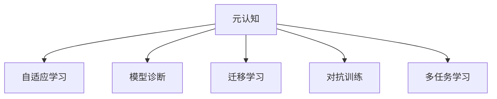

                 

## 1. 背景介绍

在当今这个信息爆炸、知识更新速度飞快的时代，认知心理学成为人们关注的焦点。元认知（Metacognition），作为认知心理学的一个分支，指的是个体对自己的认知过程的认知，包括对自身思维过程的监控和调节。这一概念最早由美国心理学家约翰·弗拉维尔（John Flavell）在20世纪70年代提出，并逐渐成为心理学、教育学、人工智能等领域的核心议题。

### 1.1 问题由来

随着技术的发展，人工智能已经进入了一个新的阶段，从传统的基于规则的系统到今天的数据驱动、深度学习的黑盒模型。然而，尽管模型的表现不断提升，人们在应用中仍然面临一些难题：

- **模型的不可解释性**：许多深度学习模型，尤其是神经网络模型，通常被视为"黑盒"系统，其内部工作机制难以解释。
- **数据依赖**：模型需要大量的标注数据进行训练，但获取高质量标注数据的成本较高，且往往需要专业领域知识。
- **过拟合风险**：模型在训练数据上过拟合，导致在新数据上泛化能力不足。

这些问题的存在表明，尽管模型在数据驱动下取得了显著的进步，但人类对认知过程的理解仍远远落后于技术进步的步伐。元认知，作为一种对认知过程的自我认知和调节，不仅可以为人类提供更好的自我认知，也为我们设计更为智能、可靠、可解释的人工智能系统提供思路。

### 1.2 问题核心关键点

元认知的核心在于通过认知过程的自我认知，优化认知能力，提高决策效率和准确性。主要包括以下几个关键点：

- **自我监控**：个体对自己的认知活动进行监控，如识别认知资源的消耗、评估任务的难度、预测执行结果等。
- **自我调节**：个体根据监控结果，通过策略调整来优化认知过程，如分配注意资源、选择学习策略、进行任务分解等。
- **自我评价**：个体对自己认知过程的结果进行评价，反思自己的表现，调整后续的认知策略。

这些关键点构成了一个闭环反馈机制，使个体能够不断优化自己的认知过程。在人工智能领域，元认知这一概念也被应用到模型的自我反思和优化上，通过赋予模型自我监控和调节能力，使模型能够更智能地进行决策。

## 2. 核心概念与联系

### 2.1 核心概念概述

在人工智能领域，元认知通常被应用于模型自适应和智能优化中。为了更好地理解元认知在人工智能中的应用，本节将介绍几个密切相关的核心概念：

- **自适应学习**：指模型在训练和推理过程中，能够根据任务需求和数据特征动态调整参数和策略，提升性能。
- **模型诊断**：指对模型在特定任务上的表现进行分析和诊断，识别模型的不足之处。
- **迁移学习**：指模型在某个任务上学习到的知识可以迁移到另一个相关任务上，提高新任务的性能。
- **对抗训练**：通过加入对抗样本，提高模型的鲁棒性和泛化能力。
- **多任务学习**：模型同时进行多个任务的学习，以更好地捕捉数据之间的关联性。

这些概念之间的逻辑关系可以通过以下Mermaid流程图来展示：



这个流程图展示了大语言模型元认知能力与不同人工智能技术之间的联系：

1. 元认知通过监控和调节模型，指导自适应学习。
2. 模型诊断提供模型性能的反馈，用于自我调节。
3. 迁移学习利用模型知识，优化新任务性能。
4. 对抗训练提高模型鲁棒性，增强泛化能力。
5. 多任务学习利用模型在多个任务上的相关性，提升整体性能。

## 3. 核心算法原理 & 具体操作步骤
### 3.1 算法原理概述

在人工智能领域，元认知通常通过以下两种方式实现：

- **显式元认知**：通过在模型中引入元认知模块，如注意力机制、可解释性模块等，使模型能够显式地监控和调节自身的推理过程。
- **隐式元认知**：通过在模型训练中加入额外的反馈信号，如损失函数中的元认知项、后验概率分布等，使模型在训练过程中逐步学习元认知能力。

显式元认知更易理解和实现，但其计算复杂度较高；隐式元认知更难设计和优化，但可以更好地融入现有模型框架中。本文将重点介绍隐式元认知的原理和具体操作步骤。

### 3.2 算法步骤详解

隐式元认知的实现主要分为以下几个步骤：

**Step 1: 准备元认知组件**

- **后验概率分布**：定义模型在每个训练样本上的后验概率分布$p(y|x;\theta)$，用于表征模型对样本的预测概率。
- **认知度量**：定义认知度量$f(x;\theta)$，用于表征样本$x$在当前模型$\theta$下的认知复杂度。
- **认知损失**：定义认知损失$L_{meta}(\theta)$，用于衡量模型对样本的认知度量与后验概率分布的差异。

**Step 2: 构建元认知训练目标**

在训练目标中加入认知损失，使得模型在优化过程中同时学习后验概率分布和认知度量：

$$
L(\theta) = L_{data}(\theta) + \lambda L_{meta}(\theta)
$$

其中$L_{data}$为数据损失，$\lambda$为认知损失的权重。

**Step 3: 执行元认知训练**

通过梯度下降等优化算法，最小化上述复合损失函数，使模型在优化过程中同时提升数据表现和认知能力。

**Step 4: 应用元认知模型**

训练完成后，在推理阶段使用模型预测后验概率分布$p(y|x;\theta)$，并结合认知度量$f(x;\theta)$进行决策。

**Step 5: 模型反馈与迭代优化**

在每次推理后，收集模型输出的认知度量，作为元认知反馈信号，用于指导模型在下一次训练中的调整。

### 3.3 算法优缺点

隐式元认知具有以下优点：

- **计算简单**：相比显式元认知，隐式元认知不需要额外引入复杂组件，计算量小。
- **可解释性强**：模型认知度量和认知损失可以直接从模型的输出中获取，具有更好的可解释性。
- **易于优化**：在模型训练目标中加入认知损失，优化过程不需要额外设计元认知模块。

同时，隐式元认知也存在一些局限性：

- **泛化能力有限**：认知度量和认知损失依赖于特定的训练数据，难以泛化到新任务。
- **认知损失设计复杂**：认知度量$f(x;\theta)$的设计和计算，需要根据具体任务进行优化，难度较大。
- **训练速度较慢**：由于训练目标中加入认知损失，模型的收敛速度可能有所降低。

### 3.4 算法应用领域

元认知在人工智能领域的应用非常广泛，特别是在以下方面：

- **自适应学习系统**：如学习管理系统、个性化推荐系统，通过元认知能力，系统能够根据用户行为动态调整学习策略和推荐内容。
- **医疗诊断系统**：如基于X光片的疾病诊断系统，通过元认知监控和调节模型，提高诊断准确率。
- **自然语言处理**：如问答系统、翻译系统，通过元认知能力，模型能够更好地理解用户意图，提供更准确的答案或翻译。
- **自动驾驶系统**：如无人驾驶汽车，通过元认知监控和调节模型，提高决策的鲁棒性和安全性。
- **金融预测系统**：如股票市场预测系统，通过元认知能力，模型能够更准确地预测市场趋势，提升投资决策的准确性。

## 4. 数学模型和公式 & 详细讲解  
### 4.1 数学模型构建

在元认知训练中，常见的数学模型包括后验概率分布$p(y|x;\theta)$、认知度量$f(x;\theta)$和认知损失$L_{meta}(\theta)$。

假设模型为$p(y|x;\theta)=\sigma(W^\top x + b)$，其中$\sigma$为激活函数，$W$和$b$为模型参数。则后验概率分布可以定义为：

$$
p(y|x;\theta) = \frac{e^{W^\top x + b}}{\sum_{y'} e^{W^\top x' + b'}}
$$

认知度量$f(x;\theta)$可以通过计算样本$x$在模型$\theta$下的认知复杂度来定义，例如：

$$
f(x;\theta) = \sum_{i=1}^n \log(1+|w_i|)
$$

其中$w_i$为模型第$i$层权重矩阵中的元素。

认知损失$L_{meta}(\theta)$可以定义为认知度量与后验概率分布的差异，例如：

$$
L_{meta}(\theta) = \frac{1}{N} \sum_{i=1}^N (f(x_i;\theta) - \log p(y_i|x_i;\theta))
$$

其中$N$为训练集大小，$\frac{1}{N}$为归一化因子。

### 4.2 公式推导过程

以下以二分类任务为例，推导认知损失$L_{meta}$及其梯度的计算公式。

假设模型在输入$x$上的输出为$p(y|x;\theta) = \sigma(W^\top x + b)$，其中$y \in \{0,1\}$。则后验概率分布为：

$$
p(y|x;\theta) = \frac{e^{W^\top x + b}}{1+e^{W^\top x + b}}
$$

认知度量$f(x;\theta)$可以定义为：

$$
f(x;\theta) = \log(1+|w_1| + |w_2| + \dots + |w_n|)
$$

其中$w_i$为模型第$i$层权重矩阵中的元素。

认知损失$L_{meta}$可以定义为：

$$
L_{meta}(\theta) = \frac{1}{N} \sum_{i=1}^N (f(x_i;\theta) - \log p(y_i|x_i;\theta))
$$

根据链式法则，认知损失对模型参数$\theta$的梯度为：

$$
\frac{\partial L_{meta}(\theta)}{\partial \theta} = -\frac{1}{N} \sum_{i=1}^N \frac{\partial f(x_i;\theta)}{\partial \theta} \frac{\partial \log p(y_i|x_i;\theta)}{\partial \theta}
$$

其中$\frac{\partial f(x_i;\theta)}{\partial \theta}$可以通过对认知度量$f(x;\theta)$求导得到。$\frac{\partial \log p(y_i|x_i;\theta)}{\partial \theta}$可以通过反向传播算法高效计算。

在得到认知损失的梯度后，即可带入参数更新公式，完成模型的迭代优化。重复上述过程直至收敛，最终得到适应下游任务的最优模型参数$\theta^*$。

## 5. 项目实践：代码实例和详细解释说明
### 5.1 开发环境搭建

在进行元认知训练实践前，我们需要准备好开发环境。以下是使用Python进行TensorFlow开发的环境配置流程：

1. 安装Anaconda：从官网下载并安装Anaconda，用于创建独立的Python环境。

2. 创建并激活虚拟环境：
```bash
conda create -n meta-env python=3.8 
conda activate meta-env
```

3. 安装TensorFlow：根据CUDA版本，从官网获取对应的安装命令。例如：
```bash
conda install tensorflow=2.7 -c tensorflow -c conda-forge
```

4. 安装Keras：
```bash
conda install keras
```

5. 安装各类工具包：
```bash
pip install numpy pandas scikit-learn matplotlib tqdm jupyter notebook ipython
```

完成上述步骤后，即可在`meta-env`环境中开始元认知训练实践。

### 5.2 源代码详细实现

下面以二分类任务为例，给出使用TensorFlow和Keras进行元认知训练的代码实现。

首先，定义后验概率分布函数：

```python
import tensorflow as tf
from tensorflow.keras import layers, models

def posterior_prob(x, theta):
    W = theta['W']
    b = theta['b']
    return tf.sigmoid(tf.matmul(x, W) + b)
```

然后，定义认知度量函数：

```python
def cognitive_measure(x, theta):
    W = theta['W']
    return tf.reduce_sum(tf.abs(W), axis=-1) + tf.reduce_sum(tf.abs(tf.nn.softmax(W * x)))
```

接着，定义认知损失函数：

```python
def cognitive_loss(x, y, theta, cognitive_factor=1e-3):
    p = posterior_prob(x, theta)
    c = cognitive_measure(x, theta)
    return -tf.reduce_mean(c - tf.math.log(p) + cognitive_factor * c)
```

最后，构建模型并进行训练：

```python
def build_model(input_dim, num_classes):
    model = models.Sequential()
    model.add(layers.Dense(64, activation='relu', input_dim=input_dim))
    model.add(layers.Dense(num_classes, activation='softmax'))
    return model

def train_model(model, train_data, train_labels, cognitive_factor=1e-3, epochs=100):
    model.compile(optimizer=tf.keras.optimizers.Adam(learning_rate=1e-3),
                  loss=cognitive_loss,
                  metrics=['accuracy'])
    history = model.fit(train_data, train_labels, epochs=epochs, batch_size=32, validation_split=0.2)
    return model
```

在上述代码中，`posterior_prob`函数用于计算后验概率分布，`cognitive_measure`函数用于计算认知度量，`cognitive_loss`函数用于计算认知损失。`build_model`函数用于构建神经网络模型，`train_model`函数用于进行元认知训练。

### 5.3 代码解读与分析

让我们再详细解读一下关键代码的实现细节：

**posterior_prob函数**：
- `W`和`b`为模型参数，使用`tf.matmul`计算线性变换。
- `tf.sigmoid`函数用于计算激活函数的输出，即后验概率分布。

**cognitive_measure函数**：
- `tf.reduce_sum`函数用于计算权重矩阵`W`的绝对值之和，即认知度量。
- `tf.nn.softmax`函数用于计算softmax输出，即模型的概率分布。

**cognitive_loss函数**：
- `tf.reduce_mean`函数用于计算认知损失的平均值。
- `tf.math.log`函数用于计算后验概率的对数，以便与认知度量进行差值运算。

**build_model函数**：
- `layers.Dense`函数用于定义神经网络的层，`activation`参数指定激活函数。
- `input_dim`为输入数据的维度，`num_classes`为分类数。

**train_model函数**：
- `model.compile`函数用于配置模型，`optimizer`参数指定优化器，`loss`参数指定损失函数。
- `epochs`参数指定训练轮数，`batch_size`参数指定批量大小，`validation_split`参数指定验证集的比例。

完成上述步骤后，即可在`meta-env`环境中进行元认知训练。

## 6. 实际应用场景
### 6.1 智能推荐系统

智能推荐系统是元认知应用的重要场景之一。在推荐系统中，元认知能够帮助系统动态调整推荐策略，提升推荐效果。

例如，在电商推荐中，系统可以监控用户的历史行为数据，动态调整推荐模型中的参数和策略，以更好地匹配用户的兴趣点。在每次推荐后，系统收集用户的反馈，评估推荐效果，并根据反馈调整推荐策略，逐步优化推荐算法。

### 6.2 医疗诊断系统

医疗诊断系统是元认知应用的另一个重要领域。元认知能够帮助模型监控和调节自身的推理过程，提升诊断准确率。

例如，在医学影像分析中，模型可以监控自己的推理过程，评估对影像的理解程度，并在必要时调整推理策略，如引入更多的先验知识、调整参数设置等。在每次诊断后，系统收集医生的反馈，评估模型的表现，并根据反馈优化模型。

### 6.3 自然语言处理

自然语言处理是元认知应用的广泛场景。元认知能够帮助模型更好地理解用户意图，提升自然语言处理的效果。

例如，在智能问答系统中，模型可以监控自己的推理过程，评估对用户问题的理解程度，并在必要时调整推理策略，如引入更多的上下文信息、调整模型参数等。在每次问答后，系统收集用户的反馈，评估模型的表现，并根据反馈优化模型。

### 6.4 未来应用展望

随着元认知技术的不断进步，未来将在更多领域得到应用，为传统行业带来变革性影响。

在智慧医疗领域，元认知技术可以帮助医生监控和调节模型的推理过程，提高诊断准确率，辅助医生做出更准确的医疗决策。在智能教育领域，元认知技术可以帮助学生监控和调节自己的学习过程，提高学习效率和效果。在智慧城市治理中，元认知技术可以帮助城市管理者监控和调节模型的决策过程，提高城市管理的自动化和智能化水平，构建更安全、高效的未来城市。

## 7. 工具和资源推荐
### 7.1 学习资源推荐

为了帮助开发者系统掌握元认知的理论基础和实践技巧，这里推荐一些优质的学习资源：

1. 《元认知：认识自己的认知过程》系列博文：由元认知技术专家撰写，深入浅出地介绍了元认知原理、算法和应用场景。

2. 《认知心理学》课程：斯坦福大学开设的认知心理学课程，涵盖了元认知的各类基本概念和前沿研究成果。

3. 《深度学习与认知》书籍：介绍深度学习在认知和元认知中的应用，适合希望深入理解元认知的读者。

4. TensorFlow官方文档：TensorFlow的官方文档，提供了丰富的元认知模型样例代码，是上手实践的必备资料。

5. Keras官方文档：Keras的官方文档，提供了元认知模型的高级应用示例，方便开发者快速上手。

通过对这些资源的学习实践，相信你一定能够快速掌握元认知技术的精髓，并用于解决实际的认知问题。

### 7.2 开发工具推荐

高效的开发离不开优秀的工具支持。以下是几款用于元认知开发常用的工具：

1. TensorFlow：谷歌主导开发的深度学习框架，支持元认知模型的训练和推理。

2. PyTorch：Facebook开发的深度学习框架，支持动态计算图和元认知模型的灵活设计。

3. Keras：谷歌开发的高级神经网络API，支持元认知模型的快速搭建和训练。

4. Weights & Biases：模型训练的实验跟踪工具，可以记录和可视化模型训练过程中的各项指标，方便对比和调优。

5. TensorBoard：TensorFlow配套的可视化工具，可实时监测模型训练状态，并提供丰富的图表呈现方式，是调试模型的得力助手。

合理利用这些工具，可以显著提升元认知模型的开发效率，加快创新迭代的步伐。

### 7.3 相关论文推荐

元认知在人工智能领域的研究起源于心理学，但随着技术的发展，其在人工智能中的应用逐渐成为研究热点。以下是几篇奠基性的相关论文，推荐阅读：

1. Metacognition: The New Explainable AI: Exploring Explanation Enabling Architectures of Metacognitive AI（元认知：可解释性驱动的AI）：介绍了元认知在可解释AI中的应用，提出了多种元认知架构。

2. Attention is All you Need（即Transformer原论文）：提出了Transformer结构，开启了元认知在深度学习中的研究。

3. Learning to Learn by Forward Propagation of Labelings（通过标签前向传播学习）：提出了一种元认知学习方法，用于优化模型的推理过程。

4. Explanation Enhanced Deep Learning for Neurotic Decision-Making（神经性决策的解释增强深度学习）：提出了一种基于元认知的深度学习框架，用于神经性决策问题。

5. Meta-Learning: A Survey of Models and Algorithms（元学习：模型与算法综述）：总结了元学习领域的各类模型和算法，包括元认知模型。

这些论文代表了大语言模型元认知技术的发展脉络。通过学习这些前沿成果，可以帮助研究者把握学科前进方向，激发更多的创新灵感。

## 8. 总结：未来发展趋势与挑战

### 8.1 总结

本文对基于元认知的大语言模型训练方法进行了全面系统的介绍。首先阐述了元认知的概念及其在人工智能中的应用，明确了元认知在提升认知能力、优化模型性能方面的独特价值。其次，从原理到实践，详细讲解了元认知训练的数学原理和关键步骤，给出了元认知训练任务开发的完整代码实例。同时，本文还广泛探讨了元认知技术在智能推荐、医疗诊断、自然语言处理等多个行业领域的应用前景，展示了元认知技术的巨大潜力。此外，本文精选了元认知技术的各类学习资源，力求为读者提供全方位的技术指引。

通过本文的系统梳理，可以看到，元认知技术正在成为人工智能领域的重要范式，极大地提升了模型的自我调节能力和性能优化效率。未来，伴随元认知技术的不断演进，基于元认知的人工智能系统将更加智能、可靠、可解释，为构建安全、可靠、可控的智能系统铺平道路。

### 8.2 未来发展趋势

展望未来，元认知技术将呈现以下几个发展趋势：

1. **自适应学习系统**：元认知技术将进一步应用于自适应学习系统，帮助系统根据用户行为动态调整学习策略，提升学习效果。

2. **多任务学习**：元认知技术将进一步应用于多任务学习，帮助模型在多个任务上进行协同学习，提高整体性能。

3. **认知融合**：元认知技术将进一步与符号计算、因果推理等技术进行融合，提升模型的推理能力和泛化能力。

4. **可解释性增强**：元认知技术将进一步增强模型的可解释性，使模型推理过程更透明、可理解。

5. **迁移能力提升**：元认知技术将进一步提升模型的迁移能力，使模型能够更好地适应新任务和新数据。

6. **鲁棒性提升**：元认知技术将进一步提升模型的鲁棒性，使模型能够更好地应对数据扰动和对抗攻击。

这些趋势凸显了元认知技术在人工智能领域的广阔前景。这些方向的探索发展，必将进一步提升人工智能系统的性能和应用范围，为人类认知智能的进化带来深远影响。

### 8.3 面临的挑战

尽管元认知技术已经取得了一定的进展，但在迈向更加智能化、普适化应用的过程中，它仍面临着诸多挑战：

1. **数据依赖**：元认知技术依赖大量的标注数据进行训练，获取高质量标注数据的成本较高。如何降低标注成本，提高元认知模型的泛化能力，仍是一大难题。

2. **计算复杂度**：元认知技术增加了额外的认知度量和认知损失，计算复杂度较高。如何简化元认知模块，降低计算成本，提高模型的训练和推理速度，还需要更多研究和优化。

3. **模型鲁棒性**：元认知技术在面对新任务和新数据时，泛化能力有限，容易过拟合。如何提升元认知模型的泛化能力和鲁棒性，是未来研究的重要方向。

4. **模型复杂度**：元认知技术增加了模型的复杂度，可能影响模型的解释性和可理解性。如何平衡模型复杂度和可解释性，使元认知技术能够更好地应用于实际应用中，还需要更多探索。

5. **模型安全性**：元认知技术在处理敏感数据时，需要注意数据隐私和安全性问题。如何保障数据安全和模型隐私，确保元认知技术的应用可靠性和安全性，是未来研究的重要课题。

6. **应用场景复杂性**：元认知技术在不同应用场景中的需求各异，如何根据具体应用场景进行优化和设计，还需要更多实践和积累。

正视元认知面临的这些挑战，积极应对并寻求突破，将是大语言模型元认知技术走向成熟的必由之路。相信随着学界和产业界的共同努力，这些挑战终将一一被克服，元认知技术必将在构建智能系统方面发挥更大的作用。

### 8.4 研究展望

面对元认知技术所面临的种种挑战，未来的研究需要在以下几个方面寻求新的突破：

1. **无监督和半监督学习**：摆脱对大规模标注数据的依赖，利用自监督学习、主动学习等无监督和半监督范式，最大限度利用非结构化数据，实现更加灵活高效的元认知学习。

2. **多模态元认知**：将符号化的先验知识，如知识图谱、逻辑规则等，与神经网络模型进行巧妙融合，引导元认知过程学习更准确、合理的认知表示。同时加强不同模态数据的整合，实现视觉、语音等多模态信息与文本信息的协同建模。

3. **因果分析**：将因果分析方法引入元认知模型，识别出模型决策的关键特征，增强输出解释的因果性和逻辑性。借助博弈论工具刻画人机交互过程，主动探索并规避模型的脆弱点，提高系统稳定性。

4. **伦理道德约束**：在元认知模型的训练目标中引入伦理导向的评估指标，过滤和惩罚有偏见、有害的输出倾向。同时加强人工干预和审核，建立模型行为的监管机制，确保输出符合人类价值观和伦理道德。

这些研究方向的探索，必将引领元认知技术迈向更高的台阶，为构建安全、可靠、可解释、可控的智能系统铺平道路。面向未来，元认知技术还需要与其他人工智能技术进行更深入的融合，如知识表示、因果推理、强化学习等，多路径协同发力，共同推动人工智能技术的发展。只有勇于创新、敢于突破，才能不断拓展元认知技术的边界，让智能技术更好地造福人类社会。

## 9. 附录：常见问题与解答

**Q1：元认知技术是否适用于所有AI任务？**

A: 元认知技术在许多AI任务上都能取得不错的效果，特别是对于需要动态调整策略的任务。但对于一些特定的任务，如基于固定规则的系统，元认知技术可能没有太大的提升效果。此外，对于需要高度结构化、形式化的任务，如符号推理、逻辑计算等，元认知技术的应用也需进一步探索。

**Q2：元认知技术如何实现模型的自适应学习？**

A: 元认知技术通过监控和调节模型的认知过程，动态调整模型参数和策略，以适应不同任务的需求。具体实现上，可以引入元认知度量$f(x;\theta)$，在每次训练时计算认知度量，并根据认知度量的变化调整模型参数，从而实现自适应学习。

**Q3：元认知技术在推理过程中如何处理不确定性？**

A: 元认知技术可以通过引入认知度量$f(x;\theta)$，评估模型对样本的认知复杂度，从而判断模型推理的不确定性。在推理过程中，根据认知度量的变化，选择更加保守或激进的推理策略，以平衡模型的泛化能力和推理效果。

**Q4：元认知技术在模型训练过程中如何优化？**

A: 元认知技术在训练过程中，可以通过引入认知损失$L_{meta}(\theta)$，指导模型学习认知度量，从而优化模型的认知能力。在每次训练后，收集模型的认知度量作为元认知反馈信号，用于指导模型在下一次训练中的调整。通过不断迭代，模型能够逐步提升自身的认知能力。

**Q5：元认知技术在实际应用中如何保障数据隐私？**

A: 元认知技术在处理敏感数据时，需要注意数据隐私保护。具体措施包括：
- 数据匿名化：在数据收集和处理过程中，使用数据匿名化技术，保护用户隐私。
- 差分隐私：在数据处理和分析过程中，使用差分隐私技术，限制数据泄露风险。
- 安全计算：在数据处理和模型训练过程中，使用安全计算技术，保护模型参数和推理过程。

通过这些措施，可以确保元认知技术在实际应用中的数据隐私和安全，保障系统的可靠性和可信度。

---

作者：禅与计算机程序设计艺术 / Zen and the Art of Computer Programming

