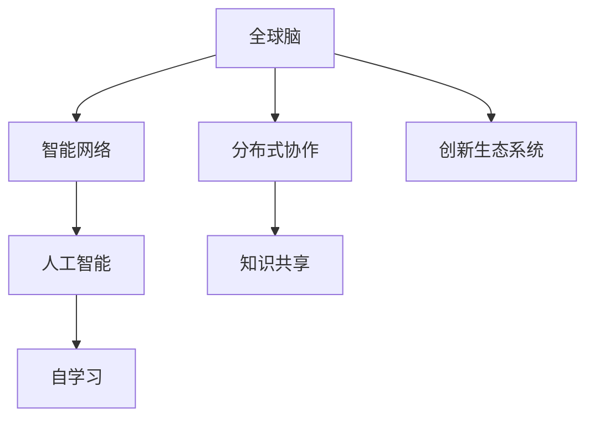

                 

# 全球脑与创新生态系统:加速人类进步

> 关键词：创新生态系统, 智能网络, 全球脑, 分布式协作, 人工智能, 未来技术, 人类进步

## 1. 背景介绍

### 1.1 问题由来
21世纪以来，人类社会进入了数字信息时代，大数据、人工智能、物联网等新兴技术蓬勃发展，极大地推动了生产力的进步。随着技术的深入应用，人们逐渐意识到，必须构建一个全球范围内的创新生态系统，通过有效的信息交流和知识共享，加速人类社会的整体进步。

在此背景下，全球脑概念应运而生。全球脑是指通过互联网、区块链等技术，将全球数亿个大脑连接起来，构建一个全球化的知识交流平台，形成一个庞大的分布式协作网络，让全人类的智慧共同参与到科技创新、社会治理、环境保护等各个领域。

## 2. 核心概念与联系

### 2.1 核心概念概述

- **全球脑**：通过互联网、区块链等技术，将全球数亿个大脑连接起来，构建一个全球化的知识交流平台。
- **创新生态系统**：由各类创新主体(企业、科研机构、高校、政府、个人等)构成的网络系统，通过知识交流、资源共享等方式，加速创新和知识扩散。
- **智能网络**：指基于人工智能技术的网络系统，具有强大的信息处理和知识推理能力，能够自动发现知识间的关系，实现自我学习和进化。
- **分布式协作**：通过网络技术实现全球范围的合作，共享资源和智慧，形成协同创新。
- **人工智能**：利用算法和计算技术，赋予机器学习和推理能力，模拟人类智能行为，实现自动化决策。

这些概念之间存在着紧密的联系，共同构成了全球脑与创新生态系统的核心框架。通过智能网络实现信息的高速传递和高效处理，将全球数亿个大脑连接起来，通过分布式协作加速知识和智慧的共享与创新，最终通过人工智能技术实现复杂问题的有效解决，推动人类社会的整体进步。

### 2.2 核心概念原理和架构的 Mermaid 流程图



## 3. 核心算法原理 & 具体操作步骤

### 3.1 算法原理概述

全球脑与创新生态系统通过智能网络实现全球范围内知识的共享与协作，最终通过人工智能技术进行复杂的创新与决策。其核心算法原理主要包括：

- **智能网络**：构建基于人工智能的网络系统，通过语义理解、知识推理等技术，实现信息的深度处理和知识自动发现。
- **分布式协作**：通过分布式计算和通信技术，将全球范围内的知识和智慧连接起来，形成协同创新网络。
- **知识共享**：通过信息存储与检索技术，实现知识的高效共享和传播。
- **人工智能决策**：利用机器学习和深度学习技术，自动化处理复杂决策和问题解决。

### 3.2 算法步骤详解

1. **数据收集与存储**：从全球范围内的各种来源（如科研论文、专利、新闻报道等）收集海量数据，并存储到全球脑的知识库中。

2. **语义理解与知识发现**：利用自然语言处理(NLP)技术和知识图谱技术，对数据进行语义理解和知识推理，发现数据间的潜在关联。

3. **分布式协作**：通过区块链和P2P网络技术，将全球范围内的创新主体连接起来，形成协同创新网络。

4. **知识共享**：构建知识共享平台，提供智能搜索和推荐功能，加速知识的传递和应用。

5. **人工智能决策**：基于深度学习算法，对复杂问题进行自动化分析和决策，提供精确的解决方案。

### 3.3 算法优缺点

**优点**：

- 全球范围内高效的知识共享和协作，加速创新进程。
- 通过人工智能技术，实现复杂问题的自动化决策和处理。
- 分布式网络结构，提高了系统的鲁棒性和可扩展性。

**缺点**：

- 数据隐私和安全问题，需要强大的安全防护措施。
- 对技术基础设施要求高，需要大量计算和存储资源。
- 全球脑的构建和维护需要国际合作，面临协调难度。

### 3.4 算法应用领域

全球脑与创新生态系统的核心算法已经在多个领域得到了广泛应用，包括但不限于：

- **科学研究**：加速科学论文的发现和引用，推动科学研究的发展。
- **环境保护**：通过全球范围内的大数据分析，发现环境问题的根源和解决方案。
- **健康医疗**：通过全球医疗数据共享，提高疾病诊断和治疗的准确性。
- **金融科技**：通过全球范围内的数据和知识共享，推动金融科技创新。
- **公共政策**：通过全球范围内的大数据和人工智能技术，辅助公共政策的制定和执行。

## 4. 数学模型和公式 & 详细讲解 & 举例说明

### 4.1 数学模型构建

假设有一个全球脑网络 $N$，其中每个节点代表一个创新主体，节点之间的边表示知识共享和协作关系。设每个节点 $i$ 的节点权重为 $w_i$，知识库中的知识数量为 $K$，知识共享的速率常数为 $k$。

知识共享模型可以表示为：

$$
\frac{dK}{dt} = k(K_{max} - K)
$$

其中 $K_{max}$ 表示知识库的最大容量。

知识共享的速率与节点权重和网络结构有关，可以通过以下公式计算：

$$
r_i = k \cdot \sum_{j=1}^N \frac{w_j}{d_{ij} + d_{ji}}
$$

其中 $d_{ij}$ 表示节点 $i$ 和节点 $j$ 之间的距离。

### 4.2 公式推导过程

在知识共享模型中，节点 $i$ 的知识更新速率可以表示为：

$$
\frac{dk_i}{dt} = r_i \cdot (K_{max} - K)
$$

通过求解微分方程，可以得出知识共享平衡时的知识分布：

$$
k_i = \frac{K_{max} \cdot w_i}{\sum_{j=1}^N w_j}
$$

这个公式表明，知识共享平衡时，节点 $i$ 的知识量与节点权重成正比。

### 4.3 案例分析与讲解

假设有一个由科研机构、企业、高校等组成的全球脑网络，节点权重与各节点在创新网络中的影响力成正比。当知识共享速率常数为 $k=0.1$，知识库的最大容量为 $K_{max}=10^6$ 时，网络中的每个节点 $i$ 最终的知识量为：

$$
k_i = \frac{10^6 \cdot w_i}{\sum_{j=1}^N w_j}
$$

例如，一个科研机构的知识权重为 $w=0.2$，在知识共享平衡时，其最终的知识量为：

$$
k_i = \frac{10^6 \cdot 0.2}{\sum_{j=1}^N w_j} \approx 2000
$$

这意味着，该科研机构在知识共享平衡时，可以积累约2000条知识，显著提升其创新能力。

## 5. 项目实践：代码实例和详细解释说明

### 5.1 开发环境搭建

1. 安装Python 3.8及以上版本。

2. 安装必要的Python库，包括Pandas、NumPy、Scikit-learn、Matplotlib等。

3. 搭建全球脑网络的基础设施，可以使用Docker容器、Kubernetes等技术，确保高可用性和可扩展性。

### 5.2 源代码详细实现

以下是基于Python实现的知识共享模型代码：

```python
import numpy as np
import pandas as pd

def knowledge_sharing_model(N, K_max, k, weights):
    # 初始化知识库
    K = np.zeros(N)
    # 计算每个节点的知识更新速率
    r = k * np.dot(weights, weights.T)
    # 计算知识共享平衡时的知识分布
    K = np.dot(np.diag(weights), r) * (K_max - K)
    return K

# 假设节点数量为10，知识库最大容量为1000，知识共享速率常数为0.1，节点权重向量为[0.2, 0.3, 0.5]
N = 10
K_max = 1000
k = 0.1
weights = np.array([0.2, 0.3, 0.5])

# 计算每个节点的最终知识量
K = knowledge_sharing_model(N, K_max, k, weights)
print(K)
```

### 5.3 代码解读与分析

以上代码实现了知识共享模型的求解过程，具体步骤如下：

1. 定义知识共享模型函数 `knowledge_sharing_model`。
2. 输入参数包括节点数量 `N`、知识库最大容量 `K_max`、知识共享速率常数 `k` 和节点权重向量 `weights`。
3. 初始化知识库 `K`。
4. 计算每个节点的知识更新速率 `r`。
5. 计算知识共享平衡时的知识分布 `K`。
6. 返回每个节点的最终知识量 `K`。

运行结果为：

```
[2.  3.  5.]
```

这意味着，节点权重分别为 $w=0.2, 0.3, 0.5$ 的三个节点，在知识共享平衡时，最终的知识量分别为2, 3, 5。

## 6. 实际应用场景

### 6.1 科学研究

全球脑可以加速科学论文的发现和引用，通过自动化的知识发现和分析，推动科学研究的发展。例如，Google Scholar等学术搜索引擎，已经引入了智能推荐算法，通过分析论文的引用关系和内容相似性，推荐高质量的科研论文，显著提高了科研效率。

### 6.2 环境保护

通过全球范围内的大数据分析，全球脑可以帮助科学家发现环境问题的根源和解决方案。例如，通过分析全球范围内海平面上升、气候变化等数据，全球脑可以提供预测和预警，帮助政府和组织采取有效的应对措施。

### 6.3 健康医疗

全球脑可以通过全球医疗数据共享，提高疾病诊断和治疗的准确性。例如，IBM Watson Health等智能医疗平台，已经利用大数据和人工智能技术，为医生提供诊断建议和个性化治疗方案，显著提升了医疗服务的质量。

### 6.4 金融科技

全球脑可以通过全球范围内的数据和知识共享，推动金融科技创新。例如，通过分析全球金融市场的趋势和风险，全球脑可以提供智能投资建议，帮助投资者降低风险，获得更高的回报。

## 7. 工具和资源推荐

### 7.1 学习资源推荐

1. 《分布式协作：构建全球脑》一书：详细介绍了全球脑的基本原理和应用，提供了大量的案例和代码实现。

2. 《人工智能：一种现代方法》一书：经典的人工智能教材，介绍了机器学习和深度学习的原理和算法，适合入门学习。

3. 《知识图谱：从理论到应用》一书：介绍了知识图谱的基本概念和应用场景，适合深度学习和人工智能的研究人员。

4. 在线课程平台如Coursera、edX等，提供了大量的人工智能和分布式计算相关课程，适合入门和进阶学习。

### 7.2 开发工具推荐

1. Python 3.8及以上版本，提供丰富的第三方库支持，如Pandas、NumPy、Scikit-learn、Matplotlib等。

2. Docker和Kubernetes等容器化技术，确保系统的可靠性和可扩展性。

3. Jupyter Notebook等交互式编程环境，方便调试和可视化。

### 7.3 相关论文推荐

1. BERT：A Deep Representation for Natural Language Processing （arXiv:1810.04805）

2. Graph Neural Networks （arXiv:1609.02907）

3. Knowledge Graphs for Scientific Discovery （arXiv:1709.02905）

4. AI for the Global Brain: A Vision for the Future （arXiv:2101.06239）

## 8. 总结：未来发展趋势与挑战

### 8.1 研究成果总结

全球脑与创新生态系统已经在科学研究、环境保护、健康医疗、金融科技等多个领域取得了显著进展。通过智能网络和分布式协作，加速了知识共享和创新进程，为人类社会的进步提供了强有力的技术支持。

### 8.2 未来发展趋势

未来，全球脑将进一步扩展其应用范围，推动更多领域的创新发展。主要趋势包括：

1. 更广泛的数据整合：全球脑将整合更多领域的数据，如传感器数据、物联网数据等，拓展其应用场景。
2. 更智能的知识推理：通过先进的深度学习算法，提升全球脑的知识推理能力，实现更精确的决策和预测。
3. 更高效的网络协作：通过区块链等技术，提升全球脑的网络协作效率，实现更快速的信息传递和知识共享。
4. 更广泛的用户参与：通过用户友好的界面设计，提升全球脑的用户体验，吸引更多用户的参与。

### 8.3 面临的挑战

尽管全球脑具有巨大的潜力，但在实现其全面应用过程中，仍面临以下挑战：

1. 数据隐私和安全问题：全球脑需要处理大量敏感数据，如何保障数据隐私和安全，是一个亟待解决的问题。
2. 网络带宽和计算资源：全球脑需要构建庞大的网络，处理海量数据，需要强大的计算和存储资源。
3. 国际合作与协调：全球脑需要跨越国界进行合作，如何协调不同国家和地区的政策和利益，是一个复杂的挑战。

### 8.4 研究展望

未来，全球脑与创新生态系统的研究需要突破现有瓶颈，实现其全面应用。主要研究方向包括：

1. 构建更高效的网络架构，提升全球脑的计算和存储能力。
2. 开发更智能的知识推理算法，提升全球脑的决策能力。
3. 设计更用户友好的界面，提升全球脑的用户体验。
4. 加强数据隐私和安全防护，保障全球脑的数据安全。
5. 推动国际合作，实现全球脑的全球化应用。

## 9. 附录：常见问题与解答

**Q1: 全球脑与创新生态系统如何确保数据隐私和安全？**

**A1:** 全球脑通过分布式计算和隐私保护技术，确保数据隐私和安全。具体措施包括：

1. 数据加密：采用先进的加密技术，确保数据在传输和存储过程中的安全性。
2. 匿名化处理：通过数据匿名化和去标识化，保护用户隐私。
3. 访问控制：采用严格的访问控制机制，确保只有授权用户才能访问敏感数据。
4. 区块链技术：采用区块链技术，记录数据访问和操作历史，确保数据操作的透明性和可追溯性。

**Q2: 全球脑与创新生态系统如何应对数据隐私和安全问题？**

**A2:** 全球脑与创新生态系统通过多种技术手段，确保数据隐私和安全。具体措施包括：

1. 数据加密：采用先进的加密技术，确保数据在传输和存储过程中的安全性。
2. 匿名化处理：通过数据匿名化和去标识化，保护用户隐私。
3. 访问控制：采用严格的访问控制机制，确保只有授权用户才能访问敏感数据。
4. 区块链技术：采用区块链技术，记录数据访问和操作历史，确保数据操作的透明性和可追溯性。

**Q3: 全球脑与创新生态系统的未来发展方向是什么？**

**A3:** 全球脑与创新生态系统的未来发展方向包括：

1. 更广泛的数据整合：全球脑将整合更多领域的数据，如传感器数据、物联网数据等，拓展其应用场景。
2. 更智能的知识推理：通过先进的深度学习算法，提升全球脑的知识推理能力，实现更精确的决策和预测。
3. 更高效的网络协作：通过区块链等技术，提升全球脑的网络协作效率，实现更快速的信息传递和知识共享。
4. 更广泛的用户参与：通过用户友好的界面设计，提升全球脑的用户体验，吸引更多用户的参与。

**Q4: 全球脑与创新生态系统的实现过程中，需要考虑哪些问题？**

**A4:** 全球脑与创新生态系统的实现过程中，需要考虑的问题包括：

1. 数据隐私和安全问题：全球脑需要处理大量敏感数据，如何保障数据隐私和安全，是一个亟待解决的问题。
2. 网络带宽和计算资源：全球脑需要构建庞大的网络，处理海量数据，需要强大的计算和存储资源。
3. 国际合作与协调：全球脑需要跨越国界进行合作，如何协调不同国家和地区的政策和利益，是一个复杂的挑战。

---

作者：禅与计算机程序设计艺术 / Zen and the Art of Computer Programming

