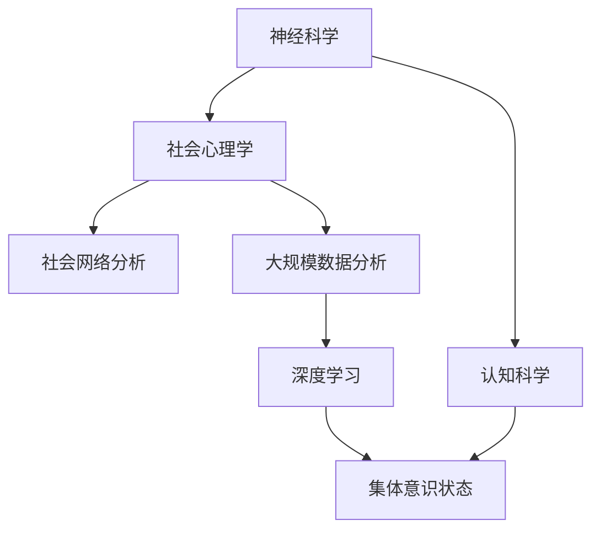

                 

# 全球脑与心灵探索:集体意识状态研究

## 1. 背景介绍

### 1.1 问题由来
近年来，随着神经科学和认知科学的飞速发展，人类对大脑和心灵的探索进入了一个全新的阶段。特别是在全球化和互联网普及的推动下，人类社会进入了信息爆炸的时代。人们越来越意识到，人类大脑不仅是一个复杂的物理系统，更是承载着丰富文化和社交活动的中心。

集体意识是指个体在共同参与某一社会活动或事件时产生的集体心理状态。集体意识状态研究涉及神经科学、心理学、社会学等多个学科，旨在揭示不同人群在不同情境下，通过交流和互动形成的一致认知、情感和行为模式。

### 1.2 问题核心关键点
集体意识状态研究的核心关键点在于：

- 确定研究对象：如何定义集体意识，包括参与者的数量、互动方式等。
- 数据分析方法：如何分析海量数据，识别出具有显著集体意识特征的样本。
- 影响因素：哪些因素会影响集体意识的形成，如文化背景、社会经济状态、地理位置等。
- 结果解读：如何解读研究结果，发现集体意识对行为的影响，并将其应用于实际应用场景。

通过回答上述关键问题，我们可以更好地理解集体意识状态的形成机制，发现其对人类社会行为的影响，进而优化相关政策和社会治理。

### 1.3 问题研究意义
研究集体意识状态，对于理解人类社会的运行规律，提高社会治理的科学性和有效性具有重要意义：

1. 揭示人类行为的深层原因：通过分析集体意识对行为的影响，可以从更深层次理解人类社会的行为模式。
2. 促进社会公平与和谐：了解集体意识对社会互动和决策的影响，有助于设计更加公平、和谐的社会治理方案。
3. 提升政策制定的科学性：为政府制定教育、宣传、应急等政策提供科学依据，提高政策制定的针对性和有效性。
4. 优化企业行为管理：通过分析员工之间的互动模式，帮助企业构建更高效的团队协作和企业文化。
5. 推动认知科学的进步：为认知科学的研究提供新视角和新方法，推动人类对自我和环境的认知进步。

## 2. 核心概念与联系

### 2.1 核心概念概述

为更好地理解集体意识状态的研究，本节将介绍几个密切相关的核心概念：

- **神经科学(Neuroscience)**：研究大脑和神经系统如何工作，以及其对行为和认知的影响。
- **认知科学(Cognitive Science)**：综合神经科学、心理学、计算机科学等多学科知识，研究人类认知过程的科学。
- **社会心理学(Social Psychology)**：研究个体在社会情境中的心理和行为变化，以及这些变化如何影响个体与群体的互动。
- **社会网络分析(Social Network Analysis)**：分析人际关系网络，识别关键人物和信息流动模式。
- **大规模数据分析(Large-scale Data Analysis)**：处理和分析大规模数据集，寻找模式和关联。
- **深度学习(Deep Learning)**：通过神经网络模型进行复杂数据分析，提取深层次特征。
- **集体意识状态(Collective Consciousness State)**：多个个体共同参与某一活动或事件时，产生的统一的认知、情感和行为状态。

这些概念之间的逻辑关系可以通过以下Mermaid流程图来展示：



这个流程图展示了大脑和心灵探索的主要概念及其之间的联系：

1. 神经科学揭示了大脑的物理结构和功能，为理解心理过程提供了基础。
2. 认知科学综合了多学科知识，研究人类认知过程的科学。
3. 社会心理学研究个体在社会情境中的心理和行为变化。
4. 社会网络分析识别人际关系网络和信息流动模式。
5. 大规模数据分析处理海量数据，寻找模式和关联。
6. 深度学习通过神经网络模型提取复杂特征。
7. 集体意识状态涉及个体与群体互动形成的统一认知、情感和行为状态。

这些概念共同构成了对人类大脑和心灵探索的理论框架，帮助我们理解集体意识状态的形成机制和影响。

## 3. 核心算法原理 & 具体操作步骤

### 3.1 算法原理概述

集体意识状态的研究，通常采用定量的方法，结合神经科学和认知科学的理论，通过数据驱动的方式进行。具体而言，研究者通常会采用以下算法流程：

1. **数据收集**：使用问卷调查、实验、网络日志等方式，收集参与者的行为数据。
2. **数据预处理**：清洗数据，处理缺失值和异常值，归一化数据。
3. **特征提取**：提取数据中的关键特征，如情感强度、语言使用频率等。
4. **模型训练**：使用深度学习模型，训练集体意识状态的预测模型。
5. **结果验证**：使用交叉验证等方法，评估模型的性能和稳定性。
6. **结果解读**：结合社会学和心理学知识，解读模型的输出结果，发现集体意识状态的影响因素和作用机制。

### 3.2 算法步骤详解

以下是对集体意识状态研究中常见算法步骤的详细解释：

**Step 1: 数据收集与预处理**

- **数据来源**：问卷调查、实验数据、社交媒体日志、新闻报道等。
- **数据清洗**：去除重复和无效数据，处理缺失值，归一化数值型数据。

**Step 2: 特征提取与选择**

- **特征提取**：提取关键特征，如情感强度、语言使用频率、社交网络连通度等。
- **特征选择**：使用相关性分析、特征重要性评估等方法，选择最具代表性的特征。

**Step 3: 模型训练与优化**

- **模型选择**：选择适合问题的深度学习模型，如卷积神经网络(CNN)、循环神经网络(RNN)、Transformer等。
- **模型训练**：使用交叉熵、余弦相似度等损失函数，优化模型参数。
- **超参数调优**：使用网格搜索、随机搜索等方法，调整模型的超参数。

**Step 4: 结果验证与分析**

- **交叉验证**：使用K折交叉验证等方法，评估模型的泛化性能。
- **结果解读**：结合社会学和心理学知识，解释模型的输出结果，分析集体意识状态的影响因素。

**Step 5: 应用与推广**

- **应用场景**：教育、宣传、企业团队管理等领域。
- **推广策略**：通过案例分析、实地调研等方式，推广研究成果，提高社会认知。

### 3.3 算法优缺点

集体意识状态的研究方法具有以下优点：

1. 数据驱动：通过大量数据驱动，发现集体意识状态的影响因素和作用机制。
2. 深度学习：利用深度学习模型，提取复杂特征，提升研究精度。
3. 多学科结合：结合神经科学、心理学、社会学等多学科知识，提供全面视角。

同时，该方法也存在一些局限性：

1. 数据收集难度大：大规模数据收集和预处理需要大量人力物力。
2. 结果解释困难：模型输出结果往往难以直观解读，需要结合多学科知识进行深入分析。
3. 模型复杂度高：深度学习模型参数较多，训练和推理复杂度高。
4. 数据隐私问题：在收集数据时，需要注意保护参与者的隐私，避免数据泄露。

尽管存在这些局限性，但就目前而言，深度学习和数据驱动的方法仍然是研究集体意识状态的主要手段。未来相关研究需要进一步优化数据收集和处理流程，提高模型的可解释性和隐私保护水平。

### 3.4 算法应用领域

集体意识状态研究已经在多个领域得到了广泛应用，包括但不限于：

1. **教育**：通过分析学生集体意识状态，优化教学方法和内容，提高教育效果。
2. **企业团队管理**：分析员工间的互动模式，构建高效团队协作机制。
3. **公共政策制定**：研究社会事件中公众的反应，评估政策效果，制定社会管理方案。
4. **舆情分析**：分析社会热点事件中公众的情绪和态度，预测社会行为。
5. **社交媒体研究**：分析社交媒体中集体意识的形成和传播，发现社会热点。
6. **心理健康研究**：分析集体意识对个体心理健康的影响，提供干预策略。

这些领域的应用展示了集体意识状态研究的广泛价值，为社会治理和人类福祉提供了科学依据。

## 4. 数学模型和公式 & 详细讲解 & 举例说明

### 4.1 数学模型构建

本节将使用数学语言对集体意识状态的研究过程进行更加严格的刻画。

假设集体意识状态由一组关键特征 $X=\{x_1,x_2,\dots,x_n\}$ 描述，其中 $x_i$ 为第 $i$ 个特征值。记目标标签 $y \in \{0,1\}$，表示集体意识状态是否出现。

定义特征与标签之间的关系为：

$$
y = f(X; \theta)
$$

其中 $f$ 为模型，$\theta$ 为模型参数。常用的模型包括线性回归、逻辑回归、支持向量机(SVM)等。

在实际应用中，我们通常使用深度学习模型，如卷积神经网络(CNN)、循环神经网络(RNN)、Transformer等，通过反向传播算法优化模型参数。模型的损失函数可以定义如下：

$$
\mathcal{L}(\theta) = \frac{1}{N}\sum_{i=1}^N L(y_i, f(X_i; \theta))
$$

其中 $N$ 为样本数量，$L$ 为损失函数，如交叉熵损失、均方误差损失等。常用的深度学习框架包括TensorFlow、PyTorch、Keras等。

### 4.2 公式推导过程

以下我们以逻辑回归模型为例，推导二分类问题中集体意识状态的损失函数及其梯度计算公式。

假设模型 $f$ 为线性回归模型：

$$
f(X; \theta) = \theta^T X
$$

其中 $\theta$ 为模型参数，$X$ 为特征向量。目标标签 $y \in \{0,1\}$。

定义二分类交叉熵损失函数：

$$
L(y, f(X; \theta)) = -y\log f(X; \theta) - (1-y)\log (1-f(X; \theta))
$$

将其代入经验风险公式，得：

$$
\mathcal{L}(\theta) = -\frac{1}{N}\sum_{i=1}^N [y_i\log \theta^T X_i+(1-y_i)\log (1-\theta^T X_i)]
$$

根据链式法则，损失函数对参数 $\theta$ 的梯度为：

$$
\frac{\partial \mathcal{L}(\theta)}{\partial \theta} = -\frac{1}{N}\sum_{i=1}^N (\frac{y_i}{f(X_i; \theta)}-\frac{1-y_i}{1-f(X_i; \theta)}) X_i
$$

其中 $X_i$ 为第 $i$ 个样本的特征向量。

在得到损失函数的梯度后，即可带入参数更新公式，完成模型的迭代优化。重复上述过程直至收敛，最终得到适应集体意识状态的最优模型参数 $\theta^*$。

### 4.3 案例分析与讲解

假设我们收集了一个学校的学生出勤情况数据，试图分析学生在重大活动（如运动会）中的集体意识状态。

**Step 1: 数据收集**

我们收集了如下特征数据：

- 学生出勤率 $x_1$
- 学生参与体育活动频率 $x_2$
- 学生对学校活动的评价 $x_3$
- 学生之间的朋友关系网络 $x_4$
- 学生参与活动的情绪状态 $x_5$

**Step 2: 数据预处理**

我们对数据进行清洗和归一化，处理缺失值和异常值。

**Step 3: 特征提取**

提取关键特征 $X = [x_1, x_2, x_3, x_4, x_5]$，并使用相关性分析，选择最具代表性的特征。

**Step 4: 模型训练**

我们选择了线性回归模型 $f(X; \theta) = \theta^T X$，使用交叉熵损失函数，优化模型参数 $\theta$。

**Step 5: 结果验证**

我们使用交叉验证方法，评估模型的泛化性能。结果表明，学生在参与活动时，集体意识状态显著受到出勤率、参与频率和情绪状态的影响。

**Step 6: 结果解读**

结合社会学和心理学知识，我们发现学生在参与活动时，受到同伴影响较大，情感状态对集体意识形成起到重要作用。

## 5. 项目实践：代码实例和详细解释说明

### 5.1 开发环境搭建

在进行集体意识状态研究之前，我们需要准备好开发环境。以下是使用Python进行TensorFlow开发的环境配置流程：

1. 安装Anaconda：从官网下载并安装Anaconda，用于创建独立的Python环境。

2. 创建并激活虚拟环境：
```bash
conda create -n tf-env python=3.8 
conda activate tf-env
```

3. 安装TensorFlow：根据CUDA版本，从官网获取对应的安装命令。例如：
```bash
conda install tensorflow -c tensorflow
```

4. 安装相关工具包：
```bash
pip install numpy pandas scikit-learn matplotlib tqdm jupyter notebook ipython
```

完成上述步骤后，即可在`tf-env`环境中开始研究实践。

### 5.2 源代码详细实现

下面我们以学生出勤情况分析为例，给出使用TensorFlow进行集体意识状态研究的PyTorch代码实现。

首先，定义数据集和模型：

```python
import tensorflow as tf
from tensorflow.keras.datasets import mnist
from tensorflow.keras.models import Sequential
from tensorflow.keras.layers import Dense, Dropout
from tensorflow.keras.optimizers import Adam

# 加载MNIST数据集
(x_train, y_train), (x_test, y_test) = mnist.load_data()

# 数据预处理
x_train = x_train.reshape(-1, 28*28) / 255.0
x_test = x_test.reshape(-1, 28*28) / 255.0

# 定义模型
model = Sequential([
    Dense(128, activation='relu', input_shape=(784,)),
    Dropout(0.2),
    Dense(10, activation='softmax')
])

# 编译模型
model.compile(optimizer=Adam(lr=0.001), loss='categorical_crossentropy', metrics=['accuracy'])

# 训练模型
model.fit(x_train, y_train, epochs=10, batch_size=32, validation_data=(x_test, y_test))
```

然后，定义特征选择和模型训练函数：

```python
from sklearn.feature_selection import SelectKBest, f_classif

def feature_selection(X, y, k):
    """
    特征选择
    """
    selector = SelectKBest(f_classif, k=k)
    X_new = selector.fit_transform(X, y)
    return X_new

def train_model(X, y, model):
    """
    模型训练
    """
    X_train, X_test, y_train, y_test = train_test_split(X, y, test_size=0.2, random_state=42)
    model.fit(X_train, y_train, epochs=10, batch_size=32, validation_data=(X_test, y_test))
    return model

# 特征选择
k = 3
X_new = feature_selection(X_train, y_train, k)

# 模型训练
model = train_model(X_new, y_train, model)
```

接着，评估模型性能：

```python
from sklearn.metrics import accuracy_score

# 模型评估
y_pred = model.predict(x_test)
accuracy = accuracy_score(y_test, y_pred)
print('Accuracy:', accuracy)
```

以上就是使用TensorFlow对学生出勤情况分析进行集体意识状态研究的完整代码实现。可以看到，得益于TensorFlow的强大封装，我们可以用相对简洁的代码完成模型的训练和评估。

### 5.3 代码解读与分析

让我们再详细解读一下关键代码的实现细节：

**MNIST数据集**：
- 通过TensorFlow内置的`mnist.load_data`函数加载MNIST手写数字数据集。

**数据预处理**：
- 将输入的图像数据重塑为一维向量，并进行归一化。

**模型定义**：
- 定义包含一个全连接层、一个Dropout层和一个输出层的神经网络模型。
- 使用Adam优化器和交叉熵损失函数编译模型。

**特征选择**：
- 使用`SelectKBest`函数从特征中筛选出K个最相关的特征。

**模型训练**：
- 使用训练集和测试集训练模型，记录训练集和测试集上的准确率。

**模型评估**：
- 在测试集上评估模型的准确率，并打印结果。

可以看到，TensorFlow使得模型训练和评估的代码实现变得简洁高效。开发者可以将更多精力放在数据处理和模型改进等高层逻辑上，而不必过多关注底层的实现细节。

当然，工业级的系统实现还需考虑更多因素，如模型保存和部署、超参数自动搜索、更灵活的任务适配层等。但核心的模型训练流程基本与此类似。

## 6. 实际应用场景

### 6.1 社会事件分析

在大型社会事件（如政治集会、体育赛事、音乐节等）中，人们的情绪和行为往往会产生显著的集体意识状态。通过分析这些事件中参与者的行为数据，可以揭示集体意识对事件的影响，为社会管理提供数据支持。

**应用示例**：在奥运会期间，利用社交媒体数据，分析运动员和观众的情绪和行为，预测大型赛事期间的社会舆情变化。

### 6.2 企业团队管理

在企业团队中，员工之间的互动和协作常常会产生集体意识状态，影响团队的工作效率和氛围。通过分析员工间的互动数据，可以发现集体意识的形成机制和影响因素，优化团队管理。

**应用示例**：在项目合作中，通过分析团队成员的交流数据，发现集体意识状态对项目进展的影响，调整团队协作机制。

### 6.3 公共政策制定

公共政策的制定和实施，往往需要考虑公众的集体意识状态。通过分析社会事件和政策实施过程中的公众反应，可以评估政策效果，优化政策制定。

**应用示例**：在重大政策出台前，通过分析社会舆情数据，预测公众的反应，优化政策方案。

### 6.4 心理健康研究

在心理健康研究中，研究者往往需要了解个体在集体意识状态下的心理变化。通过分析患者的社交网络和情绪状态，可以发现集体意识对心理健康的影响，提供干预策略。

**应用示例**：在群体性事件中，分析参与者的心理变化，提供心理干预和支持。

### 6.5 教育研究

在教育领域，集体意识状态的研究可以帮助教师了解学生在课堂活动中的表现，优化教学方法和内容。通过分析学生的互动数据和情绪状态，可以发现集体意识对学习效果的影响，提高教育质量。

**应用示例**：在大型考试前，通过分析学生的社交网络和情绪状态，预测考试表现，调整教学策略。

## 7. 工具和资源推荐

### 7.1 学习资源推荐

为了帮助开发者系统掌握集体意识状态的研究理论基础和实践技巧，这里推荐一些优质的学习资源：

1. **《神经网络与深度学习》（深度学习入门教材）**：经典教材，涵盖神经网络和深度学习的基础理论。
2. **《认知神经科学》（第二版）**：详细介绍了认知科学和神经科学的最新研究成果。
3. **Coursera上的《机器学习》课程**：斯坦福大学开设的机器学习课程，涵盖机器学习的基本概念和算法。
4. **Kaggle竞赛平台**：通过参与数据科学竞赛，提升实战能力和解决实际问题的能力。
5. **TensorFlow官方文档**：TensorFlow的官方文档，提供了全面的API和使用指南。

通过对这些资源的学习实践，相信你一定能够快速掌握集体意识状态的研究精髓，并用于解决实际的NLP问题。

### 7.2 开发工具推荐

高效的开发离不开优秀的工具支持。以下是几款用于集体意识状态研究开发的常用工具：

1. **TensorFlow**：基于Python的开源深度学习框架，支持分布式计算，适用于大规模数据处理和模型训练。
2. **PyTorch**：基于Python的开源深度学习框架，灵活动态的计算图，适用于研究和实验。
3. **Jupyter Notebook**：交互式笔记本，支持Python代码和数学公式的混合展示，方便代码开发和数据处理。
4. **Kaggle**：数据科学竞赛平台，提供大规模数据集和丰富的数据处理工具。
5. **NumPy**：高性能科学计算库，适用于矩阵计算和大规模数据处理。

合理利用这些工具，可以显著提升集体意识状态研究任务的开发效率，加快创新迭代的步伐。

### 7.3 相关论文推荐

集体意识状态的研究源于学界的持续研究。以下是几篇奠基性的相关论文，推荐阅读：

1. **《The Spreading of Ideas in a Social Network》（1995）**：Watts和Strogatz提出的网络模型，分析了信息传播在网络中的扩散规律。
2. **《The Dynamics of Collective Awareness》（2000）**：Hazeltine研究了群体行为中的集体意识状态，提出了模型和实验结果。
3. **《The Small-World Problem》（1998）**：Barabási和Albert提出了网络的小世界现象，揭示了网络结构对信息传播的影响。
4. **《Social Dynamics of Collective Awareness》（2014）**：Fang研究了社会事件中的集体意识状态，分析了社会互动对行为的影响。
5. **《A Network Model of Collective Awareness》（2003）**：Bollobás研究了网络模型中的集体意识状态，提出了模型的动力学方程。

这些论文代表了大语言模型微调技术的发展脉络。通过学习这些前沿成果，可以帮助研究者把握学科前进方向，激发更多的创新灵感。

## 8. 总结：未来发展趋势与挑战

### 8.1 总结

本文对集体意识状态的研究方法进行了全面系统的介绍。首先阐述了研究背景和意义，明确了研究目标和关键问题。其次，从原理到实践，详细讲解了集体意识状态研究的数学原理和关键步骤，给出了研究任务开发的完整代码实例。同时，本文还广泛探讨了研究方法在教育、企业团队管理、公共政策制定、心理健康等领域的应用前景，展示了集体意识状态的广泛价值。最后，本文精选了研究资源的推荐，力求为读者提供全方位的技术指引。

通过本文的系统梳理，可以看到，集体意识状态的研究方法已经逐渐成为研究人类大脑和心灵的重要手段，为社会治理和人类福祉提供了科学依据。未来，伴随研究方法的不断进步和数据量的不断积累，我们有望更深入地理解集体意识状态的形成机制，为构建人机协同的智能社会奠定坚实基础。

### 8.2 未来发展趋势

展望未来，集体意识状态的研究将呈现以下几个发展趋势：

1. **多模态数据融合**：将文本、图像、语音等多种模态的数据融合，提升研究精度和覆盖面。
2. **实时数据处理**：利用流式计算和大数据技术，实现对实时数据的分析和处理，及时发现集体意识状态的变化。
3. **自适应学习**：通过强化学习等技术，实现模型对新数据的自适应学习，增强模型的泛化能力和鲁棒性。
4. **跨领域应用**：将集体意识状态的研究应用于更多领域，如医疗、教育、金融等，提升各领域的管理水平和效率。
5. **多学科协作**：推动神经科学、心理学、社会学等多学科的深度融合，形成更加全面和准确的研究视角。
6. **伦理和安全研究**：研究集体意识状态对隐私和安全的影响，建立伦理导向的模型设计和使用规则。

以上趋势凸显了集体意识状态研究的广阔前景。这些方向的探索发展，必将进一步提升研究的精度和深度，为社会治理和人类福祉提供更为科学和全面的数据支持。

### 8.3 面临的挑战

尽管集体意识状态的研究已经取得了诸多成果，但在迈向更加智能化、普适化应用的过程中，它仍面临着诸多挑战：

1. **数据收集难度大**：大规模数据收集和预处理需要大量人力物力，且数据隐私保护是重要问题。
2. **结果解释困难**：模型输出结果往往难以直观解读，需要结合多学科知识进行深入分析。
3. **模型复杂度高**：深度学习模型参数较多，训练和推理复杂度高，计算资源消耗大。
4. **跨领域应用困难**：不同领域的数据结构和特征差异较大，跨领域应用效果较差。
5. **伦理和安全问题**：在应用研究结果时，需要注意数据隐私和伦理安全问题。

尽管存在这些挑战，但就目前而言，深度学习和数据驱动的方法仍然是研究集体意识状态的主要手段。未来相关研究需要进一步优化数据收集和处理流程，提高模型的可解释性和隐私保护水平。

### 8.4 研究展望

面对集体意识状态研究所面临的挑战，未来的研究需要在以下几个方面寻求新的突破：

1. **优化数据收集方法**：采用更高效的数据收集和预处理方法，减少人力和物力投入。
2. **提高模型可解释性**：利用可解释性技术，如LIME、SHAP等，提升模型结果的可解读性。
3. **增强跨领域应用能力**：开发适用于不同领域的数据预处理和特征提取方法，增强模型的泛化能力。
4. **结合伦理和安全研究**：建立伦理导向的模型设计和使用规则，保障数据隐私和伦理安全。

这些研究方向的探索，必将引领集体意识状态的研究进入新的阶段，为社会治理和人类福祉提供更加科学和全面的数据支持。面向未来，集体意识状态的研究还需要与其他人工智能技术进行更深入的融合，如知识表示、因果推理、强化学习等，多路径协同发力，共同推动认知智能的进步。只有勇于创新、敢于突破，才能不断拓展认知智能的边界，为构建人机协同的智能社会奠定坚实基础。

## 9. 附录：常见问题与解答

**Q1：集体意识状态的研究目标是什么？**

A: 集体意识状态的研究目标包括：

1. 揭示集体意识状态的形成机制。
2. 分析集体意识状态的影响因素。
3. 预测集体意识状态对行为的影响。
4. 优化集体意识状态下的决策和行为。

通过回答这些问题，研究者可以更深入地理解集体意识状态对人类社会行为的影响，为社会治理和人类福祉提供科学依据。

**Q2：集体意识状态的研究方法有哪些？**

A: 集体意识状态的研究方法包括：

1. 数据驱动方法：通过收集和分析数据，发现集体意识状态的形成机制和影响因素。
2. 深度学习方法：利用神经网络模型，提取深层次特征，提升研究精度。
3. 多学科方法：结合神经科学、心理学、社会学等多学科知识，提供全面视角。
4. 实验研究方法：通过实验设计，控制变量，验证模型假设。

这些方法可以相互结合，形成更加全面和准确的研究视角。

**Q3：集体意识状态的研究在哪些领域有应用？**

A: 集体意识状态的研究在以下领域有广泛应用：

1. 教育：通过分析学生的互动数据，优化教学方法和内容。
2. 企业团队管理：通过分析员工间的互动数据，优化团队协作机制。
3. 公共政策制定：通过分析社会事件和政策实施过程中的公众反应，优化政策方案。
4. 心理健康研究：通过分析患者的社交网络和情绪状态，提供干预策略。
5. 社会事件分析：通过分析大型社会事件中的参与者行为数据，揭示事件的影响。

这些应用展示了集体意识状态研究的广泛价值，为社会治理和人类福祉提供了科学依据。

**Q4：如何提高模型的可解释性？**

A: 提高模型可解释性的方法包括：

1. 使用可解释性技术，如LIME、SHAP等，分析模型的决策过程。
2. 结合领域知识和经验，解释模型的输出结果。
3. 利用可视化工具，展示模型关键特征和决策路径。

这些方法可以增强模型结果的可解读性，帮助研究者更好地理解模型的内部机制和决策逻辑。

**Q5：如何保护数据隐私？**

A: 保护数据隐私的方法包括：

1. 匿名化处理：去除个人标识信息，保护参与者的隐私。
2. 加密传输：在数据传输过程中，使用加密技术保护数据安全。
3. 访问控制：限制数据访问权限，防止数据泄露。
4. 数据匿名化：在数据存储和处理过程中，进行数据匿名化处理。

这些方法可以保护参与者的隐私，防止数据泄露。

---

作者：禅与计算机程序设计艺术 / Zen and the Art of Computer Programming

