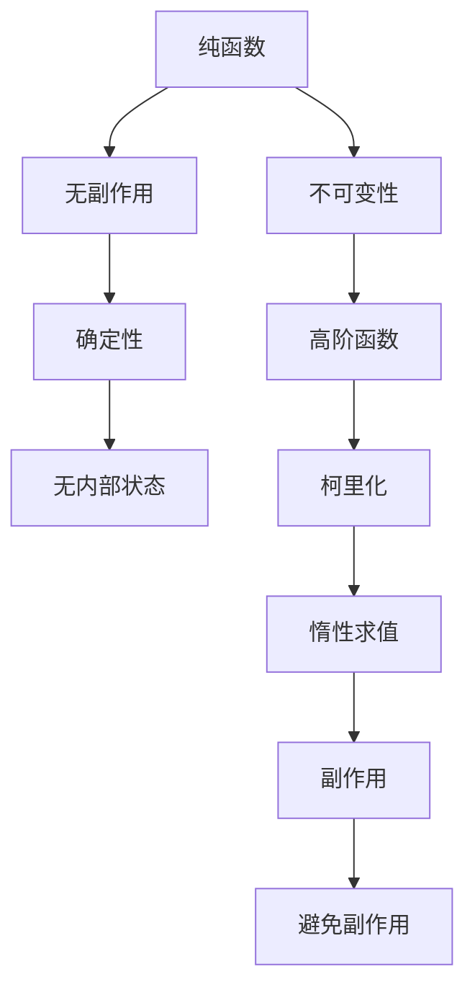

                 

# 函数式编程：理论与实践

> 关键词：函数式编程, 纯函数, 不可变性, 高阶函数, 柯里化, 惰性求值, 副作用, 并发

## 1. 背景介绍

函数式编程作为一种编程范式，自诞生以来，一直受到推崇，但其在工业界的推广进展缓慢。随着云计算和分布式计算的普及，函数式编程的诸多优势逐渐被业界所认识，并开始得到实际应用。本文从函数式编程的基本概念出发，系统梳理其核心原理，并通过详细实例，展示函数式编程在实际项目中的落地应用。

## 2. 核心概念与联系

### 2.1 核心概念概述

函数式编程（Functional Programming，FP）是一种编程范式，强调使用函数作为程序的基本组件，通过数学函数的形式组织代码，避免使用可变状态和副作用。以下是函数式编程的几个核心概念：

- **纯函数(Pure Functions)**：函数式编程的核心，纯函数具有以下特征：
  - 无副作用：不修改任何外部状态。
  - 确定性：输入相同，输出一定相同。
  - 无内部状态：纯函数只依赖于传入的参数，不依赖于外部变量或状态。
- **不可变性(Immutability)**：纯函数内部的数据结构必须保持不变，避免修改操作。
- **高阶函数(Higher-Order Functions)**：可以接受函数作为参数，或返回函数作为结果。
- **柯里化(Currying)**：将一个多参数函数转化为一系列单参数函数的过程。
- **惰性求值(Lazy Evaluation)**：只有当需要时才进行计算，避免不必要的资源浪费。
- **副作用(Side Effects)**：修改外部状态或引发外部变化的操作，函数式编程尽量规避副作用。

### 2.2 核心概念原理和架构的 Mermaid 流程图



## 3. 核心算法原理 & 具体操作步骤

### 3.1 算法原理概述

函数式编程的算法设计遵循以下原则：
1. **避免可变状态**：纯函数内部不修改任何外部状态，从而提高程序的可维护性和可靠性。
2. **延迟计算**：惰性求值机制可以避免不必要的计算，提高程序的性能。
3. **组合函数**：通过高阶函数和柯里化，将复杂的函数组合成多个简单函数，提高代码的可读性和可复用性。

### 3.2 算法步骤详解

1. **数据表示**：使用不可变数据结构，如不可变列表、不可变映射等，避免数据状态的变化。
2. **函数设计**：确保所有函数都是纯函数，不修改任何外部状态。
3. **高阶函数和柯里化**：使用高阶函数和柯里化，将复杂问题分解为多个简单函数。
4. **惰性求值**：对结果的计算进行延迟，只有在需要时才进行实际计算。
5. **副作用管理**：尽量减少副作用的使用，如通过日志记录等方式记录必要的信息。

### 3.3 算法优缺点

函数式编程的优点包括：
- **易于测试**：纯函数的结果确定，易于编写测试用例。
- **并行化**：无副作用的函数可以并行化计算，提高程序的性能。
- **易于理解和维护**：纯函数和不可变性的设计使代码更加清晰，易于理解和维护。

缺点包括：
- **学习成本高**：函数式编程的思维模式和语言特性与传统编程范式不同，需要较高的学习成本。
- **性能问题**：某些情况下，函数式编程可能不如命令式编程的性能。
- **难以处理复杂状态**：函数式编程的不可变性可能使得复杂状态难以处理。

### 3.4 算法应用领域

函数式编程的应用领域包括：
- **函数库和语言**：如Scala、Haskell、Clojure等，均以函数式编程为设计核心。
- **并发编程**：函数式编程无副作用的设计，使得并发编程更加安全。
- **数据处理**：在数据处理和数据流编程中，函数式编程的优势尤为明显。
- **云计算和分布式系统**：函数式编程适用于微服务架构和分布式计算。
- **人工智能**：如机器学习库Scikit-Learn和TensorFlow中，也有许多函数式编程的应用。

## 4. 数学模型和公式 & 详细讲解 & 举例说明

### 4.1 数学模型构建

函数式编程的数学模型通常包括两个部分：函数的定义和函数的组合。函数的定义通常包括参数和返回值，函数的组合则包括复合、映射、过滤等操作。

### 4.2 公式推导过程

以下是一个简单的函数式编程示例，计算两个数的和：

```python
def add(a, b):
    return a + b
```

这个函数是纯函数，不修改任何外部状态。

### 4.3 案例分析与讲解

函数式编程的一个典型应用场景是数据分析和处理。假设有一个列表，需要对其中的元素进行过滤和转换，可以使用如下代码：

```python
def filter_and_map(lst, pred, fn):
    return list(filter(pred, map(fn, lst)))
```

这里，`filter`函数用于过滤符合条件的元素，`map`函数用于对元素进行转换，两者组合起来完成了数据处理的任务。

## 5. 项目实践：代码实例和详细解释说明

### 5.1 开发环境搭建

函数式编程主要支持Scala、Haskell、Clojure等语言，以下以Scala为例，搭建开发环境。

1. 安装Scala：从官网下载并安装Scala。
2. 创建项目：使用sbt（Scala Build Tool）创建项目。
3. 添加依赖：在`build.sbt`文件中添加必要的依赖库，如Akka、Play等。

### 5.2 源代码详细实现

下面是一个简单的Scala程序，计算两个数的和并输出结果：

```scala
object Main {
  def main(args: Array[String]): Unit = {
    val a = 1
    val b = 2
    println(add(a, b))
  }

  def add(a: Int, b: Int): Int = {
    a + b
  }
}
```

### 5.3 代码解读与分析

在这个程序中，`add`函数是一个纯函数，没有副作用，可以安全地在多个线程中使用。

### 5.4 运行结果展示

运行程序后，输出结果为`3`。

## 6. 实际应用场景

### 6.1 分布式系统

函数式编程的无副作用特性，使得其非常适合分布式系统。在分布式系统中，每个节点独立执行计算，互不影响，避免了因共享状态带来的问题。

### 6.2 数据处理

函数式编程的不可变性和惰性求值，使得其在数据处理场景中表现出色。例如，在Spark中，使用函数式编程的思想，可以有效地处理大规模数据集。

### 6.3 云计算

函数式编程的高并行性和无副作用特性，使得其在云计算中得到了广泛应用。函数式编程的语言和库，如Akka，可以方便地构建微服务架构。

### 6.4 未来应用展望

函数式编程的应用场景将进一步扩展，包括物联网、区块链、人工智能等新兴领域。未来的函数式编程将更加注重性能优化，并与其他编程范式进行更深入的融合。

## 7. 工具和资源推荐

### 7.1 学习资源推荐

1. 《函数式编程的艺术》（Functional Programming in Scala）：一本经典的Scala函数式编程入门书籍。
2. 《高阶函数：函数式编程入门》（Higher-Order Functions: An Introduction to Functional Programming）：一篇介绍高阶函数的博客。
3. 《函数式编程与Scala》（Functional Programming with Scala）：一门讲解Scala函数式编程的在线课程。
4. 《Haskell入门》（Learn You A Haskell For Great Good）：一本Haskell入门书籍。

### 7.2 开发工具推荐

1. Scala：Scala是一种函数式编程语言，具有强大的并发和函数式特性。
2. Clojure：Clojure是一种基于Java虚拟机的函数式编程语言。
3. Haskell：Haskell是一种纯函数式编程语言，具有严格的类型系统和无副作用特性。

### 7.3 相关论文推荐

1. 《纯函数的实现与优化》（Implementing Pure Functions）：探讨了在函数式编程中实现纯函数的策略。
2. 《函数式编程在分布式系统中的应用》（Functional Programming in Distributed Systems）：研究了函数式编程在分布式系统中的实践。
3. 《函数式编程的性能优化》（Performance Optimization in Functional Programming）：讨论了如何优化函数式编程的性能。

## 8. 总结：未来发展趋势与挑战

### 8.1 研究成果总结

函数式编程作为一种编程范式，已经得到了广泛的应用和认可。其主要优点包括：易于测试、并行化和易于理解和维护。然而，其学习成本高、性能问题和难以处理复杂状态等问题，仍然需要进一步研究和解决。

### 8.2 未来发展趋势

未来的函数式编程将进一步普及和深化，其主要趋势包括：
- 与命令式编程的融合：通过函数式编程和命令式编程的结合，实现更加灵活和高效的编程范式。
- 性能优化：通过优化函数式编程的算法和数据结构，提升其性能。
- 新兴技术的应用：函数式编程将在物联网、区块链、人工智能等领域得到广泛应用。

### 8.3 面临的挑战

函数式编程面临的主要挑战包括：
- 学习成本高：函数式编程的思维模式和语言特性需要时间来适应。
- 性能问题：在某些情况下，函数式编程的性能可能不如命令式编程。
- 复杂状态的处理：函数式编程的不可变性可能使得复杂状态难以处理。

### 8.4 研究展望

未来的研究将集中在以下几个方面：
- 函数式编程与命令式编程的融合：探索如何实现两者的有效结合，充分发挥各自的优势。
- 性能优化：研究如何优化函数式编程的性能，提升其在实际应用中的表现。
- 新兴技术的应用：探索函数式编程在物联网、区块链、人工智能等领域的应用前景。

## 9. 附录：常见问题与解答

### 附录：常见问题与解答

**Q1：函数式编程与命令式编程有何不同？**

A: 函数式编程强调函数作为程序的基本组件，避免使用可变状态和副作用，而命令式编程则按照操作指令执行。

**Q2：函数式编程的优势是什么？**

A: 函数式编程的主要优势包括易于测试、并行化和易于理解和维护。

**Q3：函数式编程的缺点是什么？**

A: 函数式编程的缺点包括学习成本高、性能问题和难以处理复杂状态。

**Q4：函数式编程在实际应用中如何发挥作用？**

A: 函数式编程适用于分布式系统、数据处理、云计算等场景，其无副作用和不可变性的设计，使得程序更加可靠和安全。

**Q5：如何学习函数式编程？**

A: 学习函数式编程需要掌握其核心概念和设计思想，可以通过阅读经典书籍、在线课程和实践项目等方式进行学习。

---

作者：禅与计算机程序设计艺术 / Zen and the Art of Computer Programming

