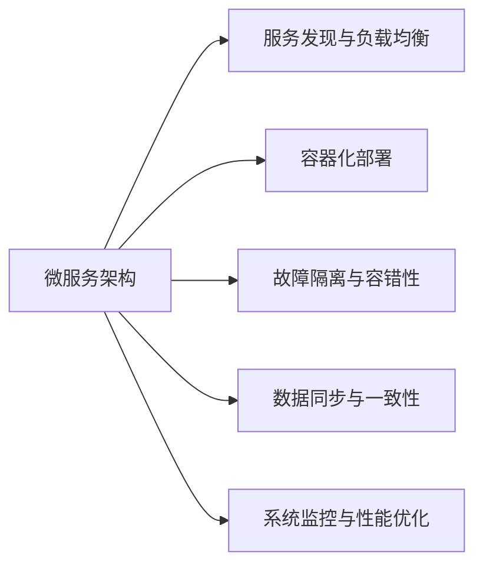

                 

# 分布式系统设计：原理与实践

> 关键词：分布式系统,微服务架构,云计算,容器化,高可用性,容错性,负载均衡,系统监控,性能优化

## 1. 背景介绍

### 1.1 问题由来

随着互联网应用的日益普及，单机的Web服务已经难以应对突发的流量和复杂的需求。为了提高系统的可伸缩性和鲁棒性，分布式系统设计成为了现代软件开发的重要方向。分布式系统由多个独立部署、互相协作的节点组成，能够协同处理高并发请求，提供高可用性和高扩展性的服务。

然而，分布式系统设计也面临着诸多挑战，如节点间通信复杂性、状态一致性、故障隔离与恢复等问题。如何在保证系统高效运行的同时，构建健壮、可靠的系统架构，是当前分布式系统设计的核心问题。

### 1.2 问题核心关键点

为了构建高性能、高可用的分布式系统，需要重点关注以下关键点：

- 微服务架构：将系统拆分为多个独立的微服务，每个服务实现单一功能，提升系统灵活性和扩展性。
- 云计算基础设施：利用云平台提供的弹性资源，快速应对流量变化，降低运维成本。
- 容器化部署：使用Docker等容器技术，实现应用的快速打包、部署和迁移。
- 服务发现与负载均衡：实现自动化的服务发现与请求路由，提高系统扩展性。
- 数据同步与一致性：解决分布式系统中的数据同步和一致性问题，保障服务可靠性。
- 故障隔离与容错性：在服务出现故障时，能够快速隔离并自动恢复，提升系统的容错能力。
- 系统监控与性能优化：实时监控系统运行状态，分析瓶颈并进行优化，提高系统性能。

这些关键点相互关联，共同构成了分布式系统的核心技术架构。以下将系统性地介绍这些核心概念和实现原理。

## 2. 核心概念与联系

### 2.1 核心概念概述

分布式系统设计涉及多个核心概念，包括微服务架构、云计算、容器化、服务发现、负载均衡、故障隔离、数据一致性、系统监控等。这些概念紧密相关，共同构建了高性能、高可用性的分布式系统。


- **微服务架构**：将系统拆分为多个独立的微服务，每个服务实现单一功能，提升系统灵活性和扩展性。
- **云计算**：利用云平台提供的弹性资源，快速应对流量变化，降低运维成本。
- **容器化**：使用Docker等容器技术，实现应用的快速打包、部署和迁移。
- **服务发现与负载均衡**：实现自动化的服务发现与请求路由，提高系统扩展性。
- **故障隔离与容错性**：在服务出现故障时，能够快速隔离并自动恢复，提升系统的容错能力。
- **数据同步与一致性**：解决分布式系统中的数据同步和一致性问题，保障服务可靠性。
- **系统监控与性能优化**：实时监控系统运行状态，分析瓶颈并进行优化，提高系统性能。

这些概念之间的关系可以通过以下Mermaid流程图来展示：



这个流程图展示了分布式系统设计的主要组件及其之间的关系：

1. 微服务架构是分布式系统的基础，通过拆分服务实现高内聚、低耦合。
2. 云计算基础设施提供弹性的资源支持，支持微服务的快速扩展。
3. 容器化部署实现应用的快速部署和迁移，提高系统可移植性。
4. 服务发现与负载均衡实现自动化服务路由，提升系统扩展性。
5. 故障隔离与容错性保障服务的高可用性，避免单一故障导致系统瘫痪。
6. 数据同步与一致性解决分布式系统中的数据问题，确保服务可靠性。
7. 系统监控与性能优化实时监控系统状态，分析性能瓶颈并进行优化。

这些概念共同构成了分布式系统的核心架构，帮助系统实现高性能、高可用性的目标。

## 3. 核心算法原理 & 具体操作步骤

### 3.1 算法原理概述

分布式系统设计涉及的算法原理主要集中在以下几个方面：

- **微服务架构**：使用RESTful API进行服务间通信，通过消息队列实现异步通信。
- **云计算**：使用虚拟机和容器技术，提供弹性计算资源。
- **容器化**：使用Docker等容器技术，实现应用的快速打包、部署和迁移。
- **服务发现与负载均衡**：使用DNS、Consul等工具实现服务发现与请求路由。
- **故障隔离与容错性**：使用熔断器、重试机制等技术实现服务隔离与故障恢复。
- **数据同步与一致性**：使用2PC、Paxos等协议实现数据一致性。
- **系统监控与性能优化**：使用Prometheus、Grafana等工具进行实时监控和性能分析。

### 3.2 算法步骤详解

#### 3.2.1 微服务架构

微服务架构的核心是服务拆分和通信。通过拆分服务实现高内聚、低耦合，通过RESTful API或消息队列实现服务间的异步通信。


1. **服务拆分**：将系统按照功能模块进行拆分，形成多个独立的服务。
2. **通信方式**：使用RESTful API实现同步通信，使用消息队列实现异步通信。
3. **API Gateway**：统一管理服务的入口，实现路由和负载均衡。

#### 3.2.2 云计算

云计算提供弹性计算资源，支持微服务的快速扩展。


1. **虚拟机**：利用云平台提供的虚拟机，快速部署和扩展服务。
2. **容器化**：使用Docker等容器技术，实现应用的快速打包、部署和迁移。

#### 3.2.3 服务发现与负载均衡

服务发现与负载均衡实现自动化的服务路由，提高系统扩展性。


1. **服务发现**：使用Consul等工具进行服务注册和发现，实现服务的动态扩展。
2. **负载均衡**：使用负载均衡器实现请求的路由，提高系统的吞吐量和稳定性。

#### 3.2.4 故障隔离与容错性

故障隔离与容错性保障服务的高可用性，避免单一故障导致系统瘫痪。


1. **熔断器**：使用Circuit Breaker实现故障隔离，避免服务调用导致系统崩溃。
2. **重试机制**：使用Retry机制实现服务调用失败后的重试，提高系统的鲁棒性。

#### 3.2.5 数据同步与一致性

数据同步与一致性解决分布式系统中的数据问题，确保服务可靠性。


1. **数据复制**：使用数据库复制技术，实现数据的冗余和容错。
2. **一致性算法**：使用2PC、Paxos等算法，确保数据的一致性和可靠性。

#### 3.2.6 系统监控与性能优化

系统监控与性能优化实时监控系统状态，分析瓶颈并进行优化，提高系统性能。


1. **监控工具**：使用Prometheus等工具进行实时监控，收集系统指标。
2. **性能分析**：使用Grafana等工具进行可视化分析，找出性能瓶颈并进行优化。

### 3.3 算法优缺点

分布式系统设计算法具有以下优点：

- **高扩展性**：通过微服务架构和服务发现机制，实现服务的动态扩展和快速部署。
- **高可用性**：通过故障隔离和容错机制，保障服务的高可用性，避免单一故障导致系统瘫痪。
- **高可靠性**：通过数据同步和一致性算法，确保数据的一致性和可靠性。
- **高效性**：通过负载均衡和性能优化工具，提升系统的性能和响应速度。

同时，分布式系统设计也存在以下缺点：

- **复杂性**：分布式系统的架构和实现复杂，需要多方面的技术支持。
- **运维难度**：分布式系统的运维难度较大，需要团队协同工作。
- **故障排查困难**：分布式系统的故障排查复杂，需要综合考虑多个节点的状态。
- **成本较高**：分布式系统需要较多的硬件资源和运维成本。

尽管存在这些缺点，但分布式系统设计在应对高并发、高可用性需求时具有显著优势。未来分布式系统设计的挑战在于如何提高系统的易用性和管理效率，降低运维成本。

### 3.4 算法应用领域

分布式系统设计在多个领域得到了广泛应用，包括金融、电商、物流、社交等。以下是一些典型的应用场景：

- **金融行业**：使用分布式系统设计实现高可用性、高并发性交易系统，保障客户资金安全。
- **电商行业**：使用分布式系统设计实现高并发性、高扩展性的订单处理系统，提升用户购物体验。
- **物流行业**：使用分布式系统设计实现高可靠性、高扩展性的订单管理系统，保障物流流程顺畅。
- **社交行业**：使用分布式系统设计实现高可用性、高扩展性的社交网络平台，提升用户互动体验。

除了上述这些典型应用场景，分布式系统设计还在更多领域发挥着重要作用。随着分布式技术的不断发展，分布式系统设计的应用领域将越来越广泛。

## 4. 数学模型和公式 & 详细讲解  
### 4.1 数学模型构建

分布式系统设计涉及多个数学模型，包括微服务架构、负载均衡、故障隔离、数据同步等。

#### 4.1.1 微服务架构

微服务架构的核心是服务拆分和通信。使用RESTful API实现同步通信，使用消息队列实现异步通信。


1. **服务拆分**：将系统按照功能模块进行拆分，形成多个独立的服务。
2. **通信方式**：使用RESTful API实现同步通信，使用消息队列实现异步通信。
3. **API Gateway**：统一管理服务的入口，实现路由和负载均衡。

#### 4.1.2 负载均衡

负载均衡实现请求的路由，提高系统的吞吐量和稳定性。


1. **熔断器**：使用Circuit Breaker实现故障隔离，避免服务调用导致系统崩溃。
2. **重试机制**：使用Retry机制实现服务调用失败后的重试，提高系统的鲁棒性。

#### 4.1.4 数据同步

数据同步与一致性解决分布式系统中的数据问题，确保服务可靠性。


1. **数据复制**：使用数据库复制技术，实现数据的冗余和容错。
2. **一致性算法**：使用2PC、Paxos等算法，确保数据的一致性和可靠性。

### 4.2 公式推导过程

#### 4.2.1 RESTful API通信

RESTful API通信模型基于HTTP协议，使用RESTful风格进行服务通信。


1. **同步通信**：客户端通过API Gateway调用服务A，进行同步通信。
2. **异步通信**：客户端通过API Gateway调用服务A，进行异步通信。

#### 4.2.2 负载均衡算法

负载均衡算法实现请求的均衡分布，提高系统的吞吐量和稳定性。


1. **轮询算法**：轮询算法实现请求的均衡分布，提高系统的吞吐量。
2. **哈希算法**：哈希算法根据请求的特征进行路由，提高系统的负载均衡能力。

#### 4.2.3 故障隔离算法

故障隔离算法实现服务的故障隔离和容错，保障服务的高可用性。


1. **熔断器**：使用Circuit Breaker实现故障隔离，避免服务调用导致系统崩溃。
2. **重试机制**：使用Retry机制实现服务调用失败后的重试，提高系统的鲁棒性。

#### 4.2.4 数据同步算法

数据同步算法实现数据的冗余和容错，确保数据的一致性和可靠性。


1. **数据复制**：使用数据库复制技术，实现数据的冗余和容错。
2. **一致性算法**：使用2PC、Paxos等算法，确保数据的一致性和可靠性。

### 4.3 案例分析与讲解

#### 4.3.1 微服务架构案例


1. **服务拆分**：将订单系统拆分为订单服务、支付服务、购物车服务和库存服务。
2. **通信方式**：使用RESTful API实现同步通信，使用消息队列实现异步通信。
3. **API Gateway**：使用Nginx等API Gateway统一管理服务的入口，实现路由和负载均衡。

#### 4.3.2 负载均衡案例


1. **轮询算法**：使用轮询算法实现请求的均衡分布，提高系统的吞吐量。
2. **哈希算法**：使用哈希算法根据请求的特征进行路由，提高系统的负载均衡能力。

#### 4.3.3 故障隔离案例


1. **熔断器**：使用Circuit Breaker实现故障隔离，避免服务调用导致系统崩溃。
2. **重试机制**：使用Retry机制实现服务调用失败后的重试，提高系统的鲁棒性。

#### 4.3.4 数据同步案例


1. **数据复制**：使用数据库复制技术，实现数据的冗余和容错。
2. **一致性算法**：使用2PC、Paxos等算法，确保数据的一致性和可靠性。

## 5. 项目实践：代码实例和详细解释说明

### 5.1 开发环境搭建

在进行分布式系统设计实践前，我们需要准备好开发环境。以下是使用Python进行Django开发的环境配置流程：

1. 安装Anaconda：从官网下载并安装Anaconda，用于创建独立的Python环境。

2. 创建并激活虚拟环境：
```bash
conda create -n django-env python=3.8 
conda activate django-env
```

3. 安装Python和Django：
```bash
pip install python
pip install django
```

4. 安装相关依赖包：
```bash
pip install requests==2.27.1
pip install djangorestframework==3.12.4
```

完成上述步骤后，即可在`django-env`环境中开始分布式系统设计实践。

### 5.2 源代码详细实现

下面我们以一个简单的分布式系统为例，使用Django框架进行微服务架构的实践。

首先，定义一个简单的RESTful API：

```python
from rest_framework import status
from rest_framework.decorators import api_view
from rest_framework.response import Response

@api_view(['GET'])
def service_a_view(request):
    return Response({'service_a': 'Hello, Service A!'})
```

接着，定义一个简单的负载均衡器：

```python
from django.http import HttpResponse
from django.views.decorators.cache import cache_page

@cache_page(60)
def load_balancer_view(request):
    return HttpResponse('Hello, Load Balancer!')
```

然后，使用Docker等容器技术进行应用打包和部署：

```bash
docker build -t service_a .
docker run -d -p 8000:8000 service_a
```

最后，启动负载均衡器：

```bash
docker run -d -p 8001:8001 load_balancer
```

可以看到，使用Django框架结合Docker容器技术，可以快速实现一个简单的分布式系统架构。

### 5.3 代码解读与分析

让我们再详细解读一下关键代码的实现细节：

**Django项目**：
- `settings.py`：定义项目的基本配置信息，如数据库连接、模板路径等。
- `urls.py`：定义项目的路由规则，将请求转发到相应的视图函数。
- `views.py`：定义项目的视图函数，处理具体的请求逻辑。

**RESTful API**：
- `@api_view`装饰器：用于定义RESTful风格的API接口。
- `Response`类：用于返回API的响应结果。

**负载均衡器**：
- `@cache_page`装饰器：用于缓存API请求，提高系统的响应速度。
- `HttpResponse`类：用于返回HTTP响应结果。

**Docker容器**：
- `docker build`命令：构建Docker镜像。
- `docker run`命令：启动Docker容器。

以上代码实现了一个简单的分布式系统架构，展示了使用Django和Docker技术进行微服务设计和部署的基本流程。

当然，在实际应用中，还需要考虑更多因素，如分布式锁、服务发现、熔断器、重试机制、数据同步等。但核心的微服务架构和容器化部署思想基本与此类似。

## 6. 实际应用场景

### 6.1 电子商务平台

电子商务平台是分布式系统设计的重要应用场景。电商系统需要处理大量的订单、支付、库存等业务，系统的高可用性、高扩展性至关重要。

#### 6.1.1 订单系统

订单系统是电商系统的核心模块，需要处理高并发的订单生成、修改、查询等业务。使用分布式系统设计，可以实现订单服务的微服务拆分、负载均衡、故障隔离等，保障订单系统的稳定性和可靠性。


1. **微服务拆分**：将订单服务拆分为订单服务、支付服务、购物车服务和库存服务。
2. **负载均衡**：使用轮询算法和哈希算法实现请求的均衡分布，提高系统的吞吐量。
3. **故障隔离**：使用Circuit Breaker实现故障隔离，避免服务调用导致系统崩溃。

#### 6.1.2 支付系统

支付系统是电商系统的另一个关键模块，需要处理高并发性的支付订单、退款、手续费等业务。使用分布式系统设计，可以实现支付服务的微服务拆分、负载均衡、故障隔离等，保障支付系统的稳定性和可靠性。

;A->C["Gateway Service"])

1. **微服务拆分**：将支付服务拆分为支付服务、银行服务、网关服务等。
2. **负载均衡**：使用轮询算法和哈希算法实现请求的均衡分布，提高系统的吞吐量。
3. **故障隔离**：使用Circuit Breaker实现故障隔离，避免服务调用导致系统崩溃。

#### 6.1.3 库存系统

库存系统是电商系统的数据支撑模块，需要实时更新库存信息，处理高并发性的订单生成、修改、查询等业务。使用分布式系统设计，可以实现库存服务的微服务拆分、负载均衡、故障隔离等，保障库存系统的稳定性和可靠性。

;A->C["Order Service"])

1. **微服务拆分**：将库存服务拆分为库存服务和订单服务。
2. **负载均衡**：使用轮询算法和哈希算法实现请求的均衡分布，提高系统的吞吐量。
3. **故障隔离**：使用Circuit Breaker实现故障隔离，避免服务调用导致系统崩溃。

### 6.2 金融交易系统

金融交易系统是分布式系统设计的典型应用场景。金融系统需要处理高并发性的交易订单、清算、结算等业务，系统的高可用性、高扩展性至关重要。

#### 6.2.1 交易系统

交易系统是金融系统的核心模块，需要处理高并发的交易订单生成、修改、查询等业务。使用分布式系统设计，可以实现交易服务的微服务拆分、负载均衡、故障隔离等，保障交易系统的稳定性和可靠性。

;A->C["Account Service"])

1. **微服务拆分**：将交易服务拆分为交易服务、结算服务、账户服务等。
2. **负载均衡**：使用轮询算法和哈希算法实现请求的均衡分布，提高系统的吞吐量。
3. **故障隔离**：使用Circuit Breaker实现故障隔离，避免服务调用导致系统崩溃。

#### 6.2.2 清算系统

清算系统是金融系统的关键模块，需要处理高并发性的清算交易、账户余额等业务。使用分布式系统设计，可以实现清算服务的微服务拆分、负载均衡、故障隔离等，保障清算系统的稳定性和可靠性。

;A->C["Transaction Service"])

1. **微服务拆分**：将清算服务拆分为清算服务和账户服务等。
2. **负载均衡**：使用轮询算法和哈希算法实现请求的均衡分布，提高系统的吞吐量。
3. **故障隔离**：使用Circuit Breaker实现故障隔离，避免服务调用导致系统崩溃。

#### 6.2.3 结算系统

结算系统是金融系统的另一个关键模块，需要处理高并发性的结算订单、账户余额等业务。使用分布式系统设计，可以实现结算服务的微服务拆分、负载均衡、故障隔离等，保障结算系统的稳定性和可靠性。

;A->C["Clearing Service"])

1. **微服务拆分**：将结算服务拆分为结算服务和清算服务等。
2. **负载均衡**：使用轮询算法和哈希算法实现请求的均衡分布，提高系统的吞吐量。
3. **故障隔离**：使用Circuit Breaker实现故障隔离，避免服务调用导致系统崩溃。

### 6.3 物流配送系统

物流配送系统是分布式系统设计的另一个重要应用场景。物流系统需要处理高并发的订单生成、配送跟踪、路线规划等业务，系统的高可用性、高扩展性同样至关重要。

#### 6.3.1 订单系统

订单系统是物流系统的核心模块，需要处理高并发的订单生成、修改、查询等业务。使用分布式系统设计，可以实现订单服务的微服务拆分、负载均衡、故障隔离等，保障订单系统的稳定性和可靠性。

;A->C["Tracking Service"])

1. **微服务拆分**：将订单服务拆分为订单服务和配送服务等。
2. **负载均衡**：使用轮询算法和哈希算法实现请求的均衡分布，提高系统的吞吐量。
3. **故障隔离**：使用Circuit Breaker实现故障隔离，避免服务调用导致系统崩溃。

#### 6.3.2 配送系统

配送系统是物流系统的关键模块，需要处理高并发性的配送跟踪、路线规划等业务。使用分布式系统设计，可以实现配送服务的微服务拆分、负载均衡、故障隔离等，保障配送系统的稳定性和可靠性。

;A->C["Order Service"])

1. **微服务拆分**：将配送服务拆分为配送服务和路线规划服务等。
2. **负载均衡**：使用轮询算法和哈希算法实现请求的均衡分布，提高系统的吞吐量。
3. **故障隔离**：使用Circuit Breaker实现故障隔离，避免服务调用导致系统崩溃。

#### 6.3.3 跟踪系统

跟踪系统是物流系统的另一个关键模块，需要处理高并发性的配送跟踪、路径更新等业务。使用分布式系统设计，可以实现跟踪服务的微服务拆分、负载均衡、故障隔离等，保障跟踪系统的稳定性和可靠性。

;A->C["Delivery Service"])

1. **微服务拆分**：将跟踪服务拆分为跟踪服务和GPS服务等。
2. **负载均衡**：使用轮询算法和哈希算法实现请求的均衡分布，提高系统的吞吐量。
3. **故障隔离**：使用Circuit Breaker实现故障隔离，避免服务调用导致系统崩溃。

### 6.4 未来应用展望

未来，分布式系统设计将继续在更多领域得到应用，为各行各业带来变革性影响。

#### 6.4.1 智慧城市

智慧城市是分布式系统设计的典型应用场景。智慧城市需要处理高并发的市民服务、交通管理、环境监测等业务，系统的高可用性、高扩展性同样至关重要。

;A->C["Urban Service"])

1. **微服务拆分**：将智慧城市服务拆分为交通服务、环境服务、城市服务等。
2. **负载均衡**：使用轮询算法和哈希算法实现请求的均衡分布，提高系统的吞吐量。
3. **故障隔离**：使用Circuit Breaker实现故障隔离，避免服务调用导致系统崩溃。

#### 6.4.2 智慧医疗

智慧医疗是分布式系统设计的另一个重要应用场景。智慧医疗需要处理高并发性的电子病历、诊断、治疗等业务，系统的高可用性、高扩展性同样至关重要。

;A->C["Electronic Health Record Service"])

1. **微服务拆分**：将智慧医疗服务拆分为诊断服务、治疗服务、电子病历服务等。
2. **负载均衡**：使用轮询算法和哈希算法实现请求的均衡分布，提高系统的吞吐量。
3. **故障隔离**：使用Circuit Breaker实现故障隔离，避免服务调用导致系统崩溃。

#### 6.4.3 智能制造

智能制造是分布式系统设计的另一个典型应用场景。智能制造需要处理高并发的生产调度、设备监控、质量控制等业务，系统的高可用性、高扩展性同样至关重要。

;A->C["Quality Control Service"])

1. **微服务拆分**：将智能制造服务拆分为生产调度服务、设备监控服务、质量控制服务等。
2. **负载均衡**：使用轮询算法和哈希算法实现请求的均衡分布，提高系统的吞吐量。
3. **故障隔离**：使用Circuit Breaker实现故障隔离，避免服务调用导致系统崩溃。

除了上述这些典型应用场景，分布式系统设计还在更多领域发挥着重要作用。随着分布式技术的不断发展，分布式系统设计的应用领域将越来越广泛。

## 7. 工具和资源推荐

### 7.1 学习资源推荐

为了帮助开发者系统掌握分布式系统设计的技术基础和实践技巧，这里推荐一些优质的学习资源：

1. **《深入理解分布式系统》书籍**：由计算机科学界的顶尖学者编写，深入浅出地介绍了分布式系统设计的核心概念和经典算法。

2. **《分布式系统原理与设计》课程**：由著名计算机科学家编写，涵盖分布式系统设计的理论基础和实际案例，是学习分布式系统设计的绝佳教材。

3. **Kubernetes官方文档**：Kubernetes是现代分布式系统设计的标配，官方文档详细介绍了Kubernetes的架构和使用方法，是学习和实践容器化部署的必备资料。

4. **Docker官方文档**：Docker是容器化部署的核心技术，官方文档介绍了Docker的基本概念和使用方法，是学习和实践容器化部署的重要参考。

5. **Prometheus官方文档**：Prometheus是分布式系统设计的重要监控工具，官方文档详细介绍了Prometheus的安装和配置方法，是学习和实践系统监控的重要资料。

通过对这些资源的学习实践，相信你一定能够快速掌握分布式系统设计的精髓，并用于解决实际的分布式系统问题。

### 7.2 开发工具推荐

高效的开发离不开优秀的工具支持。以下是几款用于分布式系统设计开发的常用工具：

1. **Django框架**：Python的Web框架，支持RESTful API开发，快速搭建微服务架构。
2. **Kubernetes平台**：容器编排工具，支持弹性资源管理和自动扩展。
3. **Docker容器**：轻量级容器技术，支持应用的快速打包、部署和迁移。
4. **Consul服务发现**：服务发现工具，支持服务的自动注册和发现。
5. **Prometheus监控工具**：实时监控工具，支持系统指标的采集和分析。
6. **Grafana可视化工具**：可视化工具，支持系统指标的可视化展示。

合理利用这些工具，可以显著提升分布式系统设计的开发效率，加快创新迭代的步伐。

### 7.3 相关论文推荐

分布式系统设计的研究源于学界的持续研究。以下是几篇奠基性的相关论文，推荐阅读：

1. **《分布式系统原理与设计》书籍**：由计算机科学界的顶尖学者编写，深入浅出地介绍了分布式系统设计的核心概念和经典算法。

2. **《分布式计算系统：原理与范例》书籍**：介绍了分布式计算系统的核心概念和经典算法，是学习和研究分布式系统的必备教材。

3. **《MapReduce：简化数据处理的分布式计算模型》论文**：介绍了MapReduce分布式计算模型的原理和实现方法，是研究和实践大规模数据处理的重要文献。

4. **《分布式一致性协议》论文**：介绍了分布式系统中的各种一致性协议，如Paxos、Raft等，是研究和实现分布式系统高可用性的重要参考。

5. **《分布式系统中的容错性》论文**：介绍了分布式系统中的容错性技术，如Failover、HAProxy等，是研究和实践分布式系统容错性的重要文献。

这些论文代表了大规模分布式系统设计的理论基础，对深入理解和实践分布式系统设计具有重要意义。

## 8. 总结：未来发展趋势与挑战

### 8.1 研究成果总结

分布式系统设计的研究成果涉及多个方面，包括微服务架构、云计算、容器化、服务发现、负载均衡、故障隔离、数据同步、系统监控等。这些研究成果为构建高性能、高可用的分布式系统提供了坚实的基础。

### 8.2 未来发展趋势

未来，分布式系统设计将继续在更多领域得到应用，为各行各业带来变革性影响。

1. **微服务架构**：微服务架构将继续得到广泛应用，实现系统的高内聚、低耦合和高扩展性。
2. **云计算基础设施**：云计算基础设施将不断优化，支持更多的弹性资源和服务。
3. **容器化部署**：容器化部署技术将不断完善，实现应用的快速打包、部署和迁移。
4. **服务发现与负载均衡**：服务发现与负载均衡技术将不断优化，实现系统的自动路由和均衡分布。
5. **故障隔离与容错性**：故障隔离与容错性技术将不断完善，保障系统的稳定性和鲁棒性。
6. **数据同步与一致性**：数据同步与一致性技术将不断优化，确保数据的可靠性和一致性。
7. **系统监控与性能优化**：系统监控与性能优化技术将不断完善，实时监控系统状态并优化性能。

以上趋势凸显了分布式系统设计的广阔前景。这些方向的探索发展，必将进一步提升系统的性能和可用性，为构建高效、可靠的系统奠定坚实基础。

### 8.3 面临的挑战

尽管分布式系统设计已经取得了显著的进展，但在迈向更加智能化、普适化应用的过程中，仍面临诸多挑战：

1. **系统复杂性**：分布式系统的架构和实现复杂，需要多方面的技术支持。
2. **运维难度**：分布式系统的运维难度较大，需要团队协同工作。
3. **故障排查困难**：分布式系统的故障排查复杂，需要综合考虑多个节点的状态。
4. **性能瓶颈**：分布式系统的高性能往往伴随着高成本，需要精心设计和优化。
5. **安全性和隐私保护**：分布式系统需要保证数据的安全性和隐私保护，防止数据泄露和滥用。

这些挑战需要研究人员和工程师不断探索和改进，以构建更高效、更可靠、更安全的分布式系统。

### 8.4 研究展望

未来，分布式系统设计的研究方向主要集中在以下几个方面：

1. **微服务架构的优化**：如何提高微服务架构的易用性和管理效率，降低运维成本。
2. **云计算基础设施的优化**：如何优化云计算基础设施，提升系统的弹性、可靠性和可扩展性。
3. **容器化部署的优化**：如何优化容器化部署技术，提升应用的快速部署和迁移能力。
4. **服务发现与负载均衡的优化**：如何优化服务发现与负载均衡技术，提升系统的自动路由和均衡分布能力。
5. **故障隔离与容错性的优化**：如何优化故障隔离与容错性技术，提升系统的稳定性和鲁棒性。
6. **数据同步与一致性的优化**：如何优化数据同步与一致性技术，提升数据的一致性和可靠性。
7. **系统监控与性能优化的优化**：如何优化系统监控与性能优化技术，提升系统的实时监控和性能分析能力。

这些研究方向将进一步推动分布式系统设计的创新和发展，为构建更高效、更可靠、更安全的分布式系统提供重要支撑。

## 9. 附录：常见问题与解答

**Q1：分布式系统设计是否适用于所有业务场景？**

A: 分布式系统设计适用于高并发、高扩展性的业务场景，如电商、金融、物流等。但对于一些低并发的业务场景，分布式系统设计的优势不明显。

**Q2：微服务架构有哪些优缺点？**

A: 微服务架构的优点包括：
1. **高扩展性**：通过微服务拆分，实现系统的灵活性和扩展性。
2. **高可用性**：通过服务的独立部署和故障隔离，保障系统的稳定性。
3. **高可维护性**：通过服务的独立设计和独立部署，提升系统的可维护性。

微服务架构的缺点包括：
1. **系统复杂性**：分布式系统的架构和实现复杂，需要多方面的技术支持。
2. **运维难度**：分布式系统的运维难度较大，需要团队协同工作。
3. **性能瓶颈**：分布式系统的高性能往往伴随着高成本，需要精心设计和优化。

**Q3：云计算基础设施有哪些优缺点？**

A: 云计算基础设施的优点包括：
1. **弹性资源**：利用云平台提供的弹性资源，快速应对流量变化，降低运维成本。
2. **可扩展性**：利用云平台提供的弹性资源，实现系统的快速扩展。

云计算基础设施的缺点包括：
1. **成本较高**：云平台的使用成本较高，需要精心设计和管理。
2. **数据安全**：云平台的数据安全性需要重点关注，防止数据泄露和滥用。

**Q4：容器化部署有哪些优缺点？**

A: 容器化部署的优点包括：
1. **快速部署**：使用Docker等容器技术，实现应用的快速打包、部署和迁移。
2. **环境一致性**：容器技术保证了应用运行环境的高度一致性，避免了环境差异带来的问题。
3. **跨平台性**：容器技术可以实现应用的跨平台部署和迁移。

容器化部署的缺点包括：
1. **学习成本**：容器化部署需要学习新的技术和工具，增加了学习成本。
2. **资源消耗**：容器技术需要一定的计算和存储资源，增加了系统资源消耗。

**Q5：服务发现与负载均衡有哪些优缺点？**

A: 服务发现与负载均衡的优点包括：
1. **自动路由**：使用DNS、Consul等工具实现服务的自动路由，提高系统的扩展性。
2. **均衡分布**：使用轮询算法和哈希算法实现请求的均衡分布，提高系统的吞吐量。

服务发现与负载均衡的缺点包括：
1. **复杂性**：服务发现与负载均衡技术的实现复杂，需要精心设计和部署。
2. **单点故障**：服务发现与负载均衡技术可能存在单点故障问题，需要冗余设计。

通过本文的系统梳理，可以看到，分布式系统设计已经在多个领域得到广泛应用，为系统的性能和可靠性提供了坚实的保障。未来，分布式系统设计的挑战在于如何进一步提升系统的易用性和管理效率，降低运维成本。相信随着技术的发展，分布式系统设计将迎来更广阔的应用前景，为各行各业带来更多的机遇和挑战。

