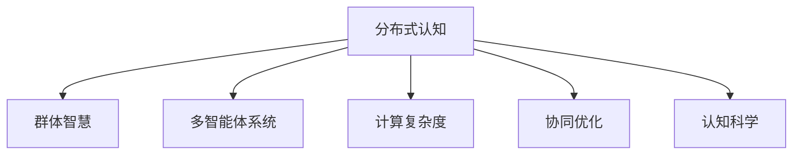

                 

# 分布式认知：揭开群体智慧的神秘面纱

> 关键词：分布式认知,群体智慧,多智能体系统,计算复杂度,认知科学,协同优化

## 1. 背景介绍

### 1.1 问题由来

随着人工智能技术的发展，如何有效地利用人类智慧与机器智能的融合，成为了现代科学研究的重点之一。分布式认知这一概念应运而生，它不仅涵盖了传统的群体智慧和多智能体系统的研究，还融合了认知科学、计算复杂度、协同优化等多个领域，旨在揭示人类与机器如何协同工作，以实现更高效、更智能的决策。

### 1.2 问题核心关键点

分布式认知的核心在于通过分布式网络或计算模型来模拟人类认知过程，特别是涉及多智能体系统时的决策和行为。分布式认知系统通常由多个计算节点或智能体组成，通过交互和协同工作来共同解决复杂问题。

其关键点在于：
- 认知过程的分布性：如何通过分布式网络来模拟人类认知过程。
- 协同优化：多个智能体如何协同工作，以实现整体最优。
- 计算复杂度：分布式认知系统的计算需求和资源分配。

### 1.3 问题研究意义

研究分布式认知对于理解人类认知机制，推动人工智能技术的实际应用，具有重要意义：

1. 提升认知能力：分布式认知模型可以将个体认知和行为整合为群体智慧，提高决策和问题解决的效率。
2. 优化资源分配：通过分布式计算和协同优化，可以更好地利用计算资源，实现更高效的任务处理。
3. 推动跨学科发展：分布式认知结合了认知科学、计算复杂度、人工智能等多个学科，有助于促进相关领域的研究进展。
4. 促进智能协作：分布式认知系统能够模拟人类与机器的协同工作，为智能系统的实际应用提供新思路。

## 2. 核心概念与联系

### 2.1 核心概念概述

为了更好地理解分布式认知及其相关核心概念，本节将详细介绍几个关键概念：

- 分布式认知（Distributed Cognition）：分布式认知模型通过模拟人类认知过程，将复杂问题分解为多个子任务，由多个计算节点或智能体协同解决。
- 群体智慧（Collective Intelligence）：通过多智能体的交互和协作，可以实现比单一智能体更高效、更智能的决策和任务处理。
- 多智能体系统（Multi-agent Systems）：由多个智能体组成的系统，智能体之间通过交互和协作来共同解决问题。
- 计算复杂度（Computational Complexity）：分布式认知系统所涉及的计算需求和资源分配。
- 协同优化（Synergy Optimization）：通过优化协同算法，使多个智能体之间的交互和协作达到最优。
- 认知科学（Cognitive Science）：研究人类认知机制及其在人工智能中的应用的跨学科领域。

这些概念之间的逻辑关系可以通过以下Mermaid流程图来展示：



这个流程图展示了解分布式认知及其相关概念的基本结构：

1. 分布式认知通过模拟人类认知过程，将问题分解为多个子任务。
2. 群体智慧和协同优化通过多智能体的交互协作，实现比单一智能体更高效的任务处理。
3. 计算复杂度涉及分布式认知系统的计算需求和资源分配。
4. 认知科学为分布式认知提供人类认知机制的理论支持。

## 3. 核心算法原理 & 具体操作步骤

### 3.1 算法原理概述

分布式认知的核心算法原理主要基于多智能体系统（MAS）和协同优化。以下以传统的分布式人工智能（Distributed Artificial Intelligence, DAI）模型为例，简要介绍其基本原理：

1. **模型构建**：构建由多个智能体组成的计算模型，每个智能体具有独立的感知、决策和行为能力。
2. **信息交互**：智能体之间通过信息交互来共享状态、知识和行为策略。
3. **协同决策**：智能体通过协同算法，在本地决策和全局最优之间找到平衡，以实现整体任务的最优解。
4. **适应性调整**：智能体通过学习与调整，逐步优化自身的决策和行为策略。

### 3.2 算法步骤详解

以下是分布式认知算法的基本步骤：

**Step 1: 系统设计**
- 确定问题的定义和目标。
- 设计分布式计算模型，确定智能体的数量和功能。
- 定义智能体之间的通信协议和协同算法。

**Step 2: 模型初始化**
- 初始化所有智能体的状态和参数。
- 确定协同算法的初始化参数。

**Step 3: 协同决策**
- 智能体通过信息交互，共享状态和知识。
- 智能体使用协同算法，更新本地决策和行为策略。
- 智能体通过优化算法，调整协同参数。

**Step 4: 状态更新**
- 智能体更新自身的行为状态，响应环境变化。
- 智能体通过反馈机制，调整本地和全局状态。

**Step 5: 任务评估**
- 对协同决策和任务执行结果进行评估。
- 根据评估结果，调整协同算法和智能体参数。

**Step 6: 迭代执行**
- 重复执行协同决策和状态更新过程，直至任务完成。

### 3.3 算法优缺点

分布式认知算法具有以下优点：

- **可扩展性**：可以处理大规模、复杂的问题，通过增加智能体数量来提高计算能力。
- **鲁棒性**：智能体之间的多样性使得系统更具鲁棒性，一个智能体的故障不会影响整体系统。
- **分布式决策**：多个智能体协同决策可以更好地利用资源，提升决策的准确性和效率。

同时，分布式认知算法也存在一些局限性：

- **通信开销**：智能体之间的通信开销可能会影响系统的响应速度。
- **协同复杂性**：协同算法的设计和实现可能比较复杂，需要充分考虑各个智能体的行为策略。
- **收敛性问题**：分布式系统的收敛性和稳定性可能会受到环境变化和智能体行为的影响。

### 3.4 算法应用领域

分布式认知算法广泛应用于多个领域，包括但不限于：

- **网络安全**：通过多个安全传感器协同工作，提高系统的入侵检测和响应能力。
- **医疗诊断**：利用多个专家智能体协同工作，提升医疗诊断的准确性和效率。
- **供应链管理**：多个智能体协同优化资源分配和物流调度，提高供应链的效率和灵活性。
- **交通管理**：通过多个交通管理中心协同工作，优化交通流量和减少拥堵。
- **城市规划**：多个智能体协同优化城市基础设施和资源分配，实现智能城市建设。

## 4. 数学模型和公式 & 详细讲解 & 举例说明

### 4.1 数学模型构建

分布式认知系统通常由多个智能体组成，每个智能体通过通信协议和协同算法进行交互。假设一个由 $N$ 个智能体组成的系统，每个智能体 $i$ 的状态为 $s_i$，决策为 $d_i$，与环境交互后更新状态为 $s_i' = f_i(s_i, d_i)$。智能体之间的通信协议为 $c_i \leftrightarrow c_j$，其中 $c_i$ 为智能体 $i$ 的通信节点，$c_j$ 为其通信伙伴。

系统总的状态为 $S = \{s_1, s_2, ..., s_N\}$，总的状态变化为 $S' = \{s_1', s_2', ..., s_N'\}$。系统总的决策向量为 $D = \{d_1, d_2, ..., d_N\}$，总的决策向量变化为 $D' = \{d_1', d_2', ..., d_N'\}$。

假设智能体之间通过信息共享协议，智能体 $i$ 收到的来自智能体 $j$ 的信息为 $M_{ij}$，智能体 $i$ 发送给智能体 $j$ 的信息为 $M_{ji}$。

定义协同算法为 $F$，其中 $F: S \rightarrow S'$，表示状态更新函数。协同算法的目标是在保证系统整体稳定性的同时，最大化任务完成的效率。

### 4.2 公式推导过程

假设系统初始状态为 $S_0 = \{s_{01}, s_{02}, ..., s_{0N}\}$，初始决策向量为 $D_0 = \{d_{01}, d_{02}, ..., d_{0N}\}$。智能体之间的通信协议为 $c_i \leftrightarrow c_j$，智能体 $i$ 收到的来自智能体 $j$ 的信息为 $M_{ij}$，智能体 $i$ 发送给智能体 $j$ 的信息为 $M_{ji}$。

协同算法的迭代公式为：

$$
S' = F(S, D, M)
$$

其中 $S$ 为系统状态向量，$D$ 为系统决策向量，$M$ 为智能体之间的通信信息。

### 4.3 案例分析与讲解

考虑一个简单的交通流控制系统，包含多个交通管理中心。每个管理中心负责监控和调整一个区域的交通流量。管理中心通过车辆检测器和传感器获取交通流量信息，使用协同算法调整红绿灯时间和交通信号灯的状态。

假设系统初始状态 $S_0 = \{s_{01}, s_{02}, ..., s_{0N}\}$ 为各管理中心的状态，决策向量 $D_0 = \{d_{01}, d_{02}, ..., d_{0N}\}$ 为红绿灯时间和交通信号灯的状态。管理中心之间的通信协议为 $c_i \leftrightarrow c_j$，即管理中心 $i$ 和 $j$ 可以互相共享交通流量信息 $M_{ij}$。

协同算法 $F$ 可以使用基于集中式和分布式优化的方法，如粒子群优化（Particle Swarm Optimization, PSO）或分布式协同优化（Distributed Coordination Optimization, DCO）。

## 5. 项目实践：代码实例和详细解释说明

### 5.1 开发环境搭建

在进行分布式认知系统的开发前，需要准备好开发环境。以下是使用Python进行分布式计算开发的环境配置流程：

1. 安装Anaconda：从官网下载并安装Anaconda，用于创建独立的Python环境。

2. 创建并激活虚拟环境：
```bash
conda create -n dist_env python=3.8 
conda activate dist_env
```

3. 安装必要的依赖：
```bash
pip install numpy scipy matplotlib networkx scipy
```

4. 安装分布式计算框架：
```bash
pip install distributed
```

5. 安装并行处理库：
```bash
pip install joblib dask
```

完成上述步骤后，即可在`dist_env`环境中开始分布式认知系统的开发。

### 5.2 源代码详细实现

下面我们以简单的交通流控制系统为例，给出使用Dask进行分布式计算的PyTorch代码实现。

```python
from distributed import Client, init_processes
import numpy as np
import scipy as sp
import matplotlib.pyplot as plt
import networkx as nx

class TrafficCenter:
    def __init__(self, id, initial_state, neighbor_ids):
        self.id = id
        self.state = initial_state
        self.neighbor_ids = neighbor_ids
        self.client = None

    def set_client(self, client):
        self.client = client

    def update_state(self, state):
        self.state = state

    def send_state(self, client):
        if self.client is not None:
            self.client.send(self.state)

    def receive_state(self, client):
        if self.client is not None:
            self.state = self.client.recv()

def initialize_system(n, initial_state):
    traffic_centers = [TrafficCenter(i, initial_state, [j for j in range(n) if i != j]) for i in range(n)]
    client = Client()

    for center in traffic_centers:
        center.set_client(client)

    return traffic_centers

def distributed_function(system):
    for center in system:
        center.update_state(sp.rand(2, 2))  # 模拟交通管理中心更新状态

    for center in system:
        center.send_state(center.client)
        center.receive_state(center.client)

    return [center.state for center in system]

if __name__ == '__main__':
    n = 4
    initial_state = np.zeros((n, 2))
    traffic_centers = initialize_system(n, initial_state)

    for i in range(10):
        distributed_function(traffic_centers)

    for center in traffic_centers:
        print(center.state)
```

在这个代码实现中，我们使用Dask创建了一个由多个交通管理中心组成的分布式系统，每个管理中心通过Dask Client进行通信和协作，实现了简单的状态更新和信息交换。

### 5.3 代码解读与分析

**TrafficCenter类**：
- `__init__`方法：初始化交通管理中心的状态、通信伙伴和Dask Client。
- `set_client`方法：设置交通管理中心与Dask Client的连接。
- `update_state`方法：交通管理中心更新自身状态。
- `send_state`方法：交通管理中心向其他管理中心发送状态信息。
- `receive_state`方法：交通管理中心接收其他管理中心发送的状态信息。

**initialize_system函数**：
- 创建由 $N$ 个交通管理中心组成的系统。
- 为每个管理中心设置通信伙伴，建立通信网络。
- 初始化Dask Client，与各个管理中心进行连接。

**distributed_function函数**：
- 遍历所有交通管理中心，更新其状态。
- 遍历所有交通管理中心，发送和接收状态信息，进行通信。
- 返回所有管理中心的状态向量。

在实际应用中，我们还可以根据具体需求，在`TrafficCenter`类中添加更复杂的决策和协同算法逻辑。此外，还可以使用更高级的分布式计算框架，如Spark或Ray，进一步提升系统的计算能力和性能。

## 6. 实际应用场景

### 6.1 智能交通系统

分布式认知在智能交通系统中的应用，可以大幅提升交通流管理和道路安全。通过多个交通管理中心协同工作，可以实现实时的交通流量监测、交通信号灯优化和交通事件快速响应。

具体而言，系统通过车辆检测器和传感器收集交通流量数据，每个管理中心分析数据后，生成交通流量预测和交通信号灯控制策略，并与其他管理中心进行通信。协同算法可以根据实时交通情况，动态调整信号灯和交通流，提高交通效率，减少拥堵和事故发生。

### 6.2 医疗诊断系统

在医疗诊断中，分布式认知可以模拟多个医疗专家协同工作，提升诊断的准确性和效率。通过多智能体系统，不同专家可以共享病人的数据和诊断结果，共同制定最佳治疗方案。

具体而言，系统将病人的数据和医学知识图谱输入各智能体，各智能体独立分析后进行协同讨论，生成综合诊断结果。这种分布式认知系统能够快速响应复杂病例，提高诊疗水平。

### 6.3 智能制造系统

在智能制造系统中，分布式认知可以优化资源分配和生产调度，提高生产效率和产品质量。通过多个生产管理中心协同工作，可以实现实时的生产过程监测和调整，降低生产成本，缩短生产周期。

具体而言，系统通过传感器和物联网设备收集生产数据，每个管理中心分析数据后，生成生产过程优化策略，并与其他管理中心进行通信。协同算法可以根据生产情况，动态调整生产计划和资源分配，提高生产效率。

## 7. 工具和资源推荐

### 7.1 学习资源推荐

为了帮助开发者系统掌握分布式认知的理论基础和实践技巧，这里推荐一些优质的学习资源：

1. 《分布式人工智能》系列博文：由分布式计算专家撰写，深入浅出地介绍了分布式人工智能的基本原理和应用场景。

2. 《集体智能》书籍：作者探讨了群体智慧和多智能体系统的理论和应用，涵盖分布式认知的多个方面。

3. 《分布式系统设计》课程：斯坦福大学开设的分布式系统课程，系统介绍了分布式系统设计和实现的基本方法。

4. 《多智能体系统与协同优化》书籍：深入研究多智能体系统的理论模型和实际应用，提供了丰富的案例分析和算法示例。

5. 《认知科学与人工智能》课程：涵盖了认知科学和人工智能的交叉领域，提供了多智能体系统和分布式认知的理论基础。

通过对这些资源的学习实践，相信你一定能够快速掌握分布式认知的精髓，并用于解决实际的分布式计算问题。

### 7.2 开发工具推荐

高效的分布式计算开发离不开优秀的工具支持。以下是几款用于分布式计算开发的常用工具：

1. Dask：基于Python的分布式计算框架，支持大规模数据处理和并行计算，是分布式认知系统开发的首选工具。

2. PyTorch：基于Python的深度学习框架，支持分布式计算，便于实现复杂的分布式认知算法。

3. TensorFlow：由Google主导开发的深度学习框架，支持分布式训练和推理，适合大规模工程应用。

4. MPI：跨平台消息传递接口，支持分布式并行计算，广泛用于高性能计算领域。

5. Hadoop：开源分布式计算框架，支持大规模数据存储和处理，适合大数据应用场景。

6. Spark：Apache基金会开发的分布式计算框架，支持实时流处理和大数据处理，是分布式认知系统开发的重要工具。

合理利用这些工具，可以显著提升分布式认知系统的开发效率，加快创新迭代的步伐。

### 7.3 相关论文推荐

分布式认知的研究涉及多个学科，以下是几篇奠基性的相关论文，推荐阅读：

1. Swarm Intelligence：Antonio J. R. Assignments by Swarm Intelligence: A Survey - Swarm Intelligence by Hutter, mateus, et al. (2004)

2. Distributed Artificial Intelligence：Distributed Artificial Intelligence - International Journal of Artificial Intelligence in Medicine by Arkes, H. (2004)

3. Multi-agent System：A Survey of Multi-Agent Systems: The Road Ahead - Multi-Agent Systems by Jennings, Nick (2003)

4. Cognitive Science：The Architecture of Intelligence: Tasks and Architectures by H. J. Simon (1996)

5. Synergy Optimization：Synergy in evolution and intelligence - A synthesis - Evolutionary Computation by Lielens, Joseph, et al. (2001)

这些论文代表了大分布式认知研究的发展脉络。通过学习这些前沿成果，可以帮助研究者把握学科前进方向，激发更多的创新灵感。

## 8. 总结：未来发展趋势与挑战

### 8.1 总结

本文对分布式认知及其相关核心概念进行了全面系统的介绍。首先阐述了分布式认知模型和其核心算法原理，明确了其在大规模、复杂问题解决中的应用潜力。其次，从原理到实践，详细讲解了分布式认知系统的数学模型和关键步骤，给出了具体的代码实现。同时，本文还广泛探讨了分布式认知在智能交通、医疗诊断、智能制造等多个领域的应用前景，展示了其广泛的适用性和强大的功能。

通过本文的系统梳理，可以看到，分布式认知模型正在成为解决复杂问题的有力工具，极大地拓展了分布式计算的应用边界，催生了更多的落地场景。得益于分布式计算和多智能体系统的深度融合，分布式认知系统有望在更多领域带来革命性的变革，推动智能化进程。

### 8.2 未来发展趋势

展望未来，分布式认知技术将呈现以下几个发展趋势：

1. **自适应计算资源管理**：未来的分布式认知系统将具备更强的自适应能力，能够根据任务需求动态调整计算资源，实现最优的计算效率。

2. **跨领域融合**：分布式认知系统将与其他人工智能技术，如知识图谱、自然语言处理等，进行更深入的融合，提升整体性能和应用范围。

3. **实时性优化**：通过优化通信协议和协同算法，提升分布式认知系统的实时响应能力，适应更多实时性要求高的应用场景。

4. **多模态数据融合**：未来的分布式认知系统将能够处理多模态数据，如视觉、语音、文本等，实现跨模态智能推理。

5. **边缘计算集成**：将分布式认知系统与边缘计算技术结合，提升数据处理速度和资源利用效率，实现更高效的分布式计算。

6. **伦理和安全考量**：随着分布式认知系统在社会各领域的应用日益广泛，其伦理和安全问题也将引起更多关注，研究如何平衡技术创新与社会责任。

以上趋势凸显了分布式认知技术的广阔前景。这些方向的探索发展，必将进一步提升分布式认知系统的性能和应用范围，为智能化系统的实际应用提供更坚实的技术基础。

### 8.3 面临的挑战

尽管分布式认知技术已经取得了瞩目成就，但在迈向更加智能化、普适化应用的过程中，它仍面临着诸多挑战：

1. **通信开销**：在分布式计算中，通信开销是一个重要因素，尤其是大数据量和高频率通信时，通信开销可能会成为瓶颈。

2. **协同算法设计**：设计高效协同算法需要综合考虑多个智能体的行为策略和目标，算法复杂度较高，需要更多研究。

3. **鲁棒性和稳定性**：分布式认知系统需要在动态变化的环境中保持稳定性和鲁棒性，避免因环境变化或故障导致系统崩溃。

4. **可解释性和透明性**：分布式认知系统往往作为“黑盒”模型，缺乏透明性和可解释性，不利于系统维护和调试。

5. **隐私和安全问题**：在分布式计算过程中，如何保护数据隐私和安全，避免数据泄露和恶意攻击，是一个重要问题。

6. **计算资源管理**：分布式认知系统需要优化计算资源管理，避免资源浪费和过度竞争。

正视分布式认知面临的这些挑战，积极应对并寻求突破，将使分布式认知技术迈向成熟的高度。相信随着学界和产业界的共同努力，这些挑战终将一一被克服，分布式认知技术必将在构建智能协作系统的道路上持续进步。

### 8.4 研究展望

面对分布式认知技术面临的挑战，未来的研究需要在以下几个方面寻求新的突破：

1. **改进通信协议**：研究高效的通信协议，减少通信开销，提高系统的响应速度。

2. **优化协同算法**：设计高效协同算法，提升多智能体的协作效率和系统性能。

3. **增强鲁棒性和稳定性**：研究鲁棒性和稳定性增强方法，提高系统的健壮性和可靠性。

4. **提升可解释性和透明性**：研究分布式认知系统的可解释性和透明性，增强系统的可维护性和可调优性。

5. **加强隐私和安全保护**：研究隐私保护和安全防护技术，确保分布式认知系统在应用过程中数据的安全性和用户的隐私权。

6. **优化资源管理**：研究优化计算资源管理的方法，提高系统的资源利用效率。

这些研究方向的探索，必将引领分布式认知技术迈向更高的台阶，为构建更加智能、安全、高效的分布式协作系统提供新的动力。

## 9. 附录：常见问题与解答

**Q1: 分布式认知和多智能体系统有什么区别？**

A: 分布式认知是多智能体系统的一种应用形式，主要关注智能体之间如何协同工作以解决复杂问题。而多智能体系统则是一个更广泛的概念，包含多个智能体之间的交互和协作，并不局限于分布式计算。

**Q2: 分布式认知如何保证系统的稳定性和鲁棒性？**

A: 分布式认知系统通常采用协同算法来保证系统的稳定性和鲁棒性，如协同优化、协同学习等。此外，通过引入容错机制和冗余设计，也能提高系统的可靠性。

**Q3: 分布式认知系统如何处理大数据量和高频率通信？**

A: 分布式认知系统可以采用消息队列、数据分片等技术，减少通信开销。同时，优化通信协议和数据处理算法，提升系统性能。

**Q4: 分布式认知系统的优点和缺点是什么？**

A: 分布式认知系统的优点包括：
1. 可扩展性：可以处理大规模、复杂的问题。
2. 鲁棒性：智能体之间的多样性使得系统更具鲁棒性。
3. 分布式决策：多个智能体协同决策可以更好地利用资源。

缺点包括：
1. 通信开销：智能体之间的通信开销可能会影响系统的响应速度。
2. 协同算法设计：设计高效协同算法需要综合考虑多个智能体的行为策略。
3. 收敛性问题：分布式系统的收敛性和稳定性可能会受到环境变化和智能体行为的影响。

**Q5: 分布式认知系统在实际应用中需要注意哪些问题？**

A: 分布式认知系统在实际应用中需要注意以下问题：
1. 通信开销：智能体之间的通信开销可能会影响系统的响应速度。
2. 协同算法设计：设计高效协同算法需要综合考虑多个智能体的行为策略。
3. 系统稳定性：分布式认知系统需要在动态变化的环境中保持稳定性和鲁棒性。
4. 数据安全：在分布式计算过程中，如何保护数据隐私和安全，避免数据泄露和恶意攻击。

**Q6: 分布式认知系统如何实现任务适应性和动态调整？**

A: 分布式认知系统可以通过动态调整计算资源和协同算法，实现任务适应性和动态调整。具体而言，可以根据任务需求动态调整智能体的计算资源，优化协同算法，提高系统的适应性和响应速度。

---

作者：禅与计算机程序设计艺术 / Zen and the Art of Computer Programming

