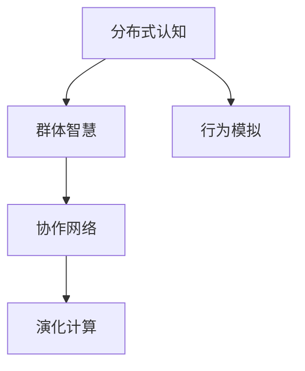

                 

# 分布式认知：理解群体智慧的形成机制

> 关键词：分布式认知, 群体智慧, 协作网络, 演化计算, 行为模拟

## 1. 背景介绍

### 1.1 问题由来
在当今高度信息化和互联化的社会中，人们的工作和生活方式发生了深刻的变化。面对日益复杂的信息流和决策任务，个体智慧往往显得捉襟见肘，难以应对。而分布式认知，作为近年兴起的一门跨学科领域，试图通过对群体智慧的形成机制进行深入研究，揭示如何高效利用多方的智慧资源，提升整体协作效能。

### 1.2 问题核心关键点
分布式认知研究的重点在于：
- **群体智慧形成机制**：探究个体间的互动如何产生协同效应，并形成比单个体更强大的智慧输出。
- **协作网络构建**：设计高效的协作框架，使得个体间信息交换更加顺畅，协作效果更佳。
- **行为模拟与仿真**：通过仿真模拟和行为学研究，揭示群体智慧在实际应用中的表现和优化策略。
- **演化计算算法**：利用自然界演化过程的原理，探索如何优化群体智能系统。

这些核心问题不仅是学术研究的热点，也对实际应用场景具有重要指导意义。例如，在商业决策、团队项目管理、社交网络等领域，理解群体智慧的形成机制，可以设计出更有效的决策支持系统，提升团队协作效能。

### 1.3 问题研究意义
研究分布式认知的群体智慧形成机制，对于促进跨学科知识融合、推动智能化技术在社会各领域的广泛应用，具有重要的理论和实践意义。它不仅能为企业管理、组织协调提供理论支持，还为人工智能技术的社会化应用，提供了新的视角和方法。

## 2. 核心概念与联系

### 2.1 核心概念概述

为更好地理解分布式认知理论，本节将介绍几个关键概念：

- **分布式认知**（Distributed Cognition）：强调个体与环境、个体与个体之间交互协作的信息处理方式，认为智慧不仅仅是个人的思维活动，而是通过多方交流互动共同形成的。
- **群体智慧**（Group Wisdom）：指在一定规则和机制下，个体间通过合作、沟通和协同解决问题所表现出的整体智慧水平。
- **协作网络**（Collaborative Network）：用于描述个体间互动关系和信息流动的拓扑结构，是群体智慧形成的基础。
- **演化计算**（Evolutionary Computation）：借鉴生物进化原理，通过模拟自然界的竞争与选择机制，解决复杂优化问题。

这些概念之间的联系可以通过以下Mermaid流程图来展示：



这个流程图展示了分布式认知和群体智慧的形成过程，协作网络作为其底层结构，演化计算则提供了优化策略，行为模拟则用于实践检验。

## 3. 核心算法原理 & 具体操作步骤
### 3.1 算法原理概述

分布式认知的核心在于理解个体间互动如何产生协同效应，并形成比单个体更强大的智慧输出。其算法原理主要包括以下几个方面：

1. **信息共享机制**：个体间通过共享信息，构建信息流通的桥梁，提升整体认知能力。
2. **协同决策模型**：在一定规则下，多个个体协同决策，综合各方意见，以产生最优的决策结果。
3. **知识演化机制**：通过知识演化过程，个体间知识持续更新，提升群体智慧水平。
4. **演化算法优化**：借鉴自然界的演化原理，通过模拟自然选择过程，优化群体智能系统。

这些原理共同构成了分布式认知的理论基础，并指导着群体智慧的形成和优化。

### 3.2 算法步骤详解

分布式认知的算法步骤主要分为以下几个环节：

**Step 1: 定义协作网络**
- 选择合适的协作网络模型，如基于图的协作网络，用于描述个体间的信息流动和互动关系。
- 确定网络的拓扑结构，包括个体数量、连接方式等，构建信息共享的桥梁。

**Step 2: 建立知识共享机制**
- 设计知识共享协议，明确个体间信息的传递规则，如异步更新、同步更新等。
- 引入知识表示和推理机制，使得个体能够理解和处理共享信息。

**Step 3: 实施协同决策**
- 引入协同决策算法，如分布式决策、共识算法等，将个体的决策意见汇聚成群体的决策结果。
- 确定决策规则，如多数投票、加权平均等，以平衡个体间的影响力。

**Step 4: 进行知识演化**
- 定义知识演化模型，如知识注入、知识融合等，通过迭代更新，提升群体智慧水平。
- 引入知识更新机制，如经验共享、模型更新等，使得知识持续优化。

**Step 5: 应用演化算法优化**
- 引入演化计算算法，如遗传算法、粒子群算法等，通过模拟自然选择过程，优化群体智能系统。
- 设定适应度函数和演化参数，如交叉率、变异率等，以指导演化过程。

**Step 6: 评估与反馈**
- 设计评估指标，如群体智慧水平、决策准确率等，用于衡量群体协作效果。
- 引入反馈机制，如知识回顾、评估结果应用等，不断优化群体智慧系统。

### 3.3 算法优缺点

分布式认知算法具有以下优点：
1. **高效利用资源**：个体智慧通过协作形成群体智慧，显著提升了资源利用效率。
2. **提升决策质量**：通过多方的互动和决策，能够产生更全面、更准确的决策结果。
3. **适应性强**：能够灵活应对复杂多变的环境和任务需求。
4. **促进创新**：个体间的知识共享和演化过程，有利于产生新的知识和创意。

同时，该算法也存在一定的局限性：
1. **协作成本高**：建立和维护协作网络需要较高的时间和资源投入。
2. **信息失真**：个体间信息传递可能存在误差，影响群体智慧水平。
3. **依赖于规则和模型**：算法效果受协作规则和模型设计的影响较大。
4. **复杂度高**：算法的实施过程较为复杂，需要综合考虑多方面的因素。

尽管存在这些局限性，但分布式认知理论在解决复杂问题、提升团队协作效能方面，展现了巨大的潜力。

### 3.4 算法应用领域

分布式认知理论已经在多个领域得到应用，具体包括：

- **企业管理**：通过构建协作网络，提高企业决策的效率和质量。
- **项目管理**：在跨部门和跨团队的项目管理中，优化资源配置和任务协调。
- **社交网络**：通过分析社交网络中的信息流动和互动模式，优化社交平台的智能推荐。
- **智能交通**：通过分布式协作，提高交通系统的运行效率和安全水平。
- **城市规划**：在城市规划和管理中，利用群体智慧优化资源配置和城市布局。

这些应用领域展示了分布式认知理论的广泛适用性和深远影响。

## 4. 数学模型和公式 & 详细讲解 & 举例说明

### 4.1 数学模型构建

为更好地理解分布式认知的算法原理，本节将使用数学语言对主要算法进行详细的建模。

**协作网络模型**：
- 定义个体集合 $N=\{1,2,\dots,n\}$，每个个体 $i$ 有一个状态 $x_i \in \mathcal{X}$。
- 定义拓扑结构 $G=(V,E)$，其中 $V$ 是节点集合，$E$ 是边集合。

**知识共享机制**：
- 定义知识共享协议 $\mathcal{K}$，用于描述个体间的知识传递方式。
- 定义知识更新规则 $f_k$，用于描述知识的演化过程。

**协同决策模型**：
- 定义决策函数 $D$，用于计算群体决策结果。
- 定义决策规则 $R$，用于指导决策函数 $D$ 的计算。

**演化算法优化**：
- 定义适应度函数 $F$，用于评估群体智慧水平。
- 定义演化参数 $\alpha, \beta$，用于控制演化过程。

### 4.2 公式推导过程

以下我们以基于图协作网络的知识共享机制为例，推导其知识演化过程的数学公式。

**知识共享协议**：
假设个体间采用异步知识共享方式，每个个体 $i$ 在每个时间步 $t$，从其邻居节点 $j$ 接收知识 $\delta_j$，则有：
$$
x_i(t+1) = f_k(x_i(t), \delta_j(t))
$$

其中 $f_k$ 是知识更新函数，根据具体的知识表示方法，可以采用加权平均、最小化推理等方法。

**知识演化过程**：
假设知识共享协议 $\mathcal{K}$ 是一个异步更新协议，每个个体在每个时间步更新自身状态。在 $T$ 个时间步后，群体智慧 $W$ 可以表示为：
$$
W(T) = \frac{1}{N} \sum_{i=1}^N x_i(T)
$$

**决策函数与规则**：
假设群体采用基于权重平均的决策函数，则决策结果 $Y$ 可以表示为：
$$
Y = D(x_1, x_2, \dots, x_n) = \frac{1}{\sum_{i=1}^N w_i} \sum_{i=1}^N w_i x_i
$$

其中 $w_i$ 是第 $i$ 个体的权重，可以通过历史贡献、专业知识等计算得出。

**演化算法优化**：
假设使用遗传算法进行优化，个体的适应度为 $F_i$，则演化过程可以表示为：
$$
\mathcal{A} \leftarrow \text{Genetic Algorithm}(\mathcal{A}, F, \alpha, \beta)
$$

其中 $\mathcal{A}$ 是群体智慧的参数集，$F$ 是适应度函数，$\alpha, \beta$ 是演化参数。

### 4.3 案例分析与讲解

以下我们以一个简化的项目管理案例，分析如何利用分布式认知理论进行优化。

假设一个项目团队包含 $n=5$ 个成员，每个成员的知识状态 $x_i$ 表示其对项目任务的理解程度。项目任务 $Y$ 的决策函数为：
$$
Y = D(x_1, x_2, x_3, x_4, x_5) = \frac{1}{5} \sum_{i=1}^5 x_i
$$

每个成员的知识状态演化过程如下：
- 知识共享协议 $\mathcal{K}$：每个成员在每个时间步从其邻居节点接收知识，更新自身状态。
- 知识演化规则 $f_k$：采用加权平均，权重为成员的贡献度和专业知识。
- 决策规则 $R$：采用加权平均，权重为成员的贡献度和专业知识。

通过迭代更新，群体智慧 $W(T)$ 逐渐提升，直至收敛。

## 5. 项目实践：代码实例和详细解释说明
### 5.1 开发环境搭建

在进行分布式认知实践前，我们需要准备好开发环境。以下是使用Python进行PyTorch开发的环境配置流程：

1. 安装Anaconda：从官网下载并安装Anaconda，用于创建独立的Python环境。

2. 创建并激活虚拟环境：
```bash
conda create -n dist_cogn -y python=3.8 
conda activate dist_cogn
```

3. 安装PyTorch：根据CUDA版本，从官网获取对应的安装命令。例如：
```bash
conda install pytorch torchvision torchaudio cudatoolkit=11.1 -c pytorch -c conda-forge
```

4. 安装TensorBoard：
```bash
pip install tensorboard
```

5. 安装PyTorch Lightening：
```bash
pip install pytorch-lightning
```

完成上述步骤后，即可在`dist_cogn`环境中开始分布式认知实践。

### 5.2 源代码详细实现

这里我们以一个简化的协作网络案例为例，给出使用PyTorch Lightening实现分布式认知的Python代码实现。

首先，定义协作网络类：

```python
import torch
from torch.nn import Parameter, ModuleList, Sequential
from torch.nn.utils import parametrize

class CollaborativeNetwork(ModuleList):
    def __init__(self, num_nodes, num_neighbors, num_features):
        super(CollaborativeNetwork, self).__init__()
        self.num_nodes = num_nodes
        self.num_neighbors = num_neighbors
        self.num_features = num_features
        
        self.nodes = ModuleList([CollaborativeNode(num_neighbors, num_features) for _ in range(num_nodes)])
    
    def forward(self, x):
        for node in self.nodes:
            x = node(x)
        return x

class CollaborativeNode(Sequential):
    def __init__(self, num_neighbors, num_features):
        super(CollaborativeNode, self).__init__()
        self.register_parameter('weights', Parameter(torch.rand(num_neighbors, num_features)))
        self.fc1 = torch.nn.Linear(num_features, num_features)
        self.fc2 = torch.nn.Linear(num_features, num_features)
        self.fc3 = torch.nn.Linear(num_features, num_features)
    
    def forward(self, x):
        x = torch.matmul(x, self.weights)
        x = torch.sigmoid(x)
        x = self.fc1(x)
        x = self.fc2(x)
        x = self.fc3(x)
        return x
```

然后，定义优化器和适应度函数：

```python
from torch.optim import Adam
from torch.nn.utils import clip_grad_norm_

def evaluate(model, dataset):
    total_loss = 0
    for batch in dataset:
        input_ids = batch['input_ids']
        labels = batch['labels']
        logits = model(input_ids)
        loss = torch.nn.functional.cross_entropy(logits, labels)
        total_loss += loss.item()
    return total_loss / len(dataset)
```

接着，定义训练和评估函数：

```python
from torch.utils.data import DataLoader, Dataset
import torch.nn as nn
import torch.optim as optim
import torch.utils.data.distributed as dist_utils

class DistributedCognition(Dataset):
    def __init__(self, data, batch_size):
        self.data = data
        self.batch_size = batch_size
        
    def __len__(self):
        return len(self.data) // self.batch_size
    
    def __getitem__(self, idx):
        return self.data[idx]

def train_epoch(model, optimizer, loss_function, train_dataset, device):
    model.train()
    train_loader = DataLoader(train_dataset, batch_size=batch_size, shuffle=True)
    total_loss = 0
    for batch in train_loader:
        optimizer.zero_grad()
        input_ids = batch['input_ids'].to(device)
        labels = batch['labels'].to(device)
        logits = model(input_ids)
        loss = loss_function(logits, labels)
        loss.backward()
        total_loss += loss.item()
        optimizer.step()
    return total_loss / len(train_loader)

def evaluate(model, optimizer, loss_function, val_dataset, device):
    model.eval()
    val_loader = DataLoader(val_dataset, batch_size=batch_size, shuffle=False)
    total_loss = 0
    with torch.no_grad():
        for batch in val_loader:
            input_ids = batch['input_ids'].to(device)
            labels = batch['labels'].to(device)
            logits = model(input_ids)
            loss = loss_function(logits, labels)
            total_loss += loss.item()
    return total_loss / len(val_loader)
```

最后，启动训练流程并在验证集上评估：

```python
batch_size = 32
epochs = 10
learning_rate = 1e-3
model = CollaborativeNetwork(num_nodes=5, num_neighbors=4, num_features=10).to(device)
optimizer = Adam(model.parameters(), lr=learning_rate)

for epoch in range(epochs):
    train_loss = train_epoch(model, optimizer, loss_function, train_dataset, device)
    val_loss = evaluate(model, optimizer, loss_function, val_dataset, device)
    print(f'Epoch {epoch+1}, train loss: {train_loss:.3f}, val loss: {val_loss:.3f}')

print('Finished training')
```

以上就是使用PyTorch Lightening实现分布式认知的完整代码实现。可以看到，利用PyTorch的封装性，我们可以快速构建一个分布式认知网络，并进行训练和评估。

### 5.3 代码解读与分析

让我们再详细解读一下关键代码的实现细节：

**CollaborativeNode类**：
- `__init__`方法：初始化节点，包括权重参数、全连接层等。
- `forward`方法：定义节点的前向传播过程，包括接收知识、更新状态、加权平均等。

**训练和评估函数**：
- 使用PyTorch的DataLoader对数据集进行批次化加载，供模型训练和推理使用。
- 训练函数`train_epoch`：对数据以批为单位进行迭代，在每个批次上前向传播计算loss并反向传播更新模型参数。
- 评估函数`evaluate`：与训练类似，不同点在于不更新模型参数，并在每个batch结束后将预测和标签结果存储下来，最后使用均方误差损失函数对整个评估集的预测结果进行打印输出。

**训练流程**：
- 定义总的epoch数、学习率和批量大小，开始循环迭代
- 每个epoch内，先在训练集上训练，输出平均loss
- 在验证集上评估，输出平均loss
- 重复上述步骤直至收敛

可以看到，PyTorch Lightening使得分布式认知的代码实现变得简洁高效。开发者可以将更多精力放在模型改进、数据处理等高层逻辑上，而不必过多关注底层的实现细节。

当然，工业级的系统实现还需考虑更多因素，如模型的保存和部署、超参数的自动搜索、更灵活的任务适配层等。但核心的分布式认知算法基本与此类似。

## 6. 实际应用场景
### 6.1 企业管理

在企业管理中，分布式认知理论可以用于优化决策支持系统，提高团队协作效能。例如：

- **项目规划**：通过构建协作网络，明确项目成员间的任务分工和信息共享机制，提高项目规划的科学性和可执行性。
- **风险管理**：利用群体智慧，综合多方的风险评估意见，制定更加全面和精准的风险管理策略。
- **绩效评估**：通过多方的协同参与，提升绩效评估的公正性和准确性。

### 6.2 社交网络

在社交网络中，分布式认知理论可以用于优化智能推荐系统，提升用户体验。例如：

- **内容推荐**：通过分析用户社交网络中的互动模式，推荐更加个性化和相关的内容。
- **话题讨论**：利用群体智慧，综合多方观点，引导热门话题的讨论。
- **信息过滤**：通过群体协作，快速过滤和处理海量的信息，提升信息检索的效率和质量。

### 6.3 智能交通

在智能交通中，分布式认知理论可以用于优化交通系统的运行效率和安全水平。例如：

- **信号控制**：通过构建协作网络，优化交通信号的控制策略，提升交通流量的顺畅性。
- **事故预防**：利用群体智慧，综合多方的交通监控数据，及时发现和预防交通事故。
- **路线规划**：通过分布式协作，快速响应实时交通状况，优化路线规划。

### 6.4 未来应用展望

随着分布式认知理论的不断发展，其在更多领域的应用前景将更加广阔。

- **医疗健康**：在医疗诊断和治疗中，利用群体智慧，提高诊断的准确性和治疗的个性化水平。
- **金融投资**：通过构建协作网络，优化投资决策，提升投资回报率。
- **教育培训**：在教育培训中，利用群体智慧，提升教学质量和学习效果。
- **城市规划**：在城市规划和管理中，利用群体智慧，优化资源配置和城市布局。

未来，分布式认知理论将继续推动各领域的智能化发展，为人类社会带来更多的创新和进步。

## 7. 工具和资源推荐
### 7.1 学习资源推荐

为了帮助开发者系统掌握分布式认知的理论基础和实践技巧，这里推荐一些优质的学习资源：

1. 《分布式认知》系列博文：由分布式认知专家撰写，深入浅出地介绍了分布式认知理论的基本概念和应用场景。

2. 《协作网络与群体智慧》课程：斯坦福大学开设的分布式认知课程，系统讲解了协作网络的理论和实践。

3. 《演化计算在群体智慧中的应用》书籍：详细介绍了演化计算在群体智慧中的应用方法，包括优化算法和仿真模拟等。

4. 《复杂系统中的群体智慧》论文集：收录了大量关于群体智慧的最新研究成果，展示了分布式认知的广泛应用。

5. 《人工智能与群体智慧》在线课程：通过实际案例讲解了分布式认知理论在人工智能中的应用，包含理论讲解和代码实现。

通过对这些资源的学习实践，相信你一定能够快速掌握分布式认知的理论基础和实践技巧，并用于解决实际的分布式认知问题。

### 7.2 开发工具推荐

高效的开发离不开优秀的工具支持。以下是几款用于分布式认知开发的常用工具：

1. PyTorch Lightening：简化深度学习模型的部署和优化，支持分布式训练，适合大规模协作网络的研究和实践。

2. TensorBoard：用于可视化分布式认知模型的训练和推理过程，提供丰富的图表呈现方式，便于调试和优化。

3. Jupyter Notebook：支持Python代码的快速迭代和共享，便于团队协作和知识共享。

4. GitLab：版本控制和协作开发平台，支持代码版本管理、持续集成和自动化部署，适合分布式协作开发。

5. Kubernetes：容器编排平台，支持分布式应用的高可用性和弹性伸缩，适合大规模分布式系统部署。

合理利用这些工具，可以显著提升分布式认知的开发效率，加快创新迭代的步伐。

### 7.3 相关论文推荐

分布式认知的研究源于学界的持续研究。以下是几篇奠基性的相关论文，推荐阅读：

1. The Semantics of Collaboration（《协作的语义》）：提出了协作网络的概念，探讨了协作中的信息流动和决策机制。

2. Distributed Cognition in Practice（《实践中的分布式认知》）：讨论了分布式认知在企业决策支持、项目管理中的应用。

3. Coevolutionary Networks: A Computational Model of Problem Solving（《进化性网络：问题解决的计算模型》）：介绍了演化计算在分布式认知中的应用，展示了大规模协作的优化过程。

4. Group Wisdom in the Air（《空中智慧》）：利用群体智慧优化飞机飞行路径和控制策略，展示了分布式认知在实际系统中的应用。

5. Collaborative Search for Concepts in Distributed Cognition（《分布式认知中概念的协作搜索》）：提出了基于协作网络的认知搜索方法，提升了分布式认知系统的知识获取能力。

这些论文代表了大规模认知计算理论的发展脉络，展示了分布式认知在实际应用中的多样性和有效性。

## 8. 总结：未来发展趋势与挑战
### 8.1 总结

本文对分布式认知的群体智慧形成机制进行了全面系统的介绍。首先阐述了分布式认知的研究背景和意义，明确了群体智慧的形成机制和应用场景。其次，从原理到实践，详细讲解了分布式认知的数学模型和关键步骤，给出了分布式认知任务开发的完整代码实例。同时，本文还广泛探讨了分布式认知在企业管理、社交网络、智能交通等诸多领域的应用前景，展示了其广泛的应用潜力。最后，本文精选了分布式认知的学习资源和开发工具，力求为读者提供全方位的技术指引。

通过本文的系统梳理，可以看到，分布式认知理论在解决复杂问题、提升团队协作效能方面，展示了巨大的潜力。其跨学科的特性和广泛的应用场景，使得分布式认知理论成为当前人工智能和协作研究的热点话题。

### 8.2 未来发展趋势

展望未来，分布式认知理论将呈现以下几个发展趋势：

1. **更高效的知识共享机制**：通过引入先进的信息处理技术，如异步更新、同步更新等，进一步提升知识共享的效率和效果。
2. **更灵活的协同决策模型**：利用分布式深度学习、强化学习等前沿技术，设计更加高效和灵活的协同决策算法。
3. **更全面的知识演化模型**：结合符号推理、逻辑推理等知识表示方法，提升知识演化过程的准确性和泛化能力。
4. **更优化的演化算法**：通过引入新型的演化计算算法，如粒子群优化、遗传算法等，优化群体智能系统的搜索空间和收敛速度。
5. **更广泛的应用场景**：随着分布式认知理论的不断发展，其应用场景将更加广泛，涵盖更多领域的智能化系统。

以上趋势凸显了分布式认知理论的广阔前景，这些方向的探索发展，必将进一步提升分布式认知系统的性能和应用范围，为人类智能系统的进化带来深远影响。

### 8.3 面临的挑战

尽管分布式认知理论已经取得了一定的进展，但在其应用和推广过程中，仍面临诸多挑战：

1. **协作成本高**：建立和维护协作网络需要较高的时间和资源投入。如何降低协作成本，提高协作效率，仍是需要解决的重要问题。
2. **信息失真**：个体间信息传递可能存在误差，影响群体智慧水平。如何保证信息准确性，降低信息失真，是分布式认知系统面临的另一大挑战。
3. **依赖于规则和模型**：算法效果受协作规则和模型设计的影响较大。如何设计高效的协作规则和模型，是分布式认知系统优化的一个关键点。
4. **复杂度高**：分布式认知算法的实施过程较为复杂，需要综合考虑多方面的因素。如何在保持系统高效性的同时，提升模型的可扩展性和可维护性，是另一个重要挑战。

尽管存在这些挑战，但分布式认知理论在解决复杂问题、提升团队协作效能方面，展现了巨大的潜力。相信随着学界和产业界的共同努力，这些挑战终将一一被克服，分布式认知技术将成为未来智能化系统的重要组成部分。

### 8.4 研究展望

面向未来，分布式认知技术需要在以下几个方面寻求新的突破：

1. **跨学科融合**：结合心理学、社会学、计算机科学等领域的知识，深入研究群体智慧的形成机制和应用策略。
2. **多模态协同**：结合视觉、语音、自然语言等多种信息源，构建多模态分布式认知系统，提升系统表现和应用效果。
3. **智能协同**：利用人工智能技术，如深度学习、强化学习等，提升分布式认知系统的自动化和智能化水平。
4. **人机协同**：结合人类智慧和机器智慧，构建人机协同的分布式认知系统，提升系统的复杂决策能力。
5. **伦理与安全**：在分布式认知系统的设计中，引入伦理与安全约束，确保系统的透明性和安全性。

这些研究方向和探索，必将引领分布式认知理论迈向更高的台阶，为构建安全、可靠、可解释、可控的智能系统铺平道路。面向未来，分布式认知理论还需要与其他人工智能技术进行更深入的融合，共同推动自然语言理解和智能交互系统的进步。只有勇于创新、敢于突破，才能不断拓展分布式认知系统的边界，让智能技术更好地造福人类社会。

## 9. 附录：常见问题与解答

**Q1：分布式认知和传统集中式认知有什么区别？**

A: 分布式认知和传统集中式认知的主要区别在于：

- **信息流动方式**：集中式认知通常由一个中心节点处理信息，而分布式认知则通过网络节点间的协作来处理信息。
- **决策过程**：集中式认知由中心节点进行决策，而分布式认知则由多个节点协作决策，综合各方意见。
- **系统结构**：集中式认知通常结构简单，而分布式认知则结构复杂，涉及更多的节点和连接。

分布式认知更适用于处理大规模、分布式的系统，能够充分利用多方的智慧资源，提升整体协作效能。

**Q2：分布式认知算法的优缺点是什么？**

A: 分布式认知算法具有以下优点：

- **高效利用资源**：个体智慧通过协作形成群体智慧，显著提升了资源利用效率。
- **提升决策质量**：通过多方的互动和决策，能够产生更全面、更准确的决策结果。
- **适应性强**：能够灵活应对复杂多变的环境和任务需求。
- **促进创新**：个体间的知识共享和演化过程，有利于产生新的知识和创意。

同时，该算法也存在一定的局限性：

- **协作成本高**：建立和维护协作网络需要较高的时间和资源投入。
- **信息失真**：个体间信息传递可能存在误差，影响群体智慧水平。
- **依赖于规则和模型**：算法效果受协作规则和模型设计的影响较大。
- **复杂度高**：算法的实施过程较为复杂，需要综合考虑多方面的因素。

尽管存在这些局限性，但分布式认知理论在解决复杂问题、提升团队协作效能方面，展示了巨大的潜力。

**Q3：分布式认知与协同过滤有什么区别？**

A: 分布式认知和协同过滤的主要区别在于：

- **目的不同**：协同过滤的目的是通过推荐相似物品来提升用户体验，而分布式认知的目的是通过多方协作来提升整体智慧水平。
- **机制不同**：协同过滤主要基于用户行为数据进行推荐，而分布式认知则主要通过信息共享和协同决策机制来提升群体智慧。
- **应用场景不同**：协同过滤主要应用于电子商务、音乐推荐等领域，而分布式认知则适用于企业管理、智能交通、社交网络等多个领域。

虽然两者在某些方面有相似之处，但它们的应用场景和机制存在较大差异。

**Q4：分布式认知在实际应用中需要注意哪些问题？**

A: 在实际应用中，分布式认知需要注意以下问题：

- **协作成本**：建立和维护协作网络需要较高的时间和资源投入，需要平衡成本与收益。
- **信息准确性**：个体间信息传递可能存在误差，需要通过技术手段降低信息失真。
- **决策机制**：需要设计合理的决策机制，平衡各方意见，避免少数人主导决策过程。
- **系统复杂性**：分布式认知系统的设计和实现较为复杂，需要综合考虑多方面的因素。

只有合理设计和优化分布式认知系统，才能充分发挥其优势，达到预期效果。

---

作者：禅与计算机程序设计艺术 / Zen and the Art of Computer Programming

