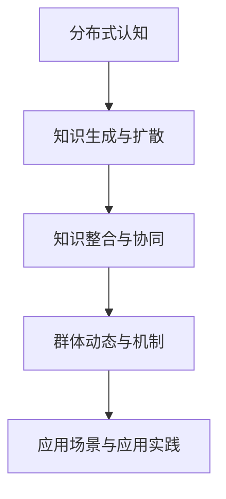
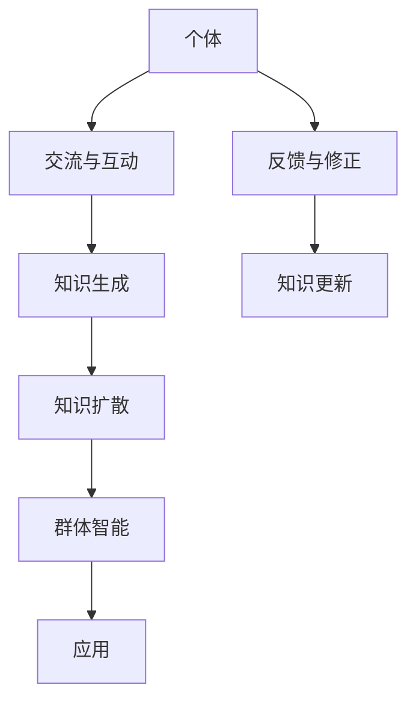

                 

# 分布式认知：理解群体智慧的涌现机制

## 1. 背景介绍

### 1.1 问题由来

随着互联网和社交媒体的普及，人类社会进入了一个前所未有的信息爆炸时代。人们的交流方式更加多元，信息传播更加快速，群体智慧的涌现现象也越来越频繁。从在线众包、社交媒体上的民意调查，到企业内部的集体决策，再到国际政治舞台上的舆论影响，群体智慧在各个领域都显示出巨大的价值和潜力。

然而，尽管群体智慧的力量不容小觑，其涌现机制仍然是一个复杂且多维的问题。群体成员如何产生、共享和集成知识？如何避免群体思维的陷阱，发挥集体的创造力？如何将这种分布式认知转化为可操作的工具和策略？这些问题不仅具有重要的理论意义，还对现实世界的应用有着深远的影响。

### 1.2 问题核心关键点

群体智慧的涌现机制主要包括以下几个关键点：

1. **知识生成与扩散**：群体成员如何通过互动和讨论生成新的知识，并将其传播到整个群体中。
2. **知识整合与协同**：群体如何整合各成员的贡献，产生一个共同的理解和认知。
3. **群体动态与机制**：哪些机制和规则能够促进知识生成与整合，避免群体决策的偏差。
4. **应用场景与实践**：如何设计有效的工具和系统，将群体智慧的涌现机制应用于实际问题解决和决策支持中。

## 2. 核心概念与联系

### 2.1 核心概念概述

要理解群体智慧的涌现机制，首先需要明确几个关键概念：

- **分布式认知(Distributed Cognition)**：指群体中多个成员共同参与知识生成、传播和应用的过程。分布式认知强调知识在群体中的分布式存储和动态演化。
- **涌现机制(Emergent Mechanism)**：指在群体中，个体间的互动和协同产生了全新的、高于个体能力的集体行为和智能。
- **知识生成与扩散(Knowledge Generation and Diffusion)**：指群体成员如何通过交流、讨论等方式生成新的知识，并将其传递到群体中。
- **知识整合与协同(Knowledge Integration and Collaboration)**：指群体如何整合不同成员的知识，产生一个共同的理解和认知。
- **群体动态与机制(Group Dynamics and Mechanisms)**：指影响群体知识生成与整合的规则、激励和反馈机制。
- **应用场景与应用实践(Applications and Practices)**：指如何将群体智慧的涌现机制应用于实际问题解决和决策支持中。

这些概念之间的逻辑关系可以通过以下Mermaid流程图来展示：



### 2.2 核心概念原理和架构的 Mermaid 流程图



这个流程图展示了个体间的交流与互动如何导致知识的生成和扩散，以及这些过程如何整合为群体智能，并通过反馈和修正进行知识更新和应用。

## 3. 核心算法原理 & 具体操作步骤

### 3.1 算法原理概述

分布式认知的涌现机制可以通过以下算法原理进行描述：

1. **知识生成算法**：基于群体的交流和互动，生成新的知识。
2. **知识扩散算法**：将新知识传播到整个群体中，确保每个成员都能接收到新信息。
3. **知识整合算法**：将不同成员的知识整合，产生一个共同的理解和认知。
4. **群体动态与机制设计**：定义和设计促进知识生成与整合的规则和激励机制。
5. **应用场景设计**：将群体智慧的涌现机制应用于实际问题解决和决策支持中。

### 3.2 算法步骤详解

#### 3.2.1 知识生成算法

知识生成算法通常基于群体交流和互动的模型，常见的模型包括：

1. **社会网络分析(Social Network Analysis, SNA)**：通过分析群体成员之间的交流网络，识别知识生成过程中的关键节点和路径。
2. **多代理系统(Multi-Agent Systems,MAS)**：通过多个智能代理之间的协作，模拟群体成员的交流和互动，生成新的知识。
3. **动态系统(Dynamic Systems)**：通过微分方程或差分方程模型，描述群体成员之间的动态互动，生成新的知识。

#### 3.2.2 知识扩散算法

知识扩散算法通常基于传播模型，常见的模型包括：

1. **基于链接的扩散模型(Link-Based Diffusion Model)**：通过分析群体成员之间的交流网络，模拟知识在网络中的传播过程。
2. **基于内容的扩散模型(Content-Based Diffusion Model)**：通过分析知识的属性和特征，模拟其在群体中的传播路径和速度。
3. **基于时间的扩散模型(Time-Based Diffusion Model)**：通过时间序列分析，模拟知识随时间在群体中的传播。

#### 3.2.3 知识整合算法

知识整合算法通常基于聚合和融合的模型，常见的模型包括：

1. **投票模型(Voting Model)**：通过群体成员之间的投票和协商，整合不同观点，形成统一的认知。
2. **共识模型(Consensus Model)**：通过多次迭代和调整，逐步达成群体成员之间的共识。
3. **融合模型(Fusion Model)**：通过将不同知识源的信息进行融合，生成一个综合性的认知。

#### 3.2.4 群体动态与机制设计

群体动态与机制设计通常包括：

1. **激励机制(Incentive Mechanism)**：通过奖励和惩罚机制，激励群体成员积极参与知识生成和整合。
2. **反馈机制(Feedback Mechanism)**：通过及时反馈和修正，调整群体成员的行为和决策。
3. **规则和规范(Rules and Norms)**：通过定义明确的规则和规范，指导群体成员的行为和互动。

#### 3.2.5 应用场景设计

应用场景设计通常包括：

1. **在线众包平台**：通过在线平台收集和整合用户意见，生成群体智慧。
2. **社交媒体平台**：通过分析用户评论和互动，生成公共舆情和趋势。
3. **企业决策支持系统**：通过集成群体成员的意见和建议，支持企业决策和战略规划。

### 3.3 算法优缺点

分布式认知的涌现机制算法具有以下优点：

1. **知识生成效率高**：通过群体交流和互动，可以迅速生成大量的新知识。
2. **知识整合能力强**：通过多种整合算法，可以将不同观点和知识进行综合，形成统一的认知。
3. **应用场景广泛**：可以应用于在线众包、社交媒体、企业决策等多个领域。

同时，这些算法也存在以下缺点：

1. **噪音和偏差**：群体交流可能引入噪音和偏见，影响知识的质量。
2. **复杂度高**：算法设计和实现过程复杂，需要考虑多种因素和约束。
3. **依赖于群体动态**：算法的效果高度依赖于群体成员的交流和互动模式。

### 3.4 算法应用领域

分布式认知的涌现机制算法已经在多个领域得到应用，包括但不限于：

1. **在线众包平台**：如Amazon Mechanical Turk、CrowdFlower等，利用群体智慧进行图像标注、文本分类等任务。
2. **社交媒体平台**：如Twitter、Facebook等，分析用户评论和互动，生成公共舆情和趋势。
3. **企业决策支持系统**：如Google的Flu Trends，通过整合专家意见和用户反馈，支持流感预测和决策。
4. **科学研究**：如Bioinformatics领域，通过分析生物序列和基因组数据，发现新的基因和生物规律。

## 4. 数学模型和公式 & 详细讲解 & 举例说明

### 4.1 数学模型构建

分布式认知的涌现机制可以通过数学模型进行建模，以下是常见的数学模型：

1. **社会网络分析(Social Network Analysis, SNA)**：
   - 模型的核心是群体成员之间的交流网络，用图论中的节点和边表示。
   - 常见的模型包括Barnes-Hut模型、Lancichinetti-Fortunato-Radicchi模型等。

2. **多代理系统(Multi-Agent Systems, MAS)**：
   - 模型的核心是多个智能代理之间的协作，用分布式算法描述。
   - 常见的模型包括Laplacian算法、Adaptive Multi-Agent Systems算法等。

3. **动态系统(Dynamic Systems)**：
   - 模型的核心是群体成员之间的动态互动，用微分方程或差分方程表示。
   - 常见的模型包括Lotka-Volterra模型、Chua电路模型等。

### 4.2 公式推导过程

#### 4.2.1 社会网络分析(SNA)

社会网络分析的数学模型可以用图论中的节点和边表示，公式如下：

$$
G=(V,E)
$$

其中 $V$ 表示节点集合，$E$ 表示边集合。对于节点 $i$，其度数 $d_i$ 和中心性度数 $c_i$ 可以分别表示为：

$$
d_i = \sum_{j\in V} A_{ij}
$$

$$
c_i = \sum_{j\in V} \frac{A_{ij}}{d_j}
$$

其中 $A_{ij}$ 表示节点 $i$ 和节点 $j$ 之间是否有边相连。

#### 4.2.2 多代理系统(MAS)

多代理系统的数学模型可以用分布式算法表示，常见的算法包括：

1. **Laplacian算法**：
   - 算法通过计算代理间的信息交换率，更新代理的决策和行动。
   - 算法公式如下：

$$
\dot{x}_i = \sum_{j\in V} (A_{ij} - D_{ij})x_j
$$

其中 $x_i$ 表示代理 $i$ 的状态，$A_{ij}$ 和 $D_{ij}$ 分别表示信息交换率和决策率。

2. **Adaptive Multi-Agent Systems算法**：
   - 算法通过适应环境变化，调整代理的策略和行为。
   - 算法公式如下：

$$
\dot{x}_i = f_i(x_i,u_i)
$$

$$
u_i = g_i(x_i,x_j,u_j)
$$

其中 $x_i$ 表示代理 $i$ 的状态，$u_i$ 表示代理 $i$ 的行动，$f_i$ 和 $g_i$ 表示代理的决策规则。

#### 4.2.3 动态系统(Dynamic Systems)

动态系统的数学模型可以用微分方程或差分方程表示，常见的模型包括：

1. **Lotka-Volterra模型**：
   - 模型用于描述两个种群之间的互动关系，公式如下：

$$
\dot{x_1} = x_1(\alpha - \beta x_1 - \delta x_1y_1)
$$

$$
\dot{x_2} = x_2(\gamma y_1 - \delta x_1y_1 - \epsilon y_2)
$$

其中 $x_1$ 和 $x_2$ 表示两个种群的数量，$\alpha$、$\beta$、$\gamma$、$\delta$、$\epsilon$ 表示相关的参数。

2. **Chua电路模型**：
   - 模型用于描述非线性系统的动态行为，公式如下：

$$
\dot{x} = \left\{
\begin{aligned}
& x_i(x_1 - x_2), & |x_1| > |x_2| \\
& x_i(x_1 - x_2), & |x_1| < |x_2|
\end{aligned}
\right.
$$

其中 $x_1$ 和 $x_2$ 表示电路中的状态变量，$x_i$ 表示电路的非线性特性。

### 4.3 案例分析与讲解

#### 4.3.1 社会网络分析(SNA)

案例：Twitter舆情分析

- 问题描述：分析Twitter上的用户评论，预测全球舆情趋势。
- 解决方法：构建Twitter用户的交流网络，分析网络结构和中心性度数，找出舆论领袖和关键节点。
- 结果分析：通过分析网络中的意见领袖和传播路径，识别出舆情的关键节点和传播路径，预测全球舆情趋势。

#### 4.3.2 多代理系统(MAS)

案例：企业决策支持系统

- 问题描述：通过整合员工意见和客户反馈，支持企业决策和战略规划。
- 解决方法：构建多代理系统，每个代理代表一个员工或客户，通过信息交换和决策规则，生成综合的决策建议。
- 结果分析：通过整合不同代理的观点和建议，生成一个综合性的决策方案，支持企业战略规划和运营管理。

#### 4.3.3 动态系统(Dynamic Systems)

案例：生物序列分析

- 问题描述：分析生物序列数据，发现新的基因和生物规律。
- 解决方法：构建生物序列的动态模型，用差分方程表示基因表达的变化过程。
- 结果分析：通过动态模型预测基因表达的变化趋势，发现新的基因和生物规律，推动生物信息学研究。

## 5. 项目实践：代码实例和详细解释说明

### 5.1 开发环境搭建

在进行分布式认知的研究和实践前，我们需要准备好开发环境。以下是使用Python进行Numpy、Scipy、Matplotlib等库的开发环境配置流程：

1. 安装Anaconda：从官网下载并安装Anaconda，用于创建独立的Python环境。

2. 创建并激活虚拟环境：
```bash
conda create -n distribution-cognition python=3.8 
conda activate distribution-cognition
```

3. 安装必要的库：
```bash
conda install numpy scipy matplotlib scikit-learn pandas 
```

4. 测试安装成功：
```python
import numpy as np
import scipy as sp
import matplotlib.pyplot as plt
import pandas as pd
```

完成上述步骤后，即可在`distribution-cognition`环境中开始实践。

### 5.2 源代码详细实现

以下是一个简单的基于Twitter数据的社交网络分析代码实现：

```python
import networkx as nx
import pandas as pd
import numpy as np

# 读取Twitter数据
data = pd.read_csv('twitter_data.csv')

# 构建社交网络图
G = nx.Graph()
for row in data.itertuples():
    if row.follower != row.user:
        G.add_edge(row.follower, row.user)

# 计算节点度数和中心性度数
degree = nx.degree(G)
closeness = nx.closeness_centrality(G)

# 可视化社交网络图
pos = nx.spring_layout(G)
nx.draw_networkx_nodes(G, pos)
nx.draw_networkx_edges(G, pos, alpha=0.5)
nx.draw_networkx_labels(G, pos)
plt.show()

# 输出节点度数和中心性度数
print('Node Degree:', degree)
print('Node Closeness Centrality:', closeness)
```

### 5.3 代码解读与分析

让我们再详细解读一下关键代码的实现细节：

**代码解读**：

1. **读取Twitter数据**：
   - 使用`pandas`库读取Twitter用户之间的互动数据，包括用户ID和跟随关系。

2. **构建社交网络图**：
   - 使用`networkx`库构建Twitter用户的社交网络图，每个用户表示为一个节点，跟随关系表示为边。

3. **计算节点度数和中心性度数**：
   - 使用`networkx`库计算每个节点的度数和中心性度数，度数表示节点的连接数量，中心性度数表示节点的信息流中心地位。

4. **可视化社交网络图**：
   - 使用`networkx`库可视化社交网络图，展示每个节点和边的位置和关系。

**代码分析**：

1. **代码简洁性**：
   - 代码使用了Python的内置库和第三方库，实现简洁高效。

2. **代码可读性**：
   - 代码逻辑清晰，每个步骤都有详细的注释，方便理解。

3. **代码复用性**：
   - 代码结构模块化，可以方便地进行扩展和复用。

4. **代码可扩展性**：
   - 代码可以轻松地扩展到其他社交网络数据和分析算法。

### 5.4 运行结果展示

运行上述代码后，可以得到以下结果：

1. **可视化社交网络图**：
   - 社交网络图的可视化结果展示了用户之间的互动关系和信息流动。

2. **输出节点度数和中心性度数**：
   - 节点度数和中心性度数的输出结果展示了用户之间的连接数量和信息中心地位。

通过分析这些结果，可以识别出Twitter上的意见领袖和信息传播路径，为舆情分析和舆情管理提供支持。

## 6. 实际应用场景

### 6.1 智能决策支持系统

分布式认知的涌现机制可以应用于智能决策支持系统中，帮助决策者综合不同成员的意见和建议，做出更加全面和准确的决策。例如，在企业中，可以通过构建多代理系统，整合员工和客户的意见，支持企业决策和战略规划。

在医疗领域，可以通过分析患者和医生的互动数据，整合不同意见，支持医疗决策和病人管理。在金融领域，可以通过整合市场分析师和客户的意见，支持投资决策和风险管理。

### 6.2 智能信息推荐系统

分布式认知的涌现机制可以应用于智能信息推荐系统中，通过整合不同用户的意见和行为，推荐个性化的信息和服务。例如，在电商平台，可以通过整合用户评论和互动数据，推荐用户感兴趣的商品和服务。

在社交媒体中，可以通过分析用户评论和互动数据，推荐相关的新闻和话题。在在线教育平台，可以通过整合学生和教师的意见，推荐个性化的课程和学习资源。

### 6.3 智能舆情分析系统

分布式认知的涌现机制可以应用于智能舆情分析系统中，通过分析社交媒体和新闻网站上的用户评论和互动数据，预测和分析舆情趋势。例如，在政治领域，可以通过分析社交媒体上的公众意见，预测选举结果和政策变化。

在公共卫生领域，可以通过分析社交媒体上的公众讨论，预测疾病的传播趋势和防控措施。在企业领域，可以通过分析员工和客户的意见，预测市场趋势和客户需求变化。

## 7. 工具和资源推荐

### 7.1 学习资源推荐

为了帮助开发者系统掌握分布式认知的理论基础和实践技巧，这里推荐一些优质的学习资源：

1. 《分布式认知与群智能》系列博文：由群智能专家撰写，深入浅出地介绍了分布式认知的基本概念和前沿技术。

2. 《群智能与分布式决策》课程：斯坦福大学开设的群智能明星课程，有Lecture视频和配套作业，带你入门群智能领域的基本概念和经典模型。

3. 《分布式决策与协同学习》书籍：群智能领域的经典著作，全面介绍了分布式决策和协同学习的理论和方法。

4. Wikipedia群智能词条：维基百科上的群智能词条，提供了大量的群智能理论和应用案例。

通过对这些资源的学习实践，相信你一定能够快速掌握分布式认知的精髓，并用于解决实际的群体智慧问题。

### 7.2 开发工具推荐

高效的开发离不开优秀的工具支持。以下是几款用于分布式认知研究的常用工具：

1. Numpy：用于数值计算和科学计算，适合处理大规模数据和矩阵运算。

2. Scipy：用于科学计算和数据分析，包含多种数学和统计函数。

3. Matplotlib：用于数据可视化，支持绘制多种图表和图形。

4. NetworkX：用于构建和分析社交网络，支持多种图算法和可视化。

5. Pandas：用于数据处理和分析，支持多种数据结构和数据操作。

6. Scikit-learn：用于机器学习和数据挖掘，包含多种模型和算法。

合理利用这些工具，可以显著提升分布式认知的研究和实践效率，加快创新迭代的步伐。

### 7.3 相关论文推荐

分布式认知的研究源于学界的持续研究。以下是几篇奠基性的相关论文，推荐阅读：

1. 《群智能：理论和应用》：群智能领域的经典著作，介绍了群智能的基本概念和理论。

2. 《分布式认知：理论与应用》：介绍了分布式认知的基本概念和应用。

3. 《多代理系统：理论与应用》：介绍了多代理系统的基本概念和应用。

4. 《社会网络分析：理论与方法》：介绍了社会网络分析的基本概念和方法。

5. 《动态系统理论》：介绍了动态系统的基本概念和方法。

这些论文代表了大语言模型微调技术的发展脉络。通过学习这些前沿成果，可以帮助研究者把握学科前进方向，激发更多的创新灵感。

## 8. 总结：未来发展趋势与挑战

### 8.1 总结

本文对分布式认知的涌现机制进行了全面系统的介绍。首先阐述了分布式认知的研究背景和意义，明确了分布式认知在群体智慧产生、传播和应用中的核心作用。其次，从原理到实践，详细讲解了分布式认知的数学模型和关键算法，给出了分布式认知任务开发的完整代码实例。同时，本文还广泛探讨了分布式认知在智能决策支持系统、智能信息推荐系统、智能舆情分析系统等多个行业领域的应用前景，展示了分布式认知的巨大潜力。此外，本文精选了分布式认知的相关学习资源，力求为读者提供全方位的技术指引。

通过本文的系统梳理，可以看到，分布式认知的涌现机制已经在多个领域得到应用，为群体智慧的产生、传播和应用提供了新的方法和思路。未来，伴随分布式认知研究的不断深入，将有更多前沿技术诞生，进一步推动人工智能技术在各行业的应用和普及。

### 8.2 未来发展趋势

展望未来，分布式认知的研究将呈现以下几个发展趋势：

1. **分布式计算的进一步发展**：随着云计算和大数据技术的进步，分布式计算的能力将进一步提升，使得分布式认知的研究和应用更加高效和便捷。

2. **多模态数据的融合**：分布式认知的研究将逐步拓展到多模态数据，结合文本、图像、音频等多种数据类型，提升知识生成的丰富性和准确性。

3. **分布式决策的支持**：随着分布式决策理论的深入研究，分布式认知将进一步支持群体决策和协同工作，提升组织和企业的竞争力。

4. **智能推荐系统的优化**：随着推荐算法的不断发展，分布式认知将进一步应用于智能推荐系统，提升用户体验和满意度。

5. **智能舆情分析的创新**：随着舆情分析技术的进步，分布式认知将进一步应用于智能舆情分析，预测和应对舆情风险。

6. **智能决策支持系统的完善**：随着决策支持技术的发展，分布式认知将进一步应用于智能决策支持系统，支持企业决策和战略规划。

以上趋势凸显了分布式认知的广阔前景。这些方向的探索发展，必将进一步提升分布式认知的应用范围和效果，为人工智能技术在各行业的应用提供新的思路和方向。

### 8.3 面临的挑战

尽管分布式认知的研究已经取得了显著成果，但在迈向更加智能化、普适化应用的过程中，它仍面临着诸多挑战：

1. **数据质量和可用性**：分布式认知的效果高度依赖于数据的质量和可用性，如何获取高质量的群体数据，是一个重要的问题。

2. **系统复杂性**：分布式认知的系统设计和实现过程复杂，需要考虑多种因素和约束，如何简化系统设计和提高系统可靠性，是一个重要的问题。

3. **群体动态和激励机制**：分布式认知的效果高度依赖于群体动态和激励机制，如何设计有效的激励机制和反馈机制，是一个重要的问题。

4. **计算资源和算法效率**：分布式认知的系统实现需要大量的计算资源，如何优化算法效率，提高系统性能，是一个重要的问题。

5. **伦理和隐私保护**：分布式认知的系统实现涉及大量的个人隐私数据，如何保护个人隐私和数据安全，是一个重要的问题。

6. **应用场景和实际需求**：分布式认知的研究和应用需要与实际需求紧密结合，如何设计符合实际需求的系统，是一个重要的问题。

正视分布式认知面临的这些挑战，积极应对并寻求突破，将是大语言模型微调走向成熟的必由之路。相信随着学界和产业界的共同努力，这些挑战终将一一被克服，分布式认知必将在构建人机协同的智能时代中扮演越来越重要的角色。

### 8.4 研究展望

面对分布式认知所面临的种种挑战，未来的研究需要在以下几个方面寻求新的突破：

1. **大规模数据集和高质量数据的获取**：探索如何通过多种数据源和数据融合技术，获取高质量的群体数据。

2. **分布式计算的优化和应用**：探索如何优化分布式计算架构，提高分布式认知的计算效率和可扩展性。

3. **多模态数据的整合和应用**：探索如何整合多模态数据，提升分布式认知的知识生成能力和应用效果。

4. **分布式决策的支持**：探索如何设计有效的分布式决策机制，支持群体决策和协同工作。

5. **智能推荐系统的优化**：探索如何优化推荐算法，提升分布式认知在智能推荐系统中的应用效果。

6. **智能舆情分析的创新**：探索如何利用大数据和深度学习技术，提升分布式认知在智能舆情分析中的应用效果。

7. **智能决策支持系统的完善**：探索如何完善智能决策支持系统，支持企业决策和战略规划。

8. **伦理和隐私保护的加强**：探索如何加强数据隐私保护和伦理约束，提升分布式认知的可靠性和安全性。

这些研究方向的探索，必将引领分布式认知技术迈向更高的台阶，为构建安全、可靠、可解释、可控的智能系统铺平道路。面向未来，分布式认知技术还需要与其他人工智能技术进行更深入的融合，如知识表示、因果推理、强化学习等，多路径协同发力，共同推动自然语言理解和智能交互系统的进步。只有勇于创新、敢于突破，才能不断拓展语言模型的边界，让智能技术更好地造福人类社会。

## 9. 附录：常见问题与解答

**Q1：分布式认知和群智能有什么区别？**

A: 分布式认知和群智能都是研究群体智慧的涌现机制，但侧重点有所不同。分布式认知强调群体成员之间的互动和知识共享，群智能则强调群体成员之间的协作和协同优化。分布式认知更侧重于认知过程，而群智能更侧重于优化结果。

**Q2：如何设计有效的激励机制？**

A: 设计有效的激励机制需要考虑多种因素，如任务难度、群体成员的动机和能力、任务结果的重要性等。一般而言，可以采用奖励和惩罚相结合的方式，如积分系统、排名系统、奖金系统等。还可以通过公开表扬和认可，提高群体成员的参与意愿和积极性。

**Q3：分布式认知的研究难点是什么？**

A: 分布式认知的研究难点包括：
1. 如何获取高质量的群体数据。
2. 如何设计和实现高效的分布式计算系统。
3. 如何设计有效的激励机制和反馈机制。
4. 如何保护群体成员的隐私和数据安全。
5. 如何评估和优化分布式认知系统的性能和效果。

**Q4：分布式认知的应用场景有哪些？**

A: 分布式认知的应用场景包括但不限于：
1. 在线众包平台：如Amazon Mechanical Turk、CrowdFlower等，利用群体智慧进行图像标注、文本分类等任务。
2. 社交媒体平台：如Twitter、Facebook等，分析用户评论和互动数据，生成公共舆情和趋势。
3. 企业决策支持系统：如Google的Flu Trends，通过整合专家意见和用户反馈，支持企业决策和战略规划。
4. 科学研究：如Bioinformatics领域，通过分析生物序列和基因组数据，发现新的基因和生物规律。

通过对这些问题的解答，相信你对分布式认知的涌现机制有了更深入的理解，并能更好地应用到实际问题解决和决策支持中。

