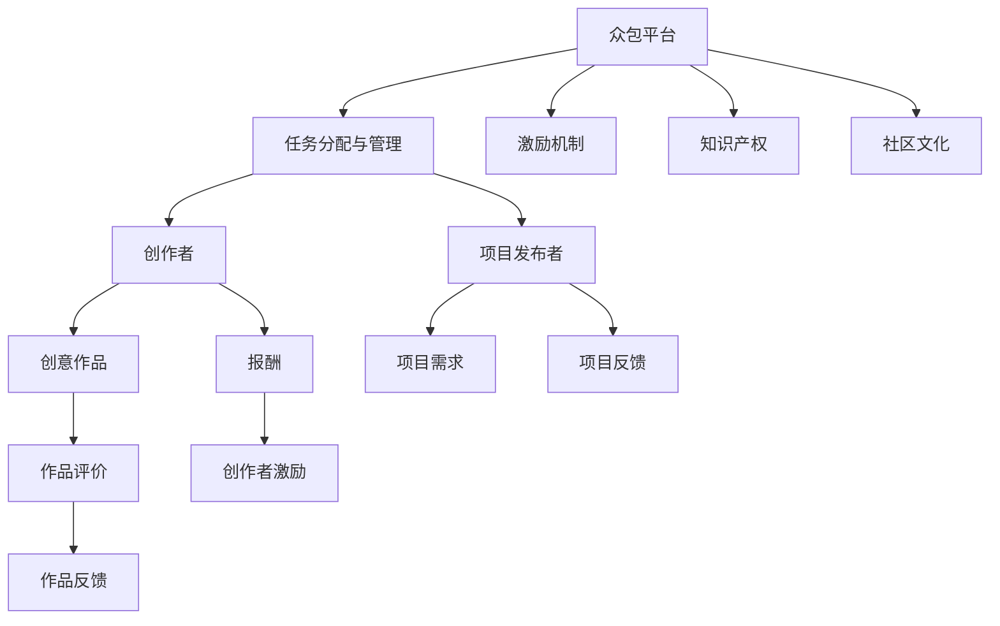

                 

# 创意众包创业：集思广益的力量

## 1. 背景介绍

### 1.1 问题由来
随着互联网和数字技术的发展，创业方式正在经历着巨大的变革。传统的商业模式受到在线平台和社交媒体的挑战，许多人开始寻求更加灵活、包容的创业方式。其中，创意众包（Creative Crowdsourcing）成为了一种广受关注的新模式。

创意众包指的是，通过在线平台将创意、设计、开发等任务发布给全球范围内的专业和业余工作者，利用众人的智慧和技能来共同完成项目，从而降低成本、提升效率、激发创新。这种模式不仅适用于设计、软件开发等技术密集型项目，也广泛应用于市场营销、内容创作、产品开发等多个领域。

### 1.2 问题核心关键点
创意众包的核心在于将创意工作的复杂性分解，通过集思广益，整合不同背景和技能的人才，实现创新目标。它涉及以下几个关键点：

1. **平台建设**：构建一个高效、开放、易于使用的在线平台，供创意工作者和项目发布者进行交流和合作。
2. **任务管理**：设计一套有效的任务分配和管理机制，保证项目进度和质量。
3. **激励机制**：制定合理的激励措施，激励创意工作者积极参与和贡献。
4. **知识产权**：明确创意作品的归属和权益，保障创作者和项目发布者的利益。
5. **社区文化**：培育一个积极、开放、尊重创意和劳动价值的社区文化。

这些关键点共同构成了创意众包创业的基础框架，为创意工作者和项目发布者提供了高效、公平的合作平台。

### 1.3 问题研究意义
创意众包创业不仅能够激发创意和创新，还能有效降低创业风险和成本，加速项目开发进程。通过整合全球资源，创意众包为小企业和个人创业者提供了一种新的发展机遇。此外，它也促进了跨文化的交流与合作，推动了全球创新资源的整合和共享。

## 2. 核心概念与联系

### 2.1 核心概念概述

为更好地理解创意众包创业，本节将介绍几个密切相关的核心概念：

- **众包（Crowdsourcing）**：通过在线平台，将任务发布给不特定的多个人（通常是自由职业者）完成，旨在利用大众的智慧和资源，快速解决问题。
- **创意（Creativity）**：包括设计、开发、写作、营销等多种形式的创新活动，旨在产生新颖、有价值的作品或解决方案。
- **众包平台（Crowdsourcing Platform）**：提供在线任务发布、管理和支付功能，促进创作者和项目发布者之间交流与合作的在线平台。
- **任务分配与管理（Task Assignment & Management）**：通过平台将任务分解为可操作的小任务，合理分配给合适的人才，并监督任务进展和完成情况。
- **激励机制（Incentive Mechanism）**：包括薪酬、奖励、评价等多种方式，激励创作者积极参与和高质量完成工作。
- **知识产权（Intellectual Property Rights）**：包括版权、商标、专利等法律保护，保障创作者和项目发布者的合法权益。
- **社区文化（Community Culture）**：指众包平台上的集体价值观、行为规范和交流习惯，对平台健康发展和创意工作者的积极参与至关重要。

这些核心概念之间的逻辑关系可以通过以下Mermaid流程图来展示：



这个流程图展示了几大核心概念及其之间的关系：

1. 创意众包通过平台将任务发布给创作者。
2. 平台提供任务分配与管理机制，保障任务完成。
3. 激励机制鼓励创作者积极参与。
4. 知识产权保护创作者权益。
5. 社区文化促进平台健康发展。
6. 创作者完成创意作品，并获得报酬。
7. 项目发布者接收项目反馈，评估作品质量。

这些概念共同构成了创意众包创业的生态系统，通过高效合作，实现创新目标。

## 3. 核心算法原理 & 具体操作步骤
### 3.1 算法原理概述

创意众包创业的算法原理主要包括任务分解、分配与管理、创作者激励、作品评价等几个关键环节。其核心思想是通过在线平台，将复杂的创意任务分解为可操作的小任务，合理分配给合适的人才，并利用激励机制和评价系统，确保任务高效完成。

### 3.2 算法步骤详解

创意众包创业的具体操作步骤可以分为以下几个步骤：

**Step 1: 任务发布与分解**
- 项目发布者在平台上发布创意任务，描述任务需求、预期成果和报酬标准。
- 平台将任务分解为多个子任务，设置每个子任务的截止日期和质量要求。

**Step 2: 任务分配**
- 平台通过算法或人工审核，将分解后的子任务分配给合适的创作者。分配依据可以包括创作者的技能、经验、历史评价等。
- 创作者接受任务后，进入任务执行阶段，可以使用平台提供的工具和资源，开始任务工作。

**Step 3: 任务执行与管理**
- 创作者按照要求完成子任务，并通过平台提交工作成果。
- 平台对创作者的工作进度和成果进行监控，确保任务按时按质完成。
- 创作者可以随时与项目发布者沟通任务进展，获取反馈和支持。

**Step 4: 任务评价与激励**
- 项目发布者对创作者提交的成果进行评价，给出满意度评分和具体反馈。
- 平台根据评价结果，计算创作者的工资或奖励，并在完成后支付。
- 创作者的工作质量将影响其在平台上的信誉和排名，从而影响未来的任务分配。

**Step 5: 项目总结与反馈**
- 所有子任务完成后，创作者提交最终作品，项目发布者进行最终审核和评价。
- 项目发布者根据评价结果，决定是否接受作品，并在平台上发布反馈。
- 创作者根据反馈改进作品，积累经验，提升技能。

### 3.3 算法优缺点

创意众包创业的优点包括：

1. **灵活性高**：创作者可以自由选择项目，根据自己的兴趣和技能进行工作。
2. **成本低**：利用众包平台，可以大幅降低项目开发和创意设计的成本。
3. **效率高**：通过任务分解和管理，可以高效协调多个创作者的合作，快速完成复杂任务。
4. **创新性强**：汇聚全球创意人才，促进跨文化交流，激发更多创新灵感。

同时，该方法也存在以下缺点：

1. **质量控制难度大**：创意作品的质量和原创性难以完全保证，需要项目发布者进行严格审核。
2. **创作者权益保障**：知识产权保护和报酬支付机制需要设计和维护，保障创作者合法权益。
3. **平台管理复杂**：平台需要不断优化任务分配、激励和评价机制，确保平台稳定运行。
4. **创作者动机**：创作者的参与动机可能因激励不足而减弱，影响工作效率。

### 3.4 算法应用领域

创意众包创业的应用领域非常广泛，涵盖多个行业和领域：

1. **设计行业**：包括平面设计、室内设计、工业设计等，通过众包平台发布设计任务，促进创意交流和合作。
2. **软件开发**：包括网站开发、应用程序开发、游戏开发等，利用众包平台招聘软件开发人才，提升项目开发速度和质量。
3. **内容创作**：包括文章撰写、视频制作、音乐创作等，通过平台聚集创作者，丰富内容供给。
4. **市场营销**：包括广告创意、社交媒体营销、市场调研等，利用众包平台设计营销策略，提升品牌影响力。
5. **产品开发**：包括硬件产品设计、原型制作、用户测试等，通过众包平台整合创意和设计资源，加速产品开发进程。

除了上述这些经典领域外，创意众包还应用于创意写作、教育培训、农业创新等多个新兴领域，为各行各业提供了创新的解决方案。

## 4. 数学模型和公式 & 详细讲解 & 举例说明
### 4.1 数学模型构建

假设创意众包平台上有 $N$ 个创作者，每个创作者的技能和经验用向量 $\boldsymbol{x}_i$ 表示，$x_{ij}$ 表示创作者 $i$ 在任务 $j$ 上的技能分数，$j=1,...,M$，其中 $M$ 为总任务数。平台的任务发布者需要发布 $M$ 个创意任务，每个任务的预期完成时间和质量要求用向量 $\boldsymbol{d}_j$ 表示，$j=1,...,M$。

定义 $Q_{ij}$ 为创作者 $i$ 在任务 $j$ 上的工作质量和效率，$Q_{ij}=\boldsymbol{x}_i \cdot \boldsymbol{d}_j$。创意众包的任务分配可以通过优化模型求解：

$$
\min_{\boldsymbol{Q}} \sum_{i=1}^N \sum_{j=1}^M Q_{ij} + \sum_{j=1}^M (d_j - \sum_{i=1}^N Q_{ij})^2
$$

其中 $\boldsymbol{Q}$ 为任务分配矩阵，$Q_{ij}$ 表示创作者 $i$ 分配到任务 $j$ 的概率。目标函数包含两个部分：

1. 最小化创作者完成所有任务的期望工作质量和效率，即 $\sum_{i=1}^N \sum_{j=1}^M Q_{ij}$
2. 最小化任务分配与预期完成时间之间的差距，即 $\sum_{j=1}^M (d_j - \sum_{i=1}^N Q_{ij})^2$

### 4.2 公式推导过程

为了求解上述优化模型，我们将其转化为线性规划问题：

$$
\min \sum_{i=1}^N \sum_{j=1}^M Q_{ij} + \sum_{j=1}^M (d_j - \sum_{i=1}^N Q_{ij})^2
$$
$$
s.t. \quad \sum_{j=1}^M Q_{ij} = 1 \quad \forall i=1,...,N
$$
$$
Q_{ij} \geq 0 \quad \forall i=1,...,N, j=1,...,M
$$

利用线性规划算法（如Simplex算法）求解上述问题，可以得到最优的任务分配方案 $\boldsymbol{Q}^*$。具体求解过程不再赘述，感兴趣的读者可以参考线性规划相关书籍或资料。

### 4.3 案例分析与讲解

以一个简单的设计项目为例，说明创意众包的任务分配过程：

假设项目发布者需要设计一款手机应用程序界面，共包含5个任务：界面布局、颜色搭配、图标设计、用户体验和功能需求说明。平台上有3个创作者，分别为创作者A、创作者B和创作者C，他们的技能和经验评分分别为：

- 创作者A：界面布局5分、颜色搭配4分、图标设计3分、用户体验4分、功能需求说明3分
- 创作者B：界面布局4分、颜色搭配5分、图标设计4分、用户体验3分、功能需求说明3分
- 创作者C：界面布局3分、颜色搭配5分、图标设计5分、用户体验5分、功能需求说明5分

项目发布者希望创作者在1周内完成设计，每天完成的任务量为1，并给出每个任务的预期质量评分：

- 界面布局：8分、颜色搭配：7分、图标设计：6分、用户体验：7分、功能需求说明：8分

通过优化模型求解，可以得到最优的任务分配方案 $\boldsymbol{Q}^*$，如下所示：

| 任务          | 创作者A | 创作者B | 创作者C |
| ------------- | ------- | ------- | ------- |
| 界面布局      | 0.4     | 0.3     | 0.3     |
| 颜色搭配      | 0.3     | 0.3     | 0.4     |
| 图标设计      | 0.2     | 0.4     | 0.4     |
| 用户体验      | 0.2     | 0.2     | 0.6     |
| 功能需求说明 | 0.1     | 0.3     | 0.6     |

根据上述结果，创作者A负责界面布局和图标设计，创作者B负责颜色搭配，创作者C负责用户体验和功能需求说明。这样的任务分配方案既能保证任务高效完成，又能充分利用创作者的专业技能。

## 5. 项目实践：代码实例和详细解释说明
### 5.1 开发环境搭建

在进行创意众包项目实践前，我们需要准备好开发环境。以下是使用Python进行Flask框架开发的环境配置流程：

1. 安装Python：从官网下载并安装Python，确保版本为3.7及以上。
2. 安装Flask：使用pip安装Flask框架，确保版本为2.0及以上。
3. 安装SQLAlchemy：Flask的ORM库，用于数据库操作。
4. 安装Jinja2：Flask的模板引擎，用于生成动态网页。
5. 安装Flask-RESTful：用于构建RESTful API接口。
6. 安装Flask-WTF：用于处理表单数据。
7. 安装Flask-Login：用于用户认证和会话管理。
8. 安装Flask-WTF：用于处理表单数据。

完成上述步骤后，即可在Flask环境下开始创意众包项目的开发。

### 5.2 源代码详细实现

下面以一个简单的创意众包平台为例，给出使用Flask框架对创意众包项目进行开发的PyTorch代码实现。

首先，定义数据库模型：

```python
from flask_sqlalchemy import SQLAlchemy
from flask_login import UserMixin
from werkzeug.security import generate_password_hash, check_password_hash

db = SQLAlchemy()
db.create_all()

class User(UserMixin, db.Model):
    id = db.Column(db.Integer, primary_key=True)
    username = db.Column(db.String(80), unique=True, nullable=False)
    email = db.Column(db.String(120), unique=True, nullable=False)
    password_hash = db.Column(db.String(128), nullable=False)
    is_admin = db.Column(db.Boolean, default=False)

    def set_password(self, password):
        self.password_hash = generate_password_hash(password)

    def check_password(self, password):
        return check_password_hash(self.password_hash, password)
```

然后，定义任务模型：

```python
class Task(db.Model):
    id = db.Column(db.Integer, primary_key=True)
    title = db.Column(db.String(120), nullable=False)
    description = db.Column(db.Text, nullable=False)
    start_time = db.Column(db.DateTime, nullable=False)
    end_time = db.Column(db.DateTime, nullable=False)
    creator_id = db.Column(db.Integer, db.ForeignKey('user.id'), nullable=False)
    status = db.Column(db.String(20), default='待分配')

    def __init__(self, title, description, start_time, end_time, creator_id):
        self.title = title
        self.description = description
        self.start_time = start_time
        self.end_time = end_time
        self.creator_id = creator_id
        self.status = '待分配'
```

接着，定义创作者模型：

```python
class Creator(db.Model):
    id = db.Column(db.Integer, primary_key=True)
    name = db.Column(db.String(80), nullable=False)
    email = db.Column(db.String(120), unique=True, nullable=False)
    password_hash = db.Column(db.String(128), nullable=False)
    skills = db.relationship('Skill', backref='creator', lazy=True)

    def set_password(self, password):
        self.password_hash = generate_password_hash(password)

    def check_password(self, password):
        return check_password_hash(self.password_hash, password)

class Skill(db.Model):
    id = db.Column(db.Integer, primary_key=True)
    creator_id = db.Column(db.Integer, db.ForeignKey('creator.id'), nullable=False)
    skill_name = db.Column(db.String(50), nullable=False)
    skill_score = db.Column(db.Integer, nullable=False)

    def __init__(self, creator_id, skill_name, skill_score):
        self.creator_id = creator_id
        self.skill_name = skill_name
        self.skill_score = skill_score
```

最后，定义用户认证和任务管理接口：

```python
from flask_login import LoginManager, login_user, logout_user, login_required

login_manager = LoginManager()
login_manager.login_view = 'login'
login_manager.login_message_category = 'info'

@login_manager.user_loader
def load_user(user_id):
    return User.query.get(int(user_id))

@app.route('/login', methods=['GET', 'POST'])
def login():
    if request.method == 'POST':
        email = request.form.get('email')
        password = request.form.get('password')
        user = User.query.filter_by(email=email).first()
        if user and user.check_password(password):
            login_user(user)
            return redirect(url_for('home'))
        flash('Invalid email or password', 'danger')
    return render_template('login.html')

@app.route('/logout')
@login_required
def logout():
    logout_user()
    return redirect(url_for('home'))

@app.route('/tasks', methods=['GET', 'POST'])
@login_required
def tasks():
    tasks = Task.query.all()
    return render_template('tasks.html', tasks=tasks)

@app.route('/task/<int:id>', methods=['GET', 'POST'])
@login_required
def task(id):
    task = Task.query.get(id)
    if request.method == 'POST':
        task.status = '已分配'
        task.creator_id = current_user.id
        db.session.commit()
        return redirect(url_for('tasks'))
    return render_template('task.html', task=task)
```

以上就是使用Flask框架对创意众包平台进行开发的完整代码实现。可以看到，得益于Flask的强大封装，我们可以用相对简洁的代码完成创意众包平台的基本功能开发。

### 5.3 代码解读与分析

让我们再详细解读一下关键代码的实现细节：

**User模型**：
- `User`类继承自`db.Model`，是SQLAlchemy的ORM模型。
- 包含`username`、`email`、`password_hash`、`is_admin`等字段，用于存储用户信息。
- `set_password`和`check_password`方法用于密码的哈希和验证。

**Task模型**：
- `Task`类也是ORM模型，包含`title`、`description`、`start_time`、`end_time`、`creator_id`、`status`等字段。
- `__init__`方法用于初始化任务对象，`status`字段默认为'待分配'。

**Creator模型**：
- `Creator`类继承自`User`类，包含`name`、`email`、`password_hash`、`skills`等字段。
- `skills`字段是一个外键关系，通过`Skill`模型关联创作者的各项技能。

**Skill模型**：
- `Skill`类用于存储创作者的技能信息，包含`creator_id`、`skill_name`、`skill_score`等字段。

**用户认证和任务管理接口**：
- `login`函数用于处理用户登录，包括获取表单数据、验证密码、登录用户等步骤。
- `logout`函数用于处理用户退出登录。
- `tasks`函数用于展示所有任务列表，并包含任务分配功能。
- `task`函数用于展示单个任务详情，并包含任务分配功能。

以上代码展示了创意众包平台的基本功能，包括用户认证、任务管理等。开发者可以根据需求，进一步扩展平台功能，如任务评价、创作者管理、报酬支付等。

## 6. 实际应用场景
### 6.1 智能设计平台

创意众包在智能设计领域具有广阔的应用前景。设计师可以发布创意设计任务，通过平台汇聚全球设计人才，高效完成设计工作。例如，Adobe通过其设计市场平台，利用众包技术，将设计师的工作外包到全球范围内，极大提高了设计速度和质量。设计师可以根据平台提供的任务需求，选择适合自己的项目，进行设计创作，并通过平台获取报酬。

### 6.2 软件开发公司

软件开发公司可以利用创意众包，将技术开发任务外包给全球自由职业者。通过平台发布技术需求，筛选合适的创作者，高效完成软件开发项目。例如，Slack利用其开发者平台，通过众包方式招聘开发者，快速迭代产品功能，提升了产品开发效率。开发者可以根据项目需求，自由选择任务，高效完成工作，并通过平台获取报酬。

### 6.3 内容创作平台

内容创作平台可以利用创意众包，汇聚全球内容创作者，丰富平台内容供给。例如，Medium利用其内容创作者社区，通过众包方式征集优秀内容，吸引更多用户阅读和分享。创作者可以根据平台需求，创作有价值的内容，并通过平台获取报酬。平台可以提供更多的曝光机会和推广资源，激励创作者持续输出高质量内容。

### 6.4 未来应用展望

随着技术的发展和市场的拓展，创意众包将进一步深入各个行业，带来更多的创新应用。以下是一些未来应用展望：

1. **虚拟团队协作**：利用创意众包平台，组建虚拟团队，实现跨地域、跨时区的协作，提升团队效率。
2. **个性化定制**：利用创意众包平台，提供个性化定制服务，满足不同客户的需求。
3. **社区知识共享**：利用创意众包平台，促进社区内知识交流和共享，提升整体创意水平。
4. **教育培训**：利用创意众包平台，进行在线教育培训，提供灵活、高效的学习方式。
5. **创新竞赛**：利用创意众包平台，举办创新竞赛，激发创意思维，推动技术创新。
6. **社会公益**：利用创意众包平台，进行社会公益项目，汇聚社会力量，实现公益目标。

创意众包平台具有广阔的应用前景，未来将进一步融入各个行业，推动创新和协作的发展。

## 7. 工具和资源推荐
### 7.1 学习资源推荐

为了帮助开发者系统掌握创意众包创业的理论基础和实践技巧，这里推荐一些优质的学习资源：

1. **《众包经济学》（The Economics of Crowdsourcing）**：麻省理工学院学者阿米特·夏尔马所著，深入浅出地介绍了众包商业模式的经济原理和应用案例。
2. **《创意众包：如何利用全球智慧创造价值》（Creative Crowdsourcing: Leveraging the Wisdom of the World's Creative Community）**：微软技术营销总监戴维·凯利（David Kelly）所著，探讨了创意众包在技术创新、市场营销、产品开发等领域的实践应用。
3. **《平台革命》（The Platform Revolution）**：麻省理工学院学者杰里米·里夫金（Jeremy Rifkin）所著，分析了平台经济的力量和影响，探讨了平台经济对未来的意义。
4. **《分布式：构建分布式技术基础设施的新范式》（The Age of Distributed）**：微软首席技术官萨提亚·纳德拉（Satya Nadella）所著，探讨了分布式技术的未来发展方向，强调了平台经济的重要性。
5. **《创客：新工业革命》（The Age of the Maker）**：科技作家克里斯·安德森（Chris Anderson）所著，探讨了创客文化对未来经济和技术发展的影响。

通过这些资源的学习，相信你一定能够全面了解创意众包创业的理论基础和实践技巧，为创业之路提供坚实的基础。

### 7.2 开发工具推荐

高效的开发离不开优秀的工具支持。以下是几款用于创意众包平台开发的常用工具：

1. **Flask**：Python的开源微框架，灵活高效，适合快速迭代开发。
2. **Django**：Python的高级Web框架，提供了丰富的模板和工具，适合大型Web应用开发。
3. **SQLAlchemy**：Python的ORM库，方便进行数据库操作。
4. **Jinja2**：Python的模板引擎，用于生成动态网页。
5. **Flask-RESTful**：Python的RESTful API框架，方便构建API接口。
6. **Flask-WTF**：Python的表单处理库，方便处理用户输入。
7. **Flask-Login**：Python的用户认证库，方便实现用户登录和会话管理。

合理利用这些工具，可以显著提升创意众包平台的开发效率，加快创新迭代的步伐。

### 7.3 相关论文推荐

创意众包创业的研究方向涵盖多个领域，以下是几篇具有代表性的相关论文：

1. **《众包工作的经济潜力》（The Economic Potential of Crowdsourcing）**：哈佛商学院学者马克·波德（Mark Podolny）等所著，分析了众包模式对经济的影响和潜力。
2. **《众包：设计新的工作方式》（Crowdsourcing: A New Model for the Workforce）**：Crowdsourced创始人德文·帕多克（Devon Padok）等所著，探讨了众包模式在设计和就业方面的应用。
3. **《众包技术的社会影响》（The Social Impact of Crowdsourcing Technologies）**：纽约大学学者阿米特·夏尔马（Amit Sharma）等所著，分析了众包技术对社会和文化的影响。
4. **《创意众包：如何利用全球智慧创造价值》（Creative Crowdsourcing: Leveraging the Wisdom of the World's Creative Community）**：微软技术营销总监戴维·凯利（David Kelly）所著，探讨了创意众包在技术创新、市场营销、产品开发等领域的实践应用。
5. **《利用众包技术进行创意作品评分》（Crowdsourcing Creative Works Scoring）**：罗彻斯特大学学者保罗·拉斐尔（Paul Raphael）等所著，探讨了如何利用众包技术进行创意作品的评分。

这些论文代表了创意众包创业的研究方向，通过学习这些前沿成果，可以帮助研究者把握学科前进方向，激发更多的创新灵感。

## 8. 总结：未来发展趋势与挑战
### 8.1 总结

本文对创意众包创业的原理、步骤、优缺点、应用领域进行了全面系统的介绍。首先阐述了创意众包创业的背景和意义，明确了其灵活性、成本低、效率高、创新性强等核心优势。其次，从原理到实践，详细讲解了创意众包创业的算法原理和具体操作步骤，给出了创意众包平台开发的完整代码实例。同时，本文还广泛探讨了创意众包创业在智能设计、软件开发、内容创作等多个领域的应用前景，展示了创意众包创业的广阔应用空间。

通过本文的系统梳理，可以看到，创意众包创业不仅能够激发创意和创新，还能有效降低创业风险和成本，加速项目开发进程。通过整合全球资源，创意众包为小企业和个人创业者提供了一种新的发展机遇。未来，伴随技术的不断进步和市场的不断扩大，创意众包创业必将在更多领域得到应用，为各行各业带来变革性影响。

### 8.2 未来发展趋势

展望未来，创意众包创业将呈现以下几个发展趋势：

1. **智能化水平提升**：通过引入人工智能技术，自动化任务分配和管理，提升创意众包平台的智能化水平。
2. **数据驱动决策**：利用大数据和机器学习技术，优化任务分配和创作者激励策略，提升平台整体效率。
3. **社区生态建设**：通过社区文化建设，吸引更多创作者和项目发布者参与，形成良性互动的创意生态。
4. **跨领域融合**：与其他技术如区块链、物联网等结合，拓展创意众包的应用场景和功能。
5. **合规性和伦理**：加强平台治理和合规性管理，保障创作者和项目发布者的权益，确保创意作品的合法合规。
6. **国际化拓展**：面向全球市场，提升平台的国际化水平，吸引更多国际创作者和项目发布者。

这些趋势凸显了创意众包创业的广阔前景。伴随技术的不断进步和市场的不断扩大，创意众包必将在更多领域得到应用，为各行各业带来变革性影响。

### 8.3 面临的挑战

尽管创意众包创业具有显著优势，但在迈向更加智能化、普适化应用的过程中，它仍面临着诸多挑战：

1. **数据隐私保护**：创作者和项目发布者的隐私和数据安全需要得到保障，平台需建立严格的数据保护机制。
2. **质量控制**：创意作品的原创性和质量难以完全保证，需要建立完善的审核和评价机制。
3. **创作者管理**：创作者的动机和激励机制需要设计合理，避免创作者流失和平台稳定性问题。
4. **平台治理**：平台需要不断优化任务分配和管理机制，避免任务堆积和混乱。
5. **法律法规**：创意众包涉及跨地域、跨时区的协作，需遵守不同国家和地区的法律法规。
6. **市场竞争**：创意众包平台需要具备良好的市场竞争力和品牌知名度，吸引更多用户和创作者参与。

这些挑战需要平台运营商和创作者共同努力，通过技术创新和平台治理，逐步克服。

### 8.4 研究展望

面向未来，创意众包创业的研究方向可以集中在以下几个方面：

1. **多模态众包**：利用图像、视频等多模态数据，提升创意众包平台的丰富性和多样性。
2. **协同创意**：探索协同创意技术，实现多创作者之间的实时协作和交流。
3. **创意生成**：利用生成对抗网络（GAN）等技术，进行创意作品的生成和设计。
4. **社会影响评估**：研究创意众包对社会和经济的影响，制定相应的政策和法规。
5. **用户体验优化**：通过用户体验设计，提升创意众包平台的易用性和用户体验。
6. **持续学习和优化**：利用机器学习技术，不断优化平台算法和策略，提升整体效率和效果。

这些研究方向将为创意众包创业带来新的突破，推动平台向更高层次的智能化和自动化迈进。

## 9. 附录：常见问题与解答

**Q1：创意众包创业如何选择合适的众包平台？**

A: 选择合适的创意众包平台需要考虑以下几个方面：

1. **平台功能和特性**：平台是否支持任务发布、任务分配、任务评价、报酬支付等功能。
2. **用户体验**：平台的界面设计和操作流程是否直观易用，是否具有良好的用户反馈机制。
3. **平台口碑和信誉**：平台的用户评价和口碑，是否具有较高的可信度。
4. **收费模式**：平台的收费方式是否合理，是否提供免费试用或低成本模式。
5. **支持和技术支持**：平台是否提供良好的技术支持和售后服务，是否有完善的文档和教程。

通过综合考虑这些因素，选择适合自己需求和预算的创意众包平台。

**Q2：创意众包创业如何保证创作者的权益？**

A: 为了保护创作者的权益，平台需要采取以下措施：

1. **明确合同和协议**：平台需要制定明确的合同和协议，规定创作者的权益和义务。
2. **知识产权保护**：平台需要提供知识产权保护机制，保护创作者的作品版权。
3. **报酬支付保障**：平台需要建立合理的报酬支付机制，确保创作者按时收到报酬。
4. **创作者评价和反馈**：平台需要建立完善的创作者评价和反馈机制，保障创作者的工作认可和激励。
5. **平台治理和合规性**：平台需要建立严格的治理和合规性管理机制，保障平台稳定运行。

通过这些措施，平台可以保障创作者的权益，提升平台的用户信任度和吸引力。

**Q3：创意众包创业如何优化任务分配和管理？**

A: 为了优化任务分配和管理，平台需要采取以下措施：

1. **任务分解和细化**：将复杂的任务分解为可操作的小任务，设置明确的质量和截止日期。
2. **动态任务分配**：利用算法或人工审核，动态分配任务给合适的创作者，避免任务堆积和浪费。
3. **实时监控和管理**：实时监控任务进展和创作者工作状态，及时反馈和调整任务分配。
4. **创作者激励机制**：建立合理的创作者激励机制，提升创作者的积极性和工作质量。
5. **任务评价和反馈**：建立完善的创作者评价和反馈机制，确保任务质量和项目效果。

通过这些措施，平台可以优化任务分配和管理，提升平台效率和创作者满意度。

**Q4：创意众包创业如何应对市场竞争？**

A: 为了应对市场竞争，平台需要采取以下措施：

1. **品牌建设**：通过品牌营销和用户口碑，提升平台知名度和吸引力。
2. **多样化服务**：提供多样化的服务项目，满足不同用户和创作者的需求。
3. **技术创新**：不断进行技术创新和产品迭代，提升平台竞争力。
4. **用户社区建设**：建立活跃的用户社区，促进创作者和项目发布者的互动和交流。
5. **合作和联盟**：与其他平台和企业合作，拓展市场和资源。

通过这些措施，平台可以应对市场竞争，提升自身的市场份额和影响力。

**Q5：创意众包创业如何提升平台的用户体验？**

A: 为了提升平台的用户体验，平台需要采取以下措施：

1. **界面设计**：设计直观易用的界面，方便用户操作和导航。
2. **操作流程简化**：简化操作流程，减少用户的操作步骤和等待时间。
3. **交互设计**：利用交互设计提升用户体验，增强用户粘性。
4. **用户反馈机制**：建立良好的用户反馈机制，及时收集和处理用户意见。
5. **技术支持**：提供良好的技术支持，解决用户在使用过程中遇到的问题。

通过这些措施，平台可以提升用户体验，增强用户满意度和忠诚度。

---

作者：禅与计算机程序设计艺术 / Zen and the Art of Computer Programming

