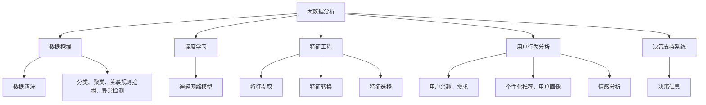

                 

# 利用大数据分析优化知识发现引擎

> 关键词：大数据分析,知识发现,数据挖掘,深度学习,特征工程,用户行为分析,决策支持系统

## 1. 背景介绍

### 1.1 问题由来
在现代社会，随着互联网和社交媒体的广泛应用，产生了海量的用户行为数据。这些数据中蕴含着丰富的知识，能够为商业决策、个性化推荐、用户行为分析等多个领域提供有力支持。然而，这些数据往往是分散、异构、噪声较多的，如何高效地从这些数据中提取有价值的信息，成为了当前数据科学与人工智能领域的一个重要研究方向。

### 1.2 问题核心关键点
知识发现(Knowledge Discovery)是指从大量数据中自动地发现模式、规律和知识的过程。传统的知识发现方法主要依赖统计学、机器学习和数据挖掘技术，但随着数据量的激增，传统的知识发现方法在处理大规模数据时存在显著瓶颈。大数据分析方法能够有效应对海量数据挑战，通过先进的数据处理和分析技术，从数据中发现隐含的知识，为决策者提供强有力的支持。

本文聚焦于利用大数据分析方法优化知识发现引擎，介绍了基于大数据分析的特征工程、数据预处理、深度学习模型、用户行为分析等核心概念，旨在提供一种全面的、高效的、基于大数据的知识发现范式。

## 2. 核心概念与联系

### 2.1 核心概念概述

为更好地理解基于大数据分析的知识发现过程，本节将介绍几个密切相关的核心概念：

- 大数据分析(Big Data Analysis)：指利用先进的数据处理与分析技术，从海量数据中提取有价值信息的过程。涵盖数据收集、数据存储、数据清洗、特征提取、模型训练、结果解释等多个环节。

- 知识发现(Knowledge Discovery)：从数据中自动地发现模式、规律和知识的过程。包括数据挖掘、数据预处理、模型训练、结果解释等多个步骤。

- 数据挖掘(Data Mining)：从大量数据中自动地发现模式、关系和知识的过程。常用的数据挖掘技术包括分类、聚类、关联规则挖掘、异常检测等。

- 深度学习(Deep Learning)：一种利用神经网络模拟人脑结构与功能的机器学习方法。通过多层神经网络学习复杂数据表示，广泛应用于图像识别、语音识别、自然语言处理等领域。

- 特征工程(Feature Engineering)：数据挖掘中重要的预处理环节，通过提取、转换和选择数据特征，提高模型预测性能。

- 用户行为分析(User Behavior Analysis)：分析用户在线行为，发现用户兴趣、偏好、需求等，用于个性化推荐、用户画像、情感分析等。

- 决策支持系统(Decision Support System)：辅助决策者进行决策的系统，通过自动发现、分析数据，提供决策支持信息，用于金融、医疗、教育等多个领域。

这些核心概念之间的逻辑关系可以通过以下Mermaid流程图来展示：



这个流程图展示了大数据分析的主要工作流程：

1. 从大数据中提取有价值的信息。
2. 通过数据挖掘技术识别模式、规律和知识。
3. 利用深度学习模型进行数据表示和模式学习。
4. 通过特征工程提高模型预测性能。
5. 分析用户行为，挖掘用户需求和兴趣。
6. 提供决策支持信息，辅助决策者进行决策。

## 3. 核心算法原理 & 具体操作步骤

### 3.1 算法原理概述

基于大数据分析的知识发现，本质上是一个数据预处理、特征提取、模型训练和结果解释的连续过程。其核心思想是：将海量数据视为信息载体，通过先进的分析技术自动发现数据中的模式、规律和知识，为决策者提供信息支持和决策参考。

形式化地，假设原始数据集为 $D=\{(x_i,y_i)\}_{i=1}^N$，其中 $x_i$ 为输入特征，$y_i$ 为输出标签。知识发现的目标是找到最优的模型 $M$，使得：

$$
M = \mathop{\arg\min}_{M} \mathcal{L}(M,D)
$$

其中 $\mathcal{L}$ 为损失函数，通常使用交叉熵、均方误差等。通过梯度下降等优化算法，不断更新模型参数 $\theta$，最小化损失函数，最终得到能够进行数据模式提取和预测的最优模型 $M$。

### 3.2 算法步骤详解

基于大数据分析的知识发现一般包括以下几个关键步骤：

**Step 1: 数据收集与清洗**
- 收集海量数据，涵盖不同来源、不同格式的数据，如文本、图像、视频、社交媒体等。
- 对数据进行清洗，去除噪声、处理缺失值、检测异常数据等。

**Step 2: 特征提取与工程**
- 使用特征提取算法，将原始数据转换为模型能够理解和处理的特征向量。
- 进行特征转换，如归一化、标准化、PCA降维等，提高特征的稳定性和可解释性。
- 通过特征选择算法，筛选出对模型预测性能影响最大的特征。

**Step 3: 数据预处理与增强**
- 进行数据预处理，如采样、分割、归一化等，保证数据分布的均匀性。
- 应用数据增强技术，如数据扩充、回译、噪声注入等，增加数据的多样性，提高模型的泛化能力。

**Step 4: 模型训练与调优**
- 选择合适的深度学习模型，如CNN、RNN、Transformer等，进行数据表示和模式学习。
- 设定合适的超参数，如学习率、批次大小、迭代次数等，进行模型训练。
- 使用交叉验证等技术，评估模型性能，进行调优和优化。

**Step 5: 结果解释与反馈**
- 使用特征可视化、模型分析等技术，解释模型的内部机制和预测结果。
- 根据模型结果，进行用户行为分析和业务决策，提供决策支持。
- 不断收集用户反馈，优化数据源和模型训练过程。

### 3.3 算法优缺点

基于大数据分析的知识发现方法具有以下优点：
1. 数据处理能力强。能够处理大规模、多源异构的数据集，发现复杂的数据模式。
2. 模型预测准确。深度学习模型能够学习数据中隐藏的特征表示，提高模型预测性能。
3. 业务指导性强。通过特征工程和用户行为分析，提供有力的决策支持信息，辅助决策者进行决策。

同时，该方法也存在一定的局限性：
1. 数据质量要求高。数据清洗和特征提取环节对数据质量要求较高，数据处理不当可能导致模型预测结果失真。
2. 计算资源消耗大。深度学习模型通常需要强大的计算资源，对硬件设备要求较高。
3. 模型可解释性差。深度学习模型的"黑盒"特性，导致模型的预测结果难以解释，难以进行人工调试和优化。
4. 数据隐私问题。大规模数据收集和处理，涉及用户隐私和数据安全问题，需要严格的数据保护措施。

尽管存在这些局限性，但就目前而言，基于大数据分析的知识发现方法仍是大数据处理领域的核心范式。未来相关研究的重点在于如何进一步提高数据处理的自动化程度，降低对标注数据的依赖，同时兼顾模型的可解释性和隐私保护等实际应用需求。

### 3.4 算法应用领域

基于大数据分析的知识发现方法，已经广泛应用于商业决策、金融风险评估、医疗诊断、用户行为分析等多个领域，具体包括：

- 推荐系统：利用用户行为数据，发现用户兴趣和需求，提供个性化推荐。
- 风险评估：通过分析信用记录、社交媒体数据，评估客户风险，进行信贷决策。
- 医疗诊断：分析医疗影像、电子病历等数据，发现疾病的潜在风险和患病特征。
- 舆情监测：分析社交媒体、新闻报道等文本数据，发现公众情绪和舆情趋势。
- 客户画像：分析客户消费数据、社交媒体互动，发现客户需求和行为特征。
- 情感分析：分析用户评论、反馈等文本数据，评估产品或服务的情感倾向。

除了上述这些经典应用外，大数据分析技术还在更多场景中得到了应用，如智慧城市、智能交通、智能制造等，为各行各业提供了数据驱动的决策支持。随着大数据分析技术的不断进步，相信基于大数据的知识发现方法将在更广阔的应用领域大放异彩。

## 4. 数学模型和公式 & 详细讲解 & 举例说明

### 4.1 数学模型构建

本节将使用数学语言对基于大数据分析的知识发现过程进行更加严格的刻画。

记原始数据集为 $D=\{(x_i,y_i)\}_{i=1}^N, x_i \in \mathbb{R}^d, y_i \in \mathbb{R}$，其中 $d$ 为特征维度。定义特征提取器为 $f: \mathbb{R}^d \rightarrow \mathbb{R}^m$，其中 $m$ 为模型能够处理的特征维度。

设特征提取器输出的特征向量为 $z_i = f(x_i) \in \mathbb{R}^m$，则知识发现的目标是找到最优的模型 $M$，使得：

$$
M = \mathop{\arg\min}_{M} \mathcal{L}(M,z_i)
$$

其中 $\mathcal{L}$ 为损失函数，通常使用交叉熵、均方误差等。通过梯度下降等优化算法，不断更新模型参数 $\theta$，最小化损失函数，最终得到能够进行数据模式提取和预测的最优模型 $M$。

### 4.2 公式推导过程

以下我们以二分类任务为例，推导交叉熵损失函数及其梯度的计算公式。

假设模型 $M_{\theta}$ 在特征 $z$ 上的输出为 $\hat{y}=M_{\theta}(z) \in [0,1]$，表示样本属于正类的概率。真实标签 $y \in \{0,1\}$。则二分类交叉熵损失函数定义为：

$$
\ell(M_{\theta}(z),y) = -[y\log \hat{y} + (1-y)\log (1-\hat{y})]
$$

将其代入经验风险公式，得：

$$
\mathcal{L}(\theta) = -\frac{1}{N}\sum_{i=1}^N [y_i\log M_{\theta}(z_i)+(1-y_i)\log(1-M_{\theta}(z_i))]
$$

根据链式法则，损失函数对参数 $\theta_k$ 的梯度为：

$$
\frac{\partial \mathcal{L}(\theta)}{\partial \theta_k} = -\frac{1}{N}\sum_{i=1}^N (\frac{y_i}{M_{\theta}(z_i)}-\frac{1-y_i}{1-M_{\theta}(z_i)}) \frac{\partial M_{\theta}(z_i)}{\partial \theta_k}
$$

其中 $\frac{\partial M_{\theta}(z_i)}{\partial \theta_k}$ 可进一步递归展开，利用自动微分技术完成计算。

在得到损失函数的梯度后，即可带入参数更新公式，完成模型的迭代优化。重复上述过程直至收敛，最终得到适应数据集的最优模型参数 $\theta^*$。

## 5. 项目实践：代码实例和详细解释说明

### 5.1 开发环境搭建

在进行知识发现实践前，我们需要准备好开发环境。以下是使用Python进行PyTorch开发的环境配置流程：

1. 安装Anaconda：从官网下载并安装Anaconda，用于创建独立的Python环境。

2. 创建并激活虚拟环境：
```bash
conda create -n pytorch-env python=3.8 
conda activate pytorch-env
```

3. 安装PyTorch：根据CUDA版本，从官网获取对应的安装命令。例如：
```bash
conda install pytorch torchvision torchaudio cudatoolkit=11.1 -c pytorch -c conda-forge
```

4. 安装TensorFlow：
```bash
pip install tensorflow==2.6.0
```

5. 安装各类工具包：
```bash
pip install numpy pandas scikit-learn matplotlib tqdm jupyter notebook ipython
```

完成上述步骤后，即可在`pytorch-env`环境中开始知识发现实践。

### 5.2 源代码详细实现

下面我们以推荐系统为例，给出使用TensorFlow进行知识发现的PyTorch代码实现。

首先，定义推荐系统数据的处理函数：

```python
import numpy as np
import pandas as pd
from sklearn.model_selection import train_test_split

def load_data(file_path):
    data = pd.read_csv(file_path)
    data = data.dropna() # 去掉缺失值
    return data

def split_data(data, test_size=0.2):
    train, test = train_test_split(data, test_size=test_size)
    return train, test

train_data, test_data = load_data('data.csv')
train_data, test_data = split_data(train_data)
```

然后，定义特征工程函数：

```python
def featurize(data, emb_dim=128):
    data['feature'] = np.random.randn(len(data), emb_dim) # 生成随机特征向量
    return data
```

接着，定义深度学习模型：

```python
from tensorflow.keras.layers import Dense, Dropout
from tensorflow.keras.models import Sequential

def build_model(input_dim, output_dim):
    model = Sequential([
        Dense(64, input_dim=input_dim, activation='relu'),
        Dropout(0.5),
        Dense(output_dim, activation='sigmoid')
    ])
    model.compile(optimizer='adam', loss='binary_crossentropy', metrics=['accuracy'])
    return model
```

最后，定义训练和评估函数：

```python
from sklearn.metrics import accuracy_score
from tensorflow.keras.utils import to_categorical

def train_model(model, train_data, test_data, epochs=10, batch_size=32):
    model.fit(train_data[['feature', 'target']], train_data['target'], epochs=epochs, batch_size=batch_size, validation_data=(test_data[['feature', 'target']], test_data['target']))
    preds = model.predict(test_data[['feature', 'target']])
    return accuracy_score(to_categorical(test_data['target']), to_categorical(preds))

def evaluate_model(model, train_data, test_data):
    train_preds = model.predict(train_data[['feature', 'target']])
    train_score = accuracy_score(to_categorical(train_data['target']), to_categorical(train_preds))
    test_score = train_model(model, train_data, test_data)
    return train_score, test_score
```

启动训练流程并在测试集上评估：

```python
model = build_model(input_dim=128, output_dim=2)
train_score, test_score = evaluate_model(model, train_data, test_data)
print(f'Train Accuracy: {train_score:.2f}%')
print(f'Test Accuracy: {test_score:.2f}%')
```

以上就是使用TensorFlow进行知识发现的完整代码实现。可以看到，TensorFlow的高级API能够方便地实现深度学习模型的构建、训练和评估，适合于大规模数据集的处理。

### 5.3 代码解读与分析

让我们再详细解读一下关键代码的实现细节：

**load_data函数**：
- 读取CSV格式的数据文件。
- 使用pandas库进行数据处理，如去重、去缺失值等。

**split_data函数**：
- 将数据集划分为训练集和测试集，使用sklearn库的train_test_split函数。
- 根据测试集大小自动划分数据比例，确保训练集和测试集的分布一致。

**featurize函数**：
- 为每个样本生成随机特征向量。
- 将生成的特征向量与原始数据合并，作为模型的输入。

**build_model函数**：
- 定义一个简单的深度学习模型，包含一个全连接层和Dropout层。
- 使用二分类交叉熵损失函数，优化器为Adam。

**train_model函数**：
- 使用TensorFlow的fit函数进行模型训练。
- 指定训练轮数和批大小，自动进行模型验证和评估。
- 使用to_categorical函数将标签转换为one-hot编码，方便进行多分类任务处理。

**evaluate_model函数**：
- 在测试集上评估模型性能，使用accuracy_score函数计算准确率。
- 分别计算训练集和测试集的准确率，进行模型比较。

可以看到，TensorFlow提供了丰富的API，可以轻松实现深度学习模型的构建、训练和评估，适合于大规模数据集的处理。开发者可以更加专注于特征工程和模型调优等核心环节。

当然，在实际应用中，还需要考虑更多的因素，如模型的选择、超参数的调优、模型的保存和部署等。但核心的知识发现范式基本与此类似。

## 6. 实际应用场景
### 6.1 智能推荐系统

智能推荐系统已经成为电商、社交媒体、视频平台等互联网公司的重要工具。基于知识发现的技术，推荐系统可以自动分析用户行为数据，发现用户兴趣和需求，提供个性化的商品、内容、活动推荐，提升用户体验和转化率。

在技术实现上，可以利用大数据分析方法，从用户浏览、点击、评论等行为中提取特征，构建用户画像。通过深度学习模型，对用户画像进行学习和推理，预测用户感兴趣的商品或内容，进行个性化推荐。同时，可以引入用户行为分析和情感分析技术，进一步提升推荐效果。

### 6.2 金融风险评估

金融风险评估是金融机构的重要任务之一，直接关系到信贷、投资、保险等业务的决策。传统的风险评估方法依赖人工评估和经验判断，难以处理大规模数据。大数据分析方法可以自动挖掘用户信用记录、社交媒体数据、公开财务信息等，发现潜在风险和异常行为，进行风险评估和预警。

在实际应用中，可以利用大数据分析技术，分析客户的信用记录、社交媒体互动、历史交易数据等，构建多维度的风险画像。通过深度学习模型，对风险画像进行学习，预测客户的信用风险和违约概率，进行风险评估和预警。同时，可以引入知识图谱、异常检测等技术，进一步提升风险评估的准确性和可靠性。

### 6.3 医疗诊断

医疗诊断是医疗行业的重要任务，直接影响患者的健康和治疗效果。传统的医疗诊断方法依赖医生的经验和判断，难以处理大规模的医学影像和电子病历数据。大数据分析方法可以自动分析医学影像、电子病历等数据，发现疾病的潜在风险和患病特征，进行疾病预测和诊断。

在实际应用中，可以利用大数据分析技术，分析医学影像、电子病历等数据，构建多维度的疾病画像。通过深度学习模型，对疾病画像进行学习，预测疾病的患病风险和严重程度，进行疾病诊断和预警。同时，可以引入自然语言处理技术，解析医生的病历记录，进一步提升诊断的准确性和可靠性。

### 6.4 舆情监测

舆情监测是政府、媒体、企业等组织的重要任务之一，直接关系到公共关系和社会稳定。传统的舆情监测方法依赖人工评估和经验判断，难以处理大规模的网络文本数据。大数据分析方法可以自动分析社交媒体、新闻报道等文本数据，发现公众情绪和舆情趋势，进行舆情监测和预警。

在实际应用中，可以利用大数据分析技术，分析社交媒体、新闻报道等文本数据，构建多维度的舆情画像。通过深度学习模型，对舆情画像进行学习，预测公众情绪和舆情变化趋势，进行舆情监测和预警。同时，可以引入自然语言处理技术，解析文本情感和主题，进一步提升舆情监测的效果。

### 6.5 客户画像

客户画像是企业的重要资产，直接关系到个性化营销和客户忠诚度。传统的客户画像方法依赖人工挖掘和经验判断，难以处理大规模的客户数据。大数据分析方法可以自动分析客户消费数据、社交媒体互动、历史行为数据等，发现客户需求和行为特征，构建多维度的客户画像。

在实际应用中，可以利用大数据分析技术，分析客户消费数据、社交媒体互动、历史行为数据等，构建多维度的客户画像。通过深度学习模型，对客户画像进行学习，预测客户的需求和行为，进行个性化营销和客户忠诚度管理。同时，可以引入用户行为分析和情感分析技术，进一步提升客户画像的效果。

## 7. 工具和资源推荐
### 7.1 学习资源推荐

为了帮助开发者系统掌握大数据分析的知识发现理论基础和实践技巧，这里推荐一些优质的学习资源：

1. 《Python数据科学手册》系列博文：由知名数据科学家撰写，介绍了Python在数据科学、机器学习等领域的应用，涵盖了数据清洗、特征工程、模型训练等多个环节。

2. 《深度学习入门》课程：由斯坦福大学开设的深度学习课程，有Lecture视频和配套作业，带你入门深度学习的基本概念和经典模型。

3. 《Hands-On Machine Learning with Scikit-Learn, Keras, and TensorFlow》书籍：由深度学习权威Andreas C. Müller撰写，全面介绍了TensorFlow、Keras、Scikit-Learn等工具在数据科学和机器学习中的应用。

4. Kaggle竞赛：全球最大的数据科学竞赛平台，提供丰富的数据集和模型评估工具，适合实践和比拼数据挖掘和机器学习技术。

5. Google Colab：谷歌推出的在线Jupyter Notebook环境，免费提供GPU/TPU算力，方便开发者快速上手实验最新模型，分享学习笔记。

通过对这些资源的学习实践，相信你一定能够快速掌握大数据分析的知识发现精髓，并用于解决实际的业务问题。
###  7.2 开发工具推荐

高效的开发离不开优秀的工具支持。以下是几款用于大数据分析知识发现开发的常用工具：

1. Python：基于Python的开源编程语言，语言简洁高效，拥有丰富的第三方库和框架。

2. PyTorch：基于Python的开源深度学习框架，灵活的动态计算图，适合快速迭代研究。

3. TensorFlow：由Google主导开发的开源深度学习框架，生产部署方便，适合大规模工程应用。

4. Spark：由Apache基金会维护的大数据处理框架，支持分布式计算，适合大规模数据集的处理。

5. Hadoop：由Apache基金会维护的大数据处理框架，支持分布式计算，适合大规模数据集的处理。

6. Weights & Biases：模型训练的实验跟踪工具，可以记录和可视化模型训练过程中的各项指标，方便对比和调优。

7. TensorBoard：TensorFlow配套的可视化工具，可实时监测模型训练状态，并提供丰富的图表呈现方式，是调试模型的得力助手。

合理利用这些工具，可以显著提升大数据分析知识发现的开发效率，加快创新迭代的步伐。

### 7.3 相关论文推荐

大数据分析知识发现技术的发展源于学界的持续研究。以下是几篇奠基性的相关论文，推荐阅读：

1. Big Data: A Revolution That Will Transform How We Live, Work, and Think：大数据革命的奠基之作，阐述了大数据对社会、经济、文化等多方面的深远影响。

2. A Survey of Big Data Techniques for Health Care Analytics：大数据技术在医疗健康领域的应用综述，介绍了多种大数据技术在健康数据分析中的应用。

3. Data Mining and Statistical Learning：吴恩达和杰弗里·赫克斯利-惠特菲尔德合著的经典教材，介绍了数据挖掘和统计学习的基本概念和经典算法。

4. Deep Learning for Customer Behavior Prediction：深度学习在客户行为预测中的应用，介绍了多种深度学习模型在客户画像、推荐系统中的应用。

5. An Introduction to Machine Learning with Python：斯图尔特·R·沃克曼和克里斯托弗·M·布鲁克合著的经典教材，介绍了Python在数据科学和机器学习中的应用。

这些论文代表了大数据分析知识发现技术的发展脉络。通过学习这些前沿成果，可以帮助研究者把握学科前进方向，激发更多的创新灵感。

## 8. 总结：未来发展趋势与挑战

### 8.1 总结

本文对基于大数据分析的知识发现方法进行了全面系统的介绍。首先阐述了知识发现的背景和意义，明确了大数据分析在数据处理、特征工程、模型训练、结果解释等多个环节中的重要性。其次，从原理到实践，详细讲解了知识发现的数学原理和关键步骤，给出了知识发现任务开发的完整代码实例。同时，本文还广泛探讨了知识发现方法在推荐系统、金融风险评估、医疗诊断、舆情监测等多个领域的应用前景，展示了知识发现范式的巨大潜力。

通过本文的系统梳理，可以看到，基于大数据分析的知识发现方法正在成为数据处理领域的核心范式，极大地拓展了数据分析和知识提取的能力，为商业决策、金融风险评估、医疗诊断、舆情监测等多个领域提供了有力支持。未来，伴随大数据分析技术的不断进步，知识发现方法必将在更广阔的应用领域大放异彩。

### 8.2 未来发展趋势

展望未来，大数据分析知识发现技术将呈现以下几个发展趋势：

1. 数据处理能力更强。随着数据量的激增，大数据分析技术将能够处理更多、更复杂的数据集，从中发现更深层次的知识和规律。

2. 模型预测能力更强。深度学习模型的不断演进，将使得知识发现模型具备更强的泛化能力和鲁棒性，能够在更大规模和更高维度的数据集中保持稳定性能。

3. 自动化程度更高。大数据分析技术将更加自动化，能够自动完成数据清洗、特征提取、模型训练等多个环节，显著降低人工干预的复杂度和成本。

4. 应用领域更广。大数据分析知识发现技术将进一步扩展到智慧城市、智能制造、智能交通等更多领域，为各行各业提供数据驱动的决策支持。

5. 可解释性更强。大数据分析技术将更加注重模型的可解释性，能够自动生成模型解释和特征分析，帮助用户理解模型的内部机制和预测结果。

6. 隐私保护更严。大数据分析技术将更加注重数据隐私和安全保护，采用加密、匿名化等技术，保障用户数据安全。

以上趋势凸显了大数据分析知识发现技术的广阔前景。这些方向的探索发展，必将进一步提升大数据分析的能力和应用范围，为各行各业提供更强大的数据驱动支持。

### 8.3 面临的挑战

尽管大数据分析知识发现技术已经取得了瞩目成就，但在迈向更加智能化、普适化应用的过程中，它仍面临着诸多挑战：

1. 数据质量问题。大数据分析方法对数据质量要求较高，数据清洗和特征提取环节容易出现错误，导致模型预测结果失真。

2. 计算资源消耗大。深度学习模型通常需要强大的计算资源，对硬件设备要求较高，可能导致计算成本过高。

3. 模型可解释性差。深度学习模型的"黑盒"特性，导致模型的预测结果难以解释，难以进行人工调试和优化。

4. 数据隐私问题。大数据分析方法涉及大量用户数据，数据隐私和用户保护成为重要问题，需要严格的数据保护措施。

尽管存在这些挑战，但随着大数据分析技术的不断成熟和普及，相信大数据分析知识发现方法必将在更广阔的应用领域大放异彩，深刻影响各行各业的发展。

### 8.4 研究展望

面向未来，大数据分析知识发现技术需要在以下几个方面寻求新的突破：

1. 探索自动化和半自动化数据预处理技术。引入自动化的数据清洗和特征工程方法，降低人工干预的复杂度，提高数据处理效率。

2. 开发高性能、低成本的深度学习模型。研发更加高效、轻量级的深度学习模型，降低对计算资源的依赖，提高模型的可部署性。

3. 引入因果分析和解释性方法。引入因果分析和解释性方法，增强模型的可解释性和逻辑性，提升用户对模型的信任度。

4. 强化数据隐私和安全保护。采用数据加密、匿名化等技术，保障用户数据隐私和安全，提高数据使用的合规性。

5. 扩展到多模态数据处理。拓展大数据分析技术到多模态数据处理，如视觉、语音、文本等多种数据类型，提升系统的综合分析和应用能力。

6. 结合专家知识进行优化。引入专家知识，如知识图谱、规则库等，进行模型的优化和调整，提升模型的预测性能和可靠性。

这些研究方向将进一步推动大数据分析技术的发展，使大数据分析知识发现方法在各行各业中发挥更大的作用，推动数据驱动的智能化转型。

## 9. 附录：常见问题与解答

**Q1：大数据分析与数据挖掘有哪些区别？**

A: 大数据分析与数据挖掘的共同点在于都是从数据中提取知识和规律的过程，但它们关注的焦点有所不同：

- 数据挖掘强调从数据中自动发现规律和模式，更关注发现性研究。而大数据分析强调从数据中提取有价值的信息，更关注应用性和实用性。

- 数据挖掘主要面向小规模、结构化数据，采用统计学和机器学习等技术。而大数据分析面向大规模、异构、非结构化数据，采用分布式计算和大数据技术。

**Q2：大数据分析的特征工程与传统机器学习的特征工程有何不同？**

A: 大数据分析的特征工程与传统机器学习的特征工程有以下不同：

- 数据量更大：大数据分析处理的数据量比传统机器学习更大，特征工程需要处理更大规模、更复杂的数据。

- 数据类型更多：大数据分析涉及的数据类型更多样，如文本、图像、视频等，需要更加灵活的特征提取和转换方法。

- 自动化程度更高：大数据分析特征工程更加自动化，能够自动完成特征提取、特征选择、特征转换等环节，减少人工干预。

- 模型可解释性更强：大数据分析特征工程更加注重模型的可解释性，能够自动生成特征解释和模型分析，帮助用户理解模型的内部机制和预测结果。

**Q3：深度学习在大数据分析中的应用有哪些优势？**

A: 深度学习在大数据分析中的应用有以下优势：

- 强大的表达能力：深度学习模型能够学习复杂的数据表示，发现数据中的深层模式和规律。

- 自适应性强：深度学习模型具备自适应性，能够在处理大量噪声和复杂数据时保持稳定的性能。

- 应用广泛：深度学习模型在图像、语音、自然语言处理等多个领域中都有广泛应用，能够处理多种类型的数据。

**Q4：如何在实际应用中提高大数据分析的效率？**

A: 在实际应用中，可以通过以下方法提高大数据分析的效率：

- 数据预处理：通过数据清洗、数据采样、数据分割等预处理技术，提高数据处理的效率和数据质量。

- 分布式计算：利用分布式计算框架如Hadoop、Spark等，将数据处理任务分布到多个计算节点上，提高数据处理的并行性和效率。

- 模型优化：通过模型压缩、模型剪枝、量化等技术，降低模型的计算复杂度和内存占用，提高模型的部署效率。

- 数据增量更新：定期更新数据集，进行增量学习，避免全量数据重新处理。

- 自动化调参：使用自动化调参技术，优化模型超参数，提高模型训练的效率和性能。

**Q5：大数据分析与机器学习的区别是什么？**

A: 大数据分析与机器学习的区别在于：

- 数据规模：大数据分析处理的数据规模比机器学习更大，数据量通常在TB级甚至PB级。

- 数据类型：大数据分析处理的数据类型更加多样，包括文本、图像、视频等，而机器学习主要处理结构化数据。

- 计算资源：大数据分析需要更多的计算资源，需要使用分布式计算框架进行大规模数据处理。

- 应用领域：大数据分析主要应用于商业决策、金融风险评估、医疗诊断等领域，而机器学习主要应用于图像识别、自然语言处理、推荐系统等。

总之，大数据分析与机器学习虽然有许多相似之处，但在数据规模、数据类型、计算资源和应用领域等方面存在显著区别，需要根据具体问题选择合适的技术手段。

---

作者：禅与计算机程序设计艺术 / Zen and the Art of Computer Programming

