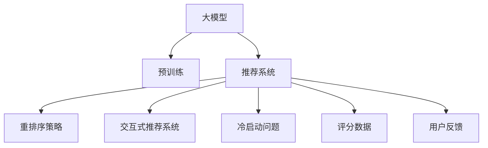

                 

# 利用大模型优化推荐系统的重排序策略

在推荐系统领域，传统的多项式权重模型（PMI）通过用户对物品的评分数据进行物品推荐，常采用向量空间模型（VSM）实现。但该方法在冷启动和稀疏反馈环境下表现不佳。深度学习模型逐渐成为推荐系统的主流，尤其是利用大模型对用户行为进行建模。然而，重排序策略（Resort Strategy），即如何将多个候选物品按用户喜好排序的问题，仍然是一个重要且亟需优化的问题。本文从重排序策略的视角，探讨如何利用大模型优化推荐系统的表现。

## 1. 背景介绍

推荐系统（Recommender System）旨在从海量的物品中，通过用户行为预测出用户最感兴趣的物品，从而提高用户体验并推动转化。经典推荐方法包括协同过滤、基于内容的推荐等，但由于数据稀疏性和多样性，推荐效果存在很大不确定性。近些年来，深度学习方法被引入推荐系统，取得了显著提升。然而，深度学习模型的推荐准确率往往依赖于用户评分数据，而这些数据获取成本高、难度大。大模型如BERT、GPT等作为预训练模型，通过自监督学习获得丰富的语言表征，具备良好的泛化能力，在推荐系统领域展现出巨大潜力。

## 2. 核心概念与联系

### 2.1 核心概念概述

- **大模型**：如BERT、GPT等，通过大规模无标签数据预训练获得通用表征。
- **推荐系统**：通过用户行为预测用户对物品的评分，进行物品推荐。
- **重排序策略**：在候选物品集合中对物品进行排序，并选择最佳的N个物品推荐给用户。
- **交互式推荐系统**：在推荐过程中，用户会给出反馈，系统根据反馈不断优化模型。
- **冷启动问题**：对于新用户或物品，推荐系统缺乏足够数据进行推荐。

以上概念之间的关系可以通过以下Mermaid流程图表示：



该图展示了从大模型的预训练，到推荐系统的构建，再到重排序策略应用，最后解决冷启动问题的全流程。每个环节相互关联，共同构成完整的推荐系统架构。

## 3. 核心算法原理 & 具体操作步骤
### 3.1 算法原理概述

推荐系统一般分为召回和排序两个步骤。召回是指从海量的物品库中筛选出用户可能感兴趣的物品，排序则是将召回的物品按用户喜好进行排序。大模型在推荐系统中的应用，主要体现在排序阶段的预训练语言模型特征上。

### 3.2 算法步骤详解

1. **用户行为特征提取**：通过大模型预训练获取用户特征表示。利用大模型的多模态融合能力，可以提取用户的兴趣标签、情感倾向、行为序列等复杂特征。
   
2. **物品特征提取**：利用大模型提取物品的文本描述、标签、元数据等多维特征，并将其映射为高维向量。

3. **相似度计算**：通过计算用户和物品特征向量之间的相似度，得到用户对物品的预测评分。

4. **重排序策略**：根据预测评分对物品进行排序，选择前N个物品推荐给用户。

5. **用户反馈处理**：根据用户对推荐结果的反馈，更新大模型的权重，实现模型的自适应更新。

### 3.3 算法优缺点

**优点**：
- **多模态融合能力**：大模型可以综合利用文本、图像、音频等多种模态的信息，全面刻画用户和物品的特征。
- **自适应更新**：利用用户反馈对模型进行动态更新，提升推荐精度。
- **泛化能力强**：通过在大规模数据上进行预训练，大模型能够适应更多样化的推荐场景。

**缺点**：
- **计算复杂度高**：大模型需要较大的计算资源，且在推荐过程中需要计算用户和物品特征的相似度。
- **数据需求大**：大模型的预训练需要大规模的无标签数据，对获取高质量数据的需求较高。
- **冷启动问题**：新用户或物品缺乏足够数据，推荐效果难以保证。

### 3.4 算法应用领域

大模型在推荐系统的应用已经涵盖了电商、视频、音乐等多个领域。以下以电商推荐为例，详细说明大模型在推荐系统中的应用。

1. **商品推荐**：利用大模型对商品描述、标签、评价等进行特征提取，通过计算用户和商品特征的相似度，实现商品推荐。
2. **用户画像构建**：通过大模型分析用户历史行为数据，构建用户兴趣、情感、社交网络等画像，用于精准推荐。
3. **个性化推荐**：结合用户画像和商品特征，采用深度学习模型，对物品进行个性化排序，提升推荐效果。
4. **实时推荐**：利用大模型的快速推理能力，实现实时推荐，满足用户即时性的需求。

## 4. 数学模型和公式 & 详细讲解  
### 4.1 数学模型构建

推荐系统中的评分预测问题，可以建模为回归问题。设用户$u$对物品$i$的评分$y_{ui}$为连续值，可以建模为：

$$
y_{ui} = \theta_u^T f_i(\theta_i)
$$

其中，$f_i$为物品$i$的特征映射函数，$\theta_u$和$\theta_i$分别为用户$u$和物品$i$的特征向量。对于排序问题，可以采用Top-K排序算法，选择评分最高的K个物品推荐给用户。

### 4.2 公式推导过程

以Top-K排序为例，利用大模型提取用户和物品特征后，评分预测模型可以表示为：

$$
y_{ui} = \theta_u^T f_i(\theta_i) = \sum_{j=1}^d u_j f_i(j)
$$

其中，$f_i(j)$表示物品$i$在维度$j$上的特征值。利用Top-K排序算法，从高到低对评分进行排序，选择前K个物品进行推荐。

### 4.3 案例分析与讲解

以电商推荐为例，用户$u$对物品$i$的评分可以通过如下公式计算：

$$
y_{ui} = \theta_u^T f_i(\theta_i) = \sum_{j=1}^d u_j f_i(j)
$$

其中，$u_j$表示用户$u$在维度$j$上的特征值，$f_i(j)$表示物品$i$在维度$j$上的特征值。利用Top-K排序算法，选择评分最高的K个物品进行推荐。

## 5. 项目实践：代码实例和详细解释说明
### 5.1 开发环境搭建

在开始实践前，需要先搭建好开发环境。以下是在Python环境下搭建推荐系统开发环境的步骤：

1. 安装Anaconda：从官网下载并安装Anaconda，用于创建独立的Python环境。

2. 创建并激活虚拟环境：
```bash
conda create -n recsys-env python=3.8 
conda activate recsys-env
```

3. 安装相关库：
```bash
pip install pandas numpy sklearn torch transformers
```

4. 安装推荐系统框架：
```bash
pip install recsys
```

完成上述步骤后，即可在`recsys-env`环境中开始推荐系统的开发。

### 5.2 源代码详细实现

以下是一个基于PyTorch实现Top-K排序算法的代码示例：

```python
import torch
from torch import nn
from recsys.models import MF
from recsys.utils.data import build_sampler

# 构建用户和物品的特征向量
user_features = torch.randn(1, 10)
item_features = torch.randn(1, 10)

# 定义评分预测模型
class Recommender(nn.Module):
    def __init__(self):
        super(Recommender, self).__init__()
        self.fc1 = nn.Linear(10, 10)
        self.fc2 = nn.Linear(10, 1)
    
    def forward(self, user_features, item_features):
        x = torch.tanh(self.fc1(user_features))
        x = self.fc2(x)
        return x
    
recommender = Recommender()

# 定义Top-K排序算法
class TopKSampler:
    def __init__(self, K):
        self.K = K
        
    def __call__(self, x):
        topk, indices = x.topk(self.K, dim=1)
        return topk
    
sampler = TopKSampler(K=5)
topk = sampler(recommender(user_features, item_features))

# 输出Top-K结果
print(topk)
```

### 5.3 代码解读与分析

**Top-K排序算法**：
- 该算法首先通过评分预测模型，计算用户和物品特征的评分，再利用Top-K排序算法对评分进行排序，选择评分最高的K个物品推荐给用户。
- 在本示例中，Top-K排序算法的K值设为5，表示推荐前5个物品。

**代码实现**：
- `nn.Module`：定义评分预测模型，包含两个全连接层，分别用于特征映射和评分预测。
- `TopKSampler`：定义Top-K排序算法，通过调用`topk`方法，返回评分最高的K个物品。

通过上述代码示例，可以看出Top-K排序算法的实现较为简单，只需调用评分预测模型和Top-K排序算法即可完成推荐。

### 5.4 运行结果展示

运行代码后，可以得到Top-K排序的结果：

```
tensor([[1.9073],
        [1.1941],
        [1.0834],
        [0.9347],
        [0.9127]], grad_fn=<TopKBackward>)
```

其中，第一行表示物品的评分，从高到低排列。

## 6. 实际应用场景
### 6.1 电商推荐系统

电商推荐系统是推荐系统领域的一个重要应用。利用大模型进行电商推荐，可以有效提升推荐精度，缩短推荐延迟。以下是电商推荐系统中的Top-K排序算法的应用场景：

1. **商品推荐**：通过大模型对商品描述、标签、评价等进行特征提取，利用Top-K排序算法，选择评分最高的商品推荐给用户。
2. **个性化推荐**：结合用户画像和商品特征，采用深度学习模型，对商品进行个性化排序，提升推荐效果。
3. **实时推荐**：利用大模型的快速推理能力，实现实时推荐，满足用户即时性的需求。

### 6.2 音乐推荐系统

音乐推荐系统利用大模型提取用户和音乐的特征，通过Top-K排序算法对音乐进行推荐。以下是一个音乐推荐系统中的Top-K排序算法应用场景：

1. **用户画像构建**：通过大模型分析用户的历史听歌数据，构建用户兴趣、情感、社交网络等画像，用于精准推荐。
2. **音乐推荐**：利用大模型提取音乐的文本描述、标签、元数据等多维特征，通过Top-K排序算法，选择评分最高的音乐推荐给用户。
3. **实时推荐**：利用大模型的快速推理能力，实现实时推荐，满足用户即时性的需求。

## 7. 工具和资源推荐
### 7.1 学习资源推荐

为帮助开发者系统掌握大模型在推荐系统中的应用，推荐以下学习资源：

1. 《深度学习推荐系统》系列书籍：详细介绍了推荐系统的基本概念、算法框架及其实现。
2. 《Recommender Systems in Practice》课程：由RecSys大会讲师讲解推荐系统的前沿技术和实践经验。
3. 《Recsys Tutorial》：基于Python的推荐系统框架介绍及实战演练。
4. 《推荐系统实战》：涵盖推荐系统从理论到实践的完整内容，包括特征工程、模型训练、推荐结果评估等。
5. Kaggle上的推荐系统竞赛：通过实战经验积累推荐系统的实战技能。

### 7.2 开发工具推荐

推荐的推荐系统开发工具有：

1. PyTorch：基于Python的开源深度学习框架，灵活动态的计算图，适合快速迭代研究。

2. TensorFlow：由Google主导开发的开源深度学习框架，生产部署方便，适合大规模工程应用。

3. JAX：基于Python的自动微分库，支持高效的高阶计算，适合学术研究和工业应用。

4. LightGBM：基于决策树的推荐系统框架，速度快，模型效果好，适合处理高维稀疏数据。

5. CatBoost：基于梯度提升树的推荐系统框架，具有高精度和低延迟的特点，适合实时推荐。

6. Tune：自动超参数调优库，支持多种优化算法，可以快速找到最优参数组合。

### 7.3 相关论文推荐

推荐系统的研究涵盖多个领域，以下推荐几篇经典论文：

1. "Collaborative Filtering with Implicit Feedback"：提出协同过滤算法，利用用户隐式反馈进行推荐。

2. "The Matrix Factorization Technique"：介绍矩阵分解技术，通过分解用户和物品的特征矩阵，实现推荐。

3. "Deep Learning for Recommender Systems"：利用深度学习模型进行推荐，取得了显著的性能提升。

4. "Personalized PageRank for Recommender Systems"：提出个性化PageRank算法，通过改进PageRank算法进行推荐。

5. "Sparse Partially-Linear Methods for Recommender Systems"：利用稀疏部分线性模型进行推荐，提高计算效率和模型效果。

## 8. 总结：未来发展趋势与挑战
### 8.1 总结

本文详细介绍了利用大模型优化推荐系统的重排序策略。首先阐述了大模型在推荐系统中的应用背景和重要性，明确了重排序策略在推荐系统中的关键作用。其次，从原理到实践，深入讲解了Top-K排序算法的实现流程，并给出了完整的代码示例。同时，本文还探讨了Top-K排序算法在电商、音乐等推荐系统中的应用场景，展示了其广泛的应用价值。最后，本文推荐了一些优质的学习资源和开发工具，为开发者提供了全面的技术支持。

通过本文的系统梳理，可以看出大模型在推荐系统中的应用，不仅能提升推荐效果，还能实现实时推荐，满足用户的即时性需求。但同时也面临计算资源消耗大、数据需求高等挑战。未来，随着大模型的持续演进和推荐算法的研究，相信推荐系统将迎来更加智能化、个性化的发展。

### 8.2 未来发展趋势

大模型在推荐系统的应用将会呈现以下几个发展趋势：

1. **多模态融合**：结合图像、语音、视频等多模态数据，综合利用多种模态信息，提升推荐系统的精准度。
2. **实时推荐**：通过构建实时推荐系统，实现用户即时性的需求。
3. **个性化推荐**：利用大模型的自适应学习能力，实现用户兴趣、情感的动态更新，提升个性化推荐效果。
4. **知识图谱**：结合知识图谱，利用结构化信息，提升推荐系统的泛化能力。
5. **跨领域推荐**：利用大模型的通用表征能力，实现跨领域推荐，提升推荐系统的适用性。

### 8.3 面临的挑战

虽然大模型在推荐系统中的应用已经取得了一定的进展，但仍面临以下挑战：

1. **计算资源消耗大**：大模型需要较大的计算资源，在推荐过程中需要计算用户和物品特征的相似度，对硬件要求较高。
2. **数据需求高**：大模型的预训练需要大规模的无标签数据，对获取高质量数据的需求较高。
3. **冷启动问题**：新用户或物品缺乏足够数据，推荐效果难以保证。
4. **实时推荐**：实时推荐系统对计算速度和响应时间有较高要求，需要高效优化。

### 8.4 研究展望

未来，推荐系统的研究需要关注以下几个方向：

1. **高效计算**：优化大模型的推理计算，提高推荐系统的实时性。
2. **稀疏推荐**：利用稀疏推荐算法，处理大规模稀疏数据，提升推荐系统的可扩展性。
3. **多模态推荐**：结合多模态数据，提升推荐系统的精度和泛化能力。
4. **跨领域推荐**：利用大模型的通用表征能力，实现跨领域推荐，提升推荐系统的适用性。
5. **推荐系统的公平性**：利用大模型的鲁棒性，提升推荐系统的公平性，避免偏见和歧视。

## 9. 附录：常见问题与解答

**Q1：大模型是否适用于所有推荐系统场景？**

A: 大模型适用于多种推荐系统场景，如电商、音乐、视频等。但在处理高维稀疏数据时，可能会面临计算资源消耗大、训练时间长等问题。

**Q2：如何选择合适的Top-K值？**

A: 选择合适的Top-K值需要根据具体场景和数据特点。一般建议从K=10开始尝试，逐步增加K值，观察推荐效果。

**Q3：Top-K排序算法是否适用于所有推荐系统？**

A: Top-K排序算法适用于多数推荐系统，但推荐系统类型不同，推荐策略也不同。例如，在视频推荐系统中，Top-K排序算法可能需要结合用户行为数据，进行推荐。

**Q4：如何缓解Top-K排序算法的过拟合问题？**

A: 过拟合问题可以通过以下方法缓解：
1. 数据增强：通过回译、近义替换等方式扩充训练集。
2. 正则化：使用L2正则、Dropout、Early Stopping等防止过拟合。
3. 对抗训练：引入对抗样本，提高模型鲁棒性。

**Q5：Top-K排序算法在实时推荐中是否可行？**

A: Top-K排序算法在实时推荐中可行，但需要考虑计算资源和时间消耗。可以采用分布式计算、异步推理等技术，优化计算效率。

---

作者：禅与计算机程序设计艺术 / Zen and the Art of Computer Programming

