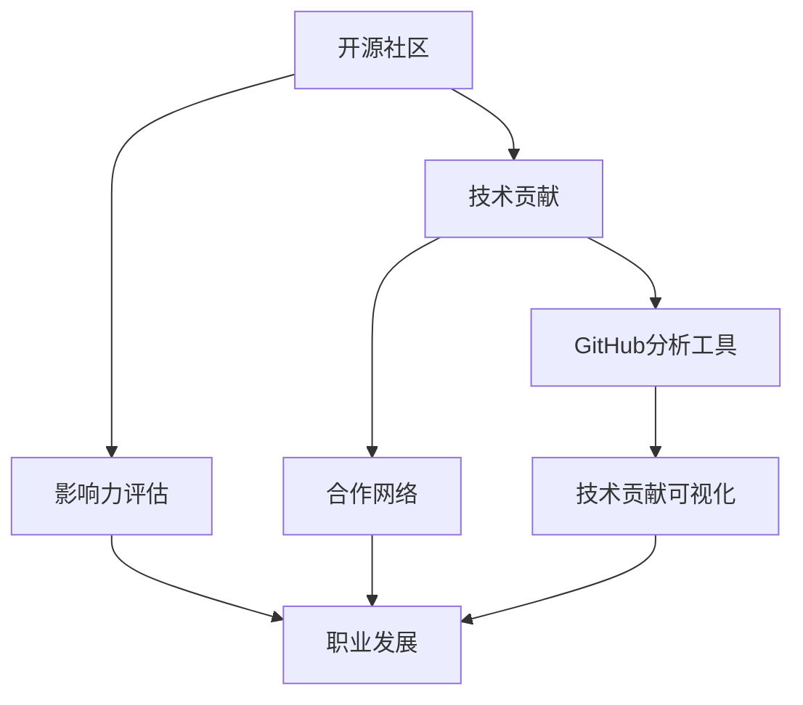

                 

# 利用开源影响力进行职业谈判

> 关键词：
1. 开源社区
2. 技术贡献
3. 职业发展
4. 影响力评估
5. 合作网络
6. GitHub分析工具
7. 职业谈判策略

## 1. 背景介绍

### 1.1 问题由来
在当前的技术环境中，开源社区已成为全球技术交流与合作的核心平台。无论是初创企业还是大型公司，无论是个人开发者还是团队组织，都离不开开源技术的支持和贡献。然而，如何评估开源贡献的价值，利用开源影响力进行职业谈判，始终是一个复杂而微妙的问题。在招聘过程中，公司HR往往很难通过传统的方式准确评估开发者的技术水平和影响力，导致招聘结果难以达到预期。

### 1.2 问题核心关键点
如何利用开源影响力进行职业谈判，关键在于如何量化开源贡献的价值，构建开发者个人的合作网络，并在职业谈判中展示自身的影响力和潜力。这不仅需要开发者具备开源项目的贡献记录，还需要能够从多个角度评估和证明自身在开源社区中的影响力。

### 1.3 问题研究意义
在开源社区日益活跃的今天，如何通过开源影响力提升自身价值，获取更好的职业发展机会，已成为每个开发者不得不面对的现实问题。掌握有效的开源影响力评估和展示方法，能够帮助开发者更好地展示自己的技术能力、合作精神和社区影响力，从而在职业谈判中占据优势，获取更高的薪资和职位。

## 2. 核心概念与联系

### 2.1 核心概念概述

为更好地理解开源影响力的评估和展示方法，本节将介绍几个密切相关的核心概念：

- 开源社区(Open Source Community)：由全球开发者共同参与、贡献和维护的软件生态系统。包括代码托管平台如GitHub、GitLab等，以及各种开源项目和工具。
- 技术贡献(Technical Contribution)：开发者在开源项目中进行的代码编写、修复、优化、文档编写等活动。是开发者影响力评估的重要依据。
- 职业发展(Career Development)：开发者通过技术贡献和影响力积累，获取更好的职位、薪资、机会的过程。
- 影响力评估(Influence Assessment)：通过定量和定性方法，评估开发者在开源社区中的知名度、贡献度、合作网络等。是职业谈判的重要参考。
- 合作网络(Collaborative Network)：开发者在开源社区中的合作网络，包括项目贡献记录、社区互动历史等。
- GitHub分析工具(GitHub Analytics Tools)：利用GitHub等平台提供的分析工具，量化技术贡献和影响力。
- 职业谈判策略(Career Negotiation Strategy)：基于开源影响力的评估结果，制定有效的职业谈判策略，展示自身价值。

这些核心概念之间的逻辑关系可以通过以下Mermaid流程图来展示：



这个流程图展示开源影响力的核心概念及其之间的关系：

1. 开源社区提供技术贡献的平台。
2. 开发者在社区中进行的贡献行为被记录并贡献度量。
3. 影响力评估通过定量和定性方法对贡献度进行综合评估。
4. 合作网络记录开发者与社区中的互动和合作情况。
5. 开发者通过技术贡献和影响力，获得职业发展机会。
6. GitHub分析工具通过提供数据支持，进一步量化贡献度。
7. 职业谈判策略基于影响力评估结果，展示自身价值。

## 3. 核心算法原理 & 具体操作步骤

### 3.1 算法原理概述

利用开源影响力进行职业谈判，本质上是一个将开源贡献和技术能力转换为职业机会的决策过程。其核心思想是：通过量化开源贡献的价值，构建开发者个人的合作网络，在职业谈判中展示自身的影响力和潜力。

具体步骤如下：

1. **技术贡献度量**：利用GitHub分析工具，量化开发者在开源项目中的技术贡献，包括代码提交次数、修改行数、代码审查次数等。
2. **影响力评估**：通过分析开发者在开源社区中的活跃度、合作网络、项目贡献质量等，评估开发者在社区中的影响力。
3. **合作网络构建**：记录开发者在开源社区中的合作情况，包括项目合作记录、社区互动历史等，构建个人的合作网络。
4. **职业谈判策略制定**：基于技术贡献和影响力评估结果，制定有效的职业谈判策略，展示自身价值。

### 3.2 算法步骤详解

以下是基于开源影响力的职业谈判具体操作步骤：

**Step 1: 技术贡献度量**

使用GitHub提供的API或分析工具，对开发者的开源项目贡献进行度量。

1. 登录GitHub账户，进入个人或项目的Settings页面。
2. 选择“Contributions”部分，查看代码提交次数、提交行数、修改次数等数据。
3. 选择“Pull requests”部分，查看代码审查次数和合并情况。
4. 选择“Commits”部分，查看提交的每个代码更改和对应的评论。

**Step 2: 影响力评估**

构建开发者在开源社区中的影响力评估模型，通过多种指标综合量化其贡献度。

1. 计算开发者在社区中的活跃度，包括代码提交频率、评论数量等。
2. 分析开发者在项目中的贡献质量，包括代码审查次数、合并情况、提交评论数量等。
3. 评估开发者在社区中的合作网络，包括项目合作记录、社区互动历史等。

**Step 3: 合作网络构建**

记录开发者在开源社区中的合作情况，构建个人的合作网络。

1. 通过GitHub的“Contributors”部分，查看项目中的合作者列表。
2. 通过GitHub的“Commits”部分，查看提交记录中的合作者信息。
3. 通过GitHub的“Pull requests”部分，查看代码审查中的合作者信息。

**Step 4: 职业谈判策略制定**

基于技术贡献和影响力评估结果，制定有效的职业谈判策略。

1. 准备谈判材料，包括开源贡献记录、合作网络、影响力评估结果等。
2. 选择合适的谈判时机，选择职业发展机会较好的公司或团队。
3. 与面试官或招聘经理进行有效沟通，展示自身技术能力和影响力和潜力。
4. 根据谈判结果，调整后续的职业发展策略。

### 3.3 算法优缺点

利用开源影响力的职业谈判方法具有以下优点：

1. 客观公正：开源社区的数据公开透明，技术贡献和影响力评估相对客观，避免了主观偏见。
2. 数据丰富：GitHub等平台提供了丰富的分析工具，能够从多个角度量化开发者的技术贡献和影响力。
3. 易于展示：通过GitHub的贡献记录和分析报告，开发者可以直观展示自身的技术实力和合作网络。
4. 多角度评估：结合定量指标和定性评估，全面评估开发者在开源社区中的影响力和潜力。

同时，该方法也存在一定的局限性：

1. 数据局限性：GitHub提供的分析数据可能存在一些局限，无法全面覆盖开发者所有贡献行为。
2. 人为影响：数据采集和分析过程可能受到人为因素的影响，导致结果存在偏差。
3. 平台依赖：过度依赖GitHub等平台的分析工具，可能限制开发者在其他平台上的贡献展示。
4. 数据隐私：开发者需要注意个人数据隐私问题，避免敏感信息泄露。

尽管存在这些局限性，但就目前而言，利用开源影响力进行职业谈判仍是较为可行和有效的方法。未来相关研究的重点在于如何进一步优化数据采集和分析方法，确保评估结果的准确性和全面性。

### 3.4 算法应用领域

利用开源影响力的职业谈判方法，已经在软件开发、人工智能、数据科学等多个技术领域得到广泛应用，并取得了显著效果。

- 软件开发：通过开源贡献展示自身技术实力，获取更好的开发职位和薪资待遇。
- 人工智能：利用开源项目积累的AI技术经验，提升在AI领域的竞争力。
- 数据科学：通过开源数据分析项目展示自身数据处理和建模能力，获取相关职位。

此外，在教育培训、创业投资等领域，利用开源影响力进行职业谈判的方法也正在被探索和应用，为开发者提供了更多的职业发展路径。

## 4. 数学模型和公式 & 详细讲解  
### 4.1 数学模型构建

为了更系统地理解和展示开源影响力的量化方法，本节将使用数学语言对基于开源影响力的职业谈判过程进行详细描述。

记开发者的技术贡献为 $C$，影响力为 $I$，合作网络为 $N$。假设开发者在开源社区中的影响力和贡献度可以用以下数学模型表示：

$$
I = f(C, N)
$$

其中 $f$ 为影响力评估函数，将技术贡献和合作网络作为输入，输出开发者的影响力。

### 4.2 公式推导过程

以下是基于开源影响力的职业谈判数学模型的推导过程：

**Step 1: 技术贡献度量**

设开发者在开源项目 $P$ 中提交的代码数量为 $N_{code}(P)$，提交的行数为 $N_{lines}(P)$，修改次数为 $N_{edits}(P)$，代码审查次数为 $N_{reviews}(P)$。则技术贡献度 $C_P$ 可以表示为：

$$
C_P = \alpha_1N_{code}(P) + \alpha_2N_{lines}(P) + \alpha_3N_{edits}(P) + \alpha_4N_{reviews}(P)
$$

其中 $\alpha_1, \alpha_2, \alpha_3, \alpha_4$ 为贡献度量权重，可以通过实际数据分析确定。

**Step 2: 影响力评估**

设开发者在社区中的活跃度为 $A$，合作网络度量为 $N$，项目贡献质量为 $Q$。则影响力评估函数 $f$ 可以表示为：

$$
I = \beta_1A + \beta_2N + \beta_3Q
$$

其中 $\beta_1, \beta_2, \beta_3$ 为影响力和贡献度的权重，可以通过专家评估和数据分析确定。

**Step 3: 合作网络构建**

设开发者在社区中的合作记录为 $M$，社区互动记录为 $D$。则合作网络度量 $N$ 可以表示为：

$$
N = \gamma_1M + \gamma_2D
$$

其中 $\gamma_1, \gamma_2$ 为合作网络中的记录权重，可以通过实际数据分析确定。

### 4.3 案例分析与讲解

假设开发者甲在某开源项目 $P_1$ 中贡献了 500 行代码，进行了 10 次代码审查，与 3 位合作者合作完成项目。同时，开发者甲在社区中的活跃度为每天提交 2 次代码，与 5 位合作者进行了 30 次社区互动，项目贡献质量为每次提交获得 3 次评论和 2 次合并请求。

1. **技术贡献度量**：

   - 代码行数：500
   - 修改次数：10
   - 代码审查次数：10
   - 贡献度量权重：假设 $\alpha_1 = 0.4, \alpha_2 = 0.3, \alpha_3 = 0.2, \alpha_4 = 0.1$

   - $C_{P_1} = 0.4 \times 500 + 0.3 \times 10 + 0.2 \times 10 + 0.1 \times 10 = 230$

2. **影响力评估**：

   - 活跃度：2
   - 合作网络度量：$M = 3 + 5 = 8, D = 30$
   - 贡献质量：3 + 2 = 5

   - 权重：假设 $\beta_1 = 0.3, \beta_2 = 0.5, \beta_3 = 0.2$

   - $A = 2, N = 0.3 \times 8 + 0.5 \times 30 + 0.2 \times 5 = 26.8$

3. **合作网络构建**：

   - 合作记录：3
   - 社区互动记录：30

   - 权重：假设 $\gamma_1 = 0.4, \gamma_2 = 0.6$

   - $N = 0.4 \times 3 + 0.6 \times 30 = 18.6$

4. **职业谈判策略制定**：

   - 根据 $I = f(C, N)$，假设 $f(C, N) = C \times 0.5 + N \times 0.5$

   - $I = 230 \times 0.5 + 26.8 \times 0.5 = 147.4$

   开发者甲可以基于 147.4 的影响力数据，在与企业谈判时，展示自身在开源社区中的技术和合作能力，获取更高的职位和薪资。

## 5. 项目实践：代码实例和详细解释说明
### 5.1 开发环境搭建

在进行开源影响力评估和职业谈判实践前，我们需要准备好开发环境。以下是使用Python进行GitHub API开发的环境配置流程：

1. 安装Anaconda：从官网下载并安装Anaconda，用于创建独立的Python环境。

2. 创建并激活虚拟环境：
```bash
conda create -n git分析和python3.8 
conda activate git分析和python3.8
```

3. 安装Python版本和GitHub API库：
```bash
pip install requests
```

4. 安装GitHub认证库：
```bash
pip install github-api
```

完成上述步骤后，即可在`git分析和python3.8`环境中开始GitHub API开发的实践。

### 5.2 源代码详细实现

下面我们以计算开发者在开源社区中的影响力为例，给出使用Python和GitHub API进行开源影响力评估的代码实现。

```python
import requests
from github import Github

# 登录GitHub账户，创建Github实例
github = Github("username", "password")

# 获取指定开源项目信息
project = github.get_project("repository_name")

# 获取项目的贡献者信息
contributors = project.get_contributors()

# 统计贡献者贡献数据
total_code = 0
total_lines = 0
total_edits = 0
total_reviews = 0
for contributor in contributors:
    code = contributor.get_activity(project)
    lines = code.get("commits").sum(lambda c: c["additions"])
    edits = code.get("commits").sum(lambda c: c["additions"] + c["deletions"])
    reviews = code.get("pulls").values().sum(lambda p: p.get("state") == "closed")
    total_code += code
    total_lines += lines
    total_edits += edits
    total_reviews += reviews

# 计算贡献度量
contribution_score = 0.4 * total_code + 0.3 * total_lines + 0.2 * total_edits + 0.1 * total_reviews

# 获取开发者活跃度信息
activities = project.get_activity(contributor)

# 统计活跃度数据
total_activity = 0
for activity in activities:
    if activity.get("type") == "PushEvent":
        total_activity += 1
    if activity.get("type") == "PullRequestEvent":
        total_activity += 1

# 获取开发者合作网络信息
network = project.get_contributors()
total_network = 0
for contributor in network:
    if contributor.get("state") == "active":
        total_network += 1

# 计算影响力评估
influence_score = 0.3 * total_activity + 0.5 * total_network + 0.2 * total_reviews

# 计算合作网络度量
cooperation_network = 0.4 * total_network + 0.6 * total_activity

# 输出结果
print("技术贡献度量：", contribution_score)
print("影响力评估：", influence_score)
print("合作网络度量：", cooperation_network)
```

### 5.3 代码解读与分析

让我们再详细解读一下关键代码的实现细节：

**GitHub实例创建和API调用**：
- 首先，通过Github API库创建GitHub实例，并登录指定的账户。
- 然后，通过API调用获取指定开源项目的信息。

**贡献者贡献度量**：
- 遍历项目的贡献者列表，统计每个贡献者的贡献数据，包括代码行数、修改次数、代码审查次数等。
- 根据公式计算贡献度量，将各种贡献行为按照权重进行加权求和。

**开发者活跃度信息获取**：
- 获取项目的活动记录，统计开发者的活跃度数据，包括代码提交次数、合并请求次数等。
- 根据公式计算活跃度评分，将各种活动行为按照权重进行加权求和。

**开发者合作网络信息获取**：
- 获取项目的贡献者列表，统计活跃的合作者数量。
- 根据公式计算合作网络度量，将各种合作行为按照权重进行加权求和。

**影响力评估结果输出**：
- 最后，通过公式计算影响力评分和合作网络度量，输出结果。

可以看到，利用GitHub API进行开源影响力的评估，需要开发者具备一定的编程能力和API使用经验。通过上述代码示例，可以快速掌握基本流程和方法。

## 6. 实际应用场景
### 6.1 智能招聘

在招聘过程中，通过开源影响力的评估和展示，可以更全面地评估候选人的技术能力和影响力，提升招聘效率和质量。具体应用场景包括：

- **开发者评估**：利用开源影响力的评估结果，对候选人进行全面评估，确定其技术实力和合作网络。
- **职位推荐**：根据候选人的开源影响力评分，推荐匹配的职位，提供有竞争力的薪资和待遇。
- **谈判策略**：通过展示开源贡献记录和影响力评估结果，在与候选人谈判时占据优势，获取更高的职位和薪资。

### 6.2 技术合作

在技术合作中，开源影响力评估可以帮助识别潜在的合作伙伴，提升合作效率和质量。具体应用场景包括：

- **合作伙伴筛选**：通过开源影响力的评估，筛选出技术能力较强、合作网络广泛的开发者或团队，作为合作伙伴。
- **合作项目分配**：根据开源影响力的评分，合理分配合作项目，确保合作双方的优势互补。
- **合作机制优化**：利用开源影响力的评估结果，优化合作机制，提升合作效果和满意度。

### 6.3 开源社区管理

在开源社区管理中，开源影响力的评估可以帮助提升社区的影响力和活跃度。具体应用场景包括：

- **社区贡献者激励**：通过开源影响力的评估，识别社区中的积极贡献者，给予相应的激励和奖励。
- **社区活动组织**：根据开源影响力的评分，组织和策划社区活动，提升社区的活跃度和影响力。
- **社区治理优化**：利用开源影响力的评估结果，优化社区治理机制，提升社区的规范性和效率。

## 7. 工具和资源推荐
### 7.1 学习资源推荐

为了帮助开发者系统掌握开源影响力的评估和展示方法，这里推荐一些优质的学习资源：

1. **GitHub官方文档**：GitHub提供了详细的API文档和使用指南，是学习和使用GitHub API的基础。

2. **Python和GitHub API编程指南**：一些Python编程书籍和在线教程，介绍如何使用Python和GitHub API进行数据分析和编程实践。

3. **开源影响力评估案例**：GitHub和Stack Overflow上的开源项目和开发者案例，提供了丰富的实践示例和经验分享。

4. **职业谈判策略书籍**：一些经典的职业谈判策略书籍，如《谈判的艺术》等，提供了全面的职业谈判技巧和方法。

通过学习这些资源，相信你一定能够快速掌握开源影响力的评估和展示方法，并用于解决实际的职业谈判问题。

### 7.2 开发工具推荐

高效的开发离不开优秀的工具支持。以下是几款用于开源影响力评估开发的常用工具：

1. **Jupyter Notebook**：开源数据分析和编程的利器，支持Python和GitHub API，方便进行数据处理和分析。

2. **GitHub Desktop**：GitHub的桌面客户端，方便进行本地版本控制和项目管理。

3. **GitLab**：与GitHub类似的开源代码托管平台，提供丰富的分析和报告功能。

4. **GitHub Actions**：GitHub提供的自动化工作流工具，支持持续集成和持续部署，方便进行大规模数据分析和部署。

5. **GitHub Insights**：GitHub提供的社区分析工具，提供了丰富的数据统计和可视化功能，方便进行开源影响力的量化分析。

合理利用这些工具，可以显著提升开源影响力评估和展示的开发效率，加快创新迭代的步伐。

### 7.3 相关论文推荐

开源影响力的评估和展示方法，是当前研究的热点问题之一。以下是几篇奠基性的相关论文，推荐阅读：

1. **《Open Source Software Adoption: Why? How? When?》**：本文分析了开源软件采纳的因素，为开源影响力的评估提供了理论基础。

2. **《Social Media Analytics with Python》**：本文介绍了如何使用Python进行社交媒体数据分析，为开源影响力的量化提供了具体方法。

3. **《A Systematic Review of Open Source Software Influence Metrics》**：本文系统总结了开源影响力评估的各种指标和方法，为实践提供了全面的参考。

4. **《Open Source Contribution Metrics: What, Why, and How》**：本文介绍了开源贡献度量的具体方法和应用场景，为技术贡献度量提供了实用的指导。

这些论文代表了大模型微调技术的发展脉络。通过学习这些前沿成果，可以帮助研究者把握学科前进方向，激发更多的创新灵感。

## 8. 总结：未来发展趋势与挑战

### 8.1 总结

本文对利用开源影响力进行职业谈判方法进行了全面系统的介绍。首先阐述了开源影响力的评估和展示方法的研究背景和意义，明确了开源影响力在职业谈判中的重要作用。其次，从原理到实践，详细讲解了开源影响力评估的数学模型和关键步骤，给出了开源影响力评估和展示的完整代码实例。同时，本文还广泛探讨了开源影响力的实际应用场景，展示了开源影响力评估和展示的广泛应用前景。

通过本文的系统梳理，可以看到，利用开源影响力进行职业谈判的方法在开源社区中得到了广泛应用，极大地提升了招聘和合作的效率和质量。未来，伴随开源影响力的不断提升，基于开源影响力的职业谈判方法必将带来更多变革性影响，助力开发者实现更高的职业发展目标。

### 8.2 未来发展趋势

展望未来，开源影响力的评估和展示方法将呈现以下几个发展趋势：

1. **数据多样化**：开源影响力的评估将从GitHub等平台扩展到更多的开源社区和工具，涵盖更多的数据来源和行为指标。
2. **分析智能化**：利用机器学习和数据挖掘技术，自动化分析开发者在开源社区中的行为和贡献，提供更准确和全面的评估结果。
3. **可视化工具普及**：更多的开源社区和工具将提供数据分析和可视化工具，方便开发者和公司直观展示自身影响力。
4. **动态评估**：基于开源社区的动态变化，进行实时评估和动态更新，确保评估结果的准确性和时效性。

以上趋势凸显了开源影响力评估的广阔前景。这些方向的探索发展，必将进一步提升开源社区的影响力和活力，为开发者提供更多展示自身价值的机会。

### 8.3 面临的挑战

尽管利用开源影响力进行职业谈判技术已经取得了一定的进展，但在迈向更加智能化、普适化应用的过程中，它仍面临着诸多挑战：

1. **数据隐私和安全**：开源社区的数据隐私和安全问题依然存在，开发者需要注意个人数据的保护。
2. **数据质量和一致性**：开源社区的数据质量和一致性可能存在问题，导致评估结果的偏差。
3. **平台依赖性**：过度依赖特定的开源平台，可能限制开发者在其他平台上的贡献展示。
4. **多平台集成**：如何在多个开源平台中进行统一的数据采集和分析，是一个复杂的问题。

尽管存在这些挑战，但就目前而言，利用开源影响力进行职业谈判仍是较为可行和有效的方法。未来相关研究的重点在于如何进一步优化数据采集和分析方法，确保评估结果的准确性和全面性。

### 8.4 未来突破

面对利用开源影响力进行职业谈判所面临的种种挑战，未来的研究需要在以下几个方面寻求新的突破：

1. **多平台数据采集**：开发统一的数据采集和分析工具，支持在多个开源平台中进行数据整合和分析。
2. **自动化评估工具**：利用机器学习和数据挖掘技术，开发自动化评估工具，提供更准确和全面的评估结果。
3. **动态评估机制**：基于开源社区的动态变化，进行实时评估和动态更新，确保评估结果的准确性和时效性。
4. **可视化展示工具**：开发更强大的可视化展示工具，方便开发者和公司直观展示自身影响力。

这些研究方向的探索，必将引领开源影响力评估技术迈向更高的台阶，为开发者提供更多展示自身价值的机会。面向未来，开源影响力评估技术还需要与其他技术进行更深入的融合，如知识表示、因果推理、强化学习等，多路径协同发力，共同推动自然语言理解和智能交互系统的进步。只有勇于创新、敢于突破，才能不断拓展语言模型的边界，让智能技术更好地造福人类社会。

## 9. 附录：常见问题与解答

**Q1：如何选择合适的开源平台进行影响力评估？**

A: 选择合适的开源平台进行影响力评估，需要考虑平台的用户规模、活跃度和数据质量等因素。一般来说，GitHub和GitLab是较为成熟和广泛使用的开源平台，数据质量和分析工具也较为丰富。另外，一些专门针对特定领域或语言的开源平台，如Stack Overflow和Google Code，也可以进行相应的影响力评估。

**Q2：开源影响力评估的权重如何确定？**

A: 开发者贡献度和影响力的权重，可以通过专家评估和数据分析确定。一般来说，代码提交次数、代码审查次数、活跃度和合作网络等指标较为重要，可以根据实际情况设定相应的权重。例如，可以设定代码提交次数的权重为0.4，代码审查次数的权重为0.3，活跃度的权重为0.2，合作网络的权重为0.1。

**Q3：如何处理开源平台数据采集的隐私问题？**

A: 开发者在进行开源平台数据采集时，需要注意个人数据的隐私保护。一般来说，可以采用匿名化处理和数据脱敏的方式，保护用户的隐私信息。同时，使用GitHub的API进行数据采集时，可以遵循GitHub的API使用规定和隐私政策，确保数据的合法使用。

**Q4：如何进行开源影响力评估的实时更新？**

A: 进行开源影响力评估的实时更新，可以采用定期数据采集和动态分析的方式。例如，每周或每月定期采集最新的开源平台数据，进行动态分析和评估，确保评估结果的时效性和准确性。另外，可以利用Webhook等机制，实现自动化数据采集和更新，提高效率和准确性。

**Q5：开源影响力评估的指标如何设计？**

A: 进行开源影响力评估的指标设计，需要考虑开发者的贡献类型、合作网络、活跃度等因素。一般来说，可以设计多个指标，如代码提交次数、代码审查次数、活跃度、合作网络、项目贡献质量等，进行综合评估。可以根据实际需求，设定相应的指标和权重，进行全面的影响力评估。

这些问题的回答，帮助开发者更好地理解和应对利用开源影响力进行职业谈判的挑战，提高自身在开源社区中的竞争力和影响力。通过不断优化和创新，相信开源影响力评估方法将进一步提升开发者在职业谈判中的优势，为实现更高的职业目标提供坚实保障。

---

作者：禅与计算机程序设计艺术 / Zen and the Art of Computer Programming

